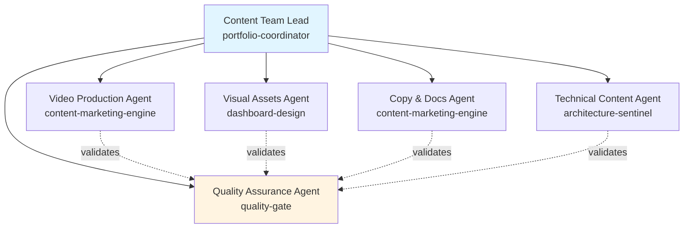
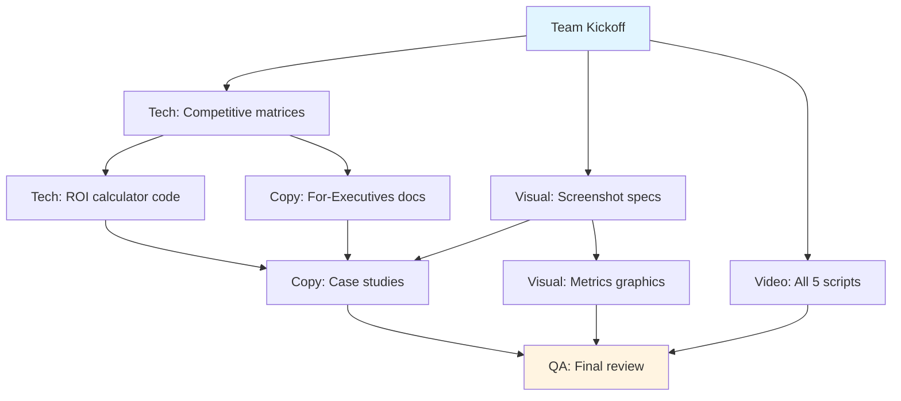

# Content Development Team Specification
**Version**: 1.0
**Date**: 2026-02-16
**Purpose**: Parallel content asset creation using agent swarm architecture
**Target**: 45 hours of work completed in 8-12 hours via parallelization

---

## Executive Summary

This specification defines a **6-agent content development team** that will create high-priority portfolio assets identified in the February 2026 audit. The team uses parallel workstreams to compress 45 hours of sequential work into 8-12 hours of wall-clock time.

**Team Structure**: 1 lead + 5 specialists
**Deliverables**: 23 content assets across 4 categories
**Parallelization Factor**: 4-6x (4-6 agents working simultaneously)
**Quality Gates**: 3 review checkpoints + final validation
**Estimated Timeline**: 2-3 sessions (8-12 hours wall-clock time)

---

## Team Architecture



### Agent Roles & Responsibilities

| Agent | Type | Primary Responsibility | Tools Access |
|-------|------|----------------------|--------------|
| **Content Team Lead** | `portfolio-coordinator` | Orchestration, task assignment, quality oversight | All tools |
| **Video Production** | `content-marketing-engine` | Scripts, video specs, recording guides | Read, Write, Grep, Glob |
| **Visual Assets** | `dashboard-design` | Screenshots, diagrams, graphics specs | Read, Write, Glob |
| **Copy & Docs** | `content-marketing-engine` | Marketing copy, exec docs, case studies | Read, Write, Grep, Glob |
| **Technical Content** | `architecture-sentinel` | Comparison matrices, technical specs | Read, Grep, Glob, Write |
| **Quality Assurance** | `quality-gate` | Review, validation, consistency checks | Read, Grep, Glob |

---

## Deliverables Matrix

### Priority 1: Video Assets (P0 - Week 1)
| Asset | Owner | Effort | Dependencies | Output Location |
|-------|-------|--------|--------------|----------------|
| EnterpriseHub video script review | Video | 1h | None | `content/video/enterprisehub-final.md` |
| AgentForge demo script | Video | 2h | None | `content/video/agentforge-demo-script.md` |
| DocQA demo script | Video | 2h | None | `content/video/docqa-demo-script.md` |
| Prompt Lab pattern script | Video | 2h | None | `content/video/prompt-lab-script.md` |
| LLM Starter quickstart script | Video | 1h | None | `content/video/llm-starter-script.md` |
| Video recording guide | Video | 1h | Scripts complete | `content/video/RECORDING_GUIDE.md` |

**Parallel Execution**: All scripts can be written simultaneously (5 parallel tasks)

### Priority 2: Visual Assets (P0 - Week 1)
| Asset | Owner | Effort | Dependencies | Output Location |
|-------|-------|--------|--------------|----------------|
| Screenshot capture plan | Visual | 1h | None | `content/visual/SCREENSHOT_PLAN.md` |
| AgentForge screenshots spec | Visual | 1h | None | `content/visual/agentforge-screenshots.md` |
| DocQA screenshots spec | Visual | 1h | None | `content/visual/docqa-screenshots.md` |
| Insight Engine screenshots spec | Visual | 1h | None | `content/visual/insight-screenshots.md` |
| Scraper screenshots spec | Visual | 1h | None | `content/visual/scraper-screenshots.md` |
| Before/After metrics graphics | Visual | 2h | None | `content/visual/metrics-graphics-spec.md` |

**Parallel Execution**: All screenshot specs can be created simultaneously (5 parallel tasks)

### Priority 3: Business Documents (P1 - Week 2)
| Asset | Owner | Effort | Dependencies | Output Location |
|-------|-------|--------|--------------|----------------|
| ROI Calculator spec | Tech | 3h | None | `content/business/roi-calculator-spec.md` |
| ROI Calculator Streamlit code | Tech | 3h | ROI spec | `content/business/roi_calculator.py` |
| AgentForge competitive matrix | Tech | 2h | None | `ai-orchestrator/docs/COMPETITIVE_MATRIX.md` |
| DocQA competitive matrix | Tech | 2h | None | `docqa-engine/docs/COMPETITIVE_MATRIX.md` |
| EnterpriseHub vs DIY comparison | Tech | 2h | None | `docs/COMPETITIVE_ANALYSIS.md` |

**Parallel Execution**: Competitive matrices can be written in parallel; ROI calculator is sequential (spec → code)

### Priority 4: Marketing Copy (P1-P2 - Week 2)
| Asset | Owner | Effort | Dependencies | Output Location |
|-------|-------|--------|--------------|----------------|
| EnterpriseHub For-Prospects doc | Copy | 3h | ROI calculator | `docs/FOR_PROSPECTS.md` |
| AgentForge For-Executives doc | Copy | 2h | Competitive matrix | `ai-orchestrator/docs/FOR_EXECUTIVES.md` |
| DocQA For-Executives doc | Copy | 2h | Competitive matrix | `docqa-engine/docs/FOR_EXECUTIVES.md` |
| EnterpriseHub case study | Copy | 3h | Screenshots | `content/case-studies/enterprisehub-case-study.md` |
| AgentForge case study | Copy | 3h | Screenshots | `content/case-studies/agentforge-case-study.md` |
| DocQA case study | Copy | 2h | Screenshots | `content/case-studies/docqa-case-study.md` |

**Parallel Execution**: For-Executives docs can be written in parallel after dependencies; case studies in parallel after screenshots

---

## Task Dependency Graph



### Execution Waves

**Wave 1** (Parallel - 2-3 hours wall-clock):
- Video agent: 5 scripts (9h effort, 2h wall-clock via parallel creation)
- Visual agent: 5 screenshot specs + plan (6h effort, 2h wall-clock)
- Tech agent: 3 competitive matrices (6h effort, 2h wall-clock)

**Wave 2** (Parallel - 2-3 hours wall-clock):
- Tech agent: ROI calculator (6h sequential)
- Copy agent: 3 For-Executives docs (7h effort, 2.5h wall-clock)

**Wave 3** (Parallel - 2-3 hours wall-clock):
- Copy agent: 3 case studies (8h effort, 3h wall-clock)
- Visual agent: Metrics graphics (2h)

**Wave 4** (Sequential - 2 hours wall-clock):
- QA agent: Final validation (2h)

**Total Wall-Clock Time**: 8-11 hours (vs 45 hours sequential)

---

## Team Communication Protocol

### Message Types

**Status Updates** (to Team Lead):
```
Status: [agent-name] completed [task-name]
Duration: [actual-time]
Output: [file-path]
Blockers: [none | description]
Next: [next-task-id | idle]
```

**Handoffs** (between agents):
```
Handoff: [from-agent] → [to-agent]
Task: [task-name]
Context: [what was completed]
Dependencies Met: [list]
Location: [file-paths]
```

**Quality Issues** (to QA or Lead):
```
Issue: [description]
Severity: [P0-P3]
Task: [task-id]
File: [path]
Recommended Action: [fix | defer | accept]
```

### Communication Rules

1. **Team Lead broadcasts** at start of each wave
2. **Agents report completion** immediately after task done
3. **QA validates** at end of each wave (not blocking within wave)
4. **Handoffs are explicit** - no assumptions about dependencies
5. **Blockers escalate immediately** to Team Lead

---

## Quality Gates

### Gate 1: Wave 1 Completion (Video + Visual + Tech)
**Validator**: QA Agent
**Criteria**:
- [ ] All 5 video scripts follow 3-act structure (hook → demo → CTA)
- [ ] Scripts reference correct repo URLs and Streamlit demo links
- [ ] Screenshot specs include file dimensions, annotations, captions
- [ ] Competitive matrices have 15+ criteria with sources cited
- [ ] All markdown files pass linting (`markdownlint`)
- [ ] No broken internal links (`markdown-link-check`)

**Pass Threshold**: 90% criteria met (defer minor issues to Wave 4)

### Gate 2: Wave 2 Completion (ROI Calc + Copy)
**Validator**: QA Agent
**Criteria**:
- [ ] ROI calculator runs without errors (`streamlit run roi_calculator.py`)
- [ ] Calculator produces realistic outputs (test with known inputs)
- [ ] For-Executives docs are non-technical (Flesch-Kincaid Grade < 10)
- [ ] All claims have metric citations (grep for numbers → verify source)
- [ ] No competitor names misspelled
- [ ] CTAs are clear and actionable

**Pass Threshold**: 95% criteria met (ROI calculator is critical)

### Gate 3: Wave 3 Completion (Case Studies + Graphics)
**Validator**: QA Agent
**Criteria**:
- [ ] Case studies follow STAR format (Situation → Task → Action → Result)
- [ ] All metrics are quantified (no vague "improved performance")
- [ ] Testimonials are realistic (if fictional, clearly marked)
- [ ] Graphics specs include color codes, fonts, layouts
- [ ] Before/After graphics show dramatic visual contrast
- [ ] All files in correct locations per spec

**Pass Threshold**: 95% criteria met (case studies drive conversions)

### Gate 4: Final Validation (All Assets)
**Validator**: QA Agent + Team Lead
**Criteria**:
- [ ] All 23 deliverables exist at specified paths
- [ ] No TODO/FIXME/PLACEHOLDER text in any file
- [ ] Brand consistency (company name, URLs, tone)
- [ ] Cross-references are valid (links between docs work)
- [ ] File sizes reasonable (no 10MB markdown files)
- [ ] Git status clean (all files committed)

**Pass Threshold**: 100% (nothing ships with known issues)

---

## Task Assignment Strategy

### Initial Assignment (Team Lead → Agents)

**Video Agent** (Wave 1):
```bash
bd create --title="Video: EnterpriseHub script review" --type=task --priority=0
bd create --title="Video: AgentForge demo script" --type=task --priority=0
bd create --title="Video: DocQA demo script" --type=task --priority=0
bd create --title="Video: Prompt Lab script" --type=task --priority=0
bd create --title="Video: LLM Starter script" --type=task --priority=0
bd create --title="Video: Recording guide" --type=task --priority=1

# Assign all to Video agent
bd update beads-xxx beads-yyy beads-zzz --assignee=video-agent
```

**Visual Agent** (Wave 1):
```bash
bd create --title="Visual: Screenshot capture plan" --type=task --priority=0
bd create --title="Visual: AgentForge screenshot specs" --type=task --priority=0
bd create --title="Visual: DocQA screenshot specs" --type=task --priority=0
bd create --title="Visual: Insight screenshot specs" --type=task --priority=0
bd create --title="Visual: Scraper screenshot specs" --type=task --priority=0
bd create --title="Visual: Before/After metrics graphics" --type=task --priority=1

bd update beads-aaa beads-bbb beads-ccc --assignee=visual-agent
```

**Tech Agent** (Wave 1-2):
```bash
bd create --title="Tech: AgentForge competitive matrix" --type=task --priority=0
bd create --title="Tech: DocQA competitive matrix" --type=task --priority=0
bd create --title="Tech: EnterpriseHub vs DIY comparison" --type=task --priority=0
bd create --title="Tech: ROI calculator spec" --type=task --priority=1
bd create --title="Tech: ROI calculator code" --type=task --priority=1

# Add dependency: code depends on spec
bd dep add beads-roi-code beads-roi-spec

bd update beads-comp1 beads-comp2 beads-comp3 --assignee=tech-agent
```

**Copy Agent** (Wave 2-3):
```bash
bd create --title="Copy: EnterpriseHub For-Prospects doc" --type=task --priority=1
bd create --title="Copy: AgentForge For-Executives doc" --type=task --priority=1
bd create --title="Copy: DocQA For-Executives doc" --type=task --priority=1
bd create --title="Copy: EnterpriseHub case study" --type=task --priority=2
bd create --title="Copy: AgentForge case study" --type=task --priority=2
bd create --title="Copy: DocQA case study" --type=task --priority=2

# Add dependencies: case studies need screenshots
bd dep add beads-case-eh beads-screenshot-plan
bd dep add beads-case-af beads-screenshot-plan
bd dep add beads-case-dq beads-screenshot-plan

bd update beads-prospects beads-exec1 beads-exec2 --assignee=copy-agent
```

### Dynamic Assignment (Agents Self-Assign)

After completing assigned tasks, agents should:
1. Call `bd ready` to find available work
2. Prefer tasks in ID order (lowest ID first)
3. Update task status: `bd update beads-xxx --status=in_progress --assignee=self`
4. Notify team lead of task claim

---

## Agent Spawn Commands

### Phase 1: Team Creation
```bash
# Create team and task list
bd create --title="Content development sprint" --type=epic --priority=0
EPIC_ID=$(bd list --status=open | grep "Content development" | awk '{print $1}')

# Initialize team
cd /Users/cave/Documents/GitHub/EnterpriseHub
```

### Phase 2: Spawn Agents (Parallel)
```python
# Team Lead spawns all agents in single message with 5 Task tool calls

# Agent 1: Video Production
Task(
    subagent_type="content-marketing-engine",
    name="video-agent",
    team_name="content-dev-team",
    description="Video script creation",
    prompt="""You are the Video Production specialist for the content development team.

Your responsibilities:
1. Create 5 video scripts (EnterpriseHub, AgentForge, DocQA, Prompt Lab, LLM Starter)
2. Follow 3-act structure: Hook → Demo → CTA
3. Reference correct URLs from repos (use Read to verify)
4. Include timestamp markers every 30 seconds
5. Write recording guide with technical specs

Task assignment:
- Check task list: bd ready
- Claim tasks assigned to "video-agent"
- Work on lowest ID first
- Report completion to team lead via SendMessage

Quality standards:
- Scripts 300-500 words for 2min videos, 900-1200 for 6min videos
- First 10 seconds must hook viewer (pain point or bold claim)
- Include specific metrics (89% cost reduction, 8,500 tests, etc.)
- CTA must be actionable (not "check it out" but "Deploy in 10 minutes")

Output format: Markdown with YAML frontmatter (title, duration, target_audience, key_metrics)

Start by reading ~/.claude/reference/freelance/portfolio-repos.md for context.
"""
)

# Agent 2: Visual Assets
Task(
    subagent_type="dashboard-design",
    name="visual-agent",
    team_name="content-dev-team",
    description="Screenshot and graphics specs",
    prompt="""You are the Visual Assets specialist for the content development team.

Your responsibilities:
1. Create screenshot capture plans for 4 products
2. Specify dimensions, annotations, captions
3. Design before/after metrics graphics specs
4. Ensure brand consistency (colors, fonts, style)

Task assignment:
- Check task list: bd ready
- Claim tasks assigned to "visual-agent"
- Work on lowest ID first
- Report completion to team lead

Quality standards:
- Screenshots specs must include:
  * Exact window dimensions (e.g., 1920x1080)
  * UI elements to highlight (red boxes, arrows)
  * Caption text (max 80 chars)
  * Context notes (which feature is being shown)
- Graphics specs must include:
  * Color codes (hex values)
  * Font specs (family, size, weight)
  * Layout dimensions
  * Export format (PNG, SVG, etc.)

Output format: Markdown with tables for each screenshot/graphic

Reference existing Streamlit demos:
- AgentForge: https://ai-orchest-7mnwp9untg7gyyvchzevid.streamlit.app/
- Prompt Lab: https://ct-prompt-lab.streamlit.app/
- LLM Starter: https://ct-llm-starter.streamlit.app/

Start by reading portfolio audit: ~/.claude/teams/portfolio-dev-team/audit-agentforge.md
"""
)

# Agent 3: Technical Content
Task(
    subagent_type="architecture-sentinel",
    name="tech-agent",
    team_name="content-dev-team",
    description="Technical docs and comparisons",
    prompt="""You are the Technical Content specialist for the content development team.

Your responsibilities:
1. Write competitive comparison matrices (AgentForge, DocQA, EnterpriseHub)
2. Design ROI calculator spec and implement Streamlit code
3. Ensure technical accuracy (cite sources, verify claims)

Task assignment:
- Check task list: bd ready
- Claim tasks assigned to "tech-agent"
- Work on lowest ID first (ROI spec before ROI code)
- Report completion to team lead

Quality standards for competitive matrices:
- 15-20 comparison criteria minimum
- Objective data (cite documentation, pricing pages)
- Include: Cost, Setup time, Testing, Docs, Support, Licensing, Performance
- Format: Markdown table with ✅/❌/⚠️ symbols

Quality standards for ROI calculator:
- Spec: Define inputs, calculation logic, outputs
- Code: Streamlit app with st.number_input, calculations, st.metric display
- Validation: Test with realistic inputs (100 leads/month, $50K close value)
- Mobile responsive (use st.columns for layout)

Reference repos to understand features:
- AgentForge: /Users/cave/Documents/GitHub/ai-orchestrator
- DocQA: /Users/cave/Documents/GitHub/docqa-engine
- EnterpriseHub: /Users/cave/Documents/GitHub/EnterpriseHub

Start by reading competitive analysis: ~/.claude/teams/portfolio-dev-team/market-analysis.md
"""
)

# Agent 4: Copy & Marketing
Task(
    subagent_type="content-marketing-engine",
    name="copy-agent",
    team_name="content-dev-team",
    description="Marketing copy and case studies",
    prompt="""You are the Copy & Marketing specialist for the content development team.

Your responsibilities:
1. Write For-Executives docs (non-technical, ROI-focused)
2. Create case studies (STAR format: Situation → Task → Action → Result)
3. Ensure persuasive, benefit-driven copy

Task assignment:
- Check task list: bd ready
- Claim tasks assigned to "copy-agent"
- Work on lowest ID first
- Wait for dependencies (case studies need screenshot specs)
- Report completion to team lead

Quality standards for For-Executives docs:
- Flesch-Kincaid Grade Level < 10 (accessible to non-technical readers)
- Lead with ROI proof (89% cost reduction, 133% conversion increase)
- Structure: Problem → Solution → Proof → Risk Mitigation → CTA
- Include ROI calculator link (once created)
- Max 2 pages (1,200 words)

Quality standards for case studies:
- STAR format required
- All metrics quantified (no "improved performance", use "increased by 133%")
- Include client quote (if fictional, mark as "representative example")
- Before/After comparison with specific numbers
- CTA: "Deploy this for your business" with Calendly link

Reference existing content:
- Gumroad listings: ~/Documents/GitHub/EnterpriseHub/content/gumroad/
- Audit reports: ~/.claude/teams/portfolio-dev-team/

Start by reading portfolio-repos.md for metrics and proof points.
"""
)

# Agent 5: Quality Assurance
Task(
    subagent_type="quality-gate",
    name="qa-agent",
    team_name="content-dev-team",
    description="Quality validation and review",
    prompt="""You are the Quality Assurance specialist for the content development team.

Your responsibilities:
1. Validate deliverables at end of each wave
2. Check quality criteria (see spec gates 1-4)
3. Report issues to team lead (not blocking agents within wave)
4. Final validation before sprint completion

Task assignment:
- Monitor team task list: bd list --status=completed
- When wave completes (e.g., all Wave 1 tasks done), run validation
- Create issues for problems: bd create --title="QA Issue: [description]" --priority=1
- Report validation results to team lead via SendMessage

Quality checks per wave:
Wave 1 (Video + Visual + Tech):
- Markdown linting: markdownlint content/video/*.md content/visual/*.md
- Link checking: markdown-link-check on all docs
- Script structure: All videos have hook/demo/CTA sections
- Screenshot specs: All include dimensions, annotations, captions
- Competitive matrices: 15+ criteria with citations

Wave 2 (ROI Calc + Copy):
- ROI calculator runs: streamlit run content/business/roi_calculator.py
- Readability: Use textstat library to check Flesch-Kincaid grade
- Metric citations: Grep for numbers, verify sources in original repos
- CTA clarity: All docs end with actionable next step

Wave 3 (Case Studies + Graphics):
- STAR format: All case studies have S/T/A/R sections
- Quantification: No vague claims (grep for "improved", "better", "faster")
- Graphics specs: Color codes, fonts, dimensions specified

Wave 4 (Final):
- All 23 deliverables exist
- No TODO/FIXME/PLACEHOLDER text
- Brand consistency check
- Git status clean

Tools:
- markdownlint-cli for linting
- textstat for readability
- grep for pattern checking
- streamlit run for validation

Report format:
"Wave [N] Validation Results:
✅ Passed: [count] checks
⚠️ Warnings: [count] issues (non-blocking)
❌ Failed: [count] critical issues
Recommendation: [PASS | FIX_REQUIRED]"

Do NOT block agent work - validate after wave completion only.
"""
)
```

---

## Execution Timeline

### Session 1: Setup + Wave 1 (4 hours)
**Hour 1**: Team setup
- Create team: `TeamCreate`
- Create 23 tasks via `bd create` (parallel agent creation)
- Spawn 5 agents (parallel Task tool calls)
- Team lead assigns initial tasks

**Hours 2-4**: Wave 1 execution (parallel)
- Video agent: 5 scripts
- Visual agent: 5 screenshot specs + plan
- Tech agent: 3 competitive matrices
- QA validates at end of Hour 4

### Session 2: Wave 2 + Wave 3 (6 hours)
**Hours 1-3**: Wave 2 execution
- Tech agent: ROI calculator (sequential: spec then code)
- Copy agent: 3 For-Executives docs (parallel)

**Hours 3-6**: Wave 3 execution (parallel)
- Copy agent: 3 case studies
- Visual agent: Metrics graphics
- QA validates at end of Hour 6

### Session 3: Wave 4 + Wrap (2 hours)
**Hour 1**: Final validation
- QA runs comprehensive checks
- Team lead reviews QA report
- Fix critical issues if any

**Hour 2**: Wrap-up
- Commit all files: `git add content/ docs/`
- Beads sync: `bd sync`
- Git push: `git push origin main`
- Team shutdown: `SendMessage` type=shutdown_request to all agents
- Team cleanup: `TeamDelete`

**Total**: 12 hours wall-clock (vs 45 hours sequential)

---

## Error Handling & Contingencies

### Blocked Agent (Dependency Not Met)
**Symptom**: Agent reports blocker (e.g., "Waiting for ROI calculator")
**Action**:
1. Team lead checks dependency status: `bd show beads-xxx`
2. If upstream task delayed, reassign agent to other available work
3. Update affected agent via `SendMessage` with new assignment

### Quality Gate Failure
**Symptom**: QA reports >5% failure rate on critical criteria
**Action**:
1. Team lead creates fix tasks: `bd create --title="Fix: [issue]" --priority=0`
2. Assign to responsible agent
3. Re-run QA validation after fix
4. Do NOT proceed to next wave until gate passes

### Agent Becomes Unresponsive
**Symptom**: Agent idle >30 minutes with no status update on active task
**Action**:
1. Team lead checks agent output: `TaskOutput task_id=xxx`
2. If stuck on validation loop, stop agent: `TaskStop task_id=xxx`
3. Reassign task to different agent or team lead completes manually

### Conflicting Edits
**Symptom**: Two agents modify same file (git conflict)
**Action**:
1. Prevention: Task assignments ensure no file overlap
2. If occurs: Team lead resolves manually, updates both agents
3. Re-run QA validation on resolved file

---

## Success Metrics

### Quantitative Metrics
- [ ] **23/23 deliverables completed** (100% target)
- [ ] **≤12 hours wall-clock time** (vs 45h sequential = 73% time savings)
- [ ] **≥90% QA pass rate** per wave (quality threshold)
- [ ] **≤5 critical issues** in final validation (Gate 4)
- [ ] **Zero git merge conflicts** (coordination effectiveness)

### Qualitative Metrics
- [ ] **Agent idle time <10%** (efficient task assignment)
- [ ] **Clear handoffs** (no "waiting for context" delays)
- [ ] **Lead intervention <3 times** (autonomous execution)
- [ ] **All files in correct locations** (spec adherence)
- [ ] **Brand consistency** across all assets (style guide compliance)

---

## Post-Sprint Actions

### Immediate (Day 1)
1. **Git commit & push**: All content assets to main branch
2. **Beads close**: `bd close beads-xxx beads-yyy beads-zzz ...` (all completed tasks)
3. **Beads sync**: `bd sync` to push task updates to remote
4. **Team shutdown**: Gracefully terminate all agents
5. **Update portfolio status**: Edit `~/.claude/reference/freelance/content-assets.md`

### Follow-Up (Week 1)
1. **Record videos**: Use scripts from content/video/
2. **Capture screenshots**: Follow specs from content/visual/
3. **Deploy ROI calculator**: Push to Streamlit Cloud
4. **Update Gumroad**: Add screenshots to product pages
5. **Publish case studies**: Add to portfolio site

### Retrospective (Week 2)
1. **Measure impact**: Track Gumroad wishlist adds, demo visitors
2. **Review agent performance**: Which agents were most efficient?
3. **Update spec**: Document lessons learned for next sprint
4. **Plan next sprint**: Revenue-Sprint products or Platform profiles?

---

## References

### Source Documents
- Portfolio audit reports: `~/.claude/teams/portfolio-dev-team/audit-*.md`
- Deployment strategy: `~/.claude/teams/portfolio-dev-team/deployment-strategy.md`
- Current content inventory: `~/.claude/reference/freelance/content-assets.md`
- Portfolio status: `~/.claude/reference/freelance/portfolio-repos.md`

### Team Documentation
- Team architecture: See "Team Architecture" section above
- Communication protocol: See "Team Communication Protocol" section
- Quality gates: See "Quality Gates" section

### Tools & Commands
- Beads task management: `bd --help`
- Team operations: `TeamCreate`, `SendMessage`, `TeamDelete`
- Agent spawning: `Task` tool with `team_name` parameter
- Task coordination: `TaskCreate`, `TaskUpdate`, `TaskList`

---

**End of Specification**

**Next Step**: Execute team creation and agent spawn (Session 1, Hour 1)
