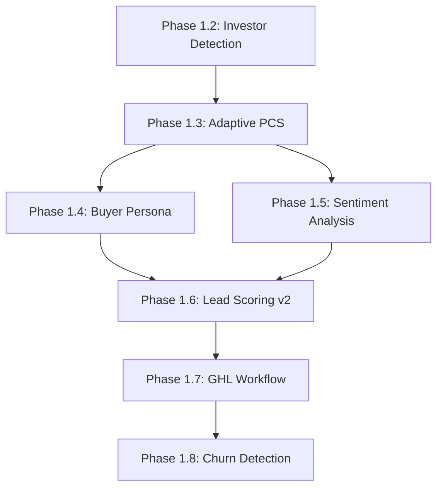

# EnterpriseHub Bot Development Specification
## Phase 1.4 - 1.8 Implementation Guide

**Document Version:** 1.0  
**Created:** February 2026  
**Status:** Ready for Implementation  
**Previous Phases Completed:** 1.2 (Investor/Distressed Seller Detection), 1.3 (Adaptive PCS Calculation)

---

## Executive Summary

This specification document outlines the comprehensive bot development roadmap for EnterpriseHub's AI-powered real estate chatbot system. Building upon the completed Phase 1.2 and 1.3 implementations, this document defines five new phases that enhance bot intelligence, personalization, and CRM integration capabilities.

### Current System State

- **Stack:** FastAPI, Streamlit BI, PostgreSQL + Alembic, Redis (L1/L2/L3 cache), Claude + Gemini + Perplexity AI, GoHighLevel CRM
- **Existing Bots:** Lead Bot, Buyer Bot (JorgeBuyerBot), Seller Bot (JorgeSellerBot)
- **Completed Features:** Investor/Distressed Seller Detection, Adaptive PCS Calculation, Cross-Bot Handoffs
- **Architecture Pattern:** LangGraph StateGraph for workflow orchestration

### Proposed Enhancements

| Phase | Feature | Impact |
|-------|---------|--------|
| 1.4 | Buyer Persona Classification | Response personalization by buyer type |
| 1.5 | Sentiment Analysis Integration | Emotion-aware responses, escalation triggers |
| 1.6 | Lead Scoring v2 | Composite scoring with confidence intervals |
| 1.7 | GHL Workflow Integration | Auto-tagging, pipeline sync, appointment booking |
| 1.8 | Churn Detection & Recovery | Stalled conversation recovery, re-engagement |

---

## Phase 1.4: Buyer Persona Classification

### Overview

Implement intelligent buyer persona detection to tailor responses based on buyer motivation and lifecycle stage. This enables personalized communication strategies for different buyer types.

### Feature Specifications

#### 1.4.1 Persona Types

| Persona | Description | Key Characteristics |
|---------|-------------|---------------------|
| **First-Time Buyer** | Never owned property | Needs education, cautious, validation-seeking |
| **Upsizer** | Moving to larger property | Growing family, space needs, equity leverage |
| **Downsizer** | Reducing living space | Empty nest, maintenance reduction, equity access |
| **Investor** | Purchasing for ROI | Cash flow focus, numbers-driven, deal-focused |
| **Relocator** | Job/region change | Time pressure, area unfamiliarity |
| **Luxury Buyer** | High-end purchase | Amenity focus, slower decision process |

#### 1.4.2 Detection Signals

**Keyword-Based Signals:**
```
First-Time Buyer: ["first home", "new to buying", "never owned", "what do i need", "how does buying work", "excited but nervous"]
Upsizer: ["more space", "growing family", "outgrown", "bigger", "additional bedroom", "need room"]
Downsizer: ["too much space", "maintenance", "downsize", "simpler", "empty nest", "less cleaning"]
Investor: ["rental", "rental income", "roi", "return on investment", "cash flow", "tenant", "deal"]
Relocator: ["relocating", "moving to", "new job", "transfer", "area", "different city"]
Luxury Buyer: ["high-end", "premium", "amenities", "view", "custom", "executive"]
```

**Behavioral Signals:**
- Question patterns (educational vs. transactional)
- Response length and detail preferences
- Timeline urgency indicators
- Budget discussion openness
- Property feature priorities

### Technical Implementation

#### 1.4.3 New Service: `BuyerPersonaService`

**Location:** `ghl_real_estate_ai/services/buyer_persona_service.py`

```python
from enum import Enum
from pydantic import BaseModel
from typing import List, Dict, Optional
from dataclasses import dataclass

class BuyerPersona(str, Enum):
    FIRST_TIME = "first_time"
    UPSIZER = "upsizer"
    DOWNSIZER = "downsizer"
    INVESTOR = "investor"
    RELOCATOR = "relocator"
    LUXURY = "luxury"
    UNKNOWN = "unknown"

@dataclass
class PersonaSignals:
    persona: BuyerPersona
    confidence: float  # 0.0-1.0
    detected_keywords: List[str]
    behavioral_signals: Dict[str, float]
    primary_indicators: List[str]
    secondary_indicators: List[str]

class BuyerPersonaService:
    KEYWORD_PATTERNS: Dict[BuyerPersona, List[str]]
    BEHAVIORAL_WEIGHTS: Dict[str, float]
    
    async def classify_persona(
        self,
        conversation_history: List[ConversationMessage],
        lead_data: Optional[Dict] = None
    ) -> PersonaSignals:
        """Classify buyer into persona category."""
        
    async def update_persona(
        self,
        contact_id: str,
        new_conversation: List[ConversationMessage]
    ) -> PersonaSignals:
        """Re-classify with new conversation data."""
        
    async def get_persona_insights(
        self,
        persona: BuyerPersona
    ) -> Dict[str, str]:
        """Get communication recommendations per persona."""
```

#### 1.4.4 Response Tailoring Matrix

| Persona | Tone | Content Focus | Urgency Level | Key Messages |
|---------|------|---------------|---------------|---------------|
| First-Time | Encouraging, supportive | Educational, step-by-step | Moderate | "Here's how it works", validation of concerns |
| Upsizer | Efficient, family-focused | Space solutions, equity info | High | "Maximize your investment", "Room for growth" |
| Downsizer | Empathetic, simplifying | Maintenance reduction, equity | Moderate | "Simplify your life", "Access your equity" |
| Investor | Professional, data-driven | ROI analysis, cash flow | Low-Medium | "Numbers breakdown", "Deal analysis" |
| Relocator | Direct, informative | Area info, timeline | High | "Area insights", "Smooth transition" |
| Luxury | Sophisticated, exclusive | Amenities, lifestyle | Low | "Premium experience", "Exclusive properties" |

#### 1.4.5 Bot Integration Points

**JorgeBuyerBot Enhancement:**
```python
# In jorge_buyer_bot.py - analyze_buyer_intent method
async def analyze_buyer_intent(self, state: BuyerBotState) -> Dict:
    # Existing analysis...
    
    # NEW: Persona classification
    persona_service = BuyerPersonaService()
    persona_signals = await persona_service.classify_persona(
        conversation_history=conversation_history,
        lead_data=state.get("lead_data")
    )
    
    # Tailor response based on persona
    response_template = self._get_persona_response_template(persona_signals.persona)
    
    return {
        # Existing fields...
        "persona": persona_signals.persona,
        "persona_confidence": persona_signals.confidence,
        "persona_signals": persona_signals.detected_keywords,
        "tailored_response_style": response_template,
    }
```

### Database Schema Updates

```sql
-- New table for persona tracking
CREATE TABLE buyer_personas (
    id UUID PRIMARY KEY DEFAULT gen_random_uuid(),
    contact_id UUID NOT NULL REFERENCES contacts(id),
    persona VARCHAR(50) NOT NULL,
    confidence DECIMAL(3,2) NOT NULL,
    detected_keywords JSONB DEFAULT '[]',
    behavioral_signals JSONB DEFAULT '{}',
    conversation_turns INT DEFAULT 0,
    last_updated TIMESTAMP WITH TIME ZONE DEFAULT NOW(),
    created_at TIMESTAMP WITH TIME ZONE DEFAULT NOW(),
    UNIQUE(contact_id)
);

CREATE INDEX idx_buyer_personas_contact ON buyer_personas(contact_id);
CREATE INDEX idx_buyer_personas_persona ON buyer_personas(persona);
```

### API Changes

**New Endpoint:** `POST /api/v1/bots/persona/classify`

```python
from fastapi import APIRouter, HTTPException
from pydantic import BaseModel

router = APIRouter(prefix="/persona", tags=["Persona"])

class PersonaClassifyRequest(BaseModel):
    contact_id: str
    conversation_history: List[ConversationMessage]
    lead_data: Optional[Dict] = None

class PersonaClassifyResponse(BaseModel):
    contact_id: str
    persona: str
    confidence: float
    detected_keywords: List[str]
    recommendations: Dict[str, str]

@router.post("/classify", response_model=PersonaClassifyResponse)
async def classify_buyer_persona(request: PersonaClassifyRequest):
    """Classify or update buyer persona classification."""
```

### Acceptance Criteria

- [ ] Persona classification accuracy >= 80% (validated against labeled dataset)
- [ ] Response time < 100ms for classification
- [ ] All 6 persona types detected with confidence scores
- [ ] Bot responses tailored per persona (subjective evaluation)
- [ ] Persona updates dynamically as conversation progresses
- [ ] Integration tests cover all persona types

### Testing Strategy

```python
# tests/test_buyer_persona.py
import pytest
from ghl_real_estate_ai.services.buyer_persona_service import (
    BuyerPersonaService,
    BuyerPersona
)

@pytest.fixture
def persona_service():
    return BuyerPersonaService()

@pytest.mark.asyncio
async def test_first_time_buyer_detection(persona_service):
    conversation = [
        {"role": "user", "content": "I'm looking to buy my first home, never done this before"},
        {"role": "assistant", "content": "Congratulations! Here's how buying works..."},
        {"role": "user", "content": "What do I need to know about down payments?"},
    ]
    result = await persona_service.classify_persona(conversation)
    assert result.persona == BuyerPersona.FIRST_TIME
    assert result.confidence >= 0.7

@pytest.mark.asyncio
async def test_investor_detection(persona_service):
    conversation = [
        {"role": "user", "content": "I'm looking for rental properties with good cash flow"},
        {"role": "user", "content": "What's the ROI on single-family homes in this area?"},
    ]
    result = await persona_service.classify_persona(conversation)
    assert result.persona == BuyerPersona.INVESTOR
```

---

## Phase 1.5: Sentiment Analysis Integration

### Overview

Integrate emotion detection capabilities into all bot conversations to enable sentiment-aware responses and automatic escalation triggers for negative sentiment situations.

### Feature Specifications

#### 1.5.1 Emotion Categories

| Emotion | Description | Bot Response |
|---------|-------------|--------------|
| **Positive** | Happy, excited, satisfied | Reinforce, continue engagement |
| **Neutral** | Calm, informational | Professional, helpful |
| **Anxious** | Worried, uncertain | Empathetic, reassuring |
| **Frustrated** | Annoyed, impatient | Apologize, de-escalate |
| **Angry** | Irritated, upset | Escalate to human agent |
| **Disappointed** | Let down, dissatisfied | Acknowledge, offer solutions |
| **Confused** | Unclear, seeking help | Clarify, simplify |

#### 1.5.2 Escalation Triggers

| Trigger Condition | Action | Priority |
|-----------------|--------|----------|
| Anger detected + 2+ messages | Immediate human handoff | CRITICAL |
| Frustration score > 0.8 | Offer human transfer | HIGH |
| Repeated negative sentiment | Log, monitor closely | MEDIUM |
| Confusion without resolution | Simplify explanations | LOW |
| Any sentiment + "lawyer"/"sue"/"complaint" | Alert compliance team | CRITICAL |

### Technical Implementation

#### 1.5.3 New Service: `SentimentAnalysisService`

**Location:** `ghl_real_estate_ai/services/sentiment_analysis_service.py`

```python
from enum import Enum
from pydantic import BaseModel
from typing import List, Dict, Optional
from dataclasses import dataclass
from datetime import datetime

class SentimentType(str, Enum):
    POSITIVE = "positive"
    NEUTRAL = "neutral"
    ANXIOUS = "anxious"
    FRUSTRATED = "frustrated"
    ANGRY = "angry"
    DISAPPOINTED = "disappointed"
    CONFUSED = "confused"

class EscalationLevel(str, Enum):
    NONE = "none"
    MONITOR = "monitor"
    HUMAN_HANDOFF = "human_handoff"
    CRITICAL = "critical"

@dataclass
class SentimentResult:
    sentiment: SentimentType
    confidence: float  # 0.0-1.0
    intensity: float  # 0.0-1.0
    key_phrases: List[str]
    escalation_required: EscalationLevel
    suggested_response_tone: str
    timestamp: datetime

@dataclass
class ConversationSentiment:
    overall_sentiment: SentimentType
    sentiment_trend: str  # "improving", "stable", "declining"
    message_results: List[SentimentResult]
    escalation_history: List[Dict]
    avg_confidence: float

class SentimentAnalysisService:
    """Analyzes sentiment in conversation messages."""
    
    NEGATIVE_KEYWORDS = {
        "angry": ["hate", "terrible", "awful", "worst", "ridiculous", "unacceptable"],
        "frustrated": ["frustrating", "annoying", "fed up", "again", "still waiting"],
        "anxious": ["worried", "concerned", "nervous", "afraid", "not sure"],
        "disappointed": ["disappointed", "let down", "expected better", "unhappy"],
        "confused": ["confused", "don't understand", "unclear", "what does this mean"],
    }
    
    ESCALATION_TRIGGERS = [
        (SentimentType.ANGRY, 0.7, EscalationLevel.CRITICAL),
        (SentimentType.ANGRY, 0.5, EscalationLevel.HUMAN_HANDOFF),
        (SentimentType.FRUSTRATED, 0.8, EscalationLevel.HUMAN_HANDOFF),
        (SentimentType.FRUSTRATED, 0.6, EscalationLevel.MONITOR),
        (SentimentType.DISAPPOINTED, 0.8, EscalationLevel.HUMAN_HANDOFF),
    ]
    
    async def analyze_message(
        self,
        message: str,
        conversation_history: Optional[List[str]] = None
    ) -> SentimentResult:
        """Analyze sentiment of a single message."""
        
    async def analyze_conversation(
        self,
        messages: List[ConversationMessage]
    ) -> ConversationSentiment:
        """Analyze sentiment across full conversation history."""
        
    async def should_escalate(
        self,
        sentiment_result: SentimentResult,
        conversation_sentiment: ConversationSentiment
    ) -> EscalationLevel:
        """Determine if escalation is required based on sentiment."""
        
    def get_response_tone_adjustment(
        self,
        sentiment: SentimentType
    ) -> Dict[str, str]:
        """Get tone adjustments for bot response."""
```

#### 1.5.4 Response Tone Adaptation

```python
# Response tone mapping per sentiment
TONE_ADJUSTMENTS = {
    SentimentType.POSITIVE: {
        "tone": "enthusiastic",
        "pace": "normal",
        "emojis": True,
        "phrases": ["Great to hear!", "Exciting times!", "Wonderful!"],
    },
    SentimentType.NEUTRAL: {
        "tone": "professional",
        "pace": "normal",
        "emojis": False,
        "phrases": [],
    },
    SentimentType.ANXIOUS: {
        "tone": "empathetic",
        "pace": "slower",
        "emojis": True,
        "phrases": ["I understand this can feel overwhelming", "Let's take this step by step"],
    },
    SentimentType.FRUSTRATED: {
        "tone": "apologetic",
        "pace": "faster",
        "emojis": False,
        "phrases": ["I apologize for the frustration", "Let me help resolve this"],
    },
    SentimentType.ANGRY: {
        "tone": "calm",
        "pace": "slow",
        "emojis": False,
        "phrases": ["I understand your concern", "Let me connect you with a specialist"],
    },
    SentimentType.DISAPPOINTED: {
        "tone": "empathetic",
        "pace": "normal",
        "emojis": False,
        "phrases": ["I understand this isn't what you expected", "Here's what we can do"],
    },
    SentimentType.CONFUSED: {
        "tone": "patient",
        "pace": "slower",
        "emojis": True,
        "phrases": ["Let me clarify that", "Here's a simple breakdown"],
    },
}
```

### Integration with Existing Bots

**Lead Bot Enhancement:**
```python
# In lead_bot.py
async def process_lead_conversation(self, state: LeadBotState) -> LeadBotResponse:
    # Existing processing...
    
    # NEW: Sentiment analysis
    sentiment_service = SentimentAnalysisService()
    last_message = state.get("conversation_history", [])[-1]
    
    sentiment_result = await sentiment_service.analyze_message(
        message=last_message.get("content", ""),
        conversation_history=[m.get("content") for m in state.get("conversation_history", [])]
    )
    
    # Check escalation
    escalation = await sentiment_service.should_escalate(
        sentiment_result, 
        state.get("conversation_sentiment")
    )
    
    # Adjust response tone
    tone_adjustments = TONE_ADJUSTMENTS[sentiment_result.sentiment]
    
    if escalation == EscalationLevel.CRITICAL:
        # Trigger immediate human handoff
        return await self._trigger_critical_escalation(state, sentiment_result)
```

### Database Schema Updates

```sql
-- Sentiment tracking table
CREATE TABLE conversation_sentiments (
    id UUID PRIMARY KEY DEFAULT gen_random_uuid(),
    conversation_id UUID NOT NULL REFERENCES conversations(id),
    message_index INT NOT NULL,
    sentiment VARCHAR(50) NOT NULL,
    confidence DECIMAL(3,2) NOT NULL,
    intensity DECIMAL(3,2) DEFAULT 0.5,
    key_phrases JSONB DEFAULT '[]',
    escalation_level VARCHAR(50) DEFAULT 'none',
    created_at TIMESTAMP WITH TIME ZONE DEFAULT NOW()
);

CREATE INDEX idx_conversation_sentiments_conversation ON conversation_sentiments(conversation_id);
CREATE INDEX idx_conversation_sentiments_sentiment ON conversation_sentiments(sentiment);
CREATE INDEX idx_conversation_sentiments_escalation ON conversation_sentiments(escalation_level);

-- Escalation events tracking
CREATE TABLE sentiment_escalations (
    id UUID PRIMARY KEY DEFAULT gen_random_uuid(),
    conversation_id UUID NOT NULL REFERENCES conversations(id),
    contact_id UUID NOT NULL REFERENCES contacts(id),
    escalation_level VARCHAR(50) NOT NULL,
    sentiment VARCHAR(50) NOT NULL,
    intensity DECIMAL(3,2) NOT NULL,
    reason TEXT,
    resolved BOOLEAN DEFAULT FALSE,
    resolved_at TIMESTAMP WITH TIME ZONE,
    resolved_by VARCHAR(100),
    created_at TIMESTAMP WITH TIME ZONE DEFAULT NOW()
);

CREATE INDEX idx_sentiment_escalations_contact ON sentiment_escalations(contact_id);
CREATE INDEX idx_sentiment_escalations_level ON sentiment_escalations(escalation_level);
```

### API Changes

**New Endpoints:**

```python
# POST /api/v1/bots/sentiment/analyze
class SentimentAnalyzeRequest(BaseModel):
    message: str
    conversation_history: Optional[List[str]] = None

class SentimentAnalyzeResponse(BaseModel):
    sentiment: str
    confidence: float
    intensity: float
    key_phrases: List[str]
    escalation_required: str
    suggested_tone: str

# POST /api/v1/bots/sentiment/conversation
class ConversationSentimentRequest(BaseModel):
    conversation_id: str
    messages: List[ConversationMessage]

class ConversationSentimentResponse(BaseModel):
    overall_sentiment: str
    sentiment_trend: str
    escalation_required: bool
    message_count: int
    avg_confidence: float
```

### Acceptance Criteria

- [ ] Sentiment detection accuracy >= 75% (validated against labeled dataset)
- [ ] Response time < 150ms for single message analysis
- [ ] All 7 emotion categories detected with confidence scores
- [ ] Escalation triggers fire correctly for critical situations
- [ ] Response tone adapts based on detected sentiment
- [ ] Integration tests cover all sentiment types and escalation paths

### Testing Strategy

```python
# tests/test_sentiment_analysis.py
import pytest
from ghl_real_estate_ai.services.sentiment_analysis_service import (
    SentimentAnalysisService,
    SentimentType,
    EscalationLevel
)

@pytest.fixture
def sentiment_service():
    return SentimentAnalysisService()

@pytest.mark.asyncio
async def test_positive_sentiment_detection(sentiment_service):
    message = "This is great! I'm so excited about this opportunity."
    result = await sentiment_service.analyze_message(message)
    assert result.sentiment == SentimentType.POSITIVE
    assert result.confidence >= 0.7

@pytest.mark.asyncio
async def test_anger_escalation_trigger(sentiment_service):
    message = "This is absolutely ridiculous and unacceptable! I'm furious!"
    result = await sentiment_service.analyze_message(message)
    assert result.sentiment == SentimentType.ANGRY
    assert result.escalation_required == EscalationLevel.CRITICAL

@pytest.mark.asyncio
async def test_conversation_sentiment_trend(sentiment_service):
    messages = [
        {"role": "user", "content": "I'm confused about this process"},
        {"role": "assistant", "content": "Let me explain..."},
        {"role": "user", "content": "That makes sense, thank you!"},
    ]
    result = await sentiment_service.analyze_conversation(messages)
    assert result.sentiment_trend == "improving"
```

---

## Phase 1.6: Lead Scoring v2

### Overview

Implement an enhanced lead scoring system that combines Financial Readiness Score (FRS), Psychological Commitment Score (PCS), and Sentiment Analysis into a composite score with confidence intervals and weighted scoring models.

### Feature Specifications

#### 1.6.1 Composite Score Formula

```
Composite Lead Score (CLS) = (FRS x 0.40) + (PCS x 0.35) + (Sentiment x 0.15) + (Engagement x 0.10)

Where:
- FRS: Financial Readiness Score (0-100) from Phase 1.2
- PCS: Psychological Commitment Score (0-100) from Phase 1.3
- Sentiment: Normalized sentiment score (0-100, where positive=100, neutral=50, negative=0)
- Engagement: Engagement velocity score (0-100 based on response patterns)
```

#### 1.6.2 Score Classifications

| Score Range | Classification | Action |
|-------------|----------------|--------|
| 80-100 | **Hot Lead** | Priority follow-up, direct agent contact |
| 60-79 | **Warm Lead** | Active nurturing, scheduled follow-ups |
| 40-59 | **Lukewarm Lead** | Periodic check-ins, educational content |
| 20-39 | **Cold Lead** | Low-touch nurturing, automated sequences |
| 0-19 | **Unqualified** | Archive or disqualify |

#### 1.6.3 Confidence Intervals

Calculate statistical confidence in the score based on data completeness:

```
Confidence Level = (Data Completeness x 0.6) + (Conversation Depth x 0.4)

Where:
- Data Completeness: % of required fields populated (budget, timeline, preferences)
- Conversation Depth: Number of meaningful conversation turns (max 10 = 100%)

Confidence Interval = CLS +/- (100 - Confidence Level) x 0.5
```

### Technical Implementation

#### 1.6.4 New Service: `LeadScoringServiceV2`

**Location:** `ghl_real_estate_ai/services/lead_scoring_v2.py`

```python
from enum import Enum
from pydantic import BaseModel
from typing import List, Dict, Optional, Tuple
from dataclasses import dataclass
from datetime import datetime
import statistics

class LeadClassification(str, Enum):
    HOT = "hot"
    WARM = "warm"
    LUKEWARM = "lukewarm"
    COLD = "cold"
    UNQUALIFIED = "unqualified"

@dataclass
class CompositeScore:
    total_score: float  # 0-100
    classification: LeadClassification
    confidence_level: float  # 0-100
    confidence_interval: Tuple[float, float]  # (lower_bound, upper_bound)
    component_scores: Dict[str, float]
    scoring_weights: Dict[str, float]
    data_completeness: float  # 0-100
    conversation_depth: float  # 0-100
    calculated_at: datetime

@dataclass
class ScoreHistory:
    contact_id: str
    scores: List[CompositeScore]
    trend: str  # "improving", "stable", "declining"
    avg_score: float
    score_velocity: float  # points per day

class LeadScoringServiceV2:
    """Enhanced lead scoring with composite scores and confidence intervals."""
    
    DEFAULT_WEIGHTS = {
        "frs": 0.40,
        "pcs": 0.35,
        "sentiment": 0.15,
        "engagement": 0.10,
    }
    
    CLASSIFICATION_THRESHOLDS = {
        LeadClassification.HOT: 80,
        LeadClassification.WARM: 60,
        LeadClassification.LUKEWARM: 40,
        LeadClassification.COLD: 20,
    }
    
    async def calculate_composite_score(
        self,
        frs_score: float,
        pcs_score: float,
        sentiment_score: float,
        engagement_score: float,
        data_completeness: float,
        conversation_depth: float,
        custom_weights: Optional[Dict[str, float]] = None
    ) -> CompositeScore:
        """Calculate composite lead score with confidence interval."""
        
    async def update_lead_score(
        self,
        contact_id: str,
        conversation_history: List[ConversationMessage],
        lead_data: Dict
    ) -> CompositeScore:
        """Update lead score with new conversation data."""
        
    async def get_score_history(
        self,
        contact_id: str,
        days: int = 30
    ) -> ScoreHistory:
        """Get historical score trends for a lead."""
        
    async def get_top_leads(
        self,
        classification: LeadClassification,
        limit: int = 50
    ) -> List[Dict]:
        """Get top leads by classification."""
        
    def _calculate_confidence_interval(
        self,
        score: float,
        confidence_level: float
    ) -> Tuple[float, float]:
        """Calculate statistical confidence interval."""
        
    def _determine_classification(
        self,
        score: float
    ) -> LeadClassification:
        """Determine lead classification from score."""
```

#### 1.6.5 Integration with Existing Services

```python
# In lead_bot.py - integrate with existing FRS/PCS
async def process_lead_conversation(self, state: LeadBotState) -> LeadBotResponse:
    # Get existing FRS and PCS scores
    frs_score = state.get("frs_score", 0)
    pcs_score = state.get("pcs_score", 0)
    
    # Get sentiment score
    sentiment_service = SentimentAnalysisService()
    sentiment_result = await sentiment_service.analyze_conversation(
        state.get("conversation_history", [])
    )
    sentiment_score = self._normalize_sentiment(sentiment_result.overall_sentiment)
    
    # Calculate engagement score
    engagement_score = await self._calculate_engagement_score(
        state.get("conversation_history", [])
    )
    
    # Calculate data completeness
    data_completeness = self._calculate_data_completeness(state)
    conversation_depth = min(100, len(state.get("conversation_history", [])) * 10)
    
    # Calculate composite score
    scoring_service = LeadScoringServiceV2()
    composite_score = await scoring_service.calculate_composite_score(
        frs_score=frs_score,
        pcs_score=pcs_score,
        sentiment_score=sentiment_score,
        engagement_score=engagement_score,
        data_completeness=data_completeness,
        conversation_depth=conversation_depth
    )
    
    return {
        # Existing fields...
        "composite_score": composite_score.total_score,
        "classification": composite_score.classification,
        "confidence_level": composite_score.confidence_level,
        "confidence_interval": composite_score.confidence_interval,
    }
```

### Database Schema Updates

```sql
-- Composite lead scores table
CREATE TABLE composite_lead_scores (
    id UUID PRIMARY KEY DEFAULT gen_random_uuid(),
    contact_id UUID NOT NULL REFERENCES contacts(id),
    total_score DECIMAL(5,2) NOT NULL,
    classification VARCHAR(50) NOT NULL,
    confidence_level DECIMAL(5,2) NOT NULL,
    confidence_interval_lower DECIMAL(5,2) NOT NULL,
    confidence_interval_upper DECIMAL(5,2) NOT NULL,
    frs_score DECIMAL(5,2) NOT NULL,
    pcs_score DECIMAL(5,2) NOT NULL,
    sentiment_score DECIMAL(5,2) NOT NULL,
    engagement_score DECIMAL(5,2) NOT NULL,
    data_completeness DECIMAL(5,2) NOT NULL,
    conversation_depth DECIMAL(5,2) NOT NULL,
    scoring_weights JSONB DEFAULT '{}',
    calculated_at TIMESTAMP WITH TIME ZONE DEFAULT NOW(),
    created_at TIMESTAMP WITH TIME ZONE DEFAULT NOW()
);

CREATE INDEX idx_composite_scores_contact ON composite_lead_scores(contact_id);
CREATE INDEX idx_composite_scores_classification ON composite_lead_scores(classification);
CREATE INDEX idx_composite_scores_score ON composite_lead_scores(total_score);
CREATE INDEX idx_composite_scores_calculated ON composite_lead_scores(calculated_at DESC);

-- Score history aggregation view
CREATE VIEW lead_score_history AS
SELECT 
    contact_id,
    AVG(total_score) as avg_score,
    MAX(total_score) as max_score,
    MIN(total_score) as min_score,
    STDDEV(total_score) as score_stddev,
    COUNT(*) as score_count,
    MAX(calculated_at) as last_calculated,
    MIN(calculated_at) as first_calculated
FROM composite_lead_scores
GROUP BY contact_id;
```

### API Changes

**New Endpoints:**

```python
# POST /api/v1/bots/scoring/calculate
class ScoreCalculateRequest(BaseModel):
    contact_id: str
    frs_score: float
    pcs_score: float
    sentiment_score: float
    engagement_score: float
    data_completeness: float
    conversation_depth: float
    custom_weights: Optional[Dict[str, float]] = None

class ScoreCalculateResponse(BaseModel):
    contact_id: str
    total_score: float
    classification: str
    confidence_level: float
    confidence_interval: Tuple[float, float]
    component_scores: Dict[str, float]

# GET /api/v1/bots/scoring/history/{contact_id}
class ScoreHistoryResponse(BaseModel):
    contact_id: str
    trend: str
    avg_score: float
    score_velocity: float
    scores: List[Dict]

# GET /api/v1/bots/scoring/top/{classification}
class TopLeadsResponse(BaseModel):
    classification: str
    leads: List[Dict]
    count: int
```

### Acceptance Criteria

- [ ] Composite score calculation accuracy validated against manual scoring
- [ ] Response time < 200ms for score calculation
- [ ] Confidence intervals properly calculated and displayed
- [ ] Score history tracking with trend analysis
- [ ] Integration with existing FRS and PCS scores
- [ ] Custom weights support for A/B testing

### Testing Strategy

```python
# tests/test_lead_scoring_v2.py
import pytest
from ghl_real_estate_ai.services.lead_scoring_v2 import (
    LeadScoringServiceV2,
    LeadClassification
)

@pytest.fixture
def scoring_service():
    return LeadScoringServiceV2()

@pytest.mark.asyncio
async def test_hot_lead_classification(scoring_service):
    result = await scoring_service.calculate_composite_score(
        frs_score=85,
        pcs_score=90,
        sentiment_score=80,
        engagement_score=75,
        data_completeness=90,
        conversation_depth=80
    )
    assert result.classification == LeadClassification.HOT
    assert result.total_score >= 80

@pytest.mark.asyncio
async def test_confidence_interval_calculation(scoring_service):
    result = await scoring_service.calculate_composite_score(
        frs_score=50,
        pcs_score=50,
        sentiment_score=50,
        engagement_score=50,
        data_completeness=60,
        conversation_depth=50
    )
    lower, upper = result.confidence_interval
    assert lower < result.total_score < upper
    assert (upper - lower) <= 50  # Max interval width

@pytest.mark.asyncio
async def test_custom_weights(scoring_service):
    custom_weights = {"frs": 0.50, "pcs": 0.30, "sentiment": 0.10, "engagement": 0.10}
    result = await scoring_service.calculate_composite_score(
        frs_score=80,
        pcs_score=60,
        sentiment_score=50,
        engagement_score=50,
        data_completeness=80,
        conversation_depth=80,
        custom_weights=custom_weights
    )
    assert result.scoring_weights == custom_weights
```

---

## Phase 1.7: GHL Workflow Integration

### Overview

Implement deep integration with GoHighLevel CRM to enable automatic tagging, pipeline stage updates, and appointment booking synchronization based on bot interactions and lead scores.

### Feature Specifications

#### 1.7.1 Auto-Tagging System

| Trigger | Tag Added | Tag Removed | Description |
|---------|-----------|-------------|-------------|
| FRS >= 80 | Hot-Lead | Cold-Lead | High financial readiness |
| PCS >= 80 | High-Commitment | Low-Commitment | Strong psychological commitment |
| Composite >= 80 | Priority-Lead | - | Top-tier lead |
| Persona detected | {Persona}-Buyer | - | Buyer persona classification |
| Sentiment negative | Needs-Attention | - | Requires human review |
| Escalation triggered | Escalated | - | Human handoff initiated |
| Appointment booked | Appointment-Set | - | Meeting scheduled |

#### 1.7.2 Pipeline Stage Updates

| Current Stage | Trigger | New Stage |
|---------------|---------|-----------|
| New | First message received | Qualifying |
| Qualifying | FRS >= 60 + PCS >= 60 | Qualified |
| Qualified | Composite >= 80 | Hot Lead |
| Qualified | Composite 60-79 | Warm Lead |
| Hot Lead | Appointment booked | Appointment Scheduled |
| Appointment Scheduled | Appointment completed | Follow-up |
| Follow-up | No response 7 days | Re-engagement |
| Re-engagement | No response 30 days | Dormant |

#### 1.7.3 Appointment Booking Sync

- Detect appointment requests in conversation
- Create GHL calendar appointment
- Sync with bot conversation context
- Send confirmation via preferred channel
- Track appointment outcomes

### Technical Implementation

#### 1.7.4 New Service: `GHLWorkflowService`

**Location:** `ghl_real_estate_ai/services/ghl_workflow_service.py`

```python
from enum import Enum
from pydantic import BaseModel
from typing import List, Dict, Optional
from dataclasses import dataclass
from datetime import datetime

class PipelineStage(str, Enum):
    NEW = "new"
    QUALIFYING = "qualifying"
    QUALIFIED = "qualified"
    HOT_LEAD = "hot_lead"
    WARM_LEAD = "warm_lead"
    APPOINTMENT_SCHEDULED = "appointment_scheduled"
    FOLLOW_UP = "follow_up"
    RE_ENGAGEMENT = "re_engagement"
    DORMANT = "dormant"
    CLOSED_WON = "closed_won"
    CLOSED_LOST = "closed_lost"

class TagAction(str, Enum):
    ADD = "add"
    REMOVE = "remove"

@dataclass
class TagOperation:
    tag: str
    action: TagAction
    reason: str
    timestamp: datetime

@dataclass
class PipelineUpdate:
    contact_id: str
    from_stage: Optional[PipelineStage]
    to_stage: PipelineStage
    reason: str
    score: Optional[float]
    timestamp: datetime

@dataclass
class AppointmentDetails:
    contact_id: str
    title: str
    start_time: datetime
    end_time: datetime
    calendar_id: str
    location: Optional[str]
    notes: Optional[str]
    attendees: List[str]
    appointment_id: Optional[str] = None

class GHLWorkflowService:
    """Manages GHL CRM workflow operations."""
    
    TAG_RULES: Dict[str, Dict]
    PIPELINE_RULES: Dict[str, Dict]
    
    def __init__(self, ghl_client: Optional[EnhancedGHLClient] = None):
        self.ghl_client = ghl_client or EnhancedGHLClient()
        
    async def apply_tag_rules(
        self,
        contact_id: str,
        scores: Dict[str, float],
        persona: Optional[str] = None,
        sentiment: Optional[str] = None
    ) -> List[TagOperation]:
        """Apply auto-tagging rules based on scores and signals."""
        
    async def update_pipeline_stage(
        self,
        contact_id: str,
        current_stage: PipelineStage,
        scores: Dict[str, float],
        conversation_state: Dict
    ) -> PipelineUpdate:
        """Update pipeline stage based on lead progression."""
        
    async def create_appointment(
        self,
        appointment: AppointmentDetails
    ) -> str:
        """Create appointment in GHL calendar."""
        
    async def detect_appointment_request(
        self,
        conversation_history: List[ConversationMessage]
    ) -> Optional[AppointmentDetails]:
        """Detect and parse appointment requests from conversation."""
        
    async def sync_contact_data(
        self,
        contact_id: str,
        bot_data: Dict
    ) -> bool:
        """Sync bot-collected data to GHL contact."""
        
    async def get_pipeline_summary(
        self,
        pipeline_id: str
    ) -> Dict[str, int]:
        """Get summary of contacts by pipeline stage."""
```

#### 1.7.5 Integration with Bot Workflows

```python
# In lead_bot.py - after processing conversation
async def process_lead_conversation(self, state: LeadBotState) -> LeadBotResponse:
    # Existing processing...
    
    # NEW: GHL workflow integration
    workflow_service = GHLWorkflowService()
    
    # Apply tag rules
    tag_operations = await workflow_service.apply_tag_rules(
        contact_id=state.get("lead_id"),
        scores={
            "frs": state.get("frs_score", 0),
            "pcs": state.get("pcs_score", 0),
            "composite": state.get("composite_score", 0),
        },
        persona=state.get("persona"),
        sentiment=state.get("sentiment")
    )
    
    # Update pipeline stage
    pipeline_update = await workflow_service.update_pipeline_stage(
        contact_id=state.get("lead_id"),
        current_stage=state.get("pipeline_stage", PipelineStage.NEW),
        scores={
            "frs": state.get("frs_score", 0),
            "pcs": state.get("pcs_score", 0),
            "composite": state.get("composite_score", 0),
        },
        conversation_state=state
    )
    
    # Detect appointment requests
    appointment = await workflow_service.detect_appointment_request(
        state.get("conversation_history", [])
    )
    
    if appointment:
        appointment_id = await workflow_service.create_appointment(appointment)
        # Add appointment tag
        await workflow_service.apply_tag_rules(
            contact_id=state.get("lead_id"),
            scores={},
            appointment_booked=True
        )
    
    return {
        # Existing fields...
        "tag_operations": [op.tag for op in tag_operations],
        "pipeline_stage": pipeline_update.to_stage,
        "appointment_id": appointment_id if appointment else None,
    }
```

### Database Schema Updates

```sql
-- GHL workflow operations tracking
CREATE TABLE ghl_workflow_operations (
    id UUID PRIMARY KEY DEFAULT gen_random_uuid(),
    contact_id UUID NOT NULL REFERENCES contacts(id),
    operation_type VARCHAR(50) NOT NULL, -- 'tag', 'pipeline', 'appointment'
    operation_data JSONB NOT NULL,
    status VARCHAR(50) NOT NULL, -- 'pending', 'success', 'failed'
    error_message TEXT,
    ghl_operation_id VARCHAR(255),
    created_at TIMESTAMP WITH TIME ZONE DEFAULT NOW(),
    completed_at TIMESTAMP WITH TIME ZONE
);

CREATE INDEX idx_ghl_operations_contact ON ghl_workflow_operations(contact_id);
CREATE INDEX idx_ghl_operations_type ON ghl_workflow_operations(operation_type);
CREATE INDEX idx_ghl_operations_status ON ghl_workflow_operations(status);

-- Pipeline stage history
CREATE TABLE pipeline_stage_history (
    id UUID PRIMARY KEY DEFAULT gen_random_uuid(),
    contact_id UUID NOT NULL REFERENCES contacts(id),
    from_stage VARCHAR(50),
    to_stage VARCHAR(50) NOT NULL,
    reason TEXT,
    score_at_transition DECIMAL(5,2),
    transitioned_at TIMESTAMP WITH TIME ZONE DEFAULT NOW()
);

CREATE INDEX idx_pipeline_history_contact ON pipeline_stage_history(contact_id);
CREATE INDEX idx_pipeline_history_stage ON pipeline_stage_history(to_stage);
CREATE INDEX idx_pipeline_history_date ON pipeline_stage_history(transitioned_at DESC);

-- Appointment tracking
CREATE TABLE bot_appointments (
    id UUID PRIMARY KEY DEFAULT gen_random_uuid(),
    contact_id UUID NOT NULL REFERENCES contacts(id),
    ghl_appointment_id VARCHAR(255),
    title VARCHAR(255) NOT NULL,
    start_time TIMESTAMP WITH TIME ZONE NOT NULL,
    end_time TIMESTAMP WITH TIME ZONE NOT NULL,
    calendar_id VARCHAR(255),
    location VARCHAR(255),
    notes TEXT,
    status VARCHAR(50) DEFAULT 'scheduled', -- 'scheduled', 'completed', 'cancelled', 'no_show'
    created_at TIMESTAMP WITH TIME ZONE DEFAULT NOW(),
    updated_at TIMESTAMP WITH TIME ZONE DEFAULT NOW()
);

CREATE INDEX idx_bot_appointments_contact ON bot_appointments(contact_id);
CREATE INDEX idx_bot_appointments_status ON bot_appointments(status);
CREATE INDEX idx_bot_appointments_time ON bot_appointments(start_time);
```

### API Changes

**New Endpoints:**

```python
# POST /api/v1/ghl/workflow/tags
class ApplyTagsRequest(BaseModel):
    contact_id: str
    scores: Dict[str, float]
    persona: Optional[str] = None
    sentiment: Optional[str] = None

class ApplyTagsResponse(BaseModel):
    contact_id: str
    operations: List[Dict]
    success: bool

# POST /api/v1/ghl/workflow/pipeline
class UpdatePipelineRequest(BaseModel):
    contact_id: str
    current_stage: str
    scores: Dict[str, float]
    conversation_state: Dict

class UpdatePipelineResponse(BaseModel):
    contact_id: str
    from_stage: Optional[str]
    to_stage: str
    reason: str

# POST /api/v1/ghl/workflow/appointment
class CreateAppointmentRequest(BaseModel):
    contact_id: str
    title: str
    start_time: datetime
    end_time: datetime
    calendar_id: str
    location: Optional[str] = None
    notes: Optional[str] = None

class CreateAppointmentResponse(BaseModel):
    appointment_id: str
    ghl_appointment_id: str
    status: str
```

### Acceptance Criteria

- [ ] Auto-tagging rules apply correctly based on scores
- [ ] Pipeline stage updates trigger appropriately
- [ ] Appointment requests detected and created in GHL
- [ ] All GHL operations logged for audit trail
- [ ] Error handling for GHL API failures
- [ ] Rate limiting compliance (10 req/s)

### Testing Strategy

```python
# tests/test_ghl_workflow.py
import pytest
from ghl_real_estate_ai.services.ghl_workflow_service import (
    GHLWorkflowService,
    PipelineStage,
    TagAction
)

@pytest.fixture
def workflow_service():
    return GHLWorkflowService()

@pytest.mark.asyncio
async def test_hot_lead_tagging(workflow_service):
    operations = await workflow_service.apply_tag_rules(
        contact_id="test-contact",
        scores={"frs": 85, "pcs": 90, "composite": 88},
        persona="first_time",
        sentiment="positive"
    )
    hot_lead_tags = [op for op in operations if "hot" in op.tag.lower()]
    assert len(hot_lead_tags) > 0
    assert hot_lead_tags[0].action == TagAction.ADD

@pytest.mark.asyncio
async def test_pipeline_stage_update(workflow_service):
    update = await workflow_service.update_pipeline_stage(
        contact_id="test-contact",
        current_stage=PipelineStage.QUALIFIED,
        scores={"composite": 85},
        conversation_state={}
    )
    assert update.to_stage == PipelineStage.HOT_LEAD
```

---

## Phase 1.8: Churn Detection & Recovery

### Overview

Implement intelligent churn detection to identify stalled conversations and automated recovery strategies to re-engage dormant leads before they are lost.

### Feature Specifications

#### 1.8.1 Churn Detection Signals

| Signal | Threshold | Weight |
|--------|-----------|--------|
| No response time | > 7 days | 0.30 |
| Response velocity | > 48 hours avg | 0.25 |
| Sentiment trend | Declining | 0.20 |
| Engagement score | < 30 | 0.15 |
| Message count | < 3 total | 0.10 |

**Churn Risk Score = Sum(Signal x Weight) x 100**

| Risk Score | Classification | Action |
|------------|----------------|--------|
| 0-30 | Low Risk | Normal nurturing |
| 31-60 | Medium Risk | Increased touchpoints |
| 61-80 | High Risk | Recovery sequence |
| 81-100 | Critical Risk | Human intervention |

#### 1.8.2 Recovery Strategies

| Strategy | Trigger | Message Type | Timing |
|----------|---------|--------------|--------|
| Value Reminder | 7 days no response | Educational content | Day 7 |
| Question Re-engagement | 14 days no response | Open-ended question | Day 14 |
| New Information | 21 days no response | Market update | Day 21 |
| Incentive Offer | 30 days no response | Special offer | Day 30 |
| Final Check-in | 45 days no response | Personal message | Day 45 |
| Archive | 60 days no response | - | Day 60 |

### Technical Implementation

#### 1.8.3 New Service: `ChurnDetectionService`

**Location:** `ghl_real_estate_ai/services/churn_detection_service.py`

```python
from enum import Enum
from pydantic import BaseModel
from typing import List, Dict, Optional
from dataclasses import dataclass
from datetime import datetime, timedelta

class ChurnRiskLevel(str, Enum):
    LOW = "low"
    MEDIUM = "medium"
    HIGH = "high"
    CRITICAL = "critical"

class RecoveryStrategy(str, Enum):
    VALUE_REMINDER = "value_reminder"
    QUESTION_RE_ENGAGEMENT = "question_re_engagement"
    NEW_INFORMATION = "new_information"
    INCENTIVE_OFFER = "incentive_offer"
    FINAL_CHECK_IN = "final_check_in"
    ARCHIVE = "archive"

@dataclass
class ChurnRiskAssessment:
    contact_id: str
    risk_score: float  # 0-100
    risk_level: ChurnRiskLevel
    signals: Dict[str, float]
    last_activity: datetime
    days_inactive: int
    recommended_action: RecoveryStrategy
    assessed_at: datetime

@dataclass
class RecoveryAction:
    contact_id: str
    strategy: RecoveryStrategy
    message_template: str
    channel: str
    scheduled_at: datetime
    status: str  # 'pending', 'sent', 'delivered', 'failed'
    result: Optional[str] = None

class ChurnDetectionService:
    """Detects churn risk and manages recovery strategies."""
    
    SIGNAL_THRESHOLDS = {
        "no_response_days": 7,
        "response_velocity_hours": 48,
        "sentiment_decline": True,
        "engagement_score": 30,
        "min_message_count": 3,
    }
    
    SIGNAL_WEIGHTS = {
        "no_response_time": 0.30,
        "response_velocity": 0.25,
        "sentiment_trend": 0.20,
        "engagement_score": 0.15,
        "message_count": 0.10,
    }
    
    RECOVERY_TEMPLATES = {
        RecoveryStrategy.VALUE_REMINDER: {
            "template": "Hi {name}! I wanted to follow up on our conversation about {topic}. Here's a quick reminder of the key benefits we discussed...",
            "channel": "email",
        },
        RecoveryStrategy.QUESTION_RE_ENGAGEMENT: {
            "template": "Hi {name}! I've been thinking about your situation and had a question - what's your biggest concern right now about {topic}?",
            "channel": "sms",
        },
        RecoveryStrategy.NEW_INFORMATION: {
            "template": "Hi {name}! There's been an update in the {market} that might interest you. Would you like to hear more?",
            "channel": "email",
        },
        RecoveryStrategy.INCENTIVE_OFFER: {
            "template": "Hi {name}! As a valued contact, I'd like to offer you {incentive}. Let me know if you're interested!",
            "channel": "sms",
        },
        RecoveryStrategy.FINAL_CHECK_IN: {
            "template": "Hi {name}! I wanted to check in one last time. Are you still interested in {topic}, or should I close your file?",
            "channel": "email",
        },
    }
    
    async def assess_churn_risk(
        self,
        contact_id: str,
        conversation_history: List[ConversationMessage],
        last_activity: datetime
    ) -> ChurnRiskAssessment:
        """Assess churn risk for a contact."""
        
    async def get_recovery_strategy(
        self,
        risk_assessment: ChurnRiskAssessment
    ) -> RecoveryStrategy:
        """Determine appropriate recovery strategy."""
        
    async def schedule_recovery_action(
        self,
        contact_id: str,
        strategy: RecoveryStrategy,
        contact_data: Dict
    ) -> RecoveryAction:
        """Schedule a recovery action."""
        
    async def execute_recovery_action(
        self,
        action: RecoveryAction
    ) -> bool:
        """Execute a scheduled recovery action."""
        
    async def get_at_risk_contacts(
        self,
        min_risk_level: ChurnRiskLevel = ChurnRiskLevel.MEDIUM,
        limit: int = 100
    ) -> List[ChurnRiskAssessment]:
        """Get all contacts at or above risk level."""
        
    async def batch_assess_contacts(
        self,
        contact_ids: List[str]
    ) -> List[ChurnRiskAssessment]:
        """Batch assess churn risk for multiple contacts."""
```

#### 1.8.4 Scheduled Task for Churn Monitoring

```python
# In ghl_real_estate_ai/tasks/churn_monitor.py
from apscheduler.schedulers.asyncio import AsyncIOScheduler
from ghl_real_estate_ai.services.churn_detection_service import ChurnDetectionService

class ChurnMonitorScheduler:
    """Scheduled task for monitoring churn risk."""
    
    def __init__(self):
        self.scheduler = AsyncIOScheduler()
        self.churn_service = ChurnDetectionService()
        
    async def run_daily_churn_assessment(self):
        """Run daily churn risk assessment for all active contacts."""
        # Get all contacts with activity in last 60 days
        active_contacts = await self._get_active_contacts()
        
        # Batch assess churn risk
        assessments = await self.churn_service.batch_assess_contacts(
            [c["id"] for c in active_contacts]
        )
        
        # Schedule recovery actions for at-risk contacts
        for assessment in assessments:
            if assessment.risk_level in [ChurnRiskLevel.HIGH, ChurnRiskLevel.CRITICAL]:
                strategy = await self.churn_service.get_recovery_strategy(assessment)
                await self.churn_service.schedule_recovery_action(
                    contact_id=assessment.contact_id,
                    strategy=strategy,
                    contact_data=await self._get_contact_data(assessment.contact_id)
                )
    
    def start(self):
        """Start the churn monitoring scheduler."""
        self.scheduler.add_job(
            self.run_daily_churn_assessment,
            'cron',
            hour=2,  # Run at 2 AM daily
            id='daily_churn_assessment'
        )
        self.scheduler.start()
```

### Database Schema Updates

```sql
-- Churn risk assessments
CREATE TABLE churn_risk_assessments (
    id UUID PRIMARY KEY DEFAULT gen_random_uuid(),
    contact_id UUID NOT NULL REFERENCES contacts(id),
    risk_score DECIMAL(5,2) NOT NULL,
    risk_level VARCHAR(50) NOT NULL,
    signals JSONB NOT NULL,
    last_activity TIMESTAMP WITH TIME ZONE NOT NULL,
    days_inactive INT NOT NULL,
    recommended_action VARCHAR(100),
    assessed_at TIMESTAMP WITH TIME ZONE DEFAULT NOW(),
    created_at TIMESTAMP WITH TIME ZONE DEFAULT NOW(),
    UNIQUE(contact_id, assessed_at)
);

CREATE INDEX idx_churn_assessments_contact ON churn_risk_assessments(contact_id);
CREATE INDEX idx_churn_assessments_risk ON churn_risk_assessments(risk_level);
CREATE INDEX idx_churn_assessments_date ON churn_risk_assessments(assessed_at DESC);

-- Recovery actions
CREATE TABLE recovery_actions (
    id UUID PRIMARY KEY DEFAULT gen_random_uuid(),
    contact_id UUID NOT NULL REFERENCES contacts(id),
    strategy VARCHAR(100) NOT NULL,
    message_template TEXT NOT NULL,
    channel VARCHAR(50) NOT NULL,
    scheduled_at TIMESTAMP WITH TIME ZONE NOT NULL,
    sent_at TIMESTAMP WITH TIME ZONE,
    delivered_at TIMESTAMP WITH TIME ZONE,
    status VARCHAR(50) DEFAULT 'pending',
    result TEXT,
    ghl_message_id VARCHAR(255),
    created_at TIMESTAMP WITH TIME ZONE DEFAULT NOW()
);

CREATE INDEX idx_recovery_actions_contact ON recovery_actions(contact_id);
CREATE INDEX idx_recovery_actions_status ON recovery_actions(status);
CREATE INDEX idx_recovery_actions_scheduled ON recovery_actions(scheduled_at);

-- Recovery outcomes tracking
CREATE TABLE recovery_outcomes (
    id UUID PRIMARY KEY DEFAULT gen_random_uuid(),
    recovery_action_id UUID NOT NULL REFERENCES recovery_actions(id),
    contact_id UUID NOT NULL REFERENCES contacts(id),
    outcome VARCHAR(50) NOT NULL, -- 'recovered', 'no_response', 'opted_out', 'converted'
    response_time_hours DECIMAL(10,2),
    next_action VARCHAR(100),
    outcome_at TIMESTAMP WITH TIME ZONE DEFAULT NOW()
);

CREATE INDEX idx_recovery_outcomes_action ON recovery_outcomes(recovery_action_id);
CREATE INDEX idx_recovery_outcomes_contact ON recovery_outcomes(contact_id);
CREATE INDEX idx_recovery_outcomes_outcome ON recovery_outcomes(outcome);
```

### API Changes

**New Endpoints:**

```python
# POST /api/v1/churn/assess
class ChurnAssessRequest(BaseModel):
    contact_id: str
    conversation_history: List[ConversationMessage]
    last_activity: datetime

class ChurnAssessResponse(BaseModel):
    contact_id: str
    risk_score: float
    risk_level: str
    signals: Dict[str, float]
    recommended_action: str

# GET /api/v1/churn/at-risk
class AtRiskContactsRequest(BaseModel):
    min_risk_level: str = "medium"
    limit: int = 100

class AtRiskContactsResponse(BaseModel):
    contacts: List[Dict]
    count: int

# POST /api/v1/churn/recovery/schedule
class ScheduleRecoveryRequest(BaseModel):
    contact_id: str
    strategy: str
    contact_data: Dict

class ScheduleRecoveryResponse(BaseModel):
    action_id: str
    scheduled_at: datetime
    status: str
```

### Acceptance Criteria

- [ ] Churn risk assessment accuracy >= 70% (validated against historical data)
- [ ] Recovery strategies trigger at appropriate risk levels
- [ ] Scheduled recovery messages sent on time
- [ ] Recovery outcomes tracked and analyzed
- [ ] Batch assessment handles 1000+ contacts efficiently
- [ ] Integration with existing conversation history

### Testing Strategy

```python
# tests/test_churn_detection.py
import pytest
from ghl_real_estate_ai.services.churn_detection_service import (
    ChurnDetectionService,
    ChurnRiskLevel,
    RecoveryStrategy
)
from datetime import datetime, timedelta

@pytest.fixture
def churn_service():
    return ChurnDetectionService()

@pytest.mark.asyncio
async def test_high_risk_detection(churn_service):
    last_activity = datetime.now() - timedelta(days=25)
    assessment = await churn_service.assess_churn_risk(
        contact_id="test-contact",
        conversation_history=[
            {"role": "user", "content": "I'm interested", "timestamp": (datetime.now() - timedelta(days=25)).isoformat()},
        ],
        last_activity=last_activity
    )
    assert assessment.risk_level == ChurnRiskLevel.HIGH
    assert assessment.risk_score >= 60

@pytest.mark.asyncio
async def test_recovery_strategy_selection(churn_service):
    assessment = ChurnRiskAssessment(
        contact_id="test-contact",
        risk_score=75,
        risk_level=ChurnRiskLevel.HIGH,
        signals={},
        last_activity=datetime.now() - timedelta(days=21),
        days_inactive=21,
        recommended_action=RecoveryStrategy.NEW_INFORMATION,
        assessed_at=datetime.now()
    )
    strategy = await churn_service.get_recovery_strategy(assessment)
    assert strategy == RecoveryStrategy.NEW_INFORMATION
```

---

## Implementation Timeline

### Phase Dependencies



### Recommended Implementation Order

| Phase | Duration | Dependencies | Priority |
|-------|----------|--------------|----------|
| 1.4 | 2 weeks | 1.3 | HIGH |
| 1.5 | 2 weeks | None | HIGH |
| 1.6 | 3 weeks | 1.4, 1.5 | CRITICAL |
| 1.7 | 2 weeks | 1.6 | HIGH |
| 1.8 | 2 weeks | 1.6, 1.7 | MEDIUM |

**Total Estimated Duration:** 11 weeks

### Milestone Deliverables

| Milestone | Date | Deliverables |
|-----------|------|--------------|
| M1 | Week 2 | Phase 1.4 complete: Buyer Persona Classification |
| M2 | Week 4 | Phase 1.5 complete: Sentiment Analysis Integration |
| M3 | Week 7 | Phase 1.6 complete: Lead Scoring v2 |
| M4 | Week 9 | Phase 1.7 complete: GHL Workflow Integration |
| M5 | Week 11 | Phase 1.8 complete: Churn Detection & Recovery |

---

## Database Migration Summary

### New Tables

| Table | Purpose | Phase |
|-------|---------|-------|
| `buyer_personas` | Persona classification tracking | 1.4 |
| `conversation_sentiments` | Sentiment analysis results | 1.5 |
| `sentiment_escalations` | Escalation event tracking | 1.5 |
| `composite_lead_scores` | Enhanced lead scores | 1.6 |
| `lead_score_history` | Score history view | 1.6 |
| `ghl_workflow_operations` | GHL operation audit | 1.7 |
| `pipeline_stage_history` | Pipeline transitions | 1.7 |
| `bot_appointments` | Appointment tracking | 1.7 |
| `churn_risk_assessments` | Churn risk tracking | 1.8 |
| `recovery_actions` | Recovery action scheduling | 1.8 |
| `recovery_outcomes` | Recovery outcome tracking | 1.8 |

### Migration File

```python
# alembic/versions/2026_02_10_007_add_phases_1_4_1_8_tables.py
"""Add Phase 1.4-1.8 tables

Revision ID: 2026_02_10_007
Revises: 2026_02_10_006
Create Date: 2026-02-10

"""
from alembic import op
import sqlalchemy as sa
from sqlalchemy.dialects import postgresql

# revision identifiers
revision = '2026_02_10_007'
down_revision = '2026_02_10_006'
branch_labels = None
depends_on = None

def upgrade():
    # Phase 1.4: Buyer Personas
    op.create_table(
        'buyer_personas',
        sa.Column('id', postgresql.UUID(as_uuid=True), primary_key=True),
        sa.Column('contact_id', postgresql.UUID(as_uuid=True), sa.ForeignKey('contacts.id'), nullable=False),
        sa.Column('persona', sa.String(50), nullable=False),
        sa.Column('confidence', sa.Numeric(3,2), nullable=False),
        sa.Column('detected_keywords', postgresql.JSONB, server_default='[]'),
        sa.Column('behavioral_signals', postgresql.JSONB, server_default='{}'),
        sa.Column('conversation_turns', sa.Integer, server_default='0'),
        sa.Column('last_updated', sa.TIMESTAMP(timezone=True), server_default=sa.func.now()),
        sa.Column('created_at', sa.TIMESTAMP(timezone=True), server_default=sa.func.now()),
        sa.UniqueConstraint('contact_id')
    )
    op.create_index('idx_buyer_personas_contact', 'buyer_personas', ['contact_id'])
    op.create_index('idx_buyer_personas_persona', 'buyer_personas', ['persona'])
    
    # Phase 1.5: Sentiment Analysis
    op.create_table(
        'conversation_sentiments',
        sa.Column('id', postgresql.UUID(as_uuid=True), primary_key=True),
        sa.Column('conversation_id', postgresql.UUID(as_uuid=True), sa.ForeignKey('conversations.id'), nullable=False),
        sa.Column('message_index', sa.Integer, nullable=False),
        sa.Column('sentiment', sa.String(50), nullable=False),
        sa.Column('confidence', sa.Numeric(3,2), nullable=False),
        sa.Column('intensity', sa.Numeric(3,2), server_default='0.5'),
        sa.Column('key_phrases', postgresql.JSONB, server_default='[]'),
        sa.Column('escalation_level', sa.String(50), server_default='none'),
        sa.Column('created_at', sa.TIMESTAMP(timezone=True), server_default=sa.func.now())
    )
    op.create_index('idx_conversation_sentiments_conversation', 'conversation_sentiments', ['conversation_id'])
    op.create_index('idx_conversation_sentiments_sentiment', 'conversation_sentiments', ['sentiment'])
    op.create_index('idx_conversation_sentiments_escalation', 'conversation_sentiments', ['escalation_level'])
    
    op.create_table(
        'sentiment_escalations',
        sa.Column('id', postgresql.UUID(as_uuid=True), primary_key=True),
        sa.Column('conversation_id', postgresql.UUID(as_uuid=True), sa.ForeignKey('conversations.id'), nullable=False),
        sa.Column('contact_id', postgresql.UUID(as_uuid=True), sa.ForeignKey('contacts.id'), nullable=False),
        sa.Column('escalation_level', sa.String(50), nullable=False),
        sa.Column('sentiment', sa.String(50), nullable=False),
        sa.Column('intensity', sa.Numeric(3,2), nullable=False),
        sa.Column('reason', sa.Text),
        sa.Column('resolved', sa.Boolean, server_default='false'),
        sa.Column('resolved_at', sa.TIMESTAMP(timezone=True)),
        sa.Column('resolved_by', sa.String(100)),
        sa.Column('created_at', sa.TIMESTAMP(timezone=True), server_default=sa.func.now())
    )
    op.create_index('idx_sentiment_escalations_contact', 'sentiment_escalations', ['contact_id'])
    op.create_index('idx_sentiment_escalations_level', 'sentiment_escalations', ['escalation_level'])
    
    # Phase 1.6: Lead Scoring v2
    op.create_table(
        'composite_lead_scores',
        sa.Column('id', postgresql.UUID(as_uuid=True), primary_key=True),
        sa.Column('contact_id', postgresql.UUID(as_uuid=True), sa.ForeignKey('contacts.id'), nullable=False),
        sa.Column('total_score', sa.Numeric(5,2), nullable=False),
        sa.Column('classification', sa.String(50), nullable=False),
        sa.Column('confidence_level', sa.Numeric(5,2), nullable=False),
        sa.Column('confidence_interval_lower', sa.Numeric(5,2), nullable=False),
        sa.Column('confidence_interval_upper', sa.Numeric(5,2), nullable=False),
        sa.Column('frs_score', sa.Numeric(5,2), nullable=False),
        sa.Column('pcs_score', sa.Numeric(5,2), nullable=False),
        sa.Column('sentiment_score', sa.Numeric(5,2), nullable=False),
        sa.Column('engagement_score', sa.Numeric(5,2), nullable=False),
        sa.Column('data_completeness', sa.Numeric(5,2), nullable=False),
        sa.Column('conversation_depth', sa.Numeric(5,2), nullable=False),
        sa.Column('scoring_weights', postgresql.JSONB, server_default='{}'),
        sa.Column('calculated_at', sa.TIMESTAMP(timezone=True), server_default=sa.func.now()),
        sa.Column('created_at', sa.TIMESTAMP(timezone=True), server_default=sa.func.now())
    )
    op.create_index('idx_composite_scores_contact', 'composite_lead_scores', ['contact_id'])
    op.create_index('idx_composite_scores_classification', 'composite_lead_scores', ['classification'])
    op.create_index('idx_composite_scores_score', 'composite_lead_scores', ['total_score'])
    op.create_index('idx_composite_scores_calculated', 'composite_lead_scores', ['calculated_at'])
    
    # Phase 1.7: GHL Workflow
    op.create_table(
        'ghl_workflow_operations',
        sa.Column('id', postgresql.UUID(as_uuid=True), primary_key=True),
        sa.Column('contact_id', postgresql.UUID(as_uuid=True), sa.ForeignKey('contacts.id'), nullable=False),
        sa.Column('operation_type', sa.String(50), nullable=False),
        sa.Column('operation_data', postgresql.JSONB, nullable=False),
        sa.Column('status', sa.String(50), nullable=False),
        sa.Column('error_message', sa.Text),
        sa.Column('ghl_operation_id', sa.String(255)),
        sa.Column('created_at', sa.TIMESTAMP(timezone=True), server_default=sa.func.now()),
        sa.Column('completed_at', sa.TIMESTAMP(timezone=True))
    )
    op.create_index('idx_ghl_operations_contact', 'ghl_workflow_operations', ['contact_id'])
    op.create_index('idx_ghl_operations_type', 'ghl_workflow_operations', ['operation_type'])
    op.create_index('idx_ghl_operations_status', 'ghl_workflow_operations', ['status'])
    
    op.create_table(
        'pipeline_stage_history',
        sa.Column('id', postgresql.UUID(as_uuid=True), primary_key=True),
        sa.Column('contact_id', postgresql.UUID(as_uuid=True), sa.ForeignKey('contacts.id'), nullable=False),
        sa.Column('from_stage', sa.String(50)),
        sa.Column('to_stage', sa.String(50), nullable=False),
        sa.Column('reason', sa.Text),
        sa.Column('score_at_transition', sa.Numeric(5,2)),
        sa.Column('transitioned_at', sa.TIMESTAMP(timezone=True), server_default=sa.func.now())
    )
    op.create_index('idx_pipeline_history_contact', 'pipeline_stage_history', ['contact_id'])
    op.create_index('idx_pipeline_history_stage', 'pipeline_stage_history', ['to_stage'])
    op.create_index('idx_pipeline_history_date', 'pipeline_stage_history', ['transitioned_at'])
    
    op.create_table(
        'bot_appointments',
        sa.Column('id', postgresql.UUID(as_uuid=True), primary_key=True),
        sa.Column('contact_id', postgresql.UUID(as_uuid=True), sa.ForeignKey('contacts.id'), nullable=False),
        sa.Column('ghl_appointment_id', sa.String(255)),
        sa.Column('title', sa.String(255), nullable=False),
        sa.Column('start_time', sa.TIMESTAMP(timezone=True), nullable=False),
        sa.Column('end_time', sa.TIMESTAMP(timezone=True), nullable=False),
        sa.Column('calendar_id', sa.String(255)),
        sa.Column('location', sa.String(255)),
        sa.Column('notes', sa.Text),
        sa.Column('status', sa.String(50), server_default='scheduled'),
        sa.Column('created_at', sa.TIMESTAMP(timezone=True), server_default=sa.func.now()),
        sa.Column('updated_at', sa.TIMESTAMP(timezone=True), server_default=sa.func.now())
    )
    op.create_index('idx_bot_appointments_contact', 'bot_appointments', ['contact_id'])
    op.create_index('idx_bot_appointments_status', 'bot_appointments', ['status'])
    op.create_index('idx_bot_appointments_time', 'bot_appointments', ['start_time'])
    
    # Phase 1.8: Churn Detection
    op.create_table(
        'churn_risk_assessments',
        sa.Column('id', postgresql.UUID(as_uuid=True), primary_key=True),
        sa.Column('contact_id', postgresql.UUID(as_uuid=True), sa.ForeignKey('contacts.id'), nullable=False),
        sa.Column('risk_score', sa.Numeric(5,2), nullable=False),
        sa.Column('risk_level', sa.String(50), nullable=False),
        sa.Column('signals', postgresql.JSONB, nullable=False),
        sa.Column('last_activity', sa.TIMESTAMP(timezone=True), nullable=False),
        sa.Column('days_inactive', sa.Integer, nullable=False),
        sa.Column('recommended_action', sa.String(100)),
        sa.Column('assessed_at', sa.TIMESTAMP(timezone=True), server_default=sa.func.now()),
        sa.Column('created_at', sa.TIMESTAMP(timezone=True), server_default=sa.func.now()),
        sa.UniqueConstraint('contact_id', 'assessed_at')
    )
    op.create_index('idx_churn_assessments_contact', 'churn_risk_assessments', ['contact_id'])
    op.create_index('idx_churn_assessments_risk', 'churn_risk_assessments', ['risk_level'])
    op.create_index('idx_churn_assessments_date', 'churn_risk_assessments', ['assessed_at'])
    
    op.create_table(
        'recovery_actions',
        sa.Column('id', postgresql.UUID(as_uuid=True), primary_key=True),
        sa.Column('contact_id', postgresql.UUID(as_uuid=True), sa.ForeignKey('contacts.id'), nullable=False),
        sa.Column('strategy', sa.String(100), nullable=False),
        sa.Column('message_template', sa.Text, nullable=False),
        sa.Column('channel', sa.String(50), nullable=False),
        sa.Column('scheduled_at', sa.TIMESTAMP(timezone=True), nullable=False),
        sa.Column('sent_at', sa.TIMESTAMP(timezone=True)),
        sa.Column('delivered_at', sa.TIMESTAMP(timezone=True)),
        sa.Column('status', sa.String(50), server_default='pending'),
        sa.Column('result', sa.Text),
        sa.Column('ghl_message_id', sa.String(255)),
        sa.Column('created_at', sa.TIMESTAMP(timezone=True), server_default=sa.func.now())
    )
    op.create_index('idx_recovery_actions_contact', 'recovery_actions', ['contact_id'])
    op.create_index('idx_recovery_actions_status', 'recovery_actions', ['status'])
    op.create_index('idx_recovery_actions_scheduled', 'recovery_actions', ['scheduled_at'])
    
    op.create_table(
        'recovery_outcomes',
        sa.Column('id', postgresql.UUID(as_uuid=True), primary_key=True),
        sa.Column('recovery_action_id', postgresql.UUID(as_uuid=True), sa.ForeignKey('recovery_actions.id'), nullable=False),
        sa.Column('contact_id', postgresql.UUID(as_uuid=True), sa.ForeignKey('contacts.id'), nullable=False),
        sa.Column('outcome', sa.String(50), nullable=False),
        sa.Column('response_time_hours', sa.Numeric(10,2)),
        sa.Column('next_action', sa.String(100)),
        sa.Column('outcome_at', sa.TIMESTAMP(timezone=True), server_default=sa.func.now())
    )
    op.create_index('idx_recovery_outcomes_action', 'recovery_outcomes', ['recovery_action_id'])
    op.create_index('idx_recovery_outcomes_contact', 'recovery_outcomes', ['contact_id'])
    op.create_index('idx_recovery_outcomes_outcome', 'recovery_outcomes', ['outcome'])

def downgrade():
    # Drop tables in reverse order
    op.drop_table('recovery_outcomes')
    op.drop_table('recovery_actions')
    op.drop_table('churn_risk_assessments')
    op.drop_table('bot_appointments')
    op.drop_table('pipeline_stage_history')
    op.drop_table('ghl_workflow_operations')
    op.drop_table('composite_lead_scores')
    op.drop_table('sentiment_escalations')
    op.drop_table('conversation_sentiments')
    op.drop_table('buyer_personas')
```

---

## Testing Strategy Summary

### Unit Tests

| Component | Test Coverage | Key Scenarios |
|-----------|---------------|---------------|
| BuyerPersonaService | 90%+ | All persona types, confidence scoring |
| SentimentAnalysisService | 90%+ | All emotions, escalation triggers |
| LeadScoringServiceV2 | 90%+ | Composite scores, confidence intervals |
| GHLWorkflowService | 85%+ | Tag rules, pipeline updates, appointments |
| ChurnDetectionService | 90%+ | Risk assessment, recovery strategies |

### Integration Tests

| Test | Purpose |
|------|---------|
| Bot -> Persona -> Response | End-to-end persona classification |
| Bot -> Sentiment -> Escalation | Sentiment-driven escalation |
| Bot -> Scoring -> GHL | Score-based CRM updates |
| Bot -> Churn -> Recovery | Churn detection and recovery |

### Performance Tests

| Metric | Target |
|--------|--------|
| Persona classification | < 100ms |
| Sentiment analysis | < 150ms |
| Composite scoring | < 200ms |
| GHL workflow operations | < 500ms |
| Churn risk assessment | < 100ms |
| Batch assessment (1000 contacts) | < 30s |

---

## Security Considerations

### Data Privacy

- PII encryption at rest (Fernet)
- Sentiment data retention: 90 days
- Churn risk data retention: 180 days
- Audit trail for all GHL operations

### Access Control

- Role-based access to lead scores
- Sentiment escalation alerts to authorized users only
- Recovery action approval workflow for critical leads

### Compliance

- Fair Housing compliance in persona classification
- TCPA compliance in recovery messaging
- DRE compliance in lead scoring
- CCPA data deletion support

---

## Monitoring & Observability

### Key Metrics

| Metric | Description | Alert Threshold |
|--------|-------------|-----------------|
| Persona classification accuracy | % correct classifications | < 75% |
| Sentiment escalation rate | % conversations escalated | > 10% |
| Lead score distribution | Score distribution by classification | Monitor trends |
| GHL operation success rate | % successful GHL operations | < 95% |
| Churn recovery rate | % recovered from churn | < 20% |
| Recovery response rate | % recovery messages responded | < 15% |

### Logging

- All persona classifications with confidence scores
- Sentiment escalations with reasons
- Lead score calculations with component breakdown
- GHL operation attempts and results
- Churn risk assessments and recovery actions

---

## Appendix A: API Endpoint Summary

### New Endpoints by Phase

| Phase | Endpoint | Method | Purpose |
|-------|----------|--------|---------|
| 1.4 | `/api/v1/bots/persona/classify` | POST | Classify buyer persona |
| 1.5 | `/api/v1/bots/sentiment/analyze` | POST | Analyze message sentiment |
| 1.5 | `/api/v1/bots/sentiment/conversation` | POST | Analyze conversation sentiment |
| 1.6 | `/api/v1/bots/scoring/calculate` | POST | Calculate composite score |
| 1.6 | `/api/v1/bots/scoring/history/{contact_id}` | GET | Get score history |
| 1.6 | `/api/v1/bots/scoring/top/{classification}` | GET | Get top leads |
| 1.7 | `/api/v1/ghl/workflow/tags` | POST | Apply auto-tags |
| 1.7 | `/api/v1/ghl/workflow/pipeline` | POST | Update pipeline stage |
| 1.7 | `/api/v1/ghl/workflow/appointment` | POST | Create appointment |
| 1.8 | `/api/v1/churn/assess` | POST | Assess churn risk |
| 1.8 | `/api/v1/churn/at-risk` | GET | Get at-risk contacts |
| 1.8 | `/api/v1/churn/recovery/schedule` | POST | Schedule recovery action |

---

## Appendix B: Configuration

### Environment Variables

```bash
# Phase 1.4: Buyer Persona
PERSONA_CLASSIFICATION_ENABLED=true
PERSONA_CONFIDENCE_THRESHOLD=0.7

# Phase 1.5: Sentiment Analysis
SENTIMENT_ANALYSIS_ENABLED=true
SENTIMENT_ESCALATION_ENABLED=true
SENTIMENT_CRITICAL_THRESHOLD=0.7

# Phase 1.6: Lead Scoring v2
LEAD_SCORING_V2_ENABLED=true
COMPOSITE_SCORE_WEIGHTS='{"frs":0.40,"pcs":0.35,"sentiment":0.15,"engagement":0.10}'

# Phase 1.7: GHL Workflow
GHL_WORKFLOW_ENABLED=true
GHL_AUTO_TAGGING=true
GHL_PIPELINE_SYNC=true

# Phase 1.8: Churn Detection
CHURN_DETECTION_ENABLED=true
CHURN_MONITORING_SCHEDULE="0 2 * * *"
CHURN_RECOVERY_ENABLED=true
```

---

## Document Revision History

| Version | Date | Author | Changes |
|---------|------|--------|---------|
| 1.0 | 2026-02-10 | Architect | Initial specification for Phases 1.4-1.8 |

---

**End of Specification Document**
