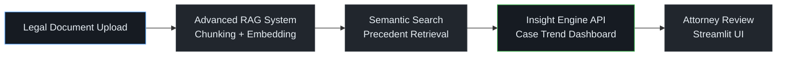
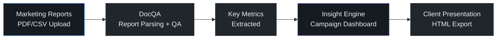
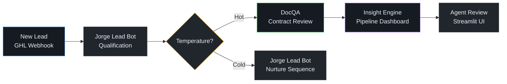

# Integration Guide -- EnterpriseHub Workflows

Three production-ready workflows that combine EnterpriseHub components end-to-end.

---

## Workflow 1: Legal Operations

**Use case**: Law firm uses DocQA for precedent search, Insight Engine for case trend dashboards.

### Architecture



### Code Example

```python
import httpx

# Step 1: Ingest legal documents into DocQA
async def ingest_case_documents(file_paths: list[str], tenant_id: str):
    async with httpx.AsyncClient() as client:
        for path in file_paths:
            with open(path, "rb") as f:
                await client.post(
                    "http://localhost:8000/documents/upload",
                    files={"file": f},
                    headers={"X-API-Key": "your-enterprise-key", "X-Tenant-ID": tenant_id},
                )

# Step 2: Query for precedents
async def search_precedents(query: str, tenant_id: str) -> list[dict]:
    async with httpx.AsyncClient() as client:
        resp = await client.post(
            "http://localhost:8000/query",
            json={"query": query, "top_k": 5},
            headers={"X-API-Key": "your-enterprise-key", "X-Tenant-ID": tenant_id},
        )
        return resp.json()["results"]

# Step 3: Generate trend dashboard
async def generate_case_dashboard(cases: list[dict]) -> str:
    async with httpx.AsyncClient() as client:
        metrics = [
            {"value": str(len(cases)), "label": "Precedents Found", "variant": "info"},
            {"value": f"{cases[0]['score']:.0%}", "label": "Top Match Confidence", "variant": "success"},
        ]
        resp = await client.post(
            "http://localhost:8080/dashboard",
            json={"title": "Case Research Results", "metrics": metrics, "cards": []},
        )
        return resp.text  # Returns full HTML dashboard

# Usage
import asyncio
async def main():
    await ingest_case_documents(["contract_2024.pdf", "precedent_smith_v_jones.pdf"], "law-firm-acme")
    results = await search_precedents("breach of contract damages calculation", "law-firm-acme")
    dashboard_html = await generate_case_dashboard(results)
    with open("case_dashboard.html", "w") as f:
        f.write(dashboard_html)

asyncio.run(main())
```

---

## Workflow 2: Marketing Intelligence

**Use case**: Agency uses DocQA for report QA, Insight Engine for campaign performance dashboards.

### Architecture



### Code Example

```python
async def create_campaign_dashboard(report_path: str, campaign_name: str) -> str:
    """Parse marketing report and generate insight dashboard."""
    async with httpx.AsyncClient() as client:
        # Query DocQA for key metrics from the report
        metrics_query = "What were the CTR, conversion rate, and ROAS for this campaign?"
        qa_resp = await client.post(
            "http://localhost:8000/query",
            json={"query": metrics_query, "document_filter": report_path},
        )
        qa_result = qa_resp.json()

        # Build Insight Engine dashboard
        dashboard_resp = await client.post(
            "http://localhost:8080/dashboard",
            json={
                "title": f"{campaign_name} -- Performance Dashboard",
                "metrics": [
                    {"value": "3.2%", "label": "CTR", "variant": "success", "trend": "up", "comparison_value": "+0.8% vs baseline"},
                    {"value": "4.1x", "label": "ROAS", "variant": "success", "trend": "up", "comparison_value": "+1.2x vs goal"},
                    {"value": "12%", "label": "Conversion Rate", "variant": "info"},
                ],
                "cards": [
                    {"title": "AI Analysis", "content": qa_result.get("answer", ""), "variant": "info"},
                ],
            },
        )
        return dashboard_resp.text
```

---

## Workflow 3: Real Estate Operations

**Use case**: Jorge GHL bots for lead qualification, DocQA for contract review, Insight Engine for pipeline dashboards.

### Architecture



### Code Example

```python
from ghl_real_estate_ai.agents.lead_bot import LeadBotWorkflow
import httpx

async def process_lead_to_dashboard(contact_id: str, message: str):
    """Full pipeline: qualify lead -> if hot, review contract -> update dashboard."""

    # Step 1: Run through Jorge Lead Bot
    lead_bot = LeadBotWorkflow()
    result = await lead_bot.process_lead_conversation(contact_id, message, [])

    temperature = result.get("temperature", "cold")
    lead_score = result.get("lead_score", 0)

    async with httpx.AsyncClient() as client:
        if temperature == "hot":
            # Step 2: DocQA contract review (for hot leads only)
            contract_resp = await client.post(
                "http://localhost:8000/query",
                json={"query": "What are the key terms and contingencies?",
                      "document_filter": f"contracts/{contact_id}"},
            )
            contract_summary = contract_resp.json().get("answer", "No contract on file")
        else:
            contract_summary = "Pending qualification"

        # Step 3: Update pipeline dashboard
        await client.post(
            "http://localhost:8080/dashboard",
            json={
                "title": "Lead Pipeline",
                "metrics": [
                    {"value": str(lead_score), "label": "Lead Score",
                     "variant": "success" if lead_score >= 80 else "info"},
                    {"value": temperature.title(), "label": "Temperature",
                     "variant": "error" if temperature == "hot" else "default"},
                ],
                "cards": [{"title": "Contract Notes", "content": contract_summary, "variant": "info"}],
            },
        )
```

---

## Docker Compose: Running All Services

```yaml
# docker-compose.integration.yml
services:
  docqa:
    build: ./advanced_rag_system
    ports: ["8000:8000"]
    environment:
      - ANTHROPIC_API_KEY=${ANTHROPIC_API_KEY}
      - ENTERPRISE_API_KEYS=your-enterprise-key

  insight-api:
    build: ./insight_engine/api
    ports: ["8080:8080"]

  enterprisehub:
    build: ./ghl_real_estate_ai
    ports: ["8001:8001"]
    environment:
      - GHL_API_KEY=${GHL_API_KEY}
      - ANTHROPIC_API_KEY=${ANTHROPIC_API_KEY}
```

```bash
docker compose -f docker-compose.integration.yml up -d
```

---

## Resources

| Component | Docs | API |
|-----------|------|-----|
| Advanced RAG System | [README](advanced_rag_system/README.md) | `localhost:8000/docs` |
| Insight Engine | [README](insight_engine/README.md) | `localhost:8080/docs` |
| EnterpriseHub | [README](README.md) | `localhost:8001/docs` |
| AgentForge | [README](agentforge/README.md) | -- |
