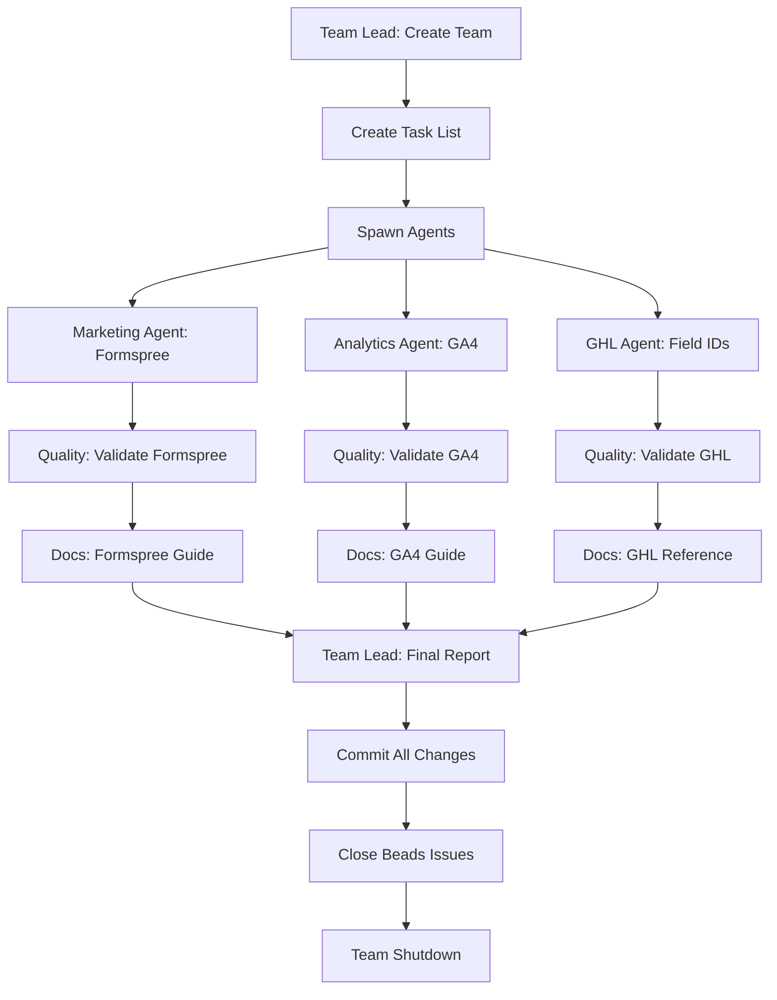

# Portfolio & GHL Parallel Workstream Specification

**Created**: 2026-02-15
**Team Name**: portfolio-ghl-team
**Duration**: 4-6 hours
**Objective**: Complete P0 portfolio quick-wins AND P1 GHL validation in parallel

---

## Executive Summary

**Goal**: Execute two critical workstreams simultaneously using specialized agents:
- **Workstream A**: Portfolio Quick-Wins (Formspree + Google Analytics) - P0 CRITICAL
- **Workstream B**: GHL Field IDs Validation - P1 HIGH PRIORITY

**Team Structure**: 5 specialized agents + 1 team lead
**Execution Model**: Parallel task execution with dependency management
**Success Criteria**: All P0/P1 tasks completed, tested, committed, and pushed

---

## Workstream A: Portfolio Quick-Wins (P0 CRITICAL)

### A1. Fix Formspree Email Form
**Beads ID**: `EnterpriseHub-weekly-plan-001`
**Priority**: P0
**Owner**: marketing-agent
**Duration**: 45-60 minutes
**Status**: IN_PROGRESS (needs continuation)

#### Objective
Fix broken email capture on chunkytortoise.github.io portfolio site by replacing placeholder with actual Formspree form ID.

#### Current State
- Portfolio site: https://chunkytortoise.github.io
- Repository: chunkytortoise.github.io (separate GitHub repo)
- File: `index.html:55` contains `YOUR_FORM_ID` placeholder
- Impact: Unlocks email marketing for all projects

#### Tasks
1. **Clone portfolio repo** (if not present locally)
   ```bash
   git clone https://github.com/ChunkyTortoise/chunkytortoise.github.io.git
   cd chunkytortoise.github.io
   ```

2. **Create Formspree account & form**
   - Navigate to formspree.io
   - Sign up with chunktort@gmail.com
   - Create new form: "Portfolio Contact Form"
   - Note form ID (format: `xyzabc123`)

3. **Update index.html**
   - Locate line 55 with `YOUR_FORM_ID`
   - Replace with actual Formspree form ID
   - Verify form action URL: `https://formspree.io/f/{FORM_ID}`

4. **Test locally**
   - Open index.html in browser
   - Submit test email
   - Verify Formspree receives submission

5. **Commit and push**
   ```bash
   git add index.html
   git commit -m "fix: Replace Formspree placeholder with actual form ID

   - Create Formspree form for portfolio contact
   - Update index.html:55 with form ID
   - Test email submission flow
   - Unlocks email marketing across all projects

   Closes: EnterpriseHub-weekly-plan-001"
   git push
   ```

6. **Verify deployment**
   - GitHub Pages typically deploys in 2-3 minutes
   - Test live form at https://chunkytortoise.github.io
   - Submit test email to confirm end-to-end flow

#### Success Criteria
- [ ] Formspree form created
- [ ] index.html updated with real form ID
- [ ] Test submission successful
- [ ] Changes committed and pushed
- [ ] Live site form working
- [ ] Beads issue closed: `bd close EnterpriseHub-weekly-plan-001`

---

### A2. Add Google Analytics to Portfolio
**Beads ID**: `EnterpriseHub-weekly-plan-002`
**Priority**: P0
**Owner**: analytics-agent
**Duration**: 60-90 minutes
**Status**: IN_PROGRESS (needs continuation)

#### Objective
Create GA4 property and add tracking code to all portfolio sites for data-driven optimization.

#### Sites to Instrument
1. **chunkytortoise.github.io** (main portfolio)
2. **EnterpriseHub demo** (if deployed)
3. **docqa-engine demo** (if deployed)

#### Tasks
1. **Create GA4 property**
   - Navigate to analytics.google.com
   - Sign in with chunktort@gmail.com
   - Create new GA4 property: "ChunkyTortoise Portfolio"
   - Set timezone: PST
   - Set currency: USD
   - Note Measurement ID (format: `G-XXXXXXXXXX`)

2. **Set up Data Streams**
   - Create web data stream for chunkytortoise.github.io
   - Enhanced measurement: Enable all (page views, scrolls, outbound clicks, site search, video engagement, file downloads)
   - Note stream Measurement ID

3. **Install tracking code - Portfolio Site**
   ```bash
   cd chunkytortoise.github.io
   ```

   Add to `<head>` section of all HTML files:
   ```html
   <!-- Google tag (gtag.js) -->
   <script async src="https://www.googletagmanager.com/gtag/js?id=G-XXXXXXXXXX"></script>
   <script>
     window.dataLayer = window.dataLayer || [];
     function gtag(){dataLayer.push(arguments);}
     gtag('js', new Date());
     gtag('config', 'G-XXXXXXXXXX');
   </script>
   ```

4. **Install tracking code - EnterpriseHub demo**
   - Check if Streamlit demo is deployed
   - If yes, add GA4 to Streamlit config or via custom HTML component

5. **Install tracking code - DocQA demo**
   - Check if deployed
   - If yes, add GA4 tracking

6. **Test implementation**
   - Open browser in incognito mode
   - Visit https://chunkytortoise.github.io
   - Navigate through pages
   - Check GA4 Realtime report (should show 1 active user)

7. **Set up key events**
   - Email form submission (if Formspree allows)
   - Outbound clicks to GitHub repos
   - Demo button clicks
   - PDF/resume downloads

8. **Commit and push**
   ```bash
   git add .
   git commit -m "feat: Add Google Analytics 4 tracking to portfolio

   - Create GA4 property for ChunkyTortoise Portfolio
   - Add tracking code to all HTML pages
   - Enable enhanced measurement
   - Set up custom events for conversions
   - Enables data-driven optimization

   Closes: EnterpriseHub-weekly-plan-002"
   git push
   ```

9. **Document setup**
   - Save GA4 Measurement ID to secure location
   - Document key events and conversions
   - Create brief setup guide for future reference

#### Success Criteria
- [ ] GA4 property created
- [ ] Tracking code added to all portfolio pages
- [ ] Real-time tracking verified
- [ ] Key events configured
- [ ] Changes committed and pushed
- [ ] Documentation created
- [ ] Beads issue closed: `bd close EnterpriseHub-weekly-plan-002`

---

## Workstream B: GHL Field IDs Validation (P1 HIGH)

### B1. GHL Integration Setup & Validation
**Beads ID**: `EnterpriseHub-mq1g`
**Priority**: P1
**Owner**: ghl-integration-agent
**Duration**: 2-3 hours
**Status**: BLOCKED (needs credentials)

#### Current Blocker
Task notes indicate: "GHL API returns 401 Invalid JWT. User needs to set GHL_API_KEY and GHL_LOCATION_ID in .env first."

#### Prerequisites (User Action Required)
**⚠️ CRITICAL - Cannot proceed without these credentials:**

1. **GHL_API_KEY**
   - Log into GoHighLevel account
   - Navigate to Settings → Integrations → API
   - Generate new API key or use existing
   - Copy full API key

2. **GHL_LOCATION_ID**
   - In GHL dashboard, note the Location ID
   - Usually visible in URL: `app.gohighlevel.com/location/{LOCATION_ID}/`
   - Or find in Settings → Location Settings

3. **Add to .env file**
   ```bash
   # Add these lines to EnterpriseHub/.env
   GHL_API_KEY=your_actual_api_key_here
   GHL_LOCATION_ID=your_actual_location_id_here
   ```

#### Tasks (After Credentials Provided)

1. **List existing GHL custom fields**
   ```bash
   python -m ghl_real_estate_ai.ghl_utils.jorge_ghl_setup --action=list
   ```

   Expected output:
   - All current custom fields in GHL location
   - Field names, types, IDs

2. **Identify missing fields**
   Compare with required fields in `ghl_real_estate_ai/config/ghl_field_mappings.yaml`:
   - financial_readiness_score (FRS)
   - psychological_commitment_score (PCS)
   - buyer_intent_confidence
   - seller_intent_confidence
   - lead_temperature (Hot/Warm/Cold tags)
   - handoff_history
   - last_bot_interaction
   - conversation_context

3. **Create missing fields**
   ```bash
   python -m ghl_real_estate_ai.ghl_utils.jorge_ghl_setup --action=create
   ```

   For each missing field:
   - Create in GHL via API
   - Note returned field ID
   - Validate field creation

4. **Populate .env with field IDs**
   Update `.env` with all custom field IDs:
   ```bash
   # Jorge Bot Custom Field IDs
   GHL_CUSTOM_FIELD_FRS=<field_id>
   GHL_CUSTOM_FIELD_PCS=<field_id>
   GHL_CUSTOM_FIELD_BUYER_INTENT=<field_id>
   GHL_CUSTOM_FIELD_SELLER_INTENT=<field_id>
   GHL_CUSTOM_FIELD_TEMPERATURE=<field_id>
   GHL_CUSTOM_FIELD_HANDOFF_HISTORY=<field_id>
   GHL_CUSTOM_FIELD_LAST_BOT=<field_id>
   GHL_CUSTOM_FIELD_CONVERSATION_CONTEXT=<field_id>
   ```

5. **Validate setup**
   ```bash
   python -m ghl_real_estate_ai.ghl_utils.jorge_ghl_setup --action=validate
   ```

   Checks:
   - All required fields exist
   - All field IDs in .env are valid
   - API connection working
   - Calendar IDs configured
   - Workflow IDs configured

6. **Test end-to-end flow**
   ```bash
   # Create test contact
   python -m ghl_real_estate_ai.ghl_utils.jorge_ghl_setup --action=test
   ```

   Verifies:
   - Contact creation
   - Custom field updates
   - Tag publishing
   - Calendar availability check
   - Workflow triggers

7. **Document field mappings**
   Create reference doc: `ghl_real_estate_ai/docs/GHL_FIELD_REFERENCE.md`
   ```markdown
   # GHL Custom Field Reference

   ## Field IDs
   | Field Name | Field ID | Type | Purpose |
   |------------|----------|------|---------|
   | FRS | xxx | Number | Financial Readiness Score (0-100) |
   | PCS | xxx | Number | Psychological Commitment Score (0-100) |
   | ... | ... | ... | ... |

   ## Tag Mappings
   | Temperature | Tag | Workflow Trigger |
   |-------------|-----|------------------|
   | Hot (≥80) | Hot-Lead | Priority routing |
   | Warm (40-79) | Warm-Lead | Nurture sequence |
   | Cold (<40) | Cold-Lead | Educational content |
   ```

8. **Commit and push**
   ```bash
   git add .env ghl_real_estate_ai/docs/GHL_FIELD_REFERENCE.md
   git commit -m "feat: Configure GHL custom field IDs for Jorge bots

   - List all existing GHL custom fields
   - Create missing fields via API
   - Populate .env with field IDs
   - Validate end-to-end GHL integration
   - Document field mappings for reference
   - Production-ready GHL setup

   Closes: EnterpriseHub-mq1g"
   git push
   ```

#### Success Criteria
- [ ] GHL API credentials validated
- [ ] All required custom fields exist in GHL
- [ ] All field IDs populated in .env
- [ ] End-to-end integration test passes
- [ ] Field reference documentation created
- [ ] Changes committed and pushed (excluding .env if sensitive)
- [ ] Beads issue closed: `bd close EnterpriseHub-mq1g`

---

## Team Structure

### Team Lead: portfolio-ghl-coordinator
**Role**: Orchestration, dependency management, status reporting
**Responsibilities**:
- Create team and task list
- Assign tasks to agents
- Monitor progress
- Resolve blockers
- Coordinate handoffs
- Final validation
- Report completion

**Tools**: All (Read, Write, Edit, Bash, Task, TaskCreate, TaskUpdate, TeamCreate, SendMessage)

### Agent 1: marketing-agent
**Role**: Portfolio marketing infrastructure
**Assignment**: Formspree email form (A1)
**Type**: `general-purpose`
**Tools**: Read, Write, Edit, Bash, WebFetch (for Formspree)
**Deliverable**: Working email form on portfolio site

### Agent 2: analytics-agent
**Role**: Analytics and tracking setup
**Assignment**: Google Analytics (A2)
**Type**: `general-purpose`
**Tools**: Read, Write, Edit, Bash, WebFetch (for GA4)
**Deliverable**: GA4 tracking on all portfolio sites

### Agent 3: ghl-integration-agent
**Role**: GHL API integration and validation
**Assignment**: GHL field IDs (B1)
**Type**: `api-consistency` (specialized for API work)
**Tools**: Read, Write, Edit, Bash, Grep, Glob
**Deliverable**: Production-ready GHL integration

### Agent 4: quality-validator
**Role**: Testing and validation
**Assignment**: End-to-end validation of all deliverables
**Type**: `test-engineering`
**Tools**: Read, Bash, Grep
**Deliverable**: Test reports and validation sign-off

### Agent 5: documentation-agent
**Role**: Documentation and knowledge capture
**Assignment**: Create reference docs for all completed work
**Type**: `general-purpose`
**Tools**: Read, Write, Grep
**Deliverable**: Comprehensive documentation

---

## Task Dependencies



### Execution Phases

**Phase 1: Setup (Team Lead)** - 10 minutes
- Create team: `portfolio-ghl-team`
- Create task list with 8 tasks
- Spawn 5 specialized agents
- Assign tasks

**Phase 2: Parallel Execution** - 2-3 hours
- Agents work independently on assigned tasks
- Report progress to team lead
- Request help for blockers

**Phase 3: Validation** - 30 minutes
- Quality agent validates all deliverables
- Issues blockers if tests fail
- Agents fix issues

**Phase 4: Documentation** - 30 minutes
- Documentation agent creates guides
- Captures lessons learned
- Updates project documentation

**Phase 5: Integration** - 30 minutes
- Team lead reviews all work
- Runs final integration tests
- Commits all changes
- Closes beads issues

**Phase 6: Shutdown** - 10 minutes
- Generate final report
- Close task list
- Shutdown team
- Sync beads and push to remote

---

## Task List Structure

### Task 1: Create Team (Team Lead)
**Status**: pending
**Owner**: team-lead
**Description**: Create `portfolio-ghl-team` and initialize task list

### Task 2: Spawn Agents (Team Lead)
**Status**: pending
**Blocked By**: Task 1
**Owner**: team-lead
**Description**: Spawn 5 specialized agents with correct types and permissions

### Task 3: Fix Formspree Form (Marketing Agent)
**Status**: pending
**Blocked By**: Task 2
**Owner**: marketing-agent
**Description**: Create Formspree account, get form ID, update index.html, test, commit
**Beads**: EnterpriseHub-weekly-plan-001

### Task 4: Setup Google Analytics (Analytics Agent)
**Status**: pending
**Blocked By**: Task 2
**Owner**: analytics-agent
**Description**: Create GA4 property, add tracking code to all sites, configure events, commit
**Beads**: EnterpriseHub-weekly-plan-002

### Task 5: Validate GHL Setup (GHL Integration Agent)
**Status**: pending
**Blocked By**: Task 2, User provides credentials
**Owner**: ghl-integration-agent
**Description**: List fields, create missing, populate .env, validate, test, commit
**Beads**: EnterpriseHub-mq1g

### Task 6: Quality Validation (Quality Agent)
**Status**: pending
**Blocked By**: Task 3, 4, 5
**Owner**: quality-validator
**Description**: Test all three deliverables end-to-end, create test reports

### Task 7: Create Documentation (Docs Agent)
**Status**: pending
**Blocked By**: Task 6
**Owner**: documentation-agent
**Description**: Create reference guides for Formspree, GA4, and GHL setup

### Task 8: Final Integration (Team Lead)
**Status**: pending
**Blocked By**: Task 7
**Owner**: team-lead
**Description**: Review all work, commit changes, close beads issues, generate report

---

## Communication Protocol

### Status Updates
Agents report to team lead every 30 minutes with:
```
Status: <in_progress|blocked|completed>
Task: <task_name>
Progress: <% complete>
Blockers: <list or "none">
Next Steps: <what's next>
```

### Blocker Escalation
If blocked for >15 minutes:
1. Send message to team lead
2. Team lead investigates
3. If user action required, notify user
4. If technical, spawn debugging agent

### Handoffs
When task dependencies require coordination:
1. Completing agent sends message to dependent agent
2. Include all necessary context and outputs
3. Dependent agent acknowledges and proceeds

---

## Success Metrics

### Portfolio Workstream (A)
- [ ] Formspree form live and tested
- [ ] GA4 tracking verified on all sites
- [ ] Both changes committed and deployed
- [ ] Both beads issues closed

### GHL Workstream (B)
- [ ] All custom fields exist in GHL
- [ ] All field IDs in .env
- [ ] Integration test passes
- [ ] Beads issue closed

### Team Coordination
- [ ] No agents idle >30 minutes
- [ ] All blockers resolved within 1 hour
- [ ] No task dependencies broken
- [ ] All commits follow conventions

### Final Deliverable
- [ ] 3 beads issues closed
- [ ] All changes committed and pushed
- [ ] Documentation complete
- [ ] Team report generated
- [ ] Team shutdown cleanly

---

## User Actions Required

### Before Execution
**CRITICAL - GHL Credentials (for Workstream B)**:
1. Log into GoHighLevel
2. Get API key from Settings → Integrations → API
3. Get Location ID from dashboard URL
4. Add to `.env`:
   ```
   GHL_API_KEY=your_key
   GHL_LOCATION_ID=your_id
   ```

**OPTIONAL - Account Access (for Workstream A)**:
- Formspree account (chunktort@gmail.com) - agent can create if needed
- Google Analytics account (chunktort@gmail.com) - agent can create if needed

### During Execution
- Monitor team status messages
- Respond to blocker notifications
- Approve any destructive actions if prompted

### After Execution
- Review final report
- Test live portfolio site
- Verify GHL integration in production
- Approve team shutdown

---

## Contingency Plans

### If Formspree Fails
- **Fallback 1**: Use Netlify Forms (if site moves to Netlify)
- **Fallback 2**: Use Google Forms with embedded iframe
- **Fallback 3**: Use FormSubmit.co (no account required)

### If GA4 Fails
- **Fallback 1**: Use Plausible Analytics (privacy-focused)
- **Fallback 2**: Use Umami (self-hosted)
- **Fallback 3**: Defer until GA4 account issues resolved

### If GHL Credentials Invalid
- **Action**: Pause Workstream B
- **Continue**: Workstream A independently
- **Resume**: When user provides valid credentials

### If Agent Gets Stuck
- **Timeout**: 45 minutes per task
- **Action**: Team lead spawns debugging agent
- **Escalation**: Report to user if unresolvable

---

## Estimated Timeline

| Phase | Duration | Activities |
|-------|----------|-----------|
| Setup | 10 min | Team creation, agent spawning |
| Parallel Work | 2-3 hours | Agents execute tasks |
| Validation | 30 min | Quality checks |
| Documentation | 30 min | Create guides |
| Integration | 30 min | Final commits |
| Shutdown | 10 min | Reporting and cleanup |
| **TOTAL** | **4-5 hours** | End-to-end completion |

---

## Expected Outputs

### File Changes
```
chunkytortoise.github.io/
├── index.html (Formspree form ID)
├── *.html (GA4 tracking code)

EnterpriseHub/
├── .env (GHL field IDs - NOT committed)
├── ghl_real_estate_ai/
│   └── docs/
│       └── GHL_FIELD_REFERENCE.md (NEW)
├── docs/
│   ├── FORMSPREE_SETUP.md (NEW)
│   └── GA4_SETUP.md (NEW)
└── PORTFOLIO_GHL_TEAM_REPORT.md (NEW)
```

### Git Commits
- 3-5 commits across 2 repositories
- All following conventional commit format
- All linked to beads issues

### Beads Issues Closed
- EnterpriseHub-weekly-plan-001 ✓
- EnterpriseHub-weekly-plan-002 ✓
- EnterpriseHub-mq1g ✓

---

## Approval to Proceed

**Review this spec and confirm:**
- [ ] GHL credentials will be provided (or acknowledge Workstream B will be blocked)
- [ ] Formspree/GA4 account access approved
- [ ] Team structure acceptable
- [ ] Timeline acceptable (4-5 hours)
- [ ] Success criteria clear

**To start execution, respond with:**
- "Proceed with full spec" (both workstreams)
- "Proceed with Workstream A only" (portfolio, skip GHL)
- "Modify spec: [changes requested]"

---

**Version**: 1.0
**Status**: Awaiting approval
**Next Step**: User approval → Team creation → Parallel execution
