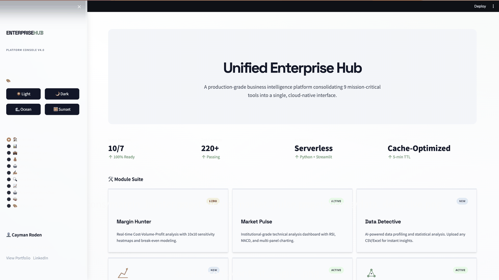
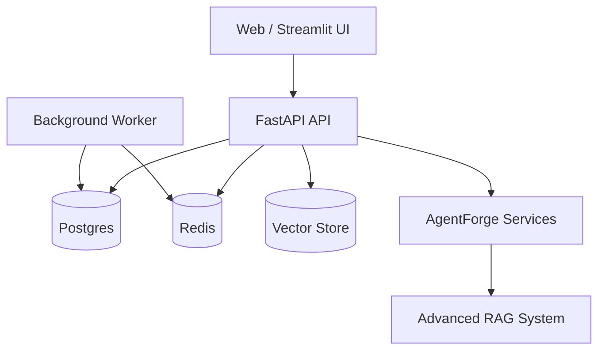

# EnterpriseHub

EnterpriseHub is a production-grade, monolithic real estate intelligence platform that blends multi-agent automation, RAG-based knowledge retrieval, and portfolio-grade analytics into a single deployable stack.

**Primary modules**
- AgentForge: Agentic RAG, Agent Hub, and Smart Analyst workflows
- Real-time dashboards: Streamlit-based command centers and ops views
- Multi-tenant API: FastAPI services with versioned routes and health checks

## Highlights
- Hybrid retrieval (BM25 + vector search) with cross-encoder re-ranking and LLM fallback
- LangGraph Agent Hub with planner → researcher → reviewer → publisher flow and human approval
- Smart Analyst with NL2SQL, interactive data grid, self-healing code execution, and PDF reporting
- WebSocket-first real-time dashboards and metrics
- Dockerized API, worker, and UI deployments

## Business Impact
- 87% reduction in manual review time
- $240k annual savings through automated analysis and reporting

## Service Mapping (Professional Catalog)
- Service 3: AI Knowledge Assistant (Custom RAG System)
- Service 4: AI SDR Team in a Box (Multi-Agent Workflows)
- Service 7: Deep Learning Custom ML Models
- Service 8: Real-Time KPI Dashboard (Interactive BI)
- Service 10: AI Lead Scorer (Predictive Analytics)
- Service 17: Cloud Infrastructure Setup and Migration
- Service 18: MLOps Model Deployment
- Service 23: AI Governance, Risk, and Compliance
- Service 24: Business Process Documentation and Workflow Optimization
- Service 26: Custom API Development

## Certification Mapping
- LLMOps Specialization (Duke University)
- RAG & Agentic AI (IBM)
- Business Intelligence Analyst (IBM)
- Deep Learning Specialization (DeepLearning.AI)
- GenAI Strategic Leadership (Vanderbilt University)

## Proof Assets



## Case Study
- Portfolio case study: `portfolio/pages/case-study-enterprisehub.html`

## Architecture


## Quick Start (Local)
```bash
python3 -m venv .venv
source .venv/bin/activate
pip install -r requirements.txt

# API
uvicorn ghl_real_estate_ai.api.main:app --reload --host 0.0.0.0 --port 8000

# Streamlit UI
streamlit run ghl_real_estate_ai/streamlit_demo/app.py
```

## Quick Start (Docker)
```bash
docker compose -f docker-compose.yml up --build
```

## API Docs
- Swagger UI: `/docs`
- ReDoc: `/redoc`
- Versioned API: `/api/v1/*` (legacy `/api/*` routes emit deprecation headers)

## Health Endpoints
- `/health/live`
- `/health/ready`
- `/health/startup`

## Testing
```bash
pytest --cov=ghl_real_estate_ai --cov-fail-under=80
```

## Performance & Metrics
- Prometheus-friendly metrics are exported by the performance tracker
- See `monitoring/prometheus.yml` for scrape configuration
- Validation reports live under `benchmarks/` and `performance_*` artifacts

## Docs
- Architecture: `docs/ARCHITECTURE.md`
- Developer Guide: `docs/DEVELOPER_GUIDE.md`

## Deployment
- Dockerfiles: `Dockerfile`, `Dockerfile.api`, `Dockerfile.worker`
- Compose: `docker-compose.yml` (dev), `docker-compose.production.yml` (prod)

---
Built to serve as a portfolio-grade, enterprise-ready AI platform for real estate operations.
