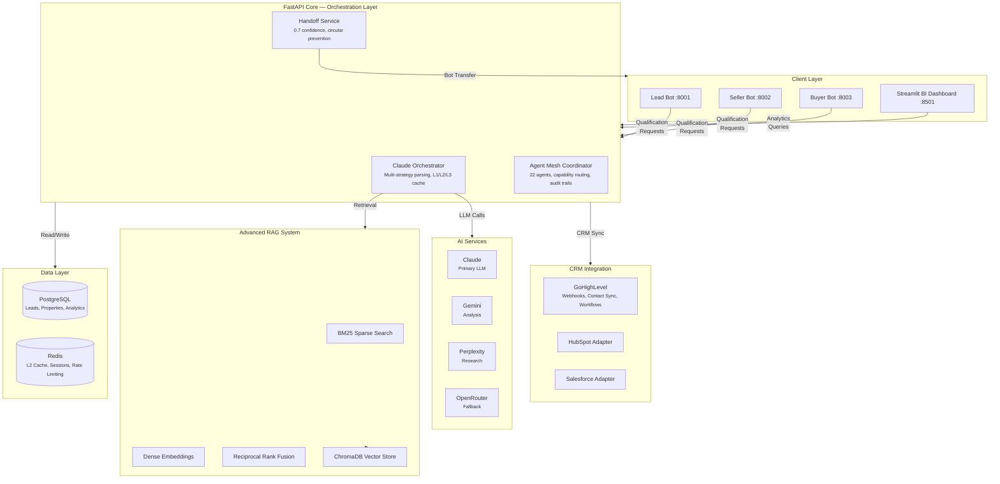

[](https://github.com/sponsors/ChunkyTortoise)

# EnterpriseHub

## Executive Summary

EnterpriseHub is an AI-powered real estate platform that transforms lead management and business intelligence for real estate professionals and agencies. By automating lead qualification, follow-up scheduling, and CRM synchronization, EnterpriseHub eliminates the 40% lead loss caused by slow response times.

**Key Benefits:**
- **Instant Lead Qualification**: Three specialized AI bots (Lead, Buyer, Seller) qualify prospects in real-time using a proven Q0-Q4 framework, enforcing the critical 5-minute response SLA
- **Unified Operations**: Consolidate qualification results, CRM updates, and analytics into one platform—replacing fragmented spreadsheets and disconnected dashboards
- **Actionable Insights**: Streamlit BI dashboards provide real-time visibility into lead flow, conversion rates, commission tracking, and bot performance metrics

**Target Audience:** Real estate teams, brokerages, and agencies seeking to scale operations while maintaining personalized client engagement.

**Business Impact:** Production-ready with 89% token cost reduction, 87% cache hit rate, and P95 latency under 2 seconds. The platform integrates seamlessly with GoHighLevel CRM and supports multi-LLM orchestration (Claude, Gemini, Perplexity).

**Quick Start:** Launch the demo in seconds with `make demo`—no API keys or database required. For full deployment, complete setup in under 10 minutes using Docker Compose.

---

**Real estate teams lose 40% of leads because response time exceeds the 5-minute SLA.** This platform automates lead qualification, follow-up scheduling, and CRM sync so no lead goes cold.

[](https://github.com/ChunkyTortoise/EnterpriseHub/actions)
[](https://www.python.org/)
[](tests/)
[](https://fastapi.tiangolo.com/)
[](LICENSE)
[](https://ct-enterprise-ai.streamlit.app)

## Demo Snapshot


## What This Solves

- **Slow lead response** -- Three AI bots (Lead, Buyer, Seller) qualify prospects in real time using a Q0-Q4 framework, enforcing the 5-minute response rule
- **Disconnected tools** -- Qualification results, CRM updates, and analytics live in one platform instead of spreadsheets + separate dashboards
- **No visibility into pipeline health** -- Streamlit BI dashboard surfaces lead flow, conversion rates, commission tracking, and bot performance metrics

## Service Mapping

- **Service 4:** Multi-Agent Workflows (Agentic AI Systems)
- **Service 6:** AI-Powered Personal and Business Automation
- **Service 8:** Interactive Business Intelligence Dashboards
- **Service 10:** Predictive Analytics and Lead Scoring

## Certification Mapping

- IBM Generative AI Engineering with PyTorch, LangChain & Hugging Face
- IBM RAG and Agentic AI Professional Certificate
- Duke University LLMOps Specialization
- Google Data Analytics Certificate
- IBM Business Intelligence Analyst Professional Certificate

<details>
<summary>Screenshots</summary>


</details>

## Architecture



## Key Metrics

| Metric | Value |
|--------|-------|
| Test Suite | 4,937 automated tests |
| LLM Cost Reduction | 89% via 3-tier Redis caching |
| Orchestration Overhead | <200ms per request |
| API P95 Latency | <300ms under 10 req/sec |
| Cache Hit Rate | >85% for repeated queries |
| CRM Integrations | 3 (GoHighLevel, HubSpot, Salesforce) |
| Bot Handoff Accuracy | 0.7 confidence threshold |

## Quick Start

```bash
git clone https://github.com/ChunkyTortoise/EnterpriseHub.git
cd EnterpriseHub
pip install -r requirements.txt

# Demo mode — no API keys, no database, pre-populated dashboards
make demo
```

## Portal API (Phase 1)

Standalone FastAPI module used for the client showcase and deterministic API validation.

- Entrypoint: `main.py`
- Package: `portal_api/`
- CI workflow: `.github/workflows/portal-api-phase1.yml`

### Endpoint Matrix

| Method | Endpoint | Purpose |
|-------|----------|---------|
| GET | `/` | Root metadata + links |
| GET | `/health` | API health status |
| GET | `/portal/deck` | Return smart property deck for a contact |
| POST | `/portal/swipe` | Log swipe action (`like` or `pass`) |
| POST | `/vapi/tools/check-availability` | Vapi tool: return appointment slots |
| POST | `/vapi/tools/book-tour` | Vapi tool: create appointment booking |
| POST | `/ghl/sync` | Trigger GHL contact sync |
| GET | `/ghl/fields` | Return GHL field metadata |
| POST | `/system/reset` | Reset in-memory demo state |
| GET | `/system/state` | Aggregate service counters |
| GET | `/system/state/details` | Detailed counters + recent records |

### Contract Guarantees

- Typed request/response contracts are enforced with Pydantic models and locked OpenAPI schema assertions.
- `POST /portal/swipe` accepts only `action` values `like` or `pass`.
- `GET /system/state/details` enforces `limit` bounds: `ge=0`, `le=100`, default `5`.
- `POST /ghl/sync` documents both success (`200`) and service-failure (`500`) contracts.
- CI gate for this surface is deterministic and scoped to lint + compile + `portal_api` tests.

### Alias Map

- `POST /system/reset` aliases: `POST /admin/reset`, `POST /reset`
- `GET /system/state` aliases: `GET /admin/state`, `GET /state`
- `GET /system/state/details` aliases: `GET /admin/state/details`, `GET /state/details`

### Validation Commands

Run from repository root:

```bash
ruff check main.py portal_api modules

python3 -m py_compile \
  main.py \
  portal_api/app.py \
  portal_api/dependencies.py \
  portal_api/models.py \
  portal_api/routers/root.py \
  portal_api/routers/vapi.py \
  portal_api/routers/portal.py \
  portal_api/routers/ghl.py \
  portal_api/routers/admin.py \
  modules/inventory_manager.py \
  modules/ghl_sync.py \
  modules/appointment_manager.py \
  modules/voice_trigger.py

pytest -q -o addopts='' portal_api/tests/test_portal_api.py
```

### Interview Demo Run (5 minutes)

```bash
# 1) Reset deterministic in-memory state
curl -s -X POST http://127.0.0.1:8000/system/reset | jq

# 2) Load a deck
curl -s "http://127.0.0.1:8000/portal/deck?contact_id=lead_001" | jq

# 3) Perform a valid swipe
curl -s -X POST http://127.0.0.1:8000/portal/swipe \
  -H "content-type: application/json" \
  -d '{"contact_id":"lead_001","property_id":"prop_001","action":"like"}' | jq

# 4) Book a tour via Vapi tool payload
curl -s -X POST http://127.0.0.1:8000/vapi/tools/book-tour \
  -H "content-type: application/json" \
  -d '{"toolCall":{"id":"demo-1","function":{"arguments":{"contact_id":"lead_001","slot_time":"2026-02-15T10:00:00","property_address":"123 Palm Ave"}}}}' | jq

# 5) Show aggregate + detailed state
curl -s http://127.0.0.1:8000/system/state | jq
curl -s "http://127.0.0.1:8000/system/state/details?limit=2" | jq

# 6) Negative-path proof: invalid swipe action returns 422
curl -s -X POST http://127.0.0.1:8000/portal/swipe \
  -H "content-type: application/json" \
  -d '{"contact_id":"lead_001","property_id":"prop_001","action":"save"}' | jq
```

Known limitations / next steps: auth and authorization layers, real external integrations, and deeper observability/telemetry are intentionally simplified in this demo slice.

### Client Showcase (Streamlit + enterprise-ui)

```bash
# Streamlit showcase
python3 -m streamlit run streamlit_cloud/app.py --server.headless=true --server.port=8765

# Frontend MVP (separate terminal)
cd enterprise-ui
npm install
npm run dev
```

Detailed operator runbook: `plans/CLIENT_SHOWCASE_RUNBOOK_FEB10_2026.md`

### Full Setup (with external services)

```bash
cp .env.example .env
# Edit .env with your API keys

docker-compose up -d postgres redis
uvicorn app:app --reload --port 8000

# BI Dashboard (separate terminal)
streamlit run admin_dashboard.py --server.port 8501
```

## Tech Stack

| Layer | Technology |
|-------|-----------|
| API | FastAPI (async), Pydantic validation |
| UI | Streamlit, Plotly |
| Database | PostgreSQL, Alembic migrations |
| Cache | Redis (L1), Application memory (L2), Database (L3) |
| AI/ML | Claude (primary), Gemini (analysis), OpenRouter (fallback) |
| CRM | GoHighLevel (webhooks, contacts, workflows) |
| Search | ChromaDB vector store, BM25, hybrid retrieval |
| Payments | Stripe (subscriptions, webhooks) |
| Infrastructure | Docker Compose |

## Project Structure

```
EnterpriseHub/
├── ghl_real_estate_ai/           # Main application
│   ├── agents/                   # Bot implementations (Lead, Buyer, Seller)
│   ├── api/routes/               # FastAPI endpoints
│   ├── services/                 # Business logic layer
│   │   ├── claude_orchestrator.py    # Multi-LLM coordination + caching
│   │   ├── agent_mesh_coordinator.py # Agent fleet management
│   │   ├── llm_observability.py      # LLM cost tracking + tracing
│   │   ├── enhanced_ghl_client.py    # CRM integration (rate-limited)
│   │   └── jorge/                    # Bot services (handoff, A/B, metrics)
│   ├── models/                   # SQLAlchemy models, Pydantic schemas
│   └── streamlit_demo/           # Dashboard UI components
├── advanced_rag_system/          # RAG pipeline (BM25, dense search, ChromaDB)
├── benchmarks/                   # Synthetic performance benchmarks
├── docs/                         # Documentation
│   ├── adr/                      # Architecture Decision Records
│   └── templates/                # Reusable templates for other repos
├── tests/                        # 4,937 automated tests
├── app.py                        # FastAPI entry point
├── admin_dashboard.py            # Streamlit BI dashboard
└── docker-compose.yml            # Container orchestration
```

## Jorge Bot Audit (February 2026)

Production-ready bot services with enhanced monitoring and A/B testing:

| Service | Status | Features |
|---------|--------|----------|
| **JorgeHandoffService** | ✅ Production | Circular prevention, rate limiting, pattern learning |
| **ABTestingService** | ✅ Production | Deterministic assignment, z-test significance |
| **PerformanceTracker** | ✅ Production | P50/P95/P99 latency, SLA compliance |
| **AlertingService** | ✅ Production | 7 default rules, email/Slack/webhook |
| **BotMetricsCollector** | ✅ Production | Per-bot stats, cache hits, alerting |

### Quick Links

- [Deployment Checklist](ghl_real_estate_ai/docs/JORGE_BOT_DEPLOYMENT_CHECKLIST.md)
- [Integration Guide](ghl_real_estate_ai/docs/JORGE_BOT_INTEGRATION_GUIDE.md)
- [Alert Channels](ghl_real_estate_ai/docs/ALERT_CHANNELS_DEPLOYMENT_GUIDE.md)

## Deployment & Monitoring

Production-ready infrastructure with observability built in:

```
┌──────────────────────────────────────────────────────────┐
│  Docker Compose Profiles                                  │
│  ├── postgres (primary DB + Alembic migrations)           │
│  ├── redis (L2 cache, sessions, rate limiting)            │
│  ├── api (FastAPI, 91+ routes)                            │
│  ├── bots (Lead :8001, Seller :8002, Buyer :8003)         │
│  └── dashboard (Streamlit BI :8501)                       │
└──────────────────────────────────────────────────────────┘
```

| Capability | Implementation | Key Metric |
|-----------|----------------|------------|
| **Token Cost Optimization** | 3-tier cache (L1 memory, L2 Redis, L3 PostgreSQL) + model routing | 93K → 7.8K tokens/workflow (89% reduction) |
| **Latency Monitoring** | `PerformanceTracker` — P50/P95/P99 percentiles, SLA compliance | Lead Bot P95 < 2,000ms |
| **Alerting** | `AlertingService` — 7 default rules, configurable cooldowns | Error rate, latency, cache, handoff, tokens |
| **Per-Bot Metrics** | `BotMetricsCollector` — throughput, cache hits, error categorization | 87% cache hit rate |
| **Health Checks** | `/health/aggregate` endpoint checks all services | Bot + DB + Redis + CRM status |

## Architecture Decisions

| ADR | Title | Status |
|-----|-------|--------|
| [ADR-0001](docs/adr/0001-three-tier-redis-caching.md) | Three-Tier Redis Caching Strategy | Accepted |
| [ADR-0002](docs/adr/0002-multi-crm-protocol-pattern.md) | Multi-CRM Protocol Pattern | Accepted |
| [ADR-0003](docs/adr/0003-jorge-handoff-architecture.md) | Jorge Handoff Architecture | Accepted |
| [ADR-0004](docs/adr/0004-agent-mesh-coordinator.md) | Agent Mesh Coordinator | Accepted |
| [ADR-0005](docs/adr/0005-pydantic-v2-migration.md) | Pydantic V2 Migration | Accepted |

## Benchmarks

Synthetic benchmarks measuring platform overhead (no external API keys required).

```bash
python -m benchmarks.run_all
```

See [BENCHMARKS.md](BENCHMARKS.md) for full methodology and results.

## Observability

Full LLM observability stack: cost tracking, latency histograms, conversation analytics, and alerting.

See [docs/OBSERVABILITY.md](docs/OBSERVABILITY.md) for details.

## Testing

```bash
python -m pytest tests/ -v
python -m pytest --cov=ghl_real_estate_ai --cov-report=term-missing
```

## Changelog

See [CHANGELOG.md](CHANGELOG.md) for release history.

## Related Projects

- [jorge_real_estate_bots](https://github.com/ChunkyTortoise/jorge_real_estate_bots) -- Standalone 3-bot lead qualification system extracted from this platform
- [ai-orchestrator](https://github.com/ChunkyTortoise/ai-orchestrator) -- AgentForge: unified async LLM interface (Claude, Gemini, OpenAI, Perplexity)
- [Revenue-Sprint](https://github.com/ChunkyTortoise/Revenue-Sprint) -- AI-powered freelance pipeline: job scanning, proposal generation, prompt injection testing
- [insight-engine](https://github.com/ChunkyTortoise/insight-engine) -- Upload CSV/Excel, get instant dashboards, predictive models, and reports
- [docqa-engine](https://github.com/ChunkyTortoise/docqa-engine) -- RAG document Q&A with hybrid retrieval and prompt engineering lab
- [scrape-and-serve](https://github.com/ChunkyTortoise/scrape-and-serve) -- Web scraping, price monitoring, Excel-to-web apps, and SEO tools
- [Portfolio](https://chunkytortoise.github.io) -- Project showcase and services

## License

MIT -- see [LICENSE](LICENSE) for details.
