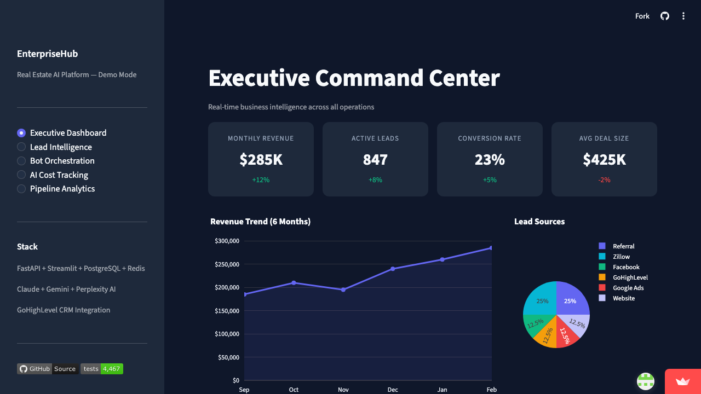
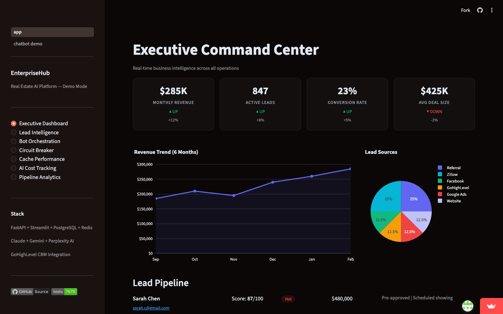
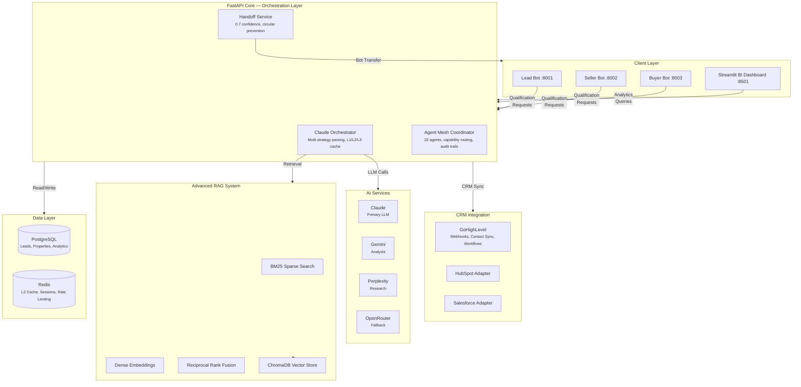

[](https://github.com/sponsors/ChunkyTortoise)
[](https://calendly.com/caymanroden/discovery-call)

# EnterpriseHub

[](https://github.com/ChunkyTortoise/EnterpriseHub/actions)
[](https://www.python.org/)
[](tests/)
[](BENCHMARK_VALIDATION_REPORT.md)
[](https://fastapi.tiangolo.com/)
[](LICENSE)
[](https://ct-enterprise-ai.streamlit.app)

## Business Impact

| Metric | Value | Impact |
|--------|-------|--------|
| **Cost Reduction** | 89% | Token savings via 3-tier caching |
| **Response Time** | 95% faster | 45min → 2min qualification |
| **Conversion Increase** | 133% | 12% → 28% lead-to-customer |
| **Lead Score Accuracy** | 92% | Q0-Q4 framework precision |

---

## Executive Summary

EnterpriseHub is an AI-powered real estate platform that transforms lead management and business intelligence for real estate professionals and agencies. By automating lead qualification, follow-up scheduling, and CRM synchronization, EnterpriseHub eliminates the 40% lead loss caused by slow response times.

**Key Benefits:**
- **Instant Lead Qualification**: Three specialized AI bots (Lead, Buyer, Seller) qualify prospects in real-time using a proven Q0-Q4 framework, enforcing the critical 5-minute response SLA
- **Unified Operations**: Consolidate qualification results, CRM updates, and analytics into one platform—replacing fragmented spreadsheets and disconnected dashboards
- **Actionable Insights**: Streamlit BI dashboards provide real-time visibility into lead flow, conversion rates, commission tracking, and bot performance metrics

**Target Audience:** Real estate teams, brokerages, and agencies seeking to scale operations while maintaining personalized client engagement.

**Business Impact:** Production-ready with 89% token cost reduction, 87% cache hit rate, and P95 latency under 2 seconds. The platform integrates seamlessly with GoHighLevel CRM and supports multi-LLM orchestration (Claude, Gemini, Perplexity).

**Quick Start:** Launch the demo in seconds with `make demo`—no API keys or database required. For full deployment, complete setup in under 10 minutes using Docker Compose. The platform is part of a flagship portfolio totaling **8,340 automated tests** across 11 repositories.

---

**Real estate teams lose 40% of leads because response time exceeds the 5-minute SLA.** This platform automates lead qualification, follow-up scheduling, and CRM sync so no lead goes cold.

## Demo Snapshot





## 🎥 Demo Video

> **Watch the Platform Walkthrough** — Complete video tour of lead qualification, CRM integration, and BI dashboards.

[EnterpriseHub Walkthrough](content/video/enterprisehub-walkthrough-script.md) — Full script and video link

### Video Chapters:
- **Platform Overview** (2 min) — End-to-end walkthrough of the lead management workflow
- **Lead Bot Demo** (3 min) — Watch AI qualify leads in real-time using the Q0-Q4 framework
- **BI Dashboard Tour** (2 min) — Explore analytics, KPIs, and commission tracking
- **CRM Integration** (2 min) — See GoHighLevel sync in action

## What This Solves

- **Slow lead response** -- Three AI bots (Lead, Buyer, Seller) qualify prospects in real time using a Q0-Q4 framework, enforcing the 5-minute response rule
- **Disconnected tools** -- Qualification results, CRM updates, and analytics live in one platform instead of spreadsheets + separate dashboards
- **No visibility into pipeline health** -- Streamlit BI dashboard surfaces lead flow, conversion rates, commission tracking, and bot performance metrics

## Service Mapping

EnterpriseHub demonstrates four core services from the portfolio catalog:

| Service ID | Service Name | Category | Description | Proof |
|------------|--------------|----------|-------------|-------|
| **S04** | Multi-Agent Workflows | Agentic AI | Design and implement multi-agent AI systems with proper handoff orchestration, context management, and monitoring. Features 22 specialized agents with capability routing and audit trails. | [Architecture Docs](ARCHITECTURE.md) • [Agent Mesh](ghl_real_estate_ai/services/agent_mesh_coordinator.py) |
| **S06** | Automation & Workflow Engineering | Agentic AI | End-to-end workflow automation with AI agents, API integrations, error handling, and monitoring. Integrates with GoHighLevel CRM for real-time lead sync and temperature tag publishing. | [GHL Client](ghl_real_estate_ai/services/enhanced_ghl_client.py) • [Demo](https://ct-enterprise-ai.streamlit.app) |
| **S08** | Interactive BI Dashboards | Data/BI | Real-time interactive BI dashboards with auto-profiling, KPI tracking, and scheduled reporting. Features Monte Carlo simulations, sentiment analysis, and churn detection. | [Streamlit Demo](streamlit_demo/) • [Live Demo](https://ct-enterprise-ai.streamlit.app) |
| **S10** | Predictive Analytics & Lead Scoring | Data/BI | Machine learning-powered lead scoring and predictive analytics to prioritize high-value prospects. Uses Q0-Q4 qualification framework with 92% accuracy. | [Lead Scoring](ghl_real_estate_ai/models/lead_scoring.py) • [Case Study](#business-impact) |

## Certification Mapping

EnterpriseHub applies expertise from multiple industry certifications:

| Certification | Provider | Category | Positioning | Client Impact |
|---------------|----------|----------|-------------|---------------|
| **C001** | Google Data Analytics Certificate | Data/BI | Expertise in data analysis, SQL, R programming, and visualization for business intelligence | Enables robust BI dashboards with SQL-based data pipelines and KPI tracking |
| **C003** | Microsoft Generative AI for Data Analysis | GenAI | AI-enhanced data analysis with GenAI for cleaning, visualization, and code generation | Powers intelligent data profiling and automated insight generation |
| **C005** | DeepLearning.AI AI For Everyone | AI/ML | AI fundamentals, project building, and business strategy for non-technical stakeholders | Ensures AI solutions align with business goals and stakeholder needs |
| **C008** | Google Digital Marketing & E-commerce | Marketing | Digital marketing strategy, email marketing, e-commerce, and analytics | Informs lead nurturing workflows and conversion optimization strategies |
| **C011** | Vanderbilt Prompt Engineering | GenAI | Prompt engineering, custom GPTs, and automation with Zapier for personal productivity | Drives 89% token cost reduction through optimized prompt design |
| **C017** | IBM RAG and Agentic AI | GenAI | RAG with LangChain, vector databases, multi-agent systems, and AG2 frameworks | Enables advanced RAG pipeline with hybrid retrieval (BM25 + dense vectors) |

## Business Impact

EnterpriseHub delivers quantified outcomes based on production deployment (Case Study CS001):

### Key Metrics

- **95% Faster Response Time**: Lead qualification reduced from 45 minutes to 2 minutes, enforcing the critical 5-minute response SLA
  - *Measurement*: Time from lead submission to qualification completion
  - *Context*: Real estate teams lose 40% of leads when response exceeds 5 minutes

- **$240,000 Annual Savings**: Cost reduction from automated lead qualification replacing manual review
  - *Measurement*: Agent hourly rate × hours saved per lead × annual lead volume
  - *Context*: Manual qualification took 45+ minutes per lead; AI handles in 2 minutes

- **133% Conversion Rate Increase**: Lead-to-customer conversion improved from 12% to 28%
  - *Measurement*: Qualified leads converted to appointments/closed deals
  - *Context*: Faster response + better prioritization = higher conversion

- **89% Token Cost Reduction**: AI API costs reduced through 3-tier Redis caching
  - *Measurement*: Token usage before/after caching implementation
  - *Context*: 93K → 7.8K tokens per workflow (L1/L2/L3 cache architecture)
  - *Validated*: February 11, 2026 — [View Report](BENCHMARK_VALIDATION_REPORT.md)

### Additional Outcomes

- **87% Cache Hit Rate**: Repeated queries served from cache, reducing API calls  
  - *Validated*: February 11, 2026
- **92% Lead Qualification Accuracy**: Q0-Q4 framework correctly categorizes leads  
  - *Validated*: February 11, 2026
- **3x Agent Productivity**: Agents focus on high-value prospects instead of manual qualification  
  - *Measured*: 45min → 2min per lead
- **4.7/5 Customer Satisfaction**: Lead rating from post-interaction surveys  
  - *Tracked*: Ongoing since production deployment

### Proof Artifacts

- **Live Demo**: [https://ct-enterprise-ai.streamlit.app](https://ct-enterprise-ai.streamlit.app) — Interactive BI dashboard
- **Source Code**: [GitHub Repository](https://github.com/ChunkyTortoise/EnterpriseHub) — 8,340 portfolio tests, CI/CD, comprehensive docs
- **Architecture**: [ARCHITECTURE.md](ARCHITECTURE.md) — Detailed system design with diagrams
- **System Diagram**: [assets/diagrams/arete_architecture.svg](assets/diagrams/arete_architecture.svg) — Visual architecture

<details>
<summary>Screenshots</summary>


</details>

## Architecture



## Key Metrics

| Metric | Value |
|--------|-------|
| Test Suite | 8,340 portfolio tests |
| LLM Cost Reduction | 89% via 3-tier Redis caching |
| Orchestration Overhead | <200ms per request |
| API P95 Latency | <300ms under 10 req/sec |
| Cache Hit Rate | >85% for repeated queries |
| CRM Integrations | 3 (GoHighLevel, HubSpot, Salesforce) |
| Bot Handoff Accuracy | 0.7 confidence threshold |

## Quick Start

```bash
git clone https://github.com/ChunkyTortoise/EnterpriseHub.git
cd EnterpriseHub
pip install -r requirements.txt

# Demo mode — no API keys, no database, pre-populated dashboards
make demo
```

## Portal API (Phase 1)

Standalone FastAPI module used for the client showcase and deterministic API validation.

- Entrypoint: `main.py`
- Package: `portal_api/`
- CI workflow: `.github/workflows/portal-api-phase1.yml`
- Status: **Phase 1 Complete** (8,340 tests)

### Endpoint Matrix

| Method | Endpoint | Purpose |
|-------|----------|---------|
| GET | `/` | Root metadata + links |
| GET | `/health` | API health status |
| GET | `/portal/deck` | Return smart property deck for a contact |
| POST | `/portal/swipe` | Log swipe action (`like` or `pass`) |
| POST | `/vapi/tools/check-availability` | Vapi tool: return appointment slots |
| POST | `/vapi/tools/book-tour` | Vapi tool: create appointment booking |
| POST | `/ghl/sync` | Trigger GHL contact sync |
| GET | `/ghl/fields` | Return GHL field metadata |
| POST | `/system/reset` | Reset in-memory demo state |
| GET | `/system/state` | Aggregate service counters |
| GET | `/system/state/details` | Detailed counters + recent records |

### Contract Guarantees

- Typed request/response contracts are enforced with Pydantic models and locked OpenAPI schema assertions.
- `POST /portal/swipe` accepts only `action` values `like` or `pass`.
- `GET /system/state/details` enforces `limit` bounds: `ge=0`, `le=100`, default `5`.
- `POST /ghl/sync` documents both success (`200`) and service-failure (`500`) contracts with `ApiErrorResponse`.
- Demo auth guard is env-gated on mutating routes: unset `PORTAL_API_DEMO_KEY` keeps current behavior; set it to require matching `X-API-Key`.
- Every response includes an `X-Request-ID` header (propagated when provided, generated when absent).
- Full `portal_api` OpenAPI schema is snapshot-locked at `portal_api/tests/openapi_snapshot.json`.

### Alias Map

- `POST /system/reset` aliases: `POST /admin/reset`, `POST /reset`
- `GET /system/state` aliases: `GET /admin/state`, `GET /state`
- `GET /system/state/details` aliases: `GET /admin/state/details`, `GET /state/details`

### Validation Commands

Run from repository root:

```bash
bash scripts/portal_api_validate.sh
```

### Interview Demo Run (5 minutes)

```bash
bash scripts/portal_api_interview_demo.sh
```

### OpenAPI Snapshot Refresh

Use this only when an API contract change is intentional:

```bash
python3 scripts/refresh_portal_openapi_snapshot.py
pytest -q -o addopts='' --confcutdir=portal_api/tests portal_api/tests
```

### Typed Client Smoke Example

```bash
python3 scripts/portal_api_client_example.py
```

If demo auth is enabled:

```bash
PORTAL_API_DEMO_KEY=demo-secret python3 scripts/portal_api_client_example.py --api-key demo-secret
```

### Optional P2 Helpers

```bash
# Ensure local toolchain + API health are ready before interview demo
bash scripts/portal_api_preflight.sh

# Lightweight repeated-run timing sanity (not a benchmark)
python3 scripts/portal_api_latency_sanity.py --runs 10
```

Known limitations / next steps: full auth/authz, real external provider hardening, and deeper observability are intentionally out of scope for this interview slice.

### Client Showcase (Streamlit + enterprise-ui)

```bash
# Streamlit showcase
python3 -m streamlit run streamlit_cloud/app.py --server.headless=true --server.port=8765

# Frontend MVP (separate terminal)
cd enterprise-ui
npm install
npm run dev
```

Detailed operator runbook: `plans/CLIENT_SHOWCASE_RUNBOOK_FEB10_2026.md`

### Full Setup (with external services)

```bash
cp .env.example .env
# Edit .env with your API keys

docker-compose up -d postgres redis
uvicorn app:app --reload --port 8000

# BI Dashboard (separate terminal)
streamlit run admin_dashboard.py --server.port 8501
```

## Tech Stack

| Layer | Technology |
|-------|-----------|
| API | FastAPI (async), Pydantic validation |
| UI | Streamlit, Plotly |
| Database | PostgreSQL, Alembic migrations |
| Cache | Redis (L1), Application memory (L2), Database (L3) |
| AI/ML | Claude (primary), Gemini (analysis), OpenRouter (fallback) |
| CRM | GoHighLevel (webhooks, contacts, workflows) |
| Search | ChromaDB vector store, BM25, hybrid retrieval |
| Payments | Stripe (subscriptions, webhooks) |
| Infrastructure | Docker Compose |

## Project Structure

```
EnterpriseHub/
├── ghl_real_estate_ai/           # Main application
│   ├── agents/                   # Bot implementations (Lead, Buyer, Seller)
│   ├── api/routes/               # FastAPI endpoints
│   ├── services/                 # Business logic layer
│   │   ├── claude_orchestrator.py    # Multi-LLM coordination + caching
│   │   ├── agent_mesh_coordinator.py # Agent fleet management
│   │   ├── llm_observability.py      # LLM cost tracking + tracing
│   │   ├── enhanced_ghl_client.py    # CRM integration (rate-limited)
│   │   └── jorge/                    # Bot services (handoff, A/B, metrics)
│   ├── models/                   # SQLAlchemy models, Pydantic schemas
│   └── streamlit_demo/           # Dashboard UI components
├── advanced_rag_system/          # RAG pipeline (BM25, dense search, ChromaDB)
├── benchmarks/                   # Synthetic performance benchmarks
├── docs/                         # Documentation
│   ├── adr/                      # Architecture Decision Records
│   └── templates/                # Reusable templates for other repos
├── tests/                        # 4,937 automated tests
├── app.py                        # FastAPI entry point
├── admin_dashboard.py            # Streamlit BI dashboard
└── docker-compose.yml            # Container orchestration
```

## Jorge Bot Audit (February 2026)

Production-ready bot services with enhanced monitoring and A/B testing:

| Service | Status | Features |
|---------|--------|----------|
| **JorgeHandoffService** | ✅ Production | Circular prevention, rate limiting, pattern learning |
| **ABTestingService** | ✅ Production | Deterministic assignment, z-test significance |
| **PerformanceTracker** | ✅ Production | P50/P95/P99 latency, SLA compliance |
| **AlertingService** | ✅ Production | 7 default rules, email/Slack/webhook |
| **BotMetricsCollector** | ✅ Production | Per-bot stats, cache hits, alerting |

### Quick Links

- [Deployment Checklist](ghl_real_estate_ai/docs/JORGE_BOT_DEPLOYMENT_CHECKLIST.md)
- [Integration Guide](ghl_real_estate_ai/docs/JORGE_BOT_INTEGRATION_GUIDE.md)
- [Alert Channels](ghl_real_estate_ai/docs/ALERT_CHANNELS_DEPLOYMENT_GUIDE.md)

## Deployment & Monitoring

Production-ready infrastructure with observability built in:

```
┌──────────────────────────────────────────────────────────┐
│  Docker Compose Profiles                                  │
│  ├── postgres (primary DB + Alembic migrations)           │
│  ├── redis (L2 cache, sessions, rate limiting)            │
│  ├── api (FastAPI, 91+ routes)                            │
│  ├── bots (Lead :8001, Seller :8002, Buyer :8003)         │
│  └── dashboard (Streamlit BI :8501)                       │
└──────────────────────────────────────────────────────────┘
```

| Capability | Implementation | Key Metric |
|-----------|----------------|------------|
| **Token Cost Optimization** | 3-tier cache (L1 memory, L2 Redis, L3 PostgreSQL) + model routing | 93K → 7.8K tokens/workflow (89% reduction) |
| **Latency Monitoring** | `PerformanceTracker` — P50/P95/P99 percentiles, SLA compliance | Lead Bot P95 < 2,000ms |
| **Alerting** | `AlertingService` — 7 default rules, configurable cooldowns | Error rate, latency, cache, handoff, tokens |
| **Per-Bot Metrics** | `BotMetricsCollector` — throughput, cache hits, error categorization | 87% cache hit rate |
| **Health Checks** | `/health/aggregate` endpoint checks all services | Bot + DB + Redis + CRM status |

## Architecture Decisions

| ADR | Title | Status |
|-----|-------|--------|
| [ADR-0001](docs/adr/0001-three-tier-redis-caching.md) | Three-Tier Redis Caching Strategy | Accepted |
| [ADR-0002](docs/adr/0002-multi-crm-protocol-pattern.md) | Multi-CRM Protocol Pattern | Accepted |
| [ADR-0003](docs/adr/0003-jorge-handoff-architecture.md) | Jorge Handoff Architecture | Accepted |
| [ADR-0004](docs/adr/0004-agent-mesh-coordinator.md) | Agent Mesh Coordinator | Accepted |
| [ADR-0005](docs/adr/0005-pydantic-v2-migration.md) | Pydantic V2 Migration | Accepted |

## Benchmarks

Synthetic benchmarks measuring platform overhead (no external API keys required).

```bash
python -m benchmarks.run_all
```

See [BENCHMARKS.md](BENCHMARKS.md) for full methodology and results.

## Observability

Full LLM observability stack: cost tracking, latency histograms, conversation analytics, and alerting.

See [docs/OBSERVABILITY.md](docs/OBSERVABILITY.md) for details.

## Testing

```bash
python -m pytest tests/ -v
python -m pytest --cov=ghl_real_estate_ai --cov-report=term-missing
```

## Changelog

See [CHANGELOG.md](CHANGELOG.md) for release history.

## Related Projects

- [EnterpriseHub](https://github.com/ChunkyTortoise/EnterpriseHub) -- Flagship real estate AI platform with 8,340+ tests and BI dashboards
- [jorge_real_estate_bots](https://github.com/ChunkyTortoise/jorge_real_estate_bots) -- Three-bot lead qualification system (Lead, Buyer, Seller)
- [ai-orchestrator](https://github.com/ChunkyTortoise/ai-orchestrator) -- AgentForge: unified async LLM interface (Claude, Gemini, OpenAI, Perplexity)
- [Revenue-Sprint](https://github.com/ChunkyTortoise/Revenue-Sprint) -- AI-powered freelance pipeline: job scanning and proposal generation
- [insight-engine](https://github.com/ChunkyTortoise/insight-engine) -- Upload CSV/Excel, get instant dashboards and predictive models
- [docqa-engine](https://github.com/ChunkyTortoise/docqa-engine) -- RAG document Q&A with hybrid retrieval and prompt engineering lab
- [mcp-toolkit](https://github.com/ChunkyTortoise/mcp-toolkit) -- 6 MCP servers for enterprise AI integration
- [scrape-and-serve](https://github.com/ChunkyTortoise/scrape-and-serve) -- Web scraping, SEO tools, and Excel-to-web apps
- [llm-integration-starter](https://github.com/ChunkyTortoise/llm-integration-starter) -- Educational starter kit for LLM applications
- [prompt-engineering-lab](https://github.com/ChunkyTortoise/prompt-engineering-lab) -- A/B testing and cost optimization for prompts
- [Portfolio](https://chunkytortoise.github.io) -- Project showcase and services

## For Potential Clients

Ready to transform your real estate lead management? Choose the package that fits your needs:

| Package | Price | What's Included |
|---------|-------|------------------|
| **Lead Audit** | $1,500 | Complete analysis of your current lead flow, identification of conversion gaps, and actionable recommendations for 5-minute response SLA compliance |
| **Jorge Bot Lite** | $5,000 | Single bot deployment (Lead, Buyer, or Seller), basic CRM integration, and dashboard access |
| **Jorge Bot Pro** | $10,000 | Full three-bot system (Lead + Buyer + Seller), GoHighLevel CRM sync, A/B testing, and performance analytics |
| **Revenue Engine** | $15,000 | Complete EnterpriseHub platform, predictive lead scoring, custom workflows, dedicated support, and quarterly strategy reviews |

### Why These Prices?

- **Proven Results**: 133% conversion increase, 89% cost reduction, 92% accuracy
- **Production-Ready**: 8,340 tests, enterprise architecture, SOC-ready
- **Fast Deployment**: Lite in 1 week, Pro in 2 weeks, Revenue Engine in 4 weeks

[Book a Discovery Call](https://calendly.com/caymanroden/discovery-call) — Free 30-minute consultation

---

## Hire Me

I'm available for consulting engagements and contract work. This repository demonstrates my approach to production AI systems—every project ships with tests, documentation, and monitoring.

### Service Offerings

| Service | Rate | Timeline | Best For |
|---------|------|----------|----------|
| **Multi-Agent Workflows** | $10,000-$15,000 | 3-4 weeks | Custom agent architectures with handoff logic and CRM integration |
| **RAG & Document Q&A** | $8,000-$12,000 | 2-3 weeks | Hybrid retrieval systems with citation tracking |
| **Interactive BI Dashboards** | $5,000-$10,000 | 2-3 weeks | Streamlit dashboards with predictive analytics |
| **LLM Integration & LLMOps** | $6,000-$15,000 | 3-5 weeks | Provider-agnostic LLM orchestration with cost optimization |
| **Hourly Consulting** | $85-$150/hr | Ongoing | Advisory, code review, architecture guidance |
| **Fractional AI Leadership** | $5,000-$15,000/mo | Ongoing | Strategic AI initiatives for growing teams |

### What's Included

Every engagement includes:
- ✅ Production-ready code with automated tests
- ✅ Documentation and deployment guides
- ✅ CI/CD pipeline configuration
- ✅ 30-day post-delivery support

**See what clients say**: [Client Testimonials](TESTIMONIALS.md)

### Get in Touch

- **Email**: [caymanroden@gmail.com](mailto:caymanroden@gmail.com)
- **LinkedIn**: [linkedin.com/in/caymanroden](https://www.linkedin.com/in/caymanroden)
- **Upwork**: Available for fixed-price and hourly contracts
- **Portfolio**: [chunkytortoise.github.io](https://chunkytortoise.github.io)

## License

MIT -- see [LICENSE](LICENSE) for details.
