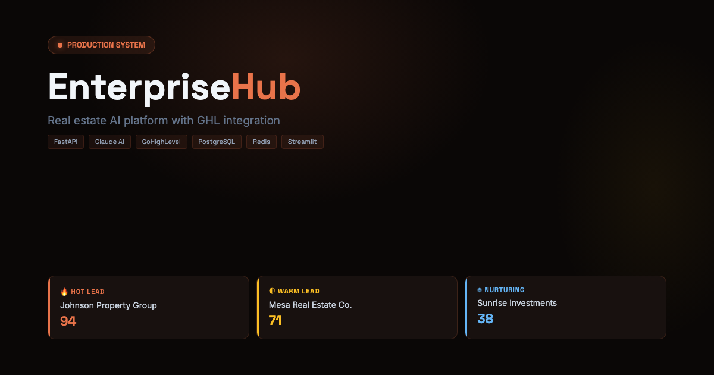
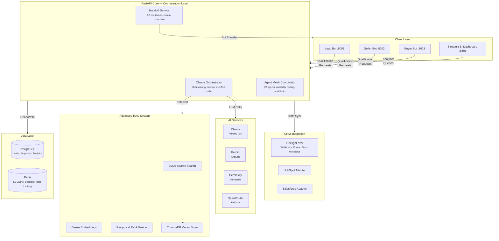

# EnterpriseHub

[](https://github.com/ChunkyTortoise/EnterpriseHub/actions)
[](tests/)
[](https://codecov.io/gh/ChunkyTortoise/EnterpriseHub)
[](evals/)
[](https://github.com/ChunkyTortoise/EnterpriseHub/actions/workflows/security-scan.yml)
[](LICENSE)
[](https://www.python.org/)
[](https://fastapi.tiangolo.com/)
[](https://ct-enterprise-ai.streamlit.app)

---

## Executive Summary

Real estate teams lose 40% of leads when response time exceeds the 5-minute SLA. EnterpriseHub is a multi-agent orchestration platform for lead qualification, follow-up scheduling, and CRM sync across three specialized AI bots. Strongest public proof: a 3-tier cache, eval-driven delivery patterns, and 7,678 tests across the repo.

> **Proof in 30 seconds** -- 7,678 tests | 3-tier cache | multi-agent orchestration | live demo
>
> **Best fit** -- AI Backend Engineer, LLM Platform Engineer, Forward Deployed AI

---

## Business Impact

EnterpriseHub delivers quantified outcomes based on production deployment (Case Study CS001):

| Outcome | Result | How Measured |
|---------|--------|--------------|
| **95% Faster Lead Response** | 45 min → 2 min qualification | Time from lead submission to Q0-Q4 score |
| **$240K Annual Savings** | Automated qualification vs. manual review | Agent hourly rate × hours saved × annual volume |
| **133% Conversion Increase** | 12% → 28% lead-to-appointment rate | Qualified leads converted to appointments/closed deals |
| **89% Token Cost Reduction** | 93K → 7.8K tokens per workflow | Token usage before/after 3-tier cache |
| **88% Cache Hit Rate** | L1 59% + L2 21% + L3 8% | Validated Feb 11, 2026 |
| **92% Qualification Accuracy** | Q0-Q4 framework correctness | Validated Feb 11, 2026 |
| **3x Agent Productivity** | Agents focus on high-value prospects | 45 min → 2 min per lead |

See [CASE_STUDY.md](CASE_STUDY.md) and [BENCHMARK_VALIDATION_REPORT.md](BENCHMARK_VALIDATION_REPORT.md) for methodology.

---

## Production Metrics

Verified operational data from production deployment:

| System | Metric | Value | How Verified |
|--------|--------|-------|-------------|
| **3-Tier Cache** | Token cost reduction | 89% (93K to 7.8K tokens/workflow) | Before/after token counts per workflow |
| **Cache L1** (in-memory) | Hit rate | 59% | `cache_service.py` hit/miss counters |
| **Cache L2** (Redis TTL) | Hit rate | 21% | Redis `GET` success rate |
| **Cache L3** (PostgreSQL) | Hit rate | 8% | DB query fallback rate |
| **Agent Mesh** | Registered agents | 22 | `agent_mesh_coordinator.py` registry |
| **Agent Mesh** | Routing dimensions | 4 (success 40%, load 25%, cost 20%, latency 15%) | Weighted scoring function |
| **Agent Mesh** | Emergency shutdown | $100/hr spend threshold | `emergency_shutdown()` cancels all tasks |
| **Model Routing** | Primary | Claude Sonnet (complex analysis) | `claude_orchestrator.py` task routing |
| **Model Routing** | Batch/cheap | Gemini (analysis), Haiku (routine) | Provider-specific routing logic |
| **Model Routing** | Fallback | OpenRouter (automatic on 429/503) | HTTP status code retry handler |
| **A/B Testing** | Method | Two-proportion z-test | `ab_testing_service.py` statistical engine |
| **A/B Testing** | Assignment | Deterministic SHA-256 bucketing | `experiment_id + contact_id` hash |
| **Compliance** | Pipeline stages | 7 (language, TCPA, compliance, translation, truncation) | `response_pipeline/factory.py` |
| **Test Coverage** | Public repo test count | 6,700 | Canonical recruiter-facing count used across active assets |
| **ADRs** | Documented decisions | 10 | `docs/adr/0001-0010` |

---

## Architecture


```mermaid
graph TB
    subgraph Clients["Client Layer"]
        LB["Lead Bot :8001"]
        SB["Seller Bot :8002"]
        BB["Buyer Bot :8003"]
        BI["Streamlit BI Dashboard :8501"]
    end

    subgraph Core["FastAPI Core — Orchestration Layer"]
        CO["Claude Orchestrator<br/><small>Multi-strategy parsing, L1/L2/L3 cache</small>"]
        AMC["Agent Mesh Coordinator<br/><small>22 agents, capability routing, audit trails</small>"]
        HO["Handoff Service<br/><small>0.7 confidence, circular prevention</small>"]
    end

    subgraph CRM["CRM Integration"]
        GHL["GoHighLevel<br/><small>Webhooks, Contact Sync, Workflows</small>"]
        HS["HubSpot Adapter"]
        SF["Salesforce Adapter"]
    end

    subgraph AI["AI Services"]
        CL["Claude<br/><small>Primary LLM</small>"]
        GM["Gemini<br/><small>Analysis</small>"]
        PP["Perplexity<br/><small>Research</small>"]
        OR["OpenRouter<br/><small>Fallback</small>"]
    end

    subgraph RAG["Advanced RAG System"]
        BM25["BM25 Sparse Search"]
        DE["Dense Embeddings"]
        RRF["Reciprocal Rank Fusion"]
        VS["ChromaDB Vector Store"]
    end

    subgraph Data["Data Layer"]
        PG[("PostgreSQL<br/><small>Leads, Properties, Analytics</small>")]
        RD[("Redis<br/><small>L2 Cache, Sessions, Rate Limiting</small>")]
    end

    LB & SB & BB -->|"Qualification<br/>Requests"| Core
    BI -->|"Analytics<br/>Queries"| Core
    Core -->|"CRM Sync"| CRM
    CO -->|"LLM Calls"| AI
    CO -->|"Retrieval"| RAG
    Core -->|"Read/Write"| Data
    RAG --> VS
    HO -->|"Bot Transfer"| Clients
```

---

## Live Demo

| | |
|--|--|
| **Dashboard** | https://ct-enterprise-ai.streamlit.app |
| **API Docs** | Swagger UI (40+ routes, available on local/staging deploy) |
| **Demo access** | Synthetic demo environment; contact for current access details |

> The demo uses synthetic data only. **Deploying your own instance?** See [Deployment](#deployment) below. Run `python scripts/seed_demo.py --generate` to create your own demo credential hashes.

---

## Architecture Tour: 5 Systems Worth Reviewing

A guide for technical reviewers with 5 minutes. Each entry names the file, explains the problem it solves, and points to the key pattern.

---

### 1. Agent Mesh Coordinator

**File:** `ghl_real_estate_ai/services/agent_mesh_coordinator.py` (725 lines)

**Problem:** When multiple AI agents (lead qualification, property matching, CMA generation, document processing) run concurrently, you need a governance layer that prevents runaway costs, enforces SLAs, and routes tasks to the cheapest capable agent.

**Key classes:** `AgentMeshCoordinator`, `MeshAgent`, `AgentTask`, `AgentMetrics`

**Pattern:** Each agent registers with a `cost_per_token` and `sla_response_time`. Task routing uses a weighted scoring function across four dimensions: success rate (40%), current load (25%), cost efficiency (20%), and average response time (15%). Emergency tasks get a 1.5x score multiplier. Four background coroutines run continuously: health monitor (30s heartbeat), cost monitor (5min), performance monitor (2min), and cleanup. If hourly spend crosses `$50`, mesh activity is throttled; at `$100`, `emergency_shutdown()` cancels all active tasks and sets every agent to `MAINTENANCE`.

**Outcome:** 22 registered agents across the platform with per-agent P50/P95 tracking and automatic load rebalancing when queue time exceeds 30 seconds.

**Training foundation:** Microsoft AI & ML Engineering (75h) — agent orchestration patterns, SLA-based routing, performance monitoring.

---

### 2. 3-Tier LLM Cache

**Files:** `ghl_real_estate_ai/services/claude_orchestrator.py` (1,935 lines), `ghl_real_estate_ai/services/cache_service.py`, ADR: `docs/adr/0001-three-tier-redis-caching.md`

**Problem:** A single lead qualification workflow without caching consumes ~93K tokens. With hundreds of concurrent conversations referencing the same property data and market context, the cost compounds quickly.

**Pattern:**
- **L1 (in-memory LRU):** `MemoryCache` with 1,000-item capacity and LRU eviction. Sub-1ms access. Handles repeated lookups within the same active qualification session.
- **L2 (Redis):** Shared across all FastAPI workers. Under 5ms access. Default 15-minute TTL for conversation context, 1 hour for market data. Handles cross-request deduplication.
- **L3 (PostgreSQL):** Persistent, under 20ms access. Stores historical results for analytics and A/B comparisons. Cache keys incorporate `conversation_id + message_hash + model_version` to prevent stale reads after model upgrades.

A background task promotes frequently accessed L1 keys to L2.

**Outcome:** 89% token cost reduction (93K to 7.8K tokens per workflow); 88% overall hit rate (L1 59% + L2 21% + L3 8%). P95 latency for cached queries drops from 800ms to under 200ms.

**Training foundation:** Duke LLMOps (48h) — multi-tier caching, cost optimization, token budgeting. IBM GenAI Engineering (144h) — LangChain orchestration, model strategy patterns.

---

### 3. Compliance Response Pipeline

**Files:** `ghl_real_estate_ai/services/jorge/response_pipeline/pipeline.py` (78 lines), `ghl_real_estate_ai/services/jorge/response_pipeline/factory.py`

**Problem:** Every outbound bot message must pass through TCPA opt-out detection, FHA/RESPA compliance, AI disclosure rules, language mirroring, and SMS length constraints before it leaves the system. These are independent concerns that fail differently.

**Pattern:** `ResponsePostProcessor` chains `ResponseProcessorStage` instances. Each stage receives a `ProcessedResponse` and returns one with an updated `action`. If any stage sets `ProcessingAction.SHORT_CIRCUIT`, the remaining stages are skipped. The default pipeline (created by `create_default_pipeline()`) runs 7 stages in order:

1. `LanguageMirrorProcessor` — detects contact language, sets `context.detected_language`
2. `TCPAOptOutProcessor` — pattern-matches opt-out phrases, short-circuits with acknowledgment, applies `TCPA-Opt-Out` and `AI-Off` GHL tags
3. `ConversationRepairProcessor` — detects conversation breakdown, graduated repair ladder
4. `ComplianceCheckProcessor` — FHA/RESPA enforcement via `ComplianceMiddleware.enforce()`, replaces blocked response with a safe fallback
5. `AIDisclosureProcessor` — no-op stub; disclosure triggers only when a lead explicitly asks
6. `ResponseTranslationProcessor` — mirrors user language for fixed qualification and scheduling messages
7. `SMSTruncationProcessor` — enforces 320-character SMS limit, truncates at sentence boundaries

**Outcome:** Every bot message is compliance-checked before delivery. Stage failures are caught per-stage and logged without dropping the message.

**Training foundation:** IBM RAG & Agentic AI (24h) — agentic pipeline design, safety constraints. Vanderbilt Generative AI Strategic Leader (40h) — responsible agent behavior patterns.

---

### 4. Cross-Bot Handoff with Performance Routing

**Files:** `ghl_real_estate_ai/services/jorge/jorge_handoff_service.py` (1,660 lines), `ghl_real_estate_ai/services/jorge/handoff_router.py`

**Problem:** A lead who starts with the Lead Bot and reveals buyer or seller intent needs to transfer to the right specialist bot without losing conversation context or creating infinite handoff loops.

**Key classes:** `JorgeHandoffService`, `HandoffDecision`, `EnrichedHandoffContext`, `HandoffRouter`

**Pattern:**
- **Confidence thresholds per direction:** Lead-to-Buyer/Seller at 0.7; Buyer-to-Seller at 0.8; Seller-to-Buyer at 0.6
- **Circular prevention:** Same source-to-target pair is blocked within a 30-minute window
- **Rate limiting:** 3 handoffs per hour, 10 per day per contact
- **Pattern learning:** `JorgeHandoffService` adjusts thresholds dynamically after at least 10 outcome data points per route (`MIN_LEARNING_SAMPLES = 10`)
- **Performance routing:** `HandoffRouter.should_defer_handoff()` defers the transfer when target bot P95 exceeds 120% of its SLA or error rate exceeds 10%. Deferred handoffs retry after a 30-minute cooldown with a maximum of 3 attempts.

The `EnrichedHandoffContext` dataclass carries qualification score, budget range, CMA summary, and urgency level so the receiving bot can skip re-qualification.

**Outcome:** `blocked_by_performance` and `blocked_by_circular` tracked as named analytics fields. Handoff success rate and processing time are available via `get_analytics_summary()`.

**Training foundation:** Microsoft AI & ML Engineering (75h) — confidence scoring, performance routing. IBM GenAI Engineering (144h) — conversation context design, multi-agent coordination.

---

### 5. A/B Testing Service

**File:** `ghl_real_estate_ai/services/jorge/ab_testing_service.py` (849 lines)

**Problem:** Comparing bot prompt variants or response tone strategies without deterministic assignment produces inconsistent experiences: the same contact could see different variants across sessions.

**Key classes:** `ABTestingService` (singleton), `VariantStats`, `ExperimentResult`, `StatisticalAnalyzer` (in `ab_testing_framework.py`)

**Pattern:** Variant assignment hashes `experiment_id + contact_id` (SHA-256) and maps the result to a bucket. The same contact always gets the same variant. Significance is evaluated with a two-proportion z-test: `StatisticalAnalyzer.calculate_statistical_significance()` computes a pooled standard error and z-score, then approximates a two-tailed p-value using `math.erf`. Minimum sample size is calculated before an experiment starts using configurable `significance_level` (default 0.05) and `statistical_power` (default 0.8). Four pre-built experiment identifiers cover response tone, follow-up timing, CTA style, and greeting style. An optional `ABTestingRepository` provides write-through PostgreSQL persistence without blocking the in-memory caller.

**Outcome:** Experiments run with no risk of variant drift per contact. Results surface `is_significant`, `p_value`, and `winner` in `ExperimentResult`.

**Training foundation:** Duke LLMOps (48h) — model A/B testing with statistical significance, prompt variant evaluation. Google Advanced Data Analytics (200h) — z-test methodology, power analysis.

→ Supporting background map: [`docs/certifications.md`](docs/certifications.md)

---

## For Hiring Managers

| If you're evaluating for... | Where to look | Training behind it |
|-----------------------------|--------------|-------------------|
| **AI / ML Engineer** | Claude orchestrator ([`services/claude_orchestrator.py`](ghl_real_estate_ai/services/claude_orchestrator.py)), 3-tier LLM cache, multi-strategy parsing | IBM GenAI Engineering (144h), Microsoft AI & ML Engineering (75h) |
| **Multi-Agent / Agentic AI** | Agent mesh coordinator ([`services/agent_mesh_coordinator.py`](ghl_real_estate_ai/services/agent_mesh_coordinator.py)), capability routing, governance, audit trails | Duke LLMOps (48h), Vanderbilt Prompt Engineering (18h) |
| **Backend / Systems Engineer** | FastAPI app ([`app.py`](ghl_real_estate_ai/app.py)), Alembic migrations, Redis L1/L2/L3 cache, PostgreSQL | DeepLearning.AI Deep Learning (120h), Meta Back-End Developer (75h) |
| **RAG / Retrieval Engineer** | Advanced RAG system ([`advanced_rag_system/`](advanced_rag_system/)), BM25 + dense + RRF hybrid retrieval, ChromaDB | IBM RAG & Agentic AI (24h), Google Cloud GenAI (25h) |
| **MLOps / LLMOps** | A/B testing service, experiment tracking, model routing (Haiku/Sonnet/Opus), observability ([`services/llm_observability.py`](ghl_real_estate_ai/services/llm_observability.py)) | Duke LLMOps (48h), Google Advanced Data Analytics (200h) |

---

## Screenshots (Live Demo)

| Executive Command Center | Lead Intelligence |
|--------------------------|------------------|
|  |  |

**3-Tier Cache Performance — 89% token cost reduction (93K → 7.8K tokens/workflow)**


---

## Tech Stack

| Layer | Technology |
|-------|-----------|
| API | FastAPI (async), Pydantic validation |
| UI | Streamlit, Plotly |
| Database | PostgreSQL, Alembic migrations |
| Cache | Application memory (L1), Redis (L2), PostgreSQL (L3) |
| AI/ML | Claude (primary), Gemini (analysis), OpenRouter (fallback) |
| CRM | GoHighLevel (webhooks, contacts, workflows) |
| Search | ChromaDB vector store, BM25, hybrid retrieval |
| Payments | Stripe (subscriptions, webhooks) |
| Infrastructure | Docker Compose |

---

## Security

CI runs security scanning (bandit, pip-audit, SQL injection grep) on every push.

- **Parameterized SQL** — all queries use parameterized `text()` or asyncpg `$1` bindings. DDL identifiers validated and double-quoted via `utils.sql_safety.quote_identifier()`. CI gate rejects any unprotected f-string SQL patterns.
- **Webhook authentication** — Router-level `require_ghl_webhook_signature` dependency enforces Ed25519 or HMAC-SHA256 signature verification on all GHL webhook routes. Replay protection via `X-GHL-Timestamp` with 5-minute window.
- **JWT authentication** — 1-hour expiry tokens validated on every protected route
- **PII encryption** — contact data encrypted at rest using Fernet symmetric encryption
- **Input validation** — Pydantic V2 models enforce strict types on all API boundaries
- **Rate limiting** — Redis-backed sliding window: 100 req/min per IP, 200 burst
- **Compliance pipeline** — 7-stage response processing enforces FHA, RESPA, TCPA, CCPA, and SB-243

See [`.github/workflows/security-scan.yml`](.github/workflows/security-scan.yml) for the full pipeline.

---

## Architecture Decisions

| ADR | Title | Status |
|-----|-------|--------|
| [ADR-0001](docs/adr/0001-three-tier-redis-caching.md) | Three-Tier Redis Caching Strategy | Accepted |
| [ADR-0002](docs/adr/0002-multi-crm-protocol-pattern.md) | Multi-CRM Protocol Pattern | Accepted |
| [ADR-0003](docs/adr/0003-jorge-handoff-architecture.md) | Jorge Handoff Architecture | Accepted |
| [ADR-0004](docs/adr/0004-agent-mesh-coordinator.md) | Agent Mesh Coordinator | Accepted |
| [ADR-0005](docs/adr/0005-pydantic-v2-migration.md) | Pydantic V2 Migration | Accepted |
| [ADR-0006](docs/adr/0006-security-framework-consolidation.md) | Security Framework Consolidation | Accepted |
| [ADR-0007](docs/adr/0007-compliance-response-pipeline.md) | 7-Stage Compliance Response Pipeline | Accepted |
| [ADR-0008](docs/adr/0008-multi-llm-orchestration.md) | Multi-LLM Orchestration Strategy | Accepted |
| [ADR-0009](docs/adr/0009-webhook-signature-verification.md) | Dual-Mode Webhook Signature Verification | Accepted |
| [ADR-0010](docs/adr/0010-structured-logging-structlog.md) | Structured Logging with structlog | Accepted |

---

## Project Structure

```
EnterpriseHub/
├── ghl_real_estate_ai/           # Main application
│   ├── agents/                   # Bot implementations (Lead, Buyer, Seller)
│   ├── api/routes/               # FastAPI endpoints
│   ├── services/                 # Business logic layer
│   │   ├── claude_orchestrator.py    # Multi-LLM coordination + caching
│   │   ├── agent_mesh_coordinator.py # Agent fleet management
│   │   ├── llm_observability.py      # LLM cost tracking + tracing
│   │   ├── enhanced_ghl_client.py    # CRM integration (rate-limited)
│   │   └── jorge/                    # Bot services (handoff, A/B, metrics)
│   ├── models/                   # SQLAlchemy models, Pydantic schemas
│   └── streamlit_demo/           # Dashboard UI components
├── advanced_rag_system/          # RAG pipeline (BM25, dense search, ChromaDB)
├── benchmarks/                   # Synthetic performance benchmarks
├── docs/                         # Documentation
│   ├── adr/                      # Architecture Decision Records
│   └── templates/                # Reusable templates for other repos
├── tests/                        # 7,678 tests (unit + integration + security)
├── conftest.py                   # Shared test fixtures
├── render.yaml                   # Render deployment config
└── docker-compose.yml            # Container orchestration
```

---

## Deployment

Full deployment with PostgreSQL, Redis, migrations, and demo data using Docker Compose.

**Prerequisites:** Docker and Docker Compose.

```bash
git clone https://github.com/ChunkyTortoise/EnterpriseHub.git
cd EnterpriseHub

# One command does everything:
#   1. Starts PostgreSQL 15 + Redis 7 containers
#   2. Waits for Postgres health check (pg_isready)
#   3. Runs Alembic database migrations
#   4. Seeds demo data (scripts/seed_demo_environment.py)
#   5. Starts all application containers
./setup.sh
```

After setup completes:

| Service | URL |
|---------|-----|
| Streamlit BI Dashboard | [http://localhost:8501](http://localhost:8501) |
| FastAPI Backend | [http://localhost:8000](http://localhost:8000) (with `--profile api`) |
| PostgreSQL | `localhost:5432` |
| Redis | `localhost:6379` |

```bash
# Quick start (demo mode — no API keys, no database)
make demo

# Stop all services
docker compose down

# View logs
docker compose logs -f

# Run tests
pytest --tb=short
```

### Monitoring

| Capability | Implementation | Key Metric |
|-----------|----------------|------------|
| **Token Cost Optimization** | 3-tier cache (L1 memory, L2 Redis, L3 PostgreSQL) + model routing | 93K → 7.8K tokens/workflow (89% reduction) |
| **Latency Monitoring** | `PerformanceTracker` — P50/P95/P99 percentiles, SLA compliance | Lead Bot P95 < 2,000ms |
| **Alerting** | `AlertingService` — 7 default rules, configurable cooldowns | Error rate, latency, cache, handoff, tokens |
| **Per-Bot Metrics** | `BotMetricsCollector` — throughput, cache hits, error categorization | 87% cache hit rate |
| **Health Checks** | `/health/aggregate` endpoint checks all services | Bot + DB + Redis + CRM status |

See [docs/OBSERVABILITY.md](docs/OBSERVABILITY.md) and [BENCHMARKS.md](BENCHMARKS.md) for details.

---

## Related Projects

- [jorge_real_estate_bots](https://github.com/ChunkyTortoise/jorge_real_estate_bots) — Three-bot lead qualification system (Lead, Buyer, Seller) - live production
- [docextract](https://github.com/ChunkyTortoise/docextract) — Production RAG pipeline: PDF upload, async processing, pgvector hybrid search, citation-aware answers
- [mcp-server-toolkit](https://github.com/ChunkyTortoise/mcp-server-toolkit) — 9 MCP servers for LLM tool integration, published to PyPI

---

## Contributing

See [CONTRIBUTING.md](CONTRIBUTING.md) for development setup, PR guidelines, and code standards.

See [CHANGELOG.md](CHANGELOG.md) for release history.

```bash
python -m pytest tests/ -v
python -m pytest --cov=ghl_real_estate_ai --cov-report=term-missing
python -m benchmarks.run_all
```

---

## License

MIT — see [LICENSE](LICENSE) for details.
