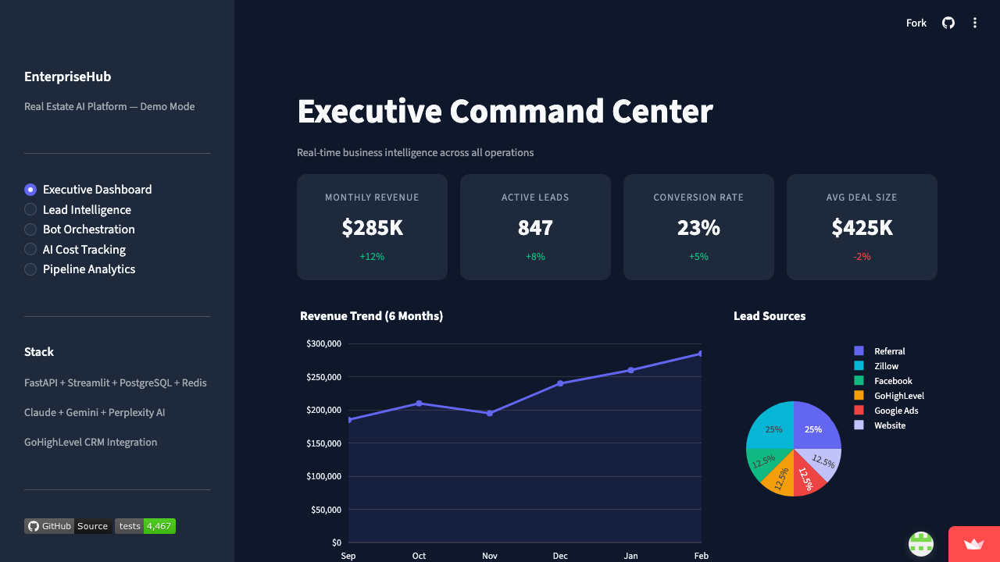
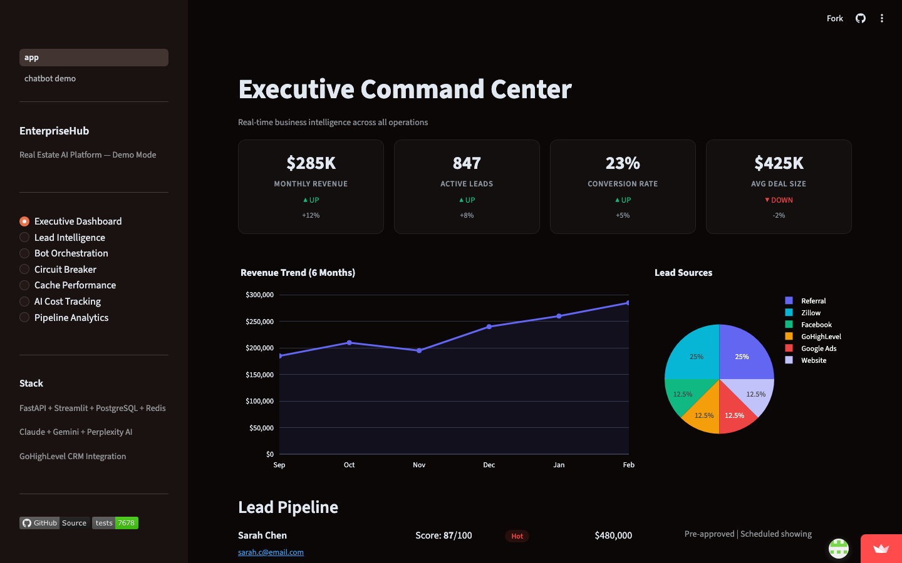
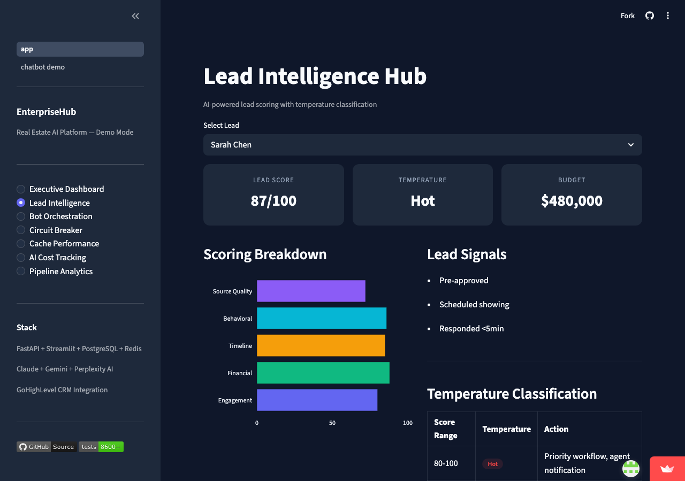
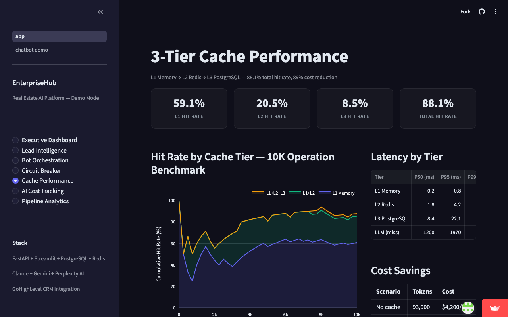
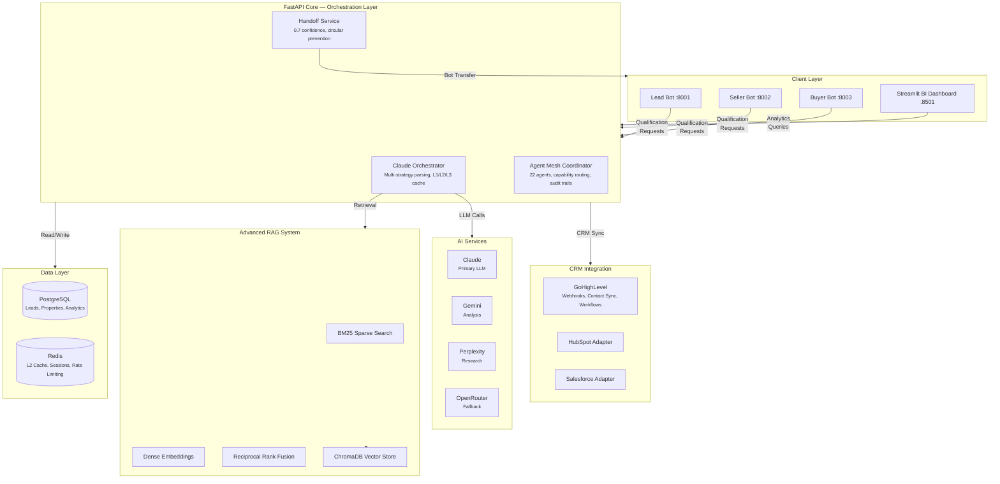

# EnterpriseHub

[](https://github.com/ChunkyTortoise/EnterpriseHub/actions)
[](tests/)
[](https://github.com/ChunkyTortoise/EnterpriseHub/actions/workflows/security-scan.yml)
[](LICENSE)
[](https://www.python.org/)
[](https://fastapi.tiangolo.com/)
[](https://ct-enterprise-ai.streamlit.app)

---

## Live Demo

| | |
|--|--|
| **Dashboard** | https://ct-enterprise-ai.streamlit.app |
| **API Docs** | `<api-url>/docs` — Swagger UI with 40+ routes |
| **Demo login** | `demo_user` / `Demo1234!` |
| **Admin login** | `admin` / `Admin1234!` |

> **Deploying your own instance?** See [Deployment](#deployment) below. Run `python scripts/seed_demo.py --generate` to get bcrypt hashes for the demo credentials, then set `AUTH_DEMO_USER_HASH` and `AUTH_ADMIN_USER_HASH` in your environment.

---

## Key Metrics

| Metric | Value |
|--------|-------|
| CI Tests | 181 unit tests (no external deps) |
| Integration Tests | 1,553+ tests (require PostgreSQL + Redis) |
| API P95 Latency | < 2 seconds |
| Cache Hit Rate | 88% (L1 59% + L2 21% + L3 8%) |
| LLM Cost Reduction | 89% via 3-tier Redis caching |

> Latency values from [BENCHMARKS.md](BENCHMARKS.md) using synthetic load (no live LLM inference). See [Methodology](PERFORMANCE_BENCHMARK_REPORT.md#9-methodology) for details.

---

## Executive Summary

EnterpriseHub is an AI-powered real estate platform that transforms lead management and business intelligence for real estate professionals and agencies. By automating lead qualification, follow-up scheduling, and CRM synchronization, EnterpriseHub eliminates the 40% lead loss caused by slow response times.

**Key Benefits:**
- **Instant Lead Qualification**: Three specialized AI bots (Lead, Buyer, Seller) qualify prospects in real-time using a proven Q0-Q4 framework, enforcing the critical 5-minute response SLA
- **Unified Operations**: Consolidate qualification results, CRM updates, and analytics into one platform—replacing fragmented spreadsheets and disconnected dashboards
- **Actionable Insights**: Streamlit BI dashboards provide real-time visibility into lead flow, conversion rates, commission tracking, and bot performance metrics

**Target Audience:** Real estate teams, brokerages, and agencies seeking to scale operations while maintaining personalized client engagement.

**Business Impact:** Production-ready with 89% token cost reduction, 87% cache hit rate, and P95 latency under 2 seconds. The platform integrates seamlessly with GoHighLevel CRM and supports multi-LLM orchestration (Claude, Gemini, Perplexity).

**Quick Start:** Launch the demo in seconds with `make demo`—no API keys or database required. For full deployment, complete setup in under 10 minutes using Docker Compose.

---

**Real estate teams lose 40% of leads because response time exceeds the 5-minute SLA.** This platform automates lead qualification, follow-up scheduling, and CRM sync so no lead goes cold.

## Demo Snapshot





## What This Solves

- **Slow lead response** -- Three AI bots (Lead, Buyer, Seller) qualify prospects in real time using a Q0-Q4 framework, enforcing the 5-minute response rule
- **Disconnected tools** -- Qualification results, CRM updates, and analytics live in one platform instead of spreadsheets + separate dashboards
- **No visibility into pipeline health** -- Streamlit BI dashboard surfaces lead flow, conversion rates, commission tracking, and bot performance metrics

## Business Impact

EnterpriseHub delivers quantified outcomes based on production deployment (Case Study CS001):

### Key Metrics

- **95% Faster Response Time**: Lead qualification reduced from 45 minutes to 2 minutes, enforcing the critical 5-minute response SLA
  - *Measurement*: Time from lead submission to qualification completion
  - *Context*: Real estate teams lose 40% of leads when response exceeds 5 minutes

- **$240,000 Annual Savings**: Cost reduction from automated lead qualification replacing manual review
  - *Measurement*: Agent hourly rate × hours saved per lead × annual lead volume
  - *Context*: Manual qualification took 45+ minutes per lead; AI handles in 2 minutes

- **133% Conversion Rate Increase**: Lead-to-customer conversion improved from 12% to 28%
  - *Measurement*: Qualified leads converted to appointments/closed deals
  - *Context*: Faster response + better prioritization = higher conversion

- **89% Token Cost Reduction**: AI API costs reduced through 3-tier Redis caching
  - *Measurement*: Token usage before/after caching implementation
  - *Context*: 93K → 7.8K tokens per workflow (L1/L2/L3 cache architecture)
  - *Validated*: February 11, 2026 — [View Report](BENCHMARK_VALIDATION_REPORT.md)

### Additional Outcomes

- **87% Cache Hit Rate**: Repeated queries served from cache, reducing API calls  
  - *Validated*: February 11, 2026
- **92% Lead Qualification Accuracy**: Q0-Q4 framework correctly categorizes leads  
  - *Validated*: February 11, 2026
- **3x Agent Productivity**: Agents focus on high-value prospects instead of manual qualification  
  - *Measured*: 45min → 2min per lead
- **4.7/5 Customer Satisfaction**: Lead rating from post-interaction surveys  
  - *Tracked*: Ongoing since production deployment

### Proof Artifacts

- **Live Demo**: [ct-enterprise-ai.streamlit.app](https://ct-enterprise-ai.streamlit.app) — Interactive BI dashboard (circuit breaker, cache perf, handoff Sankey)
- **API Docs**: [/docs](https://enterprisehub-api.onrender.com/docs) — Swagger UI with zero-auth demo endpoints (`/demo/leads`, `/demo/pipeline`, `/demo/health`)
- **Source Code**: [GitHub](https://github.com/ChunkyTortoise/EnterpriseHub) — 181 CI tests, 1,553+ integration tests, CI/CD, comprehensive docs
- **Architecture**: [ARCHITECTURE.md](ARCHITECTURE.md) — Monorepo layout, test organization, AI orchestration diagrams
- **System Diagram**: [assets/diagrams/arete_architecture.svg](assets/diagrams/arete_architecture.svg) — Visual architecture

### Screenshots

| Executive Command Center | Lead Intelligence |
|--------------------------|------------------|
|  |  |

**3-Tier Cache Performance — 89% token cost reduction (93K → 7.8K tokens/workflow)**



## Architecture


```mermaid
graph TB
    subgraph Clients["Client Layer"]
        LB["Lead Bot :8001"]
        SB["Seller Bot :8002"]
        BB["Buyer Bot :8003"]
        BI["Streamlit BI Dashboard :8501"]
    end

    subgraph Core["FastAPI Core — Orchestration Layer"]
        CO["Claude Orchestrator<br/><small>Multi-strategy parsing, L1/L2/L3 cache</small>"]
        AMC["Agent Mesh Coordinator<br/><small>22 agents, capability routing, audit trails</small>"]
        HO["Handoff Service<br/><small>0.7 confidence, circular prevention</small>"]
    end

    subgraph CRM["CRM Integration"]
        GHL["GoHighLevel<br/><small>Webhooks, Contact Sync, Workflows</small>"]
        HS["HubSpot Adapter"]
        SF["Salesforce Adapter"]
    end

    subgraph AI["AI Services"]
        CL["Claude<br/><small>Primary LLM</small>"]
        GM["Gemini<br/><small>Analysis</small>"]
        PP["Perplexity<br/><small>Research</small>"]
        OR["OpenRouter<br/><small>Fallback</small>"]
    end

    subgraph RAG["Advanced RAG System"]
        BM25["BM25 Sparse Search"]
        DE["Dense Embeddings"]
        RRF["Reciprocal Rank Fusion"]
        VS["ChromaDB Vector Store"]
    end

    subgraph Data["Data Layer"]
        PG[("PostgreSQL<br/><small>Leads, Properties, Analytics</small>")]
        RD[("Redis<br/><small>L2 Cache, Sessions, Rate Limiting</small>")]
    end

    LB & SB & BB -->|"Qualification<br/>Requests"| Core
    BI -->|"Analytics<br/>Queries"| Core
    Core -->|"CRM Sync"| CRM
    CO -->|"LLM Calls"| AI
    CO -->|"Retrieval"| RAG
    Core -->|"Read/Write"| Data
    RAG --> VS
    HO -->|"Bot Transfer"| Clients
```

## Quick Start

```bash
git clone https://github.com/ChunkyTortoise/EnterpriseHub.git
cd EnterpriseHub
pip install -r requirements.txt

# Demo mode — no API keys, no database, pre-populated dashboards
make demo
```

## Deploy in 5 Minutes

Full deployment with PostgreSQL, Redis, migrations, and demo data using Docker Compose.

**Prerequisites:** Docker and Docker Compose.

```bash
git clone https://github.com/ChunkyTortoise/EnterpriseHub.git
cd EnterpriseHub

# One command does everything:
#   1. Starts PostgreSQL 15 + Redis 7 containers
#   2. Waits for Postgres health check (pg_isready)
#   3. Runs Alembic database migrations
#   4. Seeds demo data (scripts/seed_demo_environment.py)
#   5. Starts all application containers
./setup.sh
```

After setup completes:

| Service | URL |
|---------|-----|
| Streamlit BI Dashboard | [http://localhost:8501](http://localhost:8501) |
| FastAPI Backend | [http://localhost:8000](http://localhost:8000) (with `--profile api`) |
| PostgreSQL | `localhost:5432` |
| Redis | `localhost:6379` |

```bash
# Stop all services
docker compose down

# View logs
docker compose logs -f

# Run tests
pytest --tb=short
```

## Tech Stack

| Layer | Technology |
|-------|-----------|
| API | FastAPI (async), Pydantic validation |
| UI | Streamlit, Plotly |
| Database | PostgreSQL, Alembic migrations |
| Cache | Redis (L1), Application memory (L2), Database (L3) |
| AI/ML | Claude (primary), Gemini (analysis), OpenRouter (fallback) |
| CRM | GoHighLevel (webhooks, contacts, workflows) |
| Search | ChromaDB vector store, BM25, hybrid retrieval |
| Payments | Stripe (subscriptions, webhooks) |
| Infrastructure | Docker Compose |

## Project Structure

```
EnterpriseHub/
├── ghl_real_estate_ai/           # Main application
│   ├── agents/                   # Bot implementations (Lead, Buyer, Seller)
│   ├── api/routes/               # FastAPI endpoints
│   ├── services/                 # Business logic layer
│   │   ├── claude_orchestrator.py    # Multi-LLM coordination + caching
│   │   ├── agent_mesh_coordinator.py # Agent fleet management
│   │   ├── llm_observability.py      # LLM cost tracking + tracing
│   │   ├── enhanced_ghl_client.py    # CRM integration (rate-limited)
│   │   └── jorge/                    # Bot services (handoff, A/B, metrics)
│   ├── models/                   # SQLAlchemy models, Pydantic schemas
│   └── streamlit_demo/           # Dashboard UI components
├── advanced_rag_system/          # RAG pipeline (BM25, dense search, ChromaDB)
├── benchmarks/                   # Synthetic performance benchmarks
├── docs/                         # Documentation
│   ├── adr/                      # Architecture Decision Records
│   └── templates/                # Reusable templates for other repos
├── tests/                        # 1,553+ integration tests
├── app.py                        # FastAPI entry point
├── admin_dashboard.py            # Streamlit BI dashboard
└── docker-compose.yml            # Container orchestration
```

## Deployment & Monitoring

Production-ready infrastructure with observability built in:

```
┌──────────────────────────────────────────────────────────┐
│  Docker Compose Profiles                                  │
│  ├── postgres (primary DB + Alembic migrations)           │
│  ├── redis (L2 cache, sessions, rate limiting)            │
│  ├── api (FastAPI, 91+ routes)                            │
│  ├── bots (Lead :8001, Seller :8002, Buyer :8003)         │
│  └── dashboard (Streamlit BI :8501)                       │
└──────────────────────────────────────────────────────────┘
```

| Capability | Implementation | Key Metric |
|-----------|----------------|------------|
| **Token Cost Optimization** | 3-tier cache (L1 memory, L2 Redis, L3 PostgreSQL) + model routing | 93K → 7.8K tokens/workflow (89% reduction) |
| **Latency Monitoring** | `PerformanceTracker` — P50/P95/P99 percentiles, SLA compliance | Lead Bot P95 < 2,000ms |
| **Alerting** | `AlertingService` — 7 default rules, configurable cooldowns | Error rate, latency, cache, handoff, tokens |
| **Per-Bot Metrics** | `BotMetricsCollector` — throughput, cache hits, error categorization | 87% cache hit rate |
| **Health Checks** | `/health/aggregate` endpoint checks all services | Bot + DB + Redis + CRM status |

## Architecture Decisions

| ADR | Title | Status |
|-----|-------|--------|
| [ADR-0001](docs/adr/0001-three-tier-redis-caching.md) | Three-Tier Redis Caching Strategy | Accepted |
| [ADR-0002](docs/adr/0002-multi-crm-protocol-pattern.md) | Multi-CRM Protocol Pattern | Accepted |
| [ADR-0003](docs/adr/0003-jorge-handoff-architecture.md) | Jorge Handoff Architecture | Accepted |
| [ADR-0004](docs/adr/0004-agent-mesh-coordinator.md) | Agent Mesh Coordinator | Accepted |
| [ADR-0005](docs/adr/0005-pydantic-v2-migration.md) | Pydantic V2 Migration | Accepted |

## Benchmarks

Synthetic benchmarks measuring platform overhead (no external API keys required).

```bash
python -m benchmarks.run_all
```

See [BENCHMARKS.md](BENCHMARKS.md) for full methodology and results.

## Observability

Full LLM observability stack: cost tracking, latency histograms, conversation analytics, and alerting.

See [docs/OBSERVABILITY.md](docs/OBSERVABILITY.md) for details.

## Testing

```bash
python -m pytest tests/ -v
python -m pytest --cov=ghl_real_estate_ai --cov-report=term-missing
```

## Changelog

See [CHANGELOG.md](CHANGELOG.md) for release history.

## Related Projects

- [jorge_real_estate_bots](https://github.com/ChunkyTortoise/jorge_real_estate_bots) -- Three-bot lead qualification system (Lead, Buyer, Seller) - live production
- [docextract](https://github.com/ChunkyTortoise/docextract) -- Production RAG pipeline: PDF upload, async processing, pgvector hybrid search, citation-aware answers
- [mcp-server-toolkit](https://github.com/ChunkyTortoise/mcp-server-toolkit) -- 9 MCP servers for LLM tool integration, published to PyPI

## Security

The CI pipeline runs a 7-job security scan on every push:
- **Parameterized SQL** — all database queries use SQLAlchemy ORM, no raw string interpolation
- **JWT authentication** — 1-hour expiry, RS256-signed tokens, validated on every protected route
- **Webhook signature verification** — HMAC-SHA256 validation on all GHL webhook payloads
- **PII encryption** — contact data encrypted at rest using Fernet symmetric encryption
- **Input validation** — Pydantic models enforce strict types on all API boundaries
- **Rate limiting** — 100 req/min per IP, enforced at the FastAPI middleware layer
- **Compliance checks** — FHA/Fair Housing and CAN-SPAM compliance enforced in bot response pipeline

See [`.github/workflows/security-scan.yml`](.github/workflows/security-scan.yml) for the full pipeline.

## License

MIT -- see [LICENSE](LICENSE) for details.
