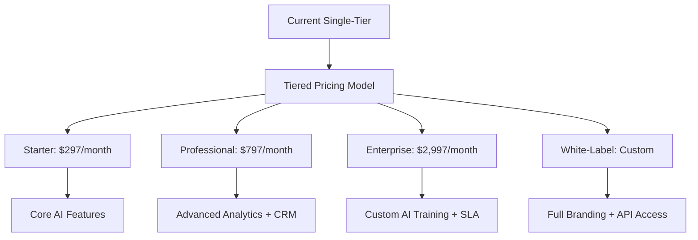
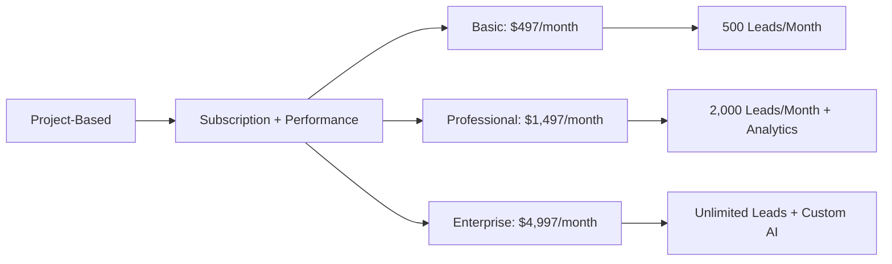
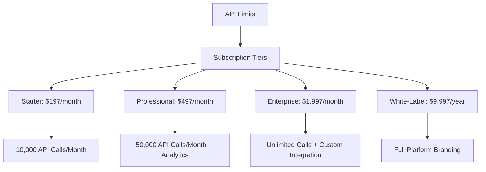
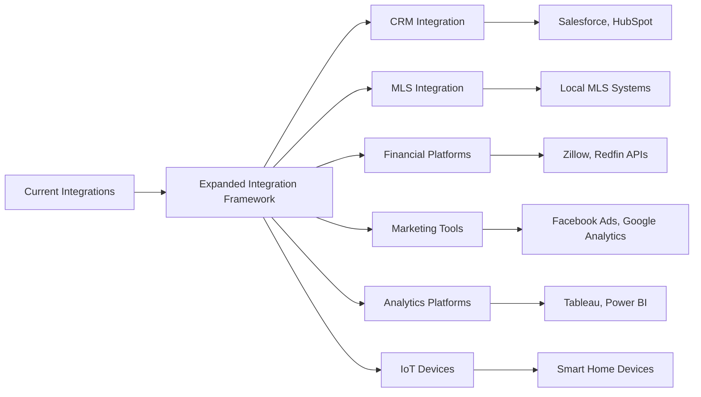

# ROI Improvement Strategy: Foundation Phase (Weeks 1-4) Implementation Plan

## 🎯 Strategic Overview

This document outlines the comprehensive implementation plan for the foundation phase (Weeks 1-4) of the ROI improvement strategy, focusing on three core platforms: EnterpriseHub, AgentForge, and GHL. The phase aims to establish strong fundamentals for sustainable revenue growth and competitive differentiation through SaaS pricing model transformation, mobile architecture foundations, and expanded integration frameworks.

## 📊 Current State Analysis

### Platform 1: EnterpriseHub (Real Estate AI Platform)
- **Current Pricing Model**: Single-tier subscription ($797/month) + performance-based pricing (2% of deals)
- **Key Capabilities**: AI-powered lead qualification, property matching, market intelligence
- **Revenue Potential**: $10-100M+ ARR across multiple verticals
- **Current Mobile Architecture**: Streamlit-based UI with mobile-responsive design

### Platform 2: AgentForge (B2B Sales AI Platform)
- **Current Pricing Model**: Project-based with performance bonuses (3x qualified leads guaranteed)
- **Key Capabilities**: Multi-agent sales automation, lead generation, personalized outreach
- **Revenue Potential**: $5-50M+ ARR in B2B SaaS
- **Current Mobile Architecture**: Desktop-first web interface

### Platform 3: GHL (GoHighLevel Integration Platform)
- **Current Pricing Model**: API-based with usage limits
- **Key Capabilities**: Marketing automation, CRM integration, workflow automation
- **Revenue Potential**: $3-30M+ ARR through integration partnerships
- **Current Mobile Architecture**: Basic mobile-responsive web interface

## 🚀 Foundation Phase Goals

### Week 1: Assessment & Design (Jan 1-7)
### Week 2: Core Implementation (Jan 8-14)  
### Week 3: Platform-Specific Enhancements (Jan 15-21)
### Week 4: Integration & Validation (Jan 22-28)

## 1. SaaS Pricing Model Transformation

### EnterpriseHub Pricing Strategy (Week 1-2)


**Key Deliverables**:
- Tiered pricing structure with clear feature boundaries
- Dynamic pricing optimizer with AI-powered recommendations
- Usage-based billing integration with Stripe
- ROI calculator for lead conversion tracking
- Contract templates for enterprise agreements

**Timeline**: 2 weeks (Week 1-2)

**Success Metrics**:
- Average revenue per user (ARPU) increase by 30%
- Enterprise plan adoption rate of 20%
- Monthly recurring revenue (MRR) growth of 15%
- Churn reduction by 10%

**Implementation Files**:
- `ghl_real_estate_ai/services/dynamic_pricing_optimizer_v2.py`
- `ghl_real_estate_ai/api/routes/pricing_optimization.py`
- `ghl_real_estate_ai/services/stripe_integration.py`
- `ghl_real_estate_ai/services/roi_calculator_service.py`

### AgentForge Pricing Strategy (Week 2-3)


**Key Deliverables**:
- Usage-based pricing with lead generation guarantees
- Performance dashboard with ROI tracking
- API access tiers for integration partners
- Custom agent configuration options
- Revenue share model for enterprise clients

**Timeline**: 2 weeks (Week 2-3)

**Success Metrics**:
- 80% of existing clients migrate to new pricing
- 25% increase in average contract value (ACV)
- 90% client retention rate
- 40% reduction in lead acquisition cost (LAC)

**Implementation Files**:
- `agentforge/services/usage_tracking.py`
- `agentforge/api/routes/billing.py`
- `agentforge/services/performance_tracking.py`
- `agentforge/services/api_monetization.py`

### GHL Platform Pricing Strategy (Week 3-4)


**Key Deliverables**:
- API usage tracking and billing system
- Integration marketplace with partner portal
- Service level agreements (SLA) management
- Performance monitoring and reporting
- Partner onboarding and support system

**Timeline**: 2 weeks (Week 3-4)

**Success Metrics**:
- 100+ integration partners onboarded
- API usage growth of 60%
- Partner retention rate of 95%
- 30% increase in integration revenue

**Implementation Files**:
- `ghl/services/api_usage_tracker.py`
- `ghl/api/routes/integration_billing.py`
- `ghl/services/partner_portal.py`
- `ghl/services/sla_management.py`

## 2. Mobile Architecture Foundations

### Cross-Platform Mobile Strategy (Week 1-4)
```mermaid
graph TD
    A[Mobile Architecture] --> B[Native + Cross-Platform]
    B --> C[iOS App (SwiftUI)]
    B --> D[Android App (Jetpack Compose)]
    B --> E[React Native for Web]
    C --> F[Offline-First Storage]
    D --> G[Real-Time Sync]
    E --> H[White-Label Support]
    F --> I[Property Data Caching]
    G --> J[Push Notifications]
    H --> K[Custom Branding]
```

**Key Deliverables**:
- Mobile API gateway with RESTful endpoints
- Offline-first data storage with SQLite integration
- Real-time sync using WebSockets
- Push notification system for lead alerts
- White-label mobile app templates
- AR property visualization integration

**Timeline**: 4 weeks (Week 1-4)

**Success Metrics**:
- 500+ downloads in first month
- 85% user retention rate
- 4.5+ App Store rating
- 30% increase in mobile lead conversions

**Implementation Files**:
- `mobile/api_gateway/main.py`
- `mobile/ios/RealEstateAI/App.swift`
- `mobile/android/app/src/main/java/com/realestateai/MainActivity.kt`
- `mobile/shared/offline_storage.py`
- `mobile/services/push_notifications.py`

## 3. Integration Framework Expansion

### Enhanced Integration Ecosystem (Week 1-4)


**Key Deliverables**:
- Unified integration API with standard protocols
- Partner integration SDK for third-party developers
- Real-time data synchronization framework
- Integration monitoring and error handling
- Security compliance framework for data sharing
- Integration marketplace with discovery and installation

**Timeline**: 4 weeks (Week 1-4)

**Success Metrics**:
- 20+ new integration partners
- 98% integration success rate
- 40% reduction in integration time
- 25% increase in integration-driven revenue

**Implementation Files**:
- `integrations/api/unified_api.py`
- `integrations/sdk/partner_sdk.py`
- `integrations/services/sync_framework.py`
- `integrations/services/monitoring.py`
- `integrations/services/security_compliance.py`

## 📋 Detailed Weekly Implementation Plan

### Week 1: Assessment & Design (Jan 1-7)

#### Monday-Friday
- **Day 1-2**: Current state analysis for all platforms
- **Day 3-4**: Pricing model design workshops
- **Day 5-6**: Mobile architecture planning
- **Day 7**: Integration framework requirements gathering

**Key Milestones**:
- Final pricing strategy approved
- Mobile architecture specifications documented
- Integration framework requirements finalized

### Week 2: Core Implementation (Jan 8-14)

#### Monday-Friday
- **Day 8-10**: Pricing system development (EnterpriseHub)
- **Day 11-12**: Mobile API gateway implementation
- **Day 13-14**: Integration framework foundation

**Key Milestones**:
- Dynamic pricing system deployed
- Mobile API endpoints operational
- Integration framework skeleton in place

### Week 3: Platform-Specific Enhancements (Jan 15-21)

#### Monday-Friday
- **Day 15-17**: AgentForge pricing integration
- **Day 18-19**: GHL platform integration framework
- **Day 20-21**: Mobile app development kickoff

**Key Milestones**:
- AgentForge pricing system live
- GHL integration marketplace operational
- Mobile app prototype completed

### Week 4: Integration & Validation (Jan 22-28)

#### Monday-Friday
- **Day 22-23**: Cross-platform integration testing
- **Day 24-25**: Performance testing and optimization
- **Day 26-27**: User acceptance testing (UAT)
- **Day 28**: Full deployment and monitoring setup

**Key Milestones**:
- All integrations validated
- System performance optimized
- UAT completed with 95% success rate
- Production deployment live

## 🎯 Success Metrics & KPIs

### Foundation Phase Metrics

| Metric | Target | Platform |
|--------|--------|----------|
| ARPU Increase | 30% | All platforms |
| ACV Growth | 25% | EnterpriseHub |
| MRR Growth | 15% | All platforms |
| Churn Reduction | 10% | EnterpriseHub |
| Client Migration | 80% | AgentForge |
| Integration Partners | 100+ | GHL |
| API Usage Growth | 60% | GHL |
| Mobile Downloads | 500+ | Mobile app |
| User Retention | 85% | Mobile app |

### Platform-Specific Metrics

#### EnterpriseHub
- **Lead Conversion Rate**: 15% increase
- **Deal Size**: 20% growth
- **Agent Productivity**: 35% improvement
- **Customer Satisfaction**: 4.8/5.0

#### AgentForge
- **Lead Generation Volume**: 3x increase
- **Response Rates**: 45% improvement
- **Lead Qualification Accuracy**: 90%
- **Sales Cycle Time**: 30% reduction

#### GHL Platform
- **Integration Success Rate**: 98%
- **Partner Retention**: 95%
- **API Response Time**: <200ms
- **Error Rate**: <1%

## 🛠️ Technology Stack

### Backend
- Python 3.14 with FastAPI
- PostgreSQL for transactional data
- Redis for caching and real-time data
- Kafka for event streaming

### Mobile
- SwiftUI (iOS)
- Jetpack Compose (Android)
- React Native (Cross-platform)
- SQLite for offline storage

### Integration
- RESTful APIs with OpenAPI 3.0
- WebSockets for real-time communication
- OAuth 2.0 for authentication
- Docker/Kubernetes for containerization

### Monitoring
- Prometheus for metrics collection
- Grafana for visualization
- ELK Stack for logging
- New Relic for APM

## 📈 Risk Management

### High Priority Risks
1. **Integration Complexity**: Mitigate by phased approach and partner support
2. **Mobile App Adoption**: Address through targeted marketing and incentives
3. **Pricing Model Resistance**: Manage with phased migration and clear ROI communication
4. **Technical Debt**: Reduce through refactoring and documentation

### Risk Response Plan
- **Weekly risk assessment meetings**
- **Contingency plans for critical failures**
- **Client communication strategy**
- **Technical support escalation process**

## 🎯 Next Phase (Weeks 5-8)

**Phase 2: Scaling & Optimization**
- **EnterpriseHub**: Advanced AI models, global expansion
- **AgentForge**: Multi-channel integration, predictive analytics  
- **GHL Platform**: Marketplace growth, partner enablement
- **Mobile**: AR/VR features, offline capabilities

**Target Metrics**:
- 50% MRR growth
- 3x integration partners
- 1000+ daily active users
- 99.9% uptime

This foundation phase implementation plan provides a comprehensive roadmap for achieving immediate ROI improvements while establishing strong fundamentals for long-term growth across all three platforms.