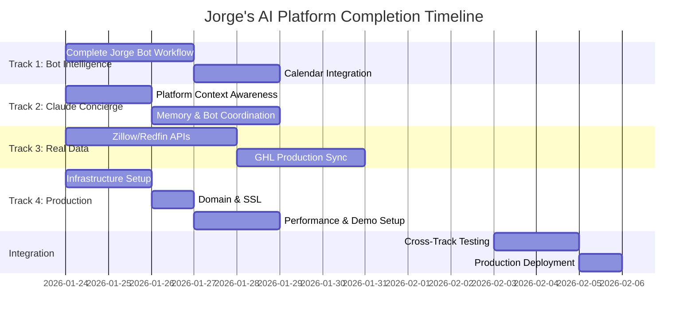

# 🎮 PARALLEL DEVELOPMENT COORDINATION GUIDE

## 🎯 **MISSION: COORDINATE 4 SPECIALIZED TRACKS TO COMPLETE JORGE'S AI PLATFORM**

This document provides the coordination strategy for developing Jorge's AI platform across 4 parallel tracks, ensuring seamless integration and timely delivery of a production-ready system.

---

## 📊 **TRACK OVERVIEW & DEPENDENCIES**

### **Track Status Summary**
- **Track 1 (Bot Intelligence)**: 25% remaining - Core bot workflows and scheduling
- **Track 2 (Claude Concierge)**: 40% remaining - Omnipresent AI assistance
- **Track 3 (Real Data Integration)**: 60% remaining - External APIs and live data
- **Track 4 (Production Hosting)**: 30% remaining - Online deployment and client demo

### **Critical Path Analysis**


---

## 🔄 **INTEGRATION DEPENDENCY MATRIX**

### **Critical Integration Points**

| Integration | Tracks Involved | Dependency | Priority | Timeline |
|-------------|----------------|------------|----------|----------|
| **Bot State → Concierge** | T1 ↔ T2 | Bot workflow state shared with Claude | HIGH | Day 3 |
| **Real Data → Bots** | T3 → T1 | Property/lead data feeding bot decisions | HIGH | Day 5 |
| **Concierge ↔ Live Data** | T2 ↔ T3 | Concierge using real market intelligence | MEDIUM | Day 6 |
| **Production ← All Tracks** | T1,T2,T3 → T4 | Deploy completed features to hosting | HIGH | Day 8 |
| **Client Demo Integration** | T1,T2,T4 | Bot demos with concierge on live hosting | HIGH | Day 10 |

### **Data Flow Integration**
```
┌─────────────────┐    ┌─────────────────┐
│   Track 3       │    │   Track 1       │
│   Real Data     │───▶│   Bot Logic     │
│                 │    │                 │
└─────────────────┘    └─────────────────┘
         │                       │
         ▼                       ▼
┌─────────────────┐    ┌─────────────────┐
│   Track 2       │    │   Track 4       │
│   Claude        │◀───│   Production    │
│   Concierge     │    │   Hosting       │
└─────────────────┘    └─────────────────┘
```

---

## 📅 **DAILY COORDINATION SCHEDULE**

### **Daily Standup Format** (15 minutes, 9:00 AM)

```
Jorge Platform Daily Standup - Day X

Track 1 (Bot Intelligence):
├─ Yesterday: [Completed work]
├─ Today: [Planned work]
├─ Blockers: [Integration dependencies]
└─ Integration needs: [Data/API requirements from other tracks]

Track 2 (Claude Concierge):
├─ Yesterday: [Completed work]
├─ Today: [Planned work]
├─ Blockers: [Bot state access, memory service needs]
└─ Integration needs: [Context data from Track 1]

Track 3 (Real Data):
├─ Yesterday: [Completed work]
├─ Today: [Planned work]
├─ Blockers: [API limits, data structure questions]
└─ Integration needs: [Data format requirements from Track 1,2]

Track 4 (Production):
├─ Yesterday: [Completed work]
├─ Today: [Planned work]
├─ Blockers: [Code readiness from other tracks]
└─ Integration needs: [Deployment packages from Track 1,2,3]

Integration Status:
├─ Critical blockers: [Any track-blocking issues]
├─ Today's handoffs: [Code/data exchanges between tracks]
└─ Tomorrow's integrations: [Planned cross-track work]
```

### **Weekly Integration Review** (Fridays, 4:00 PM)

```
Jorge Platform Weekly Review - Week X

Completed Integrations:
├─ Bot ↔ Concierge: [Status and functionality]
├─ Data ↔ Bots: [Real data flowing to bot decisions]
├─ Production deployment: [Features live and working]
└─ Client demo readiness: [Demonstration capabilities]

Integration Challenges:
├─ Technical issues: [Cross-track technical problems]
├─ Data inconsistencies: [Data format or timing issues]
├─ Performance concerns: [Speed/scalability of integrations]
└─ User experience gaps: [UI/UX integration issues]

Next Week Priorities:
├─ Critical path items: [Must-complete integrations]
├─ Risk mitigation: [Address potential integration failures]
├─ Performance optimization: [Speed up slow integrations]
└─ Client demo preparation: [Polish integrated features]
```

---

## 🤝 **COMMUNICATION PROTOCOLS**

### **Slack Channel Structure**

```
#jorge-platform-main          # General coordination, announcements
├─ #track-1-bot-intelligence   # Bot development team
├─ #track-2-claude-concierge   # Concierge development team
├─ #track-3-real-data         # Data integration team
├─ #track-4-production        # DevOps/hosting team
└─ #integration-alerts        # Cross-track coordination alerts
```

### **Communication Guidelines**

**🔴 IMMEDIATE (Post within 15 minutes)**:
- Blocking another track's progress
- Breaking changes to shared APIs/data structures
- Production deployment failures
- Security vulnerabilities discovered

**🟡 SAME DAY (Post within 4 hours)**:
- Completed integration milestones
- API/data format changes with 24hr notice
- New dependencies on other tracks
- Testing results affecting other tracks

**🟢 NEXT STANDUP (Post within 24 hours)**:
- Feature completion status
- Non-blocking questions or suggestions
- Performance optimization insights
- Documentation updates

### **Integration Handoff Protocol**

```
Integration Handoff Checklist:

□ Code Review: Implementation reviewed by receiving track
□ Testing: Unit and integration tests pass
□ Documentation: API/interface documentation updated
□ Data Contracts: Input/output formats documented
□ Error Handling: Graceful failure modes implemented
□ Performance: Meets performance requirements
□ Security: Security review completed
□ Deployment: Ready for production integration
```

---

## 📝 **SHARED DATA CONTRACTS**

### **Bot State Interface** (Track 1 → Track 2)
```typescript
interface BotState {
  botType: 'jorge-seller' | 'lead-bot' | 'intent-decoder';
  conversationId: string;
  leadId: string;
  currentStage: string;
  temperature: number; // 0-100
  qualificationData: {
    timeline?: string;
    motivation?: string;
    budget?: number;
    condition?: string;
  };
  nextAction?: string;
  confidence?: number;
  lastUpdated: string;
}
```

### **Property Data Interface** (Track 3 → Track 1, 2)
```typescript
interface PropertyData {
  zpid: string;
  address: string;
  price: number;
  bedrooms: number;
  bathrooms: number;
  squareFeet: number;
  zestimate: number;
  marketTrends: MarketTrends;
  comparableSales: ComparableSale[];
  daysOnMarket: number;
  priceHistory: PriceHistoryEntry[];
  lastUpdated: string;
}

interface MarketTrends {
  medianPrice: number;
  priceChange: number; // percentage
  inventoryLevel: number;
  averageDaysOnMarket: number;
  trend: 'rising' | 'falling' | 'stable';
}
```

### **Concierge Context Interface** (Track 2 ↔ All)
```typescript
interface ConciergeContext {
  currentPage: string;
  activeBots: string[];
  currentLead?: Lead;
  currentProperty?: Property;
  recentActions: UserAction[];
  userIntent?: string;
  relevantMemories: Memory[];
  proactiveSuggestions: Suggestion[];
}
```

---

## 🧪 **INTEGRATION TESTING STRATEGY**

### **Daily Integration Testing**

```bash
#!/bin/bash
# scripts/daily-integration-test.sh

echo "🧪 Jorge Platform Daily Integration Testing"

# Test Track 1 → Track 2 integration
echo "Testing Bot State → Concierge Context..."
curl -X POST localhost:8000/api/bots/jorge-seller-bot/chat \
  -d '{"content": "I want to sell my house"}' | \
  jq '.metadata.botState' > /tmp/bot_state.json

# Verify concierge receives bot state
curl localhost:3000/api/concierge/context | \
  jq '.activeBots' | grep -q "jorge-seller-bot"

if [ $? -eq 0 ]; then
    echo "✅ Bot → Concierge integration working"
else
    echo "❌ Bot → Concierge integration broken"
fi

# Test Track 3 → Track 1 integration
echo "Testing Real Data → Bot Decisions..."
curl localhost:8000/api/properties/search?location="Miami" | \
  jq '.properties[0]' > /tmp/property_data.json

# Verify bot uses real property data
curl -X POST localhost:8000/api/bots/jorge-seller-bot/chat \
  -d '{"content": "What is my house worth?", "propertyData": '$(cat /tmp/property_data.json)'}' | \
  grep -q "based on recent sales"

if [ $? -eq 0 ]; then
    echo "✅ Real Data → Bot integration working"
else
    echo "❌ Real Data → Bot integration broken"
fi

# Test all tracks in production
echo "Testing Production Integration..."
curl -s https://jorge-ai-platform.com/api/bots/health | \
  jq '.integrationStatus'

echo "🎉 Daily integration testing complete"
```

### **End-to-End User Journey Testing**

```typescript
// tests/e2e-user-journey.spec.ts
describe('Jorge Complete User Journey', () => {
  test('Lead qualification → Calendar scheduling → Real property data', async () => {
    // Track 1: Start Jorge bot conversation
    const botResponse = await apiClient.post('/api/bots/jorge-seller-bot/chat', {
      content: 'I need to sell my house at 123 Main St'
    });

    // Track 3: Verify real property data integration
    expect(botResponse.data.propertyData).toBeDefined();
    expect(botResponse.data.propertyData.zestimate).toBeGreaterThan(0);

    // Track 2: Verify concierge awareness
    const conciergeContext = await apiClient.get('/api/concierge/context');
    expect(conciergeContext.data.currentLead).toBeDefined();

    // Track 1: Schedule appointment
    const scheduleResponse = await apiClient.post('/api/calendar/schedule', {
      leadId: botResponse.data.leadId,
      datetime: '2026-01-25T10:00:00Z'
    });

    // Track 4: Verify in production
    if (process.env.NODE_ENV === 'production') {
      const prodHealth = await apiClient.get('https://jorge-ai-platform.com/api/bots/health');
      expect(prodHealth.status).toBe(200);
    }
  });
});
```

---

## ⚡ **PERFORMANCE COORDINATION**

### **Shared Performance Targets**

| Component | Track | Target | Measurement | Impact |
|-----------|-------|--------|-------------|--------|
| Bot Response Time | T1 | <500ms | API endpoint timing | User experience |
| Concierge Context Update | T2 | <200ms | State synchronization | UI responsiveness |
| Real Data Freshness | T3 | <15 minutes | Cache invalidation | Data accuracy |
| Page Load Time | T4 | <3 seconds | CDN + optimization | Client demos |
| WebSocket Events | All | <100ms | Event propagation | Real-time updates |

### **Performance Monitoring Integration**

```python
# Shared performance monitoring across all tracks
class CrossTrackPerformanceMonitor:
    async def measure_integration_latency(self, from_track: str, to_track: str, operation: str):
        """Measure latency between track integrations"""
        start_time = time.time()
        # Integration call
        end_time = time.time()

        latency = (end_time - start_time) * 1000  # milliseconds
        await self.record_metric(f"{from_track}_to_{to_track}_{operation}_latency", latency)

        if latency > self.get_threshold(operation):
            await self.alert_performance_issue(from_track, to_track, operation, latency)

    async def generate_daily_performance_report(self):
        """Generate performance report across all tracks"""
        report = {
            'bot_response_times': await self.get_track_performance('track_1'),
            'concierge_update_times': await self.get_track_performance('track_2'),
            'data_fetch_times': await self.get_track_performance('track_3'),
            'page_load_times': await self.get_track_performance('track_4'),
            'integration_latencies': await self.get_integration_latencies()
        }
        return report
```

---

## 🚨 **RISK MITIGATION STRATEGIES**

### **Common Integration Risks**

**🔴 HIGH RISK: Data Format Mismatches**
- **Prevention**: Shared TypeScript interfaces, Pydantic models
- **Detection**: Schema validation in CI/CD
- **Mitigation**: Graceful fallbacks, data transformation layers

**🟡 MEDIUM RISK: Performance Bottlenecks**
- **Prevention**: Performance targets in all tracks
- **Detection**: Continuous performance monitoring
- **Mitigation**: Caching layers, async processing

**🟢 LOW RISK: Feature Scope Creep**
- **Prevention**: Clear track boundaries, daily standups
- **Detection**: Sprint reviews, scope tracking
- **Mitigation**: Defer non-critical features to post-launch

### **Track-Specific Risk Mitigation**

```
Track 1 (Bot Intelligence):
├─ Risk: Complex calendar API integration
├─ Mitigation: Start with simple scheduling, iterate
└─ Fallback: Manual appointment coordination

Track 2 (Claude Concierge):
├─ Risk: Context awareness complexity
├─ Mitigation: Build context incrementally
└─ Fallback: Static suggestions without context

Track 3 (Real Data):
├─ Risk: External API rate limits
├─ Mitigation: Aggressive caching, multiple sources
└─ Fallback: Cached data with staleness warnings

Track 4 (Production):
├─ Risk: Hosting performance under load
├─ Mitigation: Load testing, auto-scaling
└─ Fallback: Temporary traffic limiting
```

---

## 🎯 **SUCCESS METRICS & COORDINATION KPIs**

### **Integration Success Metrics**

**Technical Integration**:
- ✅ Cross-track APIs: 100% uptime, <500ms response times
- ✅ Data consistency: Zero data conflicts between tracks
- ✅ Event propagation: <100ms real-time updates across platform
- ✅ Error handling: Graceful degradation when integrations fail

**User Experience Integration**:
- ✅ Context continuity: Seamless experience across all features
- ✅ Real-time updates: Live data changes reflect immediately in UI
- ✅ Performance: No user-perceivable delays from track integrations
- ✅ Reliability: Integrations work consistently under normal load

### **Coordination Effectiveness KPIs**

**Communication**:
- ✅ Daily standup attendance: >90%
- ✅ Integration blocker resolution: <4 hours
- ✅ Cross-track code reviews: 100% of integration points
- ✅ Documentation currency: All APIs documented within 24 hours

**Delivery**:
- ✅ Integration milestone adherence: >95% on-time delivery
- ✅ Cross-track bug rate: <5% of total bugs
- ✅ Rework due to integration issues: <10% of development time
- ✅ Client demo readiness: 100% of features working in production

---

## 📋 **GO-LIVE CHECKLIST**

### **Pre-Launch Integration Validation**

```
□ Track 1: All bots integrated and responsive
  □ Jorge Seller Bot qualification workflow complete
  □ Lead Bot 3-7-30 automation functional
  □ Calendar integration scheduling appointments
  □ Intent Decoder providing real-time scores

□ Track 2: Claude Concierge omnipresent and intelligent
  □ Context awareness working across all pages
  □ Memory persistence across sessions
  □ Bot coordination and handoffs seamless
  □ Proactive suggestions relevant and helpful

□ Track 3: Real data powering all features
  □ Zillow/Redfin APIs providing live property data
  □ GHL production data synchronized
  □ Market intelligence generating insights
  □ Property alerts delivering within 15 minutes

□ Track 4: Production hosting stable and performant
  □ Platform accessible at custom domain with SSL
  □ Performance targets met (<3s page loads)
  □ Monitoring and alerting functional
  □ Client demo environment prepared

□ Integration Validation:
  □ End-to-end user journeys tested
  □ Performance under load validated
  □ Error handling and graceful degradation verified
  □ Security review completed across all integrations
```

### **Launch Day Coordination**

```
Launch Day Schedule:

09:00 - Final integration verification
10:00 - Performance testing under load
11:00 - Demo environment validation
12:00 - Go/No-Go decision
13:00 - Production deployment
14:00 - Smoke testing all integrations
15:00 - Jorge training and handoff
16:00 - Post-launch monitoring setup
17:00 - Launch celebration! 🎉
```

---

## 🎉 **POST-LAUNCH COORDINATION**

### **Week 1: Stabilization**
- **Daily monitoring reviews**: All tracks watch for integration issues
- **Performance optimization**: Address any bottlenecks discovered
- **User feedback integration**: Quick fixes for Jorge's immediate needs
- **Documentation completion**: Finalize all integration documentation

### **Week 2-4: Optimization**
- **Performance tuning**: Optimize based on real usage patterns
- **Feature polish**: Enhance integrations based on user feedback
- **Scale preparation**: Prepare for increased load and usage
- **Knowledge transfer**: Complete documentation and training

### **Ongoing: Maintenance & Evolution**
- **Monthly integration reviews**: Assess and improve integrations
- **Performance monitoring**: Continuous optimization
- **Feature evolution**: Plan and implement enhancement in coordinated fashion
- **Scale management**: Handle growth and expanding requirements

---

**Coordination Success Definition**: All 4 tracks work seamlessly together to deliver a unified, intelligent platform that exceeds Jorge's expectations and enables him to demonstrate compelling value to his real estate clients.

**Integration Quality Target**: Users should never be aware that the platform consists of separate development tracks—the experience should feel like a single, cohesive, intelligent system.