# 🦅 ARETE Swarm: The AI Technical Co-Founder
> **Status**: Production Prototype | **Stack**: LangGraph, Claude 3.5 Sonnet, GitHub API, Python

## Executive Summary
**ARETE** is not just a chatbot; it is a **self-evolving multi-agent system** designed to function as an autonomous technical co-founder. It meets every requirement of your "AI Technical Co-Founder" specification, demonstrating that I haven't just *thought* about this problem—I've already solved the hardest parts.

**Direct Match to Requirements:**
- ✅ **Conversational Interface**: "Prime" agent acts as the single point of contact/Project Manager.
- ✅ **File Management**: "Engineer" agent has read/write access to the file system and GitHub.
- ✅ **Code Generation & Deployment**: "DevOps" agent manages branches, PRs, and CI/CD pipelines.
- ✅ **Persistent Memory**: Context is preserved across sessions via `arete_brain.py` and structural logs.
- ✅ **Self-Evolution**: The swarm can modify its own source code to add new capabilities.

---

## 🏗 Architecture: The "Five Minds" Approach
Instead of a single overwhelmed LLM, ARETE uses a specialized swarm architecture (LangGraph) where each agent has a distinct persona, toolset, and responsibility.

```mermaid
graph TD
    User -->|Chat| Prime["👑 Prime (Orchestrator)"]
    
    subgraph "Strategy Layer"
    Prime --> Architect["📐 Architect (System Design)"]
    Prime --> Strategist["🧠 Strategist (Business Logic)"]
    end

    subgraph "Execution Layer"
    Prime --> Engineer["🔨 Engineer (Full-Stack Dev)"]
    Prime --> DevOps["🚀 DevOps (CI/CD & Git)"]
    end

    subgraph "Safety Layer"
    Engineer --> Guardian["🛡️ Guardian (QA & Security)"]
    DevOps --> Guardian
    end
```

### 1. Prime (The CEO/Product Manager)
- **Role**: Interprets user intent, maintains conversation history, and delegates tasks.
- **Capability**: Doesn't write code. Focuses on "What" and "Why".
- **Memory**: Maintains the `decision_log.md` and session context.

### 2. Architect (The CTO)
- **Role**: Converts vague requirements into technical specifications.
- **Output**: Writes `docs/architecture/FEATURE_SPEC.md` before any code is written.
- **Tech**: Enforces SOLID principles and clean architecture.

### 3. Engineer (The Builder)
- **Role**: Writes the actual code based on Architect's specs.
- **Tools**: `read_file`, `write_file`, `run_shell_command`.
- **Constraint**: Cannot push to `main`. Must work in feature branches.

### 4. Guardian (The Reviewer)
- **Role**: Security and quality assurance.
- **Action**: Runs `pytest`, checks for hardcoded secrets, verifies logic.
- **Power**: Can reject the Engineer's code and request fixes.

### 5. DevOps (The Release Manager)
- **Role**: Manages the Git workflow.
- **Actions**: `git checkout -b`, `git commit`, `gh pr create`.
- **Goal**: Ensures the "Self-Evolution" loop is safe by enforcing CI checks.

---

## 🛠 Technical Implementation Details

### Stack & Tools
- **LLM**: Anthropic **Claude 3.5 Sonnet** (Best-in-class coding & reasoning).
- **Orchestration**: **LangGraph** (Stateful multi-agent workflows).
- **Memory**: Local file-based "Brain" (`arete_brain.py`) + Vector DB (ChromaDB) for long-term recall.
- **Integration**: **GitHub API** via PyGithub for autonomous PR management.

### The "Self-Evolution" Loop
How ARETE improves itself:
1. **Request**: "ARETE, add a tool to search the web."
2. **Architect**: Designs a `WebSearchTool` class and updates `agent_registry.py`.
3. **Engineer**: Implements the tool in `utils/web_search.py`.
4. **Guardian**: Verifies the tool doesn't leak data.
5. **DevOps**: Deploys the new code.
6. **Result**: ARETE now has web search capabilities available for *future* tasks.

---

## 🚀 Why This Matters for You

You are looking for someone to build a system that allows you to "maintain and extend the entire system through conversation."

**I have built the prototype of exactly this.**

I understand the nuance of:
- **Safety**: Why you need a "Guardian" agent so the AI doesn't delete your database.
- **Context**: Why simple "chat history" isn't enough and you need structured documentation updates.
- **Deployment**: How to automate the pipeline from "Chat" to "Production" using GitHub Actions.

## 📦 Deliverables for Your Project
Based on my experience building ARETE, here is how I will deliver your project:

**Phase 1: The Core (Weeks 1-4)**
- Setup Claude 3.5 + LangGraph.
- Implement "Prime" and "Engineer" agents.
- **Deliverable**: You can chat with the agent to edit text files and basic scripts.

**Phase 2: The Hands (Weeks 5-8)**
- Deep GitHub integration.
- CI/CD Pipeline setup (GCP/AWS).
- **Deliverable**: Agent can create branches, write tests, and deploy to staging.

**Phase 3: The Evolution (Weeks 9-12)**
- Full "Self-Evolution" loop.
- User-facing product interface.
- **Deliverable**: You ask the agent to "change the login page color," and it happens in production.
