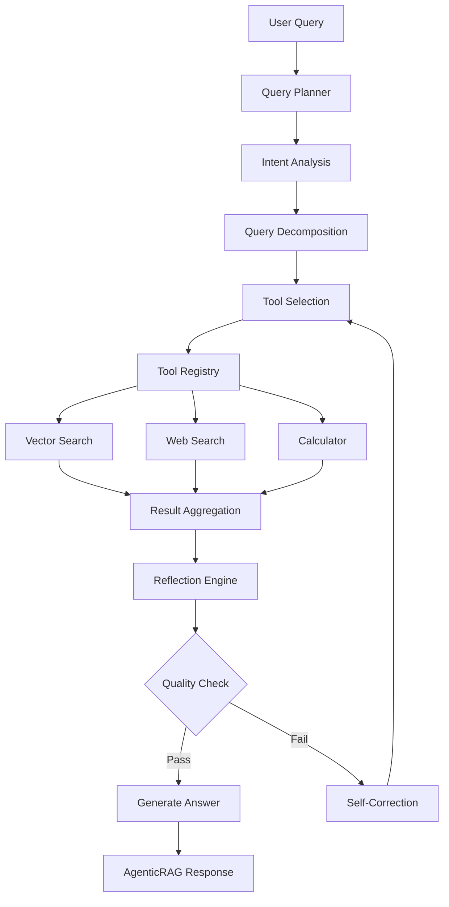

# Agentic RAG System - Implementation Plan

## System Architecture

### Overview
The Agentic RAG system adds autonomous query planning and tool use capabilities on top of the existing Advanced RAG system. It follows a ReAct (Reasoning + Acting) pattern with reflection loops.



## Core Components

### 1. Query Planner Agent
**File**: [`src/agents/query_planner.py`](src/agents/query_planner.py)

#### Data Models
- [`QueryPlan`](src/agents/query_planner.py:1) - Complete plan for processing a query
- [`QueryStep`](src/agents/query_planner.py:1) - Individual step in the plan
- [`IntentAnalysis`](src/agents/query_planner.py:1) - Intent classification result
- [`ToolSelection`](src/agents/query_planner.py:1) - Tool selection with confidence

#### Key Classes
- [`QueryPlanner`](src/agents/query_planner.py:1) - Main planner class
  - Methods:
    - [`analyze_intent()`](src/agents/query_planner.py:1) - Classify query intent
    - [`decompose_query()`](src/agents/query_planner.py:1) - Break into sub-queries
    - [`select_tools()`](src/agents/query_planner.py:1) - Choose appropriate tools
    - [`create_plan()`](src/agents/query_planner.py:1) - Generate execution plan

#### Supported Intents
- RETRIEVAL - Information retrieval from vector store
- CALCULATION - Mathematical/computational tasks
- COMPARISON - Comparing multiple items/concepts
- SYNTHESIS - Combining information from multiple sources
- FACT_CHECKING - Verifying factual claims
- EXPLORATORY - Open-ended exploration

### 2. Tool Registry
**File**: [`src/agents/tool_registry.py`](src/agents/tool_registry.py)

#### Data Models
- [`ToolResult`](src/agents/tool_registry.py:1) - Standardized tool output
- [`ToolExecutionError`](src/agents/tool_registry.py:1) - Tool error handling
- [`ToolMetadata`](src/agents/tool_registry.py:1) - Tool configuration

#### Base Class
- [`BaseTool`](src/agents/tool_registry.py:1) - Abstract base for all tools
  - Properties: `name`, `description`, `parameters`, `required_credentials`
  - Methods: [`execute()`](src/agents/tool_registry.py:1), [`validate_input()`](src/agents/tool_registry.py:1), [`get_schema()`](src/agents/tool_registry.py:1)

#### Implemented Tools

**VectorSearchTool**
- Integrates with [`HybridSearcher`](src/retrieval/hybrid/hybrid_searcher.py:56)
- Supports filters, thresholds, and reranking
- Async execution with timeout handling

**WebSearchTool**
- Serper API integration
- Tavily API integration (fallback)
- Result deduplication and ranking

**CalculatorTool**
- Safe math expression evaluation
- Unit conversion capabilities
- Statistical functions

#### Registry
- [`ToolRegistry`](src/agents/tool_registry.py:1) - Central tool management
  - Methods: [`register()`](src/agents/tool_registry.py:1), [`get_tool()`](src/agents/tool_registry.py:1), [`list_tools()`](src/agents/tool_registry.py:1), [`execute()`](src/agents/tool_registry.py:1)

### 3. Reflection Engine
**File**: [`src/agents/reflection.py`](src/agents/reflection.py)

#### Data Models
- [`AnswerQualityAssessment`](src/agents/reflection.py:1) - Quality evaluation result
- [`CorrectionStrategy`](src/agents/reflection.py:1) - Self-correction approach
- [`ConfidenceScore`](src/agents/reflection.py:1) - Multi-factor confidence

#### Key Classes
- [`ReflectionEngine`](src/agents/reflection.py:1) - Main reflection orchestrator
  - Methods:
    - [`assess_quality()`](src/agents/reflection.py:1) - Evaluate answer quality
    - [`identify_gaps()`](src/agents/reflection.py:1) - Find information gaps
    - [`generate_correction()`](src/agents/reflection.py:1) - Create correction plan
    - [`should_iterate()`](src/agents/reflection.py:1) - Determine if more iteration needed

- [`ConfidenceScorer`](src/agents/reflection.py:1) - Calculate confidence metrics
  - Factors:
    - Source reliability
    - Result diversity
    - Information completeness
    - Tool success rate

#### Quality Dimensions
- COMPLETENESS - All aspects of query addressed
- ACCURACY - Information is correct
- RELEVANCE - Information matches query intent
- COHERENCE - Answer is well-structured
- CITATIONS - Sources properly attributed

### 4. Agentic RAG Orchestrator
**File**: [`src/agents/agentic_rag.py`](src/agents/agentic_rag.py)

#### Data Models
- [`AgenticRAGConfig`](src/agents/agentic_rag.py:1) - System configuration
- [`AgenticRAGResponse`](src/agents/agentic_rag.py:1) - Complete response with metadata
- [`ExecutionTrace`](src/agents/agentic_rag.py:1) - Step-by-step execution log

#### Main Class
- [`AgenticRAG`](src/agents/agentic_rag.py:1) - Central orchestrator
  - Dependencies:
    - [`QueryPlanner`](src/agents/query_planner.py:1)
    - [`ToolRegistry`](src/agents/tool_registry.py:1)
    - [`ReflectionEngine`](src/agents/reflection.py:1)
    - [`HybridSearcher`](src/retrieval/hybrid/hybrid_searcher.py:56)
  
  - Methods:
    - [`query()`](src/agents/agentic_rag.py:1) - Main entry point
    - [`_execute_plan()`](src/agents/agentic_rag.py:1) - Execute query plan
    - [`_aggregate_results()`](src/agents/agentic_rag.py:1) - Combine tool outputs
    - [`_generate_answer()`](src/agents/agentic_rag.py:1) - Create final response

## Test Plan (30-35 Tests)

### Query Planner Tests (8 tests)
1. [`test_intent_analysis_factual()`](tests/agents/test_query_planner.py:1) - Factual query classification
2. [`test_intent_analysis_analytical()`](tests/agents/test_query_planner.py:1) - Analytical query classification
3. [`test_intent_analysis_comparative()`](tests/agents/test_query_planner.py:1) - Comparative query classification
4. [`test_query_decomposition_simple()`](tests/agents/test_query_planner.py:1) - Single sub-query
5. [`test_query_decomposition_complex()`](tests/agents/test_query_planner.py:1) - Multiple sub-queries
6. [`test_tool_selection_vector_search()`](tests/agents/test_query_planner.py:1) - Select vector search
7. [`test_tool_selection_web_search()`](tests/agents/test_query_planner.py:1) - Select web search
8. [`test_tool_selection_multi_tool()`](tests/agents/test_query_planner.py:1) - Combine multiple tools

### Tool Registry Tests (10 tests)
9. [`test_vector_search_tool_execution()`](tests/agents/test_tool_registry.py:1) - Vector search functionality
10. [`test_vector_search_tool_with_filters()`](tests/agents/test_tool_registry.py:1) - Filtered search
11. [`test_web_search_tool_serper()`](tests/agents/test_tool_registry.py:1) - Serper API call
12. [`test_web_search_tool_tavily()`](tests/agents/test_tool_registry.py:1) - Tavily API call
13. [`test_web_search_tool_fallback()`](tests/agents/test_tool_registry.py:1) - Fallback mechanism
14. [`test_calculator_tool_basic_math()`](tests/agents/test_tool_registry.py:1) - Simple calculations
15. [`test_calculator_tool_advanced()`](tests/agents/test_tool_registry.py:1) - Complex expressions
16. [`test_calculator_tool_safety()`](tests/agents/test_tool_registry.py:1) - Sandbox validation
17. [`test_tool_registry_register()`](tests/agents/test_tool_registry.py:1) - Tool registration
18. [`test_tool_result_aggregation()`](tests/agents/test_tool_registry.py:1) - Combine multiple results

### Reflection Engine Tests (8 tests)
19. [`test_quality_assessment_high()`](tests/agents/test_reflection.py:1) - High quality answer
20. [`test_quality_assessment_low()`](tests/agents/test_reflection.py:1) - Low quality answer
21. [`test_identify_information_gaps()`](tests/agents/test_reflection.py:1) - Gap detection
22. [`test_correction_strategy_generation()`](tests/agents/test_reflection.py:1) - Strategy creation
23. [`test_confidence_score_calculation()`](tests/agents/test_reflection.py:1) - Confidence math
24. [`test_should_iterate_true()`](tests/agents/test_reflection.py:1) - Needs iteration
25. [`test_should_iterate_false()`](tests/agents/test_reflection.py:1) - No iteration needed
26. [`test_self_correction_loop()`](tests/agents/test_reflection.py:1) - Full correction cycle

### Agentic RAG Integration Tests (8 tests)
27. [`test_agentic_rag_simple_query()`](tests/agents/test_agentic_rag.py:1) - End-to-end simple query
28. [`test_agentic_rag_multi_step()`](tests/agents/test_agentic_rag.py:1) - Multi-step reasoning
29. [`test_agentic_rag_with_web_search()`](tests/agents/test_agentic_rag.py:1) - Web search integration
30. [`test_agentic_rag_with_calculation()`](tests/agents/test_agentic_rag.py:1) - Calculator integration
31. [`test_agentic_rag_self_correction()`](tests/agents/test_agentic_rag.py:1) - Reflection loop
32. [`test_agentic_rag_max_iterations()`](tests/agents/test_agentic_rag.py:1) - Iteration limit
33. [`test_execution_trace_logging()`](tests/agents/test_agentic_rag.py:1) - Trace generation
34. [`test_agentic_rag_error_handling()`](tests/agents/test_agentic_rag.py:1) - Error recovery

### Configuration Tests (2 tests)
35. [`test_agentic_rag_config_validation()`](tests/agents/test_agentic_rag.py:1) - Config validation

## File Structure

```
advanced_rag_system/src/agents/
├── __init__.py                    # Public API exports
├── query_planner.py               # Intent analysis & decomposition
├── tool_registry.py               # Tool management & execution
├── reflection.py                  # Quality assessment & correction
└── agentic_rag.py                 # Main orchestrator

advanced_rag_system/tests/agents/
├── __init__.py
├── conftest.py                    # Shared fixtures
├── test_query_planner.py          # 8 tests
├── test_tool_registry.py          # 10 tests
├── test_reflection.py             # 8 tests
└── test_agentic_rag.py            # 9 tests
```

## Integration Points

### Existing System Integration
- Uses [`DocumentChunk`](src/core/types.py:75), [`SearchResult`](src/core/types.py:234), [`Query`](src/core/types.py:179) from core types
- Integrates [`HybridSearcher`](src/retrieval/hybrid/hybrid_searcher.py:56) for vector search
- Follows existing exception hierarchy from [`RAGException`](src/core/exceptions.py:10)
- Uses Pydantic v2 for all data models (consistent with existing codebase)

### Configuration
- Environment variables: `SERPER_API_KEY`, `TAVILY_API_KEY`
- Settings integration via [`Settings`](src/core/config.py:18)
- Configurable: max iterations, confidence thresholds, timeout values

## Next Steps

1. **Switch to Code mode** to implement the Python files
2. **Implement in order**: 
   - Core types and exceptions (if needed)
   - [`query_planner.py`](src/agents/query_planner.py)
   - [`tool_registry.py`](src/agents/tool_registry.py)
   - [`reflection.py`](src/agents/reflection.py)
   - [`agentic_rag.py`](src/agents/agentic_rag.py)
3. **Create test files** with all 35 tests
4. **Run tests** and ensure 90%+ coverage
5. **Create integration documentation**