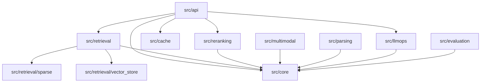

# Advanced RAG System - Directory Structure

**Source Code Organization and Module Design**

---

## Overview

This document defines the complete directory structure for the Advanced RAG System. The structure follows clean architecture principles with clear separation of concerns.

---

## Root Directory Structure

```
advanced_rag_system/
├── ARCHITECTURE.md              # System architecture documentation
├── IMPLEMENTATION_PLAN.md       # 30-day development plan
├── TECHNICAL_SPECIFICATION.md   # API and interface specifications
├── DIRECTORY_STRUCTURE.md       # This file
├── README.md                    # Project overview
├── LICENSE                      # License file
├── .env.example                 # Environment variables template
├── .gitignore                   # Git ignore rules
├── .pre-commit-config.yaml      # Pre-commit hooks configuration
├── Makefile                     # Common development commands
├── docker-compose.yml           # Local development services
├── Dockerfile                   # Production Docker image
├── pyproject.toml               # Python project configuration
├── pytest.ini                  # Pytest configuration
├── mypy.ini                    # MyPy type checking configuration
├── ruff.toml                   # Ruff linting configuration
│
├── src/                         # Source code
│   ├── __init__.py
│   ├── api/                     # FastAPI application
│   ├── core/                    # Core utilities and configuration
│   ├── retrieval/               # Retrieval implementations
│   ├── reranking/               # Re-ranking algorithms
│   ├── multimodal/              # Multi-modal processing
│   ├── parsing/                 # Document parsing
│   ├── cache/                   # Caching implementations
│   ├── llmops/                  # Monitoring and observability
│   └── evaluation/              # Evaluation framework
│
├── tests/                       # Test suite
│   ├── __init__.py
│   ├── unit/                    # Unit tests
│   ├── integration/             # Integration tests
│   ├── benchmarks/              # Performance benchmarks
│   └── load/                    # Load tests
│
├── docs/                        # Documentation
│   ├── api.md                   # API usage guide
│   ├── deployment.md            # Deployment guide
│   ├── performance.md           # Performance tuning
│   ├── adr/                     # Architecture Decision Records
│   └── examples/                # Code examples
│
├── notebooks/                   # Jupyter notebooks
│   ├── demo.ipynb               # Interactive demo
│   ├── evaluation.ipynb         # Evaluation analysis
│   └── exploration.ipynb        # Data exploration
│
├── scripts/                     # Utility scripts
│   ├── setup.sh                 # Development setup
│   ├── ingest_data.py           # Data ingestion script
│   ├── run_benchmarks.py        # Benchmark runner
│   └── deploy.sh                # Deployment script
│
├── dashboards/                  # Monitoring dashboards
│   ├── grafana/                 # Grafana dashboard configs
│   └── streamlit/               # Streamlit dashboards
│
├── configs/                     # Configuration files
│   ├── prompts/                 # Prompt templates
│   ├── models/                  # Model configurations
│   └── experiments/             # Experiment configs
│
└── data/                        # Data directory (gitignored)
    ├── raw/                     # Raw input data
    ├── processed/               # Processed data
    └── benchmarks/              # Benchmark datasets
```

---

## Source Code Structure (`src/`)

### 1. API Layer (`src/api/`)

```
src/api/
├── __init__.py
├── main.py                      # FastAPI application entry point
├── dependencies.py              # FastAPI dependencies
├── middleware/
│   ├── __init__.py
│   ├── auth.py                  # Authentication middleware
│   ├── rate_limit.py            # Rate limiting
│   ├── circuit_breaker.py       # Circuit breaker pattern
│   ├── logging.py               # Request logging
│   └── cors.py                  # CORS configuration
├── routes/
│   ├── __init__.py
│   ├── query.py                 # Query endpoints
│   ├── ingestion.py             # Document ingestion endpoints
│   ├── health.py                # Health check endpoints
│   ├── evaluation.py            # Evaluation endpoints
│   └── admin.py                 # Admin endpoints
├── models/
│   ├── __init__.py
│   ├── requests.py              # Request Pydantic models
│   ├── responses.py             # Response Pydantic models
│   └── common.py                # Shared models
└── exceptions.py                # API exception handlers
```

**Responsibilities:**
- HTTP request/response handling
- Input validation (Pydantic)
- Authentication/authorization
- Rate limiting
- Error handling
- OpenAPI documentation

---

### 2. Core Layer (`src/core/`)

```
src/core/
├── __init__.py
├── config.py                    # Configuration management
├── types.py                     # Core type definitions
├── logging.py                   # Structured logging
├── exceptions.py                # Custom exceptions
├── events.py                    # Event system
│
├── embeddings/                  # Embedding providers
│   ├── __init__.py
│   ├── base.py                  # Abstract interface
│   ├── openai_provider.py       # OpenAI embeddings
│   ├── local_provider.py        # Local models
│   ├── cached_embedder.py       # Caching wrapper
│   └── batch_processor.py       # Batch processing
│
├── compression/                 # Contextual compression
│   ├── __init__.py
│   ├── base.py                  # Abstract interface
│   ├── embeddings_filter.py     # Similarity-based filtering
│   ├── llm_extractor.py         # LLM-based extraction
│   └── token_budget.py          # Token management
│
└── prompts/                     # Prompt management
    ├── __init__.py
    ├── manager.py               # Prompt manager
    ├── templates.py             # Prompt templates
    ├── versioning.py            # Version control
    └── registry.py              # Prompt registry
```

**Responsibilities:**
- Configuration management
- Core data types
- Embedding abstraction
- Context compression
- Prompt versioning
- Logging and events

---

### 3. Retrieval Layer (`src/retrieval/`)

```
src/retrieval/
├── __init__.py
├── base.py                      # Abstract retriever interface
│
├── vector_store/                # Vector database implementations
│   ├── __init__.py
│   ├── base.py                  # Abstract vector store
│   ├── chroma_store.py          # ChromaDB implementation
│   ├── pinecone_store.py        # Pinecone implementation
│   └── qdrant_store.py          # Qdrant implementation (optional)
│
├── dense/                       # Dense retrieval
│   ├── __init__.py
│   ├── dense_retriever.py       # Main dense retriever
│   └── similarity.py            # Similarity functions
│
├── sparse/                      # Sparse retrieval
│   ├── __init__.py
│   ├── base.py                  # Abstract sparse retriever
│   ├── bm25_index.py            # BM25 implementation
│   ├── tfidf_index.py           # TF-IDF implementation
│   └── preprocessing.py         # Text preprocessing
│
├── hybrid/                      # Hybrid retrieval
│   ├── __init__.py
│   ├── hybrid_retriever.py      # Main hybrid retriever
│   ├── fusion.py                # Fusion algorithms (RRF, etc.)
│   └── weighting.py             # Score weighting strategies
│
├── query/                       # Query enhancement
│   ├── __init__.py
│   ├── expansion.py             # Query expansion
│   ├── hyde.py                  # HyDE implementation
│   ├── classification.py        # Query classification
│   └── multi_query.py           # Multi-query generation
│
├── self_query/                  # Self-querying
│   ├── __init__.py
│   ├── extractor.py             # Metadata extraction
│   ├── filter_builder.py        # Filter construction
│   └── schema.py                # Query schemas
│
└── parent_document/             # Parent document retrieval
    ├── __init__.py
    ├── chunking.py              # Hierarchical chunking
    ├── linker.py                # Parent-child linking
    └── retriever.py             # Parent doc retriever
```

**Responsibilities:**
- Vector store abstraction
- Dense retrieval (embeddings)
- Sparse retrieval (BM25/TF-IDF)
- Hybrid fusion
- Query enhancement
- Self-querying
- Parent document retrieval

---

### 4. Re-ranking Layer (`src/reranking/`)

```
src/reranking/
├── __init__.py
├── base.py                      # Abstract reranker interface
├── cross_encoder.py             # Cross-encoder reranker
├── cohere_reranker.py           # Cohere API reranker
├── colbert.py                   # ColBERT reranker (optional)
└── ensemble.py                  # Ensemble reranking
```

**Responsibilities:**
- Cross-encoder reranking
- API-based reranking
- Ensemble methods
- Result reordering

---

### 5. Multi-Modal Layer (`src/multimodal/`)

```
src/multimodal/
├── __init__.py
├── base.py                      # Abstract multi-modal interface
│
├── vision/                      # Image processing
│   ├── __init__.py
│   ├── encoder.py               # CLIP/vision encoder
│   ├── processor.py             # Image preprocessing
│   ├── captioning.py            # Image captioning
│   └── ocr.py                   # OCR integration
│
├── structured/                  # Structured data
│   ├── __init__.py
│   ├── table_processor.py       # Table extraction
│   ├── json_processor.py        # JSON processing
│   └── csv_processor.py         # CSV processing
│
├── unified_search.py            # Cross-modal search
└── modality_router.py           # Route by modality
```

**Responsibilities:**
- Image embedding (CLIP)
- Image captioning
- OCR text extraction
- Table processing
- Cross-modal retrieval

---

### 6. Parsing Layer (`src/parsing/`)

```
src/parsing/
├── __init__.py
├── base.py                      # Abstract parser interface
├── pdf_parser.py                # PDF parsing
├── html_parser.py               # HTML parsing
├── docx_parser.py               # Word document parsing
├── image_parser.py              # Image text extraction
└── auto_detect.py               # Auto-detect file type
```

**Responsibilities:**
- Document parsing
- Content extraction
- Metadata extraction
- File type detection

---

### 7. Cache Layer (`src/cache/`)

```
src/cache/
├── __init__.py
├── base.py                      # Abstract cache interface
├── l1_cache.py                  # In-memory LRU cache
├── l2_redis.py                  # Redis cache
├── l3_persistent.py             # Persistent cache
├── semantic_cache.py            # Embedding-based cache
├── key_builder.py               # Cache key generation
└── warming.py                   # Cache warming strategies
```

**Responsibilities:**
- Multi-layer caching
- Semantic similarity caching
- Cache warming
- Key generation

---

### 8. LLMOps Layer (`src/llmops/`)

```
src/llmops/
├── __init__.py
├── metrics.py                   # Metrics collection
├── tracing.py                   # Distributed tracing
├── health.py                    # Health checks
├── drift.py                     # Drift detection
├── alerts.py                    # Alerting system
│
├── providers/                   # LLM provider integrations
│   ├── __init__.py
│   ├── base.py                  # Abstract LLM interface
│   ├── openai_provider.py       # OpenAI integration
│   ├── anthropic_provider.py    # Anthropic integration
│   └── router.py                # Multi-provider routing
│
└── dashboards/                  # Dashboard configurations
    ├── grafana_prometheus.py    # Grafana/Prometheus setup
    └── streamlit_metrics.py     # Streamlit metrics dashboard
```

**Responsibilities:**
- Metrics collection
- Distributed tracing
- Health monitoring
- Drift detection
- LLM provider abstraction
- Alerting

---

### 9. Evaluation Layer (`src/evaluation/`)

```
src/evaluation/
├── __init__.py
├── metrics.py                   # Metric calculations
├── faithfulness.py              # Faithfulness detection
├── hallucination.py             # Hallucination detection
├── relevance.py                 # Relevance scoring
├── benchmarks.py                # Benchmark runner
├── datasets.py                  # Test datasets
├── llm_judge.py                 # LLM-as-judge
└── visualizations.py            # Result visualization
```

**Responsibilities:**
- Retrieval metrics
- Answer quality metrics
- Faithfulness detection
- Benchmark execution
- Result visualization

---

## Test Structure (`tests/`)

```
tests/
├── __init__.py
├── conftest.py                  # Pytest fixtures
├── fixtures/                    # Test data
│   ├── documents/
│   ├── queries/
│   └── embeddings/
│
├── unit/                        # Unit tests
│   ├── core/
│   │   ├── test_config.py
│   │   ├── test_embeddings.py
│   │   └── test_compression.py
│   ├── retrieval/
│   │   ├── test_vector_store.py
│   │   ├── test_hybrid_search.py
│   │   └── test_query_expansion.py
│   ├── reranking/
│   │   └── test_rerankers.py
│   ├── cache/
│   │   └── test_multi_layer_cache.py
│   └── api/
│       └── test_endpoints.py
│
├── integration/                 # Integration tests
│   ├── test_end_to_end.py
│   ├── test_ingestion.py
│   └── test_multimodal.py
│
├── benchmarks/                  # Performance tests
│   ├── test_embedding_perf.py
│   ├── test_retrieval_perf.py
│   └── test_api_perf.py
│
└── load/                        # Load tests
    ├── locustfile.py
    └── k6_script.js
```

---

## Configuration Structure (`configs/`)

```
configs/
├── prompts/                     # Prompt templates
│   ├── rag_default.txt
│   ├── hyde_generation.txt
│   ├── query_expansion.txt
│   └── evaluation.txt
│
├── models/                      # Model configurations
│   ├── embeddings.yaml
│   ├── llm.yaml
│   └── reranker.yaml
│
└── experiments/                 # Experiment configs
    ├── baseline.yaml
    ├── hybrid_only.yaml
    └── with_reranking.yaml
```

---

## Key Design Principles

### 1. Clean Architecture

```
┌─────────────────────────────────────┐
│           API Layer                 │  ← FastAPI routes
├─────────────────────────────────────┤
│         Service Layer               │  ← Business logic
├─────────────────────────────────────┤
│        Retrieval Layer              │  ← RAG components
├─────────────────────────────────────┤
│      Infrastructure Layer           │  ← DB, cache, LLM
└─────────────────────────────────────┘
```

### 2. Dependency Injection

All components use dependency injection for:
- Testability
- Flexibility
- Configuration management

### 3. Interface Segregation

Each module defines clear interfaces:
- Abstract base classes in `base.py`
- Multiple implementations
- Easy to extend

### 4. Type Safety

- 100% type hints
- mypy strict mode
- Pydantic for validation

---

## Import Patterns

### Internal Imports

```python
# Preferred: Absolute imports
from src.core.embeddings import EmbeddingProvider
from src.retrieval.dense import DenseRetriever

# Avoid: Relative imports beyond one level
from ..core.embeddings import EmbeddingProvider  # Don't do this
```

### Public API

```python
# src/retrieval/__init__.py
from .dense import DenseRetriever
from .hybrid import HybridRetriever

__all__ = ["DenseRetriever", "HybridRetriever"]
```

---

## Module Dependencies



---

## File Naming Conventions

| Type | Pattern | Example |
|------|---------|---------|
| Modules | `snake_case.py` | `dense_retriever.py` |
| Classes | `PascalCase` | `DenseRetriever` |
| Functions | `snake_case` | `retrieve_documents` |
| Constants | `UPPER_SNAKE` | `DEFAULT_TOP_K` |
| Tests | `test_*.py` | `test_dense_retriever.py` |
| Fixtures | `*.json`, `*.txt` | `sample_document.txt` |

---

## Summary

This directory structure provides:

1. **Clear Separation**: Each layer has distinct responsibilities
2. **Testability**: Easy to mock dependencies
3. **Scalability**: New components fit existing structure
4. **Maintainability**: Consistent patterns throughout
5. **Discoverability**: Easy to find related code

The structure supports the 30-day implementation plan while maintaining production-quality organization.
