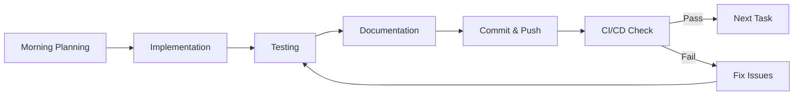

# Advanced RAG System - Implementation Plan

**30-Day Phased Development Plan** | Principal AI Engineer Portfolio Project

---

## Overview

This implementation plan breaks down the Advanced RAG System into 6 phases over 30 days. Each phase delivers incremental value with working code, tests, and documentation.

### Philosophy
- **Depth over breadth**: Each component is production-ready
- **Test-driven**: Tests written before implementation
- **Performance-first**: Benchmarks from day one
- **Documentation-driven**: Architecture decisions recorded

---

## Phase 1: Foundation (Days 1-5)

### Goals
- Set up project structure and tooling
- Implement core embedding service
- Build basic vector store integration
- Establish testing framework

### Deliverables

#### Day 1: Project Setup
- [ ] Initialize Python project with poetry/pip
- [ ] Set up pre-commit hooks (black, ruff, mypy)
- [ ] Configure pytest with coverage
- [ ] Create Docker development environment
- [ ] Set up CI/CD pipeline skeleton

```bash
# Project structure
advanced_rag_system/
├── pyproject.toml
├── Makefile
├── docker-compose.yml
├── Dockerfile
├── .github/workflows/ci.yml
├── src/
│   ├── __init__.py
│   ├── core/
│   ├── retrieval/
│   ├── api/
│   └── evaluation/
├── tests/
├── docs/
└── scripts/
```

#### Day 2: Configuration & Core Types
- [ ] Implement Pydantic settings management
- [ ] Define core data models (Document, Query, SearchResult)
- [ ] Create type definitions with strict mypy
- [ ] Set up structured logging

**Key Files:**
- `src/core/config.py` - Settings with env var support
- `src/core/types.py` - Core data structures
- `src/core/logging.py` - Structured JSON logging

#### Day 3: Embedding Service
- [ ] Abstract embedding interface
- [ ] OpenAI embedding provider
- [ ] Local sentence-transformer fallback
- [ ] Embedding cache with Redis
- [ ] Batch embedding optimization

**Key Files:**
- `src/core/embeddings/base.py` - Abstract interface
- `src/core/embeddings/openai_provider.py` - OpenAI implementation
- `src/core/embeddings/local_provider.py` - Local model fallback
- `src/core/embeddings/cached_embedder.py` - Caching layer

#### Day 4: Vector Store Integration
- [ ] Abstract vector store interface
- [ ] ChromaDB implementation
- [ ] Pinecone implementation (stub)
- [ ] Document ingestion pipeline
- [ ] Basic semantic search

**Key Files:**
- `src/retrieval/vector_store/base.py` - Abstract interface
- `src/retrieval/vector_store/chroma_store.py` - ChromaDB
- `src/retrieval/vector_store/pinecone_store.py` - Pinecone
- `src/retrieval/ingestion.py` - Document ingestion

#### Day 5: Testing & Documentation
- [ ] Unit tests for embedding service (>95% coverage)
- [ ] Integration tests for vector store
- [ ] Performance benchmarks (baseline)
- [ ] API documentation setup

**Tests:**
- `tests/core/test_embeddings.py`
- `tests/retrieval/test_vector_store.py`
- `tests/benchmarks/test_embedding_perf.py`

### Success Criteria
- [ ] All tests passing
- [ ] mypy strict mode clean
- [ ] Embedding latency <20ms for single query
- [ ] Documentation complete

---

## Phase 2: Hybrid Retrieval (Days 6-10)

### Goals
- Implement BM25 sparse retrieval
- Build hybrid search with fusion
- Add query expansion capabilities
- Create re-ranking layer

### Deliverables

#### Day 6: Sparse Retrieval
- [ ] BM25 index implementation
- [ ] TF-IDF fallback
- [ ] Text preprocessing pipeline
- [ ] Inverted index optimization

**Key Files:**
- `src/retrieval/sparse/bm25_index.py` - BM25 implementation
- `src/retrieval/sparse/tfidf_index.py` - TF-IDF implementation
- `src/retrieval/sparse/preprocessing.py` - Text preprocessing

#### Day 7: Hybrid Search
- [ ] Reciprocal Rank Fusion (RRF)
- [ ] Weighted score fusion
- [ ] Parallel retrieval execution
- [ ] Result deduplication

**Key Files:**
- `src/retrieval/hybrid/fusion.py` - Fusion algorithms
- `src/retrieval/hybrid/hybrid_searcher.py` - Hybrid orchestrator

#### Day 8: Query Enhancement
- [ ] Query expansion (synonyms)
- [ ] HyDE implementation
- [ ] Query classification
- [ ] Multi-query generation

**Key Files:**
- `src/retrieval/query/expansion.py` - Query expansion
- `src/retrieval/query/hyde.py` - HyDE generator
- `src/retrieval/query/classifier.py` - Query classification

#### Day 9: Re-ranking
- [ ] Cross-encoder integration
- [ ] Cohere rerank API
- [ ] Local reranker option
- [ ] Async batch reranking

**Key Files:**
- `src/reranking/base.py` - Abstract reranker
- `src/reranking/cross_encoder.py` - Cross-encoder
- `src/reranking/cohere_reranker.py` - Cohere API

#### Day 10: Integration & Testing
- [ ] End-to-end hybrid search tests
- [ ] Latency benchmarks
- [ ] Accuracy evaluation
- [ ] Documentation updates

**Tests:**
- `tests/retrieval/test_hybrid_search.py`
- `tests/reranking/test_rerankers.py`
- `tests/benchmarks/test_retrieval_perf.py`

### Success Criteria
- [ ] Hybrid search working end-to-end
- [ ] Retrieval accuracy >85%
- [ ] End-to-end latency <100ms
- [ ] Fusion algorithm validated

---

## Phase 3: Multi-Modal Support (Days 11-15)

### Goals
- Add image processing capabilities
- Support structured data (tables, JSON)
- Unified multi-modal retrieval
- Document parsing pipeline

### Deliverables

#### Day 11: Document Parsing
- [ ] PDF parser (text + tables)
- [ ] HTML parser
- [ ] Image extraction
- [ ] Structured data detection

**Key Files:**
- `src/parsing/base.py` - Parser interface
- `src/parsing/pdf_parser.py` - PDF processing
- `src/parsing/html_parser.py` - HTML processing

#### Day 12: Image Processing
- [ ] CLIP vision embeddings
- [ ] Image captioning
- [ ] OCR integration
- [ ] Image metadata extraction

**Key Files:**
- `src/multimodal/vision_encoder.py` - CLIP embeddings
- `src/multimodal/image_processor.py` - Image pipeline
- `src/multimodal/ocr.py` - OCR wrapper

#### Day 13: Structured Data
- [ ] Table extraction and parsing
- [ ] JSON flattening
- [ ] CSV processing
- [ ] Semantic descriptions for tables

**Key Files:**
- `src/multimodal/table_processor.py` - Table handling
- `src/multimodal/structured_processor.py` - JSON/CSV

#### Day 14: Unified Retrieval
- [ ] Multi-modal query handling
- [ ] Cross-modal retrieval
- [ ] Unified ranking
- [ ] Metadata filtering

**Key Files:**
- `src/multimodal/unified_search.py` - Cross-modal search
- `src/multimodal/modality_router.py` - Route by type

#### Day 15: Testing & Validation
- [ ] Multi-modal integration tests
- [ ] Image search benchmarks
- [ ] End-to-end document processing
- [ ] Documentation

**Tests:**
- `tests/multimodal/test_vision.py`
- `tests/multimodal/test_structured.py`
- `tests/integration/test_multimodal.py`

### Success Criteria
- [ ] Images searchable by text
- [ ] Tables extractable and queryable
- [ ] Document parsing pipeline working
- [ ] Multi-modal accuracy metrics

---

## Phase 4: Advanced RAG Patterns (Days 16-20)

### Goals
- Implement contextual compression
- Add parent document retrieval
- Build self-querying capabilities
- Create advanced prompt management

### Deliverables

#### Day 16: Contextual Compression
- [ ] EmbeddingsFilter implementation
- [ ] LLMChainExtractor
- [ ] LLMChainFilter
- [ ] Token budget management

**Key Files:**
- `src/core/compression/base.py` - Compression interface
- `src/core/compression/embeddings_filter.py` - Similarity filter
- `src/core/compression/llm_extractor.py` - LLM extraction

#### Day 17: Parent Document Retrieval
- [ ] Parent-child chunking
- [ ] Metadata linking
- [ ] Full document retrieval
- [ ] Context assembly

**Key Files:**
- `src/retrieval/parent_document.py` - Parent doc retrieval
- `src/ingestion/chunking.py` - Hierarchical chunking

#### Day 18: Self-Querying
- [ ] Metadata extraction from queries
- [ ] Filter generation
- [ ] Structured query builder
- [ ] LLM-based query understanding

**Key Files:**
- `src/retrieval/self_query/base.py` - Self-query interface
- `src/retrieval/self_query/llm_extractor.py` - LLM metadata extraction
- `src/retrieval/self_query/filter_builder.py` - Filter construction

#### Day 19: Prompt Management
- [ ] Prompt versioning system
- [ ] Template management
- [ ] A/B testing framework
- [ ] Dynamic prompt selection

**Key Files:**
- `src/core/prompts/manager.py` - Prompt manager
- `src/core/prompts/templates.py` - Template definitions
- `src/core/prompts/versioning.py` - Git-based versioning

#### Day 20: Integration & Testing
- [ ] End-to-end RAG pipeline tests
- [ ] Compression effectiveness benchmarks
- [ ] Self-querying accuracy tests
- [ ] Documentation

**Tests:**
- `tests/core/test_compression.py`
- `tests/retrieval/test_self_query.py`
- `tests/integration/test_full_pipeline.py`

### Success Criteria
- [ ] Context compression reducing tokens by 50%+
- [ ] Self-querying accuracy >80%
- [ ] Parent document retrieval working
- [ ] Prompt A/B testing functional

---

## Phase 5: API & LLMOps (Days 21-25)

### Goals
- Build FastAPI application
- Implement comprehensive caching
- Set up monitoring and observability
- Create evaluation framework

### Deliverables

#### Day 21: FastAPI Application
- [ ] API endpoints (query, ingest, health)
- [ ] Request/response models
- [ ] Authentication middleware
- [ ] Rate limiting
- [ ] OpenAPI documentation

**Key Files:**
- `src/api/main.py` - FastAPI app
- `src/api/routes/query.py` - Query endpoints
- `src/api/routes/ingestion.py` - Ingestion endpoints
- `src/api/middleware/auth.py` - Authentication
- `src/api/middleware/rate_limit.py` - Rate limiting

#### Day 22: Multi-Layer Caching
- [ ] L1 in-memory cache
- [ ] L2 Redis cache
- [ ] L3 persistent cache
- [ ] Semantic cache (embedding similarity)
- [ ] Cache warming strategies

**Key Files:**
- `src/cache/base.py` - Cache interface
- `src/cache/l1_cache.py` - In-memory LRU
- `src/cache/l2_redis.py` - Redis cache
- `src/cache/semantic_cache.py` - Embedding-based cache

#### Day 23: Monitoring & Observability
- [ ] Prometheus metrics
- [ ] Distributed tracing (OpenTelemetry)
- [ ] Structured logging
- [ ] Health checks
- [ ] Grafana dashboards

**Key Files:**
- `src/llmops/metrics.py` - Metrics collection
- `src/llmops/tracing.py` - Distributed tracing
- `src/llmops/health.py` - Health checks
- `dashboards/grafana/*.json` - Dashboard configs

#### Day 24: Evaluation Framework
- [ ] Retrieval metrics (Recall@K, NDCG)
- [ ] Answer relevance scoring
- [ ] Faithfulness detection
- [ ] Hallucination detection
- [ ] Benchmark datasets

**Key Files:**
- `src/evaluation/metrics.py` - Metric calculations
- `src/evaluation/faithfulness.py` - Faithfulness checks
- `src/evaluation/benchmarks.py` - Benchmark runner
- `src/evaluation/datasets.py` - Test datasets

#### Day 25: Drift Detection & Alerts
- [ ] Embedding drift detection
- [ ] Performance drift detection
- [ ] Automated alerting
- [ ] Model performance tracking

**Key Files:**
- `src/llmops/drift.py` - Drift detection
- `src/llmops/alerts.py` - Alerting system

### Success Criteria
- [ ] API responding <50ms p95
- [ ] Cache hit rate >90%
- [ ] All metrics flowing to Prometheus
- [ ] Evaluation framework running

---

## Phase 6: Performance Optimization (Days 26-30)

### Goals
- Optimize for target latency
- Scale testing
- Production hardening
- Documentation & showcase

### Deliverables

#### Day 26: Performance Optimization
- [ ] Embedding quantization
- [ ] Query optimization
- [ ] Async pipeline improvements
- [ ] Connection pooling
- [ ] Memory optimization

**Optimizations:**
- int8 quantization for embeddings
- HNSW parameter tuning
- Async batch processing
- Connection reuse

#### Day 27: Load Testing
- [ ] Locust load tests
- [ ] Throughput benchmarks
- [ ] Stress testing
- [ ] Bottleneck identification

**Files:**
- `tests/load/locustfile.py` - Load tests
- `tests/load/k6_script.js` - K6 tests

#### Day 28: Production Hardening
- [ ] Error handling improvements
- [ ] Circuit breakers
- [ ] Graceful degradation
- [ ] Security audit
- [ ] Dependency updates

**Files:**
- `src/api/middleware/circuit_breaker.py`
- `src/core/resilience.py`

#### Day 29: Documentation
- [ ] API documentation
- [ ] Architecture decision records
- [ ] Deployment guide
- [ ] Troubleshooting guide
- [ ] Performance tuning guide

**Files:**
- `docs/api.md`
- `docs/deployment.md`
- `docs/adr/*.md`
- `docs/performance.md`

#### Day 30: Showcase & Demo
- [ ] Interactive demo notebook
- [ ] Performance dashboard
- [ ] Video walkthrough script
- [ ] README polish
- [ ] Portfolio integration

**Files:**
- `notebooks/demo.ipynb`
- `dashboards/performance.py`
- `README.md`

### Success Criteria
- [ ] Latency <50ms p95 achieved
- [ ] Throughput >1000 req/min
- [ ] Load tests passing
- [ ] Production deployment ready
- [ ] Complete documentation

---

## Daily Development Workflow



### Morning (9am-12pm)
- Review previous day's work
- Plan current day's tasks
- Implement core functionality

### Afternoon (1pm-5pm)
- Write tests
- Update documentation
- Run benchmarks
- Commit and push

### Evening (Optional)
- Review CI/CD results
- Plan next day
- Research improvements

---

## Testing Strategy

### Unit Tests
- Every module has corresponding test file
- Mock external dependencies
- Target: >95% coverage

### Integration Tests
- Test component interactions
- Use test containers for dependencies
- Run in CI/CD

### Performance Tests
- Benchmark critical paths
- Track latency regressions
- Load testing with Locust

### Evaluation Tests
- Retrieval accuracy benchmarks
- End-to-end RAG quality
- Compare against baselines

---

## Risk Mitigation

| Risk | Mitigation |
|------|------------|
| Scope creep | Strict phase gates, MVP first |
| Performance issues | Benchmark from day one |
| Integration problems | Abstract interfaces early |
| API rate limits | Implement caching early |
| Complexity | Incremental delivery |

---

## Success Metrics by Phase

| Phase | Key Metric | Target |
|-------|------------|--------|
| 1 | Test coverage | >95% |
| 2 | Retrieval accuracy | >85% |
| 3 | Multi-modal support | 3+ modalities |
| 4 | Token reduction | 50%+ |
| 5 | API latency p95 | <50ms |
| 6 | Throughput | >1000 req/min |

---

## Post-30-Day Roadmap

### Month 2: Enhancement
- Fine-tuned embedding models
- Advanced re-ranking (ColBERT)
- Multi-hop retrieval
- Conversational RAG

### Month 3: Scale
- Distributed vector search
- Multi-tenant support
- Advanced analytics
- Cost optimization

---

## Resources Required

### Compute
- Development: Local machine (M1 Pro or better)
- Testing: GitHub Actions runners
- Benchmarks: Cloud VM (8 vCPU, 32GB RAM)

### APIs
- OpenAI API (embeddings + LLM)
- Cohere API (reranking)
- Pinecone (optional, production)

### Tools
- Docker Desktop
- Redis (local or cloud)
- Prometheus + Grafana (local)

---

## Conclusion

This 30-day plan delivers a production-ready Advanced RAG System that demonstrates Principal AI Engineer capabilities. Each phase builds on the previous, ensuring incremental value delivery and risk mitigation.

The final system will be:
- **Interview-ready**: Demonstrates deep RAG expertise
- **Production-grade**: Enterprise-quality engineering
- **Well-documented**: Comprehensive architecture and guides
- **Performance-optimized**: Meeting all target metrics

Let's build something exceptional.
