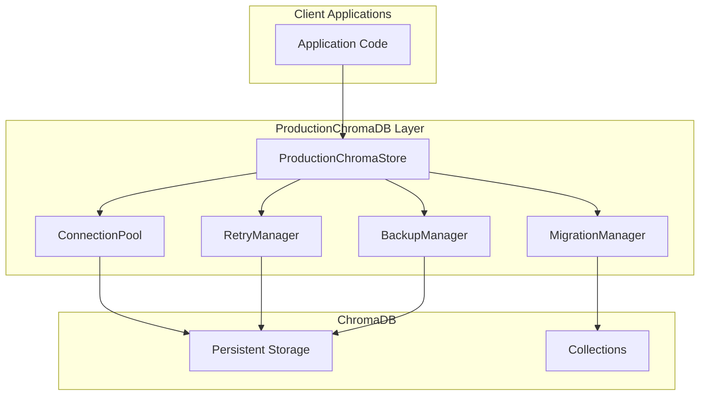

# Phase 4 Design: Production ChromaDB Integration

## Overview

This document outlines the design for a production-ready ChromaDB integration that extends the existing [`ChromaVectorStore`](src/vector_store/chroma_store.py) with enterprise-grade features including connection pooling, retry logic, backup/restore mechanisms, and schema migration support.

## Architecture



## Component Design

### 1. ProductionChromaStore Class

**Location**: `src/vector_store/chroma_production.py`

**Responsibilities**:
- Extend [`ChromaVectorStore`](src/vector_store/chroma_store.py) with production features
- Manage connection lifecycle with pooling
- Handle retry logic for transient failures
- Coordinate backup/restore operations
- Execute schema migrations

**Key Attributes**:
```python
class ProductionChromaStore(ChromaVectorStore):
    _connection_pool: ConnectionPool
    _retry_manager: RetryManager
    _backup_manager: BackupManager
    _migration_manager: MigrationManager
    _health_monitor: HealthMonitor
    _metrics: MetricsCollector
```

### 2. Connection Pooling

**Design**:
- Connection pool with configurable min/max connections
- Connection health checks before checkout
- Automatic connection recycling on failures
- Connection timeout handling

**Configuration**:
```python
@dataclass
class ConnectionPoolConfig:
    min_connections: int = 2
    max_connections: int = 10
    connection_timeout: float = 30.0
    max_idle_time: float = 300.0
    health_check_interval: float = 60.0
```

### 3. Retry Logic

**Strategy**: Exponential backoff with jitter

**Retryable Errors**:
- Connection timeouts
- Temporary network failures
- ChromaDB lock contention
- Resource exhaustion (with backoff)

**Configuration**:
```python
@dataclass
class RetryConfig:
    max_retries: int = 3
    base_delay: float = 1.0
    max_delay: float = 60.0
    exponential_base: float = 2.0
    jitter: bool = True
    retryable_errors: List[str] = field(default_factory=list)
```

### 4. Backup/Restore Mechanism

**Backup Types**:
1. **Full Backup**: Complete database snapshot
2. **Incremental Backup**: Changes since last backup
3. **Collection Backup**: Single collection export

**Storage Backends**:
- Local filesystem
- S3-compatible storage
- Azure Blob Storage
- Google Cloud Storage

**Backup Format**:
```python
@dataclass
class BackupMetadata:
    backup_id: str
    created_at: datetime
    backup_type: BackupType
    collections: List[str]
    size_bytes: int
    checksum: str
    chroma_version: str
```

### 5. Schema Migration System

**Migration Framework**:
- Versioned migrations with sequential numbering
- Forward and rollback support
- Migration state tracking in metadata
- Automatic migration on startup (optional)

**Migration Structure**:
```python
@dataclass
class Migration:
    version: int
    name: str
    apply: Callable[[], None]
    rollback: Callable[[], None]
    dependencies: List[int]
```

## Configuration

**ProductionConfig Extension**:
```python
class ProductionVectorStoreConfig(VectorStoreConfig):
    # Connection Pool
    pool_min_connections: int = 2
    pool_max_connections: int = 10
    pool_connection_timeout: float = 30.0
    
    # Retry
    retry_max_retries: int = 3
    retry_base_delay: float = 1.0
    retry_max_delay: float = 60.0
    
    # Backup
    backup_enabled: bool = True
    backup_schedule: str = "0 2 * * *"  # Daily at 2 AM
    backup_retention_days: int = 30
    backup_storage_path: str = "./backups"
    
    # Migration
    auto_migrate: bool = False
    migration_path: str = "./migrations"
```

## Error Handling

**New Exception Types**:
- `ConnectionPoolError`: Pool exhaustion or connection failures
- `BackupError`: Backup/restore operation failures
- `MigrationError`: Schema migration failures
- `RetryExhaustedError`: All retry attempts failed

## Integration Points

1. **Existing ChromaVectorStore**: Inherit and extend
2. **DenseRetriever**: Use ProductionChromaStore as vector store
3. **Configuration**: Extend Settings class
4. **Logging**: Structured logging for all operations

## Performance Considerations

- Connection pool reduces connection overhead
- Retry logic prevents transient failure cascades
- Backup operations run asynchronously
- Migration locking prevents concurrent modifications

## Security

- Backup encryption at rest
- Secure credential handling for cloud storage
- Access logging for audit trails
