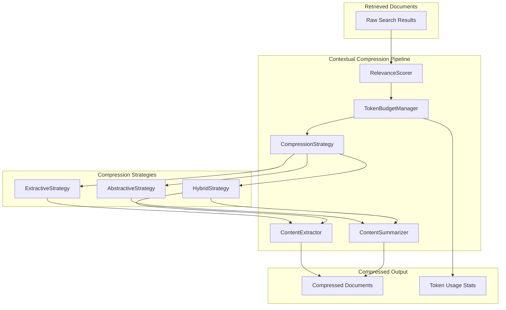

# Phase 4 Design: Contextual Compression

## Overview

Contextual Compression reduces the token count of retrieved documents while preserving relevance to the query. This is essential for fitting more relevant context within LLM context windows and reducing API costs. The system supports both extractive (selecting relevant parts) and abstractive (summarizing) compression strategies.

## Architecture



## Component Design

### 1. ContextualCompressor (Main Class)

**Location**: `src/retrieval/contextual_compression.py`

**Responsibilities**:
- Orchestrate the compression pipeline
- Manage token budgets
- Select appropriate compression strategy
- Track compression metrics

**Key Methods**:
```python
class ContextualCompressor:
    def __init__(
        self,
        llm_client: Optional[OpenAI] = None,
        default_strategy: CompressionStrategy = CompressionStrategy.EXTRACTIVE,
        token_budget: int = 4000,
    ):
        self.budget_manager = TokenBudgetManager(token_budget)
        self.relevance_scorer = RelevanceScorer()
        self.strategy_selector = StrategySelector()
        
    async def compress(
        self,
        documents: List[DocumentChunk],
        query: str,
        strategy: Optional[CompressionStrategy] = None,
    ) -> CompressionResult:
        """Compress documents based on query relevance."""
        
    async def compress_batch(
        self,
        batches: List[CompressionBatch],
    ) -> List[CompressionResult]:
        """Compress multiple batches efficiently."""
```

### 2. RelevanceScorer

**Responsibilities**:
- Score document relevance to query
- Identify most relevant segments within documents
- Support multiple scoring methods

**Scoring Methods**:
1. **Embedding Similarity**: Cosine similarity between query and document embeddings
2. **LLM-based**: Ask LLM to rate relevance 1-10
3. **Cross-encoder**: Use cross-encoder model for precise scoring
4. **Keyword Overlap**: Simple keyword matching as baseline

**Output**:
```python
@dataclass
class RelevanceScore:
    document_id: UUID
    overall_score: float
    segment_scores: List[SegmentScore]
    method: ScoringMethod
```

### 3. TokenBudgetManager

**Responsibilities**:
- Track token usage across documents
- Allocate budget per document based on relevance
- Enforce hard limits
- Optimize for maximum information density

**Budget Allocation Strategies**:
1. **Uniform**: Equal budget for all documents
2. **Proportional**: Budget proportional to relevance score
3. **Threshold**: Minimum budget for docs above relevance threshold
4. **Greedy**: Fill budget with highest relevance docs first

**Configuration**:
```python
@dataclass
class TokenBudgetConfig:
    total_budget: int = 4000
    reserve_for_response: int = 1000
    min_per_document: int = 100
    max_per_document: int = 2000
    allocation_strategy: AllocationStrategy = AllocationStrategy.PROPORTIONAL
```

### 4. Compression Strategies

#### 4.1 Extractive Strategy

**Approach**: Select most relevant sentences/paragraphs without modification

**Algorithm**:
1. Split document into sentences/paragraphs
2. Score each segment for relevance
3. Select top segments within token budget
4. Preserve original order

**Implementation**:
```python
class ExtractiveCompressor:
    def __init__(
        self,
        segment_size: SegmentSize = SegmentSize.SENTENCE,
        overlap_segments: int = 1,
    ):
        self.segmenter = Segmenter(segment_size)
        self.overlap = overlap_segments
    
    async def compress(
        self,
        document: DocumentChunk,
        query: str,
        token_budget: int,
    ) -> ExtractedContent:
        segments = self.segmenter.split(document.content)
        scores = await self.score_segments(segments, query)
        selected = self.select_optimal(segments, scores, token_budget)
        return ExtractedContent(segments=selected)
```

#### 4.2 Abstractive Strategy

**Approach**: Generate concise summary using LLM

**Algorithm**:
1. Analyze document content
2. Generate summary focused on query-relevant information
3. Ensure summary fits token budget

**Prompt Template**:
```python
ABSTRACTIVE_COMPRESSION_PROMPT = """
Summarize the following document focusing on information relevant to the query.
Keep the summary under {max_tokens} tokens.

Query: {query}

Document:
{document}

Provide a concise summary that captures the key points relevant to the query.
"""
```

#### 4.3 Hybrid Strategy

**Approach**: Combine extractive and abstractive methods

**Algorithm**:
1. First apply extractive compression to reduce size
2. Then apply abstractive summarization on extracted content
3. Balance between preservation and conciseness

### 5. Content Extractor

**Responsibilities**:
- Split documents into extractable units
- Handle different document structures
- Preserve context around extracted segments

**Segmentation Levels**:
- `CHARACTER`: Fixed character windows
- `WORD`: Word-level chunks
- `SENTENCE`: Sentence-level (default)
- `PARAGRAPH`: Paragraph-level
- `SECTION`: Document sections

### 6. Content Summarizer

**Responsibilities**:
- Generate abstractive summaries
- Control summary length precisely
- Maintain factual accuracy
- Preserve query relevance

## Configuration

```python
@dataclass
class CompressionConfig:
    # Strategy
    default_strategy: CompressionStrategy = CompressionStrategy.EXTRACTIVE
    auto_select: bool = True
    
    # Token Budget
    token_budget: int = 4000
    allocation_strategy: AllocationStrategy = AllocationStrategy.PROPORTIONAL
    
    # Extractive
    segment_size: SegmentSize = SegmentSize.SENTENCE
    context_window: int = 2  # Sentences before/after
    
    # Abstractive
    summary_ratio: float = 0.3  # Target 30% of original
    min_summary_length: int = 50
    max_summary_length: int = 500
    
    # Performance
    batch_size: int = 5
    cache_results: bool = True
    
    # Quality
    min_relevance_threshold: float = 0.5
    preserve_structure: bool = True
```

## API Design

```python
class ContextualCompressor:
    """Compress retrieved documents based on query context."""
    
    async def compress_results(
        self,
        results: List[SearchResult],
        query: str,
        config: Optional[CompressionConfig] = None,
    ) -> CompressionResult:
        """
        Compress search results for query.
        
        Args:
            results: Raw search results from retriever
            query: Original user query
            config: Optional compression configuration
            
        Returns:
            CompressionResult with compressed documents and metadata
        """
        
    def get_compression_stats(self) -> CompressionStats:
        """Get statistics about compression performance."""
```

## Output Format

```python
@dataclass
class CompressionResult:
    original_documents: List[DocumentChunk]
    compressed_documents: List[CompressedDocument]
    original_token_count: int
    compressed_token_count: int
    compression_ratio: float
    strategy_used: CompressionStrategy
    relevance_scores: List[RelevanceScore]
    
@dataclass
class CompressedDocument:
    original_id: UUID
    content: str
    token_count: int
    compression_method: str
    preserved_segments: List[SegmentRef]
    relevance_score: float
```

## Error Handling

**Exception Types**:
- `CompressionError`: General compression failure
- `BudgetExceededError`: Cannot fit content within budget
- `RelevanceScoringError`: Failed to score relevance
- `SummarizationError`: LLM summarization failed

## Performance Considerations

- Cache relevance scores for repeated queries
- Batch LLM calls for abstractive compression
- Use fast embedding similarity for initial filtering
- Parallel compression of independent documents

## Integration Points

1. **Retriever**: Compress results before returning
2. **Reranker**: Use relevance scores from compression
3. **LLM Client**: Shared OpenAI client instance
4. **Token Counter**: Shared tokenization utilities
