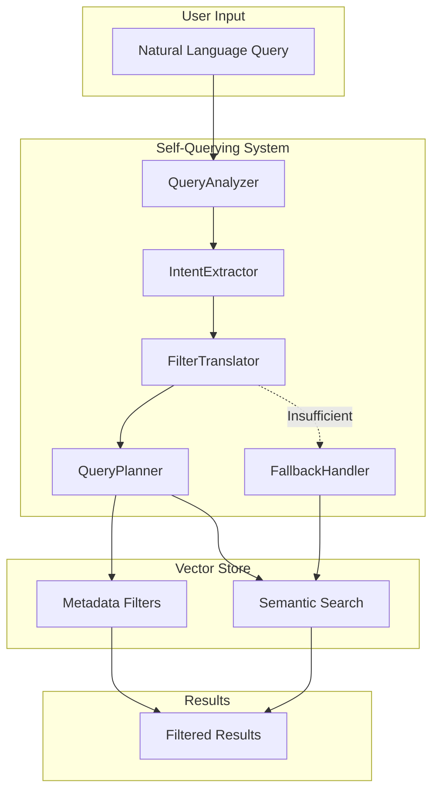

# Phase 4 Design: Self-Querying System

## Overview

The Self-Querying System enables natural language queries to be automatically translated into structured metadata filters for the vector store. This allows users to ask questions like "Find documents about Python written by John last year" and have the system automatically generate appropriate metadata filters.

## Architecture



## Component Design

### 1. QueryAnalyzer

**Location**: `src/retrieval/self_query.py` - `QueryAnalyzer` class

**Responsibilities**:
- Parse natural language queries
- Identify query intent and entities
- Extract temporal references (dates, time ranges)
- Identify comparison operators (before, after, between)

**Key Methods**:
```python
class QueryAnalyzer:
    async def analyze(self, query: str) -> QueryAnalysis:
        """Analyze query and extract structured information."""
        
    def _extract_entities(self, query: str) -> List[Entity]:
        """Extract named entities from query."""
        
    def _extract_temporal_refs(self, query: str) -> List[TemporalRef]:
        """Extract date/time references."""
```

**Output Structure**:
```python
@dataclass
class QueryAnalysis:
    original_query: str
    intent: QueryIntent
    entities: List[Entity]
    temporal_refs: List[TemporalRef]
    attributes: Dict[str, Any]
    confidence: float
```

### 2. IntentExtractor

**Responsibilities**:
- Classify query intent (search, filter, aggregate)
- Identify filterable attributes mentioned in query
- Determine if query requires semantic search or metadata filtering

**Supported Intents**:
- `SEARCH`: General semantic search
- `FILTER`: Metadata-based filtering
- `COMBINED`: Both semantic and metadata filtering
- `AGGREGATE`: Count, group, summarize

### 3. FilterTranslator

**Responsibilities**:
- Convert extracted entities to ChromaDB filter format
- Handle different comparison operators
- Support nested/complex filters
- Validate filter structure against schema

**Filter Types**:
```python
class FilterOperator(Enum):
    EQ = "$eq"           # Equal
    NE = "$ne"           # Not equal
    GT = "$gt"           # Greater than
    GTE = "$gte"         # Greater than or equal
    LT = "$lt"           # Less than
    LTE = "$lte"         # Less than or equal
    IN = "$in"           # In list
    NIN = "$nin"         # Not in list
    CONTAINS = "$contains"  # Contains substring
    AND = "$and"         # Logical AND
    OR = "$or"           # Logical OR
```

**Example Translations**:

| Natural Language | ChromaDB Filter |
|-----------------|-----------------|
| "documents by John" | `{"author": {"$eq": "John"}}` |
| "files created after 2024" | `{"created_at": {"$gt": "2024-01-01"}}` |
| "Python or JavaScript docs" | `{"$or": [{"tags": {"$in": ["python"]}}, {"tags": {"$in": ["javascript"]}}]}` |
| "recent high priority" | `{"$and": [{"priority": {"$eq": "high"}}, {"created_at": {"$gte": "2024-01-01"}}]}` |

### 4. QueryPlanner

**Responsibilities**:
- Plan optimal execution strategy
- Decide filter vs semantic search priority
- Handle complex multi-condition queries
- Optimize filter order for performance

**Planning Strategy**:
1. **Filter-First**: Apply metadata filters before semantic search
2. **Search-First**: Do semantic search then filter results
3. **Parallel**: Execute both simultaneously and merge

**Decision Matrix**:

| Condition | Strategy |
|-----------|----------|
| High-selectivity filters | Filter-First |
| Low-selectivity filters | Search-First |
| Complex semantic needs | Search-First |
| Multiple conditions | Parallel |

### 5. FallbackHandler

**Responsibilities**:
- Detect when filters are insufficient
- Fall back to full semantic search
- Provide explanations for fallback decisions
- Learn from fallback patterns

**Fallback Triggers**:
- Filter confidence below threshold
- No results from filtered search
- Query contains primarily semantic intent
- Complex natural language that can't be parsed

## LLM Integration

**Model**: OpenAI GPT-4 or GPT-3.5-turbo

**Prompt Strategy**:
```python
SELF_QUERY_PROMPT = """
You are a query understanding system. Convert the user's natural language query 
into structured metadata filters for a document search system.

Available metadata fields:
- author: string
- created_at: ISO date
- tags: list of strings
- category: string
- priority: "low", "medium", "high"

User query: {query}

Respond with a JSON object containing:
- filters: ChromaDB-compatible filter object
- confidence: 0.0 to 1.0
- explanation: brief explanation of the translation
"""
```

## API Design

```python
class SelfQueryRetriever:
    """Self-querying retriever with natural language to filter translation."""
    
    def __init__(
        self,
        vector_store: VectorStore,
        llm_client: Optional[OpenAI] = None,
        fallback_threshold: float = 0.5,
    ):
        self.vector_store = vector_store
        self.analyzer = QueryAnalyzer(llm_client)
        self.planner = QueryPlanner()
        self.fallback = FallbackHandler(fallback_threshold)
    
    async def retrieve(
        self,
        query: str,
        top_k: int = 10,
        use_filters: bool = True,
    ) -> SelfQueryResult:
        """
        Retrieve documents using self-querying.
        
        Args:
            query: Natural language query
            top_k: Number of results to return
            use_filters: Whether to attempt filter extraction
            
        Returns:
            SelfQueryResult with documents and metadata
        """
```

## Configuration

```python
@dataclass
class SelfQueryConfig:
    # LLM Settings
    llm_model: str = "gpt-3.5-turbo"
    llm_temperature: float = 0.0
    llm_max_tokens: int = 500
    
    # Filter Settings
    filter_confidence_threshold: float = 0.7
    max_filter_conditions: int = 5
    
    # Fallback Settings
    fallback_on_empty: bool = True
    fallback_threshold: float = 0.5
    
    # Performance
    cache_analysis: bool = True
    cache_ttl_seconds: int = 3600
```

## Error Handling

**Exception Types**:
- `QueryAnalysisError`: Failed to analyze query
- `FilterTranslationError`: Failed to translate to filters
- `InvalidFilterError`: Generated filter is invalid
- `FallbackActivatedError`: Informational - fallback was used

## Testing Strategy

**Test Categories**:
1. **Unit Tests**: Individual component testing
2. **Integration Tests**: End-to-end query to results
3. **Edge Cases**: Complex queries, ambiguous language
4. **Performance Tests**: Latency under load

**Example Test Cases**:
- Simple equality: "documents by Alice"
- Temporal range: "files from last month"
- Complex AND/OR: "Python docs by Bob or Charlie"
- Semantic fallback: "interesting articles about AI"
