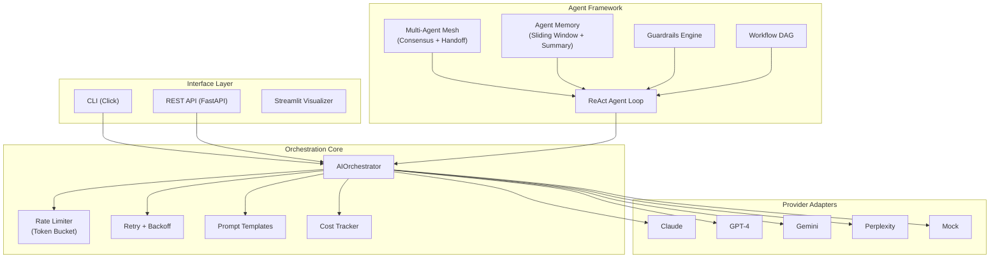

# Case Study: AgentForge -- Multi-LLM Orchestration Framework

**Platform**: AgentForge (ai-orchestrator) | **Domain**: LLM Provider Abstraction & Agent Orchestration
**Stack**: Python, httpx (async), Click CLI, FastAPI, pytest

---

## The Challenge

Teams building LLM-powered applications face a recurring set of engineering problems that frameworks like LangChain attempt to solve -- but at the cost of 50+ dependencies, ~50 MB installs, and tightly coupled abstractions that make provider switching painful.

The specific problems AgentForge addresses:

**Provider lock-in.** Switching from Claude to Gemini to GPT-4 requires rewriting API calls, handling different response formats, and adapting to different rate limiting behaviors. Most teams pick one provider and stay locked in, even when better options exist for specific tasks.

**Framework bloat.** LangChain's dependency tree is notorious. A simple chat completion pulls in dozens of packages, many with conflicting version requirements. For production systems where dependency stability matters, this is a liability.

**Production gaps.** Token-aware rate limiting, retry with exponential backoff, cost tracking per request, and structured output validation are table-stakes for production but absent from most lightweight alternatives. Teams end up building these primitives from scratch.

**No multi-agent coordination.** Running multiple agents with handoffs, consensus protocols, and shared memory requires significant orchestration infrastructure. Most frameworks provide single-agent patterns but leave multi-agent to the developer.

## The Solution

AgentForge provides a unified async interface across Claude, Gemini, OpenAI, and Perplexity with two core dependencies and ~15 KB installed footprint. Swap providers by changing a single string parameter.

### Architecture



### Unified Provider Interface

The `AIOrchestrator` class abstracts provider differences behind a consistent async API:

```python
from agentforge import AIOrchestrator

orc = AIOrchestrator(temperature=0.3, max_tokens=2048)

# Same interface, different providers
response_claude = await orc.chat("claude", "Explain RAG")
response_gemini = await orc.chat("gemini", "Explain RAG")
response_gpt = await orc.chat("openai", "Explain RAG")

# Automatic fallback
response = await orc.chat("claude", prompt, fallback="openai")
```

Provider-specific behaviors (streaming formats, function calling schemas, token counting) are handled by adapter modules. Adding a new provider requires implementing a single adapter class.

### ReAct Agent Loop with Tool Execution

AgentForge implements the ReAct (Reasoning + Acting) pattern with built-in loop detection:

1. **Thought**: The agent reasons about the current state and decides on an action.
2. **Action**: The agent calls a registered tool with extracted parameters.
3. **Observation**: Tool results are fed back into the agent's context.
4. **Loop Detection**: If the agent repeats the same thought-action pair, the loop is broken with a synthesis step.

Tools are defined declaratively with JSON Schema validation on inputs and outputs. The tool registry supports dynamic registration, enabling agents to discover and use tools at runtime.

### Multi-Agent Mesh

The agent mesh enables 5+ concurrent agents to coordinate through:

- **Consensus protocols**: Multiple agents independently analyze the same input, and their outputs are synthesized based on agreement scores.
- **Handoff protocols**: An agent can transfer its context and task to a more specialized agent when it detects a domain boundary.
- **Shared memory**: Sliding window memory with summary compression keeps agents informed of prior context without exceeding token budgets.
- **Guardrails engine**: Content filters, token budget enforcement, and PII detection run as middleware on every agent turn.

### Workflow DAG Execution

Complex workflows can be defined as directed acyclic graphs with:

- Parallel node execution for independent tasks
- Configurable retry policies per node
- Result aggregation across branches
- Error propagation with fallback paths

### Production Infrastructure

| Component | Implementation | Purpose |
|-----------|---------------|---------|
| Rate Limiting | Token bucket algorithm | Per-provider request governance |
| Retry | Exponential backoff with jitter | Resilient API calls |
| Prompt Templates | `{{variable}}` substitution | Reusable, testable prompts |
| Cost Tracking | Per-request recording | Budget monitoring and provider comparison |
| Structured Output | JSON Schema validation | Reliable data extraction from LLM responses |
| Tracing | EventCollector with span hierarchy | Full observability of agent decisions |
| Model Registry | Version-tracked models with A/B selection | Controlled model rollouts |

## Results

| Metric | Value |
|--------|-------|
| Test Suite | 490+ automated tests across 21 test files |
| Provider Overhead | <50ms per call |
| Tool Dispatch | <10ms execution time |
| Agent Mesh | 5+ concurrent agents supported |
| Tracing Coverage | 100% of agent decisions captured |
| Dependencies | 2 core (vs. LangChain's 50+) |
| Install Footprint | ~15 KB (vs. ~50 MB) |
| Providers Supported | 5 (Claude, GPT-4, Gemini, Perplexity, Mock) |

### Test Coverage Breakdown

| Module | Tests | Coverage Area |
|--------|-------|---------------|
| Multi-Agent Mesh | 37 | Consensus, handoff, coordination |
| Workflow DAG | 34 | Parallel execution, retry, aggregation |
| Model Registry | 32 | Versioning, A/B selection |
| Streaming Agent | 32 | Real-time thought/action streaming |
| Guardrails | 30 | Content filters, PII, token budgets |
| Rate Limiter | 29 | Token bucket, burst handling |
| Prompt Templates | 27 | Variable extraction, rendering |
| Agent Memory | 39 | TTL, relevance scoring, persistence |
| Evaluation Framework | 26 | Automated agent evaluation |
| ReAct Agent | 22 | Reasoning loop, loop detection |

### Cost Model

| Provider | Cost per 1K tokens |
|----------|-------------------|
| Claude | $0.008 |
| OpenAI | $0.006 |
| Perplexity | $0.003 |
| Gemini | $0.002 |

The cost tracker enables real-time comparison across providers, allowing teams to route low-complexity tasks to cheaper models and reserve premium models for high-stakes decisions.

## Technical Decisions

- **Async-first**: All provider calls use httpx async. Synchronous wrappers are available but the core is non-blocking.
- **Mock provider for testing**: All 490+ unit tests run without API keys using a deterministic mock provider. Integration tests with real providers are isolated behind pytest markers.
- **Click CLI over argparse**: The CLI provides chat, stream, benchmark, and health check commands with consistent UX patterns.
- **No LangChain dependency**: AgentForge deliberately avoids LangChain's abstraction layer to maintain a minimal, predictable dependency tree.

## Architecture Decision Records

| ADR | Decision | Rationale |
|-----|----------|-----------|
| ADR-0001 | Provider Abstraction Pattern | Unified interface with per-provider adapters over a single mega-adapter |
| ADR-0002 | Token Bucket Rate Limiting | Per-provider token buckets over global rate limiting |
| ADR-0003 | ReAct Agent Loop | Thought-Action-Observation cycle with loop detection over free-form agent prompting |

---

*490+ tests | 5 LLM providers | Multi-agent mesh | CLI + REST API + Streamlit | MIT License*
