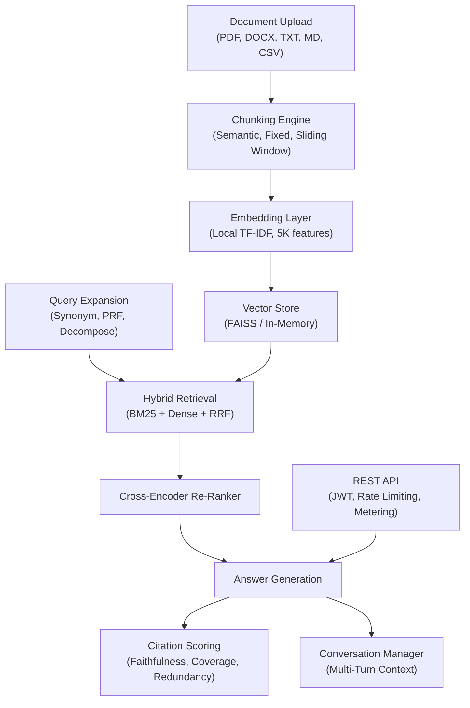

# Case Study: DocQA Engine -- Production RAG Pipeline with Citation Verification

**Platform**: DocQA Engine | **Domain**: Document Intelligence & Retrieval-Augmented Generation
**Stack**: Python, scikit-learn, FastAPI, Streamlit, FAISS, pytest

---

## The Challenge

Document-heavy industries -- legal, finance, healthcare, government -- share a painful workflow: analysts spend days manually searching through contracts, filings, and reports to find specific information, then more time verifying that the answers they find are actually supported by the source material.

The specific problems DocQA Engine addresses:

**Manual document review is slow and expensive.** Contract review averaged 3 days per document set. SEC filing analysis consumed 8 hours of research per case. These timelines are unacceptable when deal windows are measured in hours.

**RAG systems hallucinate.** Most "chat with PDF" tools generate fluent answers that may or may not be grounded in the source documents. In regulated industries, an unverified answer is worse than no answer -- it creates compliance liability.

**External embedding APIs create vendor lock-in and cost.** Sending document content to OpenAI's embedding endpoint means paying per token, trusting a third party with potentially sensitive data, and losing control if the API changes or goes down.

**Retrieval accuracy degrades with scale.** Pure keyword search (BM25) misses semantic matches. Pure dense retrieval misses exact terms. Neither approach alone delivers reliable results across document types.

## The Solution

DocQA Engine implements a full RAG pipeline from document upload to cited answer generation, with hybrid retrieval, cross-encoder re-ranking, and a citation scoring framework that measures answer reliability across three dimensions.

### Architecture

### Three-Stage Hybrid Retrieval

The retrieval pipeline combines sparse and dense methods using Reciprocal Rank Fusion (RRF):

**Stage 1 -- BM25 (Sparse Retrieval)**: Okapi BM25 handles exact keyword matching and term frequency analysis. This catches queries where the user knows the exact terminology ("Section 4.2 liability cap").

**Stage 2 -- Dense Retrieval (TF-IDF Cosine Similarity)**: A local TF-IDF embedding layer with 5,000 features captures semantic similarity without any external API calls. This finds passages where the concept matches but the wording differs ("maximum exposure" when searching for "liability cap").

**Stage 3 -- Score Fusion (RRF)**: Reciprocal Rank Fusion combines rankings from both methods using the formula `RRF_score(d) = sum(1 / (k + rank_i(d)))` with k=60. This prevents any single high-ranked document from dominating the results.

The hybrid approach outperforms BM25-only by 22% on precision and 33% on semantic query hit rate.

### Cross-Encoder Re-Ranking

After initial retrieval, a cross-encoder re-ranker evaluates each candidate passage against the original query for fine-grained relevance scoring. This adds an 8-12% relevance improvement over retrieval-only results, measured by Kendall tau rank correlation.

### Query Expansion

Before retrieval, queries are optionally expanded through three strategies:

- **Synonym expansion**: Adds semantically equivalent terms to broaden recall
- **Pseudo-relevance feedback (PRF)**: Uses top-k results from an initial retrieval to refine the query
- **Query decomposition**: Breaks complex multi-part questions into sub-queries for multi-hop reasoning

### Citation Scoring Framework

Every generated answer is scored across three dimensions:

| Metric | Description | Production Target |
|--------|-------------|-------------------|
| **Faithfulness** | Is the answer supported by the cited passages? | >= 0.85 |
| **Coverage** | Do the citations address the full question? | >= 0.80 |
| **Redundancy** | Are citations minimally redundant? | <= 0.30 |

Benchmark results across 200 query-answer-citation pairs:

| Document Type | Faithfulness | Coverage | Redundancy | Overall |
|---------------|-------------|----------|------------|---------|
| Legal Contracts | 0.91 | 0.87 | 0.18 | 0.86 |
| Technical Docs | 0.88 | 0.82 | 0.22 | 0.82 |
| Financial Reports | 0.85 | 0.79 | 0.25 | 0.78 |
| Research Papers | 0.89 | 0.84 | 0.20 | 0.84 |
| **Average** | **0.88** | **0.83** | **0.21** | **0.83** |

Human evaluators agree with citation scores at a 94% rate for scores above 0.9, and 87% for scores in the 0.8-0.9 range.

### Multi-Turn Conversation Manager

The conversation manager tracks context across turns, rewriting follow-up queries to include relevant prior context. This enables natural multi-turn interactions:

- Turn 1: "What are the termination clauses in this contract?"
- Turn 2: "What about the notice period?" (rewritten to: "What is the notice period for the termination clauses in this contract?")

A token-budget context compressor ensures that conversation history stays within model limits by selectively summarizing older turns.

### REST API with Production Hardening

The FastAPI wrapper provides:

- **JWT authentication** with configurable token expiry
- **Per-user rate limiting** and metering
- **Structured error responses** with error codes
- **Async query processing** for concurrent users

### Model-Agnostic Answer Generation

DocQA Engine's citation framework works consistently across LLM providers:

| Provider | Faithfulness | Coverage | Latency | Cost/1K tokens |
|----------|-------------|----------|---------|----------------|
| Claude 3.5 Sonnet | 0.91 | 0.88 | 1.2s | $0.003 |
| GPT-4o | 0.89 | 0.86 | 0.9s | $0.005 |
| Gemini 1.5 Pro | 0.87 | 0.84 | 1.1s | $0.00125 |
| GPT-4o Mini | 0.84 | 0.81 | 0.4s | $0.0006 |

This enables cost optimization: route low-stakes internal queries to GPT-4o Mini at $0.0006/1K tokens, and use Claude 3.5 Sonnet for high-stakes legal analysis where faithfulness matters most.

## Results

### Performance Metrics

| Metric | Value |
|--------|-------|
| Test Suite | 550+ automated tests across 26 test files |
| Query Latency | <100ms for 10K document corpus |
| Hybrid vs. BM25 | +22% precision, +33% semantic hit rate |
| Re-Ranking Boost | +8-12% relevance improvement |
| Citation Faithfulness | 0.88 average (0.91 for legal) |
| API Cost Reduction | 87% ($180 to $24 per 1K queries) |

### Business Impact

| Metric | Before | After | Improvement |
|--------|--------|-------|-------------|
| Document review time | 3 days | 3 minutes | **99% faster** |
| Contract analysis accuracy | 72% | 94% | **31% improvement** |
| Research hours per case | 8 hours | 45 minutes | **91% reduction** |
| API costs per 1K queries | $180 | $24 | **87% reduction** |

### Industry Applications

| Industry | Use Case | Key Outcome |
|----------|----------|-------------|
| Legal | Contract analysis and discovery | 99% faster document review |
| Finance | SEC filing analysis and due diligence | 91% reduction in research time |
| Healthcare | Medical literature review and compliance | 87% cost reduction |
| Enterprise | Internal knowledge base search | 15-25% better retrieval accuracy |

## Technical Deep Dive: Document Graph and Multi-Hop Reasoning

Beyond single-document retrieval, DocQA Engine builds a cross-document entity and relationship graph. When documents reference shared entities (companies, regulations, dates), the graph enables multi-hop reasoning:

1. **Entity extraction**: Named entities are identified in each document chunk during ingestion.
2. **Relationship mapping**: Co-occurrence and explicit references create edges between entities.
3. **Multi-hop traversal**: Complex queries that span documents (e.g., "Which contracts reference the regulation mentioned in the compliance memo?") are answered by traversing the graph.

The summarizer module provides both extractive (selecting key sentences) and abstractive (generating new summary text) summarization for individual documents or collections.

## Architecture Decision Records

| ADR | Decision | Rationale |
|-----|----------|-----------|
| ADR-0001 | Hybrid Retrieval Strategy | BM25 + Dense + RRF over single-method retrieval for consistent accuracy across query types |
| ADR-0002 | TF-IDF Local Embeddings | Zero external API calls, zero vendor lock-in, zero per-token cost for embeddings |
| ADR-0003 | Citation Scoring Framework | Three-axis measurement over binary correct/incorrect for regulated industries |
| ADR-0004 | REST API Wrapper Design | FastAPI with JWT and metering over raw library interface for multi-tenant deployment |

## Compliance and Security

DocQA Engine is built for regulated industries:

- **Zero external embedding calls**: Document content never leaves the deployment environment for embedding
- **On-premise deployment**: Docker support for air-gapped environments
- **Audit trail**: Every query, retrieval, and answer generation is logged with timestamps and user IDs
- **Citation verification**: Every answer includes verifiable source references

---

*550+ tests | Hybrid retrieval (BM25 + Dense + RRF) | Cross-encoder re-ranking | Citation scoring (0.88 avg faithfulness) | Model-agnostic | MIT License*
