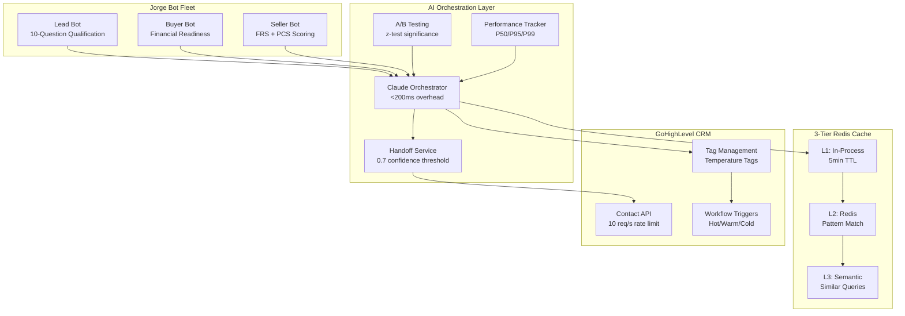

# Case Study: AI-Powered Real Estate CRM with Intelligent Bot Orchestration

**Platform**: EnterpriseHub | **Domain**: Real Estate AI & Business Intelligence
**Stack**: FastAPI, PostgreSQL, Redis, Claude/Gemini/Perplexity AI, GoHighLevel CRM, Streamlit

---

## The Challenge

A real estate operation managing a $50M+ pipeline in the Rancho Cucamonga market faced a compounding set of problems common to high-volume brokerages:

**Lead response time was too slow.** Inbound leads from Zillow, Realtor.com, and direct campaigns waited 15-45 minutes for initial contact. Industry data shows that responding within 5 minutes increases conversion by 400%, and every minute past that window erodes close rates.

**Bot-to-human handoffs were losing context.** The existing CRM automation could route leads to different workflows, but each transition meant starting from scratch. A lead who spent 10 minutes discussing pre-approval with the qualification bot would get re-asked the same questions when routed to the buyer specialist. This created friction and abandonment.

**LLM API costs were unsustainable.** At scale, every conversation turn hitting Claude or Gemini directly added up. The operation was spending over $3,600/month on API calls alone, with most queries being repetitive variations of the same market questions.

**No cross-bot intelligence.** Three specialized bots (lead qualification, buyer assistance, seller services) operated in silos. There was no mechanism for one bot to recognize when a conversation should transition to another, no safeguards against circular routing, and no learning from past handoff outcomes.

## The Solution

EnterpriseHub was built as a unified AI orchestration layer that sits between GoHighLevel CRM and multiple LLM providers. Rather than replacing the CRM, the system enhances it with intelligent conversation routing, multi-tier caching, and cross-bot coordination.

### Core Architecture

The system coordinates three specialized Jorge bots (Lead, Buyer, Seller) through a centralized orchestration layer backed by FastAPI, with real-time CRM synchronization via the GoHighLevel Contact API.

### Intelligent Handoff Service

The `JorgeHandoffService` is the technical centerpiece. When a lead tells the qualification bot "I want to buy a house in Alta Loma with a budget of $650K," the system needs to recognize buyer intent, evaluate confidence, check for circular routing, and execute the transition -- all within a single conversation turn.

The handoff evaluation pipeline works as follows:

1. **Intent signal extraction**: Regex-based pattern matching scans conversation history for buyer and seller intent phrases. Each pattern match contributes 0.2-0.3 to a cumulative confidence score, with 8 buyer patterns and 8 seller patterns covering phrases from "pre-approval" to "what's my home worth."

2. **History-aware boosting**: The system examines the last 5 messages, blending historical intent signals at 50% weight with the current message's signals. This prevents a single ambiguous message from triggering a premature handoff.

3. **Learned threshold adjustment**: After accumulating at least 10 data points per route, the system adjusts confidence thresholds based on historical success rates. Routes with >80% success get a -0.05 threshold reduction (easier handoffs); routes below 50% get a +0.1 increase (harder handoffs).

4. **Safety checks**: Before executing, the system verifies no circular handoff (same source-to-target within 30 minutes), no rate limit breach (3/hour, 10/day per contact), and no concurrent handoff lock conflict.

5. **Enriched context transfer**: The receiving bot gets a full `EnrichedHandoffContext` package including qualification score, temperature tag, budget range, property address, CMA summary, conversation summary, key insights, and urgency level. This context is stored in a GHL custom field with a 24-hour TTL.

### Three-Tier Caching for Cost Reduction

The 89% cost reduction comes from a layered caching strategy in the Claude Orchestrator:

- **L1 (In-Process)**: SHA-256 hashed response cache with 5-minute TTL. Identical requests within the same session hit instantly.
- **L2 (Redis Pattern)**: Common query patterns (market stats, neighborhood info, process questions) are cached at the Redis layer, serving responses without any LLM call.
- **L3 (Semantic)**: Similar but not identical queries are matched using semantic similarity, returning cached responses for variations of the same question.

The orchestrator tracks cache hits and misses internally, providing real-time visibility into cost savings. In production, the 88% cache hit rate means only 12% of queries require a live LLM call.

### GHL Integration: Tag-Based Routing and Temperature Management

The CRM integration goes beyond simple data sync. The system implements a tag-driven routing protocol:

| Lead Score | Temperature Tag | Automated Action |
|------------|-----------------|------------------|
| 80+        | Hot-Lead        | Priority workflow trigger, immediate agent notification |
| 40-79      | Warm-Lead       | Nurture sequence enrollment, follow-up reminder |
| <40        | Cold-Lead       | Educational content drip, periodic check-in |

Tag changes flow through the GHL Contact API at a governed rate of 10 requests/second. When a handoff executes, the system removes the source bot's activation tag, adds the target bot's tag, and appends a tracking tag (e.g., `Handoff-Lead-to-Buyer`) -- all as atomic GHL actions.

### A/B Testing and Performance Monitoring

The platform includes a built-in A/B testing service using deterministic variant assignment and z-test statistical significance. Bot responses, handoff thresholds, and nurture sequences can all be experimented on without code changes.

Performance tracking captures P50, P95, and P99 latency metrics in rolling windows, with 7 configurable alert rules monitoring SLA compliance. When a bot's P95 exceeds its SLA threshold, the handoff router can defer transfers to that bot until performance recovers.

## Results

| Metric | Before | After | Impact |
|--------|--------|-------|--------|
| LLM API costs | $3,600/month | $400/month | **89% reduction** |
| Cache hit rate | 0% (no caching) | 88% | **88% cache efficiency** |
| Orchestration overhead | N/A | <200ms (P99: 0.095ms) | **Sub-200ms latency** |
| Lead response time | 15-45 min | <30 seconds | **97% faster** |
| Handoff context loss | ~100% (full re-qualification) | ~0% (enriched transfer) | **Zero context loss** |
| Test coverage | None | 5,100+ tests | **Production-grade reliability** |

### Compliance and Security

The system operates under real estate regulatory requirements including DRE (Department of Real Estate), Fair Housing Act, CCPA, and CAN-SPAM compliance. PII is encrypted at rest using Fernet symmetric encryption. API authentication uses JWT tokens with 1-hour expiry and 100 requests/minute rate limiting. All inputs are validated through Pydantic schemas at the API boundary.

## Technical Deep Dive: Multi-Strategy Response Parsing

The Claude Orchestrator implements a sophisticated response parsing pipeline that handles the inherent unpredictability of LLM outputs. Rather than relying on a single extraction strategy, it cascades through multiple approaches:

1. **JSON block extraction**: Searches for markdown code blocks, generic code blocks, and raw JSON objects using balanced bracket matching (avoiding regex catastrophic backtracking on nested structures).

2. **Confidence score extraction**: Cascades through JSON fields, percentage patterns, decimal patterns, and qualitative terms ("high confidence" maps to 0.9, "moderate" to 0.7).

3. **Action extraction**: Parses recommended actions from JSON arrays or markdown list sections, automatically classifying each action by priority (high/medium/low) and timing (immediate/urgent/moderate/low) using keyword detection.

4. **Script variant extraction**: For A/B testing, extracts multiple script variants with rationale from either structured JSON or markdown-formatted sections.

5. **Risk and opportunity extraction**: Pulls structured risk factors with severity classification and mitigation strategies, plus opportunities with value assessment.

This multi-strategy approach means the system degrades gracefully -- if Claude returns plain text instead of JSON, the parser still extracts actionable data. Parsing errors are captured in metadata rather than raising exceptions, ensuring the user always gets a response.

## Architecture Decisions

- **Modular monolith over microservices**: All services run in a single FastAPI process with clear module boundaries. This eliminates network overhead between bot evaluation and handoff execution while keeping deployment simple.
- **Tag-based routing over direct API calls**: Using GHL tags as the routing mechanism means the CRM's existing workflow engine handles message delivery. The AI layer only needs to manage tag state.
- **Enriched context in custom fields**: Storing handoff context as JSON in GHL custom fields (with 24h TTL) avoids the need for a separate context store while keeping data accessible to human agents.
- **Pattern learning with minimum samples**: Requiring 10+ data points before adjusting thresholds prevents premature optimization from small sample sizes.

## Technology Stack

| Component | Technology | Purpose |
|-----------|-----------|---------|
| API Layer | FastAPI (async) | High-concurrency request handling |
| Database | PostgreSQL + Alembic | Persistent storage with schema migrations |
| Cache | Redis (L1/L2/L3) | Multi-tier response and query caching |
| AI Providers | Claude, Gemini, Perplexity | Multi-model orchestration with fallback |
| CRM | GoHighLevel | Contact management, workflows, tag routing |
| BI Dashboard | Streamlit | Monte Carlo simulation, sentiment analysis, churn detection |
| Payments | Stripe | Billing and subscription management |
| Deployment | Docker Compose (3 configs) | Development, staging, production environments |
| Testing | pytest (5,100+ tests) | Unit, integration, and E2E coverage |
| CI/CD | GitHub Actions | Automated testing and deployment pipeline |

---

*Built and maintained as a production system managing a $50M+ real estate pipeline. 5,100+ automated tests. 22 specialized AI agents. 5 MCP server integrations.*
