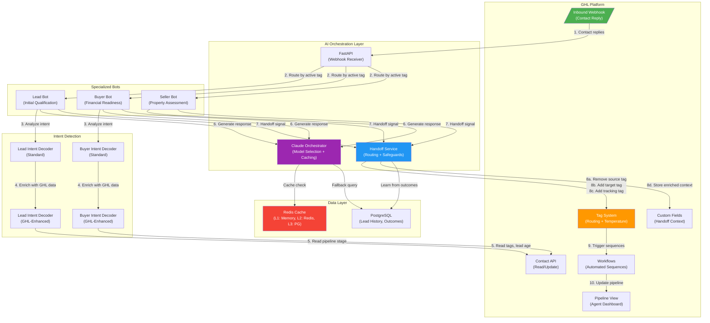

# GHL Architecture Diagram Post

**Platform**: GHL Facebook Group (primary), r/gohighlevel (adapted)
**Format**: Mermaid diagram + annotated walkthrough
**Tone**: Technical but accessible, invitation to discuss

---

## Post Title

The architecture behind our AI lead qualification system on GHL -- diagram + breakdown

## Post Body

I mapped out the full architecture of the AI lead qualification system we run on top of GoHighLevel. Sharing it here because I think it's useful to see how all the GHL pieces connect.

### System Architecture

### Connection Point Annotations

Here's what each numbered connection does:

**1. Inbound Webhook**: GHL fires a webhook on every contact reply. Payload includes contact ID, message text, and current tags.

**2. Tag-Based Routing**: The FastAPI layer reads the contact's active tag to decide which bot handles the message:
- `Needs Qualifying` tag --> Lead Bot
- `Buyer-Lead` tag --> Buyer Bot
- `Seller-Lead` tag --> Seller Bot

This uses GHL's native tag system as the routing mechanism. No custom router needed.

**3-5. Intent Detection (Standard + GHL-Enhanced)**: Each bot runs intent detection in two passes:
- **Standard**: Regex pattern matching on the message text (buyer phrases like "budget", "pre-approval"; seller phrases like "CMA", "home value")
- **GHL-Enhanced**: Enriches the score with CRM data -- existing tags, lead age, engagement recency, pipeline stage. A contact with a "Pre-Approved" tag gets a buyer intent boost even if the current message doesn't mention it.

**6. AI Response Generation**: The Claude Orchestrator selects the right model (Sonnet for standard, Opus for complex) and checks the 3-tier cache before making an API call. 88% of requests are served from cache.

**7. Handoff Signal**: When a bot detects strong intent for another bot type (confidence >= 0.7), it sends a handoff signal to the Handoff Service.

**8a-8d. Tag-Based Handoff Execution**:
- Remove the source bot's activation tag
- Add the target bot's activation tag
- Add a tracking tag (e.g., `Handoff-Lead-to-Buyer`) for analytics
- Store enriched context (qualification score, temperature, conversation summary) in a GHL custom field so the receiving bot has full context

**9-10. Workflow + Pipeline**: GHL workflows trigger automatically on tag changes -- nurture sequences for warm leads, priority alerts for hot leads. Pipeline view updates so human agents see the current state without checking a separate tool.

### Handoff Safeguard Layer (Not Shown in Diagram)

The Handoff Service includes safeguards that prevent bad handoffs:

| Safeguard | What It Does |
|-----------|-------------|
| Circular prevention | Blocks same source-to-target within 30 min |
| Rate limiting | Max 3/hour, 10/day per contact |
| Conflict locking | Prevents concurrent handoffs for same contact |
| Pattern learning | Adjusts thresholds based on outcome history |
| Performance routing | Defers handoffs if target bot is degraded |

### Temperature Tags (The Glue)

The part that ties it all together for human agents:

| Lead Score | GHL Tag | Automated Action |
|------------|---------|-----------------|
| >= 80 | `Hot-Lead` | Priority workflow, instant agent notification |
| 40-79 | `Warm-Lead` | Nurture sequence, 24h follow-up reminder |
| < 40 | `Cold-Lead` | Educational drip, 7-day check-in |

Agents never need to leave GHL. The tags and pipeline stages give them everything they need.

---

### Ask Me Anything

If you're building AI on top of GHL, I'd like to hear how your architecture compares. What does your bot routing look like? Are you using tags for routing or something else?

Drop a comment or DM me -- happy to go deeper on any part of this.

---

**Rendering Notes**:
- Render the Mermaid diagram to PNG using mermaid.live or a local renderer before posting to Facebook (FB doesn't render markdown)
- For Reddit, include the Mermaid source in a code block so technical users can render it themselves
- The diagram is intentionally detailed -- it should work as a standalone reference even without the annotations
