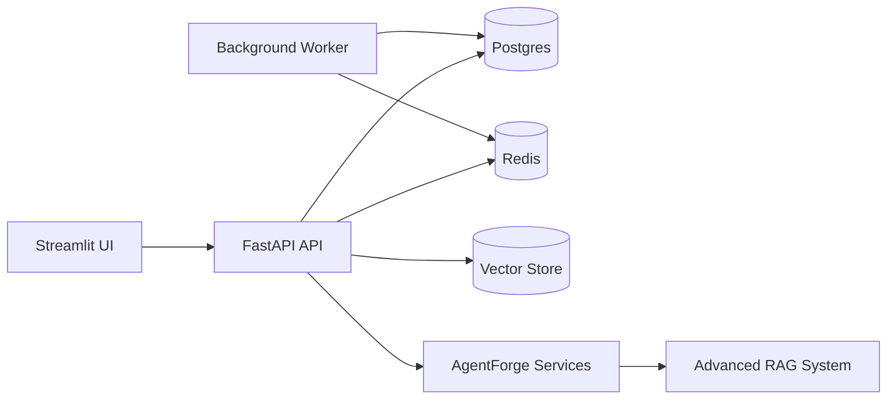
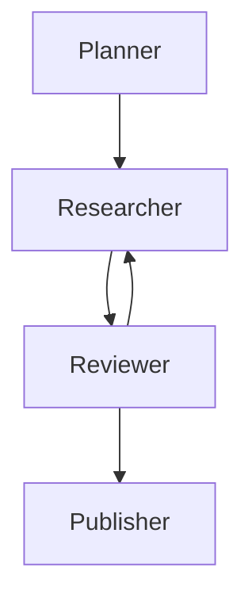
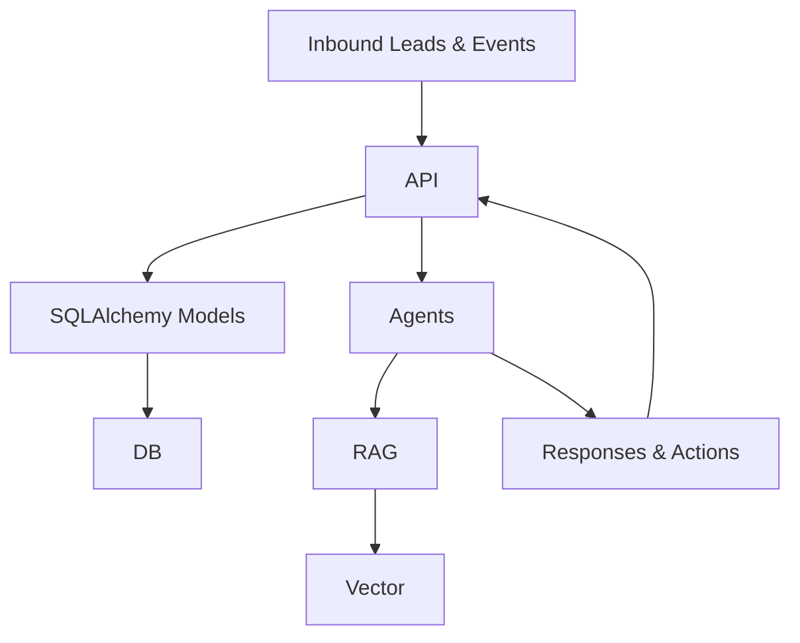
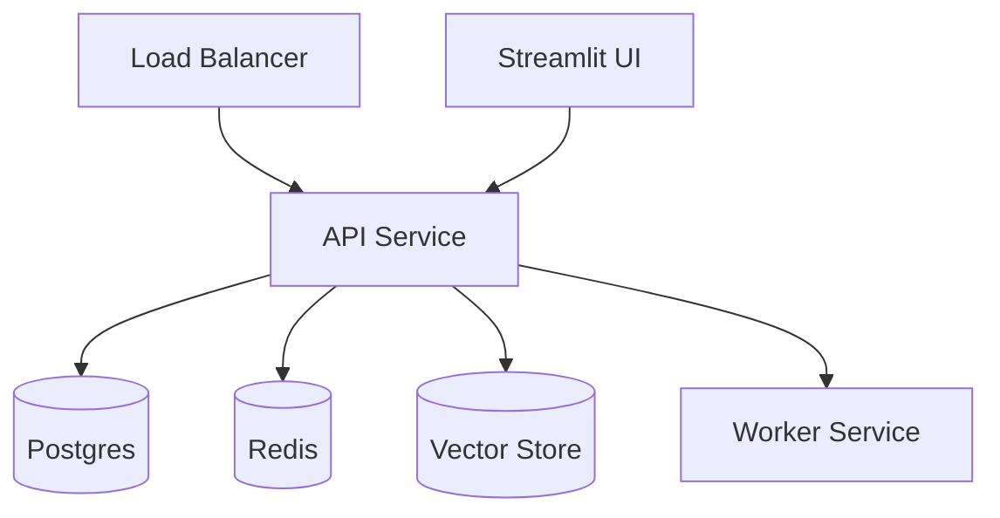

# EnterpriseHub Architecture

## System Overview

## Agent Orchestration Flow

## Data Flow

## Deployment Topology

## Key Subsystems
- **AgentForge**: Multi-agent orchestration with LangGraph state management.
- **Advanced RAG**: Hybrid retrieval, reranking, citations, and conversational memory.
- **Smart Analyst**: NL2SQL, data grid, self-healing Python execution, PDF reporting.
- **Observability**: Metrics + health endpoints for operational readiness.
