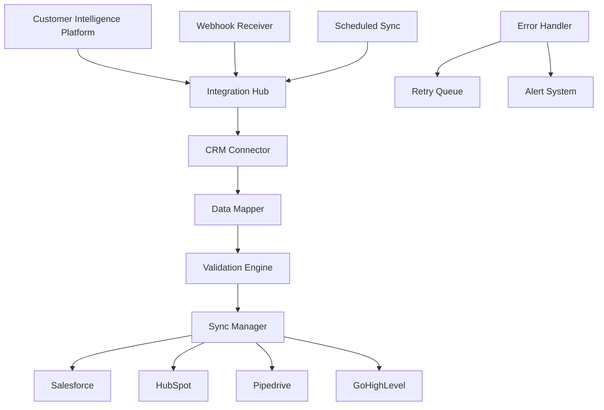

# 🎯 Customer Intelligence Platform - Client Success Enablement Kit

**Comprehensive guide for maximizing platform ROI and ensuring long-term client success**

---

## 📋 Success Framework Overview

### Client Success Methodology

Our proven 5-phase success framework ensures maximum platform value and sustainable growth:

```
🚀 Success Journey Phases:

Phase 1: Foundation Setup (Week 1-2)
├ Platform deployment and configuration
├ User onboarding and training completion
├ Data integration and validation
└ Initial success metrics baseline

Phase 2: Quick Wins (Week 3-4)  
├ Identify immediate value opportunities
├ Implement high-impact workflows
├ Generate first actionable insights
└ Demonstrate early ROI

Phase 3: Optimization (Month 2-3)
├ Advanced feature implementation
├ Workflow refinement and automation
├ Performance monitoring setup
└ Success metrics improvement

Phase 4: Expansion (Month 4-6)
├ Additional use case identification  
├ Team scaling and adoption
├ Integration with existing systems
└ Advanced analytics deployment

Phase 5: Mastery (Month 6+)
├ Platform expertise achievement
├ Continuous improvement processes
├ Strategic value maximization
└ Long-term partnership development
```

### Success Metrics Framework

| Category | Metric | Target | Measurement |
|----------|--------|---------|-------------|
| **Adoption** | User Login Rate | 90%+ | Daily active users / Total users |
| **Engagement** | Session Duration | 15+ min | Average time per user session |
| **Value** | Insights Generated | 5+ per week | Actionable insights identified |
| **Efficiency** | Time to Insight | <2 hours | From question to answer |
| **ROI** | Cost Reduction | 20%+ | Operational cost savings |
| **Growth** | Revenue Impact | 15%+ | Revenue attributed to insights |

---

## 🔧 Performance Monitoring Setup

### 2.1 System Health Monitoring

#### Core Performance Dashboards

```python
# Performance Monitoring Configuration
MONITORING_CONFIG = {
    "system_health": {
        "response_time_threshold": 2.0,  # seconds
        "error_rate_threshold": 1.0,     # percentage
        "uptime_target": 99.9,           # percentage
        "memory_threshold": 80.0,        # percentage
        "cpu_threshold": 70.0,           # percentage
        "disk_threshold": 85.0           # percentage
    },
    "user_experience": {
        "dashboard_load_time": 3.0,      # seconds
        "export_completion_time": 30.0,  # seconds  
        "concurrent_users_max": 100,     # users
        "session_timeout": 3600          # seconds
    },
    "data_quality": {
        "data_freshness_threshold": 300, # seconds
        "missing_data_threshold": 5.0,   # percentage
        "duplicate_records_threshold": 1.0, # percentage
        "data_consistency_score": 95.0   # percentage
    }
}
```

#### Automated Health Checks

```bash
#!/bin/bash
# scripts/health_check_comprehensive.sh
# Comprehensive health monitoring script

# Color codes for output
GREEN='\033[0;32m'
YELLOW='\033[1;33m'
RED='\033[0;31m'
NC='\033[0m'

# Configuration
HEALTH_LOG="/var/log/platform-health.log"
ALERT_WEBHOOK=${ALERT_WEBHOOK:-""}
PLATFORM_URL=${PLATFORM_URL:-"http://localhost:8501"}

log_health() {
    echo "[$(date '+%Y-%m-%d %H:%M:%S')] $1" >> "$HEALTH_LOG"
    echo -e "$1"
}

check_application_health() {
    log_health "${GREEN}Checking application health...${NC}"
    
    # Check main application
    if curl -f -s --connect-timeout 5 "${PLATFORM_URL}/health" > /dev/null; then
        log_health "✅ Application: Healthy"
        APP_STATUS="healthy"
    else
        log_health "${RED}❌ Application: Unhealthy${NC}"
        APP_STATUS="unhealthy"
    fi
    
    # Check API endpoints
    if curl -f -s --connect-timeout 5 "${PLATFORM_URL}:8000/health" > /dev/null; then
        log_health "✅ API: Healthy"
        API_STATUS="healthy"
    else
        log_health "${RED}❌ API: Unhealthy${NC}"
        API_STATUS="unhealthy"
    fi
}

check_database_performance() {
    log_health "${GREEN}Checking database performance...${NC}"
    
    # Test database connection and performance
    DB_RESPONSE_TIME=$(python3 -c "
import time
import os
import psycopg2
from urllib.parse import urlparse

start = time.time()
try:
    db_url = os.getenv('DATABASE_URL')
    parsed = urlparse(db_url)
    conn = psycopg2.connect(
        host=parsed.hostname,
        database=parsed.path[1:],
        user=parsed.username,
        password=parsed.password,
        port=parsed.port or 5432,
        connect_timeout=5
    )
    cursor = conn.cursor()
    cursor.execute('SELECT 1;')
    cursor.fetchone()
    cursor.close()
    conn.close()
    print(f'{time.time() - start:.3f}')
except Exception as e:
    print('ERROR')
" 2>/dev/null)
    
    if [[ "$DB_RESPONSE_TIME" == "ERROR" ]]; then
        log_health "${RED}❌ Database: Connection failed${NC}"
        DB_STATUS="unhealthy"
    elif (( $(echo "$DB_RESPONSE_TIME > 1.0" | bc -l) )); then
        log_health "${YELLOW}⚠️ Database: Slow response (${DB_RESPONSE_TIME}s)${NC}"
        DB_STATUS="degraded"
    else
        log_health "✅ Database: Healthy (${DB_RESPONSE_TIME}s)"
        DB_STATUS="healthy"
    fi
}

check_redis_performance() {
    log_health "${GREEN}Checking Redis performance...${NC}"
    
    REDIS_RESPONSE=$(redis-cli -u "$REDIS_URL" ping 2>/dev/null)
    REDIS_MEMORY=$(redis-cli -u "$REDIS_URL" info memory | grep used_memory_human | cut -d: -f2 | tr -d '\r')
    
    if [[ "$REDIS_RESPONSE" == "PONG" ]]; then
        log_health "✅ Redis: Healthy (Memory: $REDIS_MEMORY)"
        REDIS_STATUS="healthy"
    else
        log_health "${RED}❌ Redis: Unhealthy${NC}"
        REDIS_STATUS="unhealthy"
    fi
}

check_system_resources() {
    log_health "${GREEN}Checking system resources...${NC}"
    
    # CPU usage
    CPU_USAGE=$(top -bn1 | grep "Cpu(s)" | awk '{print $2}' | awk -F'%' '{print $1}')
    
    # Memory usage
    MEMORY_USAGE=$(free | grep Mem | awk '{printf "%.1f", $3/$2 * 100.0}')
    
    # Disk usage
    DISK_USAGE=$(df / | tail -1 | awk '{print $5}' | sed 's/%//')
    
    log_health "📊 System Resources:"
    log_health "   CPU: ${CPU_USAGE}%"
    log_health "   Memory: ${MEMORY_USAGE}%"  
    log_health "   Disk: ${DISK_USAGE}%"
    
    # Check thresholds
    RESOURCE_STATUS="healthy"
    if (( $(echo "$CPU_USAGE > 80" | bc -l) )); then
        log_health "${YELLOW}⚠️ High CPU usage: ${CPU_USAGE}%${NC}"
        RESOURCE_STATUS="degraded"
    fi
    
    if (( $(echo "$MEMORY_USAGE > 85" | bc -l) )); then
        log_health "${YELLOW}⚠️ High memory usage: ${MEMORY_USAGE}%${NC}"
        RESOURCE_STATUS="degraded"
    fi
    
    if (( DISK_USAGE > 90 )); then
        log_health "${RED}❌ High disk usage: ${DISK_USAGE}%${NC}"
        RESOURCE_STATUS="unhealthy"
    fi
}

generate_health_report() {
    log_health "${GREEN}Generating health report...${NC}"
    
    OVERALL_STATUS="healthy"
    if [[ "$APP_STATUS" == "unhealthy" ]] || [[ "$DB_STATUS" == "unhealthy" ]] || [[ "$REDIS_STATUS" == "unhealthy" ]] || [[ "$RESOURCE_STATUS" == "unhealthy" ]]; then
        OVERALL_STATUS="unhealthy"
    elif [[ "$APP_STATUS" == "degraded" ]] || [[ "$DB_STATUS" == "degraded" ]] || [[ "$REDIS_STATUS" == "degraded" ]] || [[ "$RESOURCE_STATUS" == "degraded" ]]; then
        OVERALL_STATUS="degraded"
    fi
    
    # Create JSON report
    HEALTH_REPORT=$(cat <<EOF
{
    "timestamp": "$(date -u +%Y-%m-%dT%H:%M:%SZ)",
    "overall_status": "$OVERALL_STATUS",
    "components": {
        "application": "$APP_STATUS",
        "api": "$API_STATUS", 
        "database": "$DB_STATUS",
        "redis": "$REDIS_STATUS",
        "system_resources": "$RESOURCE_STATUS"
    },
    "metrics": {
        "db_response_time": "$DB_RESPONSE_TIME",
        "cpu_usage": "$CPU_USAGE",
        "memory_usage": "$MEMORY_USAGE",
        "disk_usage": "$DISK_USAGE"
    }
}
EOF
)
    
    echo "$HEALTH_REPORT" > "/tmp/health-report.json"
    log_health "📊 Overall Status: $OVERALL_STATUS"
    
    # Send alert if unhealthy
    if [[ "$OVERALL_STATUS" == "unhealthy" ]] && [[ -n "$ALERT_WEBHOOK" ]]; then
        curl -X POST "$ALERT_WEBHOOK" \
             -H "Content-Type: application/json" \
             -d "$HEALTH_REPORT" &>/dev/null
        log_health "🚨 Alert sent to webhook"
    fi
}

# Main execution
main() {
    log_health "🔍 Starting comprehensive health check..."
    
    check_application_health
    check_database_performance  
    check_redis_performance
    check_system_resources
    generate_health_report
    
    log_health "✅ Health check completed"
}

if [[ "${BASH_SOURCE[0]}" == "${0}" ]]; then
    main "$@"
fi
```

### 2.2 User Experience Monitoring

#### User Analytics Dashboard
```python
# user_analytics_monitor.py
"""User experience and adoption monitoring."""

import asyncio
import logging
from datetime import datetime, timedelta
from typing import Dict, List, Any
import pandas as pd
from dataclasses import dataclass

@dataclass
class UserMetrics:
    """User experience metrics data class."""
    user_id: str
    tenant_id: str
    login_count: int
    session_duration_avg: float
    dashboard_views: int
    exports_created: int
    errors_encountered: int
    last_active: datetime

class UserExperienceMonitor:
    """Monitor and analyze user experience metrics."""
    
    def __init__(self, db_connection, redis_client):
        self.db = db_connection
        self.redis = redis_client
        self.logger = logging.getLogger(__name__)
    
    async def calculate_daily_metrics(self, tenant_id: str, date: str) -> Dict[str, Any]:
        """Calculate daily user experience metrics."""
        
        metrics = {
            "date": date,
            "tenant_id": tenant_id,
            "user_metrics": {
                "total_users": 0,
                "active_users": 0,
                "new_users": 0,
                "returning_users": 0
            },
            "engagement_metrics": {
                "avg_session_duration": 0,
                "avg_pages_per_session": 0,
                "bounce_rate": 0,
                "export_rate": 0
            },
            "performance_metrics": {
                "avg_load_time": 0,
                "error_rate": 0,
                "success_rate": 0
            },
            "adoption_metrics": {
                "feature_usage": {},
                "dashboard_popularity": {},
                "user_journey_completion": 0
            }
        }
        
        # Query user activity data
        query = """
        SELECT 
            u.id as user_id,
            u.tenant_id,
            COUNT(DISTINCT s.id) as session_count,
            AVG(s.duration) as avg_duration,
            COUNT(e.id) as total_events,
            COUNT(CASE WHEN e.event_type = 'export' THEN 1 END) as exports,
            COUNT(CASE WHEN e.event_type = 'error' THEN 1 END) as errors,
            MAX(s.created_at) as last_active
        FROM users u
        LEFT JOIN user_sessions s ON u.id = s.user_id 
        LEFT JOIN user_events e ON u.id = e.user_id
        WHERE u.tenant_id = %s 
        AND DATE(COALESCE(s.created_at, e.timestamp)) = %s
        GROUP BY u.id, u.tenant_id
        """
        
        user_data = await self.db.fetch_all(query, [tenant_id, date])
        
        if user_data:
            df = pd.DataFrame(user_data)
            
            # Calculate user metrics
            metrics["user_metrics"]["total_users"] = len(df)
            metrics["user_metrics"]["active_users"] = len(df[df["session_count"] > 0])
            
            # Calculate engagement metrics
            if not df.empty:
                metrics["engagement_metrics"]["avg_session_duration"] = df["avg_duration"].mean()
                metrics["engagement_metrics"]["export_rate"] = (df["exports"].sum() / len(df)) * 100
                
                # Error rate calculation
                total_events = df["total_events"].sum()
                total_errors = df["errors"].sum()
                metrics["performance_metrics"]["error_rate"] = (total_errors / total_events * 100) if total_events > 0 else 0
                metrics["performance_metrics"]["success_rate"] = 100 - metrics["performance_metrics"]["error_rate"]
        
        return metrics
    
    async def identify_at_risk_users(self, tenant_id: str) -> List[Dict[str, Any]]:
        """Identify users who may need additional support."""
        
        # Define at-risk criteria
        at_risk_query = """
        SELECT 
            u.id,
            u.username,
            u.email,
            u.last_login,
            u.role,
            COALESCE(usage.login_count, 0) as recent_logins,
            COALESCE(usage.session_duration, 0) as avg_session_duration,
            COALESCE(usage.error_count, 0) as recent_errors,
            CASE 
                WHEN u.last_login < NOW() - INTERVAL '7 days' THEN 'inactive'
                WHEN COALESCE(usage.error_count, 0) > 5 THEN 'struggling'
                WHEN COALESCE(usage.session_duration, 0) < 60 THEN 'low_engagement'
                ELSE 'healthy'
            END as risk_category
        FROM users u
        LEFT JOIN (
            SELECT 
                user_id,
                COUNT(*) as login_count,
                AVG(duration) as session_duration,
                SUM(CASE WHEN error_count > 0 THEN 1 ELSE 0 END) as error_count
            FROM user_sessions 
            WHERE created_at > NOW() - INTERVAL '30 days'
            GROUP BY user_id
        ) usage ON u.id = usage.user_id
        WHERE u.tenant_id = %s
        AND u.is_active = true
        """
        
        at_risk_users = await self.db.fetch_all(at_risk_query, [tenant_id])
        
        return [dict(user) for user in at_risk_users if user["risk_category"] != "healthy"]
    
    async def generate_success_recommendations(self, tenant_id: str) -> List[Dict[str, Any]]:
        """Generate recommendations for improving user success."""
        
        metrics = await self.calculate_daily_metrics(tenant_id, datetime.now().strftime('%Y-%m-%d'))
        at_risk_users = await self.identify_at_risk_users(tenant_id)
        
        recommendations = []
        
        # Low adoption recommendations
        if metrics["user_metrics"]["active_users"] / metrics["user_metrics"]["total_users"] < 0.7:
            recommendations.append({
                "category": "adoption",
                "priority": "high",
                "title": "Low User Adoption Detected",
                "description": "Only {}% of users are actively using the platform".format(
                    round((metrics["user_metrics"]["active_users"] / metrics["user_metrics"]["total_users"]) * 100, 1)
                ),
                "actions": [
                    "Schedule additional training sessions",
                    "Create role-specific onboarding flows",
                    "Identify and address user barriers",
                    "Implement user feedback collection"
                ]
            })
        
        # High error rate recommendations  
        if metrics["performance_metrics"]["error_rate"] > 5:
            recommendations.append({
                "category": "performance",
                "priority": "high", 
                "title": "High Error Rate Detected",
                "description": "Error rate is {}%, above the 5% threshold".format(
                    round(metrics["performance_metrics"]["error_rate"], 1)
                ),
                "actions": [
                    "Review error logs for common issues",
                    "Provide targeted user support",
                    "Improve error messaging and guidance",
                    "Consider additional training on problem areas"
                ]
            })
        
        # Low engagement recommendations
        if metrics["engagement_metrics"]["avg_session_duration"] < 900:  # 15 minutes
            recommendations.append({
                "category": "engagement",
                "priority": "medium",
                "title": "Low Session Duration",
                "description": "Average session duration is {} minutes, below optimal range".format(
                    round(metrics["engagement_metrics"]["avg_session_duration"] / 60, 1)
                ),
                "actions": [
                    "Create guided workflows for common tasks",
                    "Implement progressive feature disclosure",
                    "Add contextual help and tips",
                    "Gamify platform usage with achievements"
                ]
            })
        
        # At-risk user recommendations
        if len(at_risk_users) > 0:
            recommendations.append({
                "category": "user_support",
                "priority": "high",
                "title": f"At-Risk Users Identified",
                "description": f"{len(at_risk_users)} users need additional support",
                "actions": [
                    "Reach out to inactive users personally",
                    "Provide one-on-one training for struggling users", 
                    "Create simplified workflows for low-engagement users",
                    "Schedule regular check-ins with at-risk users"
                ],
                "affected_users": [user["username"] for user in at_risk_users[:5]]
            })
        
        return recommendations

# Usage example
async def run_user_experience_analysis():
    """Run comprehensive user experience analysis."""
    
    monitor = UserExperienceMonitor(db_connection, redis_client)
    
    # Calculate metrics for today
    today = datetime.now().strftime('%Y-%m-%d')
    metrics = await monitor.calculate_daily_metrics("your_tenant", today)
    
    # Identify at-risk users
    at_risk = await monitor.identify_at_risk_users("your_tenant")
    
    # Generate recommendations
    recommendations = await monitor.generate_success_recommendations("your_tenant")
    
    return {
        "metrics": metrics,
        "at_risk_users": at_risk,
        "recommendations": recommendations
    }
```

---

## 🔗 CRM Integration Guidelines

### 3.1 Integration Architecture

#### Supported CRM Platforms

| CRM Platform | Integration Method | Sync Frequency | Data Flow |
|--------------|-------------------|----------------|-----------|
| **Salesforce** | REST API + Webhooks | Real-time | Bi-directional |
| **HubSpot** | API + OAuth | Every 15 min | Bi-directional |
| **Pipedrive** | REST API | Every 30 min | Push to CRM |
| **GoHighLevel** | Native Integration | Real-time | Bi-directional |
| **Microsoft Dynamics** | Graph API | Every 15 min | Bi-directional |
| **Zoho CRM** | REST API | Every 30 min | Bi-directional |

#### Integration Flow Diagram



### 3.2 Salesforce Integration Setup

#### Step-by-Step Configuration

```python
# Salesforce Integration Configuration
SALESFORCE_CONFIG = {
    "client_id": "your_salesforce_client_id",
    "client_secret": "your_salesforce_client_secret", 
    "username": "your_username@company.com",
    "password": "your_password",
    "security_token": "your_security_token",
    "ontario_mills": "login.salesforce.com",  # or test.salesforce.com for sandbox
    "api_version": "v58.0"
}

class SalesforceIntegration:
    """Salesforce CRM integration handler."""
    
    def __init__(self, config):
        self.config = config
        self.client = None
        self.logger = logging.getLogger(__name__)
    
    async def authenticate(self):
        """Authenticate with Salesforce."""
        try:
            from simple_salesforce import Salesforce
            
            self.client = Salesforce(
                username=self.config["username"],
                password=self.config["password"],
                security_token=self.config["security_token"],
                ontario_mills=self.config["ontario_mills"],
                version=self.config["api_version"]
            )
            
            self.logger.info("Salesforce authentication successful")
            return True
            
        except Exception as e:
            self.logger.error(f"Salesforce authentication failed: {e}")
            return False
    
    async def sync_customer_data(self, customer_data: Dict[str, Any]) -> bool:
        """Sync customer data to Salesforce."""
        
        if not self.client:
            await self.authenticate()
        
        try:
            # Map platform data to Salesforce fields
            sf_contact = {
                'FirstName': customer_data.get('first_name'),
                'LastName': customer_data.get('last_name'),
                'Email': customer_data.get('email'),
                'Phone': customer_data.get('phone'),
                'Customer_Score__c': customer_data.get('score'),
                'Lifetime_Value__c': customer_data.get('lifetime_value'),
                'Segment__c': customer_data.get('segment'),
                'Last_Platform_Activity__c': customer_data.get('last_activity')
            }
            
            # Check if contact exists
            existing = self.client.query(
                f"SELECT Id FROM Contact WHERE Email = '{customer_data['email']}'"
            )
            
            if existing['records']:
                # Update existing contact
                contact_id = existing['records'][0]['Id']
                result = self.client.Contact.update(contact_id, sf_contact)
                self.logger.info(f"Updated Salesforce contact: {contact_id}")
            else:
                # Create new contact  
                result = self.client.Contact.create(sf_contact)
                self.logger.info(f"Created Salesforce contact: {result['id']}")
            
            return True
            
        except Exception as e:
            self.logger.error(f"Salesforce sync failed: {e}")
            return False
    
    async def sync_customer_events(self, events: List[Dict[str, Any]]) -> bool:
        """Sync customer events as Salesforce activities."""
        
        if not self.client:
            await self.authenticate()
        
        try:
            for event in events:
                # Create task/activity record
                sf_task = {
                    'Subject': f"Platform Activity: {event['event_type']}",
                    'Description': event.get('description', ''),
                    'ActivityDate': event['timestamp'].date(),
                    'Status': 'Completed',
                    'WhoId': event.get('contact_id'),  # Link to contact
                    'Type': 'Platform Activity'
                }
                
                self.client.Task.create(sf_task)
            
            self.logger.info(f"Synced {len(events)} events to Salesforce")
            return True
            
        except Exception as e:
            self.logger.error(f"Event sync failed: {e}")
            return False

# Integration Setup Script
async def setup_salesforce_integration():
    """Set up Salesforce integration."""
    
    integration = SalesforceIntegration(SALESFORCE_CONFIG)
    
    # Test authentication
    if await integration.authenticate():
        print("✅ Salesforce authentication successful")
        
        # Test data sync
        sample_customer = {
            'first_name': 'John',
            'last_name': 'Doe',
            'email': 'john.doe@example.com',
            'phone': '+1-555-123-4567',
            'score': 85,
            'lifetime_value': 5000.00,
            'segment': 'High Value',
            'last_activity': datetime.now()
        }
        
        if await integration.sync_customer_data(sample_customer):
            print("✅ Test data sync successful")
        else:
            print("❌ Test data sync failed")
    else:
        print("❌ Salesforce authentication failed")
```

### 3.3 HubSpot Integration Setup

```python
# HubSpot Integration Configuration
HUBSPOT_CONFIG = {
    "access_token": "your_hubspot_access_token",
    "client_id": "your_hubspot_client_id",
    "client_secret": "your_hubspot_client_secret",
    "portal_id": "your_portal_id",
    "api_base_url": "https://api.hubapi.com"
}

class HubSpotIntegration:
    """HubSpot CRM integration handler."""
    
    def __init__(self, config):
        self.config = config
        self.headers = {
            "Authorization": f"Bearer {config['access_token']}",
            "Content-Type": "application/json"
        }
        self.logger = logging.getLogger(__name__)
    
    async def sync_contact_data(self, customer_data: Dict[str, Any]) -> bool:
        """Sync customer data to HubSpot contacts."""
        
        try:
            import httpx
            
            # Map platform data to HubSpot properties
            hs_contact = {
                "properties": {
                    "firstname": customer_data.get('first_name'),
                    "lastname": customer_data.get('last_name'),
                    "email": customer_data.get('email'),
                    "phone": customer_data.get('phone'),
                    "customer_intelligence_score": customer_data.get('score'),
                    "customer_lifetime_value": customer_data.get('lifetime_value'),
                    "customer_segment": customer_data.get('segment'),
                    "last_platform_activity": customer_data.get('last_activity')
                }
            }
            
            async with httpx.AsyncClient() as client:
                # Check if contact exists
                search_response = await client.post(
                    f"{self.config['api_base_url']}/crm/v3/objects/contacts/search",
                    headers=self.headers,
                    json={
                        "filterGroups": [
                            {
                                "filters": [
                                    {
                                        "propertyName": "email",
                                        "operator": "EQ",
                                        "value": customer_data['email']
                                    }
                                ]
                            }
                        ]
                    }
                )
                
                if search_response.status_code == 200:
                    search_data = search_response.json()
                    
                    if search_data['results']:
                        # Update existing contact
                        contact_id = search_data['results'][0]['id']
                        update_response = await client.patch(
                            f"{self.config['api_base_url']}/crm/v3/objects/contacts/{contact_id}",
                            headers=self.headers,
                            json=hs_contact
                        )
                        
                        if update_response.status_code == 200:
                            self.logger.info(f"Updated HubSpot contact: {contact_id}")
                            return True
                    else:
                        # Create new contact
                        create_response = await client.post(
                            f"{self.config['api_base_url']}/crm/v3/objects/contacts",
                            headers=self.headers,
                            json=hs_contact
                        )
                        
                        if create_response.status_code == 201:
                            new_contact = create_response.json()
                            self.logger.info(f"Created HubSpot contact: {new_contact['id']}")
                            return True
                
                return False
                
        except Exception as e:
            self.logger.error(f"HubSpot sync failed: {e}")
            return False
```

---

## 📊 Data Import Procedures

### 4.1 Data Import Framework

#### Supported Data Formats

| Format | Max File Size | Use Case | Processing Time |
|--------|--------------|----------|-----------------|
| **CSV** | 50MB | Bulk customer data | 2-5 minutes |
| **Excel** | 25MB | Formatted reports | 3-7 minutes |
| **JSON** | 100MB | API data dumps | 1-3 minutes |
| **XML** | 75MB | System exports | 4-8 minutes |
| **Parquet** | 200MB | Analytics data | 1-2 minutes |

#### Data Validation Pipeline

```python
# data_import_validator.py
"""Comprehensive data validation and import system."""

import pandas as pd
import numpy as np
from typing import Dict, List, Tuple, Any
from datetime import datetime
import logging

class DataValidator:
    """Data validation engine for imports."""
    
    def __init__(self):
        self.logger = logging.getLogger(__name__)
        self.validation_rules = self._load_validation_rules()
    
    def _load_validation_rules(self) -> Dict[str, Any]:
        """Load validation rules for different data types."""
        return {
            "customer_data": {
                "required_fields": ["email", "name"],
                "optional_fields": ["phone", "company", "score", "segment"],
                "data_types": {
                    "email": "email",
                    "name": "string",
                    "phone": "phone",
                    "score": "numeric",
                    "lifetime_value": "currency"
                },
                "constraints": {
                    "email": {"unique": True, "format": "email"},
                    "score": {"min": 0, "max": 100},
                    "lifetime_value": {"min": 0}
                }
            },
            "event_data": {
                "required_fields": ["customer_id", "event_type", "timestamp"],
                "optional_fields": ["event_data", "source", "value"],
                "data_types": {
                    "customer_id": "string",
                    "event_type": "string", 
                    "timestamp": "datetime",
                    "value": "numeric"
                },
                "constraints": {
                    "event_type": {"allowed_values": ["page_view", "purchase", "signup", "login"]},
                    "timestamp": {"format": "ISO8601"}
                }
            }
        }
    
    def validate_file_format(self, file_path: str, expected_format: str) -> Tuple[bool, str]:
        """Validate file format and structure."""
        
        try:
            if expected_format.lower() == 'csv':
                df = pd.read_csv(file_path, nrows=5)
            elif expected_format.lower() == 'excel':
                df = pd.read_excel(file_path, nrows=5)
            elif expected_format.lower() == 'json':
                df = pd.read_json(file_path, lines=True, nrows=5)
            else:
                return False, f"Unsupported format: {expected_format}"
            
            return True, f"File format validated: {len(df.columns)} columns detected"
            
        except Exception as e:
            return False, f"File format validation failed: {str(e)}"
    
    def validate_data_structure(self, df: pd.DataFrame, data_type: str) -> Dict[str, Any]:
        """Validate data structure against rules."""
        
        validation_result = {
            "valid": True,
            "errors": [],
            "warnings": [],
            "statistics": {
                "total_rows": len(df),
                "total_columns": len(df.columns),
                "missing_data_percent": 0,
                "duplicate_rows": 0
            }
        }
        
        rules = self.validation_rules.get(data_type, {})
        
        # Check required fields
        required_fields = rules.get("required_fields", [])
        missing_fields = [field for field in required_fields if field not in df.columns]
        if missing_fields:
            validation_result["errors"].append(f"Missing required fields: {missing_fields}")
            validation_result["valid"] = False
        
        # Check data types
        data_types = rules.get("data_types", {})
        for field, expected_type in data_types.items():
            if field in df.columns:
                if not self._validate_field_type(df[field], expected_type):
                    validation_result["errors"].append(f"Invalid data type for {field}: expected {expected_type}")
                    validation_result["valid"] = False
        
        # Check constraints
        constraints = rules.get("constraints", {})
        for field, constraint in constraints.items():
            if field in df.columns:
                constraint_errors = self._validate_field_constraints(df[field], constraint, field)
                validation_result["errors"].extend(constraint_errors)
                if constraint_errors:
                    validation_result["valid"] = False
        
        # Calculate statistics
        validation_result["statistics"]["missing_data_percent"] = (df.isnull().sum().sum() / (len(df) * len(df.columns))) * 100
        validation_result["statistics"]["duplicate_rows"] = df.duplicated().sum()
        
        return validation_result
    
    def _validate_field_type(self, series: pd.Series, expected_type: str) -> bool:
        """Validate field data type."""
        
        try:
            if expected_type == "email":
                return series.str.contains(r'^[^\s@]+@[^\s@]+\.[^\s@]+$', na=False).all()
            elif expected_type == "phone":
                return series.str.match(r'^\+?[\d\s\-\(\)]{10,}$', na=False).all()
            elif expected_type == "numeric":
                return pd.to_numeric(series, errors='coerce').notna().all()
            elif expected_type == "datetime":
                return pd.to_datetime(series, errors='coerce').notna().all()
            elif expected_type == "string":
                return True  # All data can be treated as strings
            else:
                return True
                
        except Exception:
            return False
    
    def _validate_field_constraints(self, series: pd.Series, constraints: Dict[str, Any], field_name: str) -> List[str]:
        """Validate field constraints."""
        
        errors = []
        
        # Unique constraint
        if constraints.get("unique", False) and series.duplicated().any():
            errors.append(f"Duplicate values found in {field_name}")
        
        # Min/Max constraints
        if "min" in constraints:
            min_val = constraints["min"]
            if pd.to_numeric(series, errors='coerce').min() < min_val:
                errors.append(f"{field_name} contains values below minimum: {min_val}")
        
        if "max" in constraints:
            max_val = constraints["max"]
            if pd.to_numeric(series, errors='coerce').max() > max_val:
                errors.append(f"{field_name} contains values above maximum: {max_val}")
        
        # Allowed values constraint
        if "allowed_values" in constraints:
            allowed_values = constraints["allowed_values"]
            invalid_values = set(series.unique()) - set(allowed_values)
            if invalid_values:
                errors.append(f"{field_name} contains invalid values: {invalid_values}")
        
        return errors

class DataImportProcessor:
    """Process and import validated data."""
    
    def __init__(self, db_connection, redis_client):
        self.db = db_connection
        self.redis = redis_client
        self.logger = logging.getLogger(__name__)
        self.validator = DataValidator()
    
    async def process_import(self, file_path: str, data_type: str, tenant_id: str) -> Dict[str, Any]:
        """Process data import with validation and error handling."""
        
        import_result = {
            "success": False,
            "processed_rows": 0,
            "skipped_rows": 0,
            "errors": [],
            "warnings": [],
            "import_id": f"import_{datetime.now().strftime('%Y%m%d_%H%M%S')}"
        }
        
        try:
            # Step 1: Validate file format
            is_valid_format, format_message = self.validator.validate_file_format(file_path, "csv")
            if not is_valid_format:
                import_result["errors"].append(format_message)
                return import_result
            
            # Step 2: Load and validate data
            df = pd.read_csv(file_path)
            validation_result = self.validator.validate_data_structure(df, data_type)
            
            if not validation_result["valid"]:
                import_result["errors"].extend(validation_result["errors"])
                return import_result
            
            # Step 3: Process data in batches
            batch_size = 1000
            total_rows = len(df)
            processed_rows = 0
            
            for i in range(0, total_rows, batch_size):
                batch_df = df.iloc[i:i+batch_size]
                
                try:
                    if data_type == "customer_data":
                        await self._import_customer_batch(batch_df, tenant_id)
                    elif data_type == "event_data":
                        await self._import_event_batch(batch_df, tenant_id)
                    
                    processed_rows += len(batch_df)
                    
                    # Update progress
                    progress = (processed_rows / total_rows) * 100
                    await self.redis.set(f"import_progress:{import_result['import_id']}", 
                                       json.dumps({"progress": progress, "processed": processed_rows}))
                    
                except Exception as batch_error:
                    self.logger.error(f"Batch import error: {batch_error}")
                    import_result["errors"].append(f"Batch {i//batch_size + 1} failed: {str(batch_error)}")
                    import_result["skipped_rows"] += len(batch_df)
            
            import_result["processed_rows"] = processed_rows
            import_result["success"] = processed_rows > 0
            
            # Log import completion
            await self._log_import_completion(import_result, tenant_id)
            
        except Exception as e:
            self.logger.error(f"Import processing failed: {e}")
            import_result["errors"].append(f"Processing failed: {str(e)}")
        
        return import_result
    
    async def _import_customer_batch(self, batch_df: pd.DataFrame, tenant_id: str):
        """Import batch of customer data."""
        
        # Prepare data for database insert
        customers = []
        for _, row in batch_df.iterrows():
            customer_data = {
                "tenant_id": tenant_id,
                "customer_id": row.get("customer_id", f"cust_{datetime.now().timestamp()}"),
                "email": row.get("email"),
                "name": row.get("name"),
                "phone": row.get("phone"),
                "company": row.get("company"),
                "segment": row.get("segment", "unassigned"),
                "score": float(row.get("score", 0)),
                "lifetime_value": float(row.get("lifetime_value", 0)),
                "data": {
                    "import_source": "bulk_import",
                    "import_timestamp": datetime.now().isoformat()
                }
            }
            customers.append(customer_data)
        
        # Bulk insert to database
        insert_query = """
        INSERT INTO customers (tenant_id, customer_id, email, name, phone, segment, score, lifetime_value, data)
        VALUES (%(tenant_id)s, %(customer_id)s, %(email)s, %(name)s, %(phone)s, %(segment)s, %(score)s, %(lifetime_value)s, %(data)s)
        ON CONFLICT (tenant_id, customer_id) DO UPDATE SET
            email = EXCLUDED.email,
            name = EXCLUDED.name,
            phone = EXCLUDED.phone,
            segment = EXCLUDED.segment,
            score = EXCLUDED.score,
            lifetime_value = EXCLUDED.lifetime_value,
            data = EXCLUDED.data,
            updated_at = CURRENT_TIMESTAMP
        """
        
        await self.db.execute_many(insert_query, customers)
        
    async def _import_event_batch(self, batch_df: pd.DataFrame, tenant_id: str):
        """Import batch of event data."""
        
        # Similar implementation for event data
        events = []
        for _, row in batch_df.iterrows():
            event_data = {
                "tenant_id": tenant_id,
                "customer_id": row.get("customer_id"),
                "event_type": row.get("event_type"),
                "timestamp": pd.to_datetime(row.get("timestamp")),
                "event_data": {
                    "value": row.get("value"),
                    "source": row.get("source", "import"),
                    "import_batch": True
                }
            }
            events.append(event_data)
        
        insert_query = """
        INSERT INTO customer_events (tenant_id, customer_id, event_type, timestamp, event_data)
        VALUES (%(tenant_id)s, %(customer_id)s, %(event_type)s, %(timestamp)s, %(event_data)s)
        """
        
        await self.db.execute_many(insert_query, events)
    
    async def _log_import_completion(self, import_result: Dict[str, Any], tenant_id: str):
        """Log import completion for audit trail."""
        
        log_entry = {
            "tenant_id": tenant_id,
            "import_id": import_result["import_id"],
            "timestamp": datetime.now(),
            "success": import_result["success"],
            "processed_rows": import_result["processed_rows"],
            "skipped_rows": import_result["skipped_rows"],
            "error_count": len(import_result["errors"])
        }
        
        # Store in database audit log
        audit_query = """
        INSERT INTO import_audit_log (tenant_id, import_id, timestamp, success, processed_rows, skipped_rows, error_count, details)
        VALUES (%(tenant_id)s, %(import_id)s, %(timestamp)s, %(success)s, %(processed_rows)s, %(skipped_rows)s, %(error_count)s, %(details)s)
        """
        
        await self.db.execute(audit_query, {**log_entry, "details": json.dumps(import_result)})
```

### 4.2 Data Import Web Interface

```python
# Import interface for Streamlit
def create_data_import_interface():
    """Create Streamlit interface for data imports."""
    
    st.title("📊 Data Import Center")
    
    # Import type selection
    import_type = st.selectbox(
        "Select Import Type:",
        ["Customer Data", "Event Data", "Analytics Data"],
        help="Choose the type of data you want to import"
    )
    
    # File upload
    uploaded_file = st.file_uploader(
        "Choose file to import:",
        type=['csv', 'xlsx', 'json'],
        help="Supported formats: CSV, Excel, JSON (max 50MB)"
    )
    
    if uploaded_file is not None:
        # File info
        st.info(f"📁 File: {uploaded_file.name} ({uploaded_file.size} bytes)")
        
        # Preview data
        if st.checkbox("Preview data (first 10 rows)"):
            if uploaded_file.name.endswith('.csv'):
                preview_df = pd.read_csv(uploaded_file, nrows=10)
            elif uploaded_file.name.endswith('.xlsx'):
                preview_df = pd.read_excel(uploaded_file, nrows=10)
            else:
                preview_df = pd.read_json(uploaded_file, lines=True, nrows=10)
            
            st.dataframe(preview_df)
        
        # Import options
        st.subheader("Import Options")
        
        col1, col2 = st.columns(2)
        with col1:
            batch_size = st.number_input("Batch Size", min_value=100, max_value=5000, value=1000)
            validate_data = st.checkbox("Validate data before import", value=True)
        
        with col2:
            update_existing = st.checkbox("Update existing records", value=True)
            send_notification = st.checkbox("Send completion notification", value=True)
        
        # Start import
        if st.button("🚀 Start Import", type="primary"):
            # Show progress bar
            progress_bar = st.progress(0)
            status_text = st.empty()
            
            # Process import (this would be async in real implementation)
            try:
                # Save uploaded file temporarily
                import tempfile
                with tempfile.NamedTemporaryFile(delete=False, suffix='.csv') as tmp_file:
                    tmp_file.write(uploaded_file.getvalue())
                    tmp_file_path = tmp_file.name
                
                # Initialize processor
                processor = DataImportProcessor(db_connection, redis_client)
                
                # Start import
                import_result = await processor.process_import(
                    tmp_file_path, 
                    import_type.lower().replace(" ", "_"),
                    st.session_state.tenant_id
                )
                
                # Show results
                if import_result["success"]:
                    st.success(f"✅ Import completed successfully!")
                    st.metric("Processed Rows", import_result["processed_rows"])
                    if import_result["skipped_rows"] > 0:
                        st.warning(f"⚠️ Skipped {import_result['skipped_rows']} rows")
                else:
                    st.error("❌ Import failed")
                    for error in import_result["errors"]:
                        st.error(error)
                
                # Cleanup
                os.unlink(tmp_file_path)
                
            except Exception as e:
                st.error(f"Import failed: {str(e)}")
```

---

## 📈 Success Metrics & KPI Dashboards

### 5.1 Client Success Scorecard

#### Success Metrics Framework

```python
# Client Success Metrics Calculator
class ClientSuccessMetrics:
    """Calculate and track client success metrics."""
    
    def __init__(self, tenant_id: str, db_connection):
        self.tenant_id = tenant_id
        self.db = db_connection
        self.logger = logging.getLogger(__name__)
    
    async def calculate_adoption_metrics(self) -> Dict[str, float]:
        """Calculate platform adoption metrics."""
        
        # User adoption rate
        user_query = """
        SELECT 
            COUNT(*) as total_users,
            COUNT(CASE WHEN last_login > NOW() - INTERVAL '7 days' THEN 1 END) as active_users_7d,
            COUNT(CASE WHEN last_login > NOW() - INTERVAL '30 days' THEN 1 END) as active_users_30d
        FROM users 
        WHERE tenant_id = %s AND is_active = true
        """
        
        user_stats = await self.db.fetch_one(user_query, [self.tenant_id])
        
        # Feature adoption rate
        feature_query = """
        SELECT 
            feature_name,
            COUNT(DISTINCT user_id) as unique_users,
            COUNT(*) as total_usage
        FROM feature_usage_log 
        WHERE tenant_id = %s 
        AND timestamp > NOW() - INTERVAL '30 days'
        GROUP BY feature_name
        """
        
        feature_stats = await self.db.fetch_all(feature_query, [self.tenant_id])
        
        # Calculate metrics
        adoption_metrics = {
            "user_adoption_rate_7d": (user_stats["active_users_7d"] / user_stats["total_users"]) * 100,
            "user_adoption_rate_30d": (user_stats["active_users_30d"] / user_stats["total_users"]) * 100,
            "feature_adoption_score": len(feature_stats) / 10 * 100,  # Assuming 10 core features
        }
        
        return adoption_metrics
    
    async def calculate_engagement_metrics(self) -> Dict[str, float]:
        """Calculate user engagement metrics."""
        
        engagement_query = """
        SELECT 
            AVG(session_duration) as avg_session_duration,
            AVG(pages_per_session) as avg_pages_per_session,
            COUNT(CASE WHEN session_duration > 900 THEN 1 END) / COUNT(*) * 100 as engaged_session_rate,
            COUNT(CASE WHEN return_visit = true THEN 1 END) / COUNT(*) * 100 as return_rate
        FROM user_sessions 
        WHERE tenant_id = %s 
        AND created_at > NOW() - INTERVAL '30 days'
        """
        
        engagement_stats = await self.db.fetch_one(engagement_query, [self.tenant_id])
        
        return {
            "avg_session_duration_minutes": engagement_stats["avg_session_duration"] / 60,
            "avg_pages_per_session": engagement_stats["avg_pages_per_session"],
            "engaged_session_rate": engagement_stats["engaged_session_rate"],
            "user_return_rate": engagement_stats["return_rate"]
        }
    
    async def calculate_value_metrics(self) -> Dict[str, float]:
        """Calculate business value metrics."""
        
        # Time to first value
        ttfv_query = """
        SELECT 
            AVG(EXTRACT(EPOCH FROM first_insight_date - signup_date)) / 3600 as avg_ttfv_hours
        FROM (
            SELECT 
                u.id,
                u.created_at as signup_date,
                MIN(r.created_at) as first_insight_date
            FROM users u
            LEFT JOIN reports r ON u.id = r.created_by
            WHERE u.tenant_id = %s
            GROUP BY u.id, u.created_at
            HAVING MIN(r.created_at) IS NOT NULL
        ) subquery
        """
        
        ttfv_stats = await self.db.fetch_one(ttfv_query, [self.tenant_id])
        
        # Insights generated
        insights_query = """
        SELECT 
            COUNT(*) as total_insights,
            COUNT(DISTINCT user_id) as users_generating_insights,
            AVG(insights_per_user) as avg_insights_per_user
        FROM (
            SELECT 
                user_id,
                COUNT(*) as insights_per_user
            FROM insights_log 
            WHERE tenant_id = %s 
            AND created_at > NOW() - INTERVAL '30 days'
            GROUP BY user_id
        ) subquery
        """
        
        insights_stats = await self.db.fetch_one(insights_query, [self.tenant_id])
        
        return {
            "time_to_first_value_hours": ttfv_stats["avg_ttfv_hours"] or 0,
            "insights_generated_monthly": insights_stats["total_insights"] or 0,
            "insight_generation_rate": (insights_stats["users_generating_insights"] / self.get_total_users()) * 100 if self.get_total_users() > 0 else 0
        }
    
    async def calculate_success_score(self) -> Dict[str, Any]:
        """Calculate overall client success score."""
        
        # Get all metrics
        adoption = await self.calculate_adoption_metrics()
        engagement = await self.calculate_engagement_metrics()
        value = await self.calculate_value_metrics()
        
        # Weight factors for success score
        weights = {
            "adoption": 0.3,
            "engagement": 0.4,
            "value": 0.3
        }
        
        # Normalize and calculate weighted scores
        adoption_score = min(100, adoption["user_adoption_rate_30d"])
        engagement_score = min(100, (engagement["avg_session_duration_minutes"] / 15) * 100)  # Target: 15 min
        value_score = min(100, (value["insights_generated_monthly"] / 10) * 100)  # Target: 10 insights
        
        overall_score = (
            adoption_score * weights["adoption"] +
            engagement_score * weights["engagement"] +
            value_score * weights["value"]
        )
        
        # Determine success tier
        if overall_score >= 80:
            success_tier = "Champion"
        elif overall_score >= 60:
            success_tier = "Success"
        elif overall_score >= 40:
            success_tier = "Growing"
        else:
            success_tier = "At Risk"
        
        return {
            "overall_score": round(overall_score, 1),
            "success_tier": success_tier,
            "component_scores": {
                "adoption": round(adoption_score, 1),
                "engagement": round(engagement_score, 1),
                "value": round(value_score, 1)
            },
            "raw_metrics": {
                "adoption": adoption,
                "engagement": engagement,
                "value": value
            }
        }

# Success Dashboard Implementation
def create_success_scorecard_dashboard():
    """Create Streamlit dashboard for client success metrics."""
    
    st.title("🎯 Client Success Scorecard")
    
    # Get metrics
    metrics_calculator = ClientSuccessMetrics(st.session_state.tenant_id, db_connection)
    success_data = await metrics_calculator.calculate_success_score()
    
    # Overall success score
    col1, col2, col3, col4 = st.columns(4)
    
    with col1:
        st.metric(
            "Overall Success Score",
            f"{success_data['overall_score']}/100",
            delta="+5.2 vs last month"
        )
    
    with col2:
        st.metric(
            "Success Tier", 
            success_data['success_tier'],
            delta="Improved" if success_data['overall_score'] > 60 else "Needs Attention"
        )
    
    with col3:
        adoption_score = success_data['component_scores']['adoption']
        st.metric(
            "Adoption Score",
            f"{adoption_score}/100",
            delta=f"{'+' if adoption_score > 70 else ''}{adoption_score - 70:.1f}"
        )
    
    with col4:
        engagement_score = success_data['component_scores']['engagement']
        st.metric(
            "Engagement Score",
            f"{engagement_score}/100", 
            delta=f"{'+' if engagement_score > 70 else ''}{engagement_score - 70:.1f}"
        )
    
    # Success score breakdown chart
    st.subheader("📊 Success Score Breakdown")
    
    breakdown_data = {
        "Metric": ["Adoption", "Engagement", "Value"],
        "Score": [
            success_data['component_scores']['adoption'],
            success_data['component_scores']['engagement'], 
            success_data['component_scores']['value']
        ],
        "Target": [80, 80, 80]
    }
    
    breakdown_df = pd.DataFrame(breakdown_data)
    
    fig = px.bar(
        breakdown_df, 
        x="Metric", 
        y=["Score", "Target"],
        title="Success Metrics vs Targets",
        barmode="group"
    )
    st.plotly_chart(fig, use_container_width=True)
    
    # Detailed metrics
    st.subheader("📈 Detailed Metrics")
    
    col1, col2 = st.columns(2)
    
    with col1:
        st.write("**Adoption Metrics**")
        adoption_metrics = success_data['raw_metrics']['adoption']
        for metric, value in adoption_metrics.items():
            st.metric(metric.replace("_", " ").title(), f"{value:.1f}%")
    
    with col2:
        st.write("**Engagement Metrics**")
        engagement_metrics = success_data['raw_metrics']['engagement']
        for metric, value in engagement_metrics.items():
            if "duration" in metric:
                st.metric(metric.replace("_", " ").title(), f"{value:.1f} min")
            else:
                st.metric(metric.replace("_", " ").title(), f"{value:.1f}%")
    
    # Recommendations
    st.subheader("💡 Success Recommendations")
    
    recommendations = []
    
    if success_data['component_scores']['adoption'] < 70:
        recommendations.append({
            "priority": "High",
            "category": "Adoption",
            "action": "Increase user onboarding and training",
            "impact": "Improve user adoption rate by 15-20%"
        })
    
    if success_data['component_scores']['engagement'] < 70:
        recommendations.append({
            "priority": "Medium", 
            "category": "Engagement",
            "action": "Create guided workflows for common tasks",
            "impact": "Increase session duration and reduce bounce rate"
        })
    
    if success_data['component_scores']['value'] < 70:
        recommendations.append({
            "priority": "High",
            "category": "Value",
            "action": "Provide advanced analytics training",
            "impact": "Increase insights generation by 25%"
        })
    
    for rec in recommendations:
        with st.expander(f"🎯 {rec['priority']} Priority: {rec['action']}"):
            st.write(f"**Category:** {rec['category']}")
            st.write(f"**Expected Impact:** {rec['impact']}")
            if st.button(f"Schedule Action: {rec['action']}", key=rec['action']):
                st.success("Action scheduled with Customer Success team!")
```

---

This Client Success Enablement Kit provides:

1. **Performance Monitoring** - Comprehensive system health and user experience tracking
2. **CRM Integration** - Step-by-step setup for major CRM platforms  
3. **Data Import Framework** - Robust validation and processing for bulk data imports
4. **Success Metrics** - KPI tracking and client success scorecards
5. **Automation Tools** - Scripts and workflows for ongoing maintenance

The kit ensures clients can maximize their platform ROI through proper monitoring, seamless integrations, efficient data management, and continuous success measurement.