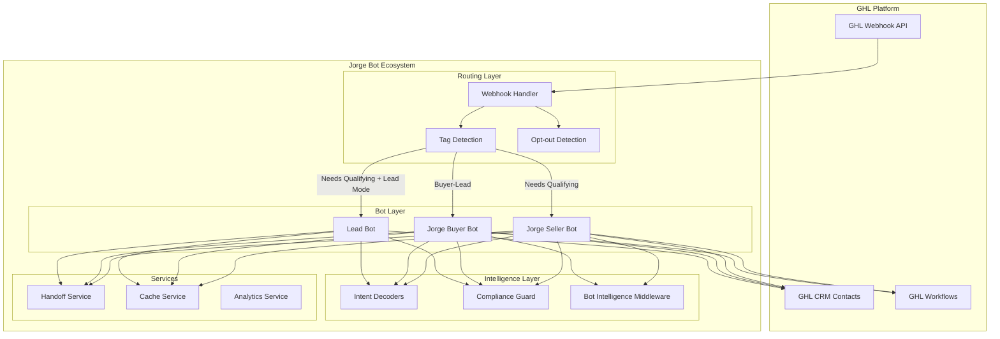

# Jorge Bots Comprehensive Development Specification

**Version**: 2.0  
**Date**: 2026-02-06  
**Status**: Draft - For Review  
**Scope**: Jorge Lead Buyer & Seller Bot Continuation Development

---

## Table of Contents

1. [Executive Summary](#1-executive-summary)
2. [Current State Assessment](#2-current-state-assessment)
3. [Architecture Overview](#3-architecture-overview)
4. [Gap Analysis](#4-gap-analysis)
5. [Development Roadmap](#5-development-roadmap)
6. [Technical Specifications](#6-technical-specifications)
7. [Integration Requirements](#7-integration-requirements)
8. [Testing Strategy](#8-testing-strategy)
9. [Deployment Plan](#9-deployment-plan)
10. [Risk Mitigation](#10-risk-mitigation)

---

## 1. Executive Summary

### 1.1 Project Overview

The Jorge Bot Ecosystem consists of three AI-powered real estate conversational agents designed to qualify and convert leads in the Rancho Cucamonga market:

| Bot | Purpose | Entry Point | Status |
|-----|---------|-------------|--------|
| **Jorge Seller Bot** | Motivated seller qualification & stall-breaking | [`JorgeSellerBot.process_seller_response()`](ghl_real_estate_ai/agents/jorge_seller_bot.py:1956) | ✅ Production-ready |
| **Jorge Buyer Bot** | Buyer qualification & serious buyer identification | [`JorgeBuyerBot.process_buyer_conversation()`](ghl_real_estate_ai/agents/jorge_buyer_bot.py:1422) | ✅ Production-ready |
| **Lead Bot** | General lead qualification & nurturing | [`ConversationManager.generate_response()`](ghl_real_estate_ai/agents/lead_bot.py:2355) | ⚠️ Needs routing config |

### 1.2 Current Metrics

| Metric | Value | Source |
|--------|-------|--------|
| Seller Bot Tests | 64 passing | [JORGE_FINALIZATION_SPEC.md](docs/JORGE_FINALIZATION_SPEC.md:6) |
| Buyer Bot Tests | 50 passing | [JORGE_FINALIZATION_SPEC.md](docs/JORGE_FINALIZATION_SPEC.md:6) |
| Lead Bot Tests | 14 passing | [JORGE_FINALIZATION_SPEC.md](docs/JORGE_FINALIZATION_SPEC.md:6) |
| Bot Intelligence Middleware | Phase 3.3 | [`bot_intelligence_middleware`](ghl_real_estate_ai/services/bot_intelligence_middleware.py) |
| Response Time Target | <42ms | [`performance_monitor.py:612`](ghl_real_estate_ai/services/performance_monitor.py:612) |

### 1.3 Strategic Goals

1. **Complete Phase 1**: Lead Bot routing & compliance configuration
2. **Complete Phase 2**: Configurable GHL IDs with validation
3. **Implement Phase 3**: Cross-bot handoff service
4. **Enhance Phase 4**: Real MLS data integration
5. **Validate Phase 5**: Integration tests & load testing

---

## 2. Current State Assessment

### 2.1 Jorge Seller Bot ([`jorge_seller_bot.py`](ghl_real_estate_ai/agents/jorge_seller_bot.py))

**Architecture**: LangGraph-based StateGraph workflow with 6 nodes

```
┌─────────────────────┐
│   analyze_intent    │
└─────────┬───────────┘
          │
┌─────────▼───────────┐
│ gather_intelligence │  (optional Phase 3.3)
└─────────┬───────────┘
          │
┌─────────▼───────────┐
│    detect_stall     │
└─────────┬───────────┘
          │
┌─────────▼───────────┐
│   select_strategy   │
└─────────┬───────────┘
          │
    ┌─────┴─────┐
    │           │
┌───▼───┐  ┌────▼────┐
│respond│  │follow_up│
└───┬───┘  └────┬────┘
    │           │
    └─────┬─────┘
          │
          ▼
         END
```

**Key Features Implemented**:
- ✅ FRS (Financial Readiness Score) & PCS (Psychological Commitment Score)
- ✅ Adaptive questioning engine with conversation memory
- ✅ Progressive skills manager (68% token reduction)
- ✅ Bot intelligence middleware integration
- ✅ Event publishing for monitoring
- ✅ Feature flags for optional enhancements

**Feature Configuration**:
```python
JorgeFeatureConfig(
    enable_progressive_skills=True,
    enable_agent_mesh=False,
    enable_mcp_integration=False,
    enable_adaptive_questioning=True,
    enable_track3_intelligence=True,
    enable_bot_intelligence=True,
    sla_response_time=15,  # seconds
    commission_rate=0.06
)
```

### 2.2 Jorge Buyer Bot ([`jorge_buyer_bot.py`](ghl_real_estate_ai/agents/jorge_buyer_bot.py))

**Architecture**: LangGraph-based workflow with 6 nodes (mirrors seller pattern)

```
┌─────────────────────────┐
│   analyze_buyer_intent  │
└───────────┬─────────────┘
            │
┌───────────▼───────────────┐
│   gather_buyer_intelligence │  (optional Phase 3.3)
└───────────┬───────────────┘
            │
┌───────────▼───────────────┐
│ assess_financial_readiness│
└───────────┬───────────────┘
            │
┌───────────▼───────────────┐
│  qualify_property_needs   │
└───────────┬───────────────┘
            │
┌───────────▼───────────────┐
│     match_properties      │
└───────────┬───────────────┘
            │
    ┌───────┴───────┐
    │               │
┌───▼───┐    ┌─────▼─────┐
│respond│    │  schedule  │
└───┬───┘    └─────┬─────┘
    │               │
    └───────┬───────┘
            │
            ▼
           END
```

**Buyer Qualification Pillars**:
1. **Financial Readiness** (40% weight) - Pre-approval, budget clarity, financing status
2. **Urgency & Motivation** (35% weight) - Timeline, consequences awareness, urgency signals
3. **Property Preferences** (25% weight) - Decision authority, market realism, preference clarity

**Key Features Implemented**:
- ✅ Buyer intent decoder with 12 scoring dimensions
- ✅ Financial readiness assessment
- ✅ Property matching integration
- ✅ Retry mechanism with exponential backoff
- ✅ Compliance validation (Fair Housing, DRE)
- ✅ Temperature prediction (hot/warm/lukewarm/cold/ice_cold)

### 2.3 Lead Bot ([`lead_bot.py`](ghl_real_estate_ai/agents/lead_bot.py))

**Components**:
- ✅ `LeadBotWorkflow` - Main workflow orchestrator
- ✅ `BehavioralAnalyticsEngine` - Response pattern analysis
- ✅ `PersonalityAdapter` - Message personalization
- ✅ `TemperaturePredictionEngine` - Lead temperature trends
- ✅ `TTLLRUCache` - Thread-safe caching

**Current Issues**:
- ❌ No explicit activation tag (relies on fallback)
- ❌ No mode flag (`JORGE_LEAD_MODE`)
- ❌ No compliance guard integration
- ❌ No temperature classification events

---

## 3. Architecture Overview

### 3.1 Webhook Routing Flow

```
Incoming GHL Webhook (POST /ghl/webhook)
    │
    ├─ Loopback check: outbound messages ignored
    │
    ├─ Activation tag check
    │   activation_tags from settings + buyer tag
    │   deactivation_tags: ["AI-Off", "Qualified", "Stop-Bot", "AI-Qualified"]
    │
    ├─ Opt-out detection
    │   OPT_OUT_PHRASES: "stop", "unsubscribe", "not interested"
    │
    ├─ [PRIORITY 1] SELLER ROUTING
    │   Condition: "Needs Qualifying" in tags AND JORGE_SELLER_MODE=true
    │   Bot: JorgeSellerEngine.process_seller_response()
    │   Tags: Hot-Seller, Warm-Seller, Cold-Seller
    │
    ├─ [PRIORITY 2] BUYER ROUTING
    │   Condition: BUYER_ACTIVATION_TAG in tags AND JORGE_BUYER_MODE=true
    │   Bot: JorgeBuyerBot.process_buyer_conversation()
    │   Tags: Hot-Buyer, Warm-Buyer, Cold-Buyer, Buyer-Qualified
    │
    ├─ [PRIORITY 3] LEAD ROUTING (MISSING - Phase 1)
    │   Condition: LEAD_ACTIVATION_TAG in tags AND JORGE_LEAD_MODE=true
    │   Bot: ConversationManager
    │   Compliance: audit_message() with lead fallback
    │   Tags: Hot-Lead, Warm-Lead, Cold-Lead
    │
    └─ [PRIORITY 4] DEFAULT FALLBACK
        Raw response without bot routing
```

### 3.2 State Models

#### JorgeSellerState ([`seller_bot_state.py`](ghl_real_estate_ai/models/seller_bot_state.py))

```python
class JorgeSellerState(TypedDict):
    lead_id: str
    lead_name: str
    property_address: Optional[str]
    conversation_history: List[Dict[str, str]]
    intent_profile: Optional[LeadIntentProfile]
    
    # Bot Logic
    current_tone: str  # "direct", "confrontational", "take-away"
    stall_detected: bool
    detected_stall_type: Optional[str]  # "thinking", "get_back", "zestimate", "agent"
    
    # Decisions
    next_action: str
    response_content: str
    
    # Metrics
    psychological_commitment: float
    is_qualified: bool
    
    # Journey Tracking
    current_journey_stage: str
    follow_up_count: int
    last_action_timestamp: Optional[datetime]
```

#### BuyerBotState ([`buyer_bot_state.py`](ghl_real_estate_ai/models/buyer_bot_state.py))

```python
class BuyerBotState(TypedDict):
    buyer_id: str
    buyer_name: str
    target_areas: Optional[List[str]]
    conversation_history: List[Dict[str, str]]
    intent_profile: Optional[BuyerIntentProfile]
    
    # Buyer-Specific Context
    budget_range: Optional[Dict[str, int]]
    financing_status: str  # "pre_approved", "needs_approval", "cash", "unknown"
    urgency_level: str
    property_preferences: Optional[Dict[str, Any]]
    
    # Bot Logic
    current_qualification_step: str
    objection_detected: bool
    detected_objection_type: Optional[str]
    
    # Decisions
    next_action: str
    response_content: str
    matched_properties: List[Dict[str, Any]]
    
    # Metrics
    financial_readiness_score: float
    buying_motivation_score: float
    is_qualified: bool
```

### 3.3 Intent Decoders

#### LeadIntentDecoder ([`intent_decoder.py`](ghl_real_estate_ai/agents/intent_decoder.py))

**Scoring Components**:
- **FRS (Financial Readiness Score)** - 0-100 scale
  - Motivation (35%): High/mixed/low intent markers
  - Timeline (30%): Immediate/vague/flexible commitment
  - Condition (20%): Realistic/unrealistic expectations
  - Price (15%): Price-aware/flexible indicators

- **PCS (Psychological Commitment Score)** - 0-100 scale
  - Response velocity (20%)
  - Message length (15%)
  - Question depth (20%)
  - Objection handling (25%)
  - Call acceptance (20%)

#### BuyerIntentDecoder ([`buyer_intent_decoder.py`](ghl_real_estate_ai/agents/buyer_intent_decoder.py))

**Scoring Components**:
- Financial Readiness (40% weight)
  - Financial readiness score
  - Budget clarity score
  - Financing status score

- Urgency & Motivation (35% weight)
  - Urgency score
  - Timeline pressure
  - Consequence awareness

- Property Preferences (25% weight)
  - Preference clarity
  - Market realism
  - Decision authority

---

## 4. Gap Analysis

### 4.1 Phase 1 Gaps: Lead Bot Routing & Compliance

| Gap | Current State | Required State | Priority |
|-----|---------------|---------------|----------|
| Lead activation tag | No explicit tag | Add `LEAD_ACTIVATION_TAG` env var | HIGH |
| Lead mode flag | Defaults to fallback | Add `JORGE_LEAD_MODE=true` env var | HIGH |
| Compliance guard | Not integrated | Add `audit_message()` call | HIGH |
| Temperature tags | Not published | Publish Hot/Warm/Cold-Lead | MEDIUM |
| Lead routing block | Missing in webhook.py | Add routing between buyer & fallback | HIGH |

### 4.2 Phase 2 Gaps: Configurable GHL IDs

| Gap | Current State | Required State | Priority |
|-----|---------------|---------------|----------|
| Workflow IDs | Placeholder strings | Empty strings + env var fallback | HIGH |
| Custom field IDs | Placeholder strings | Empty strings + env var fallback | HIGH |
| Startup validation | None | Add `validate_ghl_integration()` | MEDIUM |
| Buyer workflow IDs | Missing | Add HOT/WARM_BUYER_WORKFLOW_ID | MEDIUM |
| Documentation | Placeholder comments | Clear UUID documentation | LOW |

### 4.3 Phase 3 Gaps: Cross-Bot Handoff

| Gap | Current State | Required State | Priority |
|-----|---------------|---------------|----------|
| Handoff service | Does not exist | Create `handoff_service.py` | HIGH |
| Tag-based handoff | Not implemented | Remove source tag, add target tag | HIGH |
| Handoff tracking | Missing tag | Add "Handoff-X-to-Y" tracking tag | MEDIUM |
| Analytics integration | Not integrated | Track handoff events | MEDIUM |
| Bot return contract | No handoff signals | Add `handoff_signals` key | HIGH |

### 4.4 Phase 4 Gaps: MLS Data Integration

| Gap | Current State | Required State | Priority |
|-----|---------------|---------------|----------|
| Property data | Mock data | Real MLS API integration | MEDIUM |
| Market comparables | Static | Dynamic CMA generation | MEDIUM |
| Valuation estimates | Placeholder | Integration with real estate APIs | LOW |
| Inventory sync | None | MLS listing cache | LOW |

### 4.5 Phase 5 Gaps: Testing & Load Testing

| Gap | Current State | Required State | Priority |
|-----|---------------|---------------|----------|
| Lead routing tests | None (9 tests planned) | Add test suite | HIGH |
| Config validation tests | None (7 tests planned) | Add test suite | MEDIUM |
| Handoff service tests | None (7 tests planned) | Add test suite | HIGH |
| Load testing | None | Add k6/load tests | MEDIUM |
| Integration tests | Partial | Complete E2E tests | MEDIUM |

---

## 5. Development Roadmap

### 5.1 Phase 1: Lead Bot Routing & Compliance (Week 1)

#### Tasks

**1.1 Add Lead Bot Configuration** ([`jorge_config.py`](ghl_real_estate_ai/ghl_utils/jorge_config.py))
```python
# Add to JorgeEnvironmentSettings.__init__()
self.jorge_lead_mode = os.getenv("JORGE_LEAD_MODE", "true").lower() == "true"
self.lead_activation_tag = os.getenv("LEAD_ACTIVATION_TAG", "Needs Qualifying")

# Add compatibility properties
@property
def JORGE_LEAD_MODE(self) -> bool:
    return self.jorge_lead_mode

@property
def LEAD_ACTIVATION_TAG(self) -> str:
    return self.lead_activation_tag
```

**1.2 Add Lead Bot Routing Block** ([`webhook.py`](ghl_real_estate_ai/webhooks/webhook.py))
```
Insert between buyer routing (line 461) and current fallback:
+-- LEAD BOT ROUTING
    Condition: LEAD_ACTIVATION_TAG in tags
               AND JORGE_LEAD_MODE=true
               AND NOT seller mode matched
               AND NOT buyer mode matched
    Bot: ConversationManager
    Compliance: audit_message() with lead fallback
    Tags: Hot-Lead, Warm-Lead, Cold-Lead
```

**1.3 Update Environment Configuration**
- Add to `.env.example`:
  ```bash
  JORGE_LEAD_MODE=true
  LEAD_ACTIVATION_TAG=Needs Qualifying
  ```
- Add to `railway.jorge.toml`:
  ```toml
  JORGE_LEAD_MODE = "true"
  ```

**1.4 Add Compliance Guard for Lead Bot**
```python
status, reason, violations = await compliance_guard.audit_message(
    ai_response,
    contact_context={"contact_id": contact_id, "mode": "lead"}
)
if status == ComplianceStatus.BLOCKED:
    ai_response = "Thanks for reaching out! I'd love to help. What are you looking for?"
    actions.append(GHLAction(type=ActionType.ADD_TAG, tag="Compliance-Alert"))
```

**1.5 Lead Routing Tests** (9 tests)
| Test | Description |
|------|-------------|
| `test_lead_mode_activates_with_needs_qualifying_tag` | Lead bot processes when tag present + mode=true |
| `test_seller_mode_takes_priority_over_lead` | "Needs Qualifying" routes to seller when JORGE_SELLER_MODE=true |
| `test_lead_mode_respects_deactivation_tags` | AI-Off blocks lead routing |
| `test_lead_mode_disabled_skips_to_fallback` | JORGE_LEAD_MODE=false skips routing |
| `test_lead_mode_adds_temperature_tag` | Hot-Lead/Warm-Lead/Cold-Lead applied |
| `test_lead_mode_sms_guard_truncates` | Response truncated at 320 chars |
| `test_lead_mode_compliance_blocks_bad_message` | Compliance replaces blocked content |
| `test_lead_mode_error_falls_through` | Error doesn't crash webhook |
| `test_buyer_lead_tag_does_not_route_to_lead_bot` | "Buyer-Lead" tag goes to buyer, not lead |

### 5.2 Phase 2: Configurable GHL IDs (Week 2)

#### Tasks

**2.1 Update Workflow IDs** ([`jorge_config.py`](ghl_real_estate_ai/ghl_utils/jorge_config.py))
```python
# Change from placeholder to empty string
HOT_SELLER_WORKFLOW_ID = ""  # Set via HOT_SELLER_WORKFLOW_ID env var
WARM_SELLER_WORKFLOW_ID = ""  # Set via WARM_SELLER_WORKFLOW_ID env var
AGENT_NOTIFICATION_WORKFLOW = ""  # Set via NOTIFY_AGENT_WORKFLOW_ID env var
```

**2.2 Update Custom Field IDs**
```python
# Change all CUSTOM_FIELDS entries to empty strings
CUSTOM_FIELDS = {
    "LEAD_SCORE": "",  # CUSTOM_FIELD_LEAD_SCORE
    "SELLER_TEMPERATURE": "",  # CUSTOM_FIELD_SELLER_TEMPERATURE
    # ... all others
}
```

**2.3 Add Startup Validation**
```python
def validate_ghl_integration(self) -> List[str]:
    """Return warnings for missing GHL configuration."""
    warnings = []
    if self.jorge_seller_mode:
        if not os.getenv("HOT_SELLER_WORKFLOW_ID"):
            warnings.append("HOT_SELLER_WORKFLOW_ID not set — hot seller workflows disabled")
        if not os.getenv("WARM_SELLER_WORKFLOW_ID"):
            warnings.append("WARM_SELLER_WORKFLOW_ID not set — warm seller workflows disabled")
    if self.jorge_buyer_mode:
        if not os.getenv("HOT_BUYER_WORKFLOW_ID"):
            warnings.append("HOT_BUYER_WORKFLOW_ID not set — hot buyer workflows disabled")
    # Check critical custom fields
    critical_fields = ["LEAD_SCORE", "SELLER_TEMPERATURE", "BUDGET"]
    for field in critical_fields:
        if not os.getenv(f"CUSTOM_FIELD_{field}"):
            warnings.append(f"CUSTOM_FIELD_{field} not set")
    return warnings
```

**2.4 Add Buyer Workflow IDs**
```python
# Add to JorgeEnvironmentSettings.__init__()
self.hot_buyer_workflow_id = os.getenv("HOT_BUYER_WORKFLOW_ID")
self.warm_buyer_workflow_id = os.getenv("WARM_BUYER_WORKFLOW_ID")
```

**2.5 Config Validation Tests** (7 tests)
| Test | Description |
|------|-------------|
| `test_validate_warns_on_missing_workflow_ids` | validate_ghl_integration() returns warnings |
| `test_validate_clean_when_all_set` | No warnings when all env vars present |
| `test_get_workflow_id_returns_env_over_default` | Env var takes priority |
| `test_get_workflow_id_returns_none_when_empty` | Empty default + no env var = None |
| `test_get_custom_field_id_env_override` | CUSTOM_FIELD_X env var overrides |
| `test_get_custom_field_id_fallback` | Returns semantic name when unset |
| `test_seller_mode_disabled_skips_seller_validation` | No seller warnings when disabled |

### 5.3 Phase 3: Cross-Bot Handoff (Week 3)

#### Tasks

**3.1 Create Handoff Service** ([`services/jorge_handoff_service.py`](ghl_real_estate_ai/services/jorge_handoff_service.py))

```python
class HandoffDecision:
    source_bot: str          # "lead", "buyer", "seller"
    target_bot: str          # "lead", "buyer", "seller"
    reason: str              # "buyer_intent_detected", "seller_intent_detected"
    confidence: float        # 0.0-1.0
    context: Dict[str, Any]  # Conversation context to preserve

class JorgeHandoffService:
    TAG_MAP = {
        "lead": "Needs Qualifying",
        "buyer": "Buyer-Lead",
        "seller": "Needs Qualifying",
    }
    
    async def evaluate_handoff(
        self,
        current_bot: str,
        contact_id: str,
        conversation_history: List[Dict],
        intent_signals: Dict[str, Any]
    ) -> Optional[HandoffDecision]:
        """Evaluate whether a handoff is needed."""
        
    async def execute_handoff(
        self,
        decision: HandoffDecision,
        contact_id: str,
        ghl_client: GHLClient
    ) -> List[GHLAction]:
        """Generate GHL actions to execute the handoff."""
```

**3.2 Intent Signal Detection Rules**

| Current Bot | Signal | Target Bot | Confidence Threshold |
|-------------|--------|------------|---------------------|
| Lead | "I want to buy", budget mention, pre-approval | Buyer | 0.7 |
| Lead | "Sell my house", "what's my home worth", CMA request | Seller | 0.7 |
| Buyer | "Actually I need to sell first", "sell before buying" | Seller | 0.8 |
| Seller | "Also looking to buy", "need to find a new place" | Buyer | 0.6 |

**3.3 Integrate Handoff Actions** ([`webhook.py`](ghl_real_estate_ai/webhooks/webhook.py))
```python
# After seller response processing
if seller_result.get("handoff_signals"):
    handoff = await handoff_service.evaluate_handoff(
        current_bot="seller", contact_id=contact_id,
        conversation_history=history, intent_signals=seller_result["handoff_signals"]
    )
    if handoff:
        actions.extend(await handoff_service.execute_handoff(handoff, contact_id, ghl_client))
```

**3.4 Extend Bot Return Contract**
```python
{
    # ... existing fields ...
    "handoff_signals": {
        "buyer_intent_score": 0.85,
        "seller_intent_score": 0.1,
        "detected_intent_phrases": ["looking to buy", "budget around 600k"]
    }
}
```

**3.5 Handoff Service Tests** (7 tests)
| Test | Description |
|------|-------------|
| `test_lead_to_buyer_handoff_on_buyer_intent` | Buyer intent score >0.7 triggers handoff |
| `test_lead_to_seller_handoff_on_seller_intent` | Seller intent phrases trigger handoff |
| `test_no_handoff_below_confidence_threshold` | Score 0.5 does not trigger |
| `test_handoff_generates_correct_tag_swap` | Removes source tag, adds target tag |
| `test_handoff_adds_tracking_tag` | "Handoff-Lead-to-Buyer" tag present |
| `test_handoff_logs_analytics_event` | analytics_service.track_event called |
| `test_seller_to_buyer_handoff` | Cross-direction handoff works |

### 5.4 Phase 4: MLS Data Integration (Week 4-5)

#### Tasks

**4.1 MLS API Integration**
- Research and integrate MLS data provider (CRMLS, etc.)
- Create MLS client service
- Implement property search and comparables

**4.2 Dynamic CMA Generation**
- Connect CMA generator to real data
- Implement property valuation algorithms
- Add neighborhood analytics

**4.3 Inventory Caching**
- Implement Redis cache for listings
- Add cache invalidation logic
- Create background sync job

### 5.5 Phase 5: Testing & Load Testing (Week 6)

#### Tasks

**5.1 Integration Tests**
- Complete E2E test suite
- Add webhook integration tests
- Create GHL API mock tests

**5.2 Load Testing**
- Set up k6 load tests
- Test concurrent bot instances
- Validate response time targets (<42ms P95)

**5.3 Performance Benchmarking**
- Profile bot workflows
- Identify bottlenecks
- Optimize critical paths

---

## 6. Technical Specifications

### 6.1 Feature Flag System

```python
@dataclass
class JorgeFeatureConfig:
    # Core flags
    enable_track3_intelligence: bool = True
    
    # Optional enhancements
    enable_progressive_skills: bool = False
    enable_agent_mesh: bool = False
    enable_mcp_integration: bool = False
    enable_adaptive_questioning: bool = True
    enable_bot_intelligence: bool = True
    
    # Performance settings
    max_concurrent_tasks: int = 5
    sla_response_time: int = 15  # seconds
    cost_per_token: float = 0.000015
```

### 6.2 Compliance Guard Architecture

```
┌─────────────────────────────────────────────────────────┐
│                  Compliance Guard                       │
├─────────────────────────────────────────────────────────┤
│ Tier 0: Input Length Guard                             │
│   - Block messages >10,000 chars                        │
├─────────────────────────────────────────────────────────┤
│ Tier 1: Regex Pattern Matching                          │
│   - Protected keywords: race, religion, familial status  │
├─────────────────────────────────────────────────────────┤
│ Tier 2: LLM Cognitive Audit                            │
│   - Claude Haiku for steering, discrimination, tone     │
├─────────────────────────────────────────────────────────┤
│ Returns: (status, reason, violations)                  │
│   - PASSED, FLAGGED, or BLOCKED                        │
└─────────────────────────────────────────────────────────┘
```

### 6.3 Cache Strategy

**Redis Cache Layers**:
| Layer | TTL | Purpose |
|-------|-----|---------|
| L1 | 5 min | Bot conversation state |
| L2 | 1 hour | Lead scores & profiles |
| L3 | 24 hours | Market data, property matches |

**TTLLRUCache** (in-memory):
```python
class TTLLRUCache:
    max_entries: int = 1000
    ttl_seconds: int = 3600  # 60 minutes
```

### 6.4 Event Publishing

| Event Type | Publisher Method | Subscribers |
|------------|------------------|-------------|
| Bot status update | `publish_bot_status_update()` | Dashboard, monitoring |
| Qualification progress | `publish_jorge_qualification_progress()` | Analytics |
| Buyer intent analysis | `publish_buyer_intent_analysis()` | CRM, analytics |
| Conversation update | `publish_conversation_update()` | Dashboard |

---

## 7. Integration Requirements

### 7.1 GHL Integration Points

| Integration | Method | Required |
|-------------|--------|----------|
| Webhook endpoint | `POST /ghl/webhook` | ✅ Required |
| Contact tags | GHL API `PUT /contacts/{id}/tags` | ✅ Required |
| Custom fields | GHL API `PUT /contacts/{id}/custom` | ✅ Required |
| Workflows | GHL API triggers | ⚠️ Optional |
| SMS/Messaging | GHL API `POST /conversations` | ✅ Required |

### 7.2 Environment Variables

#### Required
```bash
# Bot Mode Flags
JORGE_SELLER_MODE=true
JORGE_BUYER_MODE=true
JORGE_LEAD_MODE=true

# Activation Tags
SELLER_ACTIVATION_TAG=Needs Qualifying
BUYER_ACTIVATION_TAG=Buyer-Lead
LEAD_ACTIVATION_TAG=Needs Qualifying
DEACTIVATION_TAGS=["AI-Off","Qualified","Stop-Bot","AI-Qualified"]
```

#### GHL IDs (Required for Full Automation)
```bash
# Workflow IDs
HOT_SELLER_WORKFLOW_ID=
WARM_SELLER_WORKFLOW_ID=
HOT_BUYER_WORKFLOW_ID=
WARM_BUYER_WORKFLOW_ID=
NOTIFY_AGENT_WORKFLOW_ID=

# Custom Field IDs
CUSTOM_FIELD_LEAD_SCORE=
CUSTOM_FIELD_BUDGET=
CUSTOM_FIELD_LOCATION=
CUSTOM_FIELD_TIMELINE=
CUSTOM_FIELD_SELLER_TEMPERATURE=
CUSTOM_FIELD_SELLER_MOTIVATION=
CUSTOM_FIELD_BUYER_TEMPERATURE=
```

### 7.3 Claude AI Configuration

```python
# Token costs (for tracking)
COST_PER_TOKEN = 0.000015  # Claude 3.5 Sonnet
CONTEXT_WINDOW = 200000  # tokens
OUTPUT_LIMIT = 4096  # tokens
```

---

## 8. Testing Strategy

### 8.1 Test Pyramid

```
                    ┌─────────────┐
                    │   E2E      │  (10% - Critical paths)
                   ┌┴─────────────┴┐
                   │  Integration │  (30% - API interactions)
                  ┌┴───────────────┴┐
                  │    Unit Tests   │  (60% - Individual components)
                 └─────────────────┘
```

### 8.2 Test Coverage Requirements

| Component | Current Coverage | Target |
|-----------|-----------------|--------|
| Seller Bot | 64 tests | 80 tests |
| Buyer Bot | 50 tests | 75 tests |
| Lead Bot | 14 tests | 60 tests |
| Intent Decoders | Partial | 90% |
| Handoff Service | 0 tests | 30 tests |
| Config Validation | 0 tests | 20 tests |

### 8.3 Key Test Scenarios

#### Critical Path Tests
1. Seller bot hot lead → immediate response
2. Seller bot warm lead → nurture sequence
3. Buyer bot pre-approved → property matching
4. Lead bot opt-out → tag removal
5. Compliance violation → message blocking
6. Handoff trigger → tag swap

#### Edge Case Tests
1. Empty conversation history
2. Very long messages (>320 chars SMS)
3. Multiple rapid messages
4. GHL API failures (retry with backoff)
5. Cache miss → full recomputation

---

## 9. Deployment Plan

### 9.1 Deployment Strategy

**Blue-Green Deployment**:
1. Deploy to staging environment
2. Run integration tests
3. Traffic switch to new version
4. Monitor for 15 minutes
5. Rollback if error rate > 1%

### 9.2 Rollback Procedure

```bash
# Immediate rollback
git checkout PREVIOUS_COMMIT
docker-compose -f docker-compose.service6.yml up -d

# Verify health
curl https://api.example.com/health
```

### 9.3 Monitoring During Deployment

| Metric | Alert Threshold | Action |
|--------|-----------------|--------|
| P95 Response Time | >100ms | Investigate |
| Error Rate | >1% | Page on-call |
| Bot Success Rate | <95% | Review logs |
| Cache Hit Rate | <80% | Tune TTL |

---

## 10. Risk Mitigation

### 10.1 Technical Risks

| Risk | Probability | Impact | Mitigation |
|------|-------------|--------|------------|
| GHL API changes | Medium | High | Versioned API wrapper, feature flags |
| Claude API rate limits | Low | High | Token tracking, batching |
| Cache consistency | Medium | Medium | TTL tuning, invalidation webhooks |
| Memory leaks | Low | High | Monitoring, auto-restart policies |

### 10.2 Operational Risks

| Risk | Probability | Impact | Mitigation |
|------|-------------|--------|------------|
| Bot misroutes leads | Low | High | Comprehensive routing tests |
| Compliance violations | Low | Critical | Mandatory compliance guard |
| Poor lead quality | Medium | Medium | Continuous score calibration |

### 10.3 Rollback Triggers

| Trigger | Threshold | Action |
|---------|-----------|--------|
| Error rate spike | >2% for 5 min | Auto-rollback |
| P99 latency | >500ms | Investigate, rollback if persistent |
| Customer complaints | >5 in 1 hour | Immediate rollback |

---

## Appendix A: File Reference Index

| File | Purpose | Status |
|------|---------|--------|
| [`ghl_real_estate_ai/agents/jorge_seller_bot.py`](ghl_real_estate_ai/agents/jorge_seller_bot.py) | Seller bot implementation | ✅ Complete |
| [`ghl_real_estate_ai/agents/jorge_buyer_bot.py`](ghl_real_estate_ai/agents/jorge_buyer_bot.py) | Buyer bot implementation | ✅ Complete |
| [`ghl_real_estate_ai/agents/lead_bot.py`](ghl_real_estate_ai/agents/lead_bot.py) | Lead bot implementation | ⚠️ Needs config |
| [`ghl_real_estate_ai/agents/intent_decoder.py`](ghl_real_estate_ai/agents/intent_decoder.py) | Lead intent scoring | ✅ Complete |
| [`ghl_real_estate_ai/agents/buyer_intent_decoder.py`](ghl_real_estate_ai/agents/buyer_intent_decoder.py) | Buyer intent scoring | ✅ Complete |
| [`ghl_real_estate_ai/models/seller_bot_state.py`](ghl_real_estate_ai/models/seller_bot_state.py) | Seller state definition | ✅ Complete |
| [`ghl_real_estate_ai/models/buyer_bot_state.py`](ghl_real_estate_ai/models/buyer_bot_state.py) | Buyer state definition | ✅ Complete |
| [`ghl_real_estate_ai/ghl_utils/jorge_config.py`](ghl_real_estate_ai/ghl_utils/jorge_config.py) | Configuration management | ⚠️ Needs updates |
| [`ghl_real_estate_ai/webhooks/webhook.py`](ghl_real_estate_ai/webhooks/webhook.py) | Webhook routing | ⚠️ Needs Lead block |
| [`ghl_real_estate_ai/services/bot_intelligence_middleware.py`](ghl_real_estate_ai/services/bot_intelligence_middleware.py) | Intelligence integration | ✅ Complete |
| [`ghl_real_estate_ai/services/compliance_guard.py`](ghl_real_estate_ai/services/compliance_guard.py) | Compliance validation | ✅ Complete |

---

## Appendix B: Mermaid Architecture Diagram



---

**Document Version**: 2.0  
**Last Updated**: 2026-02-06  
**Next Review**: After Phase 1 completion
