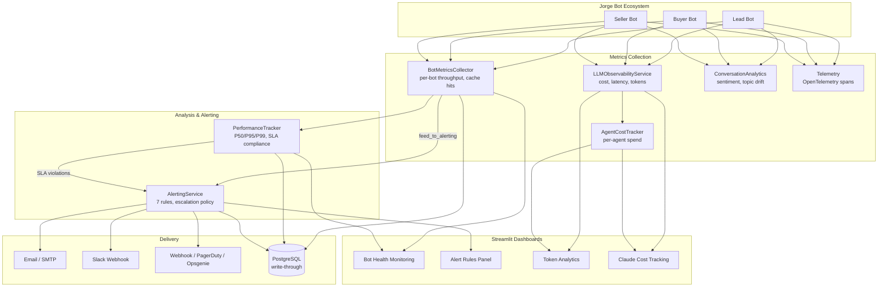

# Observability & Analytics Infrastructure

EnterpriseHub provides a multi-layered observability stack that traces every LLM call, monitors bot performance, and alerts on threshold breaches -- all feeding into Streamlit dashboards for real-time visibility.

## Architecture



## LLM Call Tracing

**Service**: [`ghl_real_estate_ai/services/llm_observability.py`](../ghl_real_estate_ai/services/llm_observability.py)

`LLMObservabilityService` records every LLM call as an `LLMTrace` dataclass with:

| Field | Type | Description |
|-------|------|-------------|
| `trace_id` | `str` | Unique identifier for the call |
| `model` | `str` | Model name (e.g., `claude-opus-4-6`, `gemini-pro`) |
| `provider` | `str` | Provider name (Anthropic, Google, etc.) |
| `input_tokens` | `int` | Prompt tokens consumed |
| `output_tokens` | `int` | Completion tokens generated |
| `latency_ms` | `float` | End-to-end call duration |
| `cache_hit` | `bool` | Whether L1/L2/L3 cache served the response |
| `cost_usd` | `float` | Calculated dollar cost for this call |
| `conversation_id` | `str` | Links traces to conversation sessions |

### Cost Tracking

Costs are aggregated by two dimensions:

- **`cost_by_model()`** -- Total spend per model (e.g., Claude vs Gemini).
- **`cost_by_conversation()`** -- Total spend per conversation session.

The `ObservabilityDashboard` dataclass provides a single-call summary including `total_cost_usd`, `avg_cost_per_request`, `cache_hit_rate`, and `requests_per_minute`.

### Latency Histograms

`latency_report(model=None)` returns a `LatencyReport` with:

- **P50, P95, P99** percentiles (linear interpolation)
- **Mean, min, max** and sample count
- Optional model filter to isolate per-provider latency

### SLA & Alert Checks

- **`sla_compliance(target_p95_ms=2000.0)`** -- Returns `True` if P95 is within target.
- **`alert_check(error_rate_threshold=0.1, p95_threshold_ms=5000.0)`** -- Returns a list of human-readable alert strings when thresholds are breached.
- **`error_rate(window_seconds=300)`** -- Rolling 5-minute error rate.

### Agent Cost Tracker

**Service**: [`ghl_real_estate_ai/services/agent_cost_tracker.py`](../ghl_real_estate_ai/services/agent_cost_tracker.py)

`DecisionCostTracker` provides per-agent cost attribution:

- **`record()`** -- Records a `DecisionCost` (agent name, decision type, tokens, cost, latency).
- **`report()`** -- Generates a `CostReport` with per-agent summaries, anomaly detection, and efficiency rankings.
- **Anomaly detection** -- Z-score based outlier identification for cost spikes.

## Conversation Analytics

**Service**: [`ghl_real_estate_ai/services/conversation_analytics.py`](../ghl_real_estate_ai/services/conversation_analytics.py)

`ConversationAnalytics` analyzes message-level quality and engagement.

### Sentiment Analysis

Word-list-based scoring with 70 positive and 60 negative real estate-relevant terms.

- **`sentiment_trajectory(messages)`** -- Returns per-message scores, overall average, and trend (`improving` / `declining` / `stable`). Trend is computed by comparing first-half vs second-half averages (threshold: +/-0.1).

### Topic Drift Detection

- **`detect_topic_drift(messages)`** -- TF-IDF cosine similarity between first and second halves of the conversation. Returns a 0-1 drift score (0 = same topic, 1 = completely different). Falls back to Jaccard word overlap if TF-IDF fails.

### Engagement Scoring

`engagement_score(messages)` is a weighted composite:

| Factor | Weight | Measurement |
|--------|--------|-------------|
| Message length | 40% | Average user message length, capped at 100 chars |
| Question frequency | 30% | Proportion of user messages containing `?` |
| Participation ratio | 30% | User messages / total messages, capped at 0.6 |

### Resolution Detection

Pattern-matched against the last 3 messages using 10 regex patterns: "thank you", "goodbye", "appreciate", "helpful", "perfect", "scheduled", "great help", "that's all".

### Handoff Effectiveness

`handoff_effectiveness(conversations, handoff_indices)` measures post-handoff quality:

- **Successful resolutions** -- How many handoffs led to resolution detection.
- **Average messages after handoff** -- Conversation length post-transition.
- **Effectiveness rate** -- Ratio of successful resolutions to total handoffs.

### Quality Score

`quality_score(messages)` is a 0-1 composite:

- 25% normalized sentiment
- 25% engagement score
- 25% topic coherence (1 - drift)
- 20% resolution bonus
- 5% baseline

## Performance Monitoring

**Service**: [`ghl_real_estate_ai/services/jorge/performance_tracker.py`](../ghl_real_estate_ai/services/jorge/performance_tracker.py)

`PerformanceTracker` is a thread-safe singleton with rolling-window storage for all Jorge bot operations.

### Rolling Windows

| Window | Duration | Max Entries |
|--------|----------|-------------|
| `1h` | 3,600s | 10,000 |
| `24h` | 86,400s | 10,000 |
| `7d` | 604,800s | 10,000 |

### SLA Targets (Phase 4 Audit Spec)

| Bot | Operation | P50 Target | P95 Target | P99 Target |
|-----|-----------|-----------|-----------|-----------|
| Lead Bot | full_qualification | 500ms | 2,000ms | 3,000ms |
| Lead Bot | process | 300ms | 1,500ms | 2,000ms |
| Lead Bot | handoff | 100ms | 500ms | 800ms |
| Buyer Bot | full_qualification | 800ms | 2,500ms | 3,500ms |
| Buyer Bot | process | 400ms | 1,800ms | 2,500ms |
| Buyer Bot | handoff | 100ms | 500ms | 800ms |
| Seller Bot | full_qualification | 700ms | 2,500ms | 3,500ms |
| Seller Bot | process | 400ms | 1,800ms | 2,500ms |
| Seller Bot | handoff | 100ms | 500ms | 800ms |
| Handoff | execute | 100ms | 500ms | 800ms |

### Per-Bot Stats

`get_bot_stats(bot_name, window="1h")` returns:

- **Latency**: P50, P95, P99, mean, min, max
- **Throughput**: Total count, success count, error count
- **Cache**: Cache hit count and hit rate
- **Reliability**: Success rate

### SLA Compliance Checking

`check_sla_compliance(window="1h")` returns a list of compliance dicts per bot/operation, each containing target vs actual percentiles and a list of violation messages.

### Tracking Methods

- **`track_operation(bot_name, operation, duration_ms, ...)`** -- Manual recording.
- **`track_async_operation(bot_name, operation)`** -- Async context manager with automatic timing.
- **`@track_performance(bot_name, operation)`** -- Decorator for async functions.

### Persistence

Optional write-through to PostgreSQL via `set_repository(repo)`. Database failures are logged but never block the caller.

## Bot Metrics Collection

**Service**: [`ghl_real_estate_ai/services/jorge/bot_metrics_collector.py`](../ghl_real_estate_ai/services/jorge/bot_metrics_collector.py)

`BotMetricsCollector` is a thread-safe singleton that collects interaction and handoff metrics with minimal inline overhead.

### Recorded Events

| Method | Fields | Description |
|--------|--------|-------------|
| `record_bot_interaction()` | bot_type, duration_ms, success, cache_hit | Single bot response event |
| `record_handoff()` | source, target, success, duration_ms | Cross-bot handoff event |

### Summaries

- **`get_bot_summary(bot_type, window_minutes=60)`** -- Per-bot: total interactions, success rate, avg duration, P95 duration, error rate, cache hit rate.
- **`get_system_summary(window_minutes=60)`** -- All bots + handoff metrics in one call.

### Alerting Integration

`feed_to_alerting(alerting_service)` pushes 7 metric values into the AlertingService:

1. `error_rate` (overall)
2. `cache_hit_rate` (overall)
3. `lead_bot.response_time_p95`
4. `buyer_bot.response_time_p95`
5. `seller_bot.response_time_p95`
6. `handoff.response_time_p95`
7. `handoff.failure_rate`

### Persistence

Optional write-through to PostgreSQL via `set_repository(repo)`. Supports `load_from_db(since_minutes=60)` for hydrating in-memory state from the database on restart, with timestamp-based deduplication.

## Alerting

**Service**: [`ghl_real_estate_ai/services/jorge/alerting_service.py`](../ghl_real_estate_ai/services/jorge/alerting_service.py)

`AlertingService` is a singleton that evaluates configurable rules against performance metrics and sends multi-channel notifications.

### 7 Default Alert Rules

| # | Rule | Severity | Cooldown | Channels | Condition |
|---|------|----------|----------|----------|-----------|
| 1 | `sla_violation` | critical | 5min | email, slack, webhook | P95 > target (Lead: 2000ms, Buyer/Seller: 2500ms) |
| 2 | `high_error_rate` | critical | 5min | email, slack, webhook | Error rate > 5% |
| 3 | `low_cache_hit_rate` | warning | 10min | slack | Cache hit rate < 50% |
| 4 | `handoff_failure` | critical | 5min | email, slack | Handoff success rate < 95% |
| 5 | `bot_unresponsive` | critical | 10min | email, slack, webhook | No responses for 5 minutes |
| 6 | `circular_handoff_spike` | warning | 10min | slack | >10 blocked handoffs in 1 hour |
| 7 | `rate_limit_breach` | warning | 5min | slack | Rate limit errors > 10% |

### Notification Channels

| Channel | Configuration | Environment Variables |
|---------|--------------|----------------------|
| **Email** | SMTP with TLS | `ALERT_EMAIL_ENABLED`, `ALERT_EMAIL_SMTP_HOST`, `ALERT_EMAIL_SMTP_PORT`, `ALERT_EMAIL_SMTP_USER`, `ALERT_EMAIL_SMTP_PASSWORD`, `ALERT_EMAIL_FROM`, `ALERT_EMAIL_TO` |
| **Slack** | Incoming Webhook | `ALERT_SLACK_ENABLED`, `ALERT_SLACK_WEBHOOK_URL`, `ALERT_SLACK_CHANNEL` |
| **Webhook** | Generic HTTP POST | `ALERT_WEBHOOK_ENABLED`, `ALERT_WEBHOOK_URL`, `ALERT_WEBHOOK_HEADERS` |
| **PagerDuty** | Events API v2 | `ALERT_WEBHOOK_PAGERDUTY_URL`, `ALERT_WEBHOOK_PAGERDUTY_API_KEY` |
| **Opsgenie** | Alerts API | `ALERT_WEBHOOK_OPSGENIE_URL`, `ALERT_WEBHOOK_OPSGENIE_API_KEY` |

### Escalation Policy

3-level escalation for unacknowledged critical alerts:

| Level | Delay | Action |
|-------|-------|--------|
| 1 | Immediate | Send to rule's configured channels |
| 2 | 5 minutes | Re-send to email + slack + webhook |
| 3 | 15 minutes | Escalate to PagerDuty / Opsgenie |

Escalation stops when an alert is acknowledged via `acknowledge_alert(alert_id, acknowledged_by)`.

### Rule Management

- `add_rule(rule)` / `remove_rule(name)` -- Dynamic rule CRUD.
- `enable_rule(name)` / `disable_rule(name)` -- Temporarily mute rules without deleting.
- `check_and_send_alerts(stats)` -- One-call evaluate + dispatch.

## Telemetry

**Service**: [`ghl_real_estate_ai/services/jorge/telemetry.py`](../ghl_real_estate_ai/services/jorge/telemetry.py)

Provides OpenTelemetry-compatible instrumentation with graceful fallback.

### Span Attributes

Every traced operation automatically captures:

| Attribute | Description |
|-----------|-------------|
| `jorge.service` | Component name (e.g., `jorge.alerting`) |
| `jorge.operation` | Operation name (e.g., `check_alerts`) |
| `jorge.success` | Whether the call completed without exception |
| `jorge.duration_ms` | Wall-clock duration in milliseconds |

### OTel Metric Counters

| Counter | Description |
|---------|-------------|
| `jorge.interaction.total` | Total bot interactions processed |
| `jorge.handoff.total` | Total handoff events |
| `jorge.alert.triggered` | Total alerts triggered |

### Usage Patterns

```python
# Decorator (async and sync)
@trace_operation("jorge.metrics", "record_interaction")
async def record_interaction(self, ...):
    ...

# Context manager
with optional_span("jorge.alerting", "check_alerts") as span:
    span.set_attribute("alert_count", 3)
    ...

# Manual counter
increment_counter("jorge.interaction.total", bot_type="lead")
```

When the `opentelemetry` SDK is not installed, all decorators and context managers are transparent no-ops.

## Dashboard Integration

Streamlit dashboards surface these metrics through dedicated components:

| Dashboard | File | Data Source |
|-----------|------|-------------|
| Bot Health Monitoring | `streamlit_demo/components/bot_health_monitoring_dashboard.py` | PerformanceTracker, BotMetricsCollector |
| Alert Rules Panel | `streamlit_demo/components/jorge_alert_rules_panel.py` | AlertingService (7 default rules, CRUD, severity colors) |
| Token Analytics | `streamlit_demo/components/token_analytics.py` | LLMObservabilityService |
| Claude Cost Tracking | `streamlit_demo/components/claude_cost_tracking_dashboard.py` | LLMObservabilityService, AgentCostTracker |
| AI Performance Metrics | `streamlit_demo/components/ai_performance_metrics.py` | PerformanceTracker |
| Bot Analytics Widgets | `streamlit_demo/components/bot_analytics_widgets.py` | BotMetricsCollector |

The Bot Health Monitoring dashboard uses 15-second cache TTL (`@st.cache_data(ttl=15)`) for near-real-time metric refresh.
