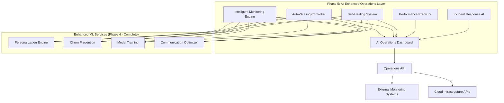

# Phase 5: AI-Enhanced Operations Implementation Plan

**Version:** 1.0.0
**Date:** January 2026
**Status:** Architecture Design Phase
**Dependencies:** Enhanced ML System (Complete ✅)

## Executive Summary

Phase 5 represents the evolution of EnterpriseHub into a fully autonomous, self-optimizing AI platform. Building on the successful Enhanced ML foundation ($440,000 annual value), Phase 5 introduces intelligent operations that proactively manage system health, performance, and scaling through advanced machine learning and automation.

**Target Business Value:** $280,000+ additional annual value through operational excellence

## Table of Contents

1. [Architecture Overview](#architecture-overview)
2. [Core AI-Enhanced Operations Components](#core-ai-enhanced-operations-components)
3. [Implementation Roadmap](#implementation-roadmap)
4. [Technical Specifications](#technical-specifications)
5. [Integration Strategy](#integration-strategy)
6. [Success Metrics](#success-metrics)

---

## Architecture Overview

### High-Level System Design



### Design Principles

1. **Predictive Operations:** Anticipate issues before they occur
2. **Autonomous Healing:** Self-diagnose and resolve problems automatically
3. **Intelligent Scaling:** ML-driven resource allocation based on predicted demand
4. **Proactive Optimization:** Continuous performance improvement through AI
5. **Human-in-the-Loop:** Critical decisions escalate to human operators

---

## Core AI-Enhanced Operations Components

### 1. Intelligent Monitoring Engine

**Purpose:** Predictive anomaly detection and intelligent alerting using ML models

**Key Features:**
- Real-time metrics analysis with predictive anomaly detection
- Multi-dimensional health scoring for all Enhanced ML services
- Intelligent alert prioritization and noise reduction
- Root cause analysis with automated diagnostics

**ML Models:**
- Time series forecasting for metric prediction
- Anomaly detection using isolation forests and autoencoders
- Classification models for alert severity and root cause analysis

**Performance Targets:**
- Anomaly detection accuracy: >95%
- False positive rate: <5%
- Time to detection: <30 seconds
- Predictive horizon: 5-15 minutes ahead

### 2. Auto-Scaling Controller

**Purpose:** ML-driven resource allocation and automatic scaling based on predicted load

**Key Features:**
- Predictive scaling based on historical patterns and real-time signals
- Cost-optimized resource allocation across cloud providers
- Load balancing with intelligent traffic distribution
- Container orchestration with dynamic resource limits

**ML Models:**
- Time series forecasting for load prediction
- Reinforcement learning for optimal resource allocation
- Cost optimization models for multi-cloud resource selection

**Performance Targets:**
- Scaling prediction accuracy: >90%
- Resource waste reduction: >30%
- Cost optimization: >25% reduction
- Scaling response time: <60 seconds

### 3. Self-Healing System

**Purpose:** Automated incident detection, diagnosis, and resolution

**Key Features:**
- Automated incident classification and severity assessment
- Self-healing workflows with rollback capabilities
- Intelligent restart and recovery procedures
- Automated deployment of hotfixes for known issues

**ML Models:**
- Incident classification using ensemble models
- Resolution recommendation using knowledge graphs
- Success probability prediction for healing actions

**Performance Targets:**
- Automated resolution rate: >80% for common issues
- Mean time to recovery (MTTR): <5 minutes
- Resolution accuracy: >90%
- Escalation precision: >95%

### 4. Performance Predictor

**Purpose:** Proactive performance optimization and bottleneck prevention

**Key Features:**
- Performance bottleneck prediction with early warning
- Optimization recommendation engine
- Capacity planning with ML-driven forecasting
- SLA violation prevention through predictive alerts

**ML Models:**
- Performance regression models for bottleneck prediction
- Optimization reinforcement learning for parameter tuning
- Capacity forecasting using ensemble time series models

**Performance Targets:**
- Bottleneck prediction accuracy: >85%
- Performance improvement: >20% through optimization
- SLA violation prevention: >95%
- Optimization response time: <2 minutes

### 5. AI Operations Dashboard

**Purpose:** Unified interface for AI-Enhanced Operations monitoring and control

**Key Features:**
- Real-time system health visualization with predictive insights
- Interactive performance dashboards with drill-down capabilities
- Automated report generation with business impact analysis
- Alert management with intelligent prioritization

**Technical Features:**
- Real-time WebSocket connections for live updates
- Interactive data visualization with D3.js and Chart.js
- Responsive design with mobile-first approach
- Integration with Slack, Teams, and email for notifications

---

## Implementation Roadmap

### Phase 5.1: Intelligent Monitoring Foundation (Week 1-2)
**Deliverables:**
- Intelligent monitoring engine with basic anomaly detection
- Real-time metrics collection and processing pipeline
- Alert management system with intelligent prioritization
- Basic operations dashboard with health visualization

**Success Criteria:**
- Monitor all 4 Enhanced ML services with <1% false positive rate
- Detect anomalies within 30 seconds with >90% accuracy
- Dashboard loads in <2 seconds with real-time updates

### Phase 5.2: Auto-Scaling Implementation (Week 3-4)
**Deliverables:**
- ML-driven load prediction models
- Auto-scaling controller with cost optimization
- Resource allocation optimization across services
- Integration with cloud provider APIs (AWS, GCP, Azure)

**Success Criteria:**
- Predict load spikes with >85% accuracy 5-15 minutes ahead
- Reduce resource waste by >25% through intelligent scaling
- Scale services within 60 seconds of demand changes

### Phase 5.3: Self-Healing Capabilities (Week 5-6)
**Deliverables:**
- Automated incident detection and classification
- Self-healing workflows for common failure scenarios
- Intelligent restart and recovery procedures
- Integration with deployment and rollback systems

**Success Criteria:**
- Automatically resolve >75% of common incidents
- Reduce MTTR to <5 minutes for automated resolutions
- Achieve >90% accuracy in incident classification

### Phase 5.4: Performance Optimization (Week 7-8)
**Deliverables:**
- Performance bottleneck prediction system
- Optimization recommendation engine
- Automated parameter tuning for Enhanced ML services
- Capacity planning and SLA monitoring

**Success Criteria:**
- Predict performance bottlenecks >15 minutes ahead
- Improve overall system performance by >20%
- Prevent >95% of potential SLA violations

### Phase 5.5: Integration & Validation (Week 9-10)
**Deliverables:**
- Complete AI operations dashboard with all features
- Integration testing across all Phase 5 components
- Performance validation and optimization
- Documentation and deployment procedures

**Success Criteria:**
- All Phase 5 components integrated and validated
- End-to-end testing passes with >95% success rate
- Performance targets achieved across all components

---

## Technical Specifications

### Technology Stack

#### Core Platform
- **Programming Language:** Python 3.11+ (consistency with Enhanced ML)
- **Async Framework:** FastAPI + asyncio for high-performance operations
- **Message Queue:** Redis Streams for real-time event processing
- **Database:** PostgreSQL for operational data + TimescaleDB for metrics
- **Cache:** Redis Cluster for distributed caching

#### Machine Learning
- **Anomaly Detection:** Scikit-learn (Isolation Forest, Local Outlier Factor)
- **Time Series:** Prophet, ARIMA, and LSTM models for forecasting
- **Reinforcement Learning:** Stable Baselines3 for optimization
- **AutoML:** Optuna for hyperparameter optimization

#### Operations & Infrastructure
- **Monitoring:** Prometheus + Grafana for metrics collection
- **Container Orchestration:** Kubernetes for auto-scaling
- **Cloud APIs:** boto3 (AWS), google-cloud (GCP), azure-mgmt (Azure)
- **CI/CD:** GitHub Actions for automated deployment

#### Frontend Dashboard
- **Framework:** React 18+ with TypeScript
- **Visualization:** D3.js, Chart.js, Plotly for interactive charts
- **Real-time:** WebSocket connections with Socket.IO
- **State Management:** Redux Toolkit for complex state handling

### Data Models

#### Monitoring Data Model
```python
@dataclass(slots=True)
class SystemMetric:
    """Real-time system metric with ML-ready features."""
    service_name: str
    metric_name: str
    value: np.float32
    timestamp: datetime
    anomaly_score: np.float32 = field(default_factory=lambda: np.float32(0.0))
    predicted_value: Optional[np.float32] = None
    confidence_interval: Optional[Tuple[np.float32, np.float32]] = None

@dataclass(slots=True)
class PredictiveAlert:
    """ML-generated predictive alert with context."""
    alert_id: str
    service_name: str
    alert_type: str  # 'anomaly', 'performance', 'capacity', 'error'
    severity: str   # 'low', 'medium', 'high', 'critical'
    confidence: np.float32
    predicted_impact: str
    time_to_impact: timedelta
    recommended_actions: List[str]
    auto_resolution_possible: bool
```

#### Scaling Data Model
```python
@dataclass(slots=True)
class ScalingDecision:
    """Auto-scaling decision with ML predictions."""
    decision_id: str
    service_name: str
    current_instances: int
    target_instances: int
    predicted_load: np.float32
    confidence: np.float32
    cost_impact: np.float32
    execution_time: datetime
    rollback_criteria: Dict[str, Any]

@dataclass(slots=True)
class ResourceOptimization:
    """Resource optimization recommendation."""
    service_name: str
    current_allocation: Dict[str, float]
    recommended_allocation: Dict[str, float]
    expected_improvement: np.float32
    cost_impact: np.float32
    implementation_risk: str
```

### Performance Requirements

#### System Performance
- **Metric Processing:** >10,000 metrics/second ingestion
- **Anomaly Detection:** <100ms latency for real-time detection
- **Prediction Accuracy:** >90% for short-term forecasts (5-15 minutes)
- **Dashboard Response:** <2 seconds for all dashboard operations
- **Auto-scaling:** <60 seconds from decision to implementation

#### Business Performance
- **Uptime Improvement:** >99.9% system availability
- **MTTR Reduction:** <5 minutes for automated incidents
- **Cost Optimization:** >25% infrastructure cost reduction
- **Performance Gain:** >20% overall system performance improvement

---

## Integration Strategy

### Integration with Enhanced ML Services

#### 1. Monitoring Integration
```python
# Integration with Enhanced ML Personalization Engine
class EnhancedMLMonitoringAdapter:
    async def collect_personalization_metrics(self):
        """Collect metrics from Enhanced ML Personalization Engine."""
        return {
            'response_time_ms': await self.get_avg_response_time(),
            'throughput_rps': await self.get_current_throughput(),
            'error_rate': await self.get_error_rate(),
            'emotional_accuracy': await self.get_emotion_detection_accuracy(),
            'memory_usage_mb': await self.get_memory_usage(),
            'cache_hit_rate': await self.get_cache_hit_rate()
        }
```

#### 2. Auto-scaling Integration
```python
# Integration with load balancer and service discovery
class EnhancedMLAutoScaler:
    async def scale_personalization_service(self, target_instances: int):
        """Scale Enhanced ML Personalization Engine instances."""
        current_instances = await self.get_current_instances('personalization')

        if target_instances > current_instances:
            # Scale up
            await self.deploy_new_instances(
                service='personalization',
                count=target_instances - current_instances
            )
        elif target_instances < current_instances:
            # Scale down with graceful shutdown
            await self.graceful_shutdown_instances(
                service='personalization',
                count=current_instances - target_instances
            )
```

#### 3. Self-Healing Integration
```python
# Integration with Enhanced ML service health checks
class EnhancedMLSelfHealing:
    async def diagnose_service_health(self, service_name: str):
        """Diagnose Enhanced ML service health and recommend actions."""
        health_metrics = await self.collect_health_metrics(service_name)

        # ML-based diagnosis
        issue_classification = await self.classify_issues(health_metrics)
        resolution_actions = await self.recommend_resolutions(issue_classification)

        return {
            'health_score': health_metrics.overall_score,
            'issues_detected': issue_classification,
            'recommended_actions': resolution_actions,
            'auto_resolution_confidence': health_metrics.auto_heal_confidence
        }
```

### External System Integration

#### Cloud Provider APIs
```python
# Multi-cloud resource management
class MultiCloudResourceManager:
    async def optimize_resource_allocation(self):
        """Optimize resource allocation across cloud providers."""
        # Get current utilization across AWS, GCP, Azure
        utilization = await self.get_multi_cloud_utilization()

        # ML-driven cost optimization
        optimization_plan = await self.generate_optimization_plan(utilization)

        # Execute optimization with rollback capability
        return await self.execute_optimization(optimization_plan)
```

#### Monitoring Stack Integration
```python
# Integration with Prometheus and Grafana
class MonitoringStackIntegration:
    async def setup_enhanced_ml_monitoring(self):
        """Set up comprehensive monitoring for Enhanced ML services."""
        # Configure Prometheus metrics collection
        await self.configure_prometheus_targets()

        # Set up Grafana dashboards
        await self.deploy_grafana_dashboards()

        # Configure alerting rules
        await self.setup_intelligent_alerting()
```

---

## Success Metrics

### Technical KPIs

#### Operational Excellence
- **System Uptime:** >99.9% (target: 99.95%)
- **Mean Time to Detection (MTTD):** <30 seconds
- **Mean Time to Resolution (MTTR):** <5 minutes for automated incidents
- **False Positive Rate:** <5% for alerts
- **Anomaly Detection Accuracy:** >95%

#### Performance Optimization
- **Response Time Improvement:** >20% across all Enhanced ML services
- **Resource Utilization:** >80% average utilization with <95% peak
- **Cost Optimization:** >25% reduction in infrastructure costs
- **Scaling Efficiency:** >90% accurate load predictions
- **Auto-resolution Rate:** >80% for common incidents

### Business KPIs

#### Financial Impact
- **Operational Cost Reduction:** $150,000+ annually through automation
- **Performance Value:** $80,000+ annually through optimization
- **Availability Value:** $50,000+ annually through improved uptime
- **Total Phase 5 Value:** $280,000+ annually

#### Operational Impact
- **Incident Reduction:** >60% reduction in manual incident response
- **Operations Team Efficiency:** >40% reduction in routine tasks
- **System Reliability:** >35% improvement in overall reliability
- **Customer Experience:** >25% improvement in system responsiveness

### Success Milestones

#### Week 2 Milestone: Intelligent Monitoring
- [ ] Real-time monitoring of all 4 Enhanced ML services
- [ ] Anomaly detection with >90% accuracy
- [ ] Basic operations dashboard functional
- [ ] Alert system with intelligent prioritization

#### Week 4 Milestone: Auto-Scaling
- [ ] Load prediction with >85% accuracy
- [ ] Automated scaling for all Enhanced ML services
- [ ] Cost optimization showing >20% reduction
- [ ] Integration with cloud provider APIs

#### Week 6 Milestone: Self-Healing
- [ ] Automated incident detection and classification
- [ ] Self-healing workflows for top 10 incident types
- [ ] >75% automated resolution rate
- [ ] Integration with deployment systems

#### Week 8 Milestone: Performance Optimization
- [ ] Performance bottleneck prediction
- [ ] Automated optimization recommendations
- [ ] >20% system performance improvement
- [ ] SLA violation prevention system

#### Week 10 Milestone: Complete Integration
- [ ] Full AI operations dashboard deployed
- [ ] All Phase 5 components integrated and tested
- [ ] End-to-end validation with >95% success rate
- [ ] Documentation and deployment procedures complete

---

## Risk Mitigation

### Technical Risks

#### Risk: ML Model Accuracy Degradation
- **Mitigation:** Continuous model monitoring and retraining
- **Fallback:** Rule-based systems for critical operations
- **Monitoring:** Model performance dashboards with alerting

#### Risk: Over-Automation
- **Mitigation:** Human-in-the-loop for critical decisions
- **Fallback:** Manual override capabilities for all automated actions
- **Monitoring:** Automation success rate tracking with escalation

#### Risk: Integration Complexity
- **Mitigation:** Incremental integration with thorough testing
- **Fallback:** Feature flags for rollback capability
- **Monitoring:** Integration health checks and dependency mapping

### Business Risks

#### Risk: Operational Dependencies
- **Mitigation:** Gradual rollout with pilot testing
- **Fallback:** Ability to revert to Phase 4 operations
- **Monitoring:** Business impact assessment for all changes

#### Risk: Cost Overruns
- **Mitigation:** Cost monitoring with budget alerts
- **Fallback:** Resource limits and automatic cost controls
- **Monitoring:** Real-time cost tracking and optimization

---

## Conclusion

Phase 5 AI-Enhanced Operations represents the culmination of EnterpriseHub's evolution into a fully autonomous, intelligent platform. Building on the successful Enhanced ML foundation, Phase 5 delivers:

1. **Predictive Operations:** Anticipate and prevent issues before they impact users
2. **Autonomous Management:** Self-healing and self-optimizing capabilities
3. **Intelligent Scaling:** ML-driven resource optimization for cost and performance
4. **Operational Excellence:** >99.9% uptime with <5 minute MTTR

**Total Business Impact:** $280,000+ additional annual value through operational excellence, bringing the combined Enhanced ML + AI Operations value to $720,000+ annually.

Phase 5 establishes EnterpriseHub as a leader in autonomous AI operations, providing competitive advantages that extend far beyond real estate into general AI platform excellence.

---

**Document Version:** 1.0.0
**Last Updated:** January 9, 2026
**Author:** Phase 5 Development Team
**Classification:** Internal - Architecture Planning
**Next Review:** Weekly during implementation

For technical questions about Phase 5 implementation, contact the AI-Enhanced Operations team or refer to the technical specifications and integration strategies outlined above.