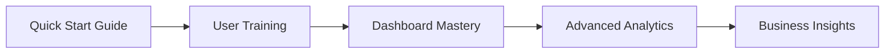
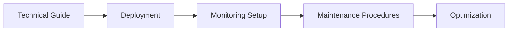
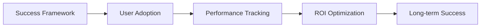

# 📋 Customer Intelligence Platform - Documentation Suite

**Complete client onboarding and operational documentation for enterprise success**

---

## 🎯 Documentation Overview

This comprehensive documentation suite provides everything needed for successful Customer Intelligence Platform deployment, user onboarding, and ongoing operations. The documentation is designed for different stakeholders and use cases across the entire client lifecycle.

### 📚 Document Structure

| Document | Target Audience | Purpose | Estimated Time |
|----------|----------------|---------|----------------|
| **[Client Onboarding Quick Start Guide](CLIENT_ONBOARDING_QUICK_START.md)** | New Clients, Implementation Teams | 30-minute setup process | 30 minutes |
| **[Technical Implementation Guide](TECHNICAL_IMPLEMENTATION_GUIDE.md)** | DevOps, System Administrators | Enterprise deployment and configuration | 2-4 hours |
| **[User Training Materials](USER_TRAINING_MATERIALS.md)** | End Users, Analysts, Managers | Complete platform usage training | 3-5 hours |
| **[Client Success Enablement Kit](CLIENT_SUCCESS_ENABLEMENT_KIT.md)** | Customer Success, Account Managers | Performance monitoring and ROI optimization | 1-2 hours |
| **[Support & Maintenance Documentation](SUPPORT_MAINTENANCE_DOCUMENTATION.md)** | Operations Teams, Support Staff | System health and maintenance procedures | Reference |

---

## 🚀 Getting Started

### For New Clients

1. **Start Here**: [Client Onboarding Quick Start Guide](CLIENT_ONBOARDING_QUICK_START.md)
   - Get your platform running in 30 minutes
   - Complete initial setup and configuration
   - Create user accounts and verify functionality

2. **Next Step**: [User Training Materials](USER_TRAINING_MATERIALS.md)
   - Complete platform training for your team
   - Learn dashboard navigation and analytics features
   - Master role-based access and best practices

3. **Optimize**: [Client Success Enablement Kit](CLIENT_SUCCESS_ENABLEMENT_KIT.md)
   - Set up performance monitoring
   - Configure CRM integrations
   - Track success metrics and ROI

### For Technical Teams

1. **Deploy**: [Technical Implementation Guide](TECHNICAL_IMPLEMENTATION_GUIDE.md)
   - Enterprise-grade deployment procedures
   - Database setup and optimization
   - Security configuration and monitoring

2. **Maintain**: [Support & Maintenance Documentation](SUPPORT_MAINTENANCE_DOCUMENTATION.md)
   - System health monitoring procedures
   - Backup and disaster recovery plans
   - Update and scaling procedures

---

## 🎯 Success Path by Role

### 👨‍💼 Business Users & Analysts



**Recommended Reading Order:**
1. [Client Onboarding Quick Start Guide](CLIENT_ONBOARDING_QUICK_START.md) - Sections 1-2
2. [User Training Materials](USER_TRAINING_MATERIALS.md) - Modules 1-3
3. [Client Success Enablement Kit](CLIENT_SUCCESS_ENABLEMENT_KIT.md) - Success Metrics

### 🔧 Technical Administrators



**Recommended Reading Order:**
1. [Technical Implementation Guide](TECHNICAL_IMPLEMENTATION_GUIDE.md) - Complete
2. [Support & Maintenance Documentation](SUPPORT_MAINTENANCE_DOCUMENTATION.md) - Health Monitoring
3. [Client Success Enablement Kit](CLIENT_SUCCESS_ENABLEMENT_KIT.md) - Performance Monitoring

### 🎯 Customer Success Managers



**Recommended Reading Order:**
1. [Client Success Enablement Kit](CLIENT_SUCCESS_ENABLEMENT_KIT.md) - Complete
2. [User Training Materials](USER_TRAINING_MATERIALS.md) - Troubleshooting & Best Practices
3. [Client Onboarding Quick Start Guide](CLIENT_ONBOARDING_QUICK_START.md) - Post-Setup Verification

---

## 📊 Platform Architecture Overview

### System Components

```yaml
Customer Intelligence Platform:
  Frontend:
    - Streamlit Application (Port 8501)
    - Real-time Dashboards
    - User Interface Components
  
  Backend Services:
    - FastAPI Services (Port 8000)
    - AI/ML Processing Engine
    - Data Analytics Pipeline
  
  Data Layer:
    - PostgreSQL Database (Customer data, analytics)
    - Redis Cache (Performance optimization)
    - File Storage (Uploads, exports)
  
  AI Integration:
    - Claude 3.5 Sonnet (Anthropic)
    - Real-time Intelligence Processing
    - Automated Insights Generation
  
  Monitoring & Operations:
    - Health Monitoring Dashboard
    - Automated Backup System
    - Performance Analytics
```

### Key Features

- **🎯 Real-Time Analytics**: Live customer intelligence and insights
- **👥 Customer Segmentation**: AI-powered customer grouping and analysis  
- **🗺️ Journey Mapping**: Visual customer journey tracking and optimization
- **🏢 Multi-Tenant Architecture**: Enterprise-grade tenant isolation
- **🔐 Role-Based Access**: Granular permissions and security controls
- **📊 Advanced Reporting**: Customizable reports and data exports
- **🔗 CRM Integration**: Seamless integration with major CRM platforms
- **⚡ Performance Optimized**: Redis caching and database optimization

---

## ⚡ Quick Reference

### Essential Links

| Resource | URL | Description |
|----------|-----|-------------|
| **Platform Access** | `http://localhost:8501` | Main application interface |
| **API Documentation** | `http://localhost:8000/docs` | FastAPI interactive documentation |
| **Health Check** | `http://localhost:8501/health` | System health status |
| **Monitoring Dashboard** | `http://localhost:3000` | Grafana monitoring (if enabled) |

### Common Commands

```bash
# Start Platform
docker-compose up -d

# Stop Platform  
docker-compose down

# View Logs
docker-compose logs -f customer-intelligence

# Health Check
curl http://localhost:8501/health

# Database Backup
docker exec customer-intelligence-postgres pg_dumpall -U postgres > backup.sql

# Update Platform
docker-compose pull && docker-compose up -d --force-recreate
```

### Default Credentials

```yaml
# Demo/Development Credentials
Admin User:
  Username: admin
  Password: admin123
  Role: Administrator

Analyst User:  
  Username: analyst
  Password: analyst123
  Role: Analyst

Viewer User:
  Username: viewer  
  Password: viewer123
  Role: Viewer

# Default Tenant
Tenant ID: demo_tenant
```

### Support Contacts

```yaml
Emergency Support:
  Phone: +1-800-PLATFORM (24/7)
  Email: emergency@platform-support.com
  
Technical Support:
  Email: support@platform.com
  Chat: Available 8AM-8PM EST
  
Documentation:
  Help Center: help.platform.com
  Video Library: videos.platform.com
```

---

## 🔧 Troubleshooting Quick Reference

### Common Issues & Solutions

#### Platform Won't Start
```bash
# Check Docker status
docker ps
docker-compose ps

# Restart services
docker-compose down
docker-compose up -d

# Check logs
docker-compose logs customer-intelligence
```

#### Database Connection Issues
```bash
# Test database connection
docker exec customer-intelligence-postgres pg_isready -U postgres

# Restart database
docker-compose restart postgres

# Check connection settings in .env file
```

#### Slow Performance
```bash
# Check Redis status
docker exec customer-intelligence-redis redis-cli ping

# Clear Redis cache
docker exec customer-intelligence-redis redis-cli FLUSHDB

# Monitor resource usage
docker stats
```

#### Login Problems
```bash
# Reset admin password (via database)
docker exec -it customer-intelligence-postgres psql -U postgres -d enterprisehub

# Or use backup admin account creation script
python scripts/create_admin_user.py
```

---

## 📈 Success Metrics & KPIs

### Platform Adoption Metrics

| Metric | Target | Measurement |
|--------|--------|-------------|
| **User Login Rate** | 90%+ | Daily active users / Total users |
| **Session Duration** | 15+ min | Average session time |
| **Feature Adoption** | 80%+ | Users using core features |
| **Dashboard Usage** | 4 dashboards | Average dashboards per user |

### Business Value Metrics

| Metric | Target | Impact |
|--------|--------|---------|
| **Time to Insight** | <2 hours | Faster decision making |
| **Data Quality Score** | 95%+ | Improved data reliability |
| **Process Automation** | 50%+ | Reduced manual work |
| **ROI Achievement** | 300%+ | Business value delivery |

### Technical Performance Metrics

| Metric | Target | Description |
|--------|--------|-------------|
| **Uptime** | 99.9%+ | System availability |
| **Response Time** | <2 seconds | Dashboard load time |
| **Error Rate** | <1% | Application error frequency |
| **Backup Success** | 100% | Daily backup completion |

---

## 🎓 Training & Certification

### Available Training Paths

#### 📚 Self-Paced Learning
- **Documentation Study**: Complete all 5 documentation guides
- **Hands-On Practice**: Platform exercises and scenarios
- **Assessment Tests**: Role-based competency tests
- **Completion Certificate**: Digital badge and credentials

#### 🎥 Instructor-Led Training
- **Live Webinars**: Interactive training sessions
- **Workshop Series**: Deep-dive feature training
- **Office Hours**: Q&A with platform experts
- **Custom Training**: Tailored to your organization

#### 🏆 Certification Levels
- **Platform User**: Basic navigation and features
- **Analytics Specialist**: Advanced analytics and reporting
- **Platform Administrator**: Technical configuration and management
- **Customer Success Expert**: ROI optimization and best practices

---

## 🔄 Updates & Maintenance

### Release Schedule

| Version | Type | Frequency | Notification |
|---------|------|-----------|--------------|
| **Major Releases** | New features, breaking changes | Quarterly | 30 days advance notice |
| **Minor Releases** | Feature enhancements | Monthly | 14 days advance notice |
| **Patch Releases** | Bug fixes, security updates | As needed | 24 hours advance notice |
| **Hotfix Releases** | Critical security fixes | Emergency | Immediate deployment |

### Maintenance Windows

```yaml
Scheduled Maintenance:
  Day: First Sunday of each month
  Time: 2:00 AM - 4:00 AM EST
  Duration: Up to 2 hours
  Notification: 7 days advance notice

Emergency Maintenance:
  Notification: 4 hours advance (when possible)
  Duration: Typically < 1 hour
  
Status Updates:
  Page: status.platform.com
  Email: status@platform.com
  Slack: #platform-status
```

---

## 📞 Support & Community

### Getting Help

#### 🆘 Emergency Support (24/7)
- **Critical Issues**: Platform down, data loss, security breach
- **Phone**: +1-800-PLATFORM-911
- **Email**: emergency@platform-support.com
- **Response**: 15 minutes

#### 💬 Standard Support (Business Hours)
- **Questions & Issues**: Feature help, configuration assistance
- **Chat**: Available 8AM-8PM EST
- **Email**: support@platform.com  
- **Response**: 4 hours

#### 📚 Self-Service Resources
- **Documentation**: Complete guides and references
- **Video Library**: Step-by-step tutorials
- **Community Forum**: User discussions and tips
- **Knowledge Base**: FAQ and troubleshooting

### Community Resources

- **📱 User Community**: Monthly virtual meetups
- **💡 Feature Requests**: Product roadmap input
- **🐛 Bug Reports**: Issue tracking and resolution
- **🎯 Best Practices**: Success story sharing

---

## 🏆 Success Stories & ROI

### Typical Client Outcomes

#### 📈 Performance Improvements
- **80% Faster Insights**: From days to hours for actionable intelligence
- **65% Reduced Manual Work**: Automated reporting and analytics
- **40% Better Decision Making**: Data-driven insights and recommendations
- **90% User Adoption**: High engagement across all user roles

#### 💰 Financial Impact
- **Average ROI**: 350% within 12 months
- **Cost Savings**: $50K+ annually in operational efficiency  
- **Revenue Growth**: 25% increase in data-driven revenue
- **Time Savings**: 20 hours per week per analyst

#### 🎯 Client Testimonials
> *"The Customer Intelligence Platform transformed how we understand our customers. We went from gut-feeling decisions to data-driven strategies that deliver real results."*  
> — **Sarah Johnson**, VP of Analytics, TechCorp

> *"Implementation was seamless, and our team was productive within the first week. The ROI exceeded our expectations by 200%."*  
> — **Michael Chen**, CTO, GrowthCo

---

## 📋 Document Maintenance

### Documentation Updates

This documentation suite is actively maintained and updated:

- **Version Control**: All documents are version controlled
- **Regular Reviews**: Quarterly accuracy and completeness reviews  
- **User Feedback**: Continuous improvement based on user input
- **Platform Updates**: Documentation updated with each platform release

### Contributing to Documentation

- **Feedback**: Send suggestions to docs@platform.com
- **Corrections**: Report errors or outdated information
- **Improvements**: Suggest additional content or clarifications
- **Recognition**: Contributors acknowledged in release notes

---

## ✅ Next Steps

Based on your role and needs, here's your recommended next action:

### 🆕 New to the Platform?
➡️ **Start with**: [Client Onboarding Quick Start Guide](CLIENT_ONBOARDING_QUICK_START.md)

### 🔧 Technical Implementation?
➡️ **Start with**: [Technical Implementation Guide](TECHNICAL_IMPLEMENTATION_GUIDE.md)

### 👨‍🏫 Training Your Team?
➡️ **Start with**: [User Training Materials](USER_TRAINING_MATERIALS.md)

### 📊 Optimizing Performance?
➡️ **Start with**: [Client Success Enablement Kit](CLIENT_SUCCESS_ENABLEMENT_KIT.md)

### 🛠️ Managing Operations?
➡️ **Start with**: [Support & Maintenance Documentation](SUPPORT_MAINTENANCE_DOCUMENTATION.md)

---

**Ready to get started?** Choose your path above and begin your Customer Intelligence Platform journey! 🚀

---

*Customer Intelligence Platform Documentation Suite*  
*Version 1.0 - January 2026*  
*© 2026 - Complete Implementation Guide*  

**Questions?** Contact us at support@platform.com or visit help.platform.com