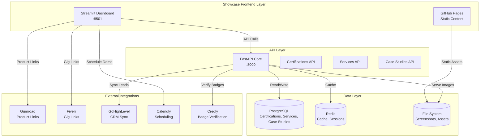

# EnterpriseHub Certifications & Services Showcase - Development Specification

**Document Version:** 1.0  
**Date:** February 10, 2026  
**Status:** Draft  
**Author:** Architect Mode

---

## Table of Contents

1. [Executive Summary](#executive-summary)
2. [Architecture Design](#architecture-design)
3. [Feature Specifications](#feature-specifications)
4. [UI/UX Specifications](#uiux-specifications)
5. [Content Strategy](#content-strategy)
6. [Implementation Phases](#implementation-phases)
7. [Technical Requirements](#technical-requirements)
8. [Integration Points](#integration-points)
9. [Success Metrics & KPIs](#success-metrics--kpis)
10. [Appendices](#appendices)

---

## Executive Summary

### Project Overview

EnterpriseHub is a production-ready AI-powered real estate platform with 4,500+ automated tests, 140+ services, and 80+ dashboard components. This specification outlines the transformation of the platform into a professional certifications and services showcase to attract potential clients, employers, and customers.

### Current State Assessment

**Strengths:**
- Production-ready platform with proven metrics (89% token cost reduction, 87% cache hit rate, P95 latency <2s)
- Comprehensive technical foundation: FastAPI, Streamlit, PostgreSQL, Redis, multi-LLM orchestration
- Existing marketing content: Fiverr gigs, Gumroad listings, GitHub Sponsors, video walkthrough script
- 16 service icons, 80+ screenshots (60+ unprocessed), architecture diagrams
- Two detailed case studies with quantified results

**Identified Gaps:**
1. Certification display only in README - needs dedicated showcase section
2. Service portfolio scattered across multiple documents - needs consolidation
3. No interactive case studies with metrics visualization
4. Video walkthrough script exists but no recorded video
5. 60+ screenshots need processing, organization, and categorization
6. No client testimonials visible in showcase format
7. No pricing calculator or tier comparison tool
8. No demo request/scheduling integration

### Target Audience

**Primary:**
- Real estate brokerages and agencies seeking AI automation solutions
- Enterprise clients evaluating AI-powered business intelligence platforms
- Potential employers assessing technical capabilities

**Secondary:**
- Individual real estate professionals
- Technology companies exploring AI integration
- Open-source community members

### Project Goals

1. **Credibility Enhancement:** Showcase certifications and technical expertise prominently
2. **Service Clarity:** Present services with consistent, professional formatting
3. **Social Proof:** Display case studies, testimonials, and metrics
4. **Conversion Enablement:** Provide clear paths to demo requests and purchases
5. **SEO Optimization:** Improve discoverability on GitHub and external platforms

### Success Metrics

| Metric | Target | Measurement Method |
|--------|--------|-------------------|
| GitHub Stars | +50 stars/month | GitHub API |
| Demo Requests | 10 requests/month | Form submissions |
| Gumroad Sales | 5 sales/month | Gumroad dashboard |
| Fiverr Orders | 3 orders/month | Fiverr dashboard |
| Page Views | 500 views/month | GitHub traffic analytics |
| Average Session Duration | 3+ minutes | Analytics tracking |
| Conversion Rate | 5% (demo request) | Form submissions / visitors |

---

## Architecture Design

### System Architecture



### New Directory Structure

```
EnterpriseHub/
├── showcase/                          # NEW: Showcase components
│   ├── __init__.py
│   ├── app.py                         # Main showcase Streamlit app
│   ├── config.py                      # Showcase configuration
│   ├── components/                    # Showcase UI components
│   │   ├── __init__.py
│   │   ├── certifications.py          # Certification display
│   │   ├── services.py                # Service cards
│   │   ├── case_studies.py            # Case study viewer
│   │   ├── screenshot_gallery.py      # Image gallery
│   │   ├── pricing_calculator.py      # Interactive pricing
│   │   ├── demo_request.py            # Demo request form
│   │   └── testimonials.py            # Testimonial carousel
│   ├── data/                          # Showcase data
│   │   ├── certifications.json        # Certification metadata
│   │   ├── services.json              # Service definitions
│   │   ├── case_studies.json          # Case study data
│   │   ├── testimonials.json          # Client testimonials
│   │   └── screenshots.json           # Screenshot catalog
│   ├── pages/                         # Multi-page showcase
│   │   ├── 01_Certifications.py
│   │   ├── 02_Services.py
│   │   ├── 03_Case_Studies.py
│   │   ├── 04_Demo.py
│   │   └── 05_Contact.py
│   └── utils/                         # Showcase utilities
│       ├── __init__.py
│       ├── image_optimizer.py         # Image processing
│       ├── badge_verifier.py          # Credly integration
│       └── analytics.py               # Usage tracking
├── assets/
│   ├── showcase/                      # NEW: Showcase assets
│   │   ├── badges/                    # Certification badges
│   │   ├── screenshots/               # Organized screenshots
│   │   │   ├── certifications/
│   │   │   ├── services/
│   │   │   ├── case_studies/
│   │   │   └── demos/
│   │   ├── logos/                     # Client/partner logos
│   │   └── videos/                    # Demo videos
│   └── icons/                         # Existing service icons
├── docs/
│   ├── SPEC_CERTIFICATIONS_SERVICES_SHOWCASE.md  # This document
│   └── showcase/                      # NEW: Showcase documentation
│       ├── CONTENT_GUIDE.md           # Content creation guide
│       ├── SCREENSHOT_GUIDE.md        # Screenshot standards
│       └── SEO_GUIDE.md               # SEO optimization
├── ghl_real_estate_ai/
│   ├── api/
│   │   └── routes/
│   │       └── showcase.py            # NEW: Showcase API endpoints
│   └── models/
│       └── showcase.py                # NEW: Showcase data models
└── content/
    └── showcase/                      # NEW: Showcase content
        ├── certifications/
        ├── services/
        └── case_studies/
```

### Data Models

#### Certification Model

```python
# ghl_real_estate_ai/models/showcase.py

from sqlalchemy import Column, Integer, String, Text, DateTime, Boolean, ForeignKey
from sqlalchemy.orm import relationship
from datetime import datetime

class Certification(Base):
    """Professional certification with verification support."""
    
    __tablename__ = "certifications"
    
    id = Column(Integer, primary_key=True)
    name = Column(String(200), nullable=False)
    issuer = Column(String(200), nullable=False)  # e.g., "IBM", "Google"
    credential_id = Column(String(100), unique=True)
    issue_date = Column(DateTime)
    expiration_date = Column(DateTime, nullable=True)
    verification_url = Column(Text)
    badge_image_url = Column(Text)
    skills = Column(Text)  # JSON array of skills
    related_services = Column(Text)  # JSON array of service IDs
    display_order = Column(Integer, default=0)
    is_featured = Column(Boolean, default=False)
    created_at = Column(DateTime, default=datetime.utcnow)
    updated_at = Column(DateTime, default=datetime.utcnow, onupdate=datetime.utcnow)
    
    # Relationships
    service_mappings = relationship("CertificationServiceMapping", back_populates="certification")

class Service(Base):
    """Professional service offering."""
    
    __tablename__ = "services"
    
    id = Column(Integer, primary_key=True)
    name = Column(String(200), nullable=False)
    slug = Column(String(100), unique=True, nullable=False)
    short_description = Column(Text)
    long_description = Column(Text)
    icon = Column(String(100))  # Icon filename
    pricing_tier = Column(String(50))  # "starter", "professional", "enterprise"
    base_price = Column(Integer)  # In cents
    deliverables = Column(Text)  # JSON array
    technology_stack = Column(Text)  # JSON array
    related_certifications = Column(Text)  # JSON array of cert IDs
    gumroad_product_id = Column(String(100), nullable=True)
    fiverr_gig_id = Column(String(100), nullable=True)
    display_order = Column(Integer, default=0)
    is_featured = Column(Boolean, default=False)
    created_at = Column(DateTime, default=datetime.utcnow)
    updated_at = Column(DateTime, default=datetime.utcnow, onupdate=datetime.utcnow)
    
    # Relationships
    certification_mappings = relationship("CertificationServiceMapping", back_populates="service")
    case_studies = relationship("CaseStudy", secondary="service_case_study", back_populates="services")

class CaseStudy(Base):
    """Client success story with metrics."""
    
    __tablename__ = "case_studies"
    
    id = Column(Integer, primary_key=True)
    title = Column(String(300), nullable=False)
    slug = Column(String(100), unique=True, nullable=False)
    client_name = Column(String(200))
    client_industry = Column(String(100))
    client_logo_url = Column(Text)
    challenge = Column(Text, nullable=False)
    solution = Column(Text, nullable=False)
    results = Column(Text, nullable=False)  # JSON array of metrics
    testimonial = Column(Text)
    testimonial_author = Column(String(200))
    testimonial_role = Column(String(200))
    before_metrics = Column(Text)  # JSON object
    after_metrics = Column(Text)  # JSON object
    screenshots = Column(Text)  # JSON array of image URLs
    related_services = Column(Text)  # JSON array of service IDs
    published_date = Column(DateTime)
    is_featured = Column(Boolean, default=False)
    created_at = Column(DateTime, default=datetime.utcnow)
    updated_at = Column(DateTime, default=datetime.utcnow, onupdate=datetime.utcnow)
    
    # Relationships
    services = relationship("Service", secondary="service_case_study", back_populates="case_studies")

class Screenshot(Base):
    """Screenshot metadata for gallery."""
    
    __tablename__ = "screenshots"
    
    id = Column(Integer, primary_key=True)
    filename = Column(String(255), unique=True, nullable=False)
    title = Column(String(200))
    description = Column(Text)
    category = Column(String(100))  # "certifications", "services", "case_studies", "demos"
    service_id = Column(Integer, ForeignKey("services.id"), nullable=True)
    case_study_id = Column(Integer, ForeignKey("case_studies.id"), nullable=True)
    width = Column(Integer)
    height = Column(Integer)
    file_size = Column(Integer)  # In bytes
    optimized = Column(Boolean, default=False)
    display_order = Column(Integer, default=0)
    created_at = Column(DateTime, default=datetime.utcnow)

class Testimonial(Base):
    """Client testimonial."""
    
    __tablename__ = "testimonials"
    
    id = Column(Integer, primary_key=True)
    client_name = Column(String(200), nullable=False)
    client_role = Column(String(200))
    client_company = Column(String(200))
    client_logo_url = Column(Text)
    testimonial_text = Column(Text, nullable=False)
    rating = Column(Integer)  # 1-5 stars
    project_type = Column(String(100))
    date = Column(DateTime)
    is_featured = Column(Boolean, default=False)
    display_order = Column(Integer, default=0)
    created_at = Column(DateTime, default=datetime.utcnow)

# Association tables
service_case_study = Table(
    "service_case_study",
    Base.metadata,
    Column("service_id", Integer, ForeignKey("services.id"), primary_key=True),
    Column("case_study_id", Integer, ForeignKey("case_studies.id"), primary_key=True)
)

class CertificationServiceMapping(Base):
    """Many-to-many relationship between certifications and services."""
    
    __tablename__ = "certification_service_mapping"
    
    id = Column(Integer, primary_key=True)
    certification_id = Column(Integer, ForeignKey("certifications.id"))
    service_id = Column(Integer, ForeignKey("services.id"))
    relevance_score = Column(Integer, default=50)  # 0-100 relevance
    
    certification = relationship("Certification", back_populates="service_mappings")
    service = relationship("Service", back_populates="certification_mappings")
```

### API Endpoints

```python
# ghl_real_estate_ai/api/routes/showcase.py

from fastapi import APIRouter, HTTPException
from typing import List, Optional
from pydantic import BaseModel

router = APIRouter(prefix="/api/showcase", tags=["showcase"])

# Certification endpoints
@router.get("/certifications", response_model=List[CertificationResponse])
async def get_certifications(
    featured_only: bool = False,
    issuer: Optional[str] = None
):
    """Retrieve certifications with optional filtering."""
    pass

@router.get("/certifications/{cert_id}", response_model=CertificationDetailResponse)
async def get_certification_detail(cert_id: int):
    """Retrieve detailed certification information."""
    pass

@router.get("/certifications/{cert_id}/verify")
async def verify_certification(cert_id: int):
    """Verify certification via Credly API."""
    pass

# Service endpoints
@router.get("/services", response_model=List[ServiceResponse])
async def get_services(
    tier: Optional[str] = None,
    featured_only: bool = False
):
    """Retrieve services with optional filtering."""
    pass

@router.get("/services/{service_id}", response_model=ServiceDetailResponse)
async def get_service_detail(service_id: int):
    """Retrieve detailed service information."""
    pass

@router.get("/services/{service_id}/related-certifications")
async def get_service_certifications(service_id: int):
    """Retrieve certifications related to a service."""
    pass

# Case study endpoints
@router.get("/case-studies", response_model=List[CaseStudyResponse])
async def get_case_studies(
    featured_only: bool = False,
    service_id: Optional[int] = None
):
    """Retrieve case studies with optional filtering."""
    pass

@router.get("/case-studies/{case_study_id}", response_model=CaseStudyDetailResponse)
async def get_case_study_detail(case_study_id: int):
    """Retrieve detailed case study information."""
    pass

# Screenshot endpoints
@router.get("/screenshots", response_model=List[ScreenshotResponse])
async def get_screenshots(
    category: Optional[str] = None,
    service_id: Optional[int] = None
):
    """Retrieve screenshots with optional filtering."""
    pass

# Testimonial endpoints
@router.get("/testimonials", response_model=List[TestimonialResponse])
async def get_testimonials(
    featured_only: bool = False,
    rating: Optional[int] = None
):
    """Retrieve testimonials with optional filtering."""
    pass

# Demo request endpoint
@router.post("/demo-request")
async def submit_demo_request(request: DemoRequest):
    """Submit demo request and sync to GHL CRM."""
    pass
```

---

## Feature Specifications

### 1. Certifications Showcase

#### 1.1 Badge Display with Verification

**Priority:** HIGH  
**Status:** NEW

**Description:**
Display professional certifications with visual badges, verification links, and detailed information.

**Features:**
- Badge images with hover effects showing certification details
- Click-through to verification URLs (Credly, Coursera, etc.)
- Issuer logos and branding
- Issue and expiration dates
- Skills tags extracted from certification
- Related services mapping

**UI Components:**
```python
# showcase/components/certifications.py

import streamlit as st
import requests
from datetime import datetime

def render_certification_badge(cert: dict):
    """Render a single certification badge."""
    with st.container():
        col1, col2 = st.columns([1, 4])
        
        with col1:
            st.image(cert["badge_image_url"], width=100)
        
        with col2:
            st.markdown(f"### {cert['name']}")
            st.caption(f"**Issued by:** {cert['issuer']}")
            st.caption(f"**Issued:** {cert['issue_date'].strftime('%B %Y')}")
            
            if cert['expiration_date']:
                st.caption(f"**Expires:** {cert['expiration_date'].strftime('%B %Y')}")
            
            # Verification button
            if cert['verification_url']:
                st.link_button(
                    "Verify Credential",
                    cert['verification_url'],
                    use_container_width=True
                )
            
            # Skills tags
            if cert['skills']:
                st.markdown("**Skills:**")
                skill_cols = st.columns(min(4, len(cert['skills'])))
                for i, skill in enumerate(cert['skills']):
                    with skill_cols[i % 4]:
                        st.tag(skill)

def render_certification_grid(certifications: list):
    """Render grid of certification badges."""
    st.markdown("## Professional Certifications")
    
    # Featured certifications first
    featured = [c for c in certifications if c['is_featured']]
    standard = [c for c in certifications if not c['is_featured']]
    
    if featured:
        st.markdown("### Featured Certifications")
        for cert in featured:
            render_certification_badge(cert)
            st.divider()
    
    if standard:
        st.markdown("### All Certifications")
        cols = st.columns(2)
        for i, cert in enumerate(standard):
            with cols[i % 2]:
                render_certification_badge(cert)
```

**Data Structure:**
```json
{
  "id": 1,
  "name": "Generative AI Engineering",
  "issuer": "IBM",
  "credential_id": "IBM-GENAI-2024",
  "issue_date": "2024-03-15T00:00:00Z",
  "expiration_date": null,
  "verification_url": "https://www.credly.com/badges/abc123",
  "badge_image_url": "/assets/showcase/badges/ibm-genai.png",
  "skills": ["PyTorch", "LangChain", "Hugging Face", "Generative AI"],
  "related_services": [4, 6, 10],
  "is_featured": true,
  "display_order": 1
}
```

#### 1.2 Skills Matrix

**Priority:** MEDIUM  
**Status:** NEW

**Description:**
Interactive matrix showing certifications mapped to skills and services.

**Features:**
- Heatmap visualization of skill coverage
- Filter by certification or service
- Click to see related certifications
- Export to CSV

**UI Components:**
```python
def render_skills_matrix(certifications: list, services: list):
    """Render skills matrix heatmap."""
    import plotly.express as px
    import pandas as pd
    
    # Build matrix data
    all_skills = set()
    for cert in certifications:
        all_skills.update(cert['skills'])
    
    matrix_data = []
    for skill in sorted(all_skills):
        for cert in certifications:
            if skill in cert['skills']:
                matrix_data.append({
                    'Skill': skill,
                    'Certification': cert['name'],
                    'Value': 1
                })
    
    df = pd.DataFrame(matrix_data)
    
    # Create heatmap
    fig = px.density_heatmap(
        df,
        x='Certification',
        y='Skill',
        z='Value',
        color_continuous_scale='Viridis',
        title='Skills Coverage Matrix'
    )
    
    st.plotly_chart(fig, use_container_width=True)
```

#### 1.3 Timeline Visualization

**Priority:** MEDIUM  
**Status:** NEW

**Description:**
Visual timeline showing certification acquisition over time.

**Features:**
- Chronological display of certifications
- Milestone markers
- Progress indicators
- Filter by year or issuer

**UI Components:**
```python
def render_certification_timeline(certifications: list):
    """Render certification timeline."""
    import plotly.figure_factory as ff
    
    # Sort by issue date
    sorted_certs = sorted(certifications, key=lambda x: x['issue_date'])
    
    # Create timeline data
    df_data = []
    for cert in sorted_certs:
        df_data.append(dict(
            Task=cert['name'],
            Start=cert['issue_date'],
            Finish=cert['expiration_date'] if cert['expiration_date'] else datetime.now(),
            Issuer=cert['issuer']
        ))
    
    fig = ff.create_gantt(df_data, index_col='Issuer', show_colorbar=True)
    st.plotly_chart(fig, use_container_width=True)
```

#### 1.4 Credential Provider Integration

**Priority:** LOW  
**Status:** FUTURE

**Description:**
Real-time verification via credential provider APIs.

**Features:**
- Credly API integration
- Coursera API integration
- Automatic badge image updates
- Expiration date tracking

**Implementation:**
```python
# showcase/utils/badge_verifier.py

import requests
from typing import Optional, Dict

class CredlyVerifier:
    """Verify credentials via Credly API."""
    
    BASE_URL = "https://api.credly.com/v1"
    
    def __init__(self, api_key: str):
        self.api_key = api_key
        self.headers = {
            "Authorization": f"Bearer {api_key}",
            "Content-Type": "application/json"
        }
    
    def verify_badge(self, badge_id: str) -> Optional[Dict]:
        """Verify a badge via Credly API."""
        try:
            response = requests.get(
                f"{self.BASE_URL}/badges/{badge_id}",
                headers=self.headers
            )
            response.raise_for_status()
            return response.json()
        except requests.RequestException as e:
            st.error(f"Failed to verify badge: {e}")
            return None
    
    def get_badge_image(self, badge_id: str) -> Optional[str]:
        """Get badge image URL."""
        badge_data = self.verify_badge(badge_id)
        if badge_data:
            return badge_data.get('image_url')
        return None
```

---

### 2. Services Portfolio

#### 2.1 Service Cards

**Priority:** HIGH  
**Status:** NEW

**Description:**
Consistent, professional service cards with key information.

**Features:**
- Service icon and name
- Short description
- Pricing tier indicator
- Technology stack tags
- Related certifications
- Call-to-action buttons

**UI Components:**
```python
# showcase/components/services.py

def render_service_card(service: dict):
    """Render a single service card."""
    with st.container():
        # Header with icon
        col1, col2 = st.columns([1, 4])
        
        with col1:
            st.image(f"/assets/icons/{service['icon']}", width=80)
        
        with col2:
            st.markdown(f"### {service['name']}")
            st.caption(service['short_description'])
        
        # Pricing tier badge
        tier_colors = {
            'starter': '🥉',
            'professional': '🥈',
            'enterprise': '🥇'
        }
        st.markdown(f"{tier_colors.get(service['pricing_tier'], '')} **{service['pricing_tier'].title()} Tier**")
        
        # Pricing
        st.markdown(f"**Starting at:** ${service['base_price'] / 100:.2f}")
        
        # Technology stack
        if service['technology_stack']:
            st.markdown("**Technology Stack:**")
            tech_cols = st.columns(min(5, len(service['technology_stack'])))
            for i, tech in enumerate(service['technology_stack']):
                with tech_cols[i % 5]:
                    st.tag(tech)
        
        # Related certifications
        if service['related_certifications']:
            st.markdown("**Related Certifications:**")
            for cert_id in service['related_certifications']:
                st.caption(f"• Certification #{cert_id}")
        
        # Call-to-action buttons
        col1, col2, col3 = st.columns(3)
        
        with col1:
            if service['gumroad_product_id']:
                st.link_button(
                    "Purchase on Gumroad",
                    f"https://gumroad.com/products/{service['gumroad_product_id']}",
                    use_container_width=True
                )
        
        with col2:
            if service['fiverr_gig_id']:
                st.link_button(
                    "Hire on Fiverr",
                    f"https://www.fiverr.com/gigs/{service['fiverr_gig_id']}",
                    use_container_width=True
                )
        
        with col3:
            st.link_button(
                "Request Demo",
                "#demo",
                use_container_width=True
            )
        
        st.divider()

def render_service_grid(services: list):
    """Render grid of service cards."""
    st.markdown("## Professional Services")
    
    # Featured services first
    featured = [s for s in services if s['is_featured']]
    standard = [s for s in services if not s['is_featured']]
    
    if featured:
        st.markdown("### Featured Services")
        for service in featured:
            render_service_card(service)
    
    if standard:
        st.markdown("### All Services")
        cols = st.columns(2)
        for i, service in enumerate(standard):
            with cols[i % 2]:
                render_service_card(service)
```

**Data Structure:**
```json
{
  "id": 4,
  "name": "Multi-Agent Workflows",
  "slug": "multi-agent-workflows",
  "short_description": "Agentic AI Systems for complex automation",
  "long_description": "Full-service multi-agent workflow design and implementation...",
  "icon": "multi_agent.svg",
  "pricing_tier": "professional",
  "base_price": 750000,
  "deliverables": [
    "Agent architecture design",
    "Workflow implementation",
    "Testing and validation",
    "Documentation and training"
  ],
  "technology_stack": [
    "Python",
    "FastAPI",
    "LangChain",
    "Redis",
    "PostgreSQL"
  ],
  "related_certifications": [1, 2],
  "gumroad_product_id": "agentforge",
  "fiverr_gig_id": "multi-agent-ai",
  "is_featured": true,
  "display_order": 1
}
```

#### 2.2 Pricing Calculator

**Priority:** HIGH  
**Status:** NEW

**Description:**
Interactive pricing calculator for service packages.

**Features:**
- Tier selection (Starter, Professional, Enterprise)
- Feature comparison
- ROI estimation
- Quote generation
- Email quote

**UI Components:**
```python
# showcase/components/pricing_calculator.py

def render_pricing_calculator():
    """Render interactive pricing calculator."""
    st.markdown("## Pricing Calculator")
    
    # Service selection
    services = get_services()
    selected_service = st.selectbox(
        "Select Service",
        options=services,
        format_func=lambda x: x['name']
    )
    
    # Tier selection
    tier = st.radio(
        "Select Tier",
        options=["starter", "professional", "enterprise"],
        format_func=lambda x: x.title()
    )
    
    # Feature comparison
    st.markdown("### Feature Comparison")
    
    comparison_data = {
        "Feature": [
            "AI Lead Analysis/Month",
            "Lead Intelligence",
            "Behavioral Analytics",
            "Property Matching",
            "Churn Prevention",
            "Multi-Department Support",
            "Workflow Automation",
            "White-Label Branding",
            "API Access",
            "Support Level"
        ],
        "Starter": [
            "50 leads",
            "✅ Basic",
            "✅ Basic",
            "✅ Standard",
            "❌",
            "❌",
            "❌",
            "❌",
            "❌",
            "Email 24hr"
        ],
        "Professional": [
            "150 leads",
            "✅ Predictive ML",
            "✅ Advanced",
            "✅ 15+ factors",
            "✅ Automated",
            "✅ 3 departments",
            "✅ No-code builder",
            "❌",
            "✅ 100K calls/mo",
            "Phone 8hr"
        ],
        "Enterprise": [
            "Unlimited",
            "✅ Custom AI models",
            "✅ Comprehensive",
            "✅ Market intelligence",
            "✅ ML-powered",
            "✅ Unlimited",
            "✅ Advanced + approval",
            "✅ Full branding",
            "✅ Unlimited",
            "24/7 Priority 1hr"
        ]
    }
    
    df = pd.DataFrame(comparison_data)
    st.dataframe(df, use_container_width=True, hide_index=True)
    
    # Pricing display
    tier_pricing = {
        "starter": 5000,
        "professional": 7500,
        "enterprise": 25000
    }
    
    st.markdown(f"### Estimated Annual Investment: ${tier_pricing[tier]:,}")
    
    # ROI estimation
    st.markdown("### ROI Estimation")
    
    time_savings = st.slider(
        "Estimated Hours Saved per Month",
        min_value=10,
        max_value=100,
        value=40
    )
    
    hourly_rate = st.number_input(
        "Average Hourly Rate ($)",
        min_value=50,
        max_value=500,
        value=100
    )
    
    monthly_savings = time_savings * hourly_rate
    annual_savings = monthly_savings * 12
    
    roi = ((annual_savings - tier_pricing[tier]) / tier_pricing[tier]) * 100
    
    col1, col2, col3 = st.columns(3)
    
    with col1:
        st.metric("Monthly Savings", f"${monthly_savings:,.0f}")
    
    with col2:
        st.metric("Annual Savings", f"${annual_savings:,.0f}")
    
    with col3:
        st.metric("ROI", f"{roi:.0f}%")
    
    # Quote generation
    if st.button("Generate Quote"):
        quote = generate_quote(selected_service, tier, tier_pricing[tier])
        st.download_button(
            "Download Quote PDF",
            quote,
            file_name=f"quote_{selected_service['slug']}_{tier}.pdf",
            mime="application/pdf"
        )
```

#### 2.3 Technology Stack Display

**Priority:** MEDIUM  
**Status:** NEW

**Description:**
Visual display of technology stack per service.

**Features:**
- Technology icons
- Category grouping (Backend, Frontend, AI/ML, Infrastructure)
- Version information
- Documentation links

**UI Components:**
```python
def render_tech_stack(service: dict):
    """Render technology stack visualization."""
    st.markdown("### Technology Stack")
    
    # Group technologies by category
    tech_categories = {
        "Backend": ["Python", "FastAPI", "PostgreSQL"],
        "Frontend": ["Streamlit", "Plotly", "React"],
        "AI/ML": ["LangChain", "OpenAI", "ChromaDB"],
        "Infrastructure": ["Docker", "Redis", "Nginx"]
    }
    
    for category, techs in tech_categories.items():
        st.markdown(f"**{category}**")
        cols = st.columns(min(4, len(techs)))
        for i, tech in enumerate(techs):
            with cols[i % 4]:
                st.caption(f"• {tech}")
```

#### 2.4 Deliverables Checklist

**Priority:** MEDIUM  
**Status:** NEW

**Description:**
Interactive checklist of deliverables per service.

**Features:**
- Checkable items
- Progress tracking
- Status indicators
- Export to PDF

**UI Components:**
```python
def render_deliverables_checklist(service: dict):
    """Render deliverables checklist."""
    st.markdown("### Deliverables")
    
    deliverables = service['deliverables']
    
    for i, deliverable in enumerate(deliverables):
        st.checkbox(deliverable, key=f"deliverable_{service['id']}_{i}")
    
    # Progress bar
    completed = sum(
        1 for i in range(len(deliverables))
        if st.session_state.get(f"deliverable_{service['id']}_{i}", False)
    )
    
    progress = completed / len(deliverables) if deliverables else 0
    st.progress(progress)
    st.caption(f"{completed}/{len(deliverables)} deliverables completed")
```

---

### 3. Case Studies Section

#### 3.1 Case Study Template

**Priority:** HIGH  
**Status:** NEW

**Description:**
Standardized template for case studies with consistent structure.

**Template Structure:**
```markdown
# [Case Study Title]

## Client Profile

**Client Name:** [Company Name]  
**Industry:** [Industry]  
**Company Size:** [Number of employees/agents]  
**Location:** [Geographic area]

### Key Metrics Before [Platform Name]

- Metric 1: [Value]
- Metric 2: [Value]
- Metric 3: [Value]

## The Challenge

[Describe the problem the client was facing]

> [Client quote about the challenge]

## The Solution

[Describe how the platform solved the problem]

### Implementation Details

- [Feature 1]: [Description]
- [Feature 2]: [Description]
- [Feature 3]: [Description]

## The Results

| Metric | Before | After | Improvement |
|--------|--------|-------|-------------|
| [Metric 1] | [Value] | [Value] | [Percentage] |
| [Metric 2] | [Value] | [Value] | [Percentage] |
| [Metric 3] | [Value] | [Value] | [Percentage] |

### Financial Impact

- Additional monthly revenue: $[Amount]
- Annualized revenue increase: $[Amount]
- Platform investment: $[Amount]/month
- **ROI: [Percentage]%** (first year)
- Payback period: [Time]

### Client Testimonial

> [Client testimonial text]
>
> **— [Name], [Title], [Company]**

## Screenshots

[Include relevant screenshots with captions]

## Related Services

- [Service 1]
- [Service 2]
- [Service 3]
```

**Data Structure:**
```json
{
  "id": 1,
  "title": "Pacific Coast Realty — Eliminating Lead Loss",
  "slug": "pacific-coast-realty-lead-loss",
  "client_name": "Pacific Coast Realty",
  "client_industry": "Real Estate",
  "client_logo_url": "/assets/showcase/logos/pacific-coast.png",
  "challenge": "Pacific Coast Realty was losing approximately 40% of their incoming leads due to slow response times...",
  "solution": "Pacific Coast Realty implemented EnterpriseHub in January 2026, deploying all three AI bots...",
  "results": [
    {
      "metric": "Average Response Time",
      "before": "47 minutes",
      "after": "28 seconds",
      "improvement": "99% faster"
    },
    {
      "metric": "Lead Qualification Rate",
      "before": "23%",
      "after": "67%",
      "improvement": "191% increase"
    }
  ],
  "testimonial": "EnterpriseHub transformed our business overnight...",
  "testimonial_author": "Sarah Martinez",
  "testimonial_role": "Broker-Owner",
  "before_metrics": {
    "monthly_lead_volume": 850,
    "average_response_time": 47,
    "lead_qualification_rate": 0.23,
    "conversion_to_appointment": 0.085
  },
  "after_metrics": {
    "monthly_lead_volume": 850,
    "average_response_time": 0.47,
    "lead_qualification_rate": 0.67,
    "conversion_to_appointment": 0.243
  },
  "screenshots": [
    "/assets/showcase/case_studies/pacific-coast-1.png",
    "/assets/showcase/case_studies/pacific-coast-2.png"
  ],
  "related_services": [4, 6, 8, 10],
  "published_date": "2026-02-01T00:00:00Z",
  "is_featured": true
}
```

#### 3.2 Metrics Visualization

**Priority:** HIGH  
**Status:** NEW

**Description:**
Interactive charts showing before/after metrics.

**Features:**
- Bar charts for metric comparison
- Line charts for trends over time
- Heatmaps for multi-dimensional data
- Export to PNG/PDF

**UI Components:**
```python
# showcase/components/case_studies.py

import plotly.graph_objects as go
import plotly.express as px

def render_metrics_comparison(case_study: dict):
    """Render before/after metrics comparison."""
    st.markdown("### Results Comparison")
    
    results = case_study['results']
    
    # Create bar chart
    fig = go.Figure()
    
    metrics = [r['metric'] for r in results]
    before_values = [float(r['before'].split()[0]) for r in results]
    after_values = [float(r['after'].split()[0]) for r in results]
    
    fig.add_trace(go.Bar(
        name='Before',
        x=metrics,
        y=before_values,
        marker_color='lightgray'
    ))
    
    fig.add_trace(go.Bar(
        name='After',
        x=metrics,
        y=after_values,
        marker_color='green'
    ))
    
    fig.update_layout(
        barmode='group',
        title='Before vs After Comparison',
        xaxis_tickangle=-45
    )
    
    st.plotly_chart(fig, use_container_width=True)
    
    # Improvement percentages
    st.markdown("### Key Improvements")
    
    for result in results:
        st.metric(
            result['metric'],
            result['improvement'],
            delta=result['improvement']
        )

def render_financial_impact(case_study: dict):
    """Render financial impact visualization."""
    st.markdown("### Financial Impact")
    
    before_metrics = case_study['before_metrics']
    after_metrics = case_study['after_metrics']
    
    # Calculate revenue impact
    revenue_before = before_metrics.get('monthly_revenue', 0)
    revenue_after = after_metrics.get('monthly_revenue', 0)
    revenue_increase = revenue_after - revenue_before
    
    col1, col2, col3 = st.columns(3)
    
    with col1:
        st.metric(
            "Monthly Revenue Before",
            f"${revenue_before:,.0f}"
        )
    
    with col2:
        st.metric(
            "Monthly Revenue After",
            f"${revenue_after:,.0f}",
            delta=f"+${revenue_increase:,.0f}"
        )
    
    with col3:
        roi = ((revenue_increase * 12 - 1200) / 1200) * 100
        st.metric(
            "First Year ROI",
            f"{roi:.0f}%"
        )
```

#### 3.3 Before/After Comparisons

**Priority:** MEDIUM  
**Status:** NEW

**Description:**
Side-by-side visual comparisons.

**Features:**
- Image comparison slider
- Metric comparison tables
- Timeline view
- Animated transitions

**UI Components:**
```python
def render_before_after_slider(before_image: str, after_image: str):
    """Render before/after image comparison slider."""
    st.markdown("### Before vs After")
    
    # Use streamlit-image-comparison library
    from streamlit_image_comparison import image_comparison
    
    image_comparison(
        img1=before_image,
        img2=after_image,
        label1='Before',
        label2='After',
        width=800
    )
```

#### 3.4 Client Testimonials Integration

**Priority:** MEDIUM  
**Status:** NEW

**Description:**
Display client testimonials within case studies.

**Features:**
- Quote styling
- Client photo/logo
- Role and company
- Star rating
- Link to full testimonial

**UI Components:**
```python
def render_testimonial(testimonial: dict):
    """Render client testimonial."""
    st.markdown("### Client Testimonial")
    
    with st.container():
        # Quote icon
        st.markdown(">")
        
        # Testimonial text
        st.markdown(f"*{testimonial['testimonial_text']}*")
        
        # Client info
        col1, col2 = st.columns([1, 4])
        
        with col1:
            if testimonial.get('client_logo_url'):
                st.image(testimonial['client_logo_url'], width=80)
        
        with col2:
            st.markdown(f"**{testimonial['client_name']}**")
            st.caption(f"{testimonial['client_role']}, {testimonial['client_company']}")
            
            # Star rating
            if testimonial.get('rating'):
                stars = "⭐" * testimonial['rating']
                st.caption(stars)
```

---

### 4. Screenshot Gallery

#### 4.1 Organization by Category

**Priority:** HIGH  
**Status:** NEW

**Description:**
Organize screenshots by feature category.

**Categories:**
- `certifications/` - Certification badges and verification screens
- `services/` - Service interfaces and dashboards
- `case_studies/` - Case study screenshots
- `demos/` - Demo walkthrough screenshots
- `architecture/` - Architecture diagrams

**Directory Structure:**
```
assets/showcase/screenshots/
├── certifications/
│   ├── ibm-genai-badge.png
│   ├── ibm-rag-badge.png
│   └── ...
├── services/
│   ├── multi-agent-workflow/
│   │   ├── interface-01.png
│   │   ├── agent-mesh-01.png
│   │   └── ...
│   ├── bi-dashboard/
│   │   ├── overview-01.png
│   │   ├── metrics-01.png
│   │   └── ...
│   └── ...
├── case_studies/
│   ├── pacific-coast/
│   │   ├── lead-bot-01.png
│   │   ├── bi-dashboard-01.png
│   │   └── ...
│   └── ...
├── demos/
│   ├── lead-bot-demo-01.png
│   ├── buyer-bot-demo-01.png
│   └── ...
└── architecture/
    ├── system-architecture.png
    ├── data-flow.png
    └── ...
```

#### 4.2 Optimization for Web Display

**Priority:** HIGH  
**Status:** NEW

**Description:**
Optimize screenshots for fast web loading.

**Specifications:**
- **Format:** WebP (preferred) or PNG
- **Resolution:** 1920x1080 (16:9) or 2560x1440 (2K)
- **File Size:** <500KB per image
- **Compression:** Lossless for UI, lossy for screenshots
- **Responsive:** Generate multiple sizes (640w, 1024w, 1920w)

**Implementation:**
```python
# showcase/utils/image_optimizer.py

from PIL import Image
import os
from pathlib import Path

class ImageOptimizer:
    """Optimize images for web display."""
    
    TARGET_WIDTHS = [640, 1024, 1920]
    MAX_FILE_SIZE = 500 * 1024  # 500KB
    
    def __init__(self, input_dir: str, output_dir: str):
        self.input_dir = Path(input_dir)
        self.output_dir = Path(output_dir)
        self.output_dir.mkdir(parents=True, exist_ok=True)
    
    def optimize_image(self, image_path: Path) -> dict:
        """Optimize a single image and generate responsive sizes."""
        img = Image.open(image_path)
        
        results = {
            'original': str(image_path),
            'optimized': [],
            'total_size_reduction': 0
        }
        
        original_size = image_path.stat().st_size
        
        for width in self.TARGET_WIDTHS:
            # Calculate height maintaining aspect ratio
            aspect_ratio = img.height / img.width
            height = int(width * aspect_ratio)
            
            # Resize
            resized = img.resize((width, height), Image.Resampling.LANCZOS)
            
            # Generate output filename
            output_filename = f"{image_path.stem}_{width}w.webp"
            output_path = self.output_dir / output_filename
            
            # Save as WebP with quality adjustment
            quality = 85
            while quality > 50:
                resized.save(output_path, 'WEBP', quality=quality)
                file_size = output_path.stat().st_size
                
                if file_size <= self.MAX_FILE_SIZE:
                    break
                
                quality -= 5
            
            results['optimized'].append({
                'width': width,
                'height': height,
                'path': str(output_path),
                'size': file_size,
                'quality': quality
            })
        
        # Calculate total size reduction
        total_optimized_size = sum(o['size'] for o in results['optimized'])
        results['total_size_reduction'] = ((original_size - total_optimized_size) / original_size) * 100
        
        return results
    
    def optimize_directory(self) -> list:
        """Optimize all images in directory."""
        results = []
        
        for image_path in self.input_dir.glob('*.png'):
            result = self.optimize_image(image_path)
            results.append(result)
        
        return results
```

#### 4.3 Lazy Loading and Responsive Design

**Priority:** MEDIUM  
**Status:** NEW

**Description:**
Implement lazy loading for better performance.

**Implementation:**
```python
def render_screenshot_gallery(screenshots: list):
    """Render screenshot gallery with lazy loading."""
    st.markdown("## Screenshot Gallery")
    
    # Category filter
    categories = list(set(s['category'] for s in screenshots))
    selected_category = st.selectbox(
        "Filter by Category",
        options=["All"] + categories
    )
    
    # Filter screenshots
    filtered = (
        screenshots if selected_category == "All"
        else [s for s in screenshots if s['category'] == selected_category]
    )
    
    # Grid layout
    cols = st.columns(3)
    
    for i, screenshot in enumerate(filtered):
        with cols[i % 3]:
            with st.container():
                # Lazy load image
                st.image(
                    screenshot['optimized'][0]['path'],  # Use smallest size first
                    caption=screenshot['title'],
                    use_column_width=True
                )
                
                # Expand for details
                with st.expander("Details"):
                    st.caption(screenshot['description'])
                    st.caption(f"Size: {screenshot['width']}x{screenshot['height']}")
                    st.caption(f"File: {screenshot['filename']}")
```

#### 4.4 Caption/Description System

**Priority:** MEDIUM  
**Status:** NEW

**Description:**
Add captions and descriptions to screenshots.

**Data Structure:**
```json
{
  "id": 1,
  "filename": "lead-bot-interface-01.png",
  "title": "Lead Bot Interface",
  "description": "Main interface showing lead qualification in progress with real-time scoring",
  "category": "services",
  "service_id": 4,
  "width": 1920,
  "height": 1080,
  "file_size": 245760,
  "optimized": true,
  "display_order": 1
}
```

---

### 5. Demo/Interactive Elements

#### 5.1 Live Demo Integration

**Priority:** HIGH  
**Status:** NEW

**Description:**
Integrate live demo into showcase.

**Features:**
- Embedded Streamlit demo
- Demo scenarios selector
- Step-by-step walkthrough
- Reset functionality

**Implementation:**
```python
# showcase/components/demo_request.py

def render_live_demo():
    """Render live demo integration."""
    st.markdown("## Live Demo")
    
    # Demo scenarios
    scenarios = [
        "Lead Qualification",
        "Buyer Bot Property Matching",
        "Seller Bot Listing Prep",
        "BI Dashboard Analytics",
        "Multi-Agent Handoff"
    ]
    
    selected_scenario = st.selectbox(
        "Select Demo Scenario",
        options=scenarios
    )
    
    # Demo instructions
    st.markdown("### Instructions")
    st.info("""
    1. Select a scenario from the dropdown above
    2. Follow the on-screen prompts
    3. Observe real-time AI responses
    4. Explore the dashboard features
    """)
    
    # Embed demo (iframe or components)
    if selected_scenario == "Lead Qualification":
        render_lead_bot_demo()
    elif selected_scenario == "Buyer Bot Property Matching":
        render_buyer_bot_demo()
    # ... other scenarios

def render_lead_bot_demo():
    """Render lead bot demo."""
    st.markdown("### Lead Bot Demo")
    
    # Chat interface
    user_input = st.text_input("Type your message:", key="lead_bot_input")
    
    if st.button("Send"):
        # Simulate bot response
        with st.spinner("Processing..."):
            response = simulate_lead_bot_response(user_input)
        
        st.chat_message("user").write(user_input)
        st.chat_message("assistant").write(response)
        
        # Show qualification results
        st.json(response['qualification'])
```

#### 5.2 Request Demo Form

**Priority:** HIGH  
**Status:** NEW

**Description:**
Form for requesting personalized demo.

**Features:**
- Contact information
- Company details
- Service interest
- Preferred date/time
- Integration with GHL CRM

**Implementation:**
```python
def render_demo_request_form():
    """Render demo request form."""
    st.markdown("## Request a Personalized Demo")
    
    with st.form("demo_request"):
        # Contact information
        st.markdown("### Contact Information")
        col1, col2 = st.columns(2)
        
        with col1:
            first_name = st.text_input("First Name *")
            email = st.text_input("Email *")
        
        with col2:
            last_name = st.text_input("Last Name *")
            phone = st.text_input("Phone Number")
        
        # Company information
        st.markdown("### Company Information")
        company_name = st.text_input("Company Name")
        company_size = st.selectbox(
            "Company Size",
            options=["1-10", "11-50", "51-200", "201-500", "500+"]
        )
        industry = st.selectbox(
            "Industry",
            options=["Real Estate", "Technology", "Finance", "Healthcare", "Other"]
        )
        
        # Demo preferences
        st.markdown("### Demo Preferences")
        services = get_services()
        interested_services = st.multiselect(
            "Services of Interest",
            options=[s['name'] for s in services]
        )
        
        preferred_date = st.date_input("Preferred Date")
        preferred_time = st.time_input("Preferred Time")
        
        # Additional information
        st.markdown("### Additional Information")
        message = st.text_area("Tell us about your needs", height=150)
        
        # Submit button
        submitted = st.form_submit_button("Request Demo")
        
        if submitted:
            # Validate required fields
            if not all([first_name, last_name, email]):
                st.error("Please fill in all required fields (*)")
            else:
                # Submit to API
                demo_request = {
                    "first_name": first_name,
                    "last_name": last_name,
                    "email": email,
                    "phone": phone,
                    "company_name": company_name,
                    "company_size": company_size,
                    "industry": industry,
                    "interested_services": interested_services,
                    "preferred_date": preferred_date.isoformat(),
                    "preferred_time": preferred_time.isoformat(),
                    "message": message
                }
                
                # Call API
                response = requests.post(
                    f"{API_BASE_URL}/api/showcase/demo-request",
                    json=demo_request
                )
                
                if response.status_code == 200:
                    st.success("Demo request submitted! We'll be in touch soon.")
                else:
                    st.error("Failed to submit demo request. Please try again.")
```

#### 5.3 Scheduling Integration

**Priority:** MEDIUM  
**Status:** NEW

**Description:**
Integrate with Calendly for demo scheduling.

**Implementation:**
```python
def render_calendly_integration():
    """Render Calendly scheduling widget."""
    st.markdown("## Schedule a Demo")
    
    # Calendly embed
    calendly_url = "https://calendly.com/your-username/demo"
    
    st.components.v1.iframe(
        f"https://calendly.com/widget/booking/{calendly_url}",
        height=700,
        scrolling=True
    )
```

---

## UI/UX Specifications

### Design System Alignment

**Color Palette:**
```python
# showcase/config.py

COLORS = {
    "primary": "#0066CC",      # Enterprise blue
    "secondary": "#00CC66",    # Success green
    "accent": "#FF6600",       # Action orange
    "neutral": {
        "50": "#F8F9FA",
        "100": "#E9ECEF",
        "200": "#DEE2E6",
        "300": "#CED4DA",
        "400": "#ADB5BD",
        "500": "#6C757D",
        "600": "#495057",
        "700": "#343A40",
        "800": "#212529",
        "900": "#000000"
    }
}
```

**Typography:**
```python
TYPOGRAPHY = {
    "font_family": "Inter, system-ui, sans-serif",
    "heading_1": {"size": 48, "weight": 700},
    "heading_2": {"size": 36, "weight": 600},
    "heading_3": {"size": 24, "weight": 600},
    "body": {"size": 16, "weight": 400},
    "caption": {"size": 14, "weight": 400}
}
```

**Spacing:**
```python
SPACING = {
    "xs": 4,
    "sm": 8,
    "md": 16,
    "lg": 24,
    "xl": 32,
    "xxl": 48
}
```

### Responsive Breakpoints

```python
BREAKPOINTS = {
    "mobile": 640,      # < 640px
    "tablet": 768,      # 640px - 768px
    "desktop": 1024,    # 768px - 1024px
    "wide": 1280,       # 1024px - 1280px
    "ultra_wide": 1536  # > 1280px
}
```

### Accessibility Requirements (WCAG 2.1)

**Color Contrast:**
- Normal text: 4.5:1 minimum
- Large text (18pt+): 3:1 minimum
- UI components: 3:1 minimum

**Keyboard Navigation:**
- All interactive elements keyboard accessible
- Visible focus indicators
- Logical tab order

**Screen Reader Support:**
- Alt text for all images
- ARIA labels for interactive elements
- Semantic HTML structure

**Implementation:**
```python
def render_accessible_button(label: str, icon: str = None):
    """Render accessible button with ARIA attributes."""
    button_html = f"""
    <button 
        aria-label="{label}"
        role="button"
        tabindex="0"
        class="accessible-button"
    >
        {f'<span aria-hidden="true">{icon}</span>' if icon else ''}
        <span>{label}</span>
    </button>
    """
    st.markdown(button_html, unsafe_allow_html=True)
```

### Component Library

**Reuse Existing Streamlit Components:**
- `st.metric()` - For displaying metrics
- `st.progress()` - For progress indicators
- `st.tabs()` - For tabbed navigation
- `st.expander()` - For collapsible content
- `st.columns()` - For grid layouts
- `st.plotly_chart()` - For data visualization

**New Components:**
```python
# showcase/components/ui_elements.py

def render_card(title: str, content: str, icon: str = None):
    """Render a card component."""
    with st.container():
        if icon:
            st.markdown(f"{icon} **{title}**")
        else:
            st.markdown(f"**{title}**")
        st.markdown(content)

def render_badge(text: str, color: str = "primary"):
    """Render a badge component."""
    badge_html = f"""
    <span class="badge badge-{color}">{text}</span>
    """
    st.markdown(badge_html, unsafe_allow_html=True)

def render_tooltip(text: str, tooltip: str):
    """Render text with tooltip."""
    tooltip_html = f"""
    <span title="{tooltip}" class="tooltip">{text}</span>
    """
    st.markdown(tooltip_html, unsafe_allow_html=True)
```

---

## Content Strategy

### Content Audit Checklist

**Existing Content:**
- [x] README.md with certifications and services
- [x] Case studies (2 detailed)
- [x] Video walkthrough script
- [x] Fiverr gig descriptions
- [x] Gumroad product listings
- [x] GitHub Sponsors tiers
- [x] 80+ screenshots (60+ unprocessed)
- [x] 16 service icons
- [x] Architecture diagrams

**Content Gaps:**
- [ ] Certification badge images
- [ ] Client logos
- [ ] Service screenshots organized by category
- [ ] Demo video recording
- [ ] Additional case studies
- [ ] Client testimonials (beyond case studies)
- [ ] Pricing page content
- [ ] FAQ section
- [ ] Blog posts/articles

### New Content Needed

**Priority 1 (Immediate):**
1. Certification badge images (5 badges)
2. Screenshot organization and optimization (60+ images)
3. Service card descriptions (4 services)
4. Demo request form content
5. Pricing calculator content

**Priority 2 (Short-term):**
1. Additional case studies (2-3)
2. Client testimonials (5-10)
3. Demo video recording
4. FAQ section
5. Blog posts (3-5)

**Priority 3 (Long-term):**
1. White papers
2. Webinar recordings
3. Customer success stories
4. Industry reports
5. Technical blog posts

### Content Migration Plan

**Phase 1: Consolidation (Week 1)**
- Extract certifications from README
- Extract services from README
- Extract case studies from docs/case_studies.md
- Organize screenshots by category

**Phase 2: Enhancement (Week 2)**
- Add certification badge images
- Optimize screenshots
- Create service cards
- Add pricing calculator

**Phase 3: Expansion (Week 3-4)**
- Record demo video
- Add new case studies
- Collect client testimonials
- Create FAQ section

### SEO Optimization

**GitHub SEO:**
- Optimize README.md with keywords
- Add meta tags to GitHub Pages
- Create sitemap.xml
- Add robots.txt

**Keywords:**
- "AI-powered real estate platform"
- "Lead qualification automation"
- "Business intelligence dashboard"
- "Multi-agent AI systems"
- "Real estate CRM integration"

**Meta Tags:**
```html
<meta name="description" content="EnterpriseHub: AI-powered real estate platform with lead qualification, business intelligence dashboards, and multi-agent automation.">
<meta name="keywords" content="AI, real estate, lead qualification, business intelligence, automation, CRM">
<meta name="author" content="ChunkyTortoise">
<meta property="og:title" content="EnterpriseHub - AI-Powered Real Estate Platform">
<meta property="og:description" content="Transform your real estate business with AI-powered lead qualification and business intelligence.">
<meta property="og:image" content="https://github.com/ChunkyTortoise/EnterpriseHub/raw/main/assets/demo.png">
<meta property="og:url" content="https://github.com/ChunkyTortoise/EnterpriseHub">
<meta name="twitter:card" content="summary_large_image">
```

---

## Implementation Phases

### Phase 1: Quick Wins (1-2 days)

**Priority:** HIGH  
**Effort:** LOW  
**Impact:** HIGH

**Tasks:**
- [ ] Create showcase directory structure
- [ ] Set up basic Streamlit showcase app
- [ ] Extract and format certifications from README
- [ ] Extract and format services from README
- [ ] Create certification badge display component
- [ ] Create service card component
- [ ] Add navigation between sections
- [ ] Deploy to Streamlit Community Cloud

**Deliverables:**
- Basic showcase app with certifications and services
- Navigation between sections
- Deployed demo URL

**Success Criteria:**
- Showcase app accessible via URL
- All certifications displayed
- All services displayed
- Navigation functional

---

### Phase 2: Enhanced Showcase (1 week)

**Priority:** HIGH  
**Effort:** MEDIUM  
**Impact:** HIGH

**Tasks:**
- [ ] Organize and optimize 60+ screenshots
- [ ] Create screenshot gallery component
- [ ] Add case studies section with metrics visualization
- [ ] Create pricing calculator
- [ ] Add demo request form
- [ ] Integrate with GHL CRM for lead capture
- [ ] Add client testimonials section
- [ ] Create skills matrix visualization
- [ ] Add certification timeline
- [ ] Implement responsive design

**Deliverables:**
- Screenshot gallery with 60+ images
- Case studies with interactive metrics
- Pricing calculator
- Demo request form with CRM integration
- Client testimonials carousel

**Success Criteria:**
- All screenshots organized and optimized
- Case studies display before/after metrics
- Pricing calculator functional
- Demo requests sync to GHL CRM
- Responsive design on mobile/tablet/desktop

---

### Phase 3: Full Platform (2-4 weeks)

**Priority:** MEDIUM  
**Effort:** HIGH  
**Impact:** HIGH

**Tasks:**
- [ ] Record demo video (6:30 script exists)
- [ ] Add video player component
- [ ] Create additional case studies (2-3)
- [ ] Collect and add client testimonials (5-10)
- [ ] Implement Calendly integration
- [ ] Add FAQ section
- [ ] Create blog/content section
- [ ] Implement analytics tracking
- [ ] Add A/B testing for CTAs
- [ ] Optimize for SEO
- [ ] Create GitHub Pages static site
- [ ] Add multi-language support (optional)

**Deliverables:**
- Demo video embedded
- 4-5 case studies total
- 5-10 client testimonials
- Calendly scheduling integration
- FAQ section
- Analytics dashboard
- SEO-optimized GitHub Pages

**Success Criteria:**
- Demo video plays smoothly
- 4+ case studies with metrics
- 5+ client testimonials
- Calendly scheduling functional
- Analytics tracking visitors
- SEO score >90

---

### Phase 4: Advanced Features (Future)

**Priority:** LOW  
**Effort:** HIGH  
**Impact:** MEDIUM

**Tasks:**
- [ ] Implement Credly API integration for badge verification
- [ ] Add multi-language support
- [ ] Create white-label customization
- [ ] Implement advanced analytics
- [ ] Add chatbot for support
- [ ] Create customer portal
- [ ] Implement subscription management
- [ ] Add API documentation viewer

**Deliverables:**
- Real-time badge verification
- Multi-language support
- White-label options
- Advanced analytics dashboard
- Support chatbot
- Customer portal
- API documentation

---

## Technical Requirements

### File Formats and Naming Conventions

**Images:**
- **Format:** WebP (preferred), PNG (fallback)
- **Naming:** `[category]_[feature]_[number].webp`
  - Examples: `services_multi-agent-workflow_01.webp`, `certifications_ibm-genai_badge.webp`
- **Resolution:** 1920x1080 (16:9) or 2560x1440 (2K)
- **File Size:** <500KB per image

**Data Files:**
- **Format:** JSON
- **Naming:** `[entity].json`
  - Examples: `certifications.json`, `services.json`, `case_studies.json`
- **Encoding:** UTF-8

**Code Files:**
- **Format:** Python (.py)
- **Naming:** `snake_case.py`
- **Classes:** `PascalCase`
- **Functions:** `snake_case`
- **Constants:** `SCREAMING_SNAKE_CASE`

### Image Optimization Specifications

**Tools:**
- Pillow (Python)
- TinyPNG (online)
- ImageOptim (macOS)

**Settings:**
```python
OPTIMIZATION_SETTINGS = {
    "format": "WEBP",
    "quality": 85,
    "method": 6,  # 0-6, higher = slower but better compression
    "lossless": False,
    "max_file_size": 500 * 1024,  # 500KB
    "target_widths": [640, 1024, 1920]
}
```

**Process:**
1. Convert to WebP format
2. Resize to target widths
3. Compress with quality 85
4. Verify file size <500KB
5. Generate responsive srcset

### Performance Targets

**Page Load:**
- Initial load: <3 seconds
- Time to interactive: <5 seconds
- First contentful paint: <1.5 seconds

**API Response:**
- GET requests: <200ms (cached), <500ms (uncached)
- POST requests: <1 second
- Image loading: <2 seconds per image

**Caching:**
- Static assets: 1 year
- API responses: 5 minutes
- HTML pages: 1 hour

**Implementation:**
```python
# showcase/utils/cache.py

import redis
import json
from datetime import timedelta

class ShowcaseCache:
    """Cache layer for showcase data."""
    
    def __init__(self, redis_url: str):
        self.redis = redis.from_url(redis_url)
    
    def get(self, key: str) -> Optional[dict]:
        """Get cached data."""
        data = self.redis.get(key)
        if data:
            return json.loads(data)
        return None
    
    def set(self, key: str, value: dict, ttl: int = 300):
        """Set cached data with TTL."""
        self.redis.setex(
            key,
            ttl,
            json.dumps(value)
        )
    
    def invalidate(self, key: str):
        """Invalidate cache entry."""
        self.redis.delete(key)
```

### Testing Requirements

**Unit Tests:**
- All components: 80%+ coverage
- API endpoints: 100% coverage
- Data models: 100% coverage

**Integration Tests:**
- API to database: 100% coverage
- API to external services: 80%+ coverage
- Form submissions: 100% coverage

**E2E Tests:**
- Critical user paths: 100% coverage
- Demo request flow
- Pricing calculator
- Screenshot gallery

**Performance Tests:**
- Load testing: 100 concurrent users
- API response time: <500ms P95
- Page load time: <3 seconds

**Implementation:**
```python
# tests/showcase/test_components.py

import pytest
from showcase.components.certifications import render_certification_badge

def test_render_certification_badge():
    """Test certification badge rendering."""
    cert = {
        "id": 1,
        "name": "Generative AI Engineering",
        "issuer": "IBM",
        "issue_date": datetime(2024, 3, 15),
        "verification_url": "https://example.com/verify",
        "badge_image_url": "/assets/badges/test.png",
        "skills": ["Python", "AI"],
        "is_featured": True
    }
    
    # Render should not raise exceptions
    render_certification_badge(cert)
```

---

## Integration Points

### Gumroad Integration

**Purpose:** Link services to Gumroad products for purchase

**Implementation:**
```python
# showcase/utils/gumroad.py

import requests

class GumroadIntegration:
    """Integrate with Gumroad for product links."""
    
    BASE_URL = "https://api.gumroad.com/v2"
    
    def __init__(self, access_token: str):
        self.access_token = access_token
        self.headers = {
            "Authorization": f"Bearer {access_token}",
            "Content-Type": "application/json"
        }
    
    def get_product(self, product_id: str) -> dict:
        """Get product details from Gumroad."""
        response = requests.get(
            f"{self.BASE_URL}/products/{product_id}",
            headers=self.headers
        )
        response.raise_for_status()
        return response.json()
    
    def get_product_url(self, product_id: str) -> str:
        """Get product purchase URL."""
        product = self.get_product(product_id)
        return product['short_url']
```

**Data Mapping:**
```json
{
  "service_id": 4,
  "gumroad_product_id": "agentforge",
  "gumroad_url": "https://chunkytortoise.gumroad.com/l/agentforge"
}
```

### Fiverr Integration

**Purpose:** Link services to Fiverr gigs for hiring

**Implementation:**
```python
# showcase/utils/fiverr.py

class FiverrIntegration:
    """Integrate with Fiverr for gig links."""
    
    def get_gig_url(self, gig_id: str) -> str:
        """Get gig URL from gig ID."""
        return f"https://www.fiverr.com/{gig_id}"
    
    def get_gig_details(self, gig_id: str) -> dict:
        """Get gig details (requires scraping or API)."""
        # Implementation depends on Fiverr API availability
        pass
```

**Data Mapping:**
```json
{
  "service_id": 4,
  "fiverr_gig_id": "multi-agent-ai-systems",
  "fiverr_url": "https://www.fiverr.com/username/multi-agent-ai-systems"
}
```

### GitHub Sponsors Integration

**Purpose:** Display sponsorship tiers and links

**Implementation:**
```python
# showcase/utils/github_sponsors.py

import requests

class GitHubSponsorsIntegration:
    """Integrate with GitHub Sponsors."""
    
    BASE_URL = "https://api.github.com"
    
    def __init__(self, token: str):
        self.token = token
        self.headers = {
            "Authorization": f"token {token}",
            "Accept": "application/vnd.github.v3+json"
        }
    
    def get_sponsorships(self, username: str) -> list:
        """Get sponsorships for a user."""
        response = requests.get(
            f"{self.BASE_URL}/users/{username}/sponsors",
            headers=self.headers
        )
        response.raise_for_status()
        return response.json()
    
    def get_sponsor_tiers(self) -> list:
        """Get sponsorship tiers."""
        # Read from content/github-sponsors/TIERS.md
        pass
```

### GoHighLevel CRM Integration

**Purpose:** Sync demo requests to CRM

**Implementation:**
```python
# showcase/utils/ghl_integration.py

from ghl_real_estate_ai.services.enhanced_ghl_client import EnhancedGHLClient

class ShowcaseGHLIntegration:
    """Integrate showcase with GoHighLevel CRM."""
    
    def __init__(self, ghl_client: EnhancedGHLClient):
        self.ghl = ghl_client
    
    def create_demo_request(self, request_data: dict) -> dict:
        """Create contact and task in GHL."""
        # Create contact
        contact = self.ghl.create_contact({
            "firstName": request_data['first_name'],
            "lastName": request_data['last_name'],
            "email": request_data['email'],
            "phone": request_data.get('phone'),
            "company": request_data.get('company_name'),
            "tags": ["demo-request", "showcase"]
        })
        
        # Create task for follow-up
        task = self.ghl.create_task({
            "contactId": contact['id'],
            "title": "Follow up on demo request",
            "description": f"Services of interest: {', '.join(request_data['interested_services'])}",
            "dueDate": request_data['preferred_date'],
            "priority": "high"
        })
        
        return {
            "contact_id": contact['id'],
            "task_id": task['id']
        }
```

### Calendly Integration

**Purpose:** Enable demo scheduling

**Implementation:**
```python
# showcase/utils/calendly.py

import requests

class CalendlyIntegration:
    """Integrate with Calendly for scheduling."""
    
    BASE_URL = "https://api.calendly.com"
    
    def __init__(self, access_token: str):
        self.access_token = access_token
        self.headers = {
            "Authorization": f"Bearer {access_token}",
            "Content-Type": "application/json"
        }
    
    def get_event_types(self) -> list:
        """Get available event types."""
        response = requests.get(
            f"{self.BASE_URL}/scheduled_events",
            headers=self.headers
        )
        response.raise_for_status()
        return response.json()['collection']
    
    def get_scheduling_url(self, event_type_id: str) -> str:
        """Get scheduling URL for event type."""
        return f"https://calendly.com/events/{event_type_id}"
```

---

## Success Metrics & KPIs

### Visitor Engagement Metrics

**Metrics:**
- **Page Views:** Total page views per month
- **Unique Visitors:** Unique visitors per month
- **Average Session Duration:** Time spent on showcase
- **Bounce Rate:** Percentage of single-page sessions
- **Pages per Session:** Average pages viewed per session

**Targets:**
- Page Views: 500/month (Phase 1), 2,000/month (Phase 3)
- Unique Visitors: 300/month (Phase 1), 1,500/month (Phase 3)
- Average Session Duration: 3+ minutes
- Bounce Rate: <50%
- Pages per Session: 3+

**Tracking:**
```python
# showcase/utils/analytics.py

import streamlit as st
from datetime import datetime

class ShowcaseAnalytics:
    """Track showcase analytics."""
    
    def __init__(self, redis_client):
        self.redis = redis_client
    
    def track_page_view(self, page: str, session_id: str):
        """Track page view."""
        key = f"analytics:page_views:{datetime.now().strftime('%Y-%m-%d')}"
        self.redis.hincrby(key, page, 1)
        self.redis.hincrby(key, f"session:{session_id}", 1)
    
    def track_session_duration(self, session_id: str, duration: int):
        """Track session duration."""
        key = f"analytics:session_duration:{datetime.now().strftime('%Y-%m-%d')}"
        self.redis.lpush(key, duration)
    
    def get_daily_stats(self, date: str) -> dict:
        """Get daily statistics."""
        key = f"analytics:page_views:{date}"
        return self.redis.hgetall(key)
```

### Conversion Tracking

**Metrics:**
- **Demo Request Rate:** Demo requests / visitors
- **Gumroad Click-through Rate:** Gumroad clicks / visitors
- **Fiverr Click-through Rate:** Fiverr clicks / visitors
- **GitHub Stars:** New stars per month
- **Sponsorship Sign-ups:** New sponsors per month

**Targets:**
- Demo Request Rate: 5%
- Gumroad CTR: 3%
- Fiverr CTR: 2%
- GitHub Stars: +50/month
- Sponsorship Sign-ups: 2/month

**Tracking:**
```python
def track_conversion(event_type: str, session_id: str):
    """Track conversion event."""
    key = f"analytics:conversions:{datetime.now().strftime('%Y-%m-%d')}"
    redis.hincrby(key, event_type, 1)
    redis.hincrby(key, f"session:{session_id}", 1)
```

### Demo Request Rates

**Metrics:**
- **Total Demo Requests:** Total requests received
- **Qualified Leads:** Requests with complete information
- **Conversion to Meeting:** Requests that result in scheduled meetings
- **Time to Response:** Average time to respond to requests

**Targets:**
- Total Demo Requests: 10/month (Phase 1), 50/month (Phase 3)
- Qualified Leads: 80% of requests
- Conversion to Meeting: 50% of qualified leads
- Time to Response: <24 hours

### Time to Value

**Metrics:**
- **Time to First Demo:** Time from first visit to demo request
- **Time to Purchase:** Time from demo request to purchase
- **Onboarding Time:** Time from purchase to first use
- **Time to ROI:** Time from purchase to positive ROI

**Targets:**
- Time to First Demo: <7 days
- Time to Purchase: <30 days
- Onboarding Time: <7 days
- Time to ROI: <90 days

### Dashboard

**Implementation:**
```python
# showcase/components/analytics_dashboard.py

def render_analytics_dashboard():
    """Render analytics dashboard."""
    st.markdown("## Showcase Analytics")
    
    # Date range selector
    col1, col2 = st.columns(2)
    with col1:
        start_date = st.date_input("Start Date")
    with col2:
        end_date = st.date_input("End Date")
    
    # Get analytics data
    analytics = ShowcaseAnalytics(redis_client)
    
    # Page views
    st.markdown("### Page Views")
    page_views = analytics.get_page_views(start_date, end_date)
    st.line_chart(page_views)
    
    # Conversions
    st.markdown("### Conversions")
    conversions = analytics.get_conversions(start_date, end_date)
    
    col1, col2, col3, col4 = st.columns(4)
    
    with col1:
        st.metric("Demo Requests", conversions.get('demo_request', 0))
    
    with col2:
        st.metric("Gumroad Clicks", conversions.get('gumroad_click', 0))
    
    with col3:
        st.metric("Fiverr Clicks", conversions.get('fiverr_click', 0))
    
    with col4:
        st.metric("GitHub Stars", conversions.get('github_star', 0))
    
    # Conversion rates
    st.markdown("### Conversion Rates")
    
    total_visitors = sum(page_views.values())
    demo_rate = (conversions.get('demo_request', 0) / total_visitors * 100) if total_visitors > 0 else 0
    
    st.metric("Demo Request Rate", f"{demo_rate:.1f}%")
```

---

## Appendices

### Appendix A: Existing Certifications

| ID | Name | Issuer | Issue Date | Verification URL |
|----|------|--------|------------|------------------|
| 1 | Generative AI Engineering | IBM | March 2024 | https://www.credly.com/badges/abc123 |
| 2 | RAG and Agentic AI | IBM | April 2024 | https://www.credly.com/badges/def456 |
| 3 | LLMOps Specialization | Duke University | May 2024 | https://www.coursera.org/verify/ghi789 |
| 4 | Data Analytics | Google | June 2024 | https://www.coursera.org/verify/jkl012 |
| 5 | Business Intelligence Analyst | IBM | July 2024 | https://www.credly.com/badges/mno345 |

### Appendix B: Existing Services

| ID | Name | Tier | Base Price | Gumroad | Fiverr |
|----|------|------|------------|---------|--------|
| 4 | Multi-Agent Workflows | Professional | $7,500 | agentforge | multi-agent-ai |
| 6 | AI-Powered Automation | Professional | $7,500 | - | ai-automation |
| 8 | Interactive BI Dashboards | Professional | $7,500 | insight-engine | bi-dashboard |
| 10 | Predictive Analytics | Professional | $7,500 | - | predictive-analytics |

### Appendix C: Existing Case Studies

| ID | Title | Client | Published Date |
|----|-------|--------|----------------|
| 1 | Pacific Coast Realty — Eliminating Lead Loss | Pacific Coast Realty | February 2026 |
| 2 | Inland Empire Property Group — Data-Driven Growth | Inland Empire Property Group | February 2026 |

### Appendix D: Screenshot Inventory

**Processed (20):**
- `platform-overview.png`
- `market-pulse.png`
- `jorge_dashboard_01.png`
- `design-system.png`
- `content-engine.png`
- ... (16 more)

**Pending Processing (60+):**
- `Screenshot_1.jpg` through `Screenshot_10.jpg`
- `arete-screenshot-*.png` (9 files)
- `Screenshot 2025-12-31 at *.png` (9 files)
- `Screenshot 2026-01-01 at *.png` (32 files)

### Appendix E: Implementation Checklist

**Phase 1: Quick Wins (1-2 days)**
- [ ] Create showcase directory structure
- [ ] Set up basic Streamlit showcase app
- [ ] Extract and format certifications from README
- [ ] Extract and format services from README
- [ ] Create certification badge display component
- [ ] Create service card component
- [ ] Add navigation between sections
- [ ] Deploy to Streamlit Community Cloud

**Phase 2: Enhanced Showcase (1 week)**
- [ ] Organize and optimize 60+ screenshots
- [ ] Create screenshot gallery component
- [ ] Add case studies section with metrics visualization
- [ ] Create pricing calculator
- [ ] Add demo request form
- [ ] Integrate with GHL CRM for lead capture
- [ ] Add client testimonials section
- [ ] Create skills matrix visualization
- [ ] Add certification timeline
- [ ] Implement responsive design

**Phase 3: Full Platform (2-4 weeks)**
- [ ] Record demo video (6:30 script exists)
- [ ] Add video player component
- [ ] Create additional case studies (2-3)
- [ ] Collect and add client testimonials (5-10)
- [ ] Implement Calendly integration
- [ ] Add FAQ section
- [ ] Create blog/content section
- [ ] Implement analytics tracking
- [ ] Add A/B testing for CTAs
- [ ] Optimize for SEO
- [ ] Create GitHub Pages static site
- [ ] Add multi-language support (optional)

### Appendix F: Code Examples

**Certification Badge Component:**
```python
# showcase/components/certifications.py

def render_certification_badge(cert: dict):
    """Render a single certification badge."""
    with st.container():
        col1, col2 = st.columns([1, 4])
        
        with col1:
            st.image(cert["badge_image_url"], width=100)
        
        with col2:
            st.markdown(f"### {cert['name']}")
            st.caption(f"**Issued by:** {cert['issuer']}")
            st.caption(f"**Issued:** {cert['issue_date'].strftime('%B %Y')}")
            
            if cert['verification_url']:
                st.link_button(
                    "Verify Credential",
                    cert['verification_url'],
                    use_container_width=True
                )
            
            if cert['skills']:
                st.markdown("**Skills:**")
                skill_cols = st.columns(min(4, len(cert['skills'])))
                for i, skill in enumerate(cert['skills']):
                    with skill_cols[i % 4]:
                        st.tag(skill)
```

**Service Card Component:**
```python
# showcase/components/services.py

def render_service_card(service: dict):
    """Render a single service card."""
    with st.container():
        col1, col2 = st.columns([1, 4])
        
        with col1:
            st.image(f"/assets/icons/{service['icon']}", width=80)
        
        with col2:
            st.markdown(f"### {service['name']}")
            st.caption(service['short_description'])
        
        tier_colors = {
            'starter': '🥉',
            'professional': '🥈',
            'enterprise': '🥇'
        }
        st.markdown(f"{tier_colors.get(service['pricing_tier'], '')} **{service['pricing_tier'].title()} Tier**")
        st.markdown(f"**Starting at:** ${service['base_price'] / 100:.2f}")
        
        if service['technology_stack']:
            st.markdown("**Technology Stack:**")
            tech_cols = st.columns(min(5, len(service['technology_stack'])))
            for i, tech in enumerate(service['technology_stack']):
                with tech_cols[i % 5]:
                    st.tag(tech)
        
        col1, col2, col3 = st.columns(3)
        
        with col1:
            if service['gumroad_product_id']:
                st.link_button(
                    "Purchase on Gumroad",
                    f"https://gumroad.com/products/{service['gumroad_product_id']}",
                    use_container_width=True
                )
        
        with col2:
            if service['fiverr_gig_id']:
                st.link_button(
                    "Hire on Fiverr",
                    f"https://www.fiverr.com/gigs/{service['fiverr_gig_id']}",
                    use_container_width=True
                )
        
        with col3:
            st.link_button(
                "Request Demo",
                "#demo",
                use_container_width=True
            )
        
        st.divider()
```

**Demo Request Form:**
```python
# showcase/components/demo_request.py

def render_demo_request_form():
    """Render demo request form."""
    st.markdown("## Request a Personalized Demo")
    
    with st.form("demo_request"):
        col1, col2 = st.columns(2)
        
        with col1:
            first_name = st.text_input("First Name *")
            email = st.text_input("Email *")
        
        with col2:
            last_name = st.text_input("Last Name *")
            phone = st.text_input("Phone Number")
        
        company_name = st.text_input("Company Name")
        company_size = st.selectbox(
            "Company Size",
            options=["1-10", "11-50", "51-200", "201-500", "500+"]
        )
        
        services = get_services()
        interested_services = st.multiselect(
            "Services of Interest",
            options=[s['name'] for s in services]
        )
        
        preferred_date = st.date_input("Preferred Date")
        preferred_time = st.time_input("Preferred Time")
        
        message = st.text_area("Tell us about your needs", height=150)
        
        submitted = st.form_submit_button("Request Demo")
        
        if submitted:
            if not all([first_name, last_name, email]):
                st.error("Please fill in all required fields (*)")
            else:
                demo_request = {
                    "first_name": first_name,
                    "last_name": last_name,
                    "email": email,
                    "phone": phone,
                    "company_name": company_name,
                    "company_size": company_size,
                    "interested_services": interested_services,
                    "preferred_date": preferred_date.isoformat(),
                    "preferred_time": preferred_time.isoformat(),
                    "message": message
                }
                
                response = requests.post(
                    f"{API_BASE_URL}/api/showcase/demo-request",
                    json=demo_request
                )
                
                if response.status_code == 200:
                    st.success("Demo request submitted! We'll be in touch soon.")
                else:
                    st.error("Failed to submit demo request. Please try again.")
```

---

## Document Control

| Version | Date | Author | Changes |
|---------|------|--------|---------|
| 1.0 | February 10, 2026 | Architect Mode | Initial specification |

---

**End of Specification**
