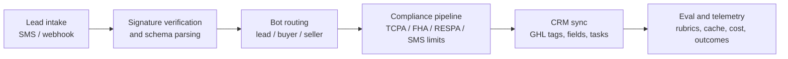

# Lead Qualification Flow Evidence

Use this as the short architecture path in interviews: the backend boundary receives untrusted lead events, validates them, routes them to the correct bot workflow, applies deterministic compliance controls, syncs CRM actions, and leaves evidence for evals and telemetry.
