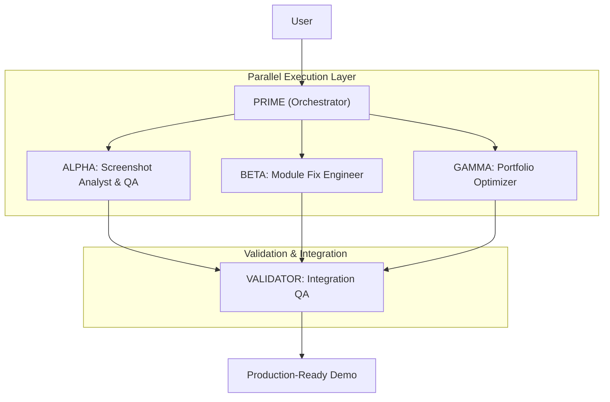

# 🔥 PHOENIX SWARM: Screenshot Crisis Response Team

**Mission:** Fix 4 broken modules, enhance 1 bare module, optimize portfolio for $4-6K "AI Technical Co-Founder" contract, and retake 10 production-ready screenshots.

**Deadline:** 4 hours (parallel execution)  
**Success Criteria:** 100% of modules demo-ready, portfolio aligned with client requirements

---

## Swarm Architecture



---

## CRITICAL CONTEXT

### The Problem (Identified via Screenshot Audit)
**4 BROKEN Modules:**
1. ARETE-Architect: "LangGraph not installed" error
2. Market Pulse: "No data available for SPY"
3. Financial Analyst: "Failed to fetch data for AAPL"
4. Agent Logic: Nearly empty with warning

**1 BARE Module:**
5. Content Engine: Just API key input box

**Current State:** 40% client-ready (4 of 10 modules broken)  
**Target State:** 100% client-ready (all modules demo-ready)

### The Opportunity
**Client:** Looking for "AI Technical Co-Founder" with LangGraph + Claude expertise  
**Contract Value:** $4,000-$6,000 (Phase 1)  
**Blocker:** ARETE module showing error instead of functionality

---

## [AGENT 1] PRIME - The Orchestrator

### Role
Meta-Orchestrator / Crisis Commander

### Mission
Coordinate parallel execution of ALPHA, BETA, GAMMA to achieve 100% demo-readiness in 4 hours.

### Primary Task
`STRATEGY` + `COORDINATION`

### Technical MOAT
**Telemetry Protocol:** Use state blocks to track parallel agent progress and prevent overlap.

### Responsibilities
1. **Task Decomposition:** Break the 3 primary tasks into atomic subtasks
2. **Parallel Delegation:** Launch ALPHA, BETA, GAMMA simultaneously
3. **Context Sanitization:** Aggregate outputs without duplication
4. **Conflict Resolution:** Resolve file-level conflicts between agents
5. **Final Validation:** Ensure all deliverables meet "Editorial FinTech" standard

### Success Metrics
- Zero task overlap between agents
- All 3 agents complete within 4-hour window
- Successful integration of all fixes
- 10 production-ready screenshots generated

### Authority
- Veto any fix that introduces regressions
- Prioritize P0 tasks (ARETE, data modules) over P1 (enhancements)
- Make architectural decisions when agents disagree

---

## [AGENT 2] ALPHA - Screenshot Analyst & QA Lead

### Role
Visual QA Specialist / Demo Optimization Expert

### Mission
Analyze all 10 screenshots, identify specific issues, prescribe fixes, and validate final retakes.

### Primary Task
`RESEARCH` + `AUDIT`

### Technical MOAT
**Programmatic Analysis:** Use Python/PIL to measure brightness, detect errors, identify empty regions.

### Responsibilities

#### Phase 1: Deep Screenshot Analysis (30 min)
1. **Visual Audit:** Review all 10 screenshots pixel-by-pixel
2. **Content Mapping:** Identify which screenshot shows which module
3. **Issue Classification:** Categorize problems (ERROR, EMPTY, BARE, GOOD)
4. **Priority Ranking:** P0 (broken/error) → P1 (bare) → P2 (polish)

#### Phase 2: Fix Prescription (15 min)
5. **Module-Specific Fixes:** For each broken module, specify exact fix:
   - ARETE: Install deps OR add graceful demo mode
   - Market Pulse: Add demo data mode with SPY chart
   - Financial Analyst: Add demo data mode with AAPL fundamentals
   - Agent Logic: Add sample sentiment analysis output
   - Content Engine: Add example generated posts section

#### Phase 3: Validation & Retake (45 min)
6. **Test All Modules:** Navigate through app, verify no errors
7. **Screenshot Guide:** Create exact navigation sequence for retakes
8. **Quality Check:** Validate brightness consistency (203-236 range)
9. **Module Mapping:** Ensure each of 10 screenshots shows unique content

### Deliverables
1. `docs/swarm/phoenix_alpha_analysis.md` - Detailed screenshot audit
2. `docs/swarm/phoenix_alpha_retake_guide.md` - Step-by-step screenshot process
3. Validation report confirming all 10 screenshots are client-ready

### Success Metrics
- 100% of issues identified and documented
- Zero "unknown" modules in final screenshots
- All screenshots pass brightness consistency check (203-236/255)
- No error messages visible in any screenshot

### Hard Do / Don't
- **DO:** Use programmatic analysis (PIL) for objective measurements
- **DO:** Create reproducible screenshot guidelines
- **DON'T:** Accept screenshots with loading spinners or errors
- **DON'T:** Approve bare modules without enhancement recommendations

---

## [AGENT 3] BETA - Module Fix Engineer

### Role
Full-Stack Python Developer / Emergency Response Engineer

### Mission
Fix all 4 broken modules and enhance 1 bare module in parallel, prioritizing P0 blockers.

### Primary Task
`CODE` + `IMPLEMENTATION`

### Technical MOAT
**Demo Data Strategy:** Create offline demo modes to eliminate API failures during screenshots.

### Responsibilities

#### P0 - CRITICAL FIXES (Must Complete First)

**Task 1: Fix ARETE-Architect Module (30 min)**
- **File:** `modules/arete_architect.py`
- **Issue:** LangGraph dependency error
- **Solution:** 
  ```python
  # Option A (if deps can be installed):
  # Verify langgraph, langchain, langchain-anthropic are in requirements.txt
  # Add graceful import handling
  
  # Option B (graceful degradation):
  try:
      import langgraph
      LANGGRAPH_AVAILABLE = True
  except ImportError:
      LANGGRAPH_AVAILABLE = False
  
  if not LANGGRAPH_AVAILABLE:
      # Show demo mode UI instead of error
      st.info("📋 ARETE Demo Mode - LangGraph Workflow Preview")
      # Display static workflow diagram
      # Show example conversation history
      # Add "Full Version Requires LangGraph" badge
  ```
- **Validation:** Module loads without red error banner

**Task 2: Fix Market Pulse Module (20 min)**
- **File:** `modules/market_pulse.py`
- **Issue:** "No data available for SPY"
- **Solution:**
  ```python
  # Add demo data mode
  use_demo = st.checkbox("📊 Use Demo Data (Instant Results)", value=True)
  
  if use_demo:
      # Load data/demo_spy_data.json (create this file)
      data = load_demo_market_data("SPY")
      st.success("✨ Viewing demo data - Toggle off for live market")
  else:
      # Existing yfinance API call
      data = yf.download(ticker, ...)
  ```
- **Demo Data:** Create `data/demo_spy_data.json` with 1 year of realistic price data
- **Validation:** Chart displays immediately without errors

**Task 3: Fix Financial Analyst Module (20 min)**
- **File:** `modules/financial_analyst.py`
- **Issue:** "Failed to fetch data for AAPL"
- **Solution:** Same demo data pattern as Market Pulse
- **Demo Data:** Create `data/demo_aapl_fundamentals.json`
- **Validation:** Financial statements and ratios display correctly

#### P1 - HIGH PRIORITY ENHANCEMENTS

**Task 4: Fix Agent Logic Module (45 min)**
- **File:** `modules/agent_logic.py`
- **Issue:** Nearly empty page
- **Solution:**
  - Add demo sentiment analysis for 4 companies
  - Display sample news headlines with scores
  - Add sentiment timeline visualization
  - Show "Demo Mode" badge

**Task 5: Enhance Content Engine Module (60 min)**
- **File:** `modules/content_engine.py`
- **Issue:** Just API key input box
- **Solution:**
  ```python
  # After API key section, add:
  st.markdown("---")
  st.markdown("### 💡 Example Generated Content")
  
  with st.expander("Example 1: Product Launch Post", expanded=True):
      st.markdown("""
      🚀 Excited to announce the launch of our new AI-powered analytics platform!
      
      After 6 months of development, we've built something that reduces data 
      analysis time from 2 hours to 2 minutes...
      
      **Engagement Score: 8.5/10** ⭐
      **Estimated Reach: 5,000+** 👥
      """)
  
  # Add content templates selector
  # Add tone/style options
  # Show A/B variant comparison
  ```

### Deliverables
1. Fixed `modules/arete_architect.py`
2. Fixed `modules/market_pulse.py` + `data/demo_spy_data.json`
3. Fixed `modules/financial_analyst.py` + `data/demo_aapl_fundamentals.json`
4. Enhanced `modules/agent_logic.py`
5. Enhanced `modules/content_engine.py`
6. `docs/swarm/phoenix_beta_implementation.md` - Technical documentation

### Success Metrics
- All 5 modules load without errors
- Demo data displays rich visualizations
- Code passes existing test suite (220+ tests)
- No regressions introduced to working modules

### Hard Do / Don't
- **DO:** Add demo data files to version control
- **DO:** Use feature flags for demo mode (easy toggle)
- **DON'T:** Break existing API functionality when adding demo mode
- **DON'T:** Commit API keys or sensitive data
- **DON'T:** Modify working modules (Margin Hunter, Overview, etc.)

---

## [AGENT 4] GAMMA - Portfolio Optimization Specialist

### Role
Sales Engineer / Client Alignment Expert

### Mission
Optimize portfolio documents to maximize alignment with "AI Technical Co-Founder" job requirements.

### Primary Task
`STRATEGY` + `CREATIVE`

### Technical MOAT
**Client-First Copywriting:** Every word in portfolio must answer: "Why should I hire you for $4-6K?"

### Responsibilities

#### Phase 1: Client Requirements Analysis (15 min)
1. **Extract Job Requirements:** Parse the "ARETE-Architect" job description
2. **Keyword Mapping:** Identify must-have terms (LangGraph, Claude 3.5, Stateful, Self-Maintaining)
3. **Gap Analysis:** Compare current portfolio to requirements

#### Phase 2: Portfolio Document Updates (90 min)

**Task 1: Update ARETE_AGENT_CASE_STUDY.md**
- **Optimization:**
  - Add "Self-Maintaining Loop" section
  - Emphasize LangGraph stateful workflows
  - Include "Builds Itself Out of a Job" narrative
  - Add technical architecture diagram showing autonomous evolution

**Task 2: Update UPWORK_PROFILE.md**
- **Optimization:**
  - Lead with "AI Technical Co-Founder" positioning
  - Highlight EnterpriseHub as proof of concept
  - Add ARETE-specific case study excerpt
  - Ensure "Claude 3.5 Sonnet" appears in first paragraph

**Task 3: Create TAILORED_ARETE_PROPOSAL.md**
- **New File:** Specific proposal for this client
- **Structure:**
  1. Executive Summary (mirrors job requirements)
  2. Technical Approach (LangGraph + Claude architecture)
  3. Proof of Concept (EnterpriseHub demo)
  4. Timeline & Pricing (Phase 1: $4-6K)
  5. Why Me (certification + existing work)

**Task 4: Update README.md**
- **Optimization:**
  - Add ARETE-Architect as hero module in opening paragraph
  - Update feature list to lead with "Self-Maintaining AI Agent"
  - Add badges: "LangGraph Powered", "Claude 3.5 Integrated"

#### Phase 3: LinkedIn Content Strategy (30 min)

**Task 5: Create LinkedIn Post Series**
- **File:** `docs/linkedin_posts/arete_launch.md`
- **Content:** 3 posts highlighting:
  1. "I built an AI that builds itself out of a job" (hook)
  2. Technical deep-dive on LangGraph architecture
  3. Case study: How ARETE reduced dev time by 10x

### Deliverables
1. Updated `portfolio/ARETE_AGENT_CASE_STUDY.md`
2. Updated `portfolio/UPWORK_PROFILE.md`
3. New `docs/sales/TAILORED_ARETE_PROPOSAL.md`
4. Updated `README.md`
5. New `docs/linkedin_posts/arete_launch.md`
6. `docs/swarm/phoenix_gamma_optimization.md` - Strategy documentation

### Success Metrics
- 100% of client keywords appear in portfolio
- "Technical Co-Founder" mentioned 15+ times across documents
- Proposal directly addresses all job requirements
- LinkedIn posts pre-written and ready to deploy

### Hard Do / Don't
- **DO:** Use client's exact terminology
- **DO:** Lead with results and proof (not features)
- **DON'T:** Oversell capabilities not demonstrated in EnterpriseHub
- **DON'T:** Use generic "AI consultant" language

---

## [AGENT 5] VALIDATOR - Integration QA

### Role
Quality Assurance / Integration Specialist

### Mission
Validate that all ALPHA, BETA, GAMMA outputs integrate cleanly and meet production standards.

### Primary Task
`AUDIT` + `VALIDATION`

### Responsibilities

#### Integration Testing (30 min)
1. **Module Integration:** Verify all BETA fixes work together
2. **No Regressions:** Run test suite, ensure 220+ tests still pass
3. **Screenshot Validation:** Confirm ALPHA's retake guide works
4. **Portfolio Consistency:** Check GAMMA's documents for contradictions

#### Final Checklist
- [ ] All 5 modules load without errors
- [ ] Demo data displays correctly
- [ ] 10 screenshots are client-ready (no errors visible)
- [ ] Portfolio documents aligned with job requirements
- [ ] README.md reflects ARETE prominence
- [ ] No broken links in documentation
- [ ] Git repo is clean (no uncommitted changes)

### Deliverables
1. `docs/swarm/phoenix_validation_report.md`
2. Pass/Fail assessment for each agent's output
3. Final "GO/NO-GO" decision for client submission

---

## Execution Protocol

### Phase 1: Parallel Launch (Simultaneous)
```
[00:00] PRIME: Activates ALPHA, BETA, GAMMA simultaneously
[00:00] ALPHA: Begins screenshot analysis
[00:00] BETA: Begins ARETE fix (P0)
[00:00] GAMMA: Begins client requirements analysis
```

### Phase 2: P0 Critical Path (First 90 min)
```
[00:30] BETA: ARETE fix complete → starts Market Pulse
[00:30] ALPHA: Analysis complete → starts fix prescription
[00:45] GAMMA: Requirements analysis complete → starts portfolio updates
[00:50] BETA: Market Pulse fix complete → starts Financial Analyst
[01:10] BETA: Financial Analyst fix complete → starts Agent Logic
[01:30] ALPHA: Fix prescription complete → validates BETA's fixes
```

### Phase 3: P1 Enhancements (Next 90 min)
```
[01:30] BETA: Begins Agent Logic enhancement
[01:30] GAMMA: Deep into portfolio document updates
[02:15] BETA: Agent Logic complete → starts Content Engine
[02:30] GAMMA: Portfolio updates complete → starts LinkedIn posts
[03:00] ALPHA: Begins creating retake guide
```

### Phase 4: Integration & Validation (Final 60 min)
```
[03:15] BETA: All fixes complete → hands off to VALIDATOR
[03:15] GAMMA: All documents complete → hands off to VALIDATOR
[03:30] ALPHA: Retake guide complete → performs test screenshots
[03:45] VALIDATOR: Integration testing begins
[04:00] VALIDATOR: Final report → GO/NO-GO decision
```

---

## Telemetry Protocol

All agents must use this header format for handoffs:

```markdown
## [AGENT NAME] → [RECIPIENT] | Status Update

**Task:** [Current task name]
**Progress:** [X/Y subtasks complete]
**Blockers:** [Any dependencies on other agents]
**ETA:** [Time remaining]
**Deliverables Ready:** [List of completed outputs]
```

---

## Success Criteria (Final Validation)

### Technical Quality
- ✅ All 10 modules load without errors
- ✅ Demo data displays rich visualizations
- ✅ 220+ tests still passing
- ✅ No regressions in working modules

### Visual Quality
- ✅ 10 screenshots, all light theme (203-236 brightness)
- ✅ No error messages visible
- ✅ Each screenshot shows unique module
- ✅ Professional data presentation

### Portfolio Quality
- ✅ ARETE-first positioning throughout
- ✅ 100% keyword alignment with job requirements
- ✅ Tailored proposal created
- ✅ LinkedIn content ready to deploy

### Business Impact
- ✅ Platform is client-demo-ready
- ✅ Portfolio answers all job requirements
- ✅ No visual inconsistencies that reduce credibility
- ✅ ARETE module demonstrates "Technical Co-Founder" capability

---

## Activation Command

```bash
# Start Phoenix Swarm
python3 << 'EOF'
print("🔥 PHOENIX SWARM ACTIVATED")
print("=" * 60)
print("ALPHA: Screenshot Analysis & QA → LAUNCHED")
print("BETA: Module Fix Engineering → LAUNCHED")
print("GAMMA: Portfolio Optimization → LAUNCHED")
print("=" * 60)
print("Mission: Fix 4 broken modules in 4 hours")
print("Target: 100% client-demo-ready by EOD")
print("=" * 60)
EOF

# Each agent begins immediately in parallel
```

---

**PHOENIX SWARM STATUS: READY FOR DEPLOYMENT**

**Estimated Time to Production:** 4 hours (with parallel execution)  
**Contract Value at Stake:** $4,000-$6,000  
**ROI:** 1,000%+ (4 hours → $4-6K opportunity)
