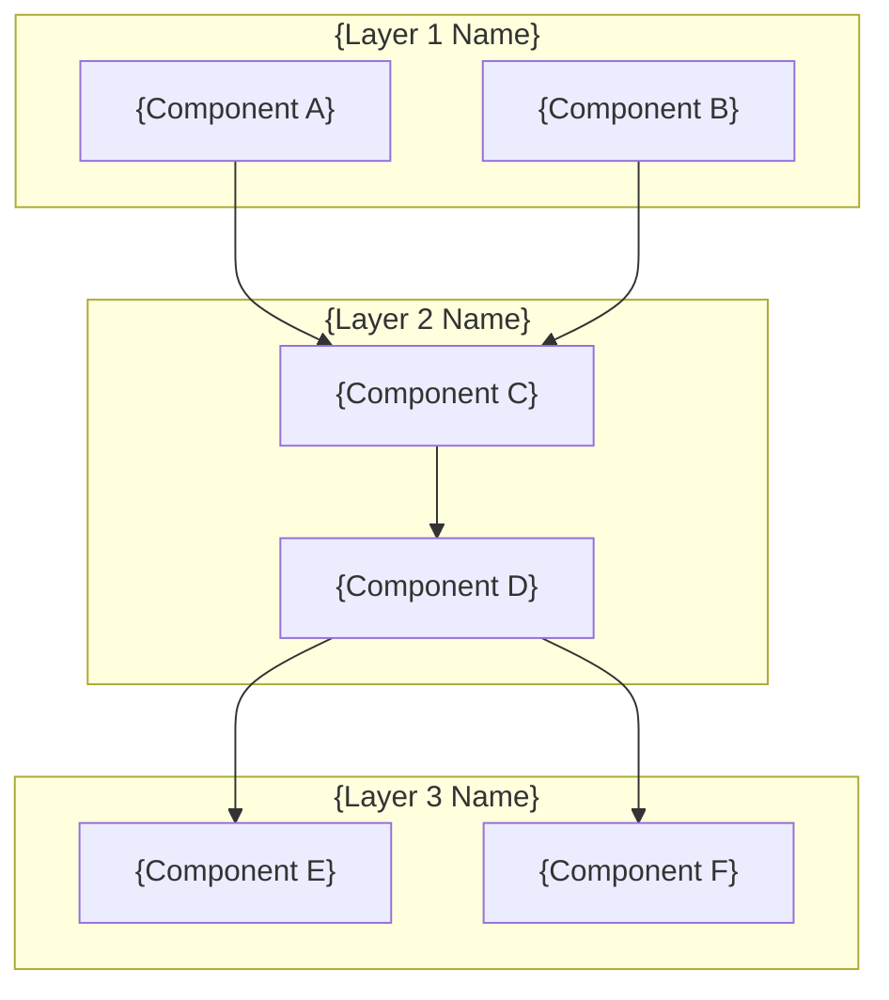

# {Project Name}

> {One-line description of the project and its value proposition}

[](https://github.com/ChunkyTortoise/{repo}/actions)
[](https://www.python.org/)
[]({tests_path})
[](LICENSE)

## What This Solves

- **{Problem 1}** -- {How this project solves it}
- **{Problem 2}** -- {How this project solves it}
- **{Problem 3}** -- {How this project solves it}

## Architecture



## Key Metrics

| Metric | Value | Target |
|--------|-------|--------|
| {Metric 1, e.g., Token cost reduction} | {Value} | {Target} |
| {Metric 2, e.g., Cache hit rate} | {Value} | {Target} |
| {Metric 3, e.g., P95 latency} | {Value} | {Target} |
| Test count | {N} passing | 80%+ coverage |

## Quick Start

```bash
git clone https://github.com/ChunkyTortoise/{repo}.git
cd {repo}
pip install -r requirements.txt

# Demo mode (no API keys required)
{demo_command}
```

### Docker

```bash
docker-compose up -d
# App available at http://localhost:{port}
```

### Full Setup

```bash
cp .env.example .env
# Edit .env with your API keys
{full_setup_commands}
```

## Project Structure

```
{repo}/
├── {main_package}/        # {Description}
│   ├── {subdir}/          # {Description}
│   └── {subdir}/          # {Description}
├── tests/                 # Test suite
├── benchmarks/            # Performance benchmarks
├── docs/                  # Documentation and ADRs
│   └── adr/               # Architecture Decision Records
└── {entry_point}          # Application entry point
```

## Benchmarks

See [BENCHMARKS.md](BENCHMARKS.md) for methodology and results.

```bash
python -m benchmarks.run_all
```

| Benchmark | P50 | P95 | P99 | Target |
|-----------|-----|-----|-----|--------|
| {Benchmark 1} | {ms} | {ms} | {ms} | {target} |
| {Benchmark 2} | {ms} | {ms} | {ms} | {target} |

## Architecture Decisions

| ADR | Title | Status |
|-----|-------|--------|
| [ADR-0001](docs/adr/0001-{slug}.md) | {Title} | Accepted |
| [ADR-0002](docs/adr/0002-{slug}.md) | {Title} | Accepted |

## Testing

```bash
pytest tests/ -v
pytest --cov={package} --cov-report=term-missing
```

## Related Projects

- [{Related 1}](https://github.com/ChunkyTortoise/{repo}) -- {Description}
- [{Related 2}](https://github.com/ChunkyTortoise/{repo}) -- {Description}

## License

MIT -- see [LICENSE](LICENSE) for details.
