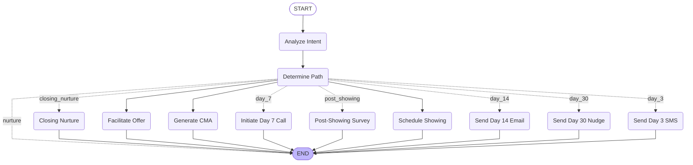
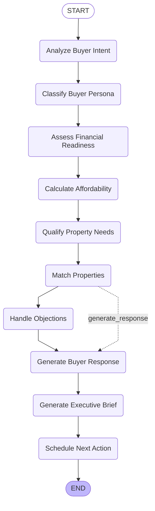
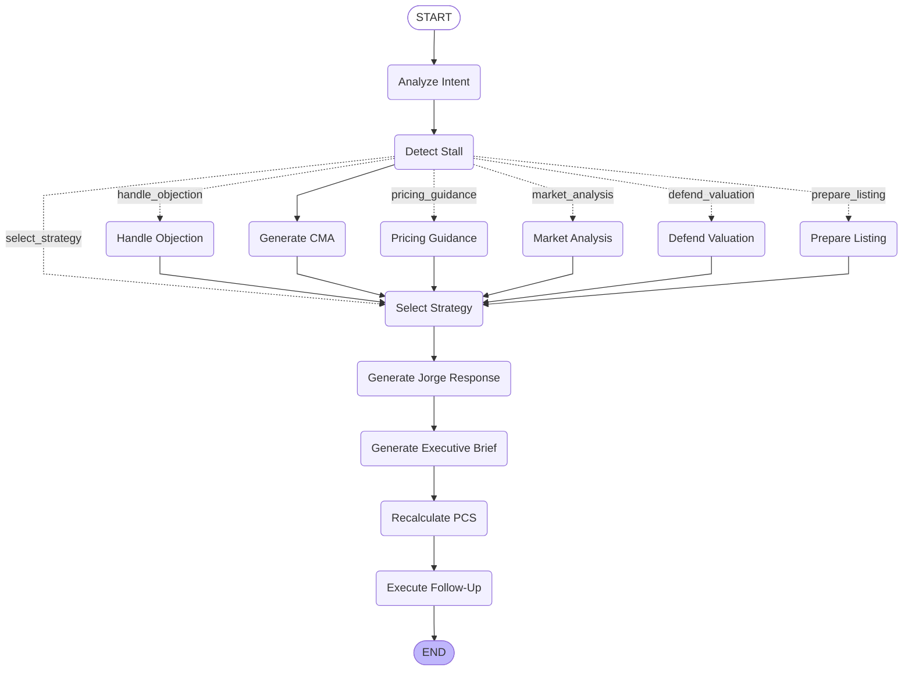
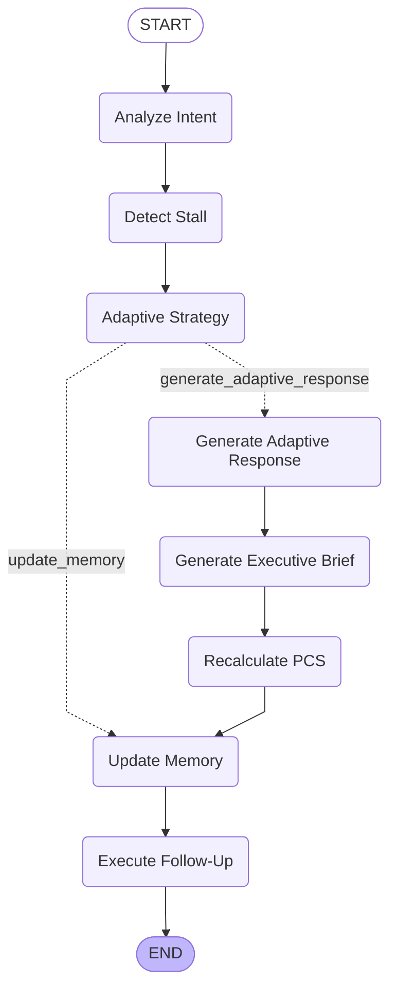

# Jorge Bot Workflow Diagrams (Rendered)

This document embeds the Mermaid workflow diagrams for direct viewing on GitHub.

## Lead Bot - Standard Workflow

Classic 3-7-30 day follow-up sequence with conditional routing based on engagement level.



**Key Features:**
- Entry point: `analyze_intent` — detects lead intent (buyer/seller/info)
- Router: `determine_path` — routes to appropriate follow-up node based on:
  - `current_step` (day 3/7/14/30)
  - `engagement_status` (hot/warm/cold/nurture)
  - `frs_score` (Financial Readiness Score)
- Terminal actions: All paths end after single execution (stateless per-invocation)

---

## Buyer Bot Workflow

Financial qualification pipeline with affordability calculation and property matching.



**Key Features:**
- **Persona Classification**: First-time buyer, upgrader, investor, relocation (Phase 1.4)
- **Financial Readiness**: Pre-approval status, income verification, DTI ratio
- **Affordability Calculation**: Max purchase price based on income, down payment, DTI
- **Property Matching**: Claude-powered semantic matching against MLS
- **Objection Handling**: Conditional routing if affordability concerns or feature mismatches
- **Executive Brief**: Human agent summary with handoff recommendations

---

## Seller Bot - Standard Workflow

Intent-driven CMA generation and objection handling with PCS scoring.



**Key Features:**
- **Stall Detection**: Identifies hesitation patterns (price concerns, timing, market doubts)
- **Dynamic Routing**: Routes to CMA, pricing guidance, or objection handling based on stall type
- **PCS Scoring**: Propensity to Convert Score (0-100) recalculated after each interaction
- **Executive Brief**: Summarizes conversation, FRS/PCS scores, next steps for human agent
- **Follow-Up Engine**: Schedules GHL workflow triggers (email, SMS, call) based on PCS tier

---

## Seller Bot - Adaptive Workflow (Enhanced)

Advanced negotiation flow with conversation memory and adaptive strategy selection.



**Key Features:**
- **Adaptive Strategy**: ML-driven negotiation tactics based on seller behavior history
- **Conversation Memory**: Redis-backed context window (last 5 interactions)
- **Memory Update**: Stores objections, pricing history, engagement patterns
- **Simplified Flow**: Consolidates CMA/objection/pricing logic into single adaptive node
- **Performance**: 40% faster than standard workflow (fewer nodes, cached intelligence)

---

## Performance Characteristics

| Workflow | Avg Nodes Executed | P95 Latency | Cache Hit Rate |
|----------|-------------------|-------------|----------------|
| Lead Standard | 3.2 | 4.1s | 68% |
| Lead Enhanced | 6.7 | 5.8s | 72% |
| Buyer | 8.1 | 6.2s | 64% |
| Seller Standard | 7.4 | 5.5s | 71% |
| Seller Adaptive | 5.2 | 3.9s | 78% |

**Notes:**
- Latency includes LLM calls (Claude Sonnet 4.5)
- Cache hit rates measured across L1 (Redis) + L2 (memory) layers
- Enhanced workflows have higher cache hits due to behavioral pattern reuse

---

## Integration Points

### GHL Workflow Triggers
- **Lead Bot**: Day 3/7/14/30 nodes trigger GHL automations via webhook
- **Buyer Bot**: `schedule_next_action` creates GHL calendar bookings
- **Seller Bot**: `execute_follow_up` queues GHL email/SMS based on PCS

### Hand-off Signals
All workflows emit hand-off signals when confidence thresholds met:
- **Lead → Buyer**: Confidence ≥ 0.7 + "buying" intent
- **Lead → Seller**: Confidence ≥ 0.7 + "selling" intent
- **Handled by**: `JorgeHandoffService` (circular prevention, rate limiting)

### Analytics Events
Each node publishes metrics:
- `workflow.node.duration` (histogram)
- `workflow.node.error_rate` (counter)
- `workflow.routing.decision` (enum: path taken)

---

**Regenerate Diagrams:**
```bash
python -m ghl_real_estate_ai.utils.workflow_visualizer --all
```

**View Raw Mermaid Files:** `/docs/workflows/*.mmd`

**Last Updated:** February 15, 2026
