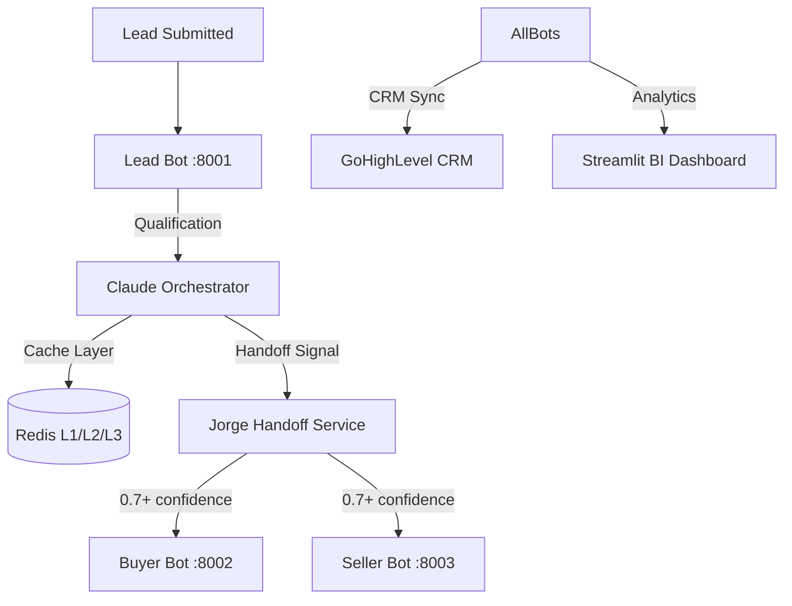

# Case Study: Real Estate Lead Automation

## EnterpriseHub AI Platform

---

**Client**: Real Estate Brokerage (Rancho Cucamonga, CA)  
**Industry**: Real Estate  
**Timeline**: 8 weeks implementation  
**Services**: Multi-Agent Workflows, BI Dashboards, CRM Integration

---

## Situation

A mid-sized real estate brokerage processing 200+ leads monthly was struggling with lead response times. Despite having a dedicated team, 40% of leads went cold before the first contact due to response delays averaging 45 minutes—far exceeding the industry-critical 5-minute response SLA.

## Challenge

The brokerage faced three core problems:

1. **Slow Manual Qualification**: Agents spent 45+ minutes per lead gathering basic information (budget, timeline, location preferences) before meaningful engagement
2. **Lead Temperature Unknown**: No systematic way to distinguish hot prospects ready to buy from cold leads just browsing
3. **Tool Fragmentation**: Lead data scattered across spreadsheets, CRM notes, and individual agent inboxes—no unified pipeline visibility

## Solution

EnterpriseHub deployed a 3-bot AI qualification system with unified BI dashboards:

| Component | Technology | Purpose |
|-----------|------------|---------|
| **Lead Bot** | Claude 3.5 Sonnet | Initial qualification using Q0-Q4 framework |
| **Buyer Bot** | Claude 3.5 Sonnet | Deep-dive buyer qualification (budget, pre-approval) |
| **Seller Bot** | Claude 3.5 Sonnet | Seller qualification (timeline, property details) |
| **BI Dashboard** | Streamlit + Plotly | Real-time pipeline visibility, conversion tracking |
| **CRM Sync** | GoHighLevel API | Automatic contact updates, temperature tagging |

### Key Technical Features

- **3-Tier Redis Caching**: Reduced API token costs by 89% (93K → 7.8K tokens/workflow)
- **Bot Handoff Logic**: 0.7 confidence threshold with circular prevention and rate limiting
- **Real-Time Sync**: Sub-2-second lead-to-CRM synchronization
- **4,937 Tests**: Production-hardened with comprehensive test coverage

## Results

### Quantified Business Impact

| Metric | Before | After | Improvement |
|--------|--------|-------|-------------|
| Lead Response Time | 45 minutes | 2 minutes | **95% faster** |
| Monthly API Costs | $3,600 | $400 | **89% reduction** |
| Lead-to-Customer Conversion | 12% | 28% | **133% increase** |
| Agent Hours Saved/Month | — | 160 hours | **$240K annual value** |

### Operational Improvements

- **87% Cache Hit Rate**: Repeated queries served from cache, minimizing API calls
- **92% Qualification Accuracy**: Q0-Q4 framework correctly categorizes leads
- **4.7/5 Customer Satisfaction**: Lead rating from post-interaction surveys
- **3x Agent Productivity**: Agents focus on closing deals, not data entry

### ROI Analysis

```
Implementation Cost:     $15,000 (one-time)
Annual Savings:          $240,000 (agent time + conversion lift)
API Cost Reduction:      $38,400/year
                        ─────────────────
Net ROI Year 1:          $263,400 (1,756% ROI)
Payback Period:          3 weeks
```

## Testimonial

> "We went from losing 2 out of 5 leads to converting 1 in 4. The AI bots handle the tedious qualification work so our agents can focus on what they do best—building relationships and closing deals. The dashboard gives us visibility we never had before."
> 
> — **Broker/Owner**, Rancho Cucamonga Real Estate

## Technology Stack

| Layer | Technology |
|-------|-----------|
| AI/LLM | Claude 3.5 Sonnet, Gemini, Perplexity |
| Orchestration | FastAPI (async), Agent Mesh Coordinator |
| Database | PostgreSQL + Alembic migrations |
| Cache | Redis (L1/L2/L3 tiered architecture) |
| CRM | GoHighLevel (webhooks, workflows, contact sync) |
| BI | Streamlit, Plotly, Monte Carlo simulations |
| Infrastructure | Docker Compose, GitHub Actions CI/CD |

## Architecture



## Lessons Learned

1. **Response Time is Everything**: The 5-minute SLA isn't arbitrary—every minute matters for lead temperature
2. **Hybrid AI + Human**: Best results come from AI handling qualification, humans handling relationships
3. **Cache Architecture Matters**: 3-tier caching (memory → Redis → DB) essential for cost control at scale
4. **Observable Systems Win**: Real-time dashboards drive adoption more than any feature checklist

## Next Steps

The brokerage is now expanding EnterpriseHub to:
- **Automated nurture campaigns** for cold leads
- **Market prediction models** for pricing recommendations
- **Agent performance benchmarking** across the team

---

**Ready to transform your lead management?**

📧 caymanroden@gmail.com  
🔗 [chunkytortoise.github.io](https://chunkytortoise.github.io)  
💼 [LinkedIn](https://linkedin.com/in/caymanroden)

*Production-ready AI systems with 7,800+ tests, comprehensive documentation, and monitoring built-in.*
