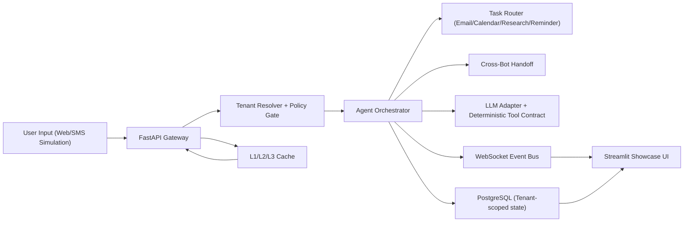

# Showcase Asset Technical Specification

## 0) Scope, Framing, and Date Alignment

- **Asset Name**: `EnterpriseHub Interview Showcase`
- **Tagline**: `Production-grade multi-tenant AI orchestration in one local demo`
- **Interview Targets**:
  - **Kialash interview focus**: multilingual, multi-channel, multi-tenant agent architecture
  - **Chase interview focus**: AI secretary workflow orchestration, routing, approvals, scheduling
- **Date alignment note**: `February 11, 2026` is **Wednesday** (not Tuesday). `February 12, 2026` is Thursday.
- **Delivery constraint**: buildable in a 48-hour window with **16-20 hours active implementation**.

---

## 1) Project Overview

### Project Name and Elevator Pitch

- **Project**: `AgentBridge Showcase`
- **Elevator pitch (2 sentences)**:
  - AgentBridge is a local-first, Dockerized showcase that demonstrates multilingual, multi-tenant AI orchestration with deterministic task routing and measurable performance/cost controls. It combines a real-time demo UI, policy guardrails, and production-style testing so interviewers can see working systems, not slideware.

### Target Audience

- Technical interviewers evaluating architecture depth
- Hiring managers looking for delivery confidence and product thinking
- Clients who need practical proof of multi-tenant AI reliability

### Value Proposition

- Shows a working **multi-agent orchestration + guardrail + observability** loop
- Demonstrates **both** interview requirements in one cohesive artifact
- Proves performance claims with live metrics (latency, cache hit rate, cost savings)
- Runs locally with one command (`docker compose up`) to reduce demo risk

---

## 2) Architecture Design

### High-Level Components

- **API Layer (FastAPI)**
  - Receives inbound messages/tasks
  - Performs tenant resolution and policy checks
  - Routes work into orchestrator
- **Orchestration Layer**
  - Agent/task routing, handoffs, and deterministic tool-call contracts
  - Task classification for assistant flows (email/calendar/research/reminder)
- **Memory + Caching Layer**
  - L1 in-process cache
  - L2 Redis cache
  - L3 persisted/semantic cache where useful
- **Policy + Guardrails Layer**
  - Tenant hard scoping
  - Input/output safety checks and anti-hallucination patterns
  - Tool permission boundaries by task class
- **Data Layer (PostgreSQL)**
  - Tenant metadata, conversation state, task logs, handoff outcomes
- **Realtime Layer (WebSocket)**
  - Live event stream for dashboard updates
- **Demo UI (Streamlit)**
  - Scenario runner + metrics board + architecture explorer

### Data Flow



### Technology Stack (with Rationale)

- **FastAPI**: fast iteration, async support, strong typing
- **PostgreSQL**: reliable tenant isolation and auditable persistence
- **Redis**: low-latency caching and event/state support
- **Streamlit**: fastest path to polished technical demo UI
- **Pytest + GitHub Actions**: production-quality signal with minimal setup friction
- **Docker Compose**: deterministic local demo environment

### Scalability Considerations

- Stateless API + horizontal scale path
- Redis-backed cache and queue/event extensions
- Tenant partitioning patterns for DB reads/writes
- WebSocket manager with heartbeat and filtered subscriptions

### Security Design

- Tenant context required on all request paths
- Row/record-level tenant checks in repositories/services
- Secrets from env vars only; no keys in repo
- Request validation (Pydantic) + strict tool schemas
- Structured audit logs for tenant access and tool executions

---

## 3) Core Features (Prioritized)

### P0 (Must-Have)

1. **Feature**: Tenant-Scoped Request Gateway  
   **Priority**: P0  
   **Targets**: Both  
   **Description**: Every request is bound to tenant context and blocked if cross-tenant access is attempted.  
   **Why Impressive**: Shows practical multi-tenant safety, not just conceptual isolation.  
   **Implementation**:
   - Request middleware resolves `tenant_id`
   - Repository layer enforces tenant filters
   - Add explicit cross-tenant denial tests
   **Demo Script**:
   - Run request with valid tenant -> success
   - Replay with mismatched tenant token/context -> blocked + logged
   **Success Metrics**: 100% cross-tenant denial in tests
   **Dev Time**: 2.0h

2. **Feature**: Deterministic Task Router (Secretary Mode)  
   **Priority**: P0  
   **Targets**: Chase (primary), Both (secondary)  
   **Description**: Classifies inbound intents into `calendar`, `email`, `research`, `reminder` and emits deterministic tool plans.  
   **Why Impressive**: Converts “AI assistant” from chat to actionable orchestration.  
   **Implementation**:
   - Lightweight classifier + fallback rules
   - Strict typed `TaskPlan` output schema
   - Confidence threshold + fallback to approval queue
   **Demo Script**:
   - “Draft reply and schedule 30-min sync next week” -> split tasks with explicit plan
   **Success Metrics**: >=95% routing accuracy on seeded examples
   **Dev Time**: 3.0h

3. **Feature**: Multilingual Intent + Response Pipeline  
   **Priority**: P0  
   **Targets**: Kialash (primary), Both (secondary)  
   **Description**: Detect language (EN/ES/FR/HE initial set), mirror safe response style, preserve tenant constraints.  
   **Why Impressive**: Real multi-language operations tied to orchestration and compliance.  
   **Implementation**:
   - Fast language detection + confidence fallback
   - Route through response post-processing stages
   - Add language mirror stage and metadata logging
   **Demo Script**:
   - Spanish input -> Spanish response + language tag + latency line
   **Success Metrics**: >=95% correct language tagging on demo corpus
   **Dev Time**: 2.5h

4. **Feature**: Cross-Bot Handoff with Circular Prevention  
   **Priority**: P0  
   **Targets**: Kialash (primary), Both (secondary)  
   **Description**: Handoff between specialist bots with thresholds, rate limits, and loop prevention.  
   **Why Impressive**: Demonstrates real multi-agent reliability edge cases.  
   **Implementation**:
   - Use existing handoff service and expose visible handoff timeline
   - Add route-level analytics + blocked-loop events
   **Demo Script**:
   - Lead -> Buyer handoff + prevented bounce-back loop
   **Success Metrics**: 0 circular handoff loops in integration tests
   **Dev Time**: 2.0h

5. **Feature**: Live Metrics Panel (Latency/Cache/Cost)  
   **Priority**: P0  
   **Targets**: Both  
   **Description**: Dashboard with request latency, cache hit rate, and estimated token/cost savings.  
   **Why Impressive**: Quantifies engineering value in real time.  
   **Implementation**:
   - Pull counters from cache analytics + orchestrator timings
   - Show P50/P95 and rolling hit-rate
   **Demo Script**:
   - Repeat prompt twice -> show cache hit and cost delta
   **Success Metrics**: Live updates <1s lag; stable metrics output
   **Dev Time**: 2.0h

### P1 (Should-Have)

6. **Feature**: Approval Workflow for High-Risk Actions  
   **Priority**: P1  
   **Targets**: Chase (primary), Both (secondary)  
   **Description**: Email send/schedule actions require user approval if confidence low or risk high.  
   **Why Impressive**: Shows safe automation and human-in-the-loop maturity.  
   **Implementation**:
   - `PENDING_APPROVAL` state + approve/reject endpoint
   - UI approval queue with event stream updates
   **Demo Script**:
   - Draft generated -> user approves -> task executes
   **Success Metrics**: 100% risky actions gated when threshold triggered
   **Dev Time**: 2.0h

7. **Feature**: WebSocket Demo Event Stream  
   **Priority**: P1  
   **Targets**: Both  
   **Description**: Real-time event feed for router decisions, handoffs, and policy events.  
   **Why Impressive**: Shows observability and system transparency under live interaction.  
   **Implementation**:
   - Reuse WebSocket manager with tenant-filtered channels
   - Stream typed event payloads to UI
   **Demo Script**:
   - Trigger scenario -> watch event timeline update live
   **Success Metrics**: >99% message delivery in local test run
   **Dev Time**: 1.5h

8. **Feature**: “No Cross-Tenant Data Leak” Validation Suite  
   **Priority**: P1  
   **Targets**: Kialash  
   **Description**: Test battery proving strict tenant scoping in routing, retrieval, and persistence.  
   **Why Impressive**: Addresses one of the highest-risk enterprise concerns directly.  
   **Implementation**:
   - Dedicated integration tests with two synthetic tenants
   - Assertion set for blocked reads/writes
   **Demo Script**:
   - Show green test suite section in UI/CLI
   **Success Metrics**: 100% pass on leak-prevention tests
   **Dev Time**: 1.5h

### P2 (Nice-to-Have)

9. **Feature**: Replayable Demo Scenario Runner  
   **Priority**: P2  
   **Targets**: Both  
   **Description**: One-click scripts that replay predefined interview scenarios.  
   **Why Impressive**: Reduces demo risk; deterministic and repeatable.  
   **Implementation**:
   - Seed fixtures + UI buttons + reset endpoint
   **Demo Script**:
   - Click “Run Kialash Scenario” and narrate outputs
   **Success Metrics**: Scenario completes end-to-end in <90s
   **Dev Time**: 1.0h

10. **Feature**: Architecture Drilldown Page (Code-to-Component links)  
    **Priority**: P2  
    **Targets**: Both  
    **Description**: Interactive architecture map linking components to key source files and tests.  
    **Why Impressive**: Helps technical interviewers verify depth quickly.  
    **Implementation**:
    - Mermaid diagram + expandable file references
    **Demo Script**:
    - Click router box -> show route planner + tests
    **Success Metrics**: <30s to navigate from architecture to code proof
    **Dev Time**: 0.75h

### Time Summary

- **P0 total**: 11.5h
- **P1 total**: 5.0h
- **P2 total**: 1.75h
- **Total**: **18.25h** (fits 16-20h target)

---

## 4) Scripted Demo Scenarios

### Scenario A: Kialash (Multilingual + Multi-Tenant)

- **Goal**: Prove multilingual routing + strict tenant isolation + agent handoff reliability.

1. Start with tenant `alpha-realty`, language `Spanish` input.
   - Say: “This demo starts with tenant-scoped context and live multilingual detection.”
   - System: Detects `es`, routes to language-aware prompt path.
2. Trigger lead-to-buyer handoff.
   - Say: “Now we escalate intent to buyer specialist and preserve context.”
   - System: Handoff event emitted; loop-prevention checks active.
3. Attempt cross-tenant query using `beta-homes` resource id while in `alpha-realty`.
   - Say: “Here’s a forced isolation violation test.”
   - System: Request blocked, policy event logged.
4. Show metrics panel.
   - Say: “Notice latency, handoff count, and zero leakage incidents.”

- **Metrics to call out**:
  - cross-tenant denial: 100%
  - handoff loop prevention: 0 loops
  - response latency target: P95 < 250ms orchestration overhead (local)

### Scenario B: Chase (AI Secretary Task Routing)

- **Goal**: Prove deterministic workflow orchestration with approvals.

1. Input: “Draft a reply to Alex, then schedule 30 min Thursday afternoon.”
   - Say: “We decompose one message into deterministic tasks.”
   - System: Router outputs `email_draft` + `calendar_schedule` plan.
2. Approval gate for outbound action.
   - Say: “High-impact actions are gated by policy.”
   - System: Shows pending approval card.
3. Approve action.
   - Say: “Approved actions proceed and are auditable.”
   - System: Executes plan, emits completion event stream.
4. Open task timeline and cost panel.
   - Say: “Everything is traceable: decision, action, and cost.”

- **Metrics to call out**:
  - routing accuracy on fixtures >=95%
  - approval-gated risky actions: 100%
  - end-to-end plan completion <2s locally (excluding external API wait)

### Scenario C: Technical Deep-Dive

- **Goal**: Show engineering maturity and maintainability.

1. Architecture page: component map -> file references
2. Test page: unit + integration + isolation tests
3. Benchmark page: cache benefit and latency profile
4. Docker page: `docker compose up` workflow and health checks

- **Narrative anchors**:
  - “Production patterns intentionally constrained for 48-hour delivery”
  - “Depth over breadth: hard guarantees first, polish second”

---

## 5) UI/UX Design

### Recommended UI

- **Choose**: `Streamlit multi-page app`
- **Why**:
  - Fastest to production-quality demo in 48 hours
  - Supports interactive controls, charts, and scenario scripting
  - Easy local boot alongside FastAPI backend

### Page Structure

1. `Overview`
   - Elevator pitch, architecture summary, key metrics cards
2. `Live Demo`
   - Message input, tenant selector, language selector, routed task output
3. `Metrics`
   - Cache hit rate, latency percentiles, task volume, approval stats
4. `Architecture`
   - Mermaid diagrams + component-to-file links
5. `Quality`
   - Test status snapshot, coverage target, CI checks

### Visual Design Guidelines

- Neutral professional theme, high contrast, consistent spacing
- Use color coding only for states (success/warn/block)
- Keep animation minimal; prioritize speed and legibility
- Show evidence near claims (metric next to feature)

---

## 6) Technical Implementation Plan

### Phase 1: Core Infrastructure (4.0h)

- Bootstrap `showcase` package with API + Streamlit shells
- Wire Docker Compose (`api`, `redis`, `postgres`, `ui`)
- Add tenant context middleware + base models
- Add environment templates and health endpoints

### Phase 2: Feature Development (8.5h)

- Implement deterministic task router + schema
- Integrate multilingual detection + response pipeline stage
- Integrate cross-bot handoff + circular prevention hooks
- Integrate cache metrics + cost estimator

### Phase 3: Demo Polish (3.5h)

- Build scenario runner and scripted buttons
- Add architecture and quality pages
- Seed deterministic fixtures for both interview tracks
- Add speaker notes in markdown blocks per scenario

### Phase 4: Deployment & Validation (2.25h)

- Finalize compose boot and smoke checks
- Run unit/integration tests and record metrics
- Rehearse demo flow twice end-to-end
- Prepare fallback mode (recorded command/scripted replay)

### Parallel Workstreams

- While backend routes are built, UI pages can be scaffolded in parallel
- Tests can be added per feature slice to avoid end-of-day crunch

### Buffer

- Keep **1.75h contingency** inside the 20h window for integration surprises

---

## 7) Code Quality Standards

### Testing

- **Framework**: `pytest`
- **Types**:
  - Unit: router logic, policy guards, response stages
  - Integration: tenant isolation, handoff flows, websocket events
- **Coverage target**: `>=80%` on showcase package
- **Must-pass suites**:
  - `test_tenant_isolation.py`
  - `test_task_router.py`
  - `test_handoff_loop_prevention.py`

### Documentation

- README with quick start, architecture, demo script, metrics
- API contract doc (route inputs/outputs)
- concise docstrings for non-trivial orchestration logic

### CI/CD

- GitHub Actions checks:
  - lint (`ruff`)
  - format check (`black --check`)
  - type check (`pyright` or `mypy`)
  - tests (`pytest -q`)

### Code Style

- Python 3.11+
- Typed public interfaces
- Pydantic models for all external IO
- No hidden side effects in routing logic

### Security

- `.env` only; no hardcoded secrets
- Strict tenant checks at API and data boundaries
- Input validation and bounded payload sizes
- Audit logging for all privileged actions

### Performance

- Log orchestration latency per request
- Track cache hits/misses and estimated cost savings
- Include lightweight benchmark script for demo data

---

## 8) Reusable Components from EnterpriseHub

### 1) Agent Orchestration Logic

- **Extract from**:
  - `ghl_real_estate_ai/services/agent_mesh_coordinator.py`
  - `utils/orchestrator.py`
- **Refactor/Simplify**:
  - Keep task submission, prioritization, and routing primitives
  - Remove non-demo integrations (advanced skills, external service hooks)
- **Leave behind**:
  - Full production governance knobs not needed for interview demo
- **New abstraction**:
  - `showcase/orchestration/task_router.py` with deterministic task classes

### 2) Caching Layer (Redis + semantic options)

- **Extract from**:
  - `src/caching/redis_client.py`
  - `src/caching/query_cache.py`
  - `src/caching/analytics.py`
  - `ghl_real_estate_ai/services/semantic_cache_service.py`
- **Refactor/Simplify**:
  - Keep hit/miss analytics and one semantic cache path
  - Standardize cache key schema to `tenant:{id}:...`
- **Leave behind**:
  - Heavy multi-mode cache warming routines
- **New abstraction**:
  - `showcase/cache/cache_facade.py`

### 3) Multi-Strategy Response Parsing / Post-Processing

- **Extract from**:
  - `ghl_real_estate_ai/services/jorge/response_pipeline/pipeline.py`
  - `ghl_real_estate_ai/services/jorge/response_pipeline/stages/language_mirror.py`
  - `ghl_real_estate_ai/services/jorge/response_pipeline/stages/compliance_check.py`
- **Refactor/Simplify**:
  - Keep staged processor pattern and short-circuit behavior
  - Reduce to language + compliance + formatting stages
- **Leave behind**:
  - Niche domain-specific messaging stages
- **New abstraction**:
  - `showcase/response/processor.py`

### 4) Cross-Bot Handoff + Circular Prevention

- **Extract from**:
  - `ghl_real_estate_ai/services/jorge/jorge_handoff_service.py`
- **Refactor/Simplify**:
  - Keep thresholds, rate limits, circular window
  - Expose deterministic “handoff decision trace” output
- **Leave behind**:
  - Deep CRM tagging details unrelated to demo
- **New abstraction**:
  - `showcase/orchestration/handoff_service.py`

### 5) WebSocket Connection Management

- **Extract from**:
  - `ghl_real_estate_ai/services/websocket_server.py`
- **Refactor/Simplify**:
  - Keep event typing, heartbeat, tenant filtering
  - Trim rarely used event types
- **Leave behind**:
  - Large taxonomy of domain events not needed in showcase
- **New abstraction**:
  - `showcase/realtime/events.py`

### 6) Database Models and Migrations

- **Extract from**:
  - `ghl_real_estate_ai/services/enterprise_tenant_service.py`
  - `alembic/versions/2026_02_08_003_add_handoff_outcomes_table.py`
  - `database/migrations/001_initial_migration.sql`
- **Refactor/Simplify**:
  - Keep tenant, task, handoff_outcome, audit_log tables
  - Flatten optional enterprise metadata for speed
- **Leave behind**:
  - Full billing and premium feature matrix
- **New abstraction**:
  - `showcase/db/models.py`

### 7) Testing Fixtures and Utilities

- **Extract from**:
  - `tests/conftest.py`
  - `tests/fixtures/comprehensive_agent_fixtures.py`
  - `tests/fixtures/jorge_handoff_seed_data.json`
- **Refactor/Simplify**:
  - Keep deterministic tenant/test message fixtures
  - Add interview-specific scenario fixtures
- **Leave behind**:
  - Broad legacy fixtures unrelated to showcase scope
- **New abstraction**:
  - `showcase/tests/fixtures.py`

---

## 9) README Template (Complete Structure)

```md
# AgentBridge Showcase


## What This Is
2-sentence overview of multilingual, multi-tenant AI orchestration + secretary task routing.

## Quick Start
```bash
docker compose up --build
```

Open:
- API: http://localhost:8000/docs
- UI: http://localhost:8501

## Architecture
(Insert Mermaid diagram)
- API Gateway
- Tenant Policy Guard
- Task Router + Handoff
- Cache + Metrics
- WebSocket Event Stream

## Core Features
- [P0] Tenant-scoped gateway
- [P0] Deterministic secretary routing
- [P0] Multilingual response pipeline
- [P0] Cross-bot handoff loop prevention
- [P0] Live latency/cache/cost metrics

## Demo Instructions
### Scenario A (Kialash)
Step-by-step commands + expected output

### Scenario B (Chase)
Step-by-step commands + expected output

### Scenario C (Deep Dive)
Architecture + tests + benchmarks

## Performance Metrics
- Cache hit rate target
- Latency target (P95)
- Routing accuracy target

## Tech Stack
FastAPI, PostgreSQL, Redis, Streamlit, Pytest, Docker Compose

## Project Structure
```text
showcase/
  api/
  orchestration/
  response/
  cache/
  realtime/
  db/
  ui/
  tests/
```

## Development
```bash
pip install -r requirements-dev.txt
pytest -q
ruff check .
black --check .
```

## Testing
List core suites and what each validates.

## License
MIT
```

---

## 10) Success Criteria

### Functional

- All P0 features fully demoable
- At least 2 full scripted scenarios run end-to-end
- Tenant isolation guard is enforced and demonstrable

### Performance

- Orchestration overhead P95 <250ms local target
- Cache hit rate visible and improves on repeated requests
- Scenario completion under 90s with deterministic fixtures

### Quality Gates

- Tests passing in CI
- >=80% coverage on showcase package
- Lint/format/type checks green

### Demo Readiness

- Can run from cold start with `docker compose up --build`
- Can recover quickly using scripted scenario replay
- Presenter notes prepared for each scenario

### Documentation

- README complete
- Architecture diagram included
- Endpoint and scenario docs included

---

## 11) Risk Mitigation

1. **Risk**: Scope bloat prevents completion  
   **Mitigation**: Freeze on P0 by hour 8; P1 only if P0 green.

2. **Risk**: Docker issues on interview day  
   **Mitigation**: Keep one canonical compose file, run full cold-start rehearsal twice, keep `make demo-smoke` script.

3. **Risk**: Live demo breakage  
   **Mitigation**: Include deterministic scenario runner + seeded fixtures + fallback prerecorded CLI output.

4. **Risk**: External API instability  
   **Mitigation**: Provide local mock mode for LLM/tool endpoints with deterministic responses.

5. **Risk**: Cross-tenant leakage bug  
   **Mitigation**: Mandatory isolation integration tests and runtime assertions in middleware/repositories.

6. **Risk**: Performance claims not reproducible  
   **Mitigation**: Build benchmark script with fixed dataset and publish sample result table in README.

7. **Risk**: Too complex narrative during interview  
   **Mitigation**: Use 3 fixed demo scripts with strict time boxes (3 min, 3 min, 2 min).

---

## 12) Post-Interview Follow-Up Plan

1. Share GitHub repo link with short “what to look at first” section.
2. Send 3-5 minute Loom walkthrough using the same scenarios from interview.
3. Include one-page architecture image and benchmark summary in follow-up message.
4. Publish lightweight deployment (optional) for async reviewer testing.
5. Add a short technical write-up: design decisions, tradeoffs, and future roadmap.

---

## 13) Execution Checklist (Immediate)

- [ ] Create showcase branch and scaffold package
- [ ] Wire compose and health checks
- [ ] Implement P0 features in order: isolation -> router -> multilingual -> handoff -> metrics
- [ ] Build scenario runner and two interview scripts
- [ ] Run tests + smoke + rehearsal
- [ ] Final README + diagram + follow-up assets

If this sequence is followed, the showcase will be interview-ready inside the 16-20 hour implementation target.
