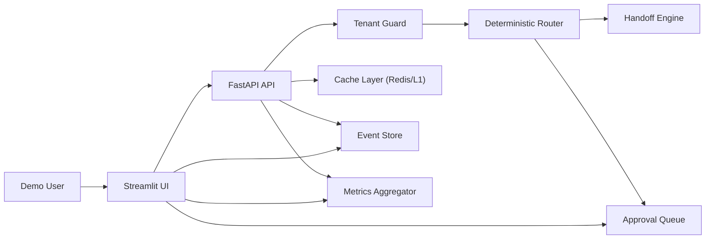
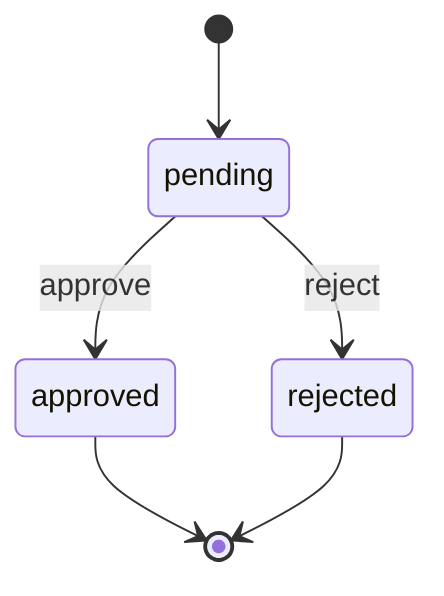

# AgentBridge Showcase: Comprehensive Full Development Specification

## 1. Document Control

- Project: AgentBridge Interview Showcase
- Repository root: `/Users/cave/Documents/GitHub/EnterpriseHub`
- Current implementation root: `/Users/cave/Documents/GitHub/EnterpriseHub/interview_showcase`
- Spec version: 1.0
- Date: February 10, 2026
- Audience: Engineering, interview prep owner, reviewers

## 2. Executive Summary

This specification defines the full development plan for a production-style interview showcase that demonstrates:

- Multi-tenant safety with hard isolation controls
- Deterministic AI task routing for secretary workflows
- Multilingual handling (EN/ES/FR/HE)
- Cross-bot handoff with circular prevention
- Approval-gated high-risk actions
- Live metrics and event observability
- Dockerized local deployment with automated tests

The goal is to evolve the existing working prototype into a fully documented, test-hardened, extensible system suitable for live technical demos and post-interview handoff.

## 3. Business Objectives

1. Demonstrate technical depth within first 30-60 seconds of demo.
2. Prove reliability and safety (tenant isolation, approval gates, loop prevention).
3. Demonstrate measurable engineering outcomes (latency, cache hit rate, cost savings).
4. Support two target interview narratives in one artifact:
- Kialash: multilingual, multi-tenant, anti-hallucination, deterministic routing.
- Chase: secretary workflow, task decomposition, approval workflow.

## 4. Product Scope

### 4.1 In Scope (V1 Full Dev)

- API backend with deterministic behavior
- Streamlit multi-tab demo interface
- Approval queue and approval decisions
- Scenario replay endpoints (Kialash/Chase)
- Metrics/event endpoints
- Redis-backed cache with in-memory fallback
- Test suite (unit/integration/API)
- Docker Compose local run
- CI workflow and quality gates
- Architecture documentation and demo runbook

### 4.2 Out of Scope (V1)

- Real Gmail/Outlook OAuth live integration
- Real calendar provider integration
- External SaaS deployment automation
- Multi-region/high-availability production infra
- Real LLM provider dependencies in default demo path

### 4.3 V1.5 Optional Extensions

- Mock Gmail/Calendar adapters with realistic payloads
- WebSocket push channel for live event stream
- Playwright demo smoke flow
- One-click demo reset and fixture load

## 5. Current State Assessment

Implemented now in `interview_showcase`:

- API routes in `/Users/cave/Documents/GitHub/EnterpriseHub/interview_showcase/api/main.py`
- UI in `/Users/cave/Documents/GitHub/EnterpriseHub/interview_showcase/ui/app.py`
- Tests in `/Users/cave/Documents/GitHub/EnterpriseHub/interview_showcase/tests/test_api.py`
- Compose setup in `/Users/cave/Documents/GitHub/EnterpriseHub/interview_showcase/docker-compose.yml`

Gaps to reach full-dev target:

- Explicit data persistence for approvals/events/metrics (currently in-memory)
- Stronger config and environment management
- Structured service layering (single file backend currently)
- CI integration dedicated to showcase path
- API contract docs and OpenAPI examples
- Security and resilience hardening (rate limits, auth mode toggle, audit retention)

## 6. System Requirements

### 6.1 Functional Requirements

FR-1 Tenant isolation: block cross-tenant access at request boundary.

FR-2 Deterministic router: classify into `calendar|email|research|reminder|general`.

FR-3 Language detection: detect and surface EN/ES/FR/HE.

FR-4 Handoff logic: perform eligible handoffs and prevent immediate reverse loops within window.

FR-5 Approval workflow: high-risk tasks require approval before execution.

FR-6 Events: publish auditable event timeline for each action.

FR-7 Metrics: surface latency, cache hit/miss, safety and approval counters.

FR-8 Scenario replay: deterministic scripted flows for Kialash/Chase.

FR-9 UI controls: execute flow, inspect metrics/events/approvals, follow presenter script.

FR-10 Dockerized run: `docker compose up --build` brings up full stack.

### 6.2 Non-Functional Requirements

NFR-1 Startup time: services healthy in < 60s on developer laptop.

NFR-2 API median latency (demo path): p50 < 80ms, p95 < 250ms.

NFR-3 Reliability: demo path should function without external network dependency.

NFR-4 Maintainability: modular code structure with typed interfaces.

NFR-5 Testability: deterministic tests with no external dependencies.

NFR-6 Security baseline: no secrets in code, validation on all public inputs.

## 7. High-Level Architecture



## 8. Target Backend Architecture (Refactor Plan)

Refactor `/api/main.py` into package modules:

```text
api/
  app.py
  config.py
  models/
    requests.py
    responses.py
  services/
    language.py
    router.py
    handoff.py
    approvals.py
    metrics.py
    events.py
    cache.py
  repositories/
    memory_repo.py
    redis_repo.py
    sqlite_repo.py (optional)
  routes/
    health.py
    demo.py
    approvals.py
    metrics.py
    events.py
```

### 8.1 Core Services

- `TenantGuardService`: validates tenant context consistency.
- `TaskRouterService`: deterministic routing logic.
- `LanguageService`: lightweight language detection with deterministic rules.
- `HandoffService`: route transitions + circular prevention.
- `ApprovalService`: queue, decision lifecycle, event emission.
- `MetricsService`: request stats, percentiles, savings estimate.
- `EventService`: append-only event recording/query.
- `CacheService`: Redis primary, in-memory fallback.

### 8.2 API Endpoints (V1 Full)

- `GET /health`
- `POST /v1/demo/message`
- `POST /v1/demo/scenario/{kialash|chase}`
- `GET /v1/events?tenant_id=&limit=`
- `GET /v1/metrics`
- `GET /v1/approvals?tenant_id=&status=`
- `POST /v1/approvals/{approval_id}/decision`
- `POST /v1/system/reset` (new, dev/demo only)

## 9. Domain Model and State Machines

### 9.1 Entities

- `MessageRequest`
- `MessageResult`
- `HandoffResult`
- `ApprovalItem`
- `EventRecord`
- `MetricsSnapshot`

### 9.2 Approval State Machine



Validation:

- Only `pending` can transition.
- Invalid transition returns `409`.
- Unknown approval id returns `404`.

### 9.3 Handoff Rules

- Handoff eligibility based on intent patterns.
- Circular prevention blocks immediate reverse path within 30 minutes.
- Record blocked attempts as events and metrics.

## 10. Data Storage Strategy

### 10.1 Phase A (current)

- In-memory event/approval/metrics for deterministic local demo.

### 10.2 Phase B (full-dev target)

- Redis for cache and ephemeral records.
- Optional SQLite persistence for approvals/events to survive restarts.

### 10.3 Key Naming Convention

- Cache: `tenant:{tenant_id}:msg:{sha256}`
- Event stream: `tenant:{tenant_id}:events`
- Approvals: `tenant:{tenant_id}:approvals:{approval_id}`
- Metrics counters: `tenant:{tenant_id}:metrics:{counter}`

## 11. Security Specification

### 11.1 Input Validation

- Pydantic validation for all request fields.
- Restrict enum-like inputs (`decision`, `channel`, `scenario_name`).
- Guard against unbounded input sizes (set max length for message payload).

### 11.2 Tenant Safety

- Enforce tenant consistency in every mutating/read path.
- Deny cross-tenant request with explicit `403`.
- Log denied access as first-class security event.

### 11.3 Secrets and Config

- Use env vars only; no secrets in source or demo fixtures.
- Provide `.env.example` for defaults.

### 11.4 Optional Auth Mode

- Add `DEMO_AUTH_MODE=off|token`.
- In token mode, require bearer token with tenant claim for all non-health endpoints.

## 12. Observability Specification

### 12.1 Metrics

Track and expose:

- Request totals
- Cache hits/misses and rate
- p50/p95 latency
- Blocked cross-tenant attempts
- Handoffs executed and loops prevented
- Approvals created/pending/approved/rejected
- Estimated cost savings percentage

### 12.2 Logs

Structured JSON logs with fields:

- `timestamp`, `level`, `event_type`, `tenant_id`, `user_id`, `request_id`, `latency_ms`

### 12.3 Event Taxonomy

- `message_processed`
- `cache_hit`
- `tenant_violation_blocked`
- `handoff_executed`
- `handoff_blocked`
- `approval_required`
- `approval_decided`

## 13. UI/UX Specification

Current UI tabs are valid baseline. Full-dev target:

1. `Live Demo`
- Message composer
- Send and block simulation
- Response cards + JSON details

2. `Metrics`
- KPI cards + trend tables
- per-tenant filter

3. `Events`
- event table with filters by type/status

4. `Approvals`
- pending queue
- approve/reject controls
- decision audit history

5. `Architecture`
- diagram + component notes

6. `Presenter Script`
- scenario-specific narration
- time-box guidance (3/3/2 min)

7. `Quality`
- test command snippets
- quality gate checklist

Design principles:

- Professional and high-contrast
- Fast rendering and deterministic interactions
- Evidence next to claims (metrics close to feature)

## 14. Comprehensive API Contract

### 14.1 `POST /v1/demo/message`

Request:

```json
{
  "tenant_id": "tenant-alpha",
  "user_id": "demo-user",
  "message": "Schedule a meeting with Alex tomorrow",
  "channel": "web",
  "requested_tenant_id": null
}
```

Response (approval required):

```json
{
  "tenant_id": "tenant-alpha",
  "user_id": "demo-user",
  "language": "en",
  "task_type": "calendar",
  "response_text": "Task routed: calendar (fresh). Awaiting approval before execution.",
  "from_cache": false,
  "latency_ms": 1.2,
  "handoff": {
    "source_bot": "lead",
    "target_bot": null,
    "executed": false,
    "prevented_loop": false,
    "reason": null
  },
  "approval_required": true,
  "approval_id": "uuid",
  "action_executed": false
}
```

### 14.2 `GET /v1/approvals`

Query params: `tenant_id`, `status`

Response: array of approval items with lifecycle fields.

### 14.3 `POST /v1/approvals/{approval_id}/decision`

Request:

```json
{
  "decision": "approve",
  "reason": "looks good"
}
```

Behavior:

- `approve|reject` only
- return `404` if not found
- return `409` if already decided

## 15. Testing Specification

### 15.1 Test Layers

- Unit tests for router/language/handoff/approval transitions
- API integration tests for all endpoints
- Scenario tests for Kialash and Chase replays
- Security tests for tenant boundary violations

### 15.2 Required Test Cases

1. Health endpoint returns 200.
2. Spanish detection returns `es`.
3. Calendar message routes to `calendar`.
4. Cross-tenant request returns 403.
5. Loop prevention triggers on immediate reverse handoff.
6. Repeated message yields cache hit.
7. High-risk action creates pending approval.
8. Approval decision updates status and metrics.
9. Already-decided approval returns 409.
10. Invalid decision returns 400.

### 15.3 Test Commands

```bash
cd /Users/cave/Documents/GitHub/EnterpriseHub/interview_showcase
pytest -q -o addopts='' tests/test_api.py
```

### 15.4 Coverage Target

- Showcase package line coverage >= 85%
- Branch coverage >= 75%

## 16. CI/CD Specification

Add dedicated workflow in `.github/workflows/showcase-ci.yml`:

Checks:

- Install showcase dependencies
- Lint (`ruff`) and format check (`black --check`)
- Type check (`mypy` or `pyright` for showcase code)
- Run tests (`pytest`)

Gate:

- Block merge on failed checks

## 17. Dev Environment Specification

### 17.1 Toolchain

- Python 3.11+
- Docker + Docker Compose
- Optional Redis local (if not using compose)

### 17.2 Commands

```bash
cd /Users/cave/Documents/GitHub/EnterpriseHub/interview_showcase
python3 -m venv .venv
source .venv/bin/activate
pip install -r api/requirements.txt -r ui/requirements.txt -r tests/requirements.txt
uvicorn main:app --app-dir api --reload --port 8000
streamlit run ui/app.py
```

## 18. Release and Demo Readiness Criteria

A release is ready when all are true:

- All API endpoints pass integration tests.
- Kialash and Chase scenario buttons run end-to-end without manual patching.
- Approvals can be queued and decided from UI.
- Metrics reflect scenario activity in real time.
- Docker Compose config validates and starts cleanly.
- README contains runbook and demo narration path.

## 19. Delivery Plan (Phased)

### Phase 0: Stabilize Current Prototype (0.5 day)

- Split backend into modular files
- Add reset endpoint
- Finalize env config and typed constants

### Phase 1: Core Hardening (1 day)

- Add persistence abstraction (memory + redis)
- Add stricter validation and status/error responses
- Add additional tests (error paths)

### Phase 2: UX and Demo Reliability (0.5 day)

- Add tab-level refresh controls and filters
- Add better event display and script timer hints

### Phase 3: CI + Docs + Packaging (0.5 day)

- Add showcase CI workflow
- Add architecture diagram and API contracts in docs
- Final smoke rehearsal checklist

Estimated total active engineering time: ~20-24 hours.

## 20. Backlog (Prioritized)

### P0 Must-Have

- Modularize backend services
- Add reset endpoint
- Add error-path tests for approvals
- Add dedicated CI workflow
- Freeze deterministic fixtures and scenarios

### P1 Should-Have

- Optional auth token mode
- Optional SQLite persistence for approvals/events
- Event filtering by type/time window
- Metrics trend snapshots over recent N actions

### P2 Nice-to-Have

- Mock provider adapters (Gmail/Calendar)
- WebSocket live push mode
- Automated screenshot capture of demo results

## 21. Risks and Mitigations

1. Scope creep on external integrations
- Mitigation: keep provider integrations mocked in V1.

2. Demo instability from network/API dependencies
- Mitigation: deterministic local mode as default.

3. Docker daemon unavailable on host
- Mitigation: include non-docker local run commands in README.

4. State reset issues between scenario runs
- Mitigation: add reset endpoint and fixture reload control.

5. Claims without evidence
- Mitigation: metrics and event tables visible during demo.

## 22. Acceptance Test Script (Interview Rehearsal)

1. Start services.
2. Run Kialash scenario.
3. Verify language detection + handoff + loop prevention event.
4. Trigger cross-tenant block and verify 403.
5. Run Chase scenario.
6. Send schedule/email request; verify pending approval.
7. Approve item in Approvals tab.
8. Verify metrics counters increased.
9. Open Presenter Script tab and rehearse narrative.

## 23. Post-Interview Packaging Plan

- Export concise architecture diagram and endpoint summary.
- Capture screenshots of metrics/events/approval flow.
- Share repo path and demo run command in follow-up.
- Include known limitations and extension path.

## 24. Immediate Action Checklist

- [ ] Create `showcase-ci.yml`
- [ ] Refactor `api/main.py` into services/routes modules
- [ ] Add reset endpoint and tests
- [ ] Add optional auth token mode
- [ ] Add error-path tests (`400/404/409`)
- [ ] Final demo rehearsal using acceptance script

