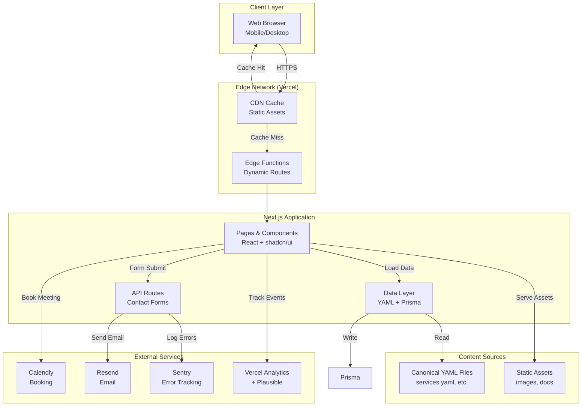
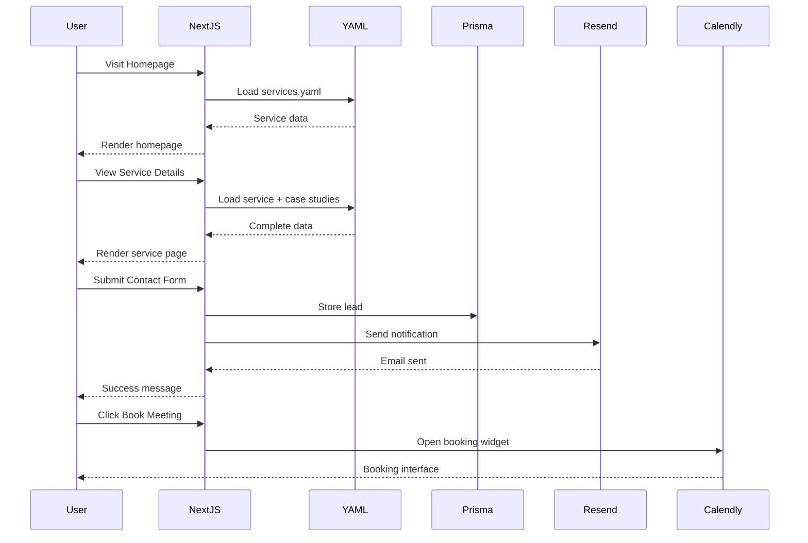

# Portfolio Website Development Specification

**Version:** 1.0
**Date:** 2026-02-11
**Status:** Draft
**Author:** Portfolio Operating System

---

## 1. Executive Summary

### 1.1 Project Overview

This specification outlines the complete development requirements for a professional portfolio website that showcases AI/ML, data engineering, and automation services. The website will serve as the primary digital presence for a freelance consultant specializing in:

- **Agentic AI Systems** - Multi-agent workflows, RAG systems, prompt engineering
- **Data & Business Intelligence** - Interactive dashboards, predictive analytics, data pipelines
- **Marketing Automation** - Email outreach, SEO content engines, attribution analysis
- **Strategy & Consulting** - AI readiness assessments, technical due diligence

### 1.2 Current State (What's Complete)

**Phase 1 & 2 Complete:**
- ✅ Canonical data schemas defined (services, case studies, certifications, proof assets)
- ✅ 33 services cataloged with pricing, deliverables, and proof links
- ✅ 3 detailed case studies with quantitative outcomes
- ✅ 19 certifications with verification URLs and service mappings
- ✅ 29 proof assets (screenshots, GIFs, documents, benchmarks)
- ✅ Upwork portfolio items generated
- ✅ Sales collateral templates (proposals, SOWs, questionnaires)
- ✅ Schema validation rules and cross-referencing strategy

**Existing Assets:**
- 3 production-ready GitHub repositories (EnterpriseHub, Revenue-Sprint, advanced-rag-system)
- Live demos (Streamlit dashboards)
- Architecture documentation
- Performance benchmarks
- Test coverage (4,937 tests across repos)

### 1.3 Development Objectives

1. **Build a professional portfolio website** that converts visitors into qualified leads
2. **Integrate canonical data** for dynamic content management
3. **Showcase proof of work** with screenshots, demos, and case studies
4. **Enable lead capture** through contact forms and booking integration
5. **Optimize for SEO** to attract organic traffic from target buyers
6. **Ensure performance** with fast load times and responsive design
7. **Maintain scalability** for easy content updates and feature additions

### 1.4 Success Criteria

| Metric | Target | Measurement |
|--------|--------|-------------|
| Page Load Time | < 2 seconds (LCP) | Google PageSpeed Insights |
| Mobile Responsiveness | 100% score | Google Mobile-Friendly Test |
| SEO Score | 90+ | SEMrush/Ahrefs |
| Lead Conversion Rate | 3-5% | Form submissions / visitors |
| Time to First Contentful Paint | < 1.5 seconds | Lighthouse |
| Accessibility Score | 95+ | WCAG 2.1 AA compliance |
| Content Update Time | < 5 minutes | YAML file changes to live site |

---

## 2. Technical Architecture

### 2.1 Recommended Tech Stack

#### Frontend

| Component | Technology | Rationale |
|-----------|-----------|-----------|
| **Framework** | Next.js 14+ (App Router) | React-based, SSR/SSG, excellent SEO, built-in optimization |
| **UI Library** | shadcn/ui + Tailwind CSS | Modern components, highly customizable, no runtime overhead |
| **Styling** | Tailwind CSS v3.4 | Utility-first, responsive design, small bundle size |
| **Icons** | Lucide React | Lightweight, consistent with shadcn/ui |
| **Animations** | Framer Motion | Smooth transitions, performance-optimized |
| **Forms** | React Hook Form + Zod | Type-safe validation, minimal re-renders |
| **State Management** | Zustand (if needed) | Lightweight, simple API |
| **Image Optimization** | next/image | Automatic optimization, lazy loading |

#### Backend (Optional - for dynamic features)

| Component | Technology | Rationale |
|-----------|-----------|-----------|
| **API** | Next.js API Routes | Serverless, no separate backend needed |
| **Database** | PostgreSQL (Vercel Postgres) | Reliable, scalable, managed |
| **ORM** | Prisma | Type-safe, excellent DX, migrations |
| **Email** | Resend | Simple API, excellent deliverability |
| **File Storage** | Vercel Blob | Integrated with Vercel, CDN-backed |

#### Hosting & Infrastructure

| Component | Technology | Rationale |
|-----------|-----------|-----------|
| **Hosting** | Vercel | Zero-config deployment, edge network, free SSL |
| **Domain** | Custom domain (e.g., chunkytortoise.com) | Professional branding |
| **DNS** | Vercel DNS | Simple management, automatic SSL |
| **Analytics** | Vercel Analytics + Plausible | Privacy-focused, no cookies needed |
| **Error Tracking** | Sentry | Real-time error monitoring |
| **CI/CD** | Vercel (automatic) | Deploy on git push, preview deployments |

#### Development Tools

| Component | Technology | Rationale |
|-----------|-----------|-----------|
| **Package Manager** | pnpm | Fast, disk-efficient, strict dependencies |
| **TypeScript** | 5.3+ | Type safety, better DX |
| **Linting** | ESLint + Prettier | Code quality, consistent formatting |
| **Testing** | Vitest + Playwright | Fast unit tests, E2E testing |
| **Git Hooks** | Husky + lint-staged | Pre-commit checks |

### 2.2 System Architecture Diagram



### 2.3 Data Flow Diagram



### 2.4 Integration Points

| Integration | Purpose | Implementation |
|-------------|---------|----------------|
| **Canonical YAML Data** | Dynamic content loading | Build-time parsing with TypeScript types |
| **Calendly** | Meeting scheduling | Embedded widget or popup |
| **Resend** | Email notifications | API route with form data |
| **Vercel Analytics** | Page views, events | Built-in analytics component |
| **Sentry** | Error tracking | Next.js SDK integration |
| **GitHub** | Repository links | Static links from YAML data |
| **Streamlit Demos** | Live demos | Iframe embed or external links |

---

## 3. Page Requirements

### 3.1 Home Page

**Purpose:** Convert visitors into qualified leads by demonstrating value and credibility.

**Sections:**

1. **Hero Section**
   - Headline: "AI-Powered Solutions That Drive Real Business Results"
   - Subheadline: "From lead qualification automation to predictive analytics, I build systems that save time, reduce costs, and increase revenue."
   - Primary CTA: "Book a Free Consultation" (Calendly)
   - Secondary CTA: "View Services"
   - Background: Subtle gradient or abstract pattern
   - Trust badges: "4,937+ Tests", "3 Production Systems", "19 Certifications"

2. **Who I Help (Target Audience)**
   - 3-4 buyer personas with icons:
     - CTOs & Engineering Leads (Agentic AI, Multi-Agent Systems)
     - Marketing Directors (Attribution, Automation, Lead Scoring)
     - Data Science Leads (BI Dashboards, Predictive Analytics)
     - Operations Managers (Workflow Automation, Reporting)
   - Each persona links to relevant services

3. **Outcomes & Results**
   - Key metrics from case studies:
     - "95% Faster Response Time" (Real Estate Lead Automation)
     - "3x Increase in Qualified Leads" (Revenue Optimization)
     - "85% Query Accuracy Improvement" (Advanced RAG)
   - Visual: Animated counters or progress bars
   - Link to Case Studies page

4. **Featured Services**
   - 6-8 service cards (P1 priority services)
   - Each card: Icon, name, brief description, price range, "Learn More" link
   - Categories: Strategy, Agentic AI, Data/BI, Marketing

5. **Social Proof**
   - 3 featured case studies with thumbnails
   - Client logos (if available) or industry badges
   - Testimonial quotes from case studies
   - Link to full Case Studies page

6. **Credentials & Expertise**
   - Certification badges (completed certifications)
   - Total hours: "1,768+ hours of specialized training"
   - Link to Credentials page

7. **CTA Section**
   - Headline: "Ready to Transform Your Operations?"
   - Subtext: "Let's discuss how AI and automation can solve your biggest challenges."
   - Primary CTA: "Book Your Free Consultation"
   - Secondary CTA: "Send a Message"

8. **Footer**
   - Navigation links
   - Social media links (GitHub, LinkedIn, Upwork)
   - Contact info
   - Copyright

**Technical Requirements:**
- Load canonical data from `services.yaml` for featured services
- Load case studies from `case_studies.yaml` for social proof
- Load certifications from `certifications.yaml` for credentials
- Responsive design (mobile-first)
- Lazy load images below fold
- SEO meta tags (title, description, OG tags)

### 3.2 Services Page

**Purpose:** Display complete service catalog with filtering and detailed information.

**Sections:**

1. **Page Header**
   - Title: "Services"
   - Description: "Comprehensive AI, data, and automation solutions tailored to your business needs."
   - Breadcrumb navigation

2. **Filter & Search Bar**
   - Category filter dropdown (Strategy, Agentic AI, Data/BI, Marketing, Infra/MLOps, Ops/Governance, Quick-Win)
   - Price range slider ($0 - $20,000+)
   - Search input (by name, description, tags)
   - Sort dropdown (Price: Low-High, Price: High-Low, Priority, Name)
   - "Clear Filters" button

3. **Service Grid**
   - Responsive grid (1 col mobile, 2 col tablet, 3 col desktop)
   - Each service card:
     - Service ID badge (e.g., "S04")
     - Category badge
     - Service name
     - Brief description (first 150 chars)
     - Price range: "$5,000 - $15,000"
     - Timeline: "2-4 weeks"
     - Tags (max 4 visible)
     - Status indicator (Ready, Needs Proof, Needs Rewrite)
     - "View Details" button
     - Proof icons (repo links, case studies, certifications)

4. **Service Detail Modal/Page**
   - Full service information:
     - Service name and ID
     - Category and status
     - Buyer persona
     - Core problem statement
     - Deliverables list
     - Timeline
     - Price range and hourly equivalent
     - Description
     - Tags
     - Related repositories (with links)
     - Related case studies (with links)
     - Related certifications (with badges)
   - CTA: "Book a Consultation for This Service"
   - Back to services link

**Technical Requirements:**
- Load all services from `services.yaml`
- Client-side filtering and search
- URL query parameters for filter state (shareable links)
- Pagination if > 20 services
- Skeleton loading state
- Service detail page with dynamic routing (`/services/[id]`)

### 3.3 Case Studies Page

**Purpose:** Showcase problem→solution→outcome narratives with quantitative results.

**Sections:**

1. **Page Header**
   - Title: "Case Studies"
   - Description: "Real results from real projects. See how AI and automation transformed businesses."
   - Breadcrumb navigation

2. **Filter Bar**
   - Industry filter (Real Estate, Marketing Technology, SaaS, etc.)
   - Service filter (multi-select from services)
   - Client type filter (Enterprise, Startup, Agency, Freelance)
   - Sort dropdown (Newest, Oldest)

3. **Case Study Grid**
   - Responsive grid (1 col mobile, 2 col tablet, 3 col desktop)
   - Each case study card:
     - Thumbnail image (from proof assets)
     - Title
     - Industry badge
     - Client type badge
     - Problem preview (first 100 chars)
     - Key outcomes (2-3 metrics)
     - Services involved (badges)
     - "Read Full Case Study" button

4. **Case Study Detail Page**
   - Hero section with thumbnail
   - Title and metadata (industry, client type, duration, team size)
   - Problem section (full text)
   - Constraints section (if present)
   - Solution section (full text with tech stack badges)
   - Outcomes section (all metrics with visual emphasis)
   - Artifacts section (links to demos, code, docs, diagrams)
   - CTA section (from case study)
   - Related services (links)
   - Related case studies (if any)

**Technical Requirements:**
- Load case studies from `case_studies.yaml`
- Load proof assets from `proof_assets.yaml` for thumbnails
- Client-side filtering
- URL query parameters for filter state
- Case study detail page with dynamic routing (`/case-studies/[id]`)
- Rich text rendering for problem/solution sections
- Schema.org markup for case studies (SEO)

### 3.4 Credentials Page

**Purpose:** Display certifications and expertise to build trust and credibility.

**Sections:**

1. **Page Header**
   - Title: "Credentials & Expertise"
   - Description: "1,768+ hours of specialized training across AI, data, and marketing technologies."
   - Breadcrumb navigation

2. **Summary Stats**
   - Total certifications: 19
   - Completed: 10
   - In Progress: 9
   - Total hours: 1,768+
   - Categories: 5 (AI/ML, GenAI, Data/BI, Marketing, Engineering)

3. **Certification Grid**
   - Grouped by category (tabs or sections)
   - Each certification card:
     - Certification name
     - Provider logo or name
     - Status badge (Completed / In Progress)
     - Hours invested
     - Year
     - Positioning snippet
     - Related services (badges with links)
     - Related repositories (badges with links)
     - Verification link (if available)
     - Badge image (if available)

4. **Service Relevance Map**
   - Visual matrix showing which certifications apply to which services
   - Rows: Services
   - Columns: Certifications
   - Cells: Checkmarks or strength indicators

5. **Learning Journey**
   - Timeline view of certifications (chronological)
   - Milestones and achievements
   - Current focus areas

**Technical Requirements:**
- Load certifications from `certifications.yaml`
- Load services from `services.yaml` for relevance mapping
- Tab-based filtering by category
- Status-based filtering (Completed / In Progress)
- Certification detail modal (if needed)
- Schema.org markup for educational credentials (SEO)

### 3.5 Contact/Booking Page

**Purpose:** Enable lead capture and meeting scheduling.

**Sections:**

1. **Page Header**
   - Title: "Get in Touch"
   - Description: "Ready to discuss your project? Book a free consultation or send a message."
   - Breadcrumb navigation

2. **Booking Section**
   - Calendly embedded widget
   - Alternative: "Book a Meeting" button that opens Calendly popup
   - Meeting types:
     - Free 30-minute consultation
     - 1-hour strategy session ($150)
     - Project discovery call (free)

3. **Contact Form**
   - Fields:
     - Name (required)
     - Email (required, validated)
     - Company (optional)
     - Service Interest (dropdown from services)
     - Budget Range (dropdown: <$5k, $5k-$10k, $10k-$25k, $25k-$50k, $50k+)
     - Project Description (textarea, max 500 chars)
     - How did you hear about us? (dropdown)
   - Validation: Client-side (Zod) + Server-side
   - Submit button with loading state
   - Success message with next steps

4. **Alternative Contact Methods**
   - Email: contact@example.com
   - LinkedIn: profile link
   - Upwork: profile link
   - GitHub: profile link

5. **FAQ Section**
   - Common questions:
     - "What's your typical project timeline?"
     - "How do you handle pricing?"
     - "What's your availability?"
     - "Do you offer ongoing support?"
   - Accordion-style answers

6. **Response Time Promise**
   - "I respond to all inquiries within 24 hours"
   - "Consultation calls typically scheduled within 3 business days"

**Technical Requirements:**
- Calendly integration (embed or popup)
- Form validation with React Hook Form + Zod
- API route for form submission
- Email notification via Resend
- Lead storage in database (Prisma + PostgreSQL)
- Spam protection (honeypot field, rate limiting)
- Schema.org markup for contact page (SEO)

### 3.6 Additional Pages (Optional)

#### About Page
- Professional bio
- Background and experience
- Work philosophy
- Personal interests (human element)
- Photo

#### Blog/Articles Page
- Technical articles
- Case study deep-dives
- Industry insights
- RSS feed

#### Resources Page
- Free tools and templates
- Whitepapers
- Webinars
- Links to GitHub repos

---

## 4. Component Specifications

### 4.1 Service Card Component

**Purpose:** Display service summary in grid layout.

**Props:**
```typescript
interface ServiceCardProps {
  id: string;
  name: string;
  category: string;
  description: string;
  priceMin: number;
  priceMax: number;
  timeline: string;
  tags: string[];
  status: 'ready' | 'needs-proof' | 'needs-rewrite';
  repos: string[];
  caseStudies?: string[];
  certifications?: string[];
}
```

**UI Elements:**
- Card container with hover effect (lift + shadow)
- Status badge (top-right corner)
- Category badge (top-left corner)
- Service ID badge (small, subtle)
- Service name (heading)
- Description (truncated to 150 chars)
- Price range (formatted: "$5,000 - $15,000")
- Timeline (icon + text)
- Tags (pill badges, max 4)
- Proof indicators (repo icon, case study icon, cert icon)
- "View Details" button (primary)

**States:**
- Default: Card with all elements
- Hover: Lift effect, shadow increase
- Loading: Skeleton placeholder
- Error: Error message with retry

**Accessibility:**
- Semantic HTML (article element)
- ARIA labels for icons
- Keyboard navigation support
- Focus visible states

### 4.2 Case Study Card Component

**Purpose:** Display case study summary in grid layout.

**Props:**
```typescript
interface CaseStudyCardProps {
  id: string;
  title: string;
  industry: string;
  clientType: 'enterprise' | 'startup' | 'agency' | 'freelance';
  problem: string;
  outcomes: Record<string, string>;
  serviceIds: string[];
  thumbnailUrl?: string;
  publishedDate: string;
}
```

**UI Elements:**
- Card container with hover effect
- Thumbnail image (aspect ratio 16:9)
- Industry badge (overlay on thumbnail)
- Title (heading)
- Client type badge
- Problem preview (truncated to 100 chars)
- Key outcomes (2-3 metrics with icons)
- Service badges (max 3)
- "Read Full Case Study" button (primary)

**States:**
- Default: Card with all elements
- Hover: Thumbnail zoom effect, shadow increase
- Loading: Skeleton placeholder
- Error: Error message with retry

**Accessibility:**
- Semantic HTML (article element)
- Alt text for thumbnail
- ARIA labels for icons
- Keyboard navigation support

### 4.3 Certification Badge Component

**Purpose:** Display certification with verification link.

**Props:**
```typescript
interface CertificationBadgeProps {
  id: string;
  name: string;
  provider: string;
  status: 'completed' | 'in-progress';
  hours: number;
  year: number;
  positioningSnippet: string;
  verificationUrl?: string;
  badgeUrl?: string;
  serviceIds?: string[];
  repoIds?: string[];
}
```

**UI Elements:**
- Badge container
- Provider logo or name
- Certification name
- Status badge (Completed / In Progress)
- Hours and year
- Positioning snippet
- Verification link (if available)
- Related services (badges with links)
- Related repositories (badges with links)

**States:**
- Default: Badge with all elements
- Hover: Shadow increase, verification link highlight
- Loading: Skeleton placeholder

**Accessibility:**
- Semantic HTML (article element)
- ARIA labels for status
- External link indicators
- Keyboard navigation support

### 4.4 Proof Asset Display Component

**Purpose:** Display proof assets (screenshots, GIFs, videos, documents).

**Props:**
```typescript
interface ProofAssetProps {
  id: string;
  assetType: 'screenshot' | 'gif' | 'video' | 'architecture' | 'benchmark' | 'testimonial';
  title?: string;
  description?: string;
  pathOrUrl: string;
  businessClaimSupported: string;
  thumbnailUrl?: string;
  durationSeconds?: number;
  altText?: string;
}
```

**UI Elements:**
- Asset container
- Asset display (image, video, or document link)
- Title (if provided)
- Description (if provided)
- Business claim (highlighted)
- Thumbnail (for videos/GIFs)
- Duration badge (for videos/GIFs)
- "View Full Size" button (for images)
- "Open Document" button (for documents)

**States:**
- Default: Asset with metadata
- Loading: Skeleton placeholder
- Error: Error message with retry
- Expanded: Lightbox for images

**Accessibility:**
- Alt text for images
- ARIA labels for interactive elements
- Keyboard navigation support
- Focus visible states

### 4.5 CTA Module Component

**Purpose:** Display call-to-action sections throughout the site.

**Props:**
```typescript
interface CTAModuleProps {
  variant: 'primary' | 'secondary' | 'text';
  headline: string;
  subtext?: string;
  primaryCTA: {
    text: string;
    url: string;
    type: 'booking' | 'contact' | 'demo' | 'external';
  };
  secondaryCTA?: {
    text: string;
    url: string;
    type: 'booking' | 'contact' | 'demo' | 'external';
  };
  background?: 'gradient' | 'solid' | 'image';
}
```

**UI Elements:**
- Container with background
- Headline (heading)
- Subtext (paragraph)
- Primary CTA button
- Secondary CTA button (optional)
- Background image (if applicable)

**Variants:**
- Primary: Large, prominent, gradient background
- Secondary: Medium size, solid background
- Text: Minimal, inline with content

**Accessibility:**
- Semantic HTML (section element)
- ARIA labels for buttons
- Keyboard navigation support
- Focus visible states

### 4.6 Navigation Component

**Purpose:** Site-wide navigation with mobile menu.

**Props:**
```typescript
interface NavigationProps {
  currentPath: string;
  menuItems: {
    label: string;
    href: string;
    children?: MenuItem[];
  }[];
}
```

**UI Elements:**
- Logo (text or image)
- Desktop navigation links
- Mobile menu toggle (hamburger)
- Mobile menu drawer
- CTA button ("Book Consultation")
- Search icon (optional)

**States:**
- Desktop: Horizontal links
- Mobile: Drawer with slide-in animation
- Active: Highlight current page
- Hover: Underline animation

**Accessibility:**
- Semantic HTML (nav element)
- ARIA labels for menu toggle
- Keyboard navigation support
- Focus trap in mobile menu
- Skip to content link

### 4.7 Footer Component

**Purpose:** Site-wide footer with links and information.

**Props:**
```typescript
interface FooterProps {
  navigationLinks: {
    label: string;
    href: string;
  }[];
  socialLinks: {
    platform: string;
    url: string;
    icon: React.ReactNode;
  }[];
  contactInfo: {
    email?: string;
    phone?: string;
    location?: string;
  };
}
```

**UI Elements:**
- Logo (text or image)
- Navigation columns (Services, Resources, Company)
- Social media links
- Contact information
- Copyright notice
- Legal links (Privacy, Terms)

**Accessibility:**
- Semantic HTML (footer element)
- ARIA labels for social links
- Keyboard navigation support
- Focus visible states

---

## 5. Data Integration Strategy

### 5.1 Canonical Data Consumption

**Data Sources:**
- `output/portfolio_data/services.yaml` - 33 services
- `output/portfolio_data/case_studies.yaml` - 3 case studies
- `output/portfolio_data/certifications.yaml` - 19 certifications
- `output/portfolio_data/proof_assets.yaml` - 29 proof assets

**Loading Strategy:**

```typescript
// lib/data-loader.ts
import fs from 'fs';
import path from 'path';
import yaml from 'js-yaml';

// TypeScript types from schemas
interface Service {
  id: string;
  name: string;
  category: string;
  // ... other fields
}

interface CaseStudy {
  id: string;
  title: string;
  // ... other fields
}

interface Certification {
  id: string;
  name: string;
  // ... other fields
}

interface ProofAsset {
  id: string;
  asset_type: string;
  // ... other fields
}

// Load YAML files at build time
export function loadServices(): Service[] {
  const filePath = path.join(process.cwd(), 'output/portfolio_data/services.yaml');
  const fileContents = fs.readFileSync(filePath, 'utf8');
  return yaml.load(fileContents) as Service[];
}

export function loadCaseStudies(): CaseStudy[] {
  const filePath = path.join(process.cwd(), 'output/portfolio_data/case_studies.yaml');
  const fileContents = fs.readFileSync(filePath, 'utf8');
  return yaml.load(fileContents) as CaseStudy[];
}

export function loadCertifications(): Certification[] {
  const filePath = path.join(process.cwd(), 'output/portfolio_data/certifications.yaml');
  const fileContents = fs.readFileSync(filePath, 'utf8');
  return yaml.load(fileContents) as Certification[];
}

export function loadProofAssets(): ProofAsset[] {
  const filePath = path.join(process.cwd(), 'output/portfolio_data/proof_assets.yaml');
  const fileContents = fs.readFileSync(filePath, 'utf8');
  return yaml.load(fileContents) as ProofAsset[];
}

// Helper functions for cross-referencing
export function getServiceById(id: string): Service | undefined {
  const services = loadServices();
  return services.find(s => s.id === id);
}

export function getCaseStudiesByServiceId(serviceId: string): CaseStudy[] {
  const caseStudies = loadCaseStudies();
  return caseStudies.filter(cs => cs.service_ids.includes(serviceId));
}

export function getCertificationsByServiceId(serviceId: string): Certification[] {
  const certifications = loadCertifications();
  return certifications.filter(c => c.service_ids?.includes(serviceId));
}

export function getProofAssetsByServiceId(serviceId: string): ProofAsset[] {
  const proofAssets = loadProofAssets();
  return proofAssets.filter(pa => pa.service_ids.includes(serviceId));
}
```

### 5.2 Data Transformation Requirements

**Transformations Needed:**

1. **Price Formatting**
   - Convert integer prices to formatted strings
   - Example: `5000` → `"$5,000"`

2. **Timeline Parsing**
   - Extract numeric values from timeline strings
   - Example: `"2-4 weeks"` → `{ min: 2, max: 4, unit: 'weeks' }`

3. **Tag Normalization**
   - Convert tags to lowercase
   - Replace spaces with hyphens
   - Example: `"Prompt Engineering"` → `"prompt-engineering"`

4. **URL Validation**
   - Ensure all URLs are valid
   - Add `https://` if missing
   - Validate external links

5. **Image Path Resolution**
   - Convert relative paths to absolute URLs
   - Example: `"assets/screenshots/platform-overview.png"` → `"/assets/screenshots/platform-overview.png"`

6. **Status Mapping**
   - Map status values to UI states
   - Example: `"ready"` → `{ label: "Ready", color: "green" }`

### 5.3 Caching Strategy

**Build-Time Caching:**
- YAML files loaded once at build time
- Data serialized to JSON for faster runtime access
- Cache invalidated on file changes

**Runtime Caching:**
- Use React Query or SWR for client-side caching
- Cache API responses (contact form submissions)
- Cache Calendly availability (if using API)

**CDN Caching:**
- Static assets cached at edge
- HTML pages cached with revalidation
- API routes cached with appropriate TTL

**Cache Invalidation:**
- Build cache: Automatic on file changes
- Runtime cache: Time-based (5-15 minutes)
- CDN cache: Manual purge or revalidation

### 5.4 Update Mechanism for Canonical Data Changes

**Workflow:**

1. **Update YAML Files**
   - Edit canonical YAML files in `output/portfolio_data/`
   - Follow schema validation rules
   - Test changes locally

2. **Validate Changes**
   - Run validation script: `npm run validate-data`
   - Check for schema violations
   - Verify cross-references

3. **Commit Changes**
   - Commit YAML files to git
   - Push to repository

4. **Automatic Deployment**
   - Vercel detects changes
   - Triggers new build
   - Deploys updated site

5. **Cache Invalidation**
   - Build cache invalidated
   - CDN cache purged
   - New data live within minutes

**Validation Script:**

```typescript
// scripts/validate-data.ts
import { loadServices, loadCaseStudies, loadCertifications, loadProofAssets } from '../lib/data-loader';

function validateData() {
  const services = loadServices();
  const caseStudies = loadCaseStudies();
  const certifications = loadCertifications();
  const proofAssets = loadProofAssets();

  const errors: string[] = [];

  // Validate service IDs
  const serviceIds = new Set(services.map(s => s.id));
  services.forEach(service => {
    if (!serviceIds.has(service.id)) {
      errors.push(`Duplicate service ID: ${service.id}`);
    }
  });

  // Validate case study references
  caseStudies.forEach(cs => {
    cs.service_ids.forEach(serviceId => {
      if (!serviceIds.has(serviceId)) {
        errors.push(`Case study ${cs.id} references non-existent service: ${serviceId}`);
      }
    });
  });

  // Validate certification references
  certifications.forEach(cert => {
    cert.service_ids?.forEach(serviceId => {
      if (!serviceIds.has(serviceId)) {
        errors.push(`Certification ${cert.id} references non-existent service: ${serviceId}`);
      }
    });
  });

  // Validate proof asset references
  proofAssets.forEach(pa => {
    pa.service_ids.forEach(serviceId => {
      if (!serviceIds.has(serviceId)) {
        errors.push(`Proof asset ${pa.id} references non-existent service: ${serviceId}`);
      }
    });
  });

  if (errors.length > 0) {
    console.error('Validation errors:');
    errors.forEach(error => console.error(`  - ${error}`));
    process.exit(1);
  } else {
    console.log('✅ All data validated successfully');
  }
}

validateData();
```

---

## 6. Design System

### 6.1 Color Palette

**Primary Colors:**
```css
--color-primary-50: #eff6ff;
--color-primary-100: #dbeafe;
--color-primary-200: #bfdbfe;
--color-primary-300: #93c5fd;
--color-primary-400: #60a5fa;
--color-primary-500: #3b82f6;  /* Main primary */
--color-primary-600: #2563eb;
--color-primary-700: #1d4ed8;
--color-primary-800: #1e40af;
--color-primary-900: #1e3a8a;
```

**Secondary Colors:**
```css
--color-secondary-50: #f0fdf4;
--color-secondary-100: #dcfce7;
--color-secondary-200: #bbf7d0;
--color-secondary-300: #86efac;
--color-secondary-400: #4ade80;
--color-secondary-500: #22c55e;  /* Success green */
--color-secondary-600: #16a34a;
--color-secondary-700: #15803d;
--color-secondary-800: #166534;
--color-secondary-900: #14532d;
```

**Neutral Colors:**
```css
--color-neutral-50: #fafafa;
--color-neutral-100: #f5f5f5;
--color-neutral-200: #e5e5e5;
--color-neutral-300: #d4d4d4;
--color-neutral-400: #a3a3a3;
--color-neutral-500: #737373;
--color-neutral-600: #525252;
--color-neutral-700: #404040;
--color-neutral-800: #262626;
--color-neutral-900: #171717;
```

**Semantic Colors:**
```css
--color-success: #22c55e;
--color-warning: #f59e0b;
--color-error: #ef4444;
--color-info: #3b82f6;
```

**Dark Mode:**
```css
--color-dark-bg: #0a0a0a;
--color-dark-surface: #171717;
--color-dark-border: #262626;
--color-dark-text: #fafafa;
--color-dark-text-secondary: #a3a3a3;
```

### 6.2 Typography

**Font Families:**
```css
--font-sans: 'Inter', -apple-system, BlinkMacSystemFont, 'Segoe UI', Roboto, sans-serif;
--font-mono: 'JetBrains Mono', 'Fira Code', monospace;
```

**Font Sizes:**
```css
--text-xs: 0.75rem;    /* 12px */
--text-sm: 0.875rem;   /* 14px */
--text-base: 1rem;     /* 16px */
--text-lg: 1.125rem;   /* 18px */
--text-xl: 1.25rem;    /* 20px */
--text-2xl: 1.5rem;    /* 24px */
--text-3xl: 1.875rem;  /* 30px */
--text-4xl: 2.25rem;   /* 36px */
--text-5xl: 3rem;      /* 48px */
--text-6xl: 3.75rem;   /* 60px */
```

**Font Weights:**
```css
--font-normal: 400;
--font-medium: 500;
--font-semibold: 600;
--font-bold: 700;
--font-extrabold: 800;
```

**Line Heights:**
```css
--leading-tight: 1.25;
--leading-snug: 1.375;
--leading-normal: 1.5;
--leading-relaxed: 1.625;
--leading-loose: 2;
```

**Letter Spacing:**
```css
--tracking-tighter: -0.05em;
--tracking-tight: -0.025em;
--tracking-normal: 0;
--tracking-wide: 0.025em;
--tracking-wider: 0.05em;
--tracking-widest: 0.1em;
```

### 6.3 Spacing and Layout

**Spacing Scale:**
```css
--space-0: 0;
--space-1: 0.25rem;   /* 4px */
--space-2: 0.5rem;    /* 8px */
--space-3: 0.75rem;   /* 12px */
--space-4: 1rem;      /* 16px */
--space-5: 1.25rem;   /* 20px */
--space-6: 1.5rem;    /* 24px */
--space-8: 2rem;      /* 32px */
--space-10: 2.5rem;   /* 40px */
--space-12: 3rem;     /* 48px */
--space-16: 4rem;     /* 64px */
--space-20: 5rem;     /* 80px */
--space-24: 6rem;     /* 96px */
--space-32: 8rem;     /* 128px */
```

**Container Widths:**
```css
--container-sm: 640px;
--container-md: 768px;
--container-lg: 1024px;
--container-xl: 1280px;
--container-2xl: 1536px;
```

**Border Radius:**
```css
--radius-none: 0;
--radius-sm: 0.125rem;   /* 2px */
--radius-md: 0.375rem;   /* 6px */
--radius-lg: 0.5rem;     /* 8px */
--radius-xl: 0.75rem;    /* 12px */
--radius-2xl: 1rem;      /* 16px */
--radius-full: 9999px;
```

**Shadows:**
```css
--shadow-sm: 0 1px 2px 0 rgb(0 0 0 / 0.05);
--shadow-md: 0 4px 6px -1px rgb(0 0 0 / 0.1);
--shadow-lg: 0 10px 15px -3px rgb(0 0 0 / 0.1);
--shadow-xl: 0 20px 25px -5px rgb(0 0 0 / 0.1);
--shadow-2xl: 0 25px 50px -12px rgb(0 0 0 / 0.25);
```

### 6.4 Component Library Recommendations

**shadcn/ui Components:**
- Button (primary, secondary, ghost, outline)
- Card (with header, content, footer)
- Badge (for status, categories)
- Dialog (for modals)
- Dropdown Menu (for filters)
- Tabs (for category switching)
- Accordion (for FAQs)
- Form (with input, textarea, select)
- Separator (for visual breaks)
- Skeleton (for loading states)
- Toast (for notifications)

**Custom Components:**
- ServiceCard (extends Card)
- CaseStudyCard (extends Card)
- CertificationBadge (extends Badge)
- ProofAssetDisplay (custom)
- CTAModule (custom)
- Navigation (custom)
- Footer (custom)

### 6.5 Responsive Design Requirements

**Breakpoints:**
```css
--breakpoint-sm: 640px;
--breakpoint-md: 768px;
--breakpoint-lg: 1024px;
--breakpoint-xl: 1280px;
--breakpoint-2xl: 1536px;
```

**Grid Systems:**
- Mobile: 1 column
- Tablet: 2 columns
- Desktop: 3 columns
- Large Desktop: 4 columns

**Typography Scaling:**
- Mobile: Base font size 16px
- Tablet: Base font size 16px
- Desktop: Base font size 18px

**Spacing Adjustments:**
- Mobile: Reduced padding (1rem)
- Tablet: Medium padding (1.5rem)
- Desktop: Full padding (2rem)

**Navigation:**
- Mobile: Hamburger menu with drawer
- Tablet/Desktop: Horizontal navigation

**Touch Targets:**
- Minimum size: 44x44px
- Spacing between targets: 8px

---

## 7. Content Requirements

### 7.1 Copy for Each Page

#### Home Page

**Hero Section:**
```
Headline: AI-Powered Solutions That Drive Real Business Results

Subheadline: From lead qualification automation to predictive analytics, I build systems that save time, reduce costs, and increase revenue.

Primary CTA: Book a Free Consultation
Secondary CTA: View Services
```

**Who I Help Section:**
```
Section Title: Who I Help

CTOs & Engineering Leads
Build production-ready multi-agent AI systems with proper orchestration, monitoring, and handoff logic.

Marketing Directors
Track marketing ROI with attribution analysis, automate outreach, and score leads with predictive models.

Data Science Leads
Create interactive BI dashboards, build predictive models, and automate reporting pipelines.

Operations Managers
Automate repetitive workflows, integrate systems, and reduce manual data entry.
```

**Outcomes Section:**
```
Section Title: Proven Results

95% Faster Response Time
Real estate lead qualification reduced from 45 minutes to 2 minutes.

3x Increase in Qualified Leads
Marketing automation generated 3x more qualified outbound leads.

85% Query Accuracy Improvement
Advanced RAG system improved query accuracy by 85% with hybrid retrieval.
```

**Featured Services Section:**
```
Section Title: Featured Services

[Service cards for P1 services]
```

**Social Proof Section:**
```
Section Title: Trusted by Industry Leaders

[Case study cards with testimonials]
```

**Credentials Section:**
```
Section Title: Expertise You Can Trust

1,768+ hours of specialized training across AI, data, and marketing technologies.

[Certification badges]
```

**CTA Section:**
```
Headline: Ready to Transform Your Operations?

Subtext: Let's discuss how AI and automation can solve your biggest challenges.

Primary CTA: Book Your Free Consultation
Secondary CTA: Send a Message
```

#### Services Page

```
Page Title: Services

Page Description: Comprehensive AI, data, and automation solutions tailored to your business needs.

Filter Labels:
- Category
- Price Range
- Search
- Sort

Service Card Labels:
- View Details
- Learn More
```

#### Case Studies Page

```
Page Title: Case Studies

Page Description: Real results from real projects. See how AI and automation transformed businesses.

Filter Labels:
- Industry
- Services
- Client Type
- Sort

Case Study Card Labels:
- Read Full Case Study
```

#### Credentials Page

```
Page Title: Credentials & Expertise

Page Description: 1,768+ hours of specialized training across AI, data, and marketing technologies.

Summary Labels:
- Total Certifications
- Completed
- In Progress
- Total Hours
- Categories

Certification Card Labels:
- View Verification
- Related Services
- Related Repositories
```

#### Contact/Booking Page

```
Page Title: Get in Touch

Page Description: Ready to discuss your project? Book a free consultation or send a message.

Booking Section:
- Book a Free Consultation
- 1-Hour Strategy Session ($150)
- Project Discovery Call

Contact Form Labels:
- Name
- Email
- Company
- Service Interest
- Budget Range
- Project Description
- How did you hear about us?

Submit Button: Send Message

FAQ Section:
- What's your typical project timeline?
- How do you handle pricing?
- What's your availability?
- Do you offer ongoing support?

Response Time Promise:
I respond to all inquiries within 24 hours.
Consultation calls typically scheduled within 3 business days.
```

### 7.2 Image Requirements

**Image Types:**
- Screenshots (PNG, JPG)
- Diagrams (SVG, PNG)
- GIFs (for demos)
- Profile photo (PNG, JPG)
- Background images (PNG, JPG, WebP)

**Image Specifications:**
- Screenshots: 1920x1080 (16:9), max 500KB
- Thumbnails: 800x450 (16:9), max 100KB
- Profile photo: 400x400 (1:1), max 200KB
- Background images: 1920x1080, max 1MB
- Icons: SVG, max 10KB

**Image Optimization:**
- Use WebP format with fallbacks
- Compress images with sharp or imagemin
- Lazy load images below fold
- Use responsive images with srcset
- Add alt text for accessibility

**Image Storage:**
- Local: `public/assets/` directory
- CDN: Vercel Blob (for production)
- External: GitHub, Streamlit demos (links)

### 7.3 Proof Asset Display Strategy

**Display Rules:**
- Screenshots: Display in card with lightbox
- GIFs: Display with play button, auto-play on hover
- Videos: Display with thumbnail, play on click
- Documents: Display as link cards with icons
- Architecture diagrams: Display in modal with zoom
- Benchmarks: Display as data tables or charts

**Asset Grouping:**
- Group by service
- Group by asset type
- Group by repository

**Asset Prioritization:**
- Primary: Screenshots and GIFs
- Secondary: Videos and diagrams
- Tertiary: Documents and benchmarks

**Asset Verification:**
- Check asset accessibility
- Verify file size limits
- Validate alt text
- Test on mobile devices

### 7.4 SEO Requirements

**Meta Tags:**

```html
<!-- Primary Meta Tags -->
<title>Portfolio - AI, Data & Automation Solutions</title>
<meta name="title" content="Portfolio - AI, Data & Automation Solutions">
<meta name="description" content="From lead qualification automation to predictive analytics, I build AI-powered systems that save time, reduce costs, and increase revenue.">

<!-- Open Graph / Facebook -->
<meta property="og:type" content="website">
<meta property="og:url" content="https://chunkytortoise.com/">
<meta property="og:title" content="Portfolio - AI, Data & Automation Solutions">
<meta property="og:description" content="From lead qualification automation to predictive analytics, I build AI-powered systems that save time, reduce costs, and increase revenue.">
<meta property="og:image" content="https://chunkytortoise.com/og-image.png">

<!-- Twitter -->
<meta property="twitter:card" content="summary_large_image">
<meta property="twitter:url" content="https://chunkytortoise.com/">
<meta property="twitter:title" content="Portfolio - AI, Data & Automation Solutions">
<meta property="twitter:description" content="From lead qualification automation to predictive analytics, I build AI-powered systems that save time, reduce costs, and increase revenue.">
<meta property="twitter:image" content="https://chunkytortoise.com/og-image.png">
```

**Structured Data (Schema.org):**

```json
{
  "@context": "https://schema.org",
  "@type": "Person",
  "name": "Your Name",
  "url": "https://chunkytortoise.com",
  "image": "https://chunkytortoise.com/profile.jpg",
  "sameAs": [
    "https://github.com/ChunkyTortoise",
    "https://linkedin.com/in/yourprofile",
    "https://upwork.com/freelancers/yourprofile"
  ],
  "jobTitle": "AI & Automation Consultant",
  "knowsAbout": [
    "Artificial Intelligence",
    "Machine Learning",
    "Data Engineering",
    "Business Intelligence",
    "Marketing Automation"
  ]
}
```

**Sitemap:**
- Generate sitemap.xml with all pages
- Include last modified dates
- Submit to Google Search Console

**Robots.txt:**
```
User-agent: *
Allow: /
Sitemap: https://chunkytortoise.com/sitemap.xml
```

**Canonical URLs:**
- Add canonical tags to all pages
- Prevent duplicate content issues

**Page Speed:**
- Optimize images
- Minify CSS/JS
- Use lazy loading
- Enable compression

**Mobile Optimization:**
- Responsive design
- Mobile-friendly navigation
- Touch-friendly buttons
- Readable font sizes

---

## 8. Functionality Requirements

### 8.1 Service Filtering and Search

**Features:**
- Filter by category (dropdown)
- Filter by price range (slider)
- Filter by status (ready, needs-proof, needs-rewrite)
- Search by name, description, tags
- Sort by price, priority, name
- Clear all filters button
- URL query parameters for shareable links

**Implementation:**
```typescript
// hooks/useServiceFilters.ts
import { useState, useMemo } from 'react';
import { loadServices } from '@/lib/data-loader';

export function useServiceFilters() {
  const [filters, setFilters] = useState({
    category: 'all',
    priceRange: [0, 20000],
    status: 'all',
    search: '',
    sortBy: 'priority'
  });

  const services = loadServices();

  const filteredServices = useMemo(() => {
    return services
      .filter(service => {
        if (filters.category !== 'all' && service.category !== filters.category) {
          return false;
        }
        if (service.price_max < filters.priceRange[0] || service.price_min > filters.priceRange[1]) {
          return false;
        }
        if (filters.status !== 'all' && service.status !== filters.status) {
          return false;
        }
        if (filters.search) {
          const searchLower = filters.search.toLowerCase();
          const searchableText = [
            service.name,
            service.description,
            ...service.tags
          ].join(' ').toLowerCase();
          if (!searchableText.includes(searchLower)) {
            return false;
          }
        }
        return true;
      })
      .sort((a, b) => {
        switch (filters.sortBy) {
          case 'price-asc':
            return a.price_min - b.price_min;
          case 'price-desc':
            return b.price_min - a.price_min;
          case 'name':
            return a.name.localeCompare(b.name);
          case 'priority':
            const priorityOrder = { P1: 0, P2: 1, P3: 2 };
            return priorityOrder[a.priority] - priorityOrder[b.priority];
          default:
            return 0;
        }
      });
  }, [services, filters]);

  return { filters, setFilters, filteredServices };
}
```

### 8.2 Case Study Filtering

**Features:**
- Filter by industry (dropdown)
- Filter by services (multi-select)
- Filter by client type (dropdown)
- Sort by newest/oldest
- Clear all filters button
- URL query parameters for shareable links

**Implementation:**
```typescript
// hooks/useCaseStudyFilters.ts
import { useState, useMemo } from 'react';
import { loadCaseStudies } from '@/lib/data-loader';

export function useCaseStudyFilters() {
  const [filters, setFilters] = useState({
    industry: 'all',
    serviceIds: [] as string[],
    clientType: 'all',
    sortBy: 'newest'
  });

  const caseStudies = loadCaseStudies();

  const filteredCaseStudies = useMemo(() => {
    return caseStudies
      .filter(cs => {
        if (filters.industry !== 'all' && cs.industry !== filters.industry) {
          return false;
        }
        if (filters.clientType !== 'all' && cs.client_type !== filters.clientType) {
          return false;
        }
        if (filters.serviceIds.length > 0) {
          const hasMatchingService = filters.serviceIds.some(id =>
            cs.service_ids.includes(id)
          );
          if (!hasMatchingService) {
            return false;
          }
        }
        return true;
      })
      .sort((a, b) => {
        if (filters.sortBy === 'newest') {
          return new Date(b.published_date).getTime() - new Date(a.published_date).getTime();
        } else {
          return new Date(a.published_date).getTime() - new Date(b.published_date).getTime();
        }
      });
  }, [caseStudies, filters]);

  return { filters, setFilters, filteredCaseStudies };
}
```

### 8.3 Contact Form with Validation

**Features:**
- Client-side validation (React Hook Form + Zod)
- Server-side validation
- Email notification via Resend
- Lead storage in database
- Spam protection (honeypot field)
- Rate limiting
- Success/error messages

**Implementation:**
```typescript
// app/api/contact/route.ts
import { NextRequest, NextResponse } from 'next/server';
import { Resend } from 'resend';
import { prisma } from '@/lib/prisma';
import { contactFormSchema } from '@/lib/schemas';

const resend = new Resend(process.env.RESEND_API_KEY);

export async function POST(request: NextRequest) {
  try {
    const body = await request.json();

    // Validate input
    const validatedData = contactFormSchema.parse(body);

    // Check honeypot field (spam protection)
    if (validatedData.website) {
      return NextResponse.json({ success: true }, { status: 200 });
    }

    // Store lead in database
    const lead = await prisma.lead.create({
      data: {
        name: validatedData.name,
        email: validatedData.email,
        company: validatedData.company,
        serviceInterest: validatedData.serviceInterest,
        budgetRange: validatedData.budgetRange,
        projectDescription: validatedData.projectDescription,
        source: validatedData.source,
      },
    });

    // Send email notification
    await resend.emails.send({
      from: 'contact@chunkytortoise.com',
      to: 'your-email@example.com',
      subject: `New Contact Form Submission: ${validatedData.name}`,
      html: `
        <h2>New Contact Form Submission</h2>
        <p><strong>Name:</strong> ${validatedData.name}</p>
        <p><strong>Email:</strong> ${validatedData.email}</p>
        <p><strong>Company:</strong> ${validatedData.company || 'N/A'}</p>
        <p><strong>Service Interest:</strong> ${validatedData.serviceInterest}</p>
        <p><strong>Budget Range:</strong> ${validatedData.budgetRange}</p>
        <p><strong>Project Description:</strong></p>
        <p>${validatedData.projectDescription}</p>
        <p><strong>Source:</strong> ${validatedData.source}</p>
      `,
    });

    return NextResponse.json({ success: true, leadId: lead.id });
  } catch (error) {
    console.error('Contact form error:', error);
    return NextResponse.json(
      { success: false, error: 'Failed to submit form' },
      { status: 500 }
    );
  }
}
```

**Validation Schema:**
```typescript
// lib/schemas.ts
import { z } from 'zod';

export const contactFormSchema = z.object({
  name: z.string().min(2, 'Name must be at least 2 characters'),
  email: z.string().email('Invalid email address'),
  company: z.string().optional(),
  serviceInterest: z.string().min(1, 'Please select a service'),
  budgetRange: z.string().min(1, 'Please select a budget range'),
  projectDescription: z.string().max(500, 'Description must be less than 500 characters'),
  source: z.string().optional(),
  website: z.string().optional(), // Honeypot field
});
```

### 8.4 Booking Integration (Calendly)

**Features:**
- Embedded Calendly widget
- Popup booking option
- Multiple meeting types
- Custom branding
- Event tracking

**Implementation:**
```typescript
// components/CalendlyWidget.tsx
'use client';

import { useEffect } from 'react';

export function CalendlyWidget() {
  useEffect(() => {
    // Load Calendly widget script
    const script = document.createElement('script');
    script.src = 'https://assets.calendly.com/assets/external/widget.js';
    script.async = true;
    document.body.appendChild(script);

    return () => {
      document.body.removeChild(script);
    };
  }, []);

  return (
    <div
      className="calendly-inline-widget"
      data-url="https://calendly.com/your-username/consultation"
      style={{ minWidth: '320px', height: '700px' }}
    />
  );
}
```

**Popup Booking:**
```typescript
// components/BookMeetingButton.tsx
'use client';

export function BookMeetingButton() {
  const openCalendlyPopup = () => {
    window.Calendly.initPopupWidget({
      url: 'https://calendly.com/your-username/consultation',
    });
  };

  return (
    <button onClick={openCalendlyPopup}>
      Book a Meeting
    </button>
  );
}
```

### 8.5 Analytics Tracking

**Features:**
- Page view tracking
- Event tracking (CTA clicks, form submissions)
- Custom dimensions (service views, case study views)
- Privacy-focused (no cookies)
- Real-time dashboard

**Implementation:**
```typescript
// lib/analytics.ts
import { Analytics } from '@vercel/analytics/react';

export function trackEvent(eventName: string, properties?: Record<string, any>) {
  if (typeof window !== 'undefined' && window.gtag) {
    window.gtag('event', eventName, properties);
  }
}

// Track CTA clicks
export function trackCTAClick(ctaType: string, location: string) {
  trackEvent('cta_click', {
    cta_type: ctaType,
    location: location,
  });
}

// Track form submissions
export function trackFormSubmit(formType: string) {
  trackEvent('form_submit', {
    form_type: formType,
  });
}

// Track service views
export function trackServiceView(serviceId: string) {
  trackEvent('service_view', {
    service_id: serviceId,
  });
}

// Track case study views
export function trackCaseStudyView(caseStudyId: string) {
  trackEvent('case_study_view', {
    case_study_id: caseStudyId,
  });
}
```

### 8.6 Performance Requirements

**Core Web Vitals:**
- Largest Contentful Paint (LCP): < 2.5 seconds
- First Input Delay (FID): < 100 milliseconds
- Cumulative Layout Shift (CLS): < 0.1

**Additional Metrics:**
- Time to First Byte (TTFB): < 600 milliseconds
- First Contentful Paint (FCP): < 1.8 seconds
- Time to Interactive (TTI): < 3.8 seconds
- Total Blocking Time (TBT): < 200 milliseconds

**Optimization Strategies:**
- Code splitting (dynamic imports)
- Lazy loading (images, components)
- Image optimization (WebP, compression)
- Minification (CSS, JS)
- Compression (gzip, brotli)
- CDN caching
- Server-side rendering (SSR)
- Static site generation (SSG)

**Monitoring:**
- Vercel Analytics
- Lighthouse CI
- WebPageTest
- Google PageSpeed Insights

---

## 9. Testing Strategy

### 9.1 Unit Testing Requirements

**Tools:**
- Vitest (test runner)
- React Testing Library (component testing)
- MSW (API mocking)

**Coverage Targets:**
- Statements: 80%
- Branches: 75%
- Functions: 80%
- Lines: 80%

**Test Categories:**

1. **Data Loading Functions**
   - Load YAML files correctly
   - Parse data with correct types
   - Handle missing files gracefully
   - Validate data structure

2. **Utility Functions**
   - Price formatting
   - Timeline parsing
   - Tag normalization
   - URL validation

3. **Components**
   - Render correctly with props
   - Handle loading states
   - Handle error states
   - Handle user interactions
   - Accessibility (ARIA labels, keyboard navigation)

4. **Hooks**
   - Return correct values
   - Update state correctly
   - Handle edge cases
   - Clean up side effects

**Example Test:**
```typescript
// lib/data-loader.test.ts
import { describe, it, expect } from 'vitest';
import { loadServices, getServiceById } from './data-loader';

describe('data-loader', () => {
  it('should load services from YAML file', () => {
    const services = loadServices();
    expect(services).toBeInstanceOf(Array);
    expect(services.length).toBeGreaterThan(0);
  });

  it('should return service by ID', () => {
    const service = getServiceById('S04');
    expect(service).toBeDefined();
    expect(service?.id).toBe('S04');
  });

  it('should return undefined for non-existent service', () => {
    const service = getServiceById('S999');
    expect(service).toBeUndefined();
  });
});
```

### 9.2 Integration Testing Requirements

**Tools:**
- Playwright (E2E testing)
- MSW (API mocking)

**Test Scenarios:**

1. **Service Filtering**
   - Filter by category
   - Filter by price range
   - Search by name
   - Sort by price
   - Clear filters

2. **Case Study Filtering**
   - Filter by industry
   - Filter by services
   - Sort by date

3. **Contact Form**
   - Submit valid form
   - Show validation errors
   - Handle server errors
   - Show success message

4. **Navigation**
   - Navigate between pages
   - Use mobile menu
   - Use breadcrumbs
   - Use back button

**Example Test:**
```typescript
// e2e/services.spec.ts
import { test, expect } from '@playwright/test';

test('filter services by category', async ({ page }) => {
  await page.goto('/services');

  // Select category filter
  await page.selectOption('[data-testid="category-filter"]', 'Agentic AI');

  // Verify filtered results
  const serviceCards = page.locator('[data-testid="service-card"]');
  const firstCard = serviceCards.first();
  await expect(firstCard).toContainText('Agentic AI');
});

test('search services by name', async ({ page }) => {
  await page.goto('/services');

  // Enter search term
  await page.fill('[data-testid="search-input"]', 'RAG');

  // Verify filtered results
  const serviceCards = page.locator('[data-testid="service-card"]');
  await expect(serviceCards).toHaveCount(1);
});
```

### 9.3 E2E Testing Requirements

**Tools:**
- Playwright (E2E testing)

**Test Scenarios:**

1. **User Journey: Service Discovery**
   - Visit homepage
   - Click "View Services"
   - Filter services
   - View service details
   - Book consultation

2. **User Journey: Case Study Exploration**
   - Visit homepage
   - Click "View Case Studies"
   - Filter case studies
   - Read case study details
   - View related services

3. **User Journey: Contact Form**
   - Visit contact page
   - Fill out form
   - Submit form
   - Verify success message

4. **User Journey: Mobile Navigation**
   - Visit homepage on mobile
   - Open mobile menu
   - Navigate to services
   - Filter services
   - View service details

**Example Test:**
```typescript
// e2e/user-journey.spec.ts
import { test, expect } from '@playwright/test';

test('complete user journey: service discovery', async ({ page }) => {
  // Visit homepage
  await page.goto('/');

  // Click "View Services"
  await page.click('text=View Services');
  await expect(page).toHaveURL('/services');

  // Filter services
  await page.selectOption('[data-testid="category-filter"]', 'Agentic AI');

  // View service details
  await page.click('[data-testid="service-card"]:first-child');
  await expect(page).toHaveURL(/\/services\/S\d+/);

  // Book consultation
  await page.click('text=Book a Consultation');
  await expect(page.locator('.calendly-inline-widget')).toBeVisible();
});
```

### 9.4 Performance Testing Requirements

**Tools:**
- Lighthouse CI
- WebPageTest
- Vercel Analytics

**Test Scenarios:**

1. **Page Load Performance**
   - Homepage load time
   - Services page load time
   - Case studies page load time
   - Service detail page load time

2. **Core Web Vitals**
   - LCP (Largest Contentful Paint)
   - FID (First Input Delay)
   - CLS (Cumulative Layout Shift)

3. **Resource Loading**
   - Image load times
   - JavaScript bundle size
   - CSS bundle size
   - API response times

4. **Caching Effectiveness**
   - Cache hit rate
   - Cache invalidation
   - CDN performance

**Performance Budgets:**
- JavaScript bundle: < 200KB (gzipped)
- CSS bundle: < 50KB (gzipped)
- Images: < 500KB per image
- Total page weight: < 2MB

### 9.5 Accessibility Testing Requirements

**Tools:**
- axe DevTools
- WAVE
- Lighthouse Accessibility Audit

**Test Scenarios:**

1. **Keyboard Navigation**
   - Tab through all interactive elements
   - Use Enter/Space to activate
   - Use Escape to close modals
   - Use arrow keys for menus

2. **Screen Reader Compatibility**
   - NVDA (Windows)
   - JAWS (Windows)
   - VoiceOver (macOS)
   - TalkBack (Android)

3. **Color Contrast**
   - Text contrast ratio: 4.5:1 (normal), 3:1 (large)
   - UI component contrast: 3:1

4. **Focus Indicators**
   - Visible focus on all interactive elements
   - Focus order follows logical flow

5. **ARIA Labels**
   - All interactive elements have labels
   - Live regions for dynamic content
   - Roles for custom components

**WCAG 2.1 AA Compliance:**
- Level A: All criteria met
- Level AA: All criteria met
- Level AAA: Best effort

---

## 10. Deployment Strategy

### 10.1 Hosting Recommendations

**Primary Hosting: Vercel**

**Why Vercel:**
- Zero-config deployment
- Edge network for global performance
- Automatic SSL certificates
- Preview deployments for pull requests
- Built-in analytics
- Serverless functions
- Free tier for personal projects

**Deployment Steps:**

1. **Create Vercel Account**
   - Sign up at vercel.com
   - Connect GitHub account

2. **Import Project**
   - Click "Add New Project"
   - Select repository
   - Configure build settings

3. **Configure Environment Variables**
   ```bash
   # Required
   NEXT_PUBLIC_SITE_URL=https://chunkytortoise.com
   RESEND_API_KEY=your_resend_api_key
   DATABASE_URL=your_postgresql_url

   # Optional
   SENTRY_DSN=your_sentry_dsn
   CALENDLY_URL=https://calendly.com/your-username
   ```

4. **Deploy**
   - Push to main branch
   - Vercel automatically deploys
   - Preview URL available

5. **Configure Domain**
   - Add custom domain in Vercel
   - Update DNS records
   - SSL automatically configured

**Alternative Hosting Options:**

| Provider | Pros | Cons |
|----------|------|------|
| Netlify | Easy setup, free tier | Less edge locations |
| Cloudflare Pages | Global CDN, free SSL | Limited serverless functions |
| AWS Amplify | AWS integration | More complex setup |
| DigitalOcean App Platform | Simple pricing | Less features |

### 10.2 CI/CD Pipeline

**GitHub Actions Workflow:**

```yaml
# .github/workflows/ci.yml
name: CI

on:
  push:
    branches: [main, develop]
  pull_request:
    branches: [main]

jobs:
  lint:
    runs-on: ubuntu-latest
    steps:
      - uses: actions/checkout@v4
      - uses: pnpm/action-setup@v2
        with:
          version: 8
      - uses: actions/setup-node@v4
        with:
          node-version: 18
          cache: 'pnpm'
      - run: pnpm install
      - run: pnpm lint

  test:
    runs-on: ubuntu-latest
    steps:
      - uses: actions/checkout@v4
      - uses: pnpm/action-setup@v2
        with:
          version: 8
      - uses: actions/setup-node@v4
        with:
          node-version: 18
          cache: 'pnpm'
      - run: pnpm install
      - run: pnpm test

  build:
    runs-on: ubuntu-latest
    steps:
      - uses: actions/checkout@v4
      - uses: pnpm/action-setup@v2
        with:
          version: 8
      - uses: actions/setup-node@v4
        with:
          node-version: 18
          cache: 'pnpm'
      - run: pnpm install
      - run: pnpm build

  e2e:
    runs-on: ubuntu-latest
    steps:
      - uses: actions/checkout@v4
      - uses: pnpm/action-setup@v2
        with:
          version: 8
      - uses: actions/setup-node@v4
        with:
          node-version: 18
          cache: 'pnpm'
      - run: pnpm install
      - run: pnpm build
      - run: pnpm test:e2e

  lighthouse:
    runs-on: ubuntu-latest
    steps:
      - uses: actions/checkout@v4
      - uses: pnpm/action-setup@v2
        with:
          version: 8
      - uses: actions/setup-node@v4
        with:
          node-version: 18
          cache: 'pnpm'
      - run: pnpm install
      - run: pnpm build
      - run: pnpm test:lighthouse
```

**Vercel Deployment:**

```yaml
# vercel.json
{
  "buildCommand": "pnpm build",
  "devCommand": "pnpm dev",
  "installCommand": "pnpm install",
  "framework": "nextjs",
  "regions": ["iad1"],
  "env": {
    "NEXT_PUBLIC_SITE_URL": {
      "value": "https://chunkytortoise.com"
    }
  }
}
```

### 10.3 Environment Configuration

**Development Environment:**
```bash
# .env.local
NEXT_PUBLIC_SITE_URL=http://localhost:3000
RESEND_API_KEY=test_key
DATABASE_URL=postgresql://localhost:5432/portfolio_dev
SENTRY_DSN=
```

**Staging Environment:**
```bash
# .env.staging
NEXT_PUBLIC_SITE_URL=https://staging.chunkytortoise.com
RESEND_API_KEY=staging_key
DATABASE_URL=postgresql://staging-db-url
SENTRY_DSN=staging_sentry_dsn
```

**Production Environment:**
```bash
# .env.production
NEXT_PUBLIC_SITE_URL=https://chunkytortoise.com
RESEND_API_KEY=production_key
DATABASE_URL=postgresql://production-db-url
SENTRY_DSN=production_sentry_dsn
```

**Environment Variables:**

| Variable | Type | Required | Description |
|----------|------|----------|-------------|
| `NEXT_PUBLIC_SITE_URL` | Public | Yes | Site URL for canonical links |
| `RESEND_API_KEY` | Secret | Yes | Email API key |
| `DATABASE_URL` | Secret | Yes | PostgreSQL connection string |
| `SENTRY_DSN` | Secret | No | Error tracking DSN |
| `CALENDLY_URL` | Public | No | Calendly booking URL |

### 10.4 Domain and SSL Setup

**Domain Configuration:**

1. **Purchase Domain**
   - Buy domain from registrar (Namecheap, GoDaddy, etc.)
   - Example: chunkytortoise.com

2. **Configure DNS**
   - Log in to Vercel
   - Go to Settings > Domains
   - Add custom domain
   - Update DNS records:
     ```
     A     @     76.76.21.21
     CNAME www     cname.vercel-dns.com
     ```

3. **Verify DNS**
   - Wait for DNS propagation (up to 48 hours)
   - Verify with dig or nslookup
   - Vercel will auto-verify

**SSL Configuration:**

1. **Automatic SSL**
   - Vercel automatically provisions SSL certificates
   - Uses Let's Encrypt
   - Auto-renews before expiration

2. **Force HTTPS**
   - Redirect all HTTP to HTTPS
   - HSTS header enabled
   - Secure cookies only

3. **SSL Certificate**
   - Type: DV (Domain Validation)
   - Provider: Let's Encrypt
   - Validity: 90 days (auto-renewed)

### 10.5 Backup and Recovery

**Database Backups:**

1. **Automated Backups**
   - Daily backups at 2 AM UTC
   - Retention: 7 days
   - Storage: Vercel Postgres

2. **Manual Backups**
   - On-demand backups via Vercel dashboard
   - Export to SQL file
   - Download for local storage

3. **Point-in-Time Recovery**
   - Restore to any point in last 7 days
   - Select specific timestamp
   - Restore to new database

**Code Backups:**

1. **Git Repository**
   - All code in GitHub
   - Automatic backups via git
   - Branch protection rules

2. **Vercel Deployments**
   - Automatic deployment history
   - Rollback to previous deployment
   - Preview deployments for testing

**Asset Backups:**

1. **Local Assets**
   - Stored in `public/` directory
   - Version controlled in git
   - Deployed with code

2. **CDN Assets**
   - Cached at edge
   - Automatic replication
   - Purge on demand

**Recovery Procedures:**

1. **Database Recovery**
   ```bash
   # Restore from backup
   vercel postgres restore <backup-id> --database-id <db-id>
   ```

2. **Code Recovery**
   ```bash
   # Rollback to previous deployment
   vercel rollback <deployment-url>
   ```

3. **Asset Recovery**
   - Revert git commit
   - Redeploy to Vercel
   - Clear CDN cache

**Disaster Recovery Plan:**

1. **Identify Incident**
   - Monitor alerts (Sentry, Vercel)
   - Assess impact
   - Notify stakeholders

2. **Contain Incident**
   - Switch to maintenance mode
   - Redirect to status page
   - Preserve evidence

3. **Recover Services**
   - Restore from backups
   - Verify data integrity
   - Test functionality

4. **Resume Operations**
   - Remove maintenance mode
   - Monitor for issues
   - Document incident

5. **Post-Incident Review**
   - Root cause analysis
   - Update procedures
   - Prevent recurrence

---

## 11. Implementation Roadmap

### 11.1 Phase 1: Core Pages (Weeks 1-2)

**Objectives:**
- Set up project structure
- Implement core pages (Home, Services, Case Studies)
- Integrate canonical data
- Basic styling and responsiveness

**Tasks:**

**Week 1: Project Setup & Home Page**
- [ ] Initialize Next.js project with TypeScript
- [ ] Install dependencies (shadcn/ui, Tailwind, etc.)
- [ ] Set up project structure
- [ ] Configure Tailwind CSS
- [ ] Set up shadcn/ui components
- [ ] Create data loader functions
- [ ] Implement home page layout
- [ ] Add hero section
- [ ] Add "Who I Help" section
- [ ] Add outcomes section
- [ ] Add featured services section
- [ ] Add social proof section
- [ ] Add credentials section
- [ ] Add CTA section
- [ ] Add footer
- [ ] Implement navigation component
- [ ] Test on mobile and desktop

**Week 2: Services & Case Studies Pages**
- [ ] Implement services page layout
- [ ] Add filter and search bar
- [ ] Implement service grid
- [ ] Create service card component
- [ ] Implement service detail page
- [ ] Add service filtering logic
- [ ] Implement case studies page layout
- [ ] Add filter bar
- [ ] Implement case study grid
- [ ] Create case study card component
- [ ] Implement case study detail page
- [ ] Add case study filtering logic
- [ ] Test all pages on mobile and desktop
- [ ] Add basic SEO meta tags

**Deliverables:**
- Functional home page
- Functional services page with filtering
- Functional case studies page with filtering
- Service and case study detail pages
- Responsive design
- Basic SEO

### 11.2 Phase 2: Credentials and Contact Pages (Week 3)

**Objectives:**
- Implement credentials page
- Implement contact/booking page
- Add form validation
- Integrate Calendly

**Tasks:**

**Week 3: Credentials & Contact Pages**
- [ ] Implement credentials page layout
- [ ] Add summary stats section
- [ ] Implement certification grid
- [ ] Create certification badge component
- [ ] Add service relevance map
- [ ] Add learning journey timeline
- [ ] Implement contact page layout
- [ ] Add booking section (Calendly)
- [ ] Implement contact form
- [ ] Add form validation (React Hook Form + Zod)
- [ ] Create API route for form submission
- [ ] Integrate Resend for email notifications
- [ ] Set up Prisma + PostgreSQL
- [ ] Add lead storage to database
- [ ] Add spam protection (honeypot)
- [ ] Add FAQ section
- [ ] Add response time promise
- [ ] Test form submission
- [ ] Test Calendly integration
- [ ] Add SEO meta tags for all pages

**Deliverables:**
- Functional credentials page
- Functional contact page with form
- Calendly integration
- Email notifications
- Lead storage in database
- Form validation
- SEO meta tags

### 11.3 Phase 3: Advanced Features (Week 4)

**Objectives:**
- Add advanced filtering
- Implement analytics tracking
- Add performance optimizations
- Enhance accessibility

**Tasks:**

**Week 4: Advanced Features**
- [ ] Implement advanced service filtering (price range, status)
- [ ] Implement advanced case study filtering (multi-select services)
- [ ] Add URL query parameters for filters
- [ ] Implement shareable filter links
- [ ] Add analytics tracking (Vercel Analytics)
- [ ] Track CTA clicks
- [ ] Track form submissions
- [ ] Track service views
- [ ] Track case study views
- [ ] Implement image lazy loading
- [ ] Optimize images (WebP, compression)
- [ ] Implement code splitting
- [ ] Add loading skeletons
- [ ] Add error boundaries
- [ ] Enhance keyboard navigation
- [ ] Add ARIA labels
- [ ] Test with screen readers
- [ ] Run accessibility audit
- [ ] Fix accessibility issues
- [ ] Add structured data (Schema.org)
- [ ] Generate sitemap.xml
- [ ] Add robots.txt

**Deliverables:**
- Advanced filtering with URL parameters
- Analytics tracking
- Performance optimizations
- Accessibility improvements
- Structured data
- Sitemap and robots.txt

### 11.4 Phase 4: Optimization and Testing (Week 5)

**Objectives:**
- Comprehensive testing
- Performance optimization
- Bug fixes
- Documentation

**Tasks:**

**Week 5: Optimization and Testing**
- [ ] Write unit tests for data loaders
- [ ] Write unit tests for utility functions
- [ ] Write unit tests for components
- [ ] Write unit tests for hooks
- [ ] Write integration tests for filtering
- [ ] Write integration tests for forms
- [ ] Write E2E tests for user journeys
- [ ] Run Lighthouse audits
- [ ] Fix performance issues
- [ ] Optimize bundle size
- [ ] Reduce JavaScript payload
- [ ] Optimize CSS
- [ ] Test on multiple browsers
- [ ] Test on mobile devices
- [ ] Test on slow connections
- [ ] Fix bugs
- [ ] Add error tracking (Sentry)
- [ ] Set up monitoring
- [ ] Write documentation
- [ ] Create deployment guide
- [ ] Create maintenance guide

**Deliverables:**
- Comprehensive test suite
- Performance optimizations
- Bug fixes
- Error tracking
- Monitoring
- Documentation

### 11.5 Phase 5: Deployment and Launch (Week 6)

**Objectives:**
- Deploy to production
- Configure domain and SSL
- Final testing
- Launch

**Tasks:**

**Week 6: Deployment and Launch**
- [ ] Set up Vercel account
- [ ] Connect GitHub repository
- [ ] Configure environment variables
- [ ] Deploy to staging
- [ ] Test staging deployment
- [ ] Fix any issues
- [ ] Purchase domain
- [ ] Configure DNS
- [ ] Set up SSL
- [ ] Deploy to production
- [ ] Test production deployment
- [ ] Verify all functionality
- [ ] Test contact form
- [ ] Test Calendly integration
- [ ] Run final Lighthouse audit
- [ ] Submit sitemap to Google Search Console
- [ ] Set up analytics
- [ ] Set up error tracking
- [ ] Create backup plan
- [ ] Document deployment process
- [ ] Launch site
- [ ] Monitor for issues
- [ ] Fix any post-launch issues

**Deliverables:**
- Production deployment
- Custom domain with SSL
- Final testing complete
- Site launched
- Monitoring configured
- Documentation complete

---

## 12. Maintenance Plan

### 12.1 Content Update Process

**Workflow:**

1. **Identify Update Needed**
   - New service added
   - Case study completed
   - Certification earned
   - Proof asset created
   - Pricing updated

2. **Update Canonical Data**
   - Edit relevant YAML file in `output/portfolio_data/`
   - Follow schema validation rules
   - Test changes locally

3. **Validate Changes**
   - Run validation script: `npm run validate-data`
   - Check for schema violations
   - Verify cross-references

4. **Test Locally**
   - Run development server: `npm run dev`
   - Verify changes display correctly
   - Test all affected pages

5. **Commit and Push**
   - Commit changes to git
   - Push to repository
   - Create pull request (if using branches)

6. **Automatic Deployment**
   - Vercel detects changes
   - Triggers new build
   - Deploys updated site

7. **Verify Deployment**
   - Check preview deployment
   - Test on production
   - Monitor for issues

**Update Frequency:**
- Services: As needed (new services, pricing changes)
- Case Studies: After project completion
- Certifications: After certification completion
- Proof Assets: As new assets are created
- General Content: Monthly review

### 12.2 Canonical Data Sync Process

**Automated Sync:**

1. **File Watcher**
   - Set up file watcher for YAML files
   - Trigger rebuild on file changes
   - Invalidate cache

2. **Build Hooks**
   - Pre-build validation
   - Data transformation
   - Cache generation

3. **Deployment Hooks**
   - Post-deployment verification
   - Cache invalidation
   - Health check

**Manual Sync:**

1. **Force Rebuild**
   ```bash
   # Trigger manual rebuild
   vercel --prod
   ```

2. **Clear Cache**
   ```bash
   # Clear Vercel cache
   vercel rm --yes --scope <project>
   ```

3. **Verify Data**
   - Check data loader output
   - Validate cross-references
   - Test API endpoints

**Sync Frequency:**
- Automatic: On every deployment
- Manual: As needed for urgent updates

### 12.3 Performance Monitoring

**Tools:**
- Vercel Analytics
- Lighthouse CI
- Sentry
- WebPageTest

**Metrics to Monitor:**

1. **Core Web Vitals**
   - LCP (Largest Contentful Paint)
   - FID (First Input Delay)
   - CLS (Cumulative Layout Shift)

2. **Page Performance**
   - Page load time
   - Time to First Byte (TTFB)
   - First Contentful Paint (FCP)
   - Time to Interactive (TTI)

3. **User Experience**
   - Bounce rate
   - Time on page
   - Pages per session
   - Conversion rate

4. **Technical Metrics**
   - Error rate
   - API response time
   - Cache hit rate
   - Bundle size

**Alerting:**
- LCP > 2.5 seconds
- FID > 100 milliseconds
- CLS > 0.1
- Error rate > 1%
- API response time > 1 second

**Reporting:**
- Weekly performance report
- Monthly deep dive
- Quarterly review

### 12.4 Security Updates

**Dependencies:**

1. **Regular Updates**
   ```bash
   # Check for outdated packages
   pnpm outdated

   # Update packages
   pnpm update

   # Update major versions
   pnpm update --latest
   ```

2. **Security Audits**
   ```bash
   # Run security audit
   pnpm audit

   # Fix vulnerabilities
   pnpm audit fix
   ```

3. **Automated Updates**
   - Dependabot for GitHub
   - Renovate for alternative
   - Automatic PRs for updates

**Security Best Practices:**

1. **Environment Variables**
   - Never commit secrets
   - Use `.env.local` for local development
   - Use Vercel environment variables for production
   - Rotate API keys regularly

2. **API Security**
   - Rate limiting
   - Input validation
   - Output sanitization
   - CORS configuration

3. **Dependencies**
   - Regular updates
   - Security audits
   - Vulnerability scanning
   - License compliance

4. **Data Protection**
   - Encrypt sensitive data
   - Use HTTPS only
   - Secure cookies
   - GDPR compliance

**Incident Response:**

1. **Identify Security Issue**
   - Monitor security alerts
   - Review vulnerability reports
   - Assess impact

2. **Contain Issue**
   - Patch vulnerability
   - Update dependencies
   - Rotate compromised keys

3. **Recover Services**
   - Deploy patch
   - Verify fix
   - Monitor for recurrence

4. **Document Incident**
   - Root cause analysis
   - Update procedures
   - Prevent recurrence

### 12.5 Backup Strategy

**Database Backups:**

1. **Automated Backups**
   - Daily backups at 2 AM UTC
   - Retention: 7 days
   - Storage: Vercel Postgres

2. **Manual Backups**
   - On-demand via Vercel dashboard
   - Export to SQL file
   - Download for local storage

3. **Point-in-Time Recovery**
   - Restore to any point in last 7 days
   - Select specific timestamp
   - Restore to new database

**Code Backups:**

1. **Git Repository**
   - All code in GitHub
   - Automatic backups via git
   - Branch protection rules

2. **Vercel Deployments**
   - Automatic deployment history
   - Rollback to previous deployment
   - Preview deployments for testing

**Asset Backups:**

1. **Local Assets**
   - Stored in `public/` directory
   - Version controlled in git
   - Deployed with code

2. **CDN Assets**
   - Cached at edge
   - Automatic replication
   - Purge on demand

**Backup Testing:**

1. **Monthly Tests**
   - Restore database from backup
   - Verify data integrity
   - Test functionality

2. **Quarterly Tests**
   - Full disaster recovery drill
   - Test all recovery procedures
   - Update documentation

**Backup Retention:**

- Database: 7 days (automatic), 30 days (manual)
- Code: Indefinite (git history)
- Assets: Indefinite (git history)

---

## Appendix A: File Structure

```
portfolio-website/
├── app/
│   ├── (marketing)/
│   │   ├── page.tsx                    # Home page
│   │   ├── services/
│   │   │   ├── page.tsx               # Services listing
│   │   │   └── [id]/
│   │   │       └── page.tsx           # Service detail
│   │   ├── case-studies/
│   │   │   ├── page.tsx               # Case studies listing
│   │   │   └── [id]/
│   │   │       └── page.tsx           # Case study detail
│   │   ├── credentials/
│   │   │   └── page.tsx               # Credentials page
│   │   ├── contact/
│   │   │   └── page.tsx               # Contact page
│   │   └── layout.tsx                 # Marketing layout
│   ├── api/
│   │   └── contact/
│   │       └── route.ts               # Contact form API
│   ├── layout.tsx                     # Root layout
│   ├── page.tsx                       # Root page (redirect to home)
│   └── globals.css                    # Global styles
├── components/
│   ├── ui/                            # shadcn/ui components
│   │   ├── button.tsx
│   │   ├── card.tsx
│   │   ├── badge.tsx
│   │   └── ...
│   ├── ServiceCard.tsx                # Service card component
│   ├── CaseStudyCard.tsx              # Case study card component
│   ├── CertificationBadge.tsx         # Certification badge component
│   ├── ProofAssetDisplay.tsx          # Proof asset display component
│   ├── CTAModule.tsx                  # CTA module component
│   ├── Navigation.tsx                 # Navigation component
│   ├── Footer.tsx                     # Footer component
│   └── CalendlyWidget.tsx             # Calendly widget
├── lib/
│   ├── data-loader.ts                 # YAML data loading
│   ├── utils.ts                       # Utility functions
│   ├── schemas.ts                     # Zod schemas
│   ├── prisma.ts                      # Prisma client
│   └── analytics.ts                   # Analytics tracking
├── hooks/
│   ├── useServiceFilters.ts           # Service filtering hook
│   ├── useCaseStudyFilters.ts         # Case study filtering hook
│   └── useContactForm.ts              # Contact form hook
├── prisma/
│   ├── schema.prisma                  # Database schema
│   └── migrations/                    # Database migrations
├── public/
│   ├── assets/
│   │   ├── screenshots/               # Screenshot images
│   │   ├── diagrams/                  # Diagram images
│   │   └── icons/                     # Icon images
│   ├── og-image.png                   # Open Graph image
│   ├── favicon.ico                    # Favicon
│   └── robots.txt                     # Robots.txt
├── output/
│   └── portfolio_data/
│       ├── services.yaml              # Canonical services data
│       ├── case_studies.yaml          # Canonical case studies data
│       ├── certifications.yaml        # Canonical certifications data
│       └── proof_assets.yaml          # Canonical proof assets data
├── scripts/
│   ├── validate-data.ts               # Data validation script
│   └── generate-sitemap.ts            # Sitemap generator
├── tests/
│   ├── unit/                          # Unit tests
│   ├── integration/                   # Integration tests
│   └── e2e/                           # E2E tests
├── .env.local                         # Local environment variables
├── .env.example                       # Example environment variables
├── .gitignore                         # Git ignore file
├── next.config.js                     # Next.js configuration
├── tailwind.config.ts                 # Tailwind configuration
├── tsconfig.json                      # TypeScript configuration
├── package.json                       # Package dependencies
├── pnpm-lock.yaml                     # Lock file
├── vercel.json                        # Vercel configuration
└── README.md                          # Project README
```

---

## Appendix B: Code Examples

### B.1 Data Loader Example

```typescript
// lib/data-loader.ts
import fs from 'fs';
import path from 'path';
import yaml from 'js-yaml';

export interface Service {
  id: string;
  name: string;
  category: string;
  buyer_persona: string;
  core_problem: string;
  deliverables: string[];
  timeline: string;
  price_min: number;
  price_max: number;
  hourly_equivalent_min: number;
  hourly_equivalent_max: number;
  repos: string[];
  case_studies?: string[];
  certifications?: string[];
  status: 'ready' | 'needs-proof' | 'needs-rewrite';
  priority: 'P1' | 'P2' | 'P3';
  description?: string;
  tags?: string[];
}

export function loadServices(): Service[] {
  const filePath = path.join(process.cwd(), 'output/portfolio_data/services.yaml');
  const fileContents = fs.readFileSync(filePath, 'utf8');
  return yaml.load(fileContents) as Service[];
}

export function getServiceById(id: string): Service | undefined {
  const services = loadServices();
  return services.find(s => s.id === id);
}
```

### B.2 Service Card Component Example

```typescript
// components/ServiceCard.tsx
'use client';

import Link from 'next/link';
import { Badge } from '@/components/ui/badge';
import { Card, CardContent, CardFooter, CardHeader } from '@/components/ui/card';
import { Button } from '@/components/ui/button';
import { Service } from '@/lib/data-loader';
import { ExternalLink, FileText, Award } from 'lucide-react';

interface ServiceCardProps {
  service: Service;
}

export function ServiceCard({ service }: ServiceCardProps) {
  const statusColors = {
    ready: 'bg-green-100 text-green-800',
    'needs-proof': 'bg-yellow-100 text-yellow-800',
    'needs-rewrite': 'bg-red-100 text-red-800',
  };

  return (
    <Card className="h-full flex flex-col hover:shadow-lg transition-shadow">
      <CardHeader>
        <div className="flex items-start justify-between mb-2">
          <Badge variant="outline">{service.id}</Badge>
          <Badge className={statusColors[service.status]}>
            {service.status.replace('-', ' ')}
          </Badge>
        </div>
        <h3 className="text-xl font-semibold">{service.name}</h3>
        <Badge variant="secondary">{service.category}</Badge>
      </CardHeader>
      <CardContent className="flex-1">
        <p className="text-sm text-gray-600 mb-4">
          {service.description || service.core_problem}
        </p>
        <div className="space-y-2 text-sm">
          <div className="flex justify-between">
            <span className="text-gray-500">Price:</span>
            <span className="font-medium">
              ${service.price_min.toLocaleString()} - ${service.price_max.toLocaleString()}
            </span>
          </div>
          <div className="flex justify-between">
            <span className="text-gray-500">Timeline:</span>
            <span className="font-medium">{service.timeline}</span>
          </div>
        </div>
        {service.tags && service.tags.length > 0 && (
          <div className="flex flex-wrap gap-1 mt-4">
            {service.tags.slice(0, 4).map((tag) => (
              <Badge key={tag} variant="outline" className="text-xs">
                {tag}
              </Badge>
            ))}
          </div>
        )}
      </CardContent>
      <CardFooter className="flex items-center justify-between">
        <div className="flex gap-2">
          {service.repos.length > 0 && (
            <Badge variant="outline" className="flex items-center gap-1">
              <ExternalLink className="w-3 h-3" />
              {service.repos.length}
            </Badge>
          )}
          {service.case_studies && service.case_studies.length > 0 && (
            <Badge variant="outline" className="flex items-center gap-1">
              <FileText className="w-3 h-3" />
              {service.case_studies.length}
            </Badge>
          )}
          {service.certifications && service.certifications.length > 0 && (
            <Badge variant="outline" className="flex items-center gap-1">
              <Award className="w-3 h-3" />
              {service.certifications.length}
            </Badge>
          )}
        </div>
        <Link href={`/services/${service.id}`}>
          <Button size="sm">View Details</Button>
        </Link>
      </CardFooter>
    </Card>
  );
}
```

### B.3 Contact Form Example

```typescript
// app/contact/page.tsx
'use client';

import { useState } from 'react';
import { useForm } from 'react-hook-form';
import { zodResolver } from '@hookform/resolvers/zod';
import { z } from 'zod';
import { Button } from '@/components/ui/button';
import { Input } from '@/components/ui/input';
import { Textarea } from '@/components/ui/textarea';
import { Label } from '@/components/ui/label';
import { Select, SelectContent, SelectItem, SelectTrigger, SelectValue } from '@/components/ui/select';
import { contactFormSchema } from '@/lib/schemas';
import { loadServices } from '@/lib/data-loader';
import { CalendlyWidget } from '@/components/CalendlyWidget';

type ContactFormData = z.infer<typeof contactFormSchema>;

export default function ContactPage() {
  const [isSubmitting, setIsSubmitting] = useState(false);
  const [submitStatus, setSubmitStatus] = useState<'idle' | 'success' | 'error'>('idle');
  const services = loadServices();

  const {
    register,
    handleSubmit,
    formState: { errors },
    reset,
  } = useForm<ContactFormData>({
    resolver: zodResolver(contactFormSchema),
  });

  const onSubmit = async (data: ContactFormData) => {
    setIsSubmitting(true);
    setSubmitStatus('idle');

    try {
      const response = await fetch('/api/contact', {
        method: 'POST',
        headers: { 'Content-Type': 'application/json' },
        body: JSON.stringify(data),
      });

      if (response.ok) {
        setSubmitStatus('success');
        reset();
      } else {
        setSubmitStatus('error');
      }
    } catch (error) {
      setSubmitStatus('error');
    } finally {
      setIsSubmitting(false);
    }
  };

  return (
    <div className="container mx-auto px-4 py-12">
      <div className="max-w-4xl mx-auto">
        <h1 className="text-4xl font-bold mb-4">Get in Touch</h1>
        <p className="text-lg text-gray-600 mb-12">
          Ready to discuss your project? Book a free consultation or send a message.
        </p>

        <div className="grid md:grid-cols-2 gap-12">
          <div>
            <h2 className="text-2xl font-semibold mb-6">Book a Meeting</h2>
            <CalendlyWidget />
          </div>

          <div>
            <h2 className="text-2xl font-semibold mb-6">Send a Message</h2>
            <form onSubmit={handleSubmit(onSubmit)} className="space-y-6">
              <div>
                <Label htmlFor="name">Name *</Label>
                <Input id="name" {...register('name')} />
                {errors.name && (
                  <p className="text-sm text-red-600 mt-1">{errors.name.message}</p>
                )}
              </div>

              <div>
                <Label htmlFor="email">Email *</Label>
                <Input id="email" type="email" {...register('email')} />
                {errors.email && (
                  <p className="text-sm text-red-600 mt-1">{errors.email.message}</p>
                )}
              </div>

              <div>
                <Label htmlFor="company">Company</Label>
                <Input id="company" {...register('company')} />
              </div>

              <div>
                <Label htmlFor="serviceInterest">Service Interest *</Label>
                <Select onValueChange={(value) => register('serviceInterest').onChange({ target: { value } })}>
                  <SelectTrigger>
                    <SelectValue placeholder="Select a service" />
                  </SelectTrigger>
                  <SelectContent>
                    {services.map((service) => (
                      <SelectItem key={service.id} value={service.id}>
                        {service.name}
                      </SelectItem>
                    ))}
                  </SelectContent>
                </Select>
                {errors.serviceInterest && (
                  <p className="text-sm text-red-600 mt-1">{errors.serviceInterest.message}</p>
                )}
              </div>

              <div>
                <Label htmlFor="budgetRange">Budget Range *</Label>
                <Select onValueChange={(value) => register('budgetRange').onChange({ target: { value } })}>
                  <SelectTrigger>
                    <SelectValue placeholder="Select a budget range" />
                  </SelectTrigger>
                  <SelectContent>
                    <SelectItem value="<$5k">Less than $5,000</SelectItem>
                    <SelectItem value="$5k-$10k">$5,000 - $10,000</SelectItem>
                    <SelectItem value="$10k-$25k">$10,000 - $25,000</SelectItem>
                    <SelectItem value="$25k-$50k">$25,000 - $50,000</SelectItem>
                    <SelectItem value="$50k+">$50,000+</SelectItem>
                  </SelectContent>
                </Select>
                {errors.budgetRange && (
                  <p className="text-sm text-red-600 mt-1">{errors.budgetRange.message}</p>
                )}
              </div>

              <div>
                <Label htmlFor="projectDescription">Project Description</Label>
                <Textarea
                  id="projectDescription"
                  rows={4}
                  {...register('projectDescription')}
                />
                {errors.projectDescription && (
                  <p className="text-sm text-red-600 mt-1">{errors.projectDescription.message}</p>
                )}
              </div>

              <div>
                <Label htmlFor="source">How did you hear about us?</Label>
                <Select onValueChange={(value) => register('source').onChange({ target: { value } })}>
                  <SelectTrigger>
                    <SelectValue placeholder="Select an option" />
                  </SelectTrigger>
                  <SelectContent>
                    <SelectItem value="google">Google Search</SelectItem>
                    <SelectItem value="linkedin">LinkedIn</SelectItem>
                    <SelectItem value="upwork">Upwork</SelectItem>
                    <SelectItem value="referral">Referral</SelectItem>
                    <SelectItem value="other">Other</SelectItem>
                  </SelectContent>
                </Select>
              </div>

              {/* Honeypot field for spam protection */}
              <input
                type="text"
                {...register('website')}
                style={{ display: 'none' }}
                tabIndex={-1}
                autoComplete="off"
              />

              {submitStatus === 'success' && (
                <div className="bg-green-50 border border-green-200 text-green-800 px-4 py-3 rounded">
                  Thank you for your message! I'll get back to you within 24 hours.
                </div>
              )}

              {submitStatus === 'error' && (
                <div className="bg-red-50 border border-red-200 text-red-800 px-4 py-3 rounded">
                  Something went wrong. Please try again or contact me directly via email.
                </div>
              )}

              <Button type="submit" disabled={isSubmitting} className="w-full">
                {isSubmitting ? 'Sending...' : 'Send Message'}
              </Button>
            </form>
          </div>
        </div>
      </div>
    </div>
  );
}
```

---

## Appendix C: Resources

### C.1 Documentation

- [Next.js Documentation](https://nextjs.org/docs)
- [React Documentation](https://react.dev)
- [TypeScript Documentation](https://www.typescriptlang.org/docs)
- [Tailwind CSS Documentation](https://tailwindcss.com/docs)
- [shadcn/ui Documentation](https://ui.shadcn.com)
- [Prisma Documentation](https://www.prisma.io/docs)
- [Vercel Documentation](https://vercel.com/docs)

### C.2 Tools

- [Vite](https://vitejs.dev) - Build tool
- [Vitest](https://vitest.dev) - Test runner
- [Playwright](https://playwright.dev) - E2E testing
- [ESLint](https://eslint.org) - Linting
- [Prettier](https://prettier.io) - Code formatting
- [Husky](https://typicode.github.io/husky) - Git hooks
- [lint-staged](https://github.com/okonet/lint-staged) - Pre-commit linting

### C.3 Services

- [Vercel](https://vercel.com) - Hosting
- [Resend](https://resend.com) - Email
- [Calendly](https://calendly.com) - Booking
- [Sentry](https://sentry.io) - Error tracking
- [Vercel Postgres](https://vercel.com/postgres) - Database

### C.4 Learning Resources

- [Next.js Learn](https://nextjs.org/learn)
- [React Tutorial](https://react.dev/learn)
- [TypeScript Handbook](https://www.typescriptlang.org/docs/handbook/intro.html)
- [Tailwind CSS Tutorial](https://tailwindcss.com/docs/installation)
- [Prisma Tutorial](https://www.prisma.io/docs/getting-started)

---

## Document History

| Version | Date | Author | Changes |
|---------|------|--------|---------|
| 1.0 | 2026-02-11 | Portfolio Operating System | Initial development specification |

---

**End of Document**
