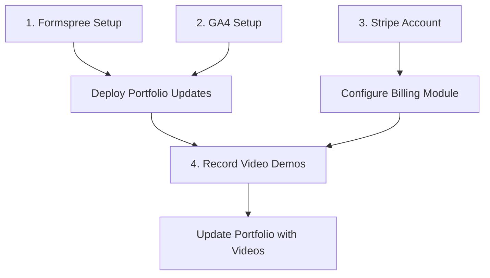

# Immediate Action Items Execution Plan

**Created**: February 13, 2026
**Purpose**: Detailed execution plan for portfolio immediate action items
**Status**: Ready for Implementation

---

## Executive Summary

This document provides step-by-step instructions for completing four critical action items identified in the portfolio audit:

| Priority | Action Item | Impact | Dependencies |
|----------|-------------|--------|--------------|
| P0 | Configure Formspree | Email capture for all projects | None |
| P0 | Set up Google Analytics 4 | Data-driven optimization | None |
| P1 | Create Stripe account | Billing module activation | None |
| P2 | Record video demos | Portfolio showcase enhancement | None |

---

## Action 1: Configure Formspree Email Capture

### Overview
The portfolio website has an email capture form with a placeholder Formspree ID. This needs to be replaced with an actual Formspree form to enable email subscriptions.

### Prerequisites
- [ ] Formspree account (free tier available at formspree.io)
- [ ] Access to GitHub repository: `ChunkyTortoise/chunkytortoise.github.io`

### Step-by-Step Instructions

#### Step 1: Create Formspree Account
1. Navigate to [formspree.io](https://formspree.io)
2. Click "Get Started" or "Sign Up"
3. Create account using:
   - Email: `caymanroden@gmail.com` (recommended for consistency)
   - Or sign up with GitHub (recommended for easier integration)
4. Verify email address if required

#### Step 2: Create a New Form
1. Log into Formspree dashboard
2. Click "New Form" or "Create Form"
3. Configure form settings:
   - **Form Name**: `Portfolio Newsletter Signup`
   - **Email Notifications**: Enable to `caymanroden@gmail.com`
   - **Spam Protection**: Enable reCAPTCHA (recommended)
4. Click "Create Form"
5. Copy the Form ID from the form endpoint URL
   - Example: If endpoint is `https://formspree.io/f/xyzabcde`, the Form ID is `xyzabcde`

#### Step 3: Update Portfolio Website

**File to Modify**: `/Users/cave/Documents/GitHub/chunkytortoise.github.io/index.html`

**Current Code (Line 67)**:
```html
<form class="max-w-md mx-auto mb-6" action="https://formspree.io/f/YOUR_FORMSPREE_ID" method="POST">
```

**Change To**:
```html
<form class="max-w-md mx-auto mb-6" action="https://formspree.io/f/YOUR_ACTUAL_FORM_ID" method="POST">
```

**Exact Command**:
```bash
cd /Users/cave/Documents/GitHub/chunkytortoise.github.io
# Replace YOUR_FORMSPREE_ID with actual form ID
sed -i '' 's/YOUR_FORMSPREE_ID/xyzabcde/g' index.html  # Replace xyzabcde with your actual form ID
```

#### Step 4: Commit and Deploy
```bash
cd /Users/cave/Documents/GitHub/chunkytortoise.github.io
git add index.html
git commit -m "feat: configure Formspree email capture form"
git push origin main
```

### Verification Steps
1. Wait 1-2 minutes for GitHub Pages deployment
2. Visit [chunkytortoise.github.io](https://chunkytortoise.github.io)
3. Enter a test email in the subscription form
4. Click "Subscribe"
5. Verify:
   - Form submits successfully (no error page)
   - Email received at `caymanroden@gmail.com`
   - Submission appears in Formspree dashboard

### Code Changes Summary

| File | Line | Change |
|------|------|--------|
| `index.html` | 67 | Replace `YOUR_FORMSPREE_ID` with actual Formspree form ID |

---

## Action 2: Set Up Google Analytics 4

### Overview
The portfolio website has GA4 tracking code with a placeholder Measurement ID. This needs to be replaced with an actual GA4 property ID to enable analytics tracking.

### Prerequisites
- [ ] Google account (caymanroden@gmail.com recommended)
- [ ] Access to Google Analytics 4
- [ ] Access to GitHub repository: `ChunkyTortoise/chunkytortoise.github.io`

### Step-by-Step Instructions

#### Step 1: Create GA4 Property
1. Navigate to [Google Analytics](https://analytics.google.com)
2. Sign in with Google account
3. Click "Admin" (gear icon) in bottom-left
4. Click "Create Account" or use existing account
5. Configure account settings:
   - **Account Name**: `Cayman Roden Portfolio`
   - **Account Data Sharing**: Enable all recommended options
6. Click "Next"

#### Step 2: Create Property
1. Under "Property Setup":
   - **Property Name**: `chunkytortoise.github.io`
   - **Reporting Time Zone**: `America/Los_Angeles` (PST)
   - **Currency**: `USD`
2. Click "Next"
3. Under "Business Objectives", select:
   - "Get baseline reports"
   - "Measure user engagement"
4. Click "Create"

#### Step 3: Set Up Data Stream
1. Select "Web" as platform
2. Configure data stream:
   - **Website URL**: `https://chunkytortoise.github.io`
   - **Stream Name**: `Portfolio Website`
   - **Enhanced Measurement**: Enable (tracks page views, scrolls, outbound clicks, site search)
3. Click "Create Stream"
4. Copy the **Measurement ID** (format: `G-XXXXXXXXXX`)
   - Found under "Web Stream Details" > "Measurement ID"

#### Step 4: Update Portfolio Website

**File to Modify**: `/Users/cave/Documents/GitHub/chunkytortoise.github.io/index.html`

**Current Code (Lines 20-29)**:
```html
<!-- Google Analytics 4 -->
<!-- NOTE: Replace G-XXXXXXXXXX with your actual GA4 Measurement ID from Google Analytics -->
<!-- To set up: 1) Go to analytics.google.com 2) Create a GA4 property 3) Copy the Measurement ID -->
<script async src="https://www.googletagmanager.com/gtag/js?id=G-XXXXXXXXXX"></script>
<script>
    window.dataLayer = window.dataLayer || [];
    function gtag(){dataLayer.push(arguments);}
    gtag('js', new Date());
    gtag('config', 'G-XXXXXXXXXX');
</script>
```

**Change To** (replace `G-XXXXXXXXXX` with actual Measurement ID):
```html
<!-- Google Analytics 4 -->
<script async src="https://www.googletagmanager.com/gtag/js?id=G-XXXXXXXXXX"></script>
<script>
    window.dataLayer = window.dataLayer || [];
    function gtag(){dataLayer.push(arguments);}
    gtag('js', new Date());
    gtag('config', 'G-XXXXXXXXXX');
</script>
```

**Exact Commands**:
```bash
cd /Users/cave/Documents/GitHub/chunkytortoise.github.io
# Replace G-XXXXXXXXXX with actual GA4 Measurement ID (both occurrences)
sed -i '' 's/G-XXXXXXXXXX/G-XXXXXXXXXX/g' index.html  # Replace with actual ID
```

#### Step 5: Add GA4 to Other Pages (Optional but Recommended)
Apply the same GA4 tracking code to all HTML pages:
- `projects.html`
- `services.html`
- `certifications.html`
- `case-studies.html`
- `benchmarks.html`
- `blog.html`
- `about.html`

**Command to update all pages**:
```bash
cd /Users/cave/Documents/GitHub/chunkytortoise.github.io
for file in *.html; do
  # Add GA4 script after <head> tag if not already present
  # This requires manual verification per file
done
```

#### Step 6: Commit and Deploy
```bash
cd /Users/cave/Documents/GitHub/chunkytortoise.github.io
git add *.html
git commit -m "feat: configure Google Analytics 4 tracking"
git push origin main
```

### Verification Steps
1. Wait 1-2 minutes for GitHub Pages deployment
2. Visit [chunkytortoise.github.io](https://chunkytortoise.github.io)
3. Open browser Developer Tools (F12) > Network tab
4. Filter for "google" or "gtag"
5. Verify requests to `googletagmanager.com/gtag/js`
6. In GA4 dashboard:
   - Go to "Reports" > "Realtime"
   - Verify active users count increases
   - May take 24-48 hours for full data population

### Code Changes Summary

| File | Lines | Change |
|------|-------|--------|
| `index.html` | 23, 28 | Replace `G-XXXXXXXXXX` with actual GA4 Measurement ID |
| `projects.html` | (add) | Add GA4 tracking code after `<head>` |
| `services.html` | (add) | Add GA4 tracking code after `<head>` |
| `certifications.html` | (add) | Add GA4 tracking code after `<head>` |
| `case-studies.html` | (add) | Add GA4 tracking code after `<head>` |
| `benchmarks.html` | (add) | Add GA4 tracking code after `<head>` |
| `blog.html` | (add) | Add GA4 tracking code after `<head>` |
| `about.html` | (add) | Add GA4 tracking code after `<head>` |

---

## Action 3: Create Stripe Account for Billing Module

### Overview
The EnterpriseHub billing module requires Stripe API keys to enable subscription management and payment processing.

### Prerequisites
- [ ] Business bank account for payouts
- [ ] Business information (address, tax ID if applicable)
- [ ] Access to EnterpriseHub repository

### Step-by-Step Instructions

#### Step 1: Create Stripe Account
1. Navigate to [stripe.com](https://stripe.com)
2. Click "Start now" or "Sign up"
3. Create account with:
   - **Email**: `caymanroden@gmail.com`
   - **Password**: Create strong password
4. Verify email address
5. Complete account activation:
   - **Business Type**: Individual/Sole Proprietor or LLC
   - **Business Name**: `Cayman Roden` or business name
   - **Business Address**: Your address
   - **Tax ID**: SSN or EIN (for verification)
   - **Bank Account**: For payouts (routing + account number)

#### Step 2: Get API Keys
1. Log into Stripe Dashboard
2. Toggle to "Test mode" (for development)
3. Navigate to "Developers" > "API Keys"
4. Copy the following keys:
   - **Publishable Key**: Starts with `pk_test_`
   - **Secret Key**: Starts with `sk_test_` (click "Reveal test key")
5. For production, toggle to "Live mode" and get live keys:
   - **Publishable Key**: Starts with `pk_live_`
   - **Secret Key**: Starts with `sk_live_`

#### Step 3: Create Products and Prices in Stripe
1. In Stripe Dashboard, go to "Products"
2. Create products for each plan tier:

**Starter Plan ($49/month)**:
```
Name: Starter Plan
Description: Perfect for small teams getting started with AI-powered real estate
Price: $49.00 / month
Price ID: price_xxxxx (save this)
```

**Professional Plan ($149/month)**:
```
Name: Professional Plan
Description: For growing teams ready to automate their entire pipeline
Price: $149.00 / month
Price ID: price_xxxxx (save this)
```

**Enterprise Plan ($499/month)**:
```
Name: Enterprise Plan
Description: White-label solution for brokerages and large teams
Price: $499.00 / month
Price ID: price_xxxxx (save this)
```

#### Step 4: Configure Webhook
1. In Stripe Dashboard, go to "Developers" > "Webhooks"
2. Click "Add endpoint"
3. Configure:
   - **Endpoint URL**: `https://your-domain.com/webhook/stripe` (update with actual domain)
   - **Events to send**: Select these events:
     - `checkout.session.completed`
     - `customer.subscription.created`
     - `customer.subscription.updated`
     - `customer.subscription.deleted`
     - `invoice.paid`
     - `invoice.payment_failed`
4. Click "Add endpoint"
5. Copy the **Signing Secret** (starts with `whsec_`)

#### Step 5: Update Environment Variables

**File to Modify**: `.env` (create if not exists)

Add the following environment variables:
```bash
# Stripe Configuration
STRIPE_SECRET_KEY=your_stripe_secret_key
STRIPE_PUBLISHABLE_KEY=pk_test_xxxxxxxxxxxxxxxxxxxxxxxx
STRIPE_WEBHOOK_SECRET=whsec_xxxxxxxxxxxxxxxxxxxxxxxx

# Stripe Price IDs (from Step 3)
STRIPE_STARTER_PRICE_ID=price_xxxxx
STRIPE_PROFESSIONAL_PRICE_ID=price_xxxxx
STRIPE_ENTERPRISE_PRICE_ID=price_xxxxx
```

**For Production (.env.production)**:
```bash
# Stripe Configuration (Production)
STRIPE_SECRET_KEY=your_live_stripe_secret_key
STRIPE_PUBLISHABLE_KEY=pk_live_xxxxxxxxxxxxxxxxxxxxxxxx
STRIPE_WEBHOOK_SECRET=whsec_xxxxxxxxxxxxxxxxxxxxxxxx
```

#### Step 6: Update Billing Module Configuration

**File**: `billing/stripe_client.py`

The billing module already reads from environment variables (lines 44-46):
```python
self.api_key = api_key or os.environ.get("STRIPE_SECRET_KEY")
self.publishable_key = publishable_key or os.environ.get("STRIPE_PUBLISHABLE_KEY")
self.webhook_secret = webhook_secret or os.environ.get("STRIPE_WEBHOOK_SECRET")
```

**File**: `billing/__init__.py`

Add price ID helper function (optional enhancement):
```python
def get_stripe_price_id(plan_tier: PlanTier) -> str:
    """Get Stripe price ID for a plan tier."""
    import os
    price_map = {
        PlanTier.STARTER: os.environ.get("STRIPE_STARTER_PRICE_ID"),
        PlanTier.PROFESSIONAL: os.environ.get("STRIPE_PROFESSIONAL_PRICE_ID"),
        PlanTier.ENTERPRISE: os.environ.get("STRIPE_ENTERPRISE_PRICE_ID"),
    }
    return price_map.get(plan_tier)
```

#### Step 7: Deploy Updated Configuration
```bash
cd /Users/cave/Documents/GitHub/EnterpriseHub
# Update .env file with actual Stripe keys
# DO NOT commit .env to git - it's in .gitignore

# For Railway deployment:
railway variables set STRIPE_SECRET_KEY=sk_test_xxx
railway variables set STRIPE_PUBLISHABLE_KEY=pk_test_xxx
railway variables set STRIPE_WEBHOOK_SECRET=whsec_xxx

# For local testing:
# Ensure .env file is populated
python -c "from billing.stripe_client import StripeClient; c = StripeClient(); print(f'Stripe enabled: {c.enabled}')"
```

### Verification Steps
1. **Test API Connection**:
   ```python
   import stripe
   stripe.api_key = "sk_test_xxx"
   # Should not raise error
   print(stripe.Account.retrieve())
   ```

2. **Test Billing Module**:
   ```python
   from billing.stripe_client import StripeClient
   client = StripeClient()
   print(f"Stripe enabled: {client.enabled}")
   ```

3. **Test Customer Creation** (in test mode):
   ```python
   import asyncio
   from billing.stripe_client import StripeClient
   
   async def test():
       client = StripeClient()
       customer = await client.create_customer(
           email="test@example.com",
           name="Test Customer"
       )
       print(f"Created customer: {customer['id']}")
   
   asyncio.run(test())
   ```

4. **Verify in Stripe Dashboard**:
   - Go to "Customers" in test mode
   - Verify test customer appears

### Code Changes Summary

| File | Change |
|------|--------|
| `.env` | Add `STRIPE_SECRET_KEY`, `STRIPE_PUBLISHABLE_KEY`, `STRIPE_WEBHOOK_SECRET` |
| `.env.example` | Document required Stripe environment variables |
| Railway/Render env | Set production Stripe keys |

### Security Notes
- **Never commit API keys to git**
- Use test mode for development
- Rotate keys if accidentally exposed
- Set up webhook signature verification
- Enable Stripe Radar for fraud prevention

---

## Action 4: Record Video Demos

### Overview
Create video demonstrations for key repositories to enhance portfolio showcase and product listings.

### Prerequisites
- [ ] Screen recording software (OBS Studio, Loom, or QuickTime)
- [ ] Microphone (built-in acceptable)
- [ ] Quiet recording environment
- [ ] Demo data prepared

### Video Scripts and Requirements

#### Video 1: EnterpriseHub Platform Overview (5 minutes)

**Purpose**: Portfolio centerpiece for client presentations

**Script Outline**:
```
0:00-0:30 - Introduction
  "Hi, I'm Cayman Roden. This is EnterpriseHub, a multi-agent AI platform 
  I built for real estate lead qualification."

0:30-1:30 - Architecture Overview
  - Show architecture diagram
  - Explain 3-bot system (Lead, Buyer, Seller)
  - Highlight handoff mechanism

1:30-2:30 - Live Demo
  - Open Streamlit demo (ct-enterprise-ai.streamlit.app)
  - Show lead qualification flow
  - Demonstrate bot handoff

2:30-3:30 - Technical Deep Dive
  - Show code: jorge_handoff_service.py
  - Explain confidence threshold (0.7)
  - Show test coverage

3:30-4:30 - BI Dashboard
  - Show analytics tab
  - Demonstrate Monte Carlo simulation
  - Show cost tracking

4:30-5:00 - Call to Action
  "If you need multi-agent systems or AI automation, 
  reach out at chunkytortoise.github.io"
```

**Recording Setup**:
- Resolution: 1920x1080 (1080p)
- Frame rate: 30fps
- Audio: Clear narration, no background noise

#### Video 2: RAG System Walkthrough (8 minutes)

**Purpose**: Gumroad product demo for docqa-engine

**Script Outline**:
```
0:00-0:45 - Introduction
  "This is DocQA Engine, a production RAG system I built 
  that lets you chat with your documents."

0:45-2:00 - Quick Start Demo
  - Upload a sample PDF
  - Ask questions
  - Show citations

2:00-4:00 - Technical Architecture
  - Explain hybrid retrieval (BM25 + vectors)
  - Show cross-encoder re-ranking
  - Demonstrate query expansion

4:00-6:00 - API Demo
  - Show FastAPI endpoints
  - Make curl requests
  - Show rate limiting

6:00-7:30 - Customization Options
  - Show configuration file
  - Explain embedding options
  - Show LLM provider switching

7:30-8:00 - Closing
  "Available on Gumroad for $25. Link in description."
```

#### Video 3: Multi-Agent Handoff Demo (5 minutes)

**Purpose**: Technical showcase for engineering audiences

**Script Outline**:
```
0:00-0:30 - Problem Statement
  "Multi-agent systems need reliable handoffs. 
  Here's how I solved this problem."

0:30-2:00 - Handoff Service Demo
  - Show handoff evaluation code
  - Demonstrate confidence scoring
  - Show circular prevention logic

2:00-3:30 - A/B Testing Integration
  - Show A/B testing service
  - Demonstrate variant assignment
  - Show statistical significance

3:30-4:30 - Performance Tracking
  - Show P50/P95/P99 metrics
  - Demonstrate alerting rules

4:30-5:00 - Summary
  "Full code available on GitHub. Link below."
```

#### Video 4: Quick Start - docqa-engine (3 minutes)

**Purpose**: Product landing page video

**Script Outline**:
```
0:00-0:15 - Hook
  "Get a document chatbot running in 10 minutes."

0:15-1:30 - Installation
  - pip install docqa-engine
  - Set up environment
  - Run server

1:30-2:30 - Usage Demo
  - Upload document
  - Ask questions
  - Show results

2:30-3:00 - Closing
  "Get started at gumroad.com/l/docqa-engine"
```

### Recording Commands

**Using OBS Studio**:
```bash
# Install OBS Studio (macOS)
brew install --cask obs

# Recording settings:
# - Output: 1920x1080, 30fps
# - Audio: 48kHz, mono
# - Format: MP4 (H.264)
```

**Using Loom (Browser-based)**:
1. Install Loom extension
2. Select "Screen + Camera"
3. Record and auto-upload

**Using QuickTime (macOS built-in)**:
```bash
# Open QuickTime Player
# File > New Screen Recording
# Select recording area
# Click Record
```

### Post-Production

**Editing (Optional)**:
```bash
# Using DaVinci Resolve (free)
# Or use built-in tools:
# - Trim start/end
# - Add title cards
# - Normalize audio
```

**Export Settings**:
- Format: MP4 (H.264)
- Resolution: 1920x1080
- Bitrate: 8-12 Mbps
- Audio: AAC, 128kbps

### Publishing Locations

| Video | Platform | Location |
|-------|----------|----------|
| EnterpriseHub Overview | YouTube | Public, linked in portfolio |
| RAG System Walkthrough | YouTube + Gumroad | Product page |
| Multi-Agent Handoff | YouTube | Public, linked in case studies |
| Quick Start docqa-engine | Gumroad | Product page |

### Verification Steps
1. Watch each video in full
2. Verify audio clarity
3. Check screen text is readable
4. Test on mobile device
5. Verify links in description work

---

## Execution Order and Dependencies

### Recommended Sequence



### Parallel Execution
- **Actions 1, 2, 3** can be done in parallel (no dependencies)
- **Action 4** should be done after 1-2 (videos reference portfolio)

### Critical Path
1. Formspree + GA4 (can parallelize)
2. Deploy portfolio updates
3. Stripe account creation
4. Video recording (uses updated portfolio)

---

## Summary Checklist

### Formspree Configuration
- [ ] Create Formspree account
- [ ] Create newsletter form
- [ ] Copy form ID
- [ ] Update `index.html` line 67
- [ ] Commit and push
- [ ] Test form submission

### Google Analytics 4
- [ ] Create GA4 property
- [ ] Create web data stream
- [ ] Copy Measurement ID
- [ ] Update `index.html` lines 23, 28
- [ ] Add GA4 to other HTML pages
- [ ] Commit and push
- [ ] Verify in GA4 dashboard

### Stripe Account
- [ ] Create Stripe account
- [ ] Complete account activation
- [ ] Get test API keys
- [ ] Create products and prices
- [ ] Configure webhook
- [ ] Update `.env` file
- [ ] Test API connection
- [ ] Deploy to production

### Video Demos
- [ ] Set up recording environment
- [ ] Record EnterpriseHub overview (5 min)
- [ ] Record RAG walkthrough (8 min)
- [ ] Record handoff demo (5 min)
- [ ] Record quick start (3 min)
- [ ] Edit and export
- [ ] Upload to platforms
- [ ] Update portfolio links

---

## Support and Resources

### Formspree
- Documentation: [help.formspree.io](https://help.formspree.io)
- Free tier: 50 submissions/month
- Paid plans: Starting at $10/month

### Google Analytics 4
- Documentation: [developers.google.com/analytics](https://developers.google.com/analytics)
- GA4 Setup Guide: [support.google.com/analytics](https://support.google.com/analytics/answer/9304153)

### Stripe
- Documentation: [stripe.com/docs](https://stripe.com/docs)
- Test mode guide: [stripe.com/docs/testing](https://stripe.com/docs/testing)
- CLI for testing: `brew install stripe/stripe-cli/stripe`

### Video Recording
- OBS Studio: [obsproject.com](https://obsproject.com)
- Loom: [loom.com](https://www.loom.com)
- DaVinci Resolve: [blackmagicdesign.com/products/davinciresolve](https://www.blackmagicdesign.com/products/davinciresolve)

---

**Document Version**: 1.0
**Last Updated**: February 13, 2026
**Next Review**: After completion of all action items
