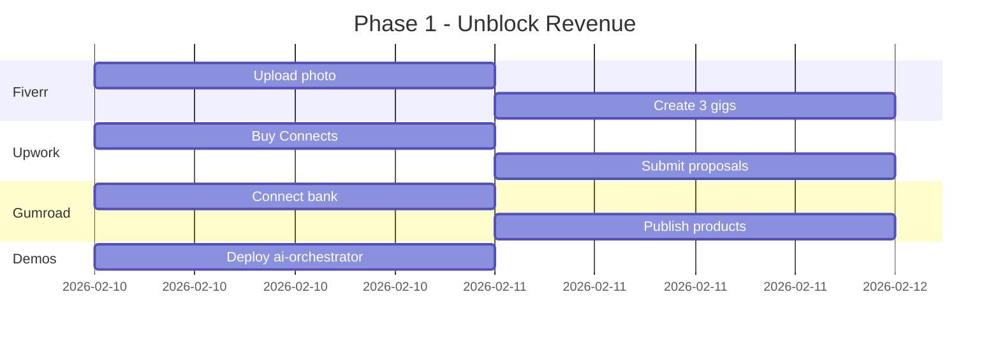

# Portfolio Enhancement Spec: Maximizing Value for Earning Potential

**Created**: February 9, 2026
**Purpose**: Comprehensive evaluation and enhancement plan to maximize portfolio value for hiring potential and income generation
**Status**: Draft for Review

---

## Executive Summary

### Current Portfolio State

| Metric | Value |
|--------|-------|
| **Total Repositories** | 11 |
| **Total Tests** | ~7,243 (all CI green) |
| **Live Demos** | 5 Streamlit apps |
| **Monetization Channels** | 6 active (Upwork, Fiverr, Gumroad, Cold Outreach, GitHub Sponsors, Content) |
| **Active Leads** | 2 (FloPro $75/hr, Kialash Sr AI Eng) |

### Strategic Goals

1. **Maximize hiring potential** for Senior AI Engineer roles ($150K-$250K)
2. **Generate freelance income** through multiple channels ($5K-$15K/month potential)
3. **Build passive income** via product sales ($500-$2K/month potential)
4. **Establish thought leadership** through content and open source

---

## Part 1: Repository Audit

### 1.1 Repository Strengths Matrix

| Repo | Tests | Demo | API | Docker | CLI | Docs | Market Relevance |
|------|-------|------|-----|--------|-----|------|------------------|
| **EnterpriseHub** | 4,937 | ✅ | ✅ FastAPI | ✅ | ❌ | ✅ | HIGH - Multi-agent AI |
| **docqa-engine** | 382 | ✅ | ✅ FastAPI | ❌ | ❌ | ✅ | HIGH - RAG systems |
| **insight-engine** | 405 | ✅ | ❌ | ❌ | ❌ | ✅ | MEDIUM - Analytics |
| **ai-orchestrator** | 289 | Pending | ✅ FastAPI | ❌ | ✅ | ✅ | HIGH - LLM orchestration |
| **scrape-and-serve** | 236 | ✅ | ❌ | ❌ | ❌ | ✅ | MEDIUM - Web scraping |
| **mcp-toolkit** | 158 | ✅ | ❌ | ❌ | ✅ | ✅ | HIGH - MCP/Agents |
| **jorge_real_estate_bots** | 279 | ❌ | ✅ FastAPI | ✅ | ❌ | ✅ | NICHE - Real estate |
| **Revenue-Sprint** | 240 | ❌ | ❌ | ✅ | ✅ | ✅ | MEDIUM - CLI tools |
| **prompt-engineering-lab** | 127 | Pending | ❌ | ❌ | ✅ | ✅ | HIGH - Prompt engineering |
| **llm-integration-starter** | 149 | Pending | ❌ | ❌ | ✅ | ✅ | HIGH - LLM integration |

### 1.2 Gap Analysis by Repository

#### EnterpriseHub (Flagship)
**Strengths:**
- Most comprehensive: 4,937 tests, multi-agent architecture
- Production patterns: L1/L2/L3 caching, JWT auth, rate limiting
- Real domain application (real estate)
- CRM integrations (GHL, HubSpot, Salesforce)

**Gaps:**
- ❌ No CLI tool for quick operations
- ⚠️ Niche domain may limit appeal to non-real-estate clients
- ⚠️ Complex setup despite `make demo`

**Improvements:**
1. Add architecture decision records (ADRs)
2. Create 5-minute video walkthrough
3. Add generic use case examples beyond real estate
4. Highlight transferable patterns (multi-agent, caching, CRM sync)

---

#### docqa-engine (High Value Product)
**Strengths:**
- Complete RAG pipeline with hybrid retrieval
- Works without API keys (TF-IDF fallback)
- REST API with auth and rate limiting
- Strong monetization potential ($49 on Gumroad)

**Gaps:**
- ❌ No Docker containerization
- ❌ No CLI for batch processing
- ⚠️ Missing evaluation benchmarks comparison

**Improvements:**
1. Add Docker support for deployment
2. Create CLI for batch document processing
3. Add benchmark comparisons vs LangChain
4. Create "Why I built this instead of using LangChain" article

---

#### ai-orchestrator / AgentForge (High Value Product)
**Strengths:**
- Multi-provider support (Claude, GPT, Gemini, Perplexity)
- Lightweight (~15KB vs LangChain's ~50MB)
- ReAct agent loop with tool chaining
- Cost tracking and evaluation framework

**Gaps:**
- ⚠️ Streamlit demo pending deployment
- ⚠️ Limited documentation on advanced patterns
- ❌ No streaming response examples

**Improvements:**
1. Deploy Streamlit demo (PRIORITY)
2. Add streaming response examples
3. Create migration guide from LangChain
4. Add performance benchmarks

---

#### insight-engine (Analytics Showcase)
**Strengths:**
- Comprehensive analytics: forecasting, clustering, statistical tests
- KPI framework and dimensionality reduction
- Auto-profiling and model observatory
- Good for data analyst positions

**Gaps:**
- ❌ No REST API
- ❌ No Docker support
- ⚠️ Limited to Streamlit UI

**Improvements:**
1. Add FastAPI endpoints for programmatic access
2. Create CLI for batch analysis
3. Add export formats (PDF reports, Excel)

---

#### mcp-toolkit (Emerging Tech)
**Strengths:**
- Model Context Protocol expertise (emerging standard)
- CLI tool included
- First-mover advantage in MCP space

**Gaps:**
- ⚠️ Limited awareness of MCP in market
- ⚠️ Needs more real-world examples

**Improvements:**
1. Create MCP server templates
2. Write "Introduction to MCP" article
3. Add integration examples with Claude Desktop

---

### 1.3 Cross-Cutting Improvements

| Area | Current State | Target State | Priority |
|------|---------------|--------------|----------|
| **Video Demos** | None | 2-5 min walkthrough per repo | P0 |
| **Architecture Diagrams** | Some Mermaid | Full C4 model diagrams | P1 |
| **Benchmarks** | Ad-hoc | Standardized performance comparisons | P1 |
| **Docker Support** | 3/11 repos | 8/11 repos | P2 |
| **CLI Tools** | 5/11 repos | 9/11 repos | P2 |
| **Type Hints** | Partial | 100% coverage | P3 |

---

## Part 2: Market Alignment Analysis

### 2.1 In-Demand Skills Mapping

| Skill (2026 Market) | Portfolio Evidence | Strength |
|---------------------|-------------------|----------|
| **RAG Systems** | docqa-engine, EnterpriseHub | ✅ Strong |
| **Multi-Agent Systems** | EnterpriseHub (3 bots + handoffs) | ✅ Strong |
| **LLM Orchestration** | ai-orchestrator, llm-integration-starter | ✅ Strong |
| **Claude/GPT Integration** | All AI repos | ✅ Strong |
| **FastAPI** | EnterpriseHub, docqa-engine, jorge | ✅ Strong |
| **PostgreSQL + Redis** | EnterpriseHub | ✅ Strong |
| **Docker/DevOps** | EnterpriseHub, Revenue-Sprint | ⚠️ Moderate |
| **Streamlit/Dashboards** | 5 live demos | ✅ Strong |
| **CRM Integration** | GHL, HubSpot, Salesforce adapters | ✅ Strong |
| **Evaluation/Testing** | 7,243 tests, eval frameworks | ✅ Strong |
| **LangGraph/LangChain** | Alternative approaches | ⚠️ Indirect |
| **Vector Databases** | Chroma in EnterpriseHub | ⚠️ Moderate |

### 2.2 Target Role Alignment

#### Senior AI Engineer ($150K-$220K)
**Requirements:**
- Multi-agent systems ✅
- RAG pipelines ✅
- Production deployment ✅
- LLM evaluation ✅

**Portfolio Gaps:**
- Enterprise scale examples (add load testing results)
- Team leadership evidence (highlight 22 domain agents)

#### AI Consultant ($75-$150/hr)
**Requirements:**
- Diverse project experience ✅
- Client communication ⚠️ (add case studies)
- Rapid prototyping ✅
- Integration expertise ✅

**Portfolio Gaps:**
- Client testimonials (add to LinkedIn)
- Before/after case studies
- ROI documentation

#### Founding Engineer ($120K-$180K + equity)
**Requirements:**
- Full-stack capability ✅
- Fast iteration ✅
- Product thinking ⚠️ (add product roadmaps)
- Startup mindset ✅

**Portfolio Gaps:**
- 0-to-1 product narratives
- Business impact metrics

---

## Part 3: High-Impact Improvements

### 3.1 Quick Wins (1-2 hours each)

| # | Improvement | Repo(s) | Impact | Effort |
|---|-------------|---------|--------|--------|
| 1 | Deploy ai-orchestrator demo | ai-orchestrator | HIGH | 30 min |
| 2 | Add video walkthrough | EnterpriseHub | HIGH | 2 hours |
| 3 | Create "vs LangChain" comparison | docqa-engine, ai-orchestrator | HIGH | 2 hours |
| 4 | Add performance benchmarks | All AI repos | MEDIUM | 2 hours |
| 5 | Update README badges | All repos | LOW | 30 min |

### 3.2 Medium Investments (4-8 hours each)

| # | Improvement | Repo(s) | Impact | Effort |
|---|-------------|---------|--------|--------|
| 6 | Add Docker support | docqa-engine, insight-engine | MEDIUM | 4 hours |
| 7 | Create CLI tools | EnterpriseHub, docqa-engine | MEDIUM | 4 hours |
| 8 | Write technical articles | All repos | HIGH | 4 hours each |
| 9 | Add architecture diagrams | EnterpriseHub, ai-orchestrator | MEDIUM | 4 hours |
| 10 | Create case studies | EnterpriseHub | HIGH | 6 hours |

### 3.3 Strategic Investments (1-2 weeks each)

| # | Improvement | Impact | Effort |
|---|-------------|--------|--------|
| 11 | Build interactive portfolio site | HIGH | 1 week |
| 12 | Create video course (RAG systems) | HIGH | 2 weeks |
| 13 | Add LangGraph example | MEDIUM | 1 week |
| 14 | Build vector DB comparison | MEDIUM | 1 week |

---

## Part 4: Monetization Channel Optimization

### 4.1 Channel Performance Matrix

| Channel | Status | Monthly Potential | Current Blocker |
|---------|--------|-------------------|-----------------|
| **Upwork** | Active | $5K-$15K | Connects budget ($12) |
| **Fiverr** | Pending | $1K-$3K | Profile photo upload |
| **Gumroad** | Pending | $500-$2K | Bank account connection |
| **Cold Outreach** | Ready | $2K-$10K | Demo URLs needed |
| **GitHub Sponsors** | Ready | $100-$500 | Setup incomplete |
| **Content/Dev.to** | Ready | Indirect | Publishing cadence |

### 4.2 Priority Actions by Channel

#### Upwork (Primary Income)
1. Buy 80 Connects ($12) - UNBLOCK
2. Submit 5 Round 2 proposals (content ready)
3. Complete profile improvements (video, portfolio items)
4. Target rate: $85-$125/hr

#### Fiverr (Passive Income)
1. Upload profile photo - UNBLOCK
2. Create 3 gigs (content ready in `content/fiverr/`)
3. Optimize gig SEO with keywords
4. Target: 2-4 orders/month

#### Gumroad (Product Sales)
1. Connect bank account - UNBLOCK
2. Publish 4 products (content ready in `content/gumroad/`)
3. Add demo video to each product
4. Target: 10-20 sales/month

#### Cold Outreach (High-Value Clients)
1. Deploy remaining Streamlit demos
2. Update portfolio site with live URLs
3. Send 30 targeted emails (templates ready)
4. Target: 2-3 calls/week

---

## Part 5: Content Strategy

### 5.1 Article Pipeline

| # | Title | Target | Repo | Status |
|---|-------|--------|------|--------|
| 1 | "Building a Production RAG System Without LangChain" | Dev.to, HN | docqa-engine | Draft ready |
| 2 | "Multi-Agent Orchestration: Lessons from 3 Production Bots" | Dev.to | EnterpriseHub | Outline |
| 3 | "I Replaced LangChain with 200 Lines of Python" | Dev.to, HN | ai-orchestrator | Draft ready |
| 4 | "From CSV to Dashboard in 30 Seconds" | Dev.to | insight-engine | Draft ready |
| 5 | "Introduction to Model Context Protocol" | Dev.to | mcp-toolkit | Outline |

### 5.2 Video Content Pipeline

| # | Title | Duration | Purpose |
|---|-------|----------|---------|
| 1 | EnterpriseHub Platform Overview | 5 min | Portfolio centerpiece |
| 2 | RAG System Walkthrough | 8 min | Gumroad product demo |
| 3 | Multi-Agent Handoff Demo | 5 min | Technical showcase |
| 4 | Quick Start: docqa-engine | 3 min | Product landing page |

### 5.3 Social Media Cadence

| Platform | Frequency | Content Type |
|----------|-----------|--------------|
| LinkedIn | 3x/week | Technical insights, project updates |
| Dev.to | 1x/week | Long-form technical articles |
| Reddit | 1x/week | Project showcases (r/Python, r/SideProject) |
| HN | 1x/month | Show HN posts for major releases |

---

## Part 6: Execution Roadmap

> **⚠️ Note:** Update the dates in the Gantt chart below before execution. The dates shown are placeholders from the initial planning session (February 2026). Adjust to your current start date.

### Phase 1: Unblock Revenue Channels (Week 1)

**Deliverables:**
- [ ] Fiverr: 3 gigs live
- [ ] Upwork: 5 proposals submitted
- [ ] Gumroad: 4 products published
- [ ] Streamlit: ai-orchestrator demo live

### Phase 2: Content & Visibility (Week 2-3)

**Deliverables:**
- [ ] 2 Dev.to articles published
- [ ] 1 Reddit showcase post
- [ ] 1 HN Show HN post
- [ ] LinkedIn: 6 posts scheduled
- [ ] Video: EnterpriseHub walkthrough recorded

### Phase 3: Portfolio Enhancement (Week 3-4)

**Deliverables:**
- [ ] Docker support added to docqa-engine, insight-engine
- [ ] Architecture diagrams for top 3 repos
- [ ] Performance benchmarks published
- [ ] Case study: EnterpriseHub impact metrics

### Phase 4: Scale & Optimize (Month 2)

**Deliverables:**
- [ ] Interactive portfolio site launched
- [ ] Video course outline (RAG Systems)
- [ ] LangGraph example added
- [ ] First paying Gumroad customers
- [ ] Upwork first completed contract

---

## Part 7: Success Metrics

### 7.1 Leading Indicators (Weekly)

| Metric | Current | Target (4 weeks) |
|--------|---------|------------------|
| Profile views (Upwork) | ~10/week | 50/week |
| Proposal response rate | ~20% | 40% |
| Demo visitors | ~100/week | 500/week |
| GitHub stars (total) | ~50 | 150 |
| LinkedIn post engagement | ~50 views | 200 views |

### 7.2 Lagging Indicators (Monthly)

| Metric | Current | Target (3 months) |
|--------|---------|-------------------|
| Upwork earnings | $0 | $3K-$5K |
| Fiverr earnings | $0 | $500-$1K |
| Gumroad sales | $0 | $500-$1K |
| Job interviews | 1-2/month | 4-6/month |
| Offer rate | ~25% | 50% |

### 7.3 Portfolio Quality Score

| Dimension | Current | Target |
|-----------|---------|--------|
| Test Coverage | 80%+ | 85%+ |
| Documentation | 70% | 90% |
| Demo Availability | 5/11 | 8/11 |
| Video Content | 0 | 4 videos |
| Market Alignment | 75% | 90% |

---

## Appendix A: Repository Quick Links

| Repo | GitHub | Demo | Key Selling Point |
|------|--------|------|-------------------|
| EnterpriseHub | [github.com/ChunkyTortoise/EnterpriseHub](https://github.com/ChunkyTortoise/EnterpriseHub) | ct-enterprise-ai.streamlit.app | Multi-agent AI platform |
| docqa-engine | [github.com/ChunkyTortoise/docqa-engine](https://github.com/ChunkyTortoise/docqa-engine) | ct-document-engine.streamlit.app | Production RAG system |
| insight-engine | [github.com/ChunkyTortoise/insight-engine](https://github.com/ChunkyTortoise/insight-engine) | ct-insight-engine.streamlit.app | Analytics dashboards |
| scrape-and-serve | [github.com/ChunkyTortoise/scrape-and-serve](https://github.com/ChunkyTortoise/scrape-and-serve) | ct-scrape-and-serve.streamlit.app | Web scraping |
| mcp-toolkit | [github.com/ChunkyTortoise/mcp-toolkit](https://github.com/ChunkyTortoise/mcp-toolkit) | ct-mcp-toolkit.streamlit.app | MCP expertise |
| ai-orchestrator | [github.com/ChunkyTortoise/ai-orchestrator](https://github.com/ChunkyTortoise/ai-orchestrator) | PENDING | LLM orchestration |

---

## Appendix B: Content File Locations

| Content Type | Location | Status |
|--------------|----------|--------|
| Fiverr gigs | `content/fiverr/` | Ready to publish |
| Gumroad products | `content/gumroad/` | Ready to publish |
| Upwork proposals | `plans/archive/job-search/` | Ready to submit |
| LinkedIn posts | `plans/archive/linkedin/` | Ready to post |
| Reddit posts | `content/reddit/` | Ready to post |
| Dev.to articles | `content/devto/` | Drafts ready |
| Cold outreach | `content/outreach/` | Templates ready |

---

## Appendix C: Blocker Resolution Checklist

| Blocker | Resolution | Time | Enables |
|---------|------------|------|---------|
| Fiverr profile photo | Upload any headshot | 5 min | 3 gigs, $1K-$3K/month |
| $12 Upwork Connects | Settings > Membership | 2 min | 5 proposals, $5K-$15K/month |
| Gumroad bank account | Settings > Payments | 10 min | 4 products, $500-$2K/month |
| Streamlit demos | Deploy to cloud | 30 min each | Cold outreach, product demos |

---

**Document Version**: 1.0
**Last Updated**: February 9, 2026
**Next Review**: February 16, 2026
