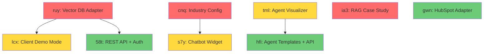

# Service Catalog Development Spec — Agent Execution Plan

**Created**: 2026-02-09
**Beads**: ruy, lcx, 58t, cnq, s7y, gwn, tml, hfi, ia3
**Goal**: Ship 3 premium service lines via parallel agent execution

---

## Execution Model

```
Sprint 1 (Parallel)          Sprint 2 (Parallel)          Sprint 3 (Parallel)
┌──────────────────┐         ┌──────────────────┐         ┌──────────────────┐
│ Agent A: ruy     │         │ Agent D: lcx     │         │ Agent G: 58t     │
│ Vector DB adapter│         │ Client demo mode │         │ REST API + auth  │
│ (docqa-engine)   │         │ (docqa-engine)   │         │ (docqa-engine)   │
├──────────────────┤         ├──────────────────┤         ├──────────────────┤
│ Agent B: cnq     │         │ Agent E: s7y     │         │ Agent H: gwn     │
│ YAML bot config  │         │ Chatbot widget   │         │ HubSpot adapter  │
│ (EnterpriseHub)  │         │ (EnterpriseHub)  │         │ (EnterpriseHub)  │
├──────────────────┤         ├──────────────────┤         ├──────────────────┤
│ Agent C: ia3     │         │ Agent F: tml     │         │ Agent I: hfi     │
│ RAG case study   │         │ Agent visualizer │         │ Agent templates  │
│ (portfolio)      │         │ (ai-orchestrator)│         │ (ai-orchestrator)│
└──────────────────┘         └──────────────────┘         └──────────────────┘
       ↓                            ↓                            ↓
   Tests pass                  Tests pass                   Tests pass
   bd close ruy,cnq,ia3        bd close lcx,s7y,tml         bd close 58t,gwn,hfi
```

**Dependencies**:
- Sprint 2 blocked by Sprint 1: `lcx` needs `ruy`, `s7y` needs `cnq`
- Sprint 3 blocked by Sprint 2: `58t` needs `ruy`, `hfi` needs `tml`
- `ia3` (case study) and `gwn` (HubSpot) are independent — can start anytime

---

## Sprint 1: Foundation (3 Parallel Agents)

### Agent A: Vector DB Adapter Layer (bead `ruy`)

**Repo**: `/Users/cave/Documents/GitHub/docqa-engine`
**Type**: `feature-dev:code-architect` → `feature-dev:feature-dev`

#### Architecture (from exploration)

The docqa-engine uses duck-typed interfaces with no ABCs. The integration point is `HybridRetriever.__init__()` which currently hardcodes `DenseIndex()`:

```python
# Current (retriever.py ~line 160)
class HybridRetriever:
    def __init__(self, embed_fn=None):
        self.bm25 = BM25Index()
        self.dense = DenseIndex()      # ← REPLACE THIS with injection
        self.embed_fn = embed_fn
```

**DenseIndex contract** (duck-typed, `retriever.py:95-134`):
```python
class DenseIndex:
    def add_chunks(self, chunks: list[DocumentChunk], embeddings: np.ndarray) -> None: ...
    def search(self, query_embedding: np.ndarray, top_k: int = 10) -> list[SearchResult]: ...
```

**SearchResult dataclass** (`retriever.py:16-21`):
```python
@dataclass
class SearchResult:
    chunk: DocumentChunk
    score: float
    rank: int = 0
    source: str = ""  # "bm25", "dense", "hybrid"
```

**DocumentChunk dataclass** (`ingest.py:13-20`):
```python
@dataclass
class DocumentChunk:
    chunk_id: str
    document_id: str
    content: str
    metadata: dict[str, Any] = field(default_factory=dict)
    page_number: int | None = None
    char_offset: int = 0
```

#### Implementation Tasks

1. **Create `docqa_engine/vector_store.py`** — New file with:
   ```python
   from abc import ABC, abstractmethod

   class VectorStoreBase(ABC):
       """Abstract interface for vector stores."""
       @abstractmethod
       def add_chunks(self, chunks: list[DocumentChunk], embeddings: np.ndarray) -> None: ...
       @abstractmethod
       def search(self, query_embedding: np.ndarray, top_k: int = 10) -> list[SearchResult]: ...
       @abstractmethod
       def clear(self) -> None: ...
       @abstractmethod
       def count(self) -> int: ...

   class InMemoryVectorStore(VectorStoreBase):
       """Wraps existing DenseIndex logic with the formal interface."""
       # Move DenseIndex code here, implementing VectorStoreBase

   class ChromaDBVectorStore(VectorStoreBase):
       """ChromaDB-backed vector store for persistent semantic search."""
       def __init__(self, collection_name: str = "docqa", persist_dir: str | None = None): ...
       # Use chromadb.Client() or chromadb.PersistentClient()
       # Map add_chunks → collection.add()
       # Map search → collection.query()

   class PineconeVectorStore(VectorStoreBase):
       """Pinecone-backed vector store for cloud-scale semantic search."""
       def __init__(self, index_name: str, api_key: str | None = None, environment: str = "us-east-1"): ...
       # Use pinecone.Index()
       # Map add_chunks → index.upsert()
       # Map search → index.query()
   ```

2. **Modify `retriever.py`** — Accept injectable dense index:
   ```python
   class HybridRetriever:
       def __init__(self, embed_fn=None, dense_index=None):
           self.bm25 = BM25Index()
           self.dense = dense_index or DenseIndex()  # Backward compatible
           self.embed_fn = embed_fn
   ```

3. **Modify `pipeline.py`** — Pass vector store config through:
   ```python
   class DocQAPipeline:
       def __init__(self, vector_store: str = "memory", vector_store_config: dict | None = None):
           store = _create_vector_store(vector_store, vector_store_config or {})
           self._retriever = HybridRetriever(dense_index=store)
   ```

4. **Update `requirements.txt`** — Add optional deps:
   ```
   # Optional vector stores
   chromadb>=0.4.0  # pip install docqa-engine[chromadb]
   pinecone-client>=3.0.0  # pip install docqa-engine[pinecone]
   ```

5. **Create `tests/test_vector_store.py`** — 15-20 tests:
   - `TestInMemoryVectorStore`: add_chunks, search, clear, count, empty search
   - `TestChromaDBVectorStore`: same ops with chromadb (use ephemeral client)
   - `TestPineconeVectorStore`: mock-based tests (don't call real API)
   - `TestHybridRetrieverInjection`: verify DI works, fallback to DenseIndex

6. **Update `app.py`** — Add vector store selector to sidebar:
   - Dropdown: "In-Memory (default)" / "ChromaDB (persistent)" / "Pinecone (cloud)"
   - Show config fields based on selection

#### Agent Prompt
```
You are implementing a vector database adapter layer for the docqa-engine project.

REPO: /Users/cave/Documents/GitHub/docqa-engine
BEAD: ruy — "docqa-engine: Add vector DB adapter layer (Pinecone/ChromaDB)"

CONTEXT:
- The codebase uses duck-typed interfaces (no ABCs currently)
- DenseIndex (retriever.py:95-134) stores embeddings as np.ndarray in memory
- HybridRetriever (retriever.py:158-186) combines BM25 + Dense with RRF fusion
- SearchResult and DocumentChunk are dataclasses in retriever.py and ingest.py
- The embed_fn signature is: async (list[str]) -> np.ndarray
- Tests use pytest + pytest-asyncio, fixtures in conftest.py

IMPLEMENTATION:
1. Create docqa_engine/vector_store.py with VectorStoreBase ABC + 3 implementations:
   - InMemoryVectorStore (wrap existing DenseIndex logic)
   - ChromaDBVectorStore (chromadb.Client, ephemeral or persistent)
   - PineconeVectorStore (pinecone.Index, with mock support for tests)
2. Modify HybridRetriever.__init__ to accept dense_index parameter (backward compatible)
3. Modify DocQAPipeline.__init__ to accept vector_store parameter
4. Add vector store selector to Streamlit sidebar in app.py
5. Update requirements.txt with optional deps
6. Write 15-20 tests in tests/test_vector_store.py
7. Update __init__.py exports

CONSTRAINTS:
- Do NOT break existing tests (236 passing)
- Keep backward compatibility (default = InMemoryVectorStore)
- Use chromadb ephemeral client in tests (no disk writes)
- Mock pinecone client in tests
- Follow existing code style: dataclasses, type hints, async/await
- Run `make test` after to verify all tests pass
```

---

### Agent B: Industry-Agnostic Bot Configuration Layer (bead `cnq`)

**Repo**: `/Users/cave/Documents/GitHub/EnterpriseHub`
**Type**: `feature-dev:code-architect` → `feature-dev:feature-dev`

#### Architecture (from exploration)

Hardcoded domain knowledge is scattered across:

| File | Hardcoded Content | Lines |
|------|-------------------|-------|
| `agents/jorge_seller_bot.py` | Personality prompt, core questions, high-intent accelerators | 169-198, 780-808 |
| `agents/intent_decoder.py` | All intent marker lists (motivation, timeline, condition, price, buyer/seller) | 42-101 |
| `agents/buyer_intent_decoder.py` | Financial readiness, budget, urgency, preference, authority markers | 32-65 |
| `agents/jorge_config.py` | Seller questions, temperature thresholds, environment settings | 111-116, full file |
| `agents/jorge_rancho_config.py` | Neighborhoods, price ranges, regulatory, compliance | Full file (406 lines) |
| `services/jorge/jorge_handoff_service.py` | BUYER_INTENT_PATTERNS, SELLER_INTENT_PATTERNS regex | 80-100 |

**Existing extension points**:
- `JorgeMarketManager` (jorge_config.py) — currently only loads Rancho Cucamonga
- `JorgeEnvironmentSettings` — env var overrides for some settings
- `JorgeFeatureConfig` — feature flags on JorgeSellerBot

#### Implementation Tasks

1. **Create `ghl_real_estate_ai/config/industry_config.py`** — Configuration loader:
   ```python
   from dataclasses import dataclass, field
   from pathlib import Path
   import yaml

   @dataclass
   class BotPersonality:
       name: str
       role: str
       approach: list[str]
       core_values: list[str]
       system_prompt_template: str  # Jinja2 template string
       tone_instructions: dict[str, str]
       phrases: list[str]

   @dataclass
   class IntentMarkers:
       high: list[str]
       medium: list[str]
       low: list[str]

   @dataclass
   class IntentConfig:
       motivation: IntentMarkers
       timeline: IntentMarkers
       condition: IntentMarkers
       price: IntentMarkers
       buyer_patterns: list[dict]  # {pattern: str, weight: float}
       seller_patterns: list[dict]
       scoring_weights: dict[str, float]
       temperature_thresholds: dict[str, dict]

   @dataclass
   class MarketConfig:
       name: str
       state: str
       regulatory_authority: str
       neighborhoods: dict[str, dict]
       price_ranges: dict[str, dict]
       service_areas: list[str]
       compliance_notes: list[str]

   @dataclass
   class QuestionConfig:
       questions: list[dict]  # {id, text, field_mapping}
       follow_ups: dict[str, list[str]]
       accelerators: list[str]

   @dataclass
   class HandoffConfig:
       thresholds: dict[str, float]
       rate_limits: dict[str, int]
       circular_prevention_window: int

   @dataclass
   class IndustryConfig:
       """Complete industry configuration loaded from YAML."""
       industry: str
       market: MarketConfig
       personality: BotPersonality
       intents: IntentConfig
       questions: QuestionConfig
       handoff: HandoffConfig
       business_rules: dict

       @classmethod
       def from_yaml(cls, path: Path) -> "IndustryConfig": ...

       @classmethod
       def default_real_estate(cls) -> "IndustryConfig":
           """Load the built-in real estate config."""
           ...
   ```

2. **Create `ghl_real_estate_ai/config/industries/`** directory with YAML files:
   - `real_estate_rancho.yaml` — Extract existing Rancho Cucamonga config
   - `real_estate_dallas.yaml` — Extract jorge_real_estate_bots Dallas config
   - `dental_practice.yaml` — Example non-RE vertical (demo)
   - `hvac_services.yaml` — Example non-RE vertical (demo)

3. **Create `ghl_real_estate_ai/config/industries/real_estate_rancho.yaml`**:
   ```yaml
   industry: real_estate
   market:
     name: Rancho Cucamonga
     state: CA
     regulatory_authority: DRE
     service_areas: [Rancho Cucamonga, Alta Loma, Etiwanda, Upland, Ontario]
     neighborhoods:
       alta_loma:
         median_price: 1150000
         characteristics: [Mountain views, Excellent schools]
       # ... (extract from jorge_rancho_config.py)
     price_ranges:
       entry: {min: 500000, max: 700000}
       mid: {min: 700000, max: 1200000}
       luxury: {min: 1200000, max: 7000000}

   personality:
     name: Jorge Salas
     role: real estate professional
     approach: [helpful, consultative, relationship-focused]
     core_values:
       - Put the seller's success first
       - Build trust through expertise and care
       - Provide valuable insights and education
     system_prompt_template: |
       You are {{ personality.name }}, a caring and knowledgeable {{ personality.role }}.
       Your approach is: {{ personality.approach | join(', ') | upper }}.
       ...
     phrases:
       - "Look, I can move fast if you're serious"
       - "Let me be straight with you"

   intents:
     motivation:
       high: [need to sell fast, relocating, behind on payments, divorce, estate, probate]
       medium: [thinking about it, might sell next year, curious about value]
       low: [just browsing, not sure, what if rates drop]
     # ... (extract from intent_decoder.py lines 42-101)

     scoring_weights:
       motivation: 0.35
       timeline: 0.30
       condition: 0.20
       price: 0.15

     temperature_thresholds:
       hot: {min_score: 75, questions_required: 4}
       warm: {min_score: 50, questions_required: 3}
       cold: {min_score: 0, questions_required: 0}

   questions:
     seller:
       - id: motivation
         text: "What's got you considering wanting to sell?"
         field_mapping: {primary: motivation}
       - id: timeline
         text: "If our team sold your home within 30-45 days, would that work?"
         field_mapping: {primary: timeline_urgency}
       - id: bottom_line
         text: "What's your bottom-line number?"
         field_mapping: {primary: price_expectation}
       - id: closing_flexibility
         text: "Are you flexible on the closing date?"
         field_mapping: {primary: closing_flexibility}
     accelerators:
       - "It sounds like you're ready to move forward!"
       - "Based on what you've shared, we have a great opportunity here."

   handoff:
     thresholds:
       lead_to_buyer: 0.7
       lead_to_seller: 0.7
       buyer_to_seller: 0.8
       seller_to_buyer: 0.6
     buyer_intent_patterns:
       - {pattern: "\\bi\\s+want\\s+to\\s+buy\\b", weight: 0.3}
       - {pattern: "\\bpre[- ]?approv", weight: 0.3}
     seller_intent_patterns:
       - {pattern: "\\bsell\\s+my\\s+(home|house|property)\\b", weight: 0.3}
       - {pattern: "\\bhome\\s+valu", weight: 0.3}
     rate_limits: {hourly: 3, daily: 10}
     circular_prevention_window: 30

   business_rules:
     commission_rate: 0.06
     min_commission: 0.04
     preferred_timeline_days: 60
   ```

4. **Modify bot constructors** to accept `IndustryConfig`:
   - `JorgeSellerBot.__init__(self, tenant_id, config=None, industry_config=None)`
   - `LeadBotWorkflow.__init__(self, ghl_client=None, config=None, industry_config=None)`
   - `JorgeBuyerBot.__init__(self, ghl_client, location_id, config=None, industry_config=None)`
   - Default: `industry_config = IndustryConfig.default_real_estate()`

5. **Create `tests/test_industry_config.py`** — 20-25 tests:
   - YAML loading/validation for each config section
   - Default config matches existing hardcoded values
   - Dental/HVAC configs load without error
   - Bot constructors accept IndustryConfig
   - Intent markers properly loaded from YAML
   - Template rendering with Jinja2
   - Missing fields have sensible defaults
   - Invalid YAML raises clear errors

#### Agent Prompt
```
You are implementing an industry-agnostic bot configuration layer for EnterpriseHub.

REPO: /Users/cave/Documents/GitHub/EnterpriseHub
BEAD: cnq — "EnterpriseHub: Industry-agnostic bot configuration layer"

CONTEXT:
- Jorge bots (LeadBotWorkflow, JorgeBuyerBot, JorgeSellerBot) have hardcoded
  real estate prompts, intent markers, questions, and market data
- Hardcoded content locations:
  - agents/jorge_seller_bot.py lines 169-198 (questions), 780-808 (personality prompt)
  - agents/intent_decoder.py lines 42-101 (all intent marker lists)
  - agents/buyer_intent_decoder.py lines 32-65 (financial markers)
  - agents/jorge_config.py (seller config, environment settings)
  - agents/jorge_rancho_config.py (Rancho Cucamonga market, 406 lines)
  - services/jorge/jorge_handoff_service.py lines 80-100 (regex patterns)
- Existing extension: JorgeMarketManager, JorgeEnvironmentSettings, JorgeFeatureConfig

IMPLEMENTATION:
1. Create ghl_real_estate_ai/config/industry_config.py with:
   - IndustryConfig dataclass (top-level container)
   - BotPersonality, IntentConfig, MarketConfig, QuestionConfig, HandoffConfig
   - from_yaml() classmethod + default_real_estate() factory
2. Create ghl_real_estate_ai/config/industries/ directory with:
   - real_estate_rancho.yaml (extract existing RC config)
   - real_estate_dallas.yaml (extract jorge_real_estate_bots config)
   - dental_practice.yaml (example non-RE vertical)
   - hvac_services.yaml (example non-RE vertical)
3. Modify bot constructors to accept industry_config parameter (backward compatible)
4. Wire IndustryConfig into intent decoders (replace hardcoded marker lists)
5. Wire IndustryConfig into handoff service (replace hardcoded patterns)
6. Write 20-25 tests in tests/test_industry_config.py
7. Add PyYAML to requirements if not already present

CONSTRAINTS:
- Do NOT break existing tests (4,586 passing)
- Backward compatible: default behavior unchanged when no YAML provided
- YAML configs must validate on load (fail fast on invalid config)
- Use Jinja2 for system prompt template rendering
- Follow existing code style: snake_case, type hints, dataclasses
- Run tests after implementation to verify nothing breaks
```

---

### Agent C: RAG Service Case Study (bead `ia3`)

**Repo**: `/Users/cave/Documents/GitHub/EnterpriseHub` (portfolio docs)
**Type**: `general-purpose`

#### Implementation Tasks

1. **Create case study content** covering:
   - Architecture overview (ingest → chunk → embed → index → search → answer)
   - Technology choices and why (BM25 + TF-IDF hybrid, RRF fusion)
   - Test engineering (236 tests, fixture patterns, async test setup)
   - Performance characteristics (sub-second query, citation scoring)
   - Hallucination detection approach
   - Mermaid architecture diagram
   - Code samples (retriever pipeline, citation scorer)
   - Deployment (Streamlit Cloud, Docker)

2. **Format**: Markdown file suitable for LinkedIn article + Upwork portfolio

#### Agent Prompt
```
You are writing a technical case study about the docqa-engine RAG system.

REPO: /Users/cave/Documents/GitHub/docqa-engine (for reference)
OUTPUT: /Users/cave/Documents/GitHub/EnterpriseHub/plans/case-study-rag-system.md
BEAD: ia3 — "Portfolio: RAG service case study + architecture doc"

CONTEXT:
- docqa-engine is a production RAG system with 236 tests
- Architecture: ingest (PDF/DOCX/TXT/CSV) → chunking (6 strategies) → embedding (TF-IDF) →
  retrieval (BM25 + Dense + Hybrid RRF) → answer generation (LLM) → citation scoring
- Live demo: ct-document-engine.streamlit.app
- Key differentiators: citation faithfulness scoring, hallucination detection,
  6 chunking strategies, batch processing, cost tracking

Write a 1500-2000 word case study titled "Building a Production RAG System:
From Document Ingestion to Cited Answers" covering:
1. Problem statement (why enterprises need document QA)
2. Architecture decisions with Mermaid diagram
3. Key technical challenges solved (chunking strategy selection, citation scoring, hallucination)
4. Test engineering approach (236 tests, async patterns)
5. Results and metrics
6. Deployment approach
7. Lessons learned

TARGET AUDIENCE: Engineering managers and CTOs evaluating RAG vendors on Upwork
TONE: Technical but accessible, demonstrate deep expertise
FORMAT: Markdown with Mermaid diagrams, suitable for LinkedIn article
```

---

## Sprint 2: Sales Assets (3 Parallel Agents)

### Agent D: Client Demo Mode (bead `lcx`)

**Repo**: `/Users/cave/Documents/GitHub/docqa-engine`
**Depends on**: `ruy` (vector DB adapter must exist)

#### Implementation Tasks

1. **Add "Try It" tab to Streamlit app** (`app.py`):
   - File upload widget (PDF, DOCX, TXT, CSV — max 10MB)
   - Auto-chunking with strategy selector
   - Auto-indexing into selected vector store
   - Question input with real-time answer generation
   - Citation display with source highlighting
   - "Share Results" button (generates shareable link or PDF export)

2. **Create demo landing page** (`demo_landing.py`):
   - Hero: "Upload your documents. Ask questions. Get cited answers."
   - 3-step visual: Upload → Ask → Get Answers with Citations
   - Sample questions for demo docs
   - Performance metrics display (query time, chunks searched)

3. **Tests**: 10-15 tests for upload flow, chunking, answer display

#### Agent Prompt
```
You are adding a client demo mode to the docqa-engine Streamlit app.

REPO: /Users/cave/Documents/GitHub/docqa-engine
BEAD: lcx — "docqa-engine: Client demo mode — upload & query flow"
DEPENDS ON: bead ruy (vector_store.py with VectorStoreBase must already exist)

CONTEXT:
- app.py has 5 tabs: Documents, Ask Questions, Prompt Lab, Chunking Lab, Stats
- DocQAPipeline in pipeline.py orchestrates the full RAG flow
- Pipeline stored in st.session_state
- run_async() helper wraps asyncio for Streamlit
- Demo docs in demo_docs/ (python_guide.md, etc.)

IMPLEMENTATION:
1. Add a new "Try It" tab as the FIRST tab in app.py:
   - st.file_uploader for PDF/DOCX/TXT/CSV (max 10MB)
   - Chunking strategy dropdown (default: semantic_tfidf)
   - Vector store selector (In-Memory / ChromaDB)
   - After upload: auto-ingest, show chunk count + processing time
   - Question input with st.text_input
   - Answer display with citations (source doc, chunk text, relevance score)
   - Expandable "Debug" section showing retrieved chunks, scores, timing
2. Add a sidebar "Quick Start" guide with 3 sample questions
3. Add progress indicators during ingestion and search
4. Write 10-15 tests in tests/test_demo_mode.py

CONSTRAINTS:
- Must work without API keys (use mock LLM in demo mode)
- File uploads stored in st.session_state (no disk persistence)
- Max 10MB per file, max 5 files
- Show processing time for each step
- Follow existing Streamlit patterns in app.py
```

---

### Agent E: Interactive Chatbot Widget (bead `s7y`)

**Repo**: `/Users/cave/Documents/GitHub/EnterpriseHub`
**Depends on**: `cnq` (industry config must exist)

#### Implementation Tasks

1. **Create `ghl_real_estate_ai/streamlit_demo/components/chatbot_widget.py`**:
   - Chat UI using `st.chat_message` and `st.chat_input`
   - Industry selector dropdown (loads YAML configs)
   - Simulated bot conversation (using mock LLM or cached responses)
   - Show intent analysis in real-time sidebar (FRS, PCS, temperature)
   - Show handoff triggers when detected
   - Display lead scoring as conversation progresses

2. **Add "Talk to the Bot" tab** to admin dashboard:
   - Full-page chat interface
   - Industry/market selector
   - Real-time metrics panel (intent scores, temperature, handoff signals)

3. **Tests**: 10-15 tests for widget rendering, mock conversation flow

#### Agent Prompt
```
You are building an interactive chatbot demo widget for EnterpriseHub's Streamlit demo.

REPO: /Users/cave/Documents/GitHub/EnterpriseHub
BEAD: s7y — "EnterpriseHub: Interactive chatbot demo widget"
DEPENDS ON: bead cnq (IndustryConfig in ghl_real_estate_ai/config/industry_config.py)

CONTEXT:
- Streamlit demo at ghl_real_estate_ai/streamlit_demo/
- Admin dashboard at ghl_real_estate_ai/streamlit_demo/admin_dashboard.py
- Bot classes: LeadBotWorkflow, JorgeBuyerBot, JorgeSellerBot
- Bots return dicts with: response, temperature, handoff_signals, scores
- IndustryConfig loads from YAML, provides personality, intents, questions
- Demo mode uses mock LLM (no API keys required)

IMPLEMENTATION:
1. Create ghl_real_estate_ai/streamlit_demo/components/chatbot_widget.py:
   - render_chatbot_widget(industry_config: IndustryConfig) function
   - st.chat_message for bot/user messages
   - st.chat_input for user text
   - Sidebar: industry selector, intent scores, temperature gauge
   - Conversation history in st.session_state
   - Process messages through LeadBotWorkflow (mock mode)
   - Show real-time: FRS score, PCS score, temperature tag
   - Highlight handoff triggers when detected
2. Add "Talk to the Bot" as first tab in admin_dashboard.py
3. Pre-seed with 3 example conversations (buyer, seller, cold lead)
4. Write 10-15 tests in tests/test_chatbot_widget.py

CONSTRAINTS:
- Must work in demo mode (USE_MOCK_LLM=true)
- No API keys required
- Use st.chat_message (Streamlit native chat UI)
- Show processing time per response
- Follow existing component patterns in streamlit_demo/components/
```

---

### Agent F: Agent Flow Visualizer (bead `tml`)

**Repo**: `/Users/cave/Documents/GitHub/ai-orchestrator`

#### Architecture (from exploration)

```
agentforge/
├── __init__.py          # Public API: AIOrchestrator
├── orchestrator.py      # Core: AIOrchestrator class
├── client_types.py      # AIResponse, AIStreamChunk dataclasses
├── rate_limiter.py      # TokenBucketLimiter, SlidingWindowLimiter
├── providers/
│   ├── base.py          # ProviderBase ABC: chat(), stream(), is_configured()
│   ├── claude.py        # ClaudeProvider (httpx)
│   ├── openai.py        # OpenAIProvider (httpx)
│   ├── gemini.py        # GeminiProvider (httpx)
│   ├── perplexity.py    # PerplexityProvider (httpx)
│   └── mock.py          # MockProvider (canned responses)
├── tools/
│   ├── registry.py      # ToolRegistry, ToolDefinition
│   ├── executor.py      # ToolExecutor (async), ToolChain
│   └── validators.py    # validate_tool_definition, validate_arguments
├── templates/
│   ├── registry.py      # TemplateRegistry
│   └── builtin.py       # Built-in templates
└── cli.py               # Click CLI: agentforge "prompt" --provider mock
```

**Key classes**:
- `AIOrchestrator`: `chat(provider, prompt)`, `stream(provider, prompt)`, `compare(prompt, providers)`
- `ProviderBase`: `chat()`, `stream()`, `is_configured()`, `name`, `default_model`, `env_key`
- `AIResponse`: `content`, `provider`, `model`, `elapsed_ms`, `metadata`
- `ToolRegistry`: `register()`, `get()`, `list_tools()`
- `ToolExecutor`: `execute()`, `execute_chain()`

#### Implementation Tasks

1. **Create `app.py`** (Streamlit app at repo root):
   - Provider status dashboard (which providers configured)
   - "Run Query" panel: prompt input, provider selector, execute + show response
   - "Compare Providers" panel: run same prompt across N providers, side-by-side
   - "Tool Chain Visualizer": define tool chain, execute, show flow diagram
   - Real-time streaming display using `st.write_stream`
   - Mermaid diagram generation for agent flows

2. **Create `requirements-demo.txt`**: `streamlit>=1.31.0`

3. **Create `.streamlit/config.toml`** for theme/port

4. **Tests**: 10-15 tests for Streamlit components

#### Agent Prompt
```
You are building a Streamlit agent flow visualizer for the ai-orchestrator (AgentForge) project.

REPO: /Users/cave/Documents/GitHub/ai-orchestrator
BEAD: tml — "ai-orchestrator: Streamlit agent flow visualizer demo"

CONTEXT:
- AIOrchestrator is the core class (orchestrator.py): chat(), stream(), compare()
- ProviderBase ABC (providers/base.py): chat(), stream(), is_configured()
- 5 providers: Claude, OpenAI, Gemini, Perplexity, Mock
- MockProvider returns canned responses (no API keys needed)
- AIResponse dataclass: content, provider, model, elapsed_ms, metadata
- ToolRegistry + ToolExecutor for tool chaining
- TemplateRegistry for prompt templates
- CLI via Click: agentforge "prompt" --provider mock
- Dependencies: httpx, python-dotenv (minimal)

IMPLEMENTATION:
1. Create app.py at repo root with 4 tabs:
   Tab 1 "Dashboard": Provider status grid (configured vs not), rate limiter status
   Tab 2 "Chat": Prompt input + provider dropdown + execute → show AIResponse
     - Streaming mode toggle (word-by-word display)
     - Show elapsed_ms, model, metadata
   Tab 3 "Compare": Run same prompt across selected providers
     - Side-by-side results table
     - Latency bar chart (st.bar_chart)
     - Cost comparison if available
   Tab 4 "Tool Chain": Visual tool chain builder
     - Tool list from ToolRegistry
     - Drag-and-drop chain builder (simplified: ordered list)
     - Execute chain → show step-by-step results
     - Generate Mermaid flow diagram of execution
2. Create requirements-demo.txt: streamlit>=1.31.0
3. Create .streamlit/config.toml (port 8505, dark theme)
4. Add Makefile target: `demo: streamlit run app.py`
5. Write 10-15 tests in tests/test_app.py

CONSTRAINTS:
- Must work with MockProvider only (no API keys required)
- Use AIOrchestrator as the main interface (don't bypass to providers)
- Follow existing code patterns (async, dataclasses, type hints)
- Streamlit chat UI for the Chat tab
- Show real-time streaming with st.write_stream
```

---

## Sprint 3: Market Expansion (3 Parallel Agents)

### Agent G: REST API + Auth for docqa-engine (bead `58t`)

**Repo**: `/Users/cave/Documents/GitHub/docqa-engine`
**Depends on**: `ruy` (vector store must exist)

#### Agent Prompt
```
You are adding a FastAPI REST API layer with auth and usage metering to docqa-engine.

REPO: /Users/cave/Documents/GitHub/docqa-engine
BEAD: 58t — "docqa-engine: REST API wrapper with auth & metering"

IMPLEMENTATION:
1. Create docqa_engine/api.py with FastAPI app:
   - POST /api/v1/documents — Upload + ingest document (returns doc_id, chunk_count)
   - POST /api/v1/query — Ask question (returns answer, citations, scores)
   - GET /api/v1/documents — List ingested documents
   - DELETE /api/v1/documents/{doc_id} — Remove document
   - GET /api/v1/health — Health check
   - GET /api/v1/usage — Usage stats for current API key
2. Create docqa_engine/auth.py:
   - API key middleware (X-API-Key header)
   - In-memory key store (for demo) with SQLite option
   - Rate limiting: 100 req/min per key
   - Usage tracking: queries, documents, tokens per key
3. Add to requirements.txt: fastapi, uvicorn, python-multipart
4. Add Makefile target: api: uvicorn docqa_engine.api:app --port 8000
5. Write 15-20 tests in tests/test_api.py

CONSTRAINTS:
- Wire API to DocQAPipeline (same pipeline Streamlit uses)
- API key validation with clear error messages
- JSON responses with consistent schema
- File upload via multipart/form-data
- Rate limit via sliding window (in-memory)
- OpenAPI docs auto-generated at /docs
```

### Agent H: HubSpot CRM Adapter (bead `gwn`)

**Repo**: `/Users/cave/Documents/GitHub/EnterpriseHub`

#### Agent Prompt
```
You are implementing a HubSpot CRM adapter for EnterpriseHub to prove CRM-agnostic architecture.

REPO: /Users/cave/Documents/GitHub/EnterpriseHub
BEAD: gwn — "EnterpriseHub: HubSpot CRM adapter (portability proof)"

CONTEXT:
- Existing GHL client: ghl_real_estate_ai/services/enhanced_ghl_client.py
- GHL client methods: create_contact, update_contact, get_contact, add_tags,
  create_task, search_contacts, rate limiting (10 req/s)
- Used by bots for: contact sync, tag publishing, workflow triggers

IMPLEMENTATION:
1. Create ghl_real_estate_ai/services/crm_adapter.py:
   - CRMAdapterBase ABC with methods matching GHL client interface:
     create_contact, update_contact, get_contact, add_tags, search_contacts
   - GHLAdapter wrapping existing enhanced_ghl_client.py
   - HubSpotAdapter using HubSpot API v3 (httpx, not hubspot SDK)
2. Create ghl_real_estate_ai/services/hubspot_client.py:
   - Contact CRUD, tag/property mapping, rate limiting
   - Field mapping: GHL custom fields → HubSpot properties
3. Write 15-20 tests (mock HubSpot API responses)

CONSTRAINTS:
- Do NOT modify existing GHL client
- ABC must be backward-compatible wrapper around GHL client
- HubSpot uses httpx (consistent with codebase)
- Mock all HubSpot API calls in tests
- Rate limiting: 100 req/10s (HubSpot limit)
```

### Agent I: Agent Templates + REST API (bead `hfi`)

**Repo**: `/Users/cave/Documents/GitHub/ai-orchestrator`
**Depends on**: `tml` (Streamlit app must exist)

#### Agent Prompt
```
You are adding REST API endpoints and pre-built agent templates to ai-orchestrator.

REPO: /Users/cave/Documents/GitHub/ai-orchestrator
BEAD: hfi — "ai-orchestrator: REST API + pre-built agent templates"

CONTEXT:
- AIOrchestrator: chat(), stream(), compare()
- ToolRegistry + ToolExecutor for tool chaining
- TemplateRegistry for prompt templates
- MockProvider for zero-config demo
- Existing templates in agentforge/templates/

IMPLEMENTATION:
1. Create agentforge/api.py with FastAPI:
   - POST /api/v1/chat — {provider, prompt, system?, model?, temperature?} → AIResponse
   - POST /api/v1/stream — Same but SSE streaming
   - POST /api/v1/compare — {prompt, providers[]} → comparison results
   - POST /api/v1/tools/execute — {tool_name, arguments} → result
   - POST /api/v1/chain — {steps: [{tool, args}]} → chain results
   - GET /api/v1/providers — List configured providers
   - GET /api/v1/tools — List registered tools
   - GET /api/v1/templates — List available templates
2. Create 3 pre-built templates in agentforge/templates/builtin.py:
   - "customer_support_triage": Classify support ticket → route to team
   - "data_pipeline_orchestrator": Parse data task → select tools → execute
   - "code_review_agent": Analyze code diff → produce review comments
3. Add to requirements: fastapi, uvicorn
4. Write 15-20 tests

CONSTRAINTS:
- Wire to AIOrchestrator (single instance per app)
- SSE streaming for /stream endpoint
- MockProvider must work (no API keys required)
- OpenAPI docs at /docs
- Templates must be self-contained (no external dependencies)
```

---

## Execution Commands

### Starting Sprint 1 (3 parallel agents)

```bash
# In Claude Code, run this prompt to launch all 3:

# Agent A (docqa vector DB):
Task subagent_type=feature-dev:feature-dev prompt="[Agent A prompt above]" run_in_background=true

# Agent B (industry config):
Task subagent_type=feature-dev:feature-dev prompt="[Agent B prompt above]" run_in_background=true

# Agent C (case study):
Task subagent_type=general-purpose prompt="[Agent C prompt above]" run_in_background=true
```

### After Sprint 1 completes:
```bash
# Verify all tests pass
cd /Users/cave/Documents/GitHub/docqa-engine && make test
cd /Users/cave/Documents/GitHub/EnterpriseHub && python -m pytest tests/test_industry_config.py -v

# Close beads
bd close ruy cnq ia3
bd sync

# Start Sprint 2 (3 parallel agents)
# Agent D, E, F launched similarly
```

### Session Close Protocol:
```bash
git status                    # Check changes in each repo
git add <files>               # Stage per repo
bd close <completed-beads>    # Close finished beads
bd sync                       # Sync beads
git commit -m "feat: ..."     # Commit per repo
git push                      # Push per repo
```

---

## Risk Mitigation

| Risk | Mitigation |
|------|-----------|
| Agent breaks existing tests | Each agent runs `make test` after changes |
| Vector DB deps not installable | ChromaDB + Pinecone are optional extras |
| YAML config schema drift | Validation on load, schema tests |
| Streamlit demo doesn't work in cloud | Test with `streamlit run app.py` locally first |
| HubSpot API changes | All API calls mocked in tests |
| Agent gets stuck | Set max_turns, stop background agents after file changes verified |

## Dependency Graph (Mermaid)



**Legend**: Red = Sprint 1 (foundation), Yellow = Sprint 2 (sales assets), Green = Sprint 3 (expansion)
