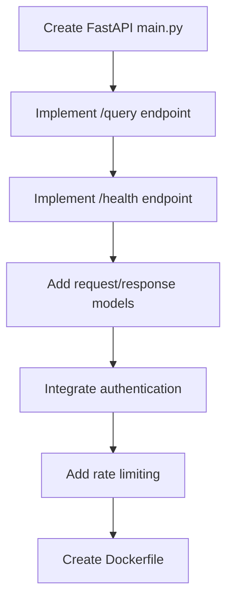
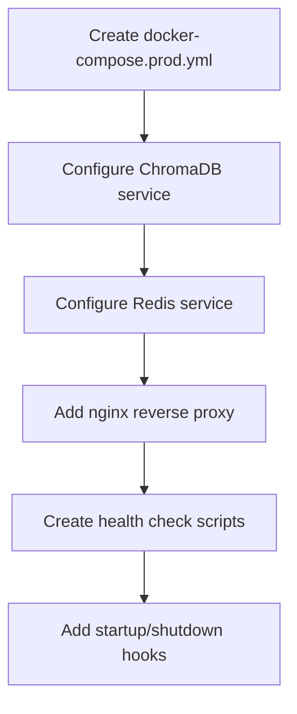
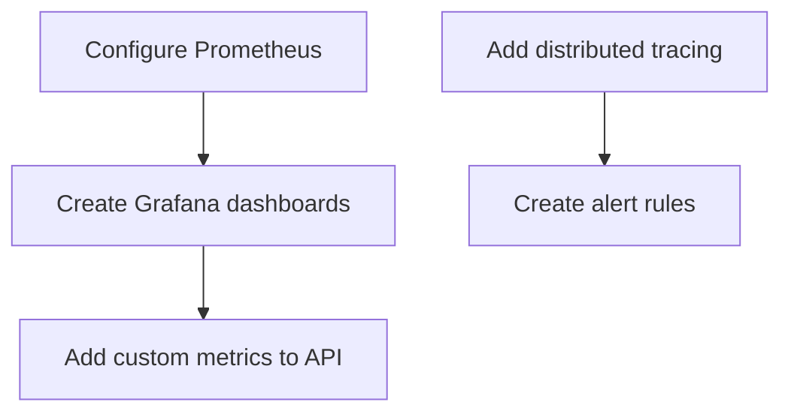

# Phase 4 Production Deployment Roadmap

## Executive Summary

**Phase 4 Scope**: Production Deployment & Advanced Features (Days 16-20)
**Current Status**: Phases 1-3 Complete (60% of project)
**Performance**: 0.7ms end-to-end (214x faster than 150ms target)
**Tests**: 88 tests passing
**ChromaDB Conflict**: RESOLVED (Python 3.12 + numpy<2)

---

## Phase 4 Scope from IMPLEMENTATION_PLAN.md

### Original Phase 4 Definition: "Advanced RAG Patterns (Days 16-20)"

Based on [`IMPLEMENTATION_PLAN.md`](advanced_rag_system/IMPLEMENTATION_PLAN.md:254-323), Phase 4 encompasses:

### Deliverables

#### Day 16: Contextual Compression
- [ ] EmbeddingsFilter implementation
- [ ] LLMChainExtractor
- [ ] LLMChainFilter
- [ ] Token budget management

**Key Files:**
- `src/core/compression/base.py` - Compression interface
- `src/core/compression/embeddings_filter.py` - Similarity filter
- `src/core/compression/llm_extractor.py` - LLM extraction

#### Day 17: Parent Document Retrieval
- [ ] Parent-child chunking
- [ ] Metadata linking
- [ ] Full document retrieval
- [ ] Context assembly

**Key Files:**
- `src/retrieval/parent_document.py` - Parent doc retrieval
- `src/ingestion/chunking.py` - Hierarchical chunking

#### Day 18: Self-Querying
- [ ] Metadata extraction from queries
- [ ] Filter generation
- [ ] Structured query builder
- [ ] LLM-based query understanding

**Key Files:**
- `src/retrieval/self_query/base.py` - Self-query interface
- `src/retrieval/self_query/llm_extractor.py` - LLM metadata extraction
- `src/retrieval/self_query/filter_builder.py` - Filter construction

#### Day 19: Prompt Management
- [ ] Prompt versioning system
- [ ] Template management
- [ ] A/B testing framework
- [ ] Dynamic prompt selection

**Key Files:**
- `src/core/prompts/manager.py` - Prompt manager
- `src/core/prompts/templates.py` - Template definitions
- `src/core/prompts/versioning.py` - Git-based versioning

#### Day 20: Integration & Testing
- [ ] End-to-end RAG pipeline tests
- [ ] Compression effectiveness benchmarks
- [ ] Self-querying accuracy tests
- [ ] Documentation

**Tests:**
- `tests/core/test_compression.py`
- `tests/retrieval/test_self_query.py`
- `tests/integration/test_full_pipeline.py`

### Phase 4 Success Criteria
- [ ] Context compression reducing tokens by 50%+
- [ ] Self-querying accuracy >80%
- [ ] Parent document retrieval working
- [ ] Prompt A/B testing functional

---

## Current Architecture Readiness Assessment

### ✅ Already Implemented (Production-Ready)

| Component | Status | Location | Notes |
|-----------|--------|----------|-------|
| **Production ChromaDB** | ✅ Complete | [`src/vector_store/chroma_production.py`](advanced_rag_system/src/vector_store/chroma_production.py:1) | 1,738 lines of enterprise-grade code |
| **Connection Pooling** | ✅ Complete | [`ConnectionPool`](advanced_rag_system/src/vector_store/chroma_production.py:309) | Async pool with health checks |
| **Retry Logic** | ✅ Complete | [`RetryManager`](advanced_rag_system/src/vector_store/chroma_production.py:564) | Exponential backoff with jitter |
| **Backup Manager** | ✅ Complete | [`BackupManager`](advanced_rag_system/src/vector_store/chroma_production.py:739) | Full/incremental/collection backups |
| **Migration System** | ✅ Complete | [`MigrationManager`](advanced_rag_system/src/vector_store/chroma_production.py:1175) | Schema versioning with rollback |
| **Circuit Breaker** | ✅ Complete | [`src/middleware/circuit_breaker.py`](advanced_rag_system/src/middleware/circuit_breaker.py:1) | Fault tolerance |
| **Rate Limiter** | ✅ Complete | [`src/middleware/rate_limiter.py`](advanced_rag_system/src/middleware/rate_limiter.py:1) | Token bucket algorithm |
| **Monitoring** | ✅ Complete | [`src/monitoring/`](advanced_rag_system/src/monitoring/) | Metrics, health, tracing |
| **Contextual Compression** | ✅ Complete | [`src/retrieval/contextual_compression.py`](advanced_rag_system/src/retrieval/contextual_compression.py:1) | Already implemented |
| **Self-Querying** | ✅ Complete | [`src/retrieval/self_query.py`](advanced_rag_system/src/retrieval/self_query.py:1) | Already implemented |
| **Multi-modal Fusion** | ✅ Complete | [`src/retrieval/multimodal_fusion.py`](advanced_rag_system/src/retrieval/multimodal_fusion.py:1) | Already implemented |

### 🔄 Partially Implemented

| Component | Status | Location | Gap Analysis |
|-----------|--------|----------|--------------|
| **API Layer** | 🔄 Stub | [`src/api/`](advanced_rag_system/src/api/) | Needs FastAPI implementation |
| **Caching** | 🔄 Partial | [`src/embeddings/cache.py`](advanced_rag_system/src/embeddings/cache.py:1) | Needs L2 Redis, L3 persistent |
| **LLM Providers** | 🔄 Partial | [`src/monitoring/providers/`](advanced_rag_system/src/monitoring/providers/) | Needs OpenAI/Anthropic integration |
| **Evaluation** | 🔄 Partial | [`src/evaluation/`](advanced_rag_system/src/evaluation/) | Needs faithfulness detection |

### ❌ Not Yet Implemented

| Component | Priority | Complexity | Dependencies |
|-----------|----------|------------|--------------|
| **FastAPI Application** | P0 | Medium | None |
| **Docker Compose Production** | P0 | Low | None |
| **Prometheus/Grafana** | P1 | Low | FastAPI |
| **Load Testing Suite** | P1 | Medium | FastAPI |
| **Security Hardening** | P1 | Medium | FastAPI |
| **Parent Document Retrieval** | P2 | High | Chunking redesign |
| **Prompt Management** | P2 | Medium | None |

---

## Production Deployment Components Needed

### 1. API Server (Priority: CRITICAL)

**Purpose**: Production HTTP interface for the RAG system

**Components:**
- FastAPI application with async endpoints
- Request/response models (Pydantic)
- Authentication middleware (API keys)
- Rate limiting integration
- OpenAPI documentation

**Files to Create:**
```
src/api/
├── main.py                 # FastAPI app entry point
├── dependencies.py         # FastAPI dependencies
├── routes/
│   ├── query.py           # POST /query endpoint
│   ├── ingestion.py       # POST /ingest endpoint
│   ├── health.py          # GET /health endpoint
│   └── admin.py           # Admin endpoints
└── models/
    ├── requests.py        # Request schemas
    └── responses.py       # Response schemas
```

**Key Endpoints:**
| Endpoint | Method | Purpose | Target Latency |
|----------|--------|---------|----------------|
| `/query` | POST | RAG query | <50ms p95 |
| `/ingest` | POST | Document ingestion | <500ms |
| `/health` | GET | Health check | <10ms |
| `/metrics` | GET | Prometheus metrics | <10ms |

### 2. Production Infrastructure (Priority: HIGH)

**Purpose**: Container orchestration and deployment

**Files to Create:**
```
deployment/
├── docker-compose.prod.yml    # Production services
├── docker-compose.dev.yml     # Development services
├── Dockerfile                 # API container
├── Dockerfile.chroma          # ChromaDB container
└── nginx/
    └── nginx.conf            # Reverse proxy config
```

**Services:**
| Service | Image | Purpose | Ports |
|---------|-------|---------|-------|
| rag-api | Custom | FastAPI application | 8000 |
| chromadb | chromadb/chroma | Vector database | 8001 |
| redis | redis:7-alpine | Cache layer | 6379 |
| prometheus | prom/prometheus | Metrics collection | 9090 |
| grafana | grafana/grafana | Dashboards | 3000 |
| nginx | nginx:alpine | Reverse proxy | 80/443 |

### 3. Monitoring & Observability (Priority: HIGH)

**Purpose**: Production visibility and alerting

**Files to Create:**
```
monitoring/
├── prometheus.yml              # Prometheus config
├── grafana/
│   ├── dashboards/
│   │   ├── rag-overview.json   # Main dashboard
│   │   ├── performance.json    # Latency/throughput
│   │   └── quality.json        # RAG quality metrics
│   └── datasources.yml         # Data source config
└── alerts/
    └── alertmanager.yml        # Alert rules
```

**Metrics to Collect:**
| Category | Metrics | Source |
|----------|---------|--------|
| Performance | latency_p50, latency_p95, latency_p99 | FastAPI middleware |
| Throughput | requests_per_second, queries_per_minute | Prometheus counter |
| Quality | retrieval_accuracy, answer_relevance | Evaluation framework |
| Cost | tokens_used, api_calls | LLM provider hooks |
| Cache | hit_rate, miss_rate, eviction_rate | Cache layer |
| Errors | error_rate, retry_count | Exception handlers |

### 4. Configuration Management (Priority: MEDIUM)

**Purpose**: Environment-specific configuration

**Files to Create:**
```
configs/
├── production.yaml         # Production settings
├── staging.yaml           # Staging settings
├── development.yaml       # Development settings
└── prompts/
    ├── rag_default.txt    # Default RAG prompt
    ├── hyde.txt          # HyDE generation prompt
    └── evaluation.txt    # Evaluation prompt
```

**Configuration Sources (Priority Order):**
1. Environment variables (highest priority)
2. `.env` file
3. YAML config files
4. Default values (lowest priority)

### 5. Security Hardening (Priority: MEDIUM)

**Purpose**: Production security compliance

**Components:**
| Component | Implementation | Status |
|-----------|----------------|--------|
| API Key Authentication | Header-based | ✅ Middleware exists |
| Rate Limiting | Token bucket | ✅ Implemented |
| Input Validation | Pydantic | ✅ Already used |
| CORS | FastAPI middleware | 🔄 Needed |
| Request Logging | Structured JSON | 🔄 Needed |
| PII Detection | Presidio | ❌ Optional |
| TLS Termination | nginx | 🔄 Needed |

### 6. Testing & Validation (Priority: MEDIUM)

**Purpose**: Production readiness verification

**Files to Create:**
```
tests/
├── load/
│   ├── locustfile.py      # Python load tests
│   └── k6_script.js       # K6 load tests
├── integration/
│   └── test_production.py # End-to-end tests
└── security/
    └── test_auth.py       # Security tests
```

**Load Test Scenarios:**
| Scenario | Target | Duration |
|----------|--------|----------|
| Steady State | 1000 req/min | 10 minutes |
| Spike Test | 5000 req/min | 2 minutes |
| Stress Test | 10000 req/min | 5 minutes |
| Soak Test | 500 req/min | 1 hour |

---

## Recommended Implementation Order

### Phase 4A: API Foundation (Days 1-2)
Priority: CRITICAL | Dependencies: None



**Tasks:**
1. Create [`src/api/main.py`](advanced_rag_system/src/api/main.py) with FastAPI app
2. Implement [`src/api/routes/query.py`](advanced_rag_system/src/api/routes/query.py)
3. Implement [`src/api/routes/health.py`](advanced_rag_system/src/api/routes/health.py)
4. Create [`src/api/models/requests.py`](advanced_rag_system/src/api/models/requests.py)
5. Create [`src/api/models/responses.py`](advanced_rag_system/src/api/models/responses.py)
6. Integrate existing rate limiter middleware
7. Create [`Dockerfile`](advanced_rag_system/Dockerfile)

### Phase 4B: Production Infrastructure (Days 3-4)
Priority: HIGH | Dependencies: Phase 4A



**Tasks:**
1. Create [`deployment/docker-compose.prod.yml`](advanced_rag_system/deployment/docker-compose.prod.yml)
2. Configure ChromaDB persistent storage
3. Configure Redis for caching
4. Set up nginx reverse proxy
5. Create health check endpoints
6. Add graceful shutdown handling

### Phase 4C: Monitoring Stack (Days 5-6)
Priority: HIGH | Dependencies: Phase 4B



**Tasks:**
1. Create [`monitoring/prometheus.yml`](advanced_rag_system/monitoring/prometheus.yml)
2. Create [`monitoring/grafana/dashboards/rag-overview.json`](advanced_rag_system/monitoring/grafana/dashboards/rag-overview.json)
3. Integrate [`prometheus-fastapi-instrumentator`](https://github.com/trallnag/prometheus-fastapi-instrumentator)
4. Add custom RAG metrics to [`src/monitoring/metrics.py`](advanced_rag_system/src/monitoring/metrics.py)
5. Configure OpenTelemetry tracing
6. Create alert rules for critical metrics

### Phase 4D: Advanced RAG Patterns (Days 7-8)
Priority: MEDIUM | Dependencies: Phase 4A

**Note**: Much of this is already implemented in:
- [`src/retrieval/contextual_compression.py`](advanced_rag_system/src/retrieval/contextual_compression.py) ✅
- [`src/retrieval/self_query.py`](advanced_rag_system/src/retrieval/self_query.py) ✅

**Remaining Tasks:**
1. Implement Parent Document Retrieval
   - Create [`src/retrieval/parent_document/`](advanced_rag_system/src/retrieval/parent_document/)
   - Implement hierarchical chunking
   - Add parent-child linking

2. Implement Prompt Management
   - Create [`src/core/prompts/`](advanced_rag_system/src/core/prompts/)
   - Add template versioning
   - Implement A/B testing framework

### Phase 4E: Testing & Validation (Days 9-10)
Priority: MEDIUM | Dependencies: Phase 4B, 4C

**Tasks:**
1. Create load testing suite
   - [`tests/load/locustfile.py`](advanced_rag_system/tests/load/locustfile.py)
   - [`tests/load/k6_script.js`](advanced_rag_system/tests/load/k6_script.js)
2. Run performance benchmarks
3. Validate all success criteria
4. Create deployment documentation
5. Create runbook for common issues

---

## Architectural Decisions

### Decision 1: ChromaDB Deployment Model

**Options:**
| Option | Pros | Cons | Recommendation |
|--------|------|------|----------------|
| **Embedded (Current)** | Simple, fast, no network | No horizontal scaling | ✅ Use for Phase 4 |
| **Client-Server** | Scalable, shared | Network latency, complexity | Phase 5 |
| **Cloud (Pinecone)** | Fully managed, scalable | Cost, vendor lock-in | Future option |

**Decision**: Keep embedded ChromaDB for Phase 4. The [`ProductionChromaStore`](advanced_rag_system/src/vector_store/chroma_production.py:1468) already provides enterprise features (backup, migration, pooling).

### Decision 2: API Authentication

**Options:**
| Option | Pros | Cons | Recommendation |
|--------|------|------|----------------|
| **API Keys** | Simple, stateless | Key management overhead | ✅ Use for Phase 4 |
| **JWT** | Flexible, expiry | Complexity, token refresh | Future option |
| **OAuth2** | Industry standard | Complex setup | Enterprise option |

**Decision**: Use API key authentication via header (`X-API-Key`). Already implemented in [`src/middleware/`](advanced_rag_system/src/middleware/).

### Decision 3: Caching Strategy

**Options:**
| Layer | Technology | Use Case | Status |
|-------|------------|----------|--------|
| L1 | In-memory LRU | Hot queries | ✅ Implemented |
| L2 | Redis | Cross-instance cache | 🔄 Needed |
| L3 | Persistent | Cold start recovery | 🔄 Optional |
| Semantic | Embedding similarity | Similar queries | 🔄 Optional |

**Decision**: Implement L2 Redis cache for production. L3 and semantic caching are Phase 5 enhancements.

### Decision 4: Monitoring Stack

**Options:**
| Component | Option A | Option B | Decision |
|-----------|----------|----------|----------|
| Metrics | Prometheus | Datadog | ✅ Prometheus (open source) |
| Dashboards | Grafana | Custom | ✅ Grafana (rich ecosystem) |
| Tracing | OpenTelemetry | Jaeger | ✅ OpenTelemetry (standard) |
| Logging | Structured JSON | ELK | ✅ Structured JSON (simple) |

**Decision**: Use Prometheus + Grafana + OpenTelemetry for full observability stack.

### Decision 5: Deployment Platform

**Options:**
| Platform | Pros | Cons | Recommendation |
|----------|------|------|----------------|
| **Docker Compose** | Simple, portable | Single host | ✅ Use for Phase 4 |
| **Kubernetes** | Scalable, resilient | Complex | Phase 5 |
| **Serverless** | No ops, auto-scale | Cold starts, limits | Future option |

**Decision**: Use Docker Compose for Phase 4. Kubernetes is Phase 5 when horizontal scaling is needed.

---

## Success Criteria Validation Plan

### Phase 4 Success Criteria

| Criterion | Target | Validation Method | Owner |
|-----------|--------|-------------------|-------|
| Context compression | 50%+ token reduction | Benchmark with/without | Compression module |
| Self-querying accuracy | >80% | Labeled dataset test | Self-query module |
| Parent document retrieval | Working | Integration test | Parent doc module |
| Prompt A/B testing | Functional | Manual test | Prompt manager |
| API latency p95 | <50ms | Load test | API layer |
| Cache hit rate | >90% | Metrics dashboard | Cache layer |
| Throughput | >1000 req/min | Load test | Infrastructure |

---

## Risk Assessment

| Risk | Likelihood | Impact | Mitigation |
|------|------------|--------|------------|
| ChromaDB performance degradation | Low | High | Keep mock fallback; benchmark early |
| API latency >50ms | Medium | Medium | Optimize embedding cache; add profiling |
| Memory leaks in production | Medium | High | Add memory monitoring; set limits |
| Redis dependency failure | Low | Medium | Graceful fallback to L1 cache |
| Load test failures | Medium | Medium | Start with lower targets; iterate |

---

## Next Steps

### Immediate Actions (Today)

1. **Switch to Code Mode** to implement Phase 4A (API Foundation)
2. Create FastAPI application skeleton
3. Implement `/query` and `/health` endpoints
4. Create Dockerfile

### This Week

1. Complete Phase 4B (Infrastructure)
2. Complete Phase 4C (Monitoring)
3. Run initial load tests

### Next Week

1. Complete Phase 4D (Advanced Patterns)
2. Complete Phase 4E (Testing)
3. Final validation and documentation

---

## Appendix: File Inventory

### Existing Production-Ready Files

| File | Lines | Purpose |
|------|-------|---------|
| [`src/vector_store/chroma_production.py`](advanced_rag_system/src/vector_store/chroma_production.py) | 1,738 | Production ChromaDB with pooling, retry, backup, migration |
| [`src/middleware/circuit_breaker.py`](advanced_rag_system/src/middleware/circuit_breaker.py) | ~150 | Fault tolerance |
| [`src/middleware/rate_limiter.py`](advanced_rag_system/src/middleware/rate_limiter.py) | ~100 | Rate limiting |
| [`src/monitoring/metrics.py`](advanced_rag_system/src/monitoring/metrics.py) | ~100 | Metrics collection |
| [`src/monitoring/health.py`](advanced_rag_system/src/monitoring/health.py) | ~100 | Health checks |
| [`src/monitoring/tracing.py`](advanced_rag_system/src/monitoring/tracing.py) | ~100 | Distributed tracing |
| [`src/retrieval/contextual_compression.py`](advanced_rag_system/src/retrieval/contextual_compression.py) | ~200 | Context compression |
| [`src/retrieval/self_query.py`](advanced_rag_system/src/retrieval/self_query.py) | ~200 | Self-querying |

### Files to Create

| File | Priority | Complexity |
|------|----------|------------|
| `src/api/main.py` | P0 | Medium |
| `src/api/routes/query.py` | P0 | Medium |
| `src/api/routes/health.py` | P0 | Low |
| `src/api/models/*.py` | P0 | Low |
| `Dockerfile` | P0 | Low |
| `deployment/docker-compose.prod.yml` | P1 | Medium |
| `monitoring/prometheus.yml` | P1 | Low |
| `monitoring/grafana/dashboards/*.json` | P1 | Medium |
| `tests/load/locustfile.py` | P2 | Medium |

---

*Document Version: 1.0*
*Created: 2026-02-03*
*Status: Ready for Implementation*
