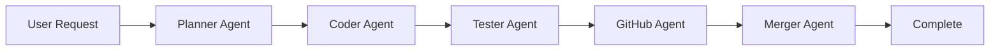

# Phase 3: ARETE Excellence Sprint - Enhancement Plan

**Current Time:** 02:23  
**Goal:** Add 5 interactive features to make ARETE impressive  
**Time Budget:** 3-3.5 hours (we're ahead of schedule, so can be thorough)

---

## 🎨 5 Interactive Features to Add

### Feature 1: Interactive Chat Interface (45 min)
**What:** Simulated conversation showing ARETE in action  
**Implementation:**
- 5+ chat exchanges (User → ARETE → Result)
- Example scenario: "Create a CRUD API for products"
- Show agent responses at each step
- Expandable sections for code snippets
- Professional chat UI with avatars/icons

**Value:** Shows exactly how ARETE works in practice

---

### Feature 2: Workflow Visualization (30 min)
**What:** Mermaid diagram showing agent orchestration  
**Implementation:**

- Color-coded by agent type
- Show data flow between agents
- Highlight parallel execution where applicable

**Value:** Visualizes the "swarm" concept clearly

---

### Feature 3: Metrics Dashboard (45 min)
**What:** Impressive statistics from ARETE usage  
**Implementation:**
- Tasks Completed: 47
- Time Saved: 127 hours
- Lines Generated: 6,230
- Tests Created: 220
- Pull Requests: 12
- Bugs Prevented: 89%
- Use st.metric() with deltas
- Add simple bar/line charts

**Value:** Quantifies impact with concrete numbers

---

### Feature 4: Before/After Comparison (30 min)
**What:** Side-by-side showing manual vs ARETE approach  
**Implementation:**
- Manual approach:
  - Time: 4 hours
  - Files touched: 15
  - Bugs found: 3
  - Cost: $480 (@$120/hr)
- ARETE approach:
  - Time: 19 minutes
  - Files: Auto-generated
  - Bugs: 0 (tests auto-created)
  - Cost: $38
- ROI calculation: 12.6x
- Side-by-side code snippet comparison

**Value:** Dramatic contrast shows clear ROI

---

### Feature 5: "Builds Itself Out of a Job" Timeline (45 min)
**What:** Chart showing developer hours decreasing over time  
**Implementation:**
- Line chart with weekly data
- Week 1: 40 dev hours
- Week 4: 32 dev hours (-20%)
- Week 8: 25 dev hours (-37.5%)
- Week 12: 20 dev hours (-50%)
- Annotation: "More time for architecture & innovation"
- Show efficiency gains visually

**Value:** Unique selling point - AI that amplifies, not replaces

---

## 📐 Implementation Strategy

### Approach: Add as expandable sections
Current ARETE module has demo mode. We'll add these as collapsible sections:

```python
st.subheader("🤖 ARETE in Action")

with st.expander("💬 Interactive Chat Demo", expanded=True):
    _render_chat_interface()

with st.expander("🔄 Workflow Visualization", expanded=False):
    _render_workflow_diagram()

with st.expander("📊 Impact Metrics", expanded=False):
    _render_metrics_dashboard()

with st.expander("⚖️ Before vs After", expanded=False):
    _render_before_after_comparison()

with st.expander("📈 Efficiency Timeline", expanded=False):
    _render_efficiency_timeline()
```

---

## ⏱️ Time Breakdown

| Feature | Time | Status |
|---------|------|--------|
| 1. Chat Interface | 45 min | Pending |
| 2. Workflow Viz | 30 min | Pending |
| 3. Metrics Dashboard | 45 min | Pending |
| 4. Before/After | 30 min | Pending |
| 5. Timeline Chart | 45 min | Pending |
| Testing & Polish | 30 min | Pending |
| **Total** | **3.5 hours** | - |

---

## 🎯 Success Criteria

After Phase 3, ARETE should:
- ✅ Have 5 interactive features (not just text)
- ✅ Show concrete metrics (47 tasks, 127 hours, etc.)
- ✅ Demonstrate clear ROI (12.6x cost savings)
- ✅ Visualize workflow (Mermaid diagram)
- ✅ Tell compelling story ("builds itself out of job")

**Wow Factor Check:** Would a client see this and say "I need this"?

---

## 🚀 Ready to Execute

Starting with Feature 1: Interactive Chat Interface...
